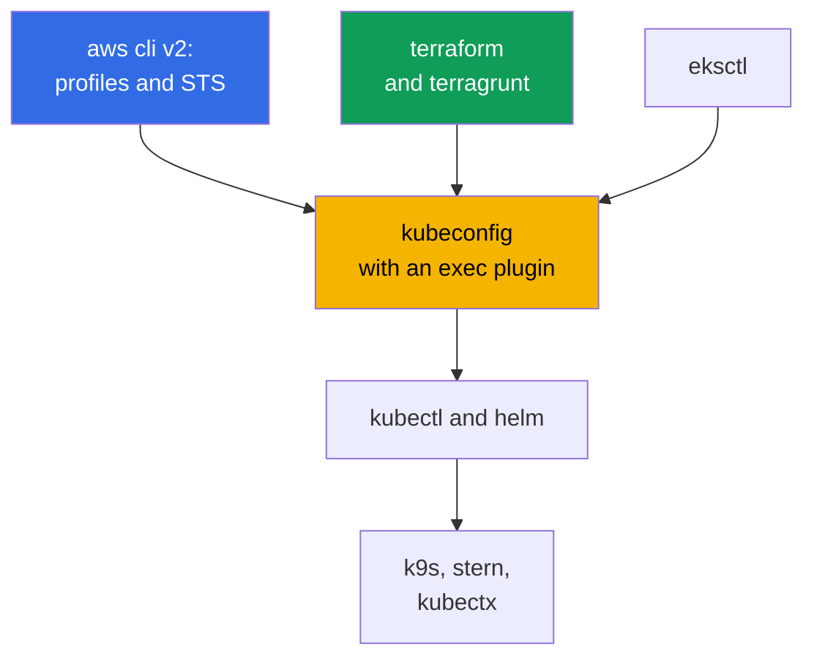
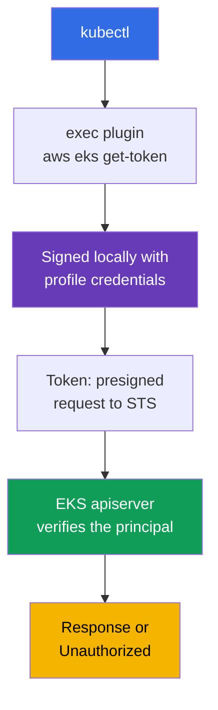
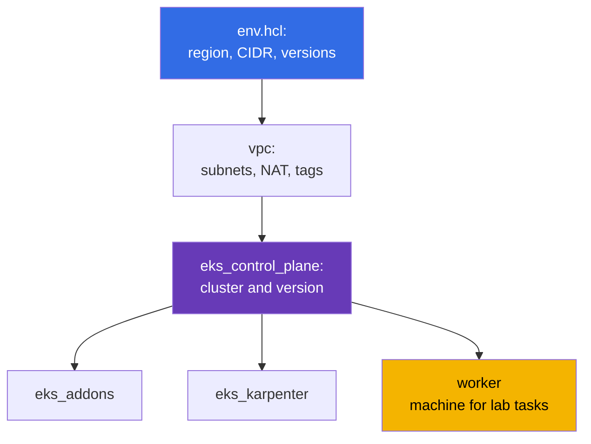

[Русская версия](ru.md) · [Versión en español](es.md) · [Version française](fr.md) · [Deutsche Version](de.md) · [ქართული ვერსია](ge.md) · [繁體中文版](tw.md) · [日本語版](jp.md)
# Chapter 0.5. Tools: aws cli, eksctl, terraform and terragrunt, helm, useful plugins

> **What comes next.** You already have an account and billing (chapter 0.1), IAM (0.2), VPC (0.3), and EC2 (0.4).
> What remains is to assemble your workstation: you know kubectl and helm, but EKS adds an
> AWS layer - aws cli profiles, an exec plugin for the token, IaC with terraform and terragrunt, managed
> addons. This chapter is about tools and habits, not new Kubernetes abstractions. Next,
> Part 1 begins: what EKS takes care of and what remains your responsibility (chapter 1), followed by the first cluster.

## 0.5.1. The EKS tool layer: what is added to kubectl

In a kubeadm cluster, the toolkit was short: kubectl, helm, SSH to nodes. EKS adds a second
layer: the AWS API creates the cluster, IAM grants access, nodes are born from a launch template, and
system components are installed either as a managed addon or as a chart.



The key idea: **kubectl on EKS is not self-contained**. It cannot authenticate unless a
working aws cli with the correct profile is available beside it. This explains almost all “strange” access errors.

## 0.5.2. aws cli v2: profiles, region, and the first command for any problem

Install it as a single package (the archive from the AWS website, `brew install awscli`, or a distribution package). One thing
matters: **v2, not v1** - it includes `aws configure sso` and the current `eks get-token`. Configuration
lives in `~/.aws/config` (profiles, regions, SSO) and `~/.aws/credentials` (keys, if there are any at all).
A profile is a named set of access parameters, and you always have several: one per account
and role; `prod` has its own `role_arn` and `source_profile`.

Select a profile with the `--profile` flag or the `AWS_PROFILE` variable, and a region with
`--region` or `AWS_REGION`. Variables are more convenient: terraform, eksctl, and helm providers can all see them.
Long-lived keys are unnecessary: IAM Identity Center grants access through STS (chapter 0.2),
configuration is done once, and after that you sign in in the browser. API responses are huge, and two
flags help: `--query` with a JMESPath expression and `--output table` for human-readable output.

It is more convenient to switch profiles and keep sessions with utilities rather than bare variables. `aws-vault`
keeps credentials in the system keychain and runs a command in a temporary session without exposing a
secret to the environment: `aws-vault exec prod -- terraform apply`. `granted` (the `assume` command)
quickly switches SSO profiles and opens the needed account console in a separate browser tab,
removing the confusion of “which account am I in now?”.

```bash
export AWS_PROFILE=dev             # which profile to use
export AWS_REGION=eu-central-1     # default region

# First command for ANY problem: account, identity ARN, userId
aws sts get-caller-identity

aws configure sso --profile prod   # once: start URL, account, role
aws sso login --profile prod       # every morning: temporary credentials for several hours

aws eks describe-cluster --name demo \
  --query 'cluster.{name:name,status:status,version:version}' --output table

aws ec2 describe-subnets --filters "Name=tag:karpenter.sh/discovery,Values=demo" \
  --query 'Subnets[].[SubnetId,AvailabilityZone,CidrBlock]' --output table
```

## 0.5.3. kubeconfig for EKS: how kubectl obtains a token

A single command writes kubeconfig: it adds the cluster, context, and user without breaking
existing entries.

```bash
# Minimum, plus options: custom context name, separate file, pin the profile
aws eks update-kubeconfig --region eu-central-1 --name demo \
  --alias eks-demo --kubeconfig ~/.kube/eks-demo.yaml --profile prod
```

Next comes the EKS-specific part: kubeconfig contains **neither a token nor a client certificate**. Instead, it has an
`exec` section that runs `aws eks get-token --cluster-name demo`. That command signs a
request with the current credentials, and the apiserver verifies the signature through IAM and obtains the principal,
which is then mapped to RBAC.



It is easy to invent extra fears here, so let us clarify the mechanics. The plugin **does not call
STS to obtain a token**: it locally signs a presigned request to
`sts:GetCallerIdentity` with your credentials, and that signed request is the token. The
apiserver makes the STS call when it verifies the presented token. Second, the plugin does not run for every HTTP request -
it returns an `ExecCredential` object with a `status.expirationTimestamp` field, and `client-go`
keeps the received credentials in process memory until that time. Therefore, a long-running `k9s`,
`kubectl get -w`, or a script in a loop does not hit AWS API call rate limits. The cache exists within
the process: each new `kubectl` starts the plugin again, but that is a local signature, not a network call.

```bash
# Until when client-go will reuse the current token
aws eks get-token --cluster-name demo --query 'status.expirationTimestamp'
```

There is still a throttling caveat, but it is not about the token itself: if profile credentials come from
SSO or through `assume-role`, the CLI actually calls IAM Identity Center and STS for them.
These responses are cached in `~/.aws/sso/cache` and `~/.aws/cli/cache`, so deleting them “just in
case” is a reliable way to create a burst of calls and receive `Throttling`.

- **There is no secret in kubeconfig**, the token is short-lived, and IAM plus RBAC determine permissions.
- **The token depends on the profile.** Change `AWS_PROFILE` - and the same context reaches
  the cluster as a different identity; the `--profile` flag at `update-kubeconfig` is written to `args` and removes this
  ambiguity. There will be many clusters, so `kubectl config get-contexts` and
  `use-context` will become habits (or `kubectx` will replace them).
- **`error: You must be logged in to the server (Unauthorized)`** is usually not about RBAC but about
  the principal: `aws sso login` has expired, someone else’s `AWS_PROFILE` is exported, or the role is not added
  to the cluster. Check in this order: `aws sts get-caller-identity`, then access entries (chapter 5).

## 0.5.4. eksctl: an excellent scout, a poor production owner

`eksctl` is the official CLI for EKS. With one command, it creates a cluster with a VPC, node group, roles,
and an OIDC provider. Internally, this is not direct API calls but CloudFormation generation.

```bash
eksctl create cluster --name demo --region eu-central-1 --version 1.34 \
  --nodegroup-name ng-default --node-type t3.medium --nodes 2 --managed

# Inspect a cluster created by anything
eksctl get cluster --region eu-central-1
eksctl get nodegroup --cluster demo --region eu-central-1
```

It is indispensable for bringing up a cluster for a day or viewing a summary of node groups and addons.
It fails for production: commands are **imperative** (state is not described in the repository), it has
its own **CloudFormation** underneath, invisible to your terraform, and changes outside IaC create **drift**.
A cluster partially created by eksctl and partially by terraform is almost impossible to delete cleanly.
The course rule: **eksctl and the console read, terraform writes** (chapter 4).

| Method | Advantages | Disadvantages | When to use |
|--------|-------|--------|-----------------|
| AWS Console | visual, no setup | not reproducible | inspect, explore |
| `eksctl` | cluster in one command | imperative, its own CFN | learning, ad hoc, reconnaissance |
| terraform + terragrunt | code in git, review | slower start, HCL required | everything that lives long |

## 0.5.5. terraform: why a cluster is described as code

An EKS cluster is not one resource but a VPC with tags, subnets, IAM roles, an OIDC provider, node
groups, addons, and security groups. You can assemble it manually, but repeat it in three environments and a year later -
no. Three things to understand before the first `apply`:

- **State.** The mapping “resource in code - resource in AWS” is stored in a state file. For
  a team, it is stored remotely with locking so that two engineers do not run `apply` at the same time.
  The repository defines the backend once in `terraform/environments/terragrunt.hcl`: an S3 bucket with
  `encrypt = true`, a DynamoDB table for locks, and a state key from the stack path.
- **Providers.** `aws` creates AWS resources; `kubernetes` and `helm` work inside the already
  running cluster. This creates the chicken-and-egg problem: the `kubernetes` provider is configured against a
  cluster that may not exist during planning, so the cluster and its contents are separated
  into different stacks.
- **Modules.** A reusable block with inputs and outputs: one for the VPC, one for the control plane, one
  for the node group. Course labs use modules from `terraform/modules`; the familiar commands are:
  `terraform init`, `plan`, `apply`, `destroy`.

## 0.5.6. terragrunt: how this course’s environments are organized

Terragrunt is a thin wrapper around terraform. It removes copy-paste: a shared backend for all
stacks, environment parameters in one place, dependencies between stacks, and one-command execution of a group of stacks.
Lab environments are assembled as follows: the lab directory contains `env.hcl` with parameters and one
subdirectory per stack, each with its own `terragrunt.hcl`.



What is actually in lab 02’s `env.hcl` (Karpenter, chapter 12): `region = "eu-central-1"`,
`vpc_default_cidr = "10.10.0.0/16"`, `stack_name`, environment name `env_name` from
`stack_name` plus `TF_VAR_USER_ID` and `TF_VAR_ENV_ID` (so each student has their own resource names), a
`subnets` map of two public and four private subnets (two for EKS, two for RDS) with the tags
`kubernetes.io/role/elb`, `kubernetes.io/role/internal-elb`, and `karpenter.sh/discovery`, NAT mode
per subnet (`DEFAULT`, `SINGLE`, `NONE`), `k8_version`, `node_type` (`ondemand` or
`spot`), instance types and a list of spot types, `root_volume` on `gp3`, and shared `tags` for cost
tracking. In addition to those shown, there are `ssh-keys` and `eks_fargate_system` stacks. Dependencies are described
by the `dependency` block: `eks_control_plane` declares `dependency "vpc"` and takes
`vpc_id` and subnet lists from its outputs, while terragrunt uses these blocks to build the execution graph.

```bash
terragrunt run-all apply     # all stacks respecting dependencies; destroy - in reverse order
terragrunt run-all output    # collect outputs of all stacks
```

A separate note about the binary. Terragrunt works equally with terraform and **OpenTofu** - an open
fork often selected to avoid dependence on the license. This course’s modules and `terragrunt.hcl`
are compatible with it; no code change is needed, only specify what performs orchestration:

```hcl
# terragrunt.hcl: exactly what runs plan and apply
terraform_binary = "tofu"
```

The same is configured through an environment variable (`TERRAGRUNT_TFPATH`, in newer versions `TG_TF_PATH`), which is
convenient in CI. Recent Terragrunt versions prefer `tofu` themselves when it is available, so on
machines with both binaries, fix the choice explicitly - otherwise the local machine and pipeline may calculate the plan with different tools.

## 0.5.7. helm: how controllers are installed, and when a managed addon is better

You already know Helm, so here are only the EKS specifics. Charts install almost the entire platform layer: AWS
Load Balancer Controller (chapter 26), Karpenter (12), external-dns and cert-manager (29),
kube-prometheus-stack (33), External Secrets (18), and Fluent Bit (34). Some AWS charts live in
`oci://public.ecr.aws`; the logic is the same: an explicit version plus your own `values.yaml` in git.

```bash
helm repo add eks https://aws.github.io/eks-charts && helm repo update

helm upgrade --install aws-load-balancer-controller eks/aws-load-balancer-controller \
  --namespace kube-system --version 1.13.0 \
  --set clusterName=demo --set serviceAccount.create=false \
  --set serviceAccount.name=aws-load-balancer-controller

helm get values aws-load-balancer-controller -n kube-system   # installed values
```

Public charts are pulled without authentication, but a company’s **own platform charts** usually
reside in private ECR, and helm must log in there separately from docker. It is an OCI registry,
so `helm registry login` works with the same token as docker:

```bash
# Log helm in to private ECR; the token lives for hours, repeat the CI step before install
aws ecr get-login-password --region eu-central-1 \
  | helm registry login --username AWS --password-stdin \
    123456789012.dkr.ecr.eu-central-1.amazonaws.com

# Then install the chart as usual, but with an oci link and explicit version
helm upgrade --install platform-base \
  oci://123456789012.dkr.ecr.eu-central-1.amazonaws.com/charts/platform-base \
  --version 2.4.1 -n platform -f values-prod.yaml
```

The user name is always literally `AWS`, and the password is a temporary token, so in a pipeline this is a
step before installation, not a stored secret. The same IAM role grants pull permissions as it does for
images, while cross-account access comes from the repository policy (chapter 20).

Two habits: **never omit `--version`** (otherwise the cluster changes itself at the next `upgrade`)
and keep **values in a file**, not in `--set` from someone’s bash history. When there are many
charts, keep them declarative: `helmfile` describes the list of releases with versions and paths to
`values.yaml` in one `helmfile.yaml`, and `helmfile apply` brings the cluster to that description - the same
“code in git” principle as terraform, only for helm. AWS offers some components (VPC CNI,
kube-proxy, CoreDNS, EBS CSI, Pod Identity Agent) as **managed addons**:
AWS calculates compatibility, and updates proceed through the cluster API. Less freedom, less work.

| Criterion | Managed addon | Helm chart |
|----------|---------------|-----------|
| Compatibility with cluster version | AWS checks it | you check it |
| Update | EKS API, visible in IaC and console | `helm upgrade` in your pipeline |
| Values flexibility | limited | complete |
| Who handles the incident | AWS support has context | you |

The default practice: base components are managed addons; everything application-facing and fast-
evolving (Karpenter, LB Controller, observability) uses helm. The boundary is in chapter 37.

## 0.5.8. Useful plugins and utilities

| Tool | One-line benefit |
|------------|----------------------|
| `kubectx` / `kubens` | switch context and namespace without editing kubeconfig |
| `k9s` | terminal UI: pods, logs, events, exec in two keystrokes |
| `stern` | logs from all pods at once by prefix or selector |
| `krew` | kubectl plugin manager used to install the rest |
| `kubectl-neat` | removes service noise from `get -o yaml` |
| `eks-node-viewer` | EKS node map with utilization and cost, needed for Karpenter work |
| `kubectl-k8i` | node table with utilization, instance type, spot or on-demand, zone, and NodePool |
| `jq` | filter aws cli JSON where `--query` is no longer convenient |
| `yq` | the same technique for YAML: chart values, manifests, kubeconfig |

```bash
kubectx eks-demo && kubens kube-system   # context and namespace
stern -n kube-system karpenter           # logs from all Karpenter pods
aws eks describe-nodegroup --cluster-name demo --nodegroup-name ng-default | jq '.nodegroup'
```

Plugins deserve a separate note because half of everyday conveniences live exactly there.
The mechanism is simple: **any executable named `kubectl-<name>` in `PATH` becomes the
`kubectl <name>` subcommand**. You do not need to install them manually; **krew** is the
plugin manager for that, with an index, search, and updates:

```bash
kubectl krew update                  # update the plugin index
kubectl krew search                  # entire catalog; or by word: krew search node
kubectl krew info k8i                # what it is, version, home page
kubectl krew install k8i             # install it
kubectl krew list                    # what is already installed
kubectl krew upgrade                 # update everything installed
kubectl krew uninstall k8i           # remove it

kubectl plugin list                  # kubectl’s view: what it sees in PATH
```

Plugins do not have to come only from the primary index: add a custom or corporate index,
after which the plugin is installed with a prefix (`kubectl krew index add
<name> <git-url>`, then `kubectl krew install <name>/<plugin>`). Remember that a plugin
is a third-party executable that runs with your permissions and your kubeconfig: for
production environments, approve the plugin list just like any other dependency (chapter 20).

An example of a plugin especially useful on EKS is **`kubectl-k8i`**. Standard `kubectl get nodes`
shows a node as an abstract machine, while EKS usually raises different questions: is it spot or
on-demand, what instance type is it, which zone is it in, which NodePool created it, who created it (Karpenter,
Cluster Autoscaler, or Spot.io), and how heavily is it actually utilized relative to requests and limits?
`k8i` collects this in one table with utilization percentages and can filter and sort by
any of those attributes, group nodes by taint, and with the `analyze` subcommand show which
workloads run on selected nodes and how much their limits diverge from requests.

```bash
# Plugin: github.com/ViktorUJ/kubectl-k8i (available in krew, or binary from releases)
kubectl krew install k8i

kubectl k8i                                    # all nodes: utilization, type, zone, pool
kubectl k8i --filter ec2_type=spot             # spot nodes only (chapter 13)
kubectl k8i --autoscaler karpenter --sort cpu_load=desc   # Karpenter nodes by utilization
kubectl k8i --group-by taint                   # existing logical node groups
kubectl k8i analyze --autoscaler karpenter --cpu-overcommit 100   # who requests five times less
```

Usage values come from metrics-server: without it, utilization columns are zero, while
requests and limits remain visible. This will be useful in chapters 12 and 13 (NodePool, spot) and especially
in chapter 14, which examines the gap between requests, limits, and actual consumption.

## 0.5.9. Work-environment hygiene

- **Versions are pinned.** kubectl stays within one minor version of the cluster; terraform and
  terragrunt are pinned in the repository; chart versions are in code: otherwise `apply` gives a different result.
- **Profiles are isolated by account.** Profile names match environments (`dev`, `stage`,
  `prod`); `prod` has its own `role_arn` and MFA. No `default` profiles leading to production.
  There are no long-lived keys at all: `aws configure sso` plus `aws sso login`, with a lifetime in hours
  (chapter 0.2). An `AKIA...` key in `~/.aws/credentials` is an incident waiting to happen.
- **Check region and account before a destructive command.** `aws sts get-caller-identity` and
  `kubectl config current-context` before `run-all destroy` take five seconds, while account highlighting
  in the shell prompt removes the entire class of “deleted in the wrong place” errors.
- **CLI hints are enabled.** aws cli v2 has built-in auto-prompt: `on-partial` mode suggests
  subcommands and parameters but intervenes only when a command is incomplete or fails
  validation. During on-call work, this saves time when building long `--query` and `--filters`.

```bash
aws configure set cli_auto_prompt on-partial   # modes: on, on-partial, off
```

## 0.5.10. How this is applied in production

- **Only IaC creates the cluster.** A repository with terraform or terragrunt, PR review,
  and application from CI under a separate role. The console is read-only for humans.
- **A unified tool image.** A container or devcontainer with pinned versions of
  aws cli, kubectl, helm, terraform, and terragrunt: engineers and CI use the same toolkit.
- **Access through SSO and roles.** A role is granted temporarily, kubeconfig obtains a token through
  the exec plugin, and access is revoked in Identity Center rather than by editing the cluster.
- **Keep eksctl as a diagnostic tool** for `get nodegroup` and `get addon`, but
  do not touch production with it. Delegate what can be a managed addon to AWS; install the rest as
  charts with explicit versions through GitOps (chapter 44).

## 0.5.11. Mini-glossary

- **aws cli v2** - the primary AWS CLI; configuration is in `~/.aws/config`, and access is selected
  through `--profile` or `AWS_PROFILE`. A **profile** is a named parameter set: region,
  role, SSO. **`aws sts get-caller-identity`** is the “who am I” command: account, ARN, userId.
  **`aws-vault`** stores credentials in the keychain and runs commands in a temporary session;
  **`granted`** (`assume`) quickly switches SSO profiles and signs in to the console.
- **kubeconfig exec plugin** - an `exec` section that invokes `aws eks get-token`; there is no long-lived
  token in the file, and `client-go` caches received credentials until
  `status.expirationTimestamp`. **eksctl** is the official EKS CLI; it works through
  CloudFormation and is imperative.
- A **kubectl plugin** is a `kubectl-<name>` file in `PATH`, available as `kubectl <name>`.
  **krew** is a plugin manager: index, `search`, `install`, `upgrade`; it supports custom
  indexes. **`kubectl plugin list`** shows what kubectl sees in `PATH`.
- **State** is a terraform state file, stored remotely with locking for a team.
  A **provider** is a terraform plugin (`aws`, `kubernetes`, `helm`).
- **terragrunt** is a terraform wrapper: shared backend, `env.hcl`, `dependency`, `run-all`,
  DRY modules without copy-paste. **OpenTofu** is an open terraform fork compatible with course
  modules; it is selected with `terraform_binary = "tofu"`. A **stack** is a directory with one
  `terragrunt.hcl`, applied as a unit. **helmfile** is a declarative description of a set of
  helm releases with versions and values in one file. A **managed addon** is a cluster component
  whose version and update are managed by EKS.

## 0.5.12. Chapter summary

- aws cli v2 plus profiles and `AWS_REGION` are the foundation of everything; `aws sts get-caller-identity` is the first
  command for an unclear error, while `--query` and `--output table` make API responses readable.
- `aws eks update-kubeconfig` creates a context without secrets: `aws eks
  get-token` obtains the token, so `Unauthorized` usually means the wrong profile or expired SSO (chapter 5).
- eksctl is good for quick clusters and reconnaissance but brings its own CloudFormation and causes drift;
  production is described with terraform and terragrunt (chapter 4), while terragrunt adds `env.hcl`,
  splitting into stacks, and dependencies between them: this is how course labs are assembled.
- Helm installs controllers with explicit versions and values in git; base components are more often
  managed addons (chapter 37). Plugins and environment hygiene (pinning versions, isolating profiles,
  rejecting long-lived keys, checking the account before `destroy`) save time and money.

## 0.5.13. How this helps in real work

The tool layer determines response speed during an incident. When nodes do not join the
cluster (chapter 45), within a minute you switch the profile, inspect the node group through `eksctl get
nodegroup`, read logs through `stern`, and check subnet tags through `describe-subnets`.
When you need to repeat an environment in another account, change `env.hcl` and run `run-all`.

## 0.5.14. Self-check questions

1. How does `~/.aws/config` differ from `~/.aws/credentials`, and what does `AWS_PROFILE` do?
2. Why do you run `aws sts get-caller-identity` first for an access problem?
3. What is in kubeconfig for EKS instead of a token, and how does kubectl obtain access?
4. `kubectl` returns `Unauthorized`. Which three causes are checked before RBAC?
5. What is eksctl suitable for, and why is it not used to create a production cluster?
6. What does terragrunt add on top of terraform, and how are the `vpc` and `eks_control_plane` stacks related?
7. When is a component better installed as a managed addon, and when as a helm chart?
8. How does kubectl find plugins, and how does krew help? Which commands search and update them?
9. Why does `kubectl get nodes` on EKS not answer every question about nodes, and what does `k8i` add?

## Practice

Part 0 has no labs of its own, but this is a convenient place to understand how course labs are
launched. Environments are deployed by Makefile targets at the repository root: a target copies the lab directory into a working
directory and runs `terragrunt run-all` there with parallelism equal to the number of cores. The lab number
is passed by the `TASK` variable; environment identifiers are `USER_ID` and `ENV_ID` (they become part of
`env_name`, so different students’ resources do not conflict).

```bash
TASK=02 make run_eks_task          # deploy lab 02 environment (Karpenter, chapter 12)
make output_eks_task               # stack outputs: cluster parameters, worker-machine address
TASK=02 make delete_eks_task       # destroy the environment to stop paying for NAT, cluster, and nodes
TASK=02 make run_eks_task_clean    # clean the working directory and deploy again
```

After deployment, you log in to the environment worker machine, obtain kubeconfig, and work with the familiar
kubectl. Tasks are checked by the `check_result` command on the worker machine: it runs an
automatic verification of the cluster state and tells you whether the task passed. First, run
`aws sts get-caller-identity` and `kubectl config current-context`. Next comes Part 1:
what exactly EKS takes care of and why a managed control plane does not mean a managed cluster.

---
[Contents](../README.md) · [Chapter 0.4](../00-4-ec2/en.md) · [Chapter 1](../01/en.md)
