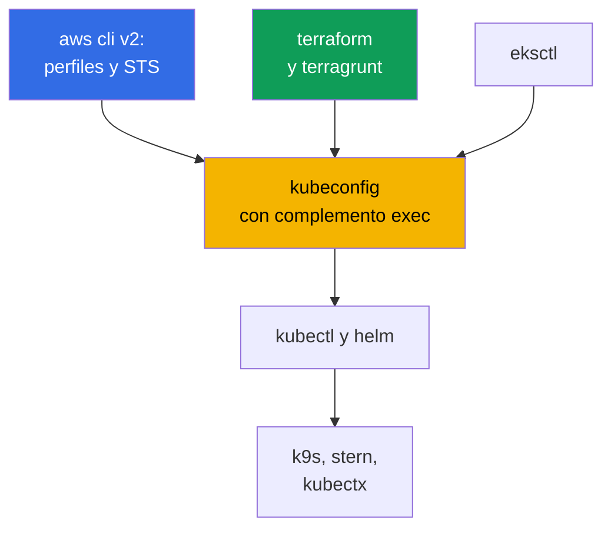
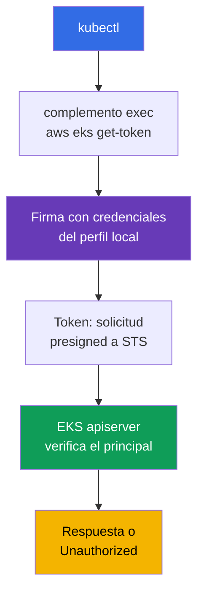
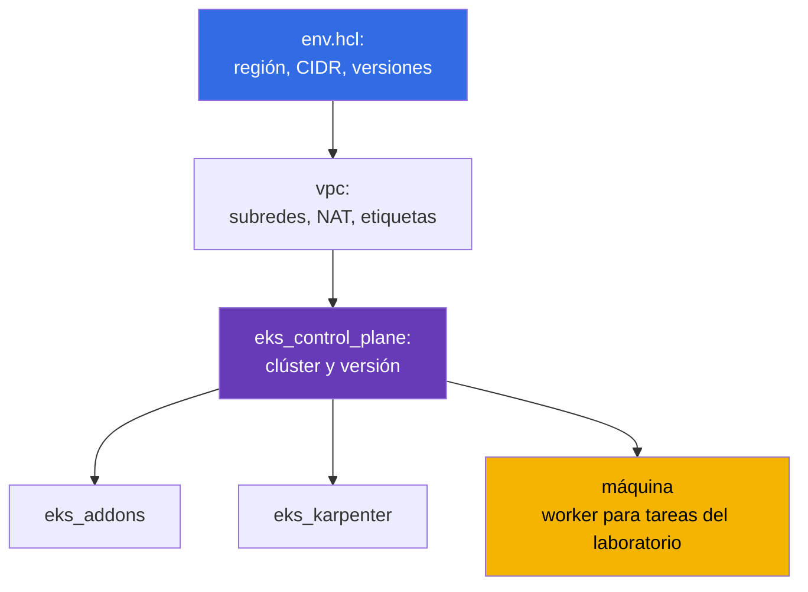

[Русская версия](ru.md) · [Eng version](en.md) · [Version française](fr.md) · [Deutsche Version](de.md) · [ქართული ვერსია](ge.md) · [繁體中文版](tw.md) · [日本語版](jp.md)
# Capítulo 0.5. Herramientas: aws cli, eksctl, terraform y terragrunt, helm y complementos útiles

> **Qué sigue.** Ya tienes la cuenta y la facturación (capítulo 0.1), IAM (0.2), VPC (0.3) y EC2 (0.4).
> Solo queda preparar el entorno de trabajo: ya conoces kubectl y helm, pero en EKS se les suma la capa de
> AWS: perfiles de aws cli, el complemento exec para el token, IaC con terraform y terragrunt, y
> addons gestionados. Este capítulo trata de herramientas y hábitos, no de nuevas abstracciones de Kubernetes. Después
> comienza la Parte 1: qué asume EKS y qué sigue siendo tu responsabilidad (capítulo 1), y el primer clúster.

## 0.5.1. La capa de herramientas de EKS: qué se añade a kubectl

En un clúster kubeadm el conjunto era breve: kubectl, helm y ssh a los nodos. En EKS aparece un segundo
circuito: la API de AWS crea el clúster, IAM concede el acceso, los nodos nacen de un launch template y
los componentes del sistema se instalan como managed addon o mediante un chart.



La idea clave: **kubectl en EKS no es autónomo**. No se autentica si no tiene junto a él
un aws cli funcional con el perfil correcto. De ahí proceden casi todos los errores de acceso
«extraños».

## 0.5.2. aws cli v2: perfiles, región y el primer comando ante cualquier problema

Se instala con un único paquete (archivo del sitio de AWS, `brew install awscli`, paquete de la distribución). Lo importante
es una cosa: **v2, no v1** - incluye `aws configure sso` y un `eks get-token` actualizado. La configuración
vive en `~/.aws/config` (perfiles, regiones, SSO) y en `~/.aws/credentials` (claves, si es que existen).
Un perfil es un conjunto con nombre de parámetros de acceso, y siempre hay varios: uno por cuenta y rol;
`prod` tiene su propio `role_arn` y `source_profile`.

El perfil se selecciona con la bandera `--profile` o la variable `AWS_PROFILE`, y la región con `--region` o
`AWS_REGION`. Las variables son más cómodas: terraform, eksctl y los proveedores de helm también las ven.
No hacen falta claves de larga duración: IAM Identity Center concede el acceso mediante STS (capítulo 0.2),
la configuración se realiza una vez y después se inicia sesión en el navegador. Las respuestas de la API son enormes,
y dos banderas ayudan: `--query` con una expresión JMESPath y `--output table` para leerlas como persona.

Es más cómodo cambiar perfiles y guardar sesiones con utilidades que con variables sin más. `aws-vault`
guarda las credenciales en el keychain del sistema y ejecuta un comando en una sesión temporal, sin exponer
el secreto en el entorno: `aws-vault exec prod -- terraform apply`. `granted` (el comando `assume`)
cambia rápidamente los perfiles SSO y abre la consola de la cuenta deseada en otra pestaña del
navegador, eliminando la confusión de «en qué cuenta estoy ahora».

```bash
export AWS_PROFILE=dev             # qué perfil usar
export AWS_REGION=eu-central-1     # región predeterminada

# Primer comando ante CUALQUIER problema: cuenta, ARN de identidad, userId
aws sts get-caller-identity

aws configure sso --profile prod   # una vez: start URL, cuenta, rol
aws sso login --profile prod       # cada mañana: credenciales temporales durante varias horas

aws eks describe-cluster --name demo \
  --query 'cluster.{name:name,status:status,version:version}' --output table

aws ec2 describe-subnets --filters "Name=tag:karpenter.sh/discovery,Values=demo" \
  --query 'Subnets[].[SubnetId,AvailabilityZone,CidrBlock]' --output table
```

## 0.5.3. kubeconfig para EKS: cómo obtiene kubectl el token

kubeconfig se escribe con un solo comando: añade el clúster, el contexto y el usuario, sin romper
las entradas existentes.

```bash
# Mínimo, más opciones: nombre propio para el contexto, archivo independiente, perfil fijado
aws eks update-kubeconfig --region eu-central-1 --name demo \
  --alias eks-demo --kubeconfig ~/.kube/eks-demo.yaml --profile prod
```

Después viene la especificidad de EKS: en kubeconfig **no hay token ni certificado de cliente**. En su lugar hay
una sección `exec` que ejecuta `aws eks get-token --cluster-name demo`. Este firma una
solicitud con las credenciales actuales, y el apiserver verifica la firma mediante IAM y obtiene el principal,
que después se asigna a RBAC.



Aquí es fácil inventar preocupaciones innecesarias, así que aclaremos el mecanismo. El complemento **no solicita
un token a STS**: firma localmente con tus credenciales una solicitud presigned a
`sts:GetCallerIdentity`, y esa solicitud firmada es el token. El apiserver es quien realiza
la llamada a STS al verificar lo presentado. Segundo: el complemento no trabaja para cada solicitud HTTP:
devuelve un objeto `ExecCredential` con el campo `status.expirationTimestamp`, y `client-go`
mantiene las credenciales obtenidas en la memoria del proceso hasta ese momento. Por eso un `k9s`
de larga duración, `kubectl get -w` o un script en bucle no chocan con los límites de frecuencia de las llamadas a la API de AWS.
La caché vive dentro del proceso: cada nuevo `kubectl` ejecuta de nuevo el complemento, pero es una firma local,
no una llamada de red.

```bash
# Hasta qué momento client-go reutilizará el token actual
aws eks get-token --cluster-name demo --query 'status.expirationTimestamp'
```

Aun así, existe una salvedad sobre throttling, pero no afecta al token: si las credenciales del perfil proceden de
SSO o de `assume-role`, CLI sí consulta IAM Identity Center y STS. Esas respuestas se
almacenan en caché en `~/.aws/sso/cache` y `~/.aws/cli/cache`, así que borrarlas «por si acaso»
es una forma segura de provocar una ráfaga de llamadas y recibir `Throttling`.

- **No hay ningún secreto en kubeconfig**, el token dura poco y los permisos los determina IAM junto con RBAC.
- **El token depende del perfil.** Cambia `AWS_PROFILE` y el mismo contexto irá al clúster con
  otra identity; la bandera `--profile` en `update-kubeconfig` se escribe en `args` y elimina esa
  ambigüedad. Habrá muchos clústeres, así que `kubectl config get-contexts` y
  `use-context` se volverán hábitos (o los sustituirá `kubectx`).
- **`error: You must be logged in to the server (Unauthorized)`** normalmente no trata de RBAC, sino del
  principal: caducó `aws sso login`, se exportó el `AWS_PROFILE` equivocado o el rol no se añadió
  al clúster. Orden de comprobación: `aws sts get-caller-identity` y después access entries (capítulo 5).

## 0.5.4. eksctl: un excelente explorador, un mal propietario de producción

`eksctl` es la CLI oficial de EKS. Con un comando crea un clúster con VPC, node group, roles
y proveedor OIDC. Internamente no usa llamadas directas a la API, sino que genera CloudFormation.

```bash
eksctl create cluster --name demo --region eu-central-1 --version 1.34 \
  --nodegroup-name ng-default --node-type t3.medium --nodes 2 --managed

# Exploración de un clúster creado por cualquier medio
eksctl get cluster --region eu-central-1
eksctl get nodegroup --cluster demo --region eu-central-1
```

Es insustituible para levantar un clúster por un día o ver un resumen de node groups y addons.
Para producción falla: los comandos son **imperativos** (el estado no se describe en el repositorio), por debajo hay
**su propio CloudFormation**, invisible para tu terraform, y modificar fuera de IaC produce **deriva**.
Un clúster creado en parte con eksctl y en parte con terraform es casi imposible de eliminar limpiamente.
Regla del curso: **eksctl y la consola leen, terraform escribe** (capítulo 4).

| Método | Ventajas | Desventajas | Cuándo usarlo |
|--------|----------|-------------|---------------|
| Consola de AWS | visual, sin preparación | no es reproducible | mirar, probar |
| `eksctl` | clúster con un comando | imperativo, su propio CFN | aprendizaje, ad hoc, exploración |
| terraform + terragrunt | código en git, review | inicio más lento, requiere HCL | todo lo que perdura |

## 0.5.5. terraform: por qué el clúster se describe como código

Un clúster EKS no es un único recurso, sino una VPC con etiquetas, subredes, roles IAM, proveedor OIDC, node
groups, addons y security groups. Puedes montarlo a mano, pero repetirlo en tres entornos y un año después
no. Hay tres cosas que debes entender antes del primer `apply`:

- **State.** La correspondencia «recurso en el código - recurso en AWS» se guarda en el archivo de estado. Para
  un equipo se ubica de forma remota y con bloqueo, para que dos ingenieros no ejecuten `apply` a la vez.
  En el repositorio el backend se define una vez en `terraform/environments/terragrunt.hcl`: un bucket S3 con
  `encrypt = true`, una tabla DynamoDB para bloqueos y la clave de estado a partir de la ruta del stack.
- **Providers.** `aws` crea recursos de AWS; `kubernetes` y `helm` trabajan dentro del clúster ya
  levantado. De ahí el problema de la gallina y el huevo: el proveedor `kubernetes` se configura contra un
  clúster que puede no existir durante la planificación, por eso el clúster y su contenido se separan
  en distintos stacks.
- **Módulos.** Un bloque reutilizable con entradas y salidas: uno para VPC, uno para control plane y otro para
  node group. Los laboratorios del curso usan módulos de `terraform/modules`; los comandos son los habituales:
  `terraform init`, `plan`, `apply`, `destroy`.

## 0.5.6. terragrunt: cómo se organizan los entornos de este curso

Terragrunt es una capa fina sobre terraform. Elimina la duplicación: un backend común para todos los
stacks, parámetros del entorno en un lugar, dependencias entre stacks y ejecución de un grupo de stacks
con un comando. Los entornos de los laboratorios se organizan así: el directorio del laboratorio contiene un
`env.hcl` con parámetros y un subdirectorio para cada stack, cada uno con su propio `terragrunt.hcl`.



Lo que realmente contiene `env.hcl` del laboratorio 02 (Karpenter, capítulo 12): `region = "eu-central-1"`,
`vpc_default_cidr = "10.10.0.0/16"`, `stack_name`, el nombre del entorno `env_name` a partir de `stack_name`
más `TF_VAR_USER_ID` y `TF_VAR_ENV_ID` (por eso cada estudiante tiene sus propios nombres de recursos), el mapa
`subnets` de dos subredes públicas y cuatro privadas (dos para EKS, dos para RDS) con las etiquetas
`kubernetes.io/role/elb`, `kubernetes.io/role/internal-elb` y `karpenter.sh/discovery`, el modo
NAT por subred (`DEFAULT`, `SINGLE`, `NONE`), `k8_version`, `node_type` (`ondemand` o `spot`), tipos
de instancia y la lista de tipos spot, `root_volume` en `gp3`, y las `tags` comunes para controlar
los gastos. Además de los mostrados, existen los stacks `ssh-keys` y `eks_fargate_system`. Las dependencias
se describen con el bloque `dependency`: `eks_control_plane` declara `dependency "vpc"` y toma de sus salidas
`vpc_id` y las listas de subredes; terragrunt construye el grafo de ejecución a partir de esos bloques.

```bash
terragrunt run-all apply     # todos los stacks respetando dependencias; destroy en orden inverso
terragrunt run-all output    # recopilar las salidas de todos los stacks
```

Una nota aparte sobre el binario. Terragrunt funciona igual con terraform y con **OpenTofu**, el
fork abierto que se suele elegir para no depender de la licencia. Los módulos y `terragrunt.hcl` de este
curso son compatibles con él; no hace falta cambiar código, basta con indicar qué debe orquestar:

```hcl
# terragrunt.hcl: con qué ejecutar exactamente plan y apply
terraform_binary = "tofu"
```

También se define con la variable de entorno (`TERRAGRUNT_TFPATH`, en versiones recientes `TG_TF_PATH`), lo que
es práctico en CI. Las versiones nuevas de Terragrunt prefieren `tofu` automáticamente si está disponible, por
lo que en máquinas donde están ambos binarios se fija la elección explícitamente; de lo contrario, el plan local y
el del pipeline pueden calcularse con herramientas diferentes.

## 0.5.7. helm: cómo se instalan los controladores y cuándo es mejor un managed addon

Ya conoces Helm, así que aquí solo trataremos EKS. Casi toda la capa de plataforma se instala con charts: AWS
Load Balancer Controller (capítulo 26), Karpenter (12), external-dns y cert-manager (29),
kube-prometheus-stack (33), External Secrets (18) y Fluent Bit (34). Parte de los charts de AWS vive en
`oci://public.ecr.aws`; la lógica es la misma: versión explícita más tu propio `values.yaml` en git.

```bash
helm repo add eks https://aws.github.io/eks-charts && helm repo update

helm upgrade --install aws-load-balancer-controller eks/aws-load-balancer-controller \
  --namespace kube-system --version 1.13.0 \
  --set clusterName=demo --set serviceAccount.create=false \
  --set serviceAccount.name=aws-load-balancer-controller

helm get values aws-load-balancer-controller -n kube-system   # con qué values está instalado
```

Los charts públicos se descargan sin autenticación, pero los **charts de plataforma propios** de la empresa
suelen estar en un ECR privado, y helm debe iniciar sesión por separado de docker. Es un registro OCI, por
lo que `helm registry login` funciona con el mismo token que docker:

```bash
# Inicio de sesión de helm en ECR privado; el token dura horas, en CI se repite antes de install
aws ecr get-login-password --region eu-central-1 \
  | helm registry login --username AWS --password-stdin \
    123456789012.dkr.ecr.eu-central-1.amazonaws.com

# Después el chart se instala como siempre, pero por enlace oci y con versión explícita
helm upgrade --install platform-base \
  oci://123456789012.dkr.ecr.eu-central-1.amazonaws.com/charts/platform-base \
  --version 2.4.1 -n platform -f values-prod.yaml
```

El nombre de usuario siempre es literalmente `AWS`, y la contraseña es un token temporal, por lo que en el
pipeline es un paso antes de la instalación, no un secreto guardado. La misma función IAM que sirve para las
imágenes concede los permisos de pull, y el acceso cross-account lo da la política del repositorio (capítulo 20).

Dos hábitos: **nunca sin `--version`** (de lo contrario, el clúster cambia solo con el siguiente `upgrade`)
y **values en un archivo**, no en `--set` de algún historial de bash. Cuando hay muchos charts, se mantienen
de forma declarativa: `helmfile` describe en un `helmfile.yaml` la lista de releases con versiones y rutas a
`values.yaml`, y `helmfile apply` lleva el clúster a esa descripción: el mismo principio de «código en git»
que terraform, pero para helm. AWS ofrece algunos componentes (VPC CNI, kube-proxy, CoreDNS, EBS CSI y
Pod Identity Agent) como **managed addons**: AWS calcula la compatibilidad y la actualización se realiza mediante
la API del clúster. Menos libertad, menos trabajo.

| Criterio | Managed addon | Chart de Helm |
|----------|---------------|---------------|
| Compatibilidad con la versión del clúster | la comprueba AWS | la compruebas tú |
| Actualización | API de EKS, visible en IaC y consola | `helm upgrade` en tu pipeline |
| Flexibilidad de values | limitada | total |
| Quién investiga el incidente | AWS support tiene contexto | tú |

La práctica predeterminada: componentes base como managed addons; todo lo aplicado y de evolución rápida
(Karpenter, LB Controller, observabilidad) con helm. La frontera se explica en el capítulo 37.

## 0.5.8. Complementos y utilidades útiles

| Herramienta | Utilidad en una línea |
|-------------|-----------------------|
| `kubectx` / `kubens` | cambiar de contexto y namespace sin editar kubeconfig |
| `k9s` | UI de terminal: pods, logs, eventos y exec en dos pulsaciones |
| `stern` | logs de todos los pods a la vez por prefijo o selector |
| `krew` | gestor de complementos kubectl, mediante el que se instala lo demás |
| `kubectl-neat` | elimina el ruido de servicio de `get -o yaml` |
| `eks-node-viewer` | mapa de nodos EKS con carga y coste, necesario al trabajar con Karpenter |
| `kubectl-k8i` | tabla de nodos con carga, tipo de instancia, spot u on-demand, zona y NodePool |
| `jq` | filtrar JSON de aws cli cuando `--query` ya resulta incómodo |
| `yq` | la misma técnica para YAML: values de charts, manifiestos y kubeconfig |

```bash
kubectx eks-demo && kubens kube-system   # contexto y namespace
stern -n kube-system karpenter           # logs de todos los pods de Karpenter
aws eks describe-nodegroup --cluster-name demo --nodegroup-name ng-default | jq '.nodegroup'
```

Conviene hablar de los complementos por separado, porque la mitad de las comodidades diarias viven
precisamente allí. El mecanismo es simple: **cualquier archivo ejecutable llamado `kubectl-<nombre>` en `PATH`
se convierte en el subcomando `kubectl <nombre>`**. No hay que instalarlos a mano; para eso existe **krew**,
un gestor de complementos con índice, búsqueda y actualización:

```bash
kubectl krew update                  # actualizar el índice de complementos
kubectl krew search                  # catálogo completo; o por palabra: krew search node
kubectl krew info k8i                # qué es, versión, página principal
kubectl krew install k8i             # instalar
kubectl krew list                    # qué ya está instalado
kubectl krew upgrade                 # actualizar todos los instalados
kubectl krew uninstall k8i           # desinstalar

kubectl plugin list                  # vista de kubectl: qué detecta en PATH
```

Los complementos no solo existen en el índice principal: puedes añadir uno propio o corporativo como índice
adicional y después instalar el complemento con un prefijo (`kubectl krew index add
<nombre> <git-url>`, después `kubectl krew install <nombre>/<complemento>`). Recuerda, sin embargo, que un complemento
es un ejecutable ajeno que se ejecuta con tus permisos y tu kubeconfig: para entornos de
producción, la lista de complementos se aprueba igual que cualquier otra dependencia (capítulo 20).

Un ejemplo de complemento útil específicamente en EKS es **`kubectl-k8i`**. El comando estándar `kubectl get nodes`
muestra el nodo como una máquina abstracta, pero en EKS las preguntas suelen ser otras: si es spot u
on-demand, qué tipo de instancia tiene, en qué zona está, de qué NodePool procede, quién lo creó
(Karpenter, Cluster Autoscaler o Spot.io), y cuánto está realmente cargado frente a requests y limits.
`k8i` reúne todo eso en una tabla con porcentajes de carga y permite filtrar y ordenar por cualquiera de
estos rasgos, agrupar nodos por taint y, con el subcomando `analyze`, mostrar qué cargas viven
en los nodos seleccionados y cuánto difieren sus limits de los requests.

```bash
# Complemento: github.com/ViktorUJ/kubectl-k8i (existe en krew, o binario de releases)
kubectl krew install k8i

kubectl k8i                                    # todos los nodos: carga, tipo, zona, pool
kubectl k8i --filter ec2_type=spot             # solo nodos spot (capítulo 13)
kubectl k8i --autoscaler karpenter --sort cpu_load=desc   # nodos Karpenter por carga
kubectl k8i --group-by taint                   # qué grupos lógicos de nodos existen
kubectl k8i analyze --autoscaler karpenter --cpu-overcommit 100   # quién solicita cinco veces menos
```

Los valores de usage proceden de metrics-server: sin él, las columnas de carga serán cero, pero los
requests y limits seguirán siendo visibles. Esto será útil en los capítulos 12 y 13 (NodePool, spot) y sobre
todo en el capítulo 14, que analiza precisamente la diferencia entre requests, limits y consumo real.

## 0.5.9. Higiene del entorno de trabajo

- **Las versiones se fijan.** kubectl dentro de una versión menor del clúster; terraform y
  terragrunt se fijan en el repositorio; las versiones de charts, en el código: de otro modo, `apply` da resultados distintos.
- **Los perfiles se aíslan por cuentas.** Los nombres de perfil coinciden con los entornos (`dev`, `stage`,
  `prod`); `prod` tiene su propio `role_arn` y MFA. No uses perfiles `default` que lleven a producción.
  No hay claves de larga duración en absoluto: `aws configure sso` más `aws sso login`, con duración de horas
  (capítulo 0.2). Una clave `AKIA...` en `~/.aws/credentials` es un incidente esperando ocurrir.
- **La región y la cuenta se comprueban antes de un comando destructivo.** `aws sts get-caller-identity` y
  `kubectl config current-context` antes de `run-all destroy` cuestan cinco segundos, y resaltar la
  cuenta en el prompt de shell evita toda una clase de errores de «eliminé en el lugar equivocado».
- **Las sugerencias de CLI están activadas.** aws cli v2 tiene auto-prompt integrado: el modo `on-partial`
  sugiere subcomandos y parámetros, pero interviene solo cuando el comando está incompleto o no
  supera la validación. Durante una guardia ahorra tiempo al construir `--query` y `--filters` largos.

```bash
aws configure set cli_auto_prompt on-partial   # modos: on, on-partial, off
```

## 0.5.10. Cómo se aplica esto en producción

- **Solo IaC crea el clúster.** Repositorio con terraform o terragrunt, review en el PR y
  aplicación desde CI con un rol independiente. En la consola, solo lectura manual.
- **Una imagen de herramientas única.** Contenedor o devcontainer con versiones fijadas de
  aws cli, kubectl, helm, terraform y terragrunt: los ingenieros y CI tienen el mismo conjunto.
- **Acceso mediante SSO y roles.** El rol se concede temporalmente, kubeconfig obtiene el token mediante el
  complemento exec, y el acceso se revoca en Identity Center, no modificando el clúster.
- **eksctl se mantiene como herramienta de diagnóstico** por `get nodegroup` y `get addon`, pero no
  se toca producción con él. Lo que puede delegarse a AWS como managed addon se delega; el resto se instala
  con charts de versiones explícitas mediante GitOps (capítulo 44).

## 0.5.11. Mini glosario

- **aws cli v2** - la CLI principal para AWS; configuración en `~/.aws/config`, acceso elegido
  mediante `--profile` o `AWS_PROFILE`. **Perfil** - conjunto de parámetros con nombre: región,
  rol, SSO. **`aws sts get-caller-identity`** - el comando «quién soy»: cuenta, ARN, userId.
  **`aws-vault`** - almacena credenciales en keychain y ejecuta comandos en una sesión temporal;
  **`granted`** (`assume`) - cambio rápido de perfiles SSO e inicio de sesión en la consola.
- **Complemento exec de kubeconfig** - sección `exec` que llama a `aws eks get-token`; no hay
  token de larga duración en el archivo, y `client-go` almacena las credenciales obtenidas hasta
  `status.expirationTimestamp`. **eksctl** - CLI oficial para EKS, funciona mediante
  CloudFormation y es imperativa.
- **Complemento de kubectl** - archivo `kubectl-<nombre>` en `PATH`, disponible como `kubectl <nombre>`.
  **krew** - gestor de complementos: índice, `search`, `install`, `upgrade`; admite índices
  propios. **`kubectl plugin list`** - lo que kubectl detecta en `PATH`.
- **State** - archivo de estado de terraform, almacenado remotamente con bloqueo para un equipo.
  **Provider** - complemento de terraform (`aws`, `kubernetes`, `helm`).
- **terragrunt** - capa sobre terraform: backend común, `env.hcl`, `dependency`, `run-all`,
  módulos DRY sin duplicación. **OpenTofu** - fork abierto de terraform, compatible con los módulos
  del curso; se selecciona mediante el atributo `terraform_binary = "tofu"`. **Stack** - directorio con un
  `terragrunt.hcl`, aplicado como unidad. **helmfile** - descripción declarativa de un conjunto de
  releases de helm con versiones y values en un archivo. **Managed addon** - componente del clúster
  cuyas versiones y actualización gestiona EKS.

## 0.5.12. Resumen del capítulo

- aws cli v2 más perfiles y `AWS_REGION` son la base de todo; `aws sts get-caller-identity` es el primer
  comando ante un error poco claro, y `--query` y `--output table` hacen legibles las respuestas de la API.
- `aws eks update-kubeconfig` crea un contexto sin secretos: `aws eks
  get-token` obtiene el token, por lo que `Unauthorized` suele indicar el perfil equivocado o un SSO caducado (capítulo 5).
- eksctl es bueno para clústeres rápidos y exploración, pero arrastra su propio CloudFormation y produce deriva;
  producción se describe con terraform y terragrunt (capítulo 4), y terragrunt añade `env.hcl`,
  división en stacks y dependencias entre ellos: así se construyen los laboratorios del curso.
- Helm instala controladores con versiones explícitas y values en git; los componentes base se suelen usar como
  managed addons (capítulo 37). Los complementos y la higiene del entorno (fijar versiones, aislar perfiles,
  evitar claves de larga duración, comprobar la cuenta antes de `destroy`) ahorran tiempo y dinero.

## 0.5.13. Cómo será útil en el trabajo real

La capa de herramientas determina la velocidad de reacción ante un incidente. Cuando los nodos no se unen al
clúster (capítulo 45), en un minuto cambias el perfil, revisas el node group con `eksctl get
nodegroup`, lees los logs con `stern` y comparas las etiquetas de las subredes con `describe-subnets`.
Cuando necesitas reproducir el entorno en otra cuenta, cambias `env.hcl` y ejecutas `run-all`.

## 0.5.14. Preguntas de autoevaluación

1. ¿En qué se diferencia `~/.aws/config` de `~/.aws/credentials` y qué hace `AWS_PROFILE`?
2. ¿Por qué se ejecuta `aws sts get-caller-identity` primero ante un problema de acceso?
3. ¿Qué contiene kubeconfig para EKS en lugar de un token y cómo obtiene acceso kubectl?
4. `kubectl` devuelve `Unauthorized`. ¿Qué tres causas se comprueban antes que RBAC?
5. ¿Para qué sirve eksctl y por qué no crea clústeres de producción?
6. ¿Qué aporta terragrunt sobre terraform y cómo se relacionan los stacks `vpc` y `eks_control_plane`?
7. ¿Cuándo es mejor instalar un componente como managed addon y cuándo como chart de helm?
8. ¿Cómo encuentra kubectl los complementos y cómo ayuda krew? ¿Con qué comandos se buscan y actualizan?
9. ¿Por qué `kubectl get nodes` en EKS no responde a todas las preguntas sobre los nodos y qué añade `k8i`?

## Práctica

La Parte 0 no tiene laboratorios propios, pero es un buen lugar para entender cómo se ejecutan los laboratorios del
curso. Los entornos se despliegan con objetivos de Makefile en la raíz del repositorio: el objetivo copia el
catálogo del laboratorio a un directorio de trabajo y ejecuta allí `terragrunt run-all` con paralelismo según
el número de núcleos. El número del laboratorio se pasa con la variable `TASK`; los identificadores del entorno
son `USER_ID` y `ENV_ID` (se incorporan a `env_name`, por eso los recursos de distintos estudiantes no entran en conflicto).

```bash
TASK=02 make run_eks_task          # desplegar el entorno del laboratorio 02 (Karpenter, capítulo 12)
make output_eks_task               # salidas de los stacks: parámetros del clúster, dirección de la máquina worker
TASK=02 make delete_eks_task       # eliminar el entorno para no pagar NAT, clúster y nodos
TASK=02 make run_eks_task_clean    # limpiar el directorio de trabajo y desplegar de nuevo
```

Después del despliegue, entras en la máquina worker del entorno, obtienes kubeconfig y trabajas con el
kubectl habitual. Las tareas se verifican con el comando `check_result` en la máquina worker: ejecuta
la comprobación automática del estado del clúster e indica si la tarea está aprobada. Lo primero es ejecutar
`aws sts get-caller-identity` y `kubectl config current-context`. Después sigue la Parte 1:
qué asume exactamente EKS y por qué control plane gestionado no significa clúster gestionado.

---
[Índice](../README_ES.md) · [Capítulo 0.4](../00-4-ec2/es.md) · [Capítulo 1](../01/es.md)
