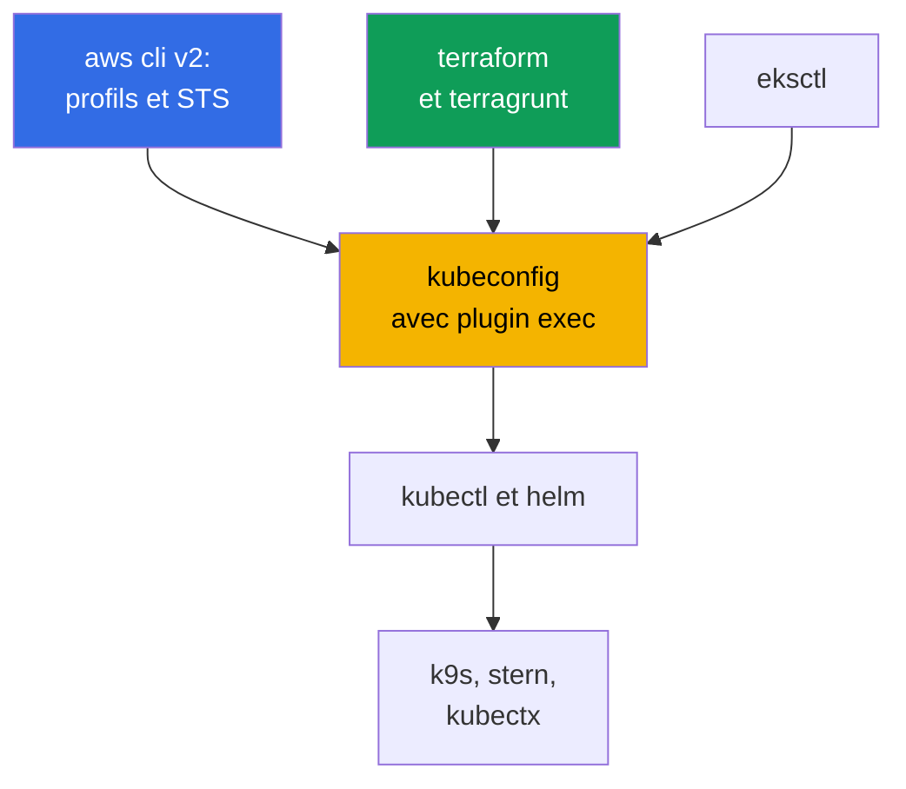
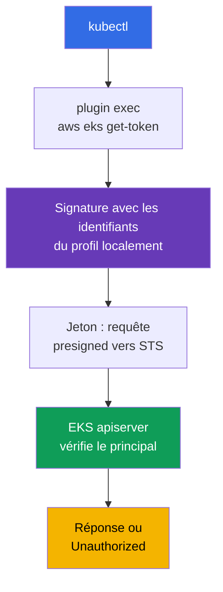
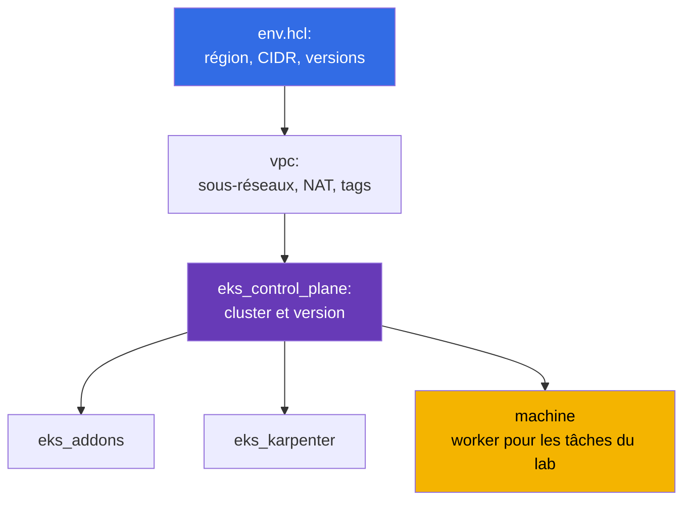

[Русская версия](ru.md) · [Eng version](en.md) · [Versión en español](es.md) · [Deutsche Version](de.md) · [ქართული ვერსია](ge.md) · [繁體中文版](tw.md) · [日本語版](jp.md)
# Chapitre 0.5. Outils : aws cli, eksctl, terraform et terragrunt, helm, plugins utiles

> **La suite.** Vous avez derrière vous le compte et la facturation (chapitre 0.1), IAM (0.2), VPC (0.3) et EC2 (0.4).
> Il reste à préparer l'environnement de travail : vous connaissez kubectl et helm, mais EKS ajoute une couche
> AWS - profils aws cli, plugin exec pour le jeton, IaC avec terraform et terragrunt, managed
> addons. Ce chapitre traite d'outils et d'habitudes, pas de nouvelles abstractions Kubernetes. Ensuite
> commence la Partie 1 : ce qu'EKS prend en charge et ce qui reste à votre charge (chapitre 1), puis le premier cluster.

## 0.5.1. Couche d'outillage EKS : ce qui s'ajoute à kubectl

Dans un cluster kubeadm, l'ensemble était simple : kubectl, helm, ssh vers les nœuds. Avec EKS apparaît un second
circuit : l'API AWS crée le cluster, IAM fournit l'accès, les nœuds naissent d'un launch template, et les
composants système sont installés comme managed addon ou avec un chart.



L'idée clé : **kubectl dans EKS n'est pas autonome**. Il ne s'authentifie pas sans un aws cli
fonctionnel avec le bon profil à côté. De là viennent presque toutes les erreurs d'accès « étranges ».

## 0.5.2. aws cli v2 : profils, région et première commande pour tout problème

Il s'installe avec un seul paquet (archive du site AWS, `brew install awscli`, paquet de la distribution). Une chose
importe : **v2, pas v1** - elle contient `aws configure sso` et un `eks get-token` actuel. La configuration
se trouve dans `~/.aws/config` (profils, régions, SSO) et `~/.aws/credentials` (clés, si elles existent
seulement). Un profil est un ensemble nommé de paramètres d'accès, et il y en a toujours plusieurs : un
par compte et rôle, `prod` a son propre `role_arn` et `source_profile`.

Le profil se choisit avec le drapeau `--profile` ou la variable `AWS_PROFILE`, la région avec `--region` ou
`AWS_REGION`. Les variables sont plus pratiques : terraform, eksctl et les fournisseurs helm les voient aussi.
Les clés de longue durée ne sont pas nécessaires : IAM Identity Center fournit l'accès via STS (chapitre 0.2),
la configuration est faite une fois, puis la connexion passe par le navigateur. Les réponses d'API sont énormes,
et deux drapeaux sauvent la situation : `--query` avec une expression JMESPath et `--output table` pour une
lecture humaine.

Pour basculer entre les profils et stocker les sessions, il est plus pratique d'utiliser des utilitaires plutôt que
les seules variables. `aws-vault` garde les identifiants dans le keychain système et lance une commande dans une
session temporaire, sans exposer le secret dans l'environnement : `aws-vault exec prod -- terraform apply`.
`granted` (commande `assume`) bascule rapidement entre les profils SSO et ouvre la console du compte voulu dans un
onglet séparé du navigateur, supprimant la confusion « dans quel compte suis-je maintenant ».

```bash
export AWS_PROFILE=dev             # profil à utiliser
export AWS_REGION=eu-central-1     # région par défaut

# Première commande pour TOUT problème : compte, ARN identity, userId
aws sts get-caller-identity

aws configure sso --profile prod   # une fois : start URL, compte, rôle
aws sso login --profile prod       # chaque matin : identifiants temporaires pour quelques heures

aws eks describe-cluster --name demo \
  --query 'cluster.{name:name,status:status,version:version}' --output table

aws ec2 describe-subnets --filters "Name=tag:karpenter.sh/discovery,Values=demo" \
  --query 'Subnets[].[SubnetId,AvailabilityZone,CidrBlock]' --output table
```

## 0.5.3. kubeconfig pour EKS : comment kubectl obtient un jeton

Le kubeconfig s'écrit avec une commande : elle ajoute le cluster, le contexte et l'utilisateur sans casser les
entrées existantes.

```bash
# Options minimales, plus : nom de contexte personnel, fichier séparé, profil fixé
aws eks update-kubeconfig --region eu-central-1 --name demo \
  --alias eks-demo --kubeconfig ~/.kube/eks-demo.yaml --profile prod
```

Voici ensuite la particularité d'EKS : le kubeconfig **ne contient ni jeton ni certificat client**. À leur place se
trouve la section `exec`, qui lance `aws eks get-token --cluster-name demo`. Celle-ci signe la requête avec les
identifiants actuels, puis l'apiserver vérifie la signature via IAM et obtient le principal, qui est ensuite mappé
sur RBAC.



Il est facile ici d'imaginer des craintes superflues, clarifions donc le mécanisme. Le plugin **n'appelle pas
STS pour obtenir un jeton** : il signe localement, avec vos identifiants, une requête presigned vers
`sts:GetCallerIdentity`, et cette requête signée est le jeton. C'est l'apiserver qui appelle STS lorsqu'il
vérifie le jeton présenté. Deuxièmement : le plugin ne fonctionne pas pour chaque requête HTTP - il renvoie un
objet `ExecCredential` avec le champ `status.expirationTimestamp`, et `client-go` conserve les identifiants
obtenus dans la mémoire du processus jusqu'à cette échéance. Ainsi, un `k9s` de longue durée,
`kubectl get -w` ou un script en boucle ne se heurtent pas aux limites de fréquence des appels d'API AWS. Le cache
vit dans le processus : chaque nouveau `kubectl` relance le plugin, mais c'est une signature locale, pas un appel
réseau.

```bash
# Jusqu'à quand client-go réutilisera le jeton actuel
aws eks get-token --cluster-name demo --query 'status.expirationTimestamp'
```

Il existe tout de même une réserve concernant le throttling, mais elle ne porte pas sur le jeton lui-même : si les
identifiants du profil viennent de SSO ou de `assume-role`, alors la CLI appelle réellement IAM Identity Center et
STS. Ces réponses sont mises en cache dans `~/.aws/sso/cache` et `~/.aws/cli/cache`, donc les supprimer « par
précaution » est le meilleur moyen de provoquer une avalanche d'appels et d'obtenir `Throttling`.

- **Le kubeconfig ne contient pas de secret**, le jeton est de courte durée, IAM plus RBAC déterminent les droits.
- **Le jeton dépend du profil.** Changez `AWS_PROFILE` - et le même contexte accédera au cluster avec une autre
  identity ; le drapeau `--profile` lors de `update-kubeconfig` est écrit dans `args` et lève cette
  ambiguïté. Il y aura de nombreux clusters, donc `kubectl config get-contexts` et
  `use-context` deviendront une habitude (ou seront remplacés par `kubectx`).
- **`error: You must be logged in to the server (Unauthorized)`** ne concerne généralement pas RBAC, mais le
  principal : `aws sso login` a expiré, un autre `AWS_PROFILE` est exporté, ou le rôle n'est pas ajouté au
  cluster. Ordre de vérification : `aws sts get-caller-identity`, puis les access entries (chapitre 5).

## 0.5.4. eksctl : excellent éclaireur, mauvais propriétaire de production

`eksctl` est la CLI officielle d'EKS. Elle crée en une commande un cluster avec VPC, node group, rôles
et fournisseur OIDC. En interne, ce ne sont pas des appels API directs, mais la génération de CloudFormation.

```bash
eksctl create cluster --name demo --region eu-central-1 --version 1.34 \
  --nodegroup-name ng-default --node-type t3.medium --nodes 2 --managed

# Exploration d'un cluster créé par n'importe quel outil
eksctl get cluster --region eu-central-1
eksctl get nodegroup --cluster demo --region eu-central-1
```

Il est irremplaçable pour créer un cluster pour une journée ou consulter le résumé des node groups et addons.
Pour la production, il échoue : les commandes sont **impératives** (l'état n'est pas décrit dans le dépôt), il y a
sous le capot **son propre CloudFormation**, invisible à votre terraform, et une modification hors IaC produit une
**dérive**. Un cluster dont une partie a été créée par eksctl et une autre par terraform est presque impossible à
supprimer proprement. Règle du cours : **eksctl et la console lisent, terraform écrit** (chapitre 4).

| Méthode | Avantages | Inconvénients | Quand l'utiliser |
|--------|-------|--------|-----------------|
| Console AWS | visuelle, aucune préparation | pas de reproductibilité | regarder, expérimenter |
| `eksctl` | cluster avec une commande | impératif, son propre CFN | apprentissage, ad hoc, exploration |
| terraform + terragrunt | code dans git, review | démarrage plus long, HCL requis | tout ce qui vit longtemps |

## 0.5.5. terraform : pourquoi le cluster est décrit par du code

Un cluster EKS n'est pas une seule ressource, mais un VPC avec tags, sous-réseaux, rôles IAM, fournisseur OIDC, node
groups, addons, security groups. On peut le monter à la main, mais le répéter dans trois environnements et dans un an -
non. Trois points à comprendre avant le premier `apply` :

- **State.** La correspondance « ressource dans le code - ressource dans AWS » est conservée dans un fichier d'état.
  Pour une équipe, il est stocké à distance avec verrouillage, afin que deux ingénieurs ne lancent pas `apply` en même temps.
  Dans le dépôt, le backend est défini une fois dans `terraform/environments/terragrunt.hcl` : bucket S3 avec
  `encrypt = true`, table DynamoDB pour les verrous, clé d'état issue du chemin de la stack.
- **Providers.** `aws` crée les ressources AWS, `kubernetes` et `helm` opèrent au sein du cluster déjà
  créé. D'où le problème de l'œuf et de la poule : le provider `kubernetes` est configuré pour un cluster qui
  peut ne pas exister lors du planning, ainsi le cluster et son contenu sont séparés dans des stacks différentes.
- **Modules.** Bloc réutilisable avec entrées et sorties : un pour le VPC, un pour le control plane, un
  pour le node group. Les labs du cours utilisent les modules de `terraform/modules`, les commandes sont
  habituelles : `terraform init`, `plan`, `apply`, `destroy`.

## 0.5.6. terragrunt : structure des environnements de ce cours

Terragrunt est une fine enveloppe autour de terraform. Il élimine la copie : backend unique pour toutes les
stacks, paramètres d'environnement en un endroit, dépendances entre les stacks, exécution d'un groupe de stacks
avec une seule commande. Les environnements des labs sont assemblés ainsi : le répertoire du lab contient `env.hcl`
avec les paramètres et un sous-répertoire par stack, chacun avec son `terragrunt.hcl`.



Ce qui se trouve réellement dans le `env.hcl` du lab 02 (Karpenter, chapitre 12) : `region = "eu-central-1"`,
`vpc_default_cidr = "10.10.0.0/16"`, `stack_name`, le nom d'environnement `env_name` issu de `stack_name` plus
`TF_VAR_USER_ID` et `TF_VAR_ENV_ID` (chaque étudiant a donc ses propres noms de ressources), la carte
`subnets` composée de deux sous-réseaux publics et quatre privés (deux pour EKS, deux pour RDS) avec les tags
`kubernetes.io/role/elb`, `kubernetes.io/role/internal-elb` et `karpenter.sh/discovery`, le mode
NAT par sous-réseau (`DEFAULT`, `SINGLE`, `NONE`), `k8_version`, `node_type` (`ondemand` ou
`spot`), les types d'instances et la liste des types spot, `root_volume` sur `gp3`, et les `tags` communs pour
le suivi des dépenses. En plus de ceux présentés, il y a les stacks `ssh-keys` et `eks_fargate_system`. Les
dépendances sont décrites par le bloc `dependency` : `eks_control_plane` déclare `dependency "vpc"` et tire de
ses sorties `vpc_id` et les listes de sous-réseaux, et terragrunt construit le graphe d'exécution à partir de ces
blocs.

```bash
terragrunt run-all apply     # toutes les stacks en tenant compte des dépendances ; destroy - dans l'ordre inverse
terragrunt run-all output    # collecter les sorties de toutes les stacks
```

À propos du binaire. Terragrunt fonctionne de la même manière avec terraform et avec **OpenTofu** - le fork ouvert,
souvent choisi pour ne pas dépendre de la licence. Les modules et `terragrunt.hcl` de ce cours sont compatibles avec
lui, aucune modification de code n'est nécessaire, il suffit d'indiquer l'outil qui orchestre :

```hcl
# terragrunt.hcl : quel outil exécute précisément plan et apply
terraform_binary = "tofu"
```

Cela se définit aussi par variable d'environnement (`TERRAGRUNT_TFPATH`, dans les versions récentes `TG_TF_PATH`),
ce qui est pratique en CI. Les versions récentes de Terragrunt préfèrent automatiquement `tofu` s'il est présent,
donc sur les machines où les deux binaires sont installés, le choix est fixé explicitement - sinon le plan local et
celui du pipeline peuvent être calculés avec des outils différents.

## 0.5.7. helm : installer les contrôleurs et préférer un managed addon

Helm vous est familier, donc seulement ses particularités EKS. Les charts installent presque toute la couche de
plateforme : AWS Load Balancer Controller (chapitre 26), Karpenter (12), external-dns et cert-manager (29),
kube-prometheus-stack (33), External Secrets (18), Fluent Bit (34). Une partie des charts AWS se trouve dans
`oci://public.ecr.aws`, la logique est la même : version explicite et son propre `values.yaml` dans git.

```bash
helm repo add eks https://aws.github.io/eks-charts && helm repo update

helm upgrade --install aws-load-balancer-controller eks/aws-load-balancer-controller \
  --namespace kube-system --version 1.13.0 \
  --set clusterName=demo --set serviceAccount.create=false \
  --set serviceAccount.name=aws-load-balancer-controller

helm get values aws-load-balancer-controller -n kube-system   # values actuellement utilisés
```

Les charts publics sont téléchargés sans autorisation, mais les **charts de plateforme internes** d'une entreprise se
trouvent généralement dans un ECR privé, et helm doit y être connecté séparément de docker. C'est un registre OCI,
donc `helm registry login` fonctionne avec le même jeton que docker :

```bash
# Connexion de helm à un ECR privé ; le jeton vit quelques heures, en CI répéter cette étape avant install
aws ecr get-login-password --region eu-central-1 \
  | helm registry login --username AWS --password-stdin \
    123456789012.dkr.ecr.eu-central-1.amazonaws.com

# Ensuite le chart s'installe normalement, mais via un lien OCI et avec une version explicite
helm upgrade --install platform-base \
  oci://123456789012.dkr.ecr.eu-central-1.amazonaws.com/charts/platform-base \
  --version 2.4.1 -n platform -f values-prod.yaml
```

Le nom d'utilisateur est toujours littéralement `AWS`, et le mot de passe est un jeton temporaire. Dans un pipeline,
c'est donc une étape avant l'installation, pas un secret stocké. La même IAM role que pour les images donne les
droits pull, et l'accès cross-account est donné par une politique de dépôt (chapitre 20).

Deux habitudes : **jamais sans `--version`** (sinon le cluster se modifie tout seul au prochain `upgrade`)
et **les values dans un fichier**, non dans des `--set` issus de l'historique bash de quelqu'un. Lorsqu'il y a
beaucoup de charts, ils sont gardés de manière déclarative : `helmfile` décrit la liste des releases avec leurs
versions et chemins vers `values.yaml` dans un `helmfile.yaml`, et `helmfile apply` amène le cluster à cette
description - le même principe « code dans git » qu'avec terraform, mais pour helm. AWS propose une partie des
composants (VPC CNI, kube-proxy, CoreDNS, EBS CSI, Pod Identity Agent) comme **managed addons** : AWS calcule
la compatibilité, la mise à jour passe par l'API du cluster. Moins de liberté, moins de travail.

| Critère | Managed addon | Chart Helm |
|----------|---------------|-----------|
| Compatibilité avec la version du cluster | AWS vérifie | vous vérifiez |
| Mise à jour | API EKS, visible dans l'IaC et la console | `helm upgrade` dans votre pipeline |
| Flexibilité des values | limitée | complète |
| Qui traite l'incident | AWS support a le contexte | vous |

Pratique par défaut : les composants de base sont des managed addons, tout ce qui est applicatif et évolue
rapidement (Karpenter, LB Controller, observabilité) passe par helm. La frontière est au chapitre 37.

## 0.5.8. Plugins et utilitaires utiles

| Outil | Utilité en une ligne |
|------------|----------------------|
| `kubectx` / `kubens` | basculer de contexte et namespace sans modifier kubeconfig |
| `k9s` | UI terminal : pods, logs, événements, exec en deux touches |
| `stern` | logs de tous les pods par préfixe ou sélecteur |
| `krew` | gestionnaire de plugins kubectl, il installe le reste |
| `kubectl-neat` | retire le bruit système de `get -o yaml` |
| `eks-node-viewer` | carte des nœuds EKS avec charge et coût, nécessaire avec Karpenter |
| `kubectl-k8i` | tableau des nœuds avec charge, type d'instance, spot ou on-demand, zone et NodePool |
| `jq` | filtrage du JSON de aws cli quand `--query` devient peu pratique |
| `yq` | même technique pour YAML : values des charts, manifestes, kubeconfig |

```bash
kubectx eks-demo && kubens kube-system   # contexte et namespace
stern -n kube-system karpenter           # logs de tous les pods Karpenter
aws eks describe-nodegroup --cluster-name demo --nodegroup-name ng-default | jq '.nodegroup'
```

Il faut parler des plugins séparément, car la moitié des commodités quotidiennes vit précisément là. Le mécanisme est
simple : **tout fichier exécutable nommé `kubectl-<nom>` dans `PATH` devient la sous-commande
`kubectl <nom>`**. Il n'est pas nécessaire de les installer à la main, **krew** est là pour cela - gestionnaire de
plugins avec index, recherche et mises à jour :

```bash
kubectl krew update                  # mettre à jour l'index des plugins
kubectl krew search                  # tout le catalogue ; ou par mot : krew search node
kubectl krew info k8i                # description, version, page d'accueil
kubectl krew install k8i             # installer
kubectl krew list                    # déjà installés
kubectl krew upgrade                 # mettre à jour tous les éléments installés
kubectl krew uninstall k8i           # désinstaller

kubectl plugin list                  # vue depuis kubectl : ce qu'il voit dans PATH
```

Les plugins ne sont pas seulement dans l'index principal : un index interne ou personnel se connecte comme index
supplémentaire, après quoi le plugin est installé avec le préfixe (`kubectl krew index add
<nom> <git-url>`, puis `kubectl krew install <nom>/<plugin>`). Souvenez-vous cependant qu'un plugin est
un exécutable tiers lancé avec vos droits et votre kubeconfig : pour les environnements de production, la liste des
plugins est validée comme toute autre dépendance (chapitre 20).

Un exemple de plugin utile précisément dans EKS est **`kubectl-k8i`**. Le `kubectl get nodes` standard
présente un nœud comme une machine abstraite, mais les questions dans EKS sont souvent différentes : est-il spot ou
on-demand, quel est le type d'instance, dans quelle zone, de quel NodePool vient-il, qui l'a créé (Karpenter,
Cluster Autoscaler ou Spot.io), et quel est son niveau réel de charge par rapport aux requests et limits.
`k8i` rassemble cela dans un tableau unique avec les pourcentages de charge et sait filtrer et trier selon
n'importe lequel de ces critères, grouper les nœuds par taint, et avec la sous-commande `analyze` montrer quelles
charges vivent exactement sur les nœuds choisis et dans quelle mesure leurs limits divergent des requests.

```bash
# Plugin : github.com/ViktorUJ/kubectl-k8i (dans krew, ou binaire depuis les releases)
kubectl krew install k8i

kubectl k8i                                    # tous les nœuds : charge, type, zone, pool
kubectl k8i --filter ec2_type=spot             # nœuds spot uniquement (chapitre 13)
kubectl k8i --autoscaler karpenter --sort cpu_load=desc   # nœuds Karpenter par charge
kubectl k8i --group-by taint                   # quels groupes logiques de nœuds existent
kubectl k8i analyze --autoscaler karpenter --cpu-overcommit 100   # qui demande cinq fois moins
```

Les valeurs d'usage viennent de metrics-server : sans lui, les colonnes de charge seront à zéro, mais les
requests et limits restent visibles. Cela sera utile aux chapitres 12 et 13 (NodePool, spot), et surtout au
chapitre 14, qui examine justement l'écart entre requests, limits et consommation effective.

## 0.5.9. Hygiène de l'environnement de travail

- **Les versions sont fixées.** kubectl dans la même version mineure que le cluster, terraform et
  terragrunt sont pin dans le dépôt, les versions des charts sont dans le code : sinon `apply` donne des résultats différents.
- **Les profils sont isolés par comptes.** Les noms de profils correspondent aux environnements (`dev`, `stage`,
  `prod`), `prod` a son propre `role_arn` et MFA. Aucun profil `default` menant à la production.
  Il n'y a aucune clé de longue durée : `aws configure sso` plus `aws sso login`, durée de vie de quelques heures
  (chapitre 0.2). Une clé `AKIA...` dans `~/.aws/credentials` est un incident qui attend son heure.
- **La région et le compte sont vérifiés avant une commande destructive.** `aws sts get-caller-identity` et
  `kubectl config current-context` avant `run-all destroy` prennent cinq secondes, et le surlignage du
  compte dans l'invite shell élimine toute une classe d'erreurs « supprimé au mauvais endroit ».
- **Les indications de CLI sont activées.** aws cli v2 possède un auto-prompt intégré : le mode `on-partial`
  suggère les sous-commandes et paramètres, mais n'intervient que si la commande est incomplète ou échoue à la
  validation. En astreinte, cela fait gagner du temps pour composer de longs `--query` et `--filters`.

```bash
aws configure set cli_auto_prompt on-partial   # modes : on, on-partial, off
```

## 0.5.10. Application en production

- **Seule l'IaC crée le cluster.** Dépôt avec terraform ou terragrunt, review sur PR,
  application depuis CI sous un rôle séparé. Dans la console à la main - lecture uniquement.
- **Image d'outillage unique.** Conteneur ou devcontainer avec les versions fixées de
  aws cli, kubectl, helm, terraform, terragrunt : les ingénieurs et CI ont le même ensemble.
- **Accès par SSO et rôles.** Le rôle est accordé temporairement, kubeconfig prend le jeton via le
  plugin exec, l'accès est révoqué dans Identity Center, non en modifiant le cluster.
- **eksctl est conservé comme outil de diagnostic** pour `get nodegroup` et `get addon`, mais
  n'est pas utilisé en production. Ce qui peut être confié à AWS comme managed addon l'est, le reste s'installe
  par charts à versions explicites via GitOps (chapitre 44).

## 0.5.11. Mini-glossaire

- **aws cli v2** - CLI principale pour AWS ; configuration dans `~/.aws/config`, accès sélectionné
  avec `--profile` ou `AWS_PROFILE`. **Profil** - ensemble nommé de paramètres : région,
  rôle, SSO. **`aws sts get-caller-identity`** - commande « qui suis-je » : compte, ARN, userId.
  **`aws-vault`** - stockage des identifiants dans le keychain et lancement des commandes dans une session temporaire ;
  **`granted`** (`assume`) - basculement rapide de profils SSO et connexion à la console.
- **Plugin exec kubeconfig** - section `exec` qui appelle `aws eks get-token` ; aucun jeton de longue durée
  n'est dans le fichier, et `client-go` met en cache les identifiants obtenus jusqu'à
  `status.expirationTimestamp`. **eksctl** - CLI officielle pour EKS, fonctionne avec
  CloudFormation, est impérative.
- **Plugin kubectl** - fichier `kubectl-<nom>` dans `PATH`, disponible comme `kubectl <nom>`.
  **krew** - gestionnaire de plugins : index, `search`, `install`, `upgrade` ; prend en charge ses propres
  index. **`kubectl plugin list`** - ce que kubectl voit dans `PATH`.
- **State** - fichier d'état terraform, stocké à distance avec verrouillage pour une équipe.
  **Provider** - plugin terraform (`aws`, `kubernetes`, `helm`).
- **terragrunt** - enveloppe de terraform : backend commun, `env.hcl`, `dependency`, `run-all`,
  modules DRY sans copie. **OpenTofu** - fork ouvert de terraform, compatible avec les modules du
  cours ; sélectionné par l'attribut `terraform_binary = "tofu"`. **Stack** - répertoire avec un seul
  `terragrunt.hcl`, appliqué comme unité. **helmfile** - description déclarative d'un ensemble de
  releases helm avec versions et values dans un fichier. **Managed addon** - composant du cluster dont EKS
  gère les versions et les mises à jour.

## 0.5.12. Résultats du chapitre

- aws cli v2 avec les profils et `AWS_REGION` est la base de tout ; `aws sts get-caller-identity` est la première
  commande en cas d'erreur incomprise, tandis que `--query` et `--output table` rendent les réponses API lisibles.
- `aws eks update-kubeconfig` crée un contexte sans secrets : `aws eks get-token` obtient le jeton,
  donc `Unauthorized` signifie généralement un mauvais profil ou un SSO expiré (chapitre 5).
- eksctl convient aux clusters rapides et à l'exploration, mais amène son propre CloudFormation et produit de la dérive ;
  la production est décrite avec terraform et terragrunt (chapitre 4), et terragrunt ajoute `env.hcl`,
  une séparation en stacks et leurs dépendances : les labs du cours sont construits ainsi.
- Helm installe les contrôleurs avec des versions explicites et des values dans git, tandis que les composants de base sont
  plus souvent pris comme managed addons (chapitre 37). Les plugins et l'hygiène de l'environnement (fixation des versions,
  isolation des profils, abandon des clés de longue durée, vérification du compte avant `destroy`) économisent du temps et de l'argent.

## 0.5.13. Utilité dans le travail réel

La couche d'outillage détermine la vitesse de réaction lors d'un incident. Lorsque les nœuds ne rejoignent pas le
cluster (chapitre 45), vous basculez de profil en une minute, consultez le node group avec `eksctl get
nodegroup`, lisez les logs avec `stern`, vérifiez les tags de sous-réseaux avec `describe-subnets`.
Lorsque vous devez reproduire l'environnement dans un autre compte, vous modifiez `env.hcl` et lancez `run-all`.

## 0.5.14. Questions d'auto-évaluation

1. Quelle est la différence entre `~/.aws/config` et `~/.aws/credentials`, et que fait `AWS_PROFILE` ?
2. Pourquoi exécute-t-on d'abord `aws sts get-caller-identity` lors d'un problème d'accès ?
3. Que contient le kubeconfig pour EKS à la place d'un jeton, et comment kubectl obtient-il l'accès ?
4. `kubectl` renvoie `Unauthorized`. Quelles trois causes vérifier avant RBAC ?
5. À quoi sert eksctl et pourquoi ne crée-t-on pas de cluster de production avec lui ?
6. Que fournit terragrunt au-dessus de terraform et quel est le lien entre les stacks `vpc` et `eks_control_plane` ?
7. Quand vaut-il mieux installer un composant comme managed addon, et quand avec un chart helm ?
8. Comment kubectl trouve-t-il les plugins et comment krew aide-t-il ? Quelles commandes permettent de chercher et mettre à jour ?
9. Pourquoi `kubectl get nodes` dans EKS ne répond-il pas à toutes les questions sur les nœuds, et qu'ajoute `k8i` ?

## Pratique

La Partie 0 n'a pas ses propres labs, mais il est pratique ici de comprendre comment les labs du cours sont lancés. Les
environnements sont déployés par des cibles Makefile à la racine du dépôt : la cible copie le répertoire du lab vers le
répertoire de travail et y lance `terragrunt run-all` avec un parallélisme égal au nombre de cœurs. Le numéro du lab
est transmis par la variable `TASK`, les identifiants d'environnement sont `USER_ID` et `ENV_ID` (ils entrent dans
`env_name`, donc les ressources de différents étudiants n'entrent pas en conflit).

```bash
TASK=02 make run_eks_task          # déployer l'environnement du lab 02 (Karpenter, chapitre 12)
make output_eks_task               # sorties des stacks : paramètres du cluster, adresse de la machine worker
TASK=02 make delete_eks_task       # supprimer l'environnement pour ne pas payer le NAT, le cluster et les nœuds
TASK=02 make run_eks_task_clean    # nettoyer le répertoire de travail et redéployer
```

Après le déploiement, vous vous connectez à la machine worker de l'environnement, obtenez kubeconfig et travaillez avec
le kubectl habituel. Les tâches sont vérifiées par la commande `check_result` sur la machine worker : elle lance une
vérification automatique de l'état du cluster et indique si la tâche est validée. Commencez par exécuter
`aws sts get-caller-identity` et `kubectl config current-context`. Ensuite vient la Partie 1 : ce qu'EKS prend
exactement en charge et pourquoi un control plane géré ne signifie pas un cluster géré.

---
[Table des matières](../README_FR.md) · [Chapitre 0.4](../00-4-ec2/fr.md) · [Chapitre 1](../01/fr.md)
