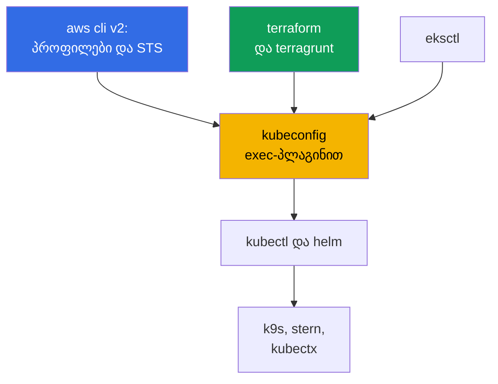
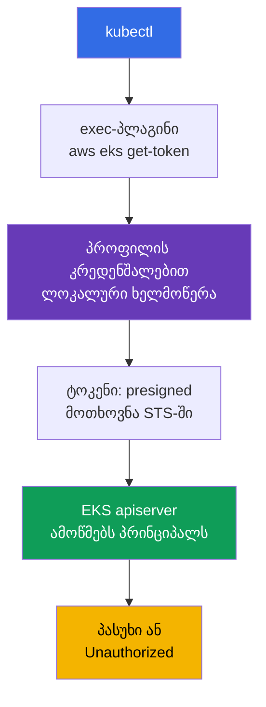
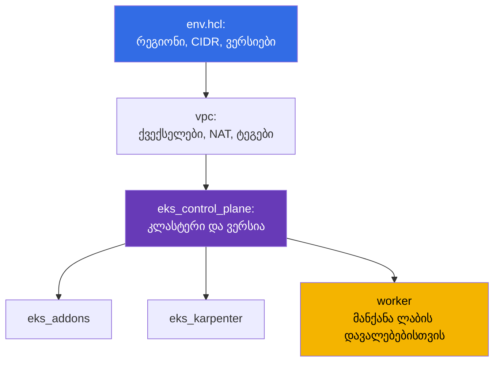

[Русская версия](ru.md) · [Eng version](en.md) · [Versión en español](es.md) · [Version française](fr.md) · [Deutsche Version](de.md) · [繁體中文版](tw.md) · [日本語版](jp.md)
# თავი 0.5. ინსტრუმენტები: aws cli, eksctl, terraform და terragrunt, helm, სასარგებლო პლაგინები

> **რა არის შემდეგ.** უკვე გავიარეთ ანგარიში და ბილინგი (თავი 0.1), IAM (0.2), VPC (0.3) და EC2 (0.4).
> დარჩა სამუშაო გარემოს აწყობა: kubectl და helm უკვე იცით, მაგრამ EKS-ში მათ ემატება
> AWS-ის ფენა - aws cli პროფილები, ტოკენის exec-პლაგინი, IaC terraform-სა და terragrunt-ზე, managed
> addons. ეს თავი ინსტრუმენტებსა და ჩვევებზეა და არა Kubernetes-ის ახალ აბსტრაქციებზე. შემდეგ
> იწყება ნაწილი 1: რას იღებს EKS თავის თავზე და რა რჩება თქვენზე (თავი 1), შემდეგ კი პირველი კლასტერი.

## 0.5.1. EKS-ის ინსტრუმენტული ფენა: რა ემატება kubectl-ს

kubeadm-კლასტერში ნაკრები მოკლე იყო: kubectl, helm, ssh ნოდებზე. EKS-ში ჩნდება მეორე
კონტური: კლასტერს ქმნის AWS API, წვდომას გასცემს IAM, ნოდები იბადება launch template-დან, ხოლო
სისტემური კომპონენტები ყენდება ან managed addon-ად, ან ჩარტით.



მთავარი აზრი: **kubectl EKS-ში თვითკმარი არ არის**. იგი ვერ გაივლის ავთენტიკაციას, თუ გვერდით არ არის
სწორი პროფილით მომუშავე aws cli. აქედან მოდის წვდომის თითქმის ყველა „უცნაური“ შეცდომა.

## 0.5.2. aws cli v2: პროფილები, რეგიონი და პირველი ბრძანება ნებისმიერი პრობლემისას

დგება ერთი პაკეტით (AWS-ის საიტიდან არქივი, `brew install awscli`, დისტრიბუტივის პაკეტი). მნიშვნელოვანია
ერთი რამ: **v2 და არა v1** - მას აქვს `aws configure sso` და აქტუალური `eks get-token`. კონფიგურაცია
ცხოვრობს `~/.aws/config`-ში (პროფილები, რეგიონები, SSO) და `~/.aws/credentials`-ში (გასაღებები, თუ საერთოდ
არსებობს). პროფილი წვდომის პარამეტრების დასახელებული ნაკრებია და ისინი ყოველთვის რამდენიმეა: თითო
ანგარიშსა და როლზე ერთი, `prod`-ს აქვს საკუთარი `role_arn` და `source_profile`.

პროფილი აირჩევა `--profile` დროშით ან `AWS_PROFILE` ცვლადით, რეგიონი - `--region` ან
`AWS_REGION`. ცვლადები უფრო მოსახერხებელია: მათ ხედავს terraform, eksctl და helm-პროვაიდერები.
ხანგრძლივვადიანი გასაღებები საჭირო არ არის: წვდომას გასცემს IAM Identity Center STS-ის მეშვეობით (თავი 0.2),
დაყენება ერთჯერადია, შემდეგ შესვლა ბრაუზერით ხდება. API პასუხები დიდია და ორი დროშა გიშველით:
`--query` JMESPath გამოსახულებით და `--output table` ადამიანის მიერ წასაკითხად.

პროფილების გადართვა და სესიების შენახვა უფრო მოსახერხებელია არა შიშველი ცვლადებით, არამედ უტილიტებით. `aws-vault`
ინახავს კრედენშალებს სისტემურ keychain-ში და ბრძანებას დროებით სესიაში უშვებს ისე, რომ საიდუმლო გარემოში არ
გამოაჩინოს: `aws-vault exec prod -- terraform apply`. `granted` (ბრძანება `assume`) სწრაფად გადართავს
SSO-პროფილებს და საჭირო ანგარიშის კონსოლს ბრაუზერის ცალკე ჩანართში ხსნის, რაც ხსნის დაბნეულობას „რომელ ანგარიშში ვარ ახლა“.

```bash
export AWS_PROFILE=dev             # რომელი პროფილი გამოიყენოს
export AWS_REGION=eu-central-1     # ნაგულისხმევი რეგიონი

# პირველი ბრძანება ნებისმიერი პრობლემისას: ანგარიში, ARN identity, userId
aws sts get-caller-identity

aws configure sso --profile prod   # ერთხელ: start URL, ანგარიში, როლი
aws sso login --profile prod       # ყოველ დილას: დროებითი კრედენშალები რამდენიმე საათით

aws eks describe-cluster --name demo \
  --query 'cluster.{name:name,status:status,version:version}' --output table

aws ec2 describe-subnets --filters "Name=tag:karpenter.sh/discovery,Values=demo" \
  --query 'Subnets[].[SubnetId,AvailabilityZone,CidrBlock]' --output table
```

## 0.5.3. kubeconfig EKS-ისთვის: როგორ იღებს kubectl ტოკენს

kubeconfig იწერება ერთი ბრძანებით: იგი ამატებს კლასტერს, კონტექსტსა და მომხმარებელს, არსებული ჩანაწერების
დაზიანების გარეშე.

```bash
# მინიმუმი და დამატებითი ოფციები: საკუთარი კონტექსტის სახელი, ცალკე ფაილი, პროფილის დაფიქსირება
aws eks update-kubeconfig --region eu-central-1 --name demo \
  --alias eks-demo --kubeconfig ~/.kube/eks-demo.yaml --profile prod
```

შემდეგ EKS-ის სპეციფიკაა: kubeconfig-ში **არც ტოკენი და არც კლიენტის სერტიფიკატი არ არის**. მათ ნაცვლად არის
`exec` სექცია, რომელიც უშვებს `aws eks get-token --cluster-name demo`-ს. იგი მიმდინარე კრედენშალებით
მოთხოვნას ხელს აწერს, ხოლო apiserver ხელმოწერას IAM-ით ამოწმებს და იღებს პრინციპალს, რომელიც შემდეგ RBAC-ზე აისახება.



აქ ზედმეტი შიშების მოგონება ადვილია, ამიტომ მექანიკას დავაზუსტოთ. პლაგინი **ტოკენისთვის STS-ს არ მიმართავს**:
იგი თქვენი კრედენშალებით ლოკალურად ხელს აწერს `sts:GetCallerIdentity`-ის presigned-მოთხოვნას, და სწორედ ეს
ხელმოწერილი მოთხოვნაა ტოკენი. STS-ს უკვე apiserver მიმართავს წარდგენილის შემოწმებისას. მეორე: პლაგინი არ მუშაობს
ყოველ HTTP-მოთხოვნაზე - იგი აბრუნებს `ExecCredential` ობიექტს `status.expirationTimestamp` ველით, და `client-go`
მიღებულ კრედენშალებს პროცესის მეხსიერებაში ამ დრომდე ინახავს. ამიტომ ხანგრძლივად მომუშავე `k9s`,
`kubectl get -w` ან ციკლში გაშვებული სკრიპტი AWS API-ის გამოძახების სიხშირის ლიმიტებს არ ეჯახება. ქეში პროცესის
ფარგლებშია: ყოველი ახალი `kubectl` კვლავ უშვებს პლაგინს, მაგრამ ეს ლოკალური ხელმოწერაა და არა ქსელური გამოძახება.

```bash
# რომელ მომენტამდე გამოიყენებს client-go მიმდინარე ტოკენს ხელახლა
aws eks get-token --cluster-name demo --query 'status.expirationTimestamp'
```

throttling-ზე დათქმა მაინც არსებობს, მაგრამ ის თავად ტოკენს არ ეხება: თუ პროფილის კრედენშალები SSO-დან ან
`assume-role`-ით მოდის, CLI მათთვის ნამდვილად მიდის IAM Identity Center-სა და STS-ში. ეს პასუხები ქეშირდება
`~/.aws/sso/cache`-სა და `~/.aws/cli/cache`-ში, ამიტომ მათი „ყოველი შემთხვევისთვის“ წაშლა - დარწმუნებული გზაა
გამოძახებების ტალღის მოსაწყობად და `Throttling`-ის მისაღებად.

- **kubeconfig-ში საიდუმლო არ არის**, ტოკენი მოკლეხნიანია, უფლებებს განსაზღვრავს IAM პლუს RBAC.
- **ტოკენი პროფილზეა დამოკიდებული.** შეცვალეთ `AWS_PROFILE` - და იგივე კონტექსტი კლასტერში სხვა identity-ით წავა;
  `update-kubeconfig`-ისას `--profile` დროშა `args`-ში იწერება და ამ ორაზროვნებას ხსნის. კლასტერები ბევრი იქნება,
  ამიტომ `kubectl config get-contexts` და `use-context` ჩვევად გექცევათ (ან მათ `kubectx` ჩაანაცვლებს).
- **`error: You must be logged in to the server (Unauthorized)`** ჩვეულებრივ RBAC-ს კი არა, პრინციპალს ეხება:
  `aws sso login` ვადაგასულია, უცხო `AWS_PROFILE` არის ექსპორტირებული, ან როლი კლასტერში არ არის დამატებული.
  შემოწმების რიგი: `aws sts get-caller-identity`, შემდეგ access entries (თავი 5).

## 0.5.4. eksctl: შესანიშნავი მზვერავი, ცუდი მფლობელი პროდაქშენისთვის

`eksctl` EKS-ის ოფიციალური CLI-ა. ერთი ბრძანებით ქმნის კლასტერს VPC-ით, node group-ით, როლებითა და
OIDC-პროვაიდერით. შიგნით ეს API-ის პირდაპირი გამოძახებები კი არა, CloudFormation-ის გენერაციაა.

```bash
eksctl create cluster --name demo --region eu-central-1 --version 1.34 \
  --nodegroup-name ng-default --node-type t3.medium --nodes 2 --managed

# ნებისმიერი საშუალებით შექმნილი კლასტერის დაზვერვა
eksctl get cluster --region eu-central-1
eksctl get nodegroup --cluster demo --region eu-central-1
```

იგი შეუცვლელია, რათა კლასტერი ერთ დღეში წამოწიოთ ან node groups-ისა და addons-ის შეჯამება ნახოთ.
პროდაქშენისთვის არ გამოდგება: ბრძანებები **იმპერატიულია** (მდგომარეობა რეპოზიტორიაში არ არის აღწერილი),
ქვემოთ **საკუთარი CloudFormation** აქვს, რომელიც თქვენს terraform-ს არ უჩანს, ხოლო IaC-ის გვერდის ავლით შესწორება
**დრიფტს** იძლევა. კლასტერი, რომლის ერთი ნაწილი eksctl-მა შექმნა, მეორე კი terraform-მა, სუფთად წაშლა თითქმის
შეუძლებელია. კურსის წესი: **eksctl და კონსოლი კითხულობენ, terraform წერს** (თავი 4).

| მეთოდი | უპირატესობები | ნაკლოვანებები | როდის გამოვიყენოთ |
|--------|---------------|---------------|-------------------|
| AWS კონსოლი | თვალსაჩინო, მომზადება არ სჭირდება | განმეორებადობა არ არის | ნახვა, მოსინჯვა |
| `eksctl` | კლასტერი ერთი ბრძანებით | იმპერატიულობა, საკუთარი CFN | სწავლა, ad hoc, დაზვერვა |
| terraform + terragrunt | კოდი git-ში, review | დაწყება მეტხანს გრძელდება, HCL საჭიროა | ყველაფერი, რაც დიდხანს ცოცხლობს |

## 0.5.5. terraform: რატომ აღწერენ კლასტერს კოდით

EKS კლასტერი ერთი რესურსი კი არა, არამედ VPC ტეგებით, ქვექსელები, IAM-როლები, OIDC-პროვაიდერი, node
 groups, addons, security groups-ია. ხელით აწყობა შეიძლება, მაგრამ სამ გარემოში და ერთი წლის შემდეგ გამეორება -
არა. პირველი `apply`-მდე სამი რამ უნდა გესმოდეთ:

- **State.** შესაბამისობა „კოდში არსებული რესურსი - AWS-ში არსებული რესურსი“ მდგომარეობის ფაილში ინახება.
  გუნდისთვის იგი ბლოკირებით დისტანციურად დევს, რათა ორმა ინჟინერმა ერთდროულად `apply` არ გაუშვას.
  რეპოზიტორიაში backend ერთხელაა მითითებული `terraform/environments/terragrunt.hcl`-ში: S3 ბაკეტი
  `encrypt = true`-ით, ბლოკირებისთვის DynamoDB ცხრილი, მდგომარეობის გასაღები სტეკის გზიდან.
- **Providers.** `aws` ქმნის AWS რესურსებს, `kubernetes` და `helm` უკვე ამოწეულ კლასტერში მუშაობენ.
  აქედან გამომდინარეობს ქათმისა და კვერცხის პრობლემა: `kubernetes` პროვაიდერი კლასტერზე კონფიგურდება,
  რომელიც დაგეგმვისას შეიძლება ჯერ არ არსებობდეს, ამიტომ კლასტერი და მისი შიგთავსი სხვადასხვა სტეკად იყოფა.
- **Modules.** განმეორებადი ბლოკი შესავლებითა და გამოსავლებით: ერთი VPC-სთვის, ერთი control plane-სთვის, ერთი
  node group-ისთვის. კურსის ლაბები იყენებს მოდულებს `terraform/modules`-დან, ხოლო ბრძანებები ნაცნობია:
  `terraform init`, `plan`, `apply`, `destroy`.

## 0.5.6. terragrunt: როგორ არის მოწყობილი ამ კურსის გარემოები

Terragrunt terraform-ის თხელი გარსია. იგი ხსნის კოპი-პასტას: ერთიანი backend ყველა სტეკისთვის,
გარემოს პარამეტრები ერთ ადგილას, სტეკებს შორის დამოკიდებულებები, სტეკების ჯგუფის გაშვება ერთი ბრძანებით.
ლაბების გარემო ასეა აწყობილი: ლაბის კატალოგში დევს პარამეტრიანი `env.hcl` და თითო სტეკზე ერთი ქვეკატალოგი,
თითოეულში საკუთარი `terragrunt.hcl`.



რეალურად რა დევს ლაბა 02-ის `env.hcl`-ში (Karpenter, თავი 12): `region = "eu-central-1"`,
`vpc_default_cidr = "10.10.0.0/16"`, `stack_name`, გარემოს სახელი `env_name`, რომელიც `stack_name`-სა და
`TF_VAR_USER_ID`-ს, `TF_VAR_ENV_ID`-ს აერთიანებს (ამიტომ ყოველ სტუდენტს საკუთარი რესურსების სახელები აქვს),
`subnets` რუკა ორი საჯარო და ოთხი კერძო ქვექსელით (ორი EKS-ისთვის, ორი RDS-ისთვის) ტეგებით
`kubernetes.io/role/elb`, `kubernetes.io/role/internal-elb` და `karpenter.sh/discovery`, თითო ქვექსელზე
NAT რეჟიმი (`DEFAULT`, `SINGLE`, `NONE`), `k8_version`, `node_type` (`ondemand` ან `spot`), ინსტანსების
ტიპები და spot-ტიპების სია, `root_volume` `gp3`-ზე, საერთო `tags` ხარჯების აღრიცხვისთვის. ნაჩვენების გარდა,
არის `ssh-keys` და `eks_fargate_system` სტეკებიც. დამოკიდებულებები `dependency` ბლოკითაა აღწერილი:
`eks_control_plane` აცხადებს `dependency "vpc"`-ს და მისი გამოსავლებიდან იღებს `vpc_id`-სა და ქვექსელების
სიებს, ხოლო terragrunt ამ ბლოკებით გაშვების გრაფს აგებს.

```bash
terragrunt run-all apply     # ყველა სტეკი დამოკიდებულებების გათვალისწინებით; destroy - შებრუნებული რიგით
terragrunt run-all output    # ყველა სტეკის გამოსავლების შეგროვება
```

ცალკე ბინარზე. Terragrunt ერთნაირად მუშაობს terraform-თანაც და **OpenTofu**-სთანაც - ღია
ფორკთან, რომელსაც ხშირად ირჩევენ, რათა ლიცენზიაზე არ იყვნენ დამოკიდებული. კურსის მოდულები და `terragrunt.hcl`
მასთან თავსებადია, კოდის შეცვლა საჭირო არ არის, საკმარისია მიუთითოთ, რით მოხდეს ორკესტრირება:

```hcl
# terragrunt.hcl: რით გაეშვას plan და apply
terraform_binary = "tofu"
```

იგივე გარემოს ცვლადითაც იწერება (`TERRAGRUNT_TFPATH`, ახალ ვერსიებში `TG_TF_PATH`), რაც CI-ში
მოსახერხებელია. Terragrunt-ის ახალი ვერსიები `tofu`-ს არსებობისას მას თავად ანიჭებენ უპირატესობას, ამიტომ
მანქანებზე, სადაც ორივე ბინარია დგას, არჩევანი ცალსახად ფიქსირდება - სხვაგვარად ლოკალურად და პაიპლაინში გეგმა
სხვადასხვა ინსტრუმენტით შეიძლება დაითვალოს.

## 0.5.7. helm: რით აყენებენ კონტროლერებს და როდის სჯობს managed addon

Helm უკვე ნაცნობია, ამიტომ მხოლოდ EKS-ზე. ჩარტებით ყენდება თითქმის მთელი პლატფორმის ფენა: AWS
Load Balancer Controller (თავი 26), Karpenter (12), external-dns და cert-manager (29),
kube-prometheus-stack (33), External Secrets (18), Fluent Bit (34). AWS-ის ზოგი ჩარტი ცხოვრობს
`oci://public.ecr.aws`-ში, ლოგიკა ერთია: ცხადი ვერსია და საკუთარი `values.yaml` git-ში.

```bash
helm repo add eks https://aws.github.io/eks-charts && helm repo update

helm upgrade --install aws-load-balancer-controller eks/aws-load-balancer-controller \
  --namespace kube-system --version 1.13.0 \
  --set clusterName=demo --set serviceAccount.create=false \
  --set serviceAccount.name=aws-load-balancer-controller

helm get values aws-load-balancer-controller -n kube-system   # რა values-ით დგას
```

საჯარო ჩარტები ავტორიზაციის გარეშე იწერება, მაგრამ კომპანიის **საკუთარი პლატფორმის ჩარტები** ჩვეულებრივ
კერძო ECR-შია და იქ helm ცალკე უნდა დაალოგინოთ docker-ისგან დამოუკიდებლად. რეესტრი OCI-ა, ამიტომ მუშაობს
`helm registry login` იგივე ტოკენით, რასაც docker იყენებს:

```bash
# helm-ის შესვლა კერძო ECR-ში; ტოკენი საათებით ცოცხლობს, CI-ში ნაბიჯი install-მდე მეორდება
aws ecr get-login-password --region eu-central-1 \
  | helm registry login --username AWS --password-stdin \
    123456789012.dkr.ecr.eu-central-1.amazonaws.com

# შემდეგ ჩარტი ჩვეულებრივ ყენდება, მაგრამ oci-ბმულით და ცხადი ვერსიით
helm upgrade --install platform-base \
  oci://123456789012.dkr.ecr.eu-central-1.amazonaws.com/charts/platform-base \
  --version 2.4.1 -n platform -f values-prod.yaml
```

მომხმარებლის სახელი ყოველთვის სიტყვასიტყვით `AWS`-ია, პაროლი კი დროებითი ტოკენი, ამიტომ პაიპლაინში ეს
ინსტალაციამდე ნაბიჯია და არა შენახული საიდუმლო. pull-ის უფლებას გამოსახულებების იმავე IAM-როლი გასცემს,
ხოლო cross-account წვდომას - რეპოზიტორიის პოლიტიკა (თავი 20).

ორი ჩვევა: **არასოდეს `--version`-ის გარეშე** (თორემ შემდეგ `upgrade`-ზე კლასტერი თავისით შეიცვლება)
და **values ფაილში**, და არა ვიღაცის bash ისტორიის `--set`-ში. როდესაც ჩარტი ბევრია, ისინი დეკლარაციულად
ინახება: `helmfile` ერთ `helmfile.yaml`-ში აღწერს რელიზების სიას ვერსიებითა და `values.yaml`-ის გზებით, ხოლო
`helmfile apply` კლასტერს ამ აღწერილობამდე მიჰყავს - იგივე „კოდი git-ში“ პრინციპია, რაც terraform-ში, ოღონდ
helm-ისთვის. ზოგი კომპონენტი (VPC CNI, kube-proxy, CoreDNS, EBS CSI, Pod Identity Agent) AWS-ს
**managed addons**-ად აქვს შეთავაზებული: თავსებადობას AWS ითვლის, განახლება კლასტრის API-ით ხდება.
მეტი შეზღუდვაა, ნაკლები სამუშაო.

| კრიტერიუმი | Managed addon | Helm-ჩარტი |
|----------|---------------|------------|
| კლასტრის ვერსიასთან თავსებადობა | ამოწმებს AWS | თქვენ ამოწმებთ |
| განახლება | EKS API, ჩანს IaC-სა და კონსოლში | `helm upgrade` თქვენს პაიპლაინში |
| values-ის მოქნილობა | შეზღუდული | სრული |
| ვინ არკვევს ინციდენტს | AWS support-ს აქვს კონტექსტი | თქვენ |

ნაგულისხმევი პრაქტიკა: საბაზისო კომპონენტები - managed addons, ყველაფერი გამოყენებითი და სწრაფად
განვითარებადი (Karpenter, LB Controller, დაკვირვებადობა) - helm. საზღვარი თავში 37-ა.

## 0.5.8. სასარგებლო პლაგინები და უტილიტები

| ინსტრუმენტი | სარგებელი ერთ წინადადებაში |
|------------|----------------------------|
| `kubectx` / `kubens` | კონტექსტისა და namespace-ის გადართვა kubeconfig-ის შესწორების გარეშე |
| `k9s` | ტერმინალის UI: პოდები, ლოგები, მოვლენები, exec ორ დაჭერაში |
| `stern` | ლოგები ერთდროულად ყველა პოდიდან პრეფიქსით ან სელექტორით |
| `krew` | kubectl პლაგინების მენეჯერი, მისი მეშვეობით დგება დანარჩენი |
| `kubectl-neat` | `get -o yaml`-იდან სამსახურებრივ ხმაურს აშორებს |
| `eks-node-viewer` | EKS ნოდების რუკა დატვირთვითა და ფასით, საჭიროა Karpenter-თან მუშაობისას |
| `kubectl-k8i` | ნოდების ცხრილი დატვირთვით, ინსტანსის ტიპით, spot ან on-demand-ით, ზონითა და NodePool-ით |
| `jq` | JSON-ის გაფილტვრა aws cli-დან, როცა `--query` უკვე მოუხერხებელია |
| `yq` | იგივე ხერხი YAML-ისთვის: ჩარტების values, მანიფესტები, kubeconfig |

```bash
kubectx eks-demo && kubens kube-system   # კონტექსტი და namespace
stern -n kube-system karpenter           # ყველა Karpenter პოდის ლოგი
aws eks describe-nodegroup --cluster-name demo --nodegroup-name ng-default | jq '.nodegroup'
```

პლაგინებზე ცალკე საუბარი ღირს, რადგან ყოველდღიური მოხერხებულობების ნახევარი სწორედ მათში ცხოვრობს.
მექანიკა მარტივია: **ნებისმიერი შესრულებადი ფაილი `kubectl-<name>` სახელით `PATH`-ში ხდება
`kubectl <name>` ქვებრძანება**. ხელით დაყენება არ გჭირდებათ, ამისთვის არსებობს **krew** - პლაგინების
მენეჯერი ინდექსით, ძებნითა და განახლებით:

```bash
kubectl krew update                  # პლაგინების ინდექსის განახლება
kubectl krew search                  # მთელი კატალოგი; ან სიტყვით: krew search node
kubectl krew info k8i                # რა არის, ვერსია, მთავარი გვერდი
kubectl krew install k8i             # დაყენება
kubectl krew list                    # რა არის უკვე დაყენებული
kubectl krew upgrade                 # ყველა დაყენებულის განახლება
kubectl krew uninstall k8i           # წაშლა

kubectl plugin list                  # kubectl-ის ხედვა: რას ხედავს PATH-ში
```

პლაგინები მხოლოდ მთავარ ინდექსში არ არის: საკუთარი ან კორპორაციული ემატება როგორც დამატებითი ინდექსი,
რის შემდეგაც პლაგინი პრეფიქსით ყენდება (`kubectl krew index add <name> <git-url>`, შემდეგ
`kubectl krew install <name>/<plugin>`). ამასთან გახსოვდეთ, რომ პლაგინი - სხვისი შესრულებადი ფაილია,
რომელიც თქვენი უფლებებითა და თქვენი kubeconfig-ით ეშვება: prod-გარემოებისთვის პლაგინების სიას ისევე
ათანხმებენ, როგორც ნებისმიერ სხვა დამოკიდებულებას (თავი 20).

პლაგინის მაგალითი, სასარგებლო უშუალოდ EKS-ზე, არის **`kubectl-k8i`**. სტანდარტული `kubectl get nodes`
ნოდს აბსტრაქტულ მანქანად აჩვენებს, მაგრამ EKS-ზე კითხვები ჩვეულებრივ სხვაგვარია: ეს spot-ია თუ
on-demand, რა ინსტანსის ტიპია, რომელ ზონაშია, რომელი NodePool-იდან არის, ვინ შექმნა (Karpenter,
Cluster Autoscaler თუ Spot.io), და რამდენად რეალურადაა დატვირთული requests-სა და limits-თან შედარებით.
`k8i` ამას ერთ ცხრილში აგროვებს დატვირთვის პროცენტებით და შეუძლია გაფილტვრა და დალაგება ამ ნიშნებიდან
ნებისმიერით, ნოდების დაჯგუფება taint-ის მიხედვით, ხოლო `analyze` ქვებრძანებით აჩვენებს, კონკრეტულად რომელი
დატვირთვები ცხოვრობს არჩეულ ნოდებზე და რამდენად განსხვავდება მათთვის limits requests-ისგან.

```bash
# პლაგინი: github.com/ViktorUJ/kubectl-k8i (არის krew-ში ან ბინარი releases-დან)
kubectl krew install k8i

kubectl k8i                                    # ყველა ნოდი: დატვირთვა, ტიპი, ზონა, pool
kubectl k8i --filter ec2_type=spot             # მხოლოდ spot-ნოდები (თავი 13)
kubectl k8i --autoscaler karpenter --sort cpu_load=desc   # Karpenter ნოდები დატვირთვით
kubectl k8i --group-by taint                   # რომელი ლოგიკური ნოდების ჯგუფებია
kubectl k8i analyze --autoscaler karpenter --cpu-overcommit 100   # ვინ ითხოვს ხუთჯერ ნაკლებს
```

usage მნიშვნელობები მოდის metrics-server-დან: მის გარეშე დატვირთვის სვეტები ნულოვანი იქნება, ხოლო
requests და limits მაინც ჩანს. ეს გამოგადგებათ თავებში 12 და 13 (NodePool, spot) და განსაკუთრებით
თავში 14, სადაც სწორედ requests, limits და ფაქტობრივ მოხმარებას შორის სხვაობა ირჩევა.

## 0.5.9. სამუშაო გარემოს ჰიგიენა

- **ვერსიები ფიქსირდება.** kubectl კლასტრის მინორული ვერსიის ფარგლებში, terraform და
  terragrunt რეპოზიტორიაშია პინირებული, ჩარტების ვერსიები - კოდში: სხვაგვარად `apply` სხვადასხვა შედეგს იძლევა.
- **პროფილები ანგარიშების მიხედვით იზოლირებულია.** პროფილების სახელები გარემოებს ემთხვევა (`dev`, `stage`,
  `prod`), `prod`-ს თავისი `role_arn` და MFA აქვს. არავითარი `default` პროფილი, რომელიც პროდაქშენამდე მიდის.
  ხანგრძლივვადიანი გასაღებები საერთოდ არ არის: `aws configure sso` პლუს `aws sso login`, ვადა საათებშია
  (თავი 0.2). `AKIA...` გასაღები `~/.aws/credentials`-ში - ინციდენტია, რომელიც თავის დროს ელოდება.
- **რეგიონი და ანგარიში მოწმდება დამანგრეველ ბრძანებამდე.** `aws sts get-caller-identity` და
  `kubectl config current-context` `run-all destroy`-მდე ხუთ წამს მოითხოვს, ხოლო ანგარიშის გამოკვეთა shell-ის
  prompt-ში ხსნის შეცდომების მთელ კლასს „არასწორ ადგილას წავშალე“.
- **CLI-ის მინიშნებები ჩართულია.** aws cli v2-ს ჩაშენებული auto-prompt აქვს: `on-partial` რეჟიმი
  ქვებრძანებებსა და პარამეტრებს გთავაზობთ, მაგრამ ერევა მხოლოდ მაშინ, როცა ბრძანება არასრულია ან
  ვალიდაცია ვერ გაიარა. მორიგეობაზე ეს დროს ზოგავს გრძელი `--query`-ისა და `--filters`-ის აწყობისას.

```bash
aws configure set cli_auto_prompt on-partial   # რეჟიმები: on, on-partial, off
```

## 0.5.10. როგორ იყენებენ ამას პროდაქშენში

- **კლასტერს მხოლოდ IaC ქმნის.** რეპოზიტორია terraform-ით ან terragrunt-ით, review PR-ზე,
  გაშვება CI-დან ცალკე როლით. კონსოლში ხელით - მხოლოდ წაკითხვა.
- **ერთიანი ინსტრუმენტული იმიჯი.** კონტეინერი ან devcontainer დაფიქსირებული ვერსიებით:
  aws cli, kubectl, helm, terraform, terragrunt: ინჟინრებსა და CI-ს ერთი ნაკრები აქვთ.
- **წვდომა SSO-ითა და როლებით.** როლი დროებით გაიცემა, kubeconfig ტოკენს exec-პლაგინით იღებს,
  წვდომის გაუქმება Identity Center-ში ხდება და არა კლასტერის შესწორებით.
- **eksctl სადიაგნოსტიკო ინსტრუმენტად რჩება** `get nodegroup`-ისა და `get addon`-ის გამო, მაგრამ
  პროდაქშენს მას არ ეხებიან. რაც AWS-ს managed addon-ად შეიძლება გადაეცეს - გადასცემენ, დანარჩენს კი
  ცხადი ვერსიებით GitOps-ის მეშვეობით ჩარტებით აყენებენ (თავი 44).

## 0.5.11. მინი-გლოსარიუმი

- **aws cli v2** - ძირითადი CLI AWS-ისთვის; კონფიგურაცია `~/.aws/config`-შია, წვდომა აირჩევა
  `--profile`-ით ან `AWS_PROFILE`-ით. **პროფილი** - პარამეტრების დასახელებული ნაკრები: რეგიონი,
  როლი, SSO. **`aws sts get-caller-identity`** - ბრძანება „ვინ ვარ მე“: ანგარიში, ARN, userId.
  **`aws-vault`** - კრედენშალების შენახვა keychain-ში და ბრძანებების გაშვება დროებით სესიაში;
  **`granted`** (`assume`) - SSO-პროფილების სწრაფი გადართვა და კონსოლში შესვლა.
- **kubeconfig-ის exec-პლაგინი** - `exec` სექცია, რომელიც იძახებს `aws eks get-token`-ს; ფაილში
  ხანგრძლივვადიანი ტოკენი არ არის და მიღებულ კრედენშალებს `client-go` ქეშირებს
  `status.expirationTimestamp`-მდე. **eksctl** - EKS-ის ოფიციალური CLI, მუშაობს
  CloudFormation-ით, იმპერატიულია.
- **kubectl პლაგინი** - `kubectl-<name>` ფაილი `PATH`-ში, რომელიც ხელმისაწვდომია როგორც `kubectl <name>`.
  **krew** - პლაგინების მენეჯერი: ინდექსი, `search`, `install`, `upgrade`; მხარს უჭერს საკუთარ
  ინდექსებს. **`kubectl plugin list`** - რას ხედავს kubectl `PATH`-ში.
- **State** - terraform-ის მდგომარეობის ფაილი, გუნდისთვის დისტანციურად ბლოკირებით ინახება.
  **Provider** - terraform პლაგინი (`aws`, `kubernetes`, `helm`).
- **terragrunt** - terraform-ის გარსი: საერთო backend, `env.hcl`, `dependency`, `run-all`,
  DRY-მოდულები კოპი-პასტის გარეშე. **OpenTofu** - terraform-ის ღია ფორკი, თავსებადი კურსის
  მოდულებთან; აირჩევა `terraform_binary = "tofu"` ატრიბუტით. **სტეკი** - კატალოგი ერთი
  `terragrunt.hcl`-ით, რომელიც ერთეულად გამოიყენება. **helmfile** - helm-რელიზების ნაკრების
  დეკლარაციული აღწერა ვერსიებითა და values-ით ერთ ფაილში. **Managed addon** - კლასტერის კომპონენტი,
  რომლის ვერსიებსა და განახლებას EKS მართავს.

## 0.5.12. თავის შეჯამება

- aws cli v2 პლუს პროფილები და `AWS_REGION` - ყველაფრის საფუძველია; `aws sts get-caller-identity` არის პირველი
  ბრძანება გაუგებარი შეცდომისას, ხოლო `--query` და `--output table` API პასუხებს წასაკითხად ვარგისს ხდის.
- `aws eks update-kubeconfig` კონტექსტს საიდუმლოების გარეშე ქმნის: ტოკენს `aws eks
  get-token` იღებს, ამიტომ `Unauthorized` ჩვეულებრივ არასწორ პროფილს ან ვადაგასულ SSO-ს ნიშნავს (თავი 5).
- eksctl კარგია სწრაფი კლასტერებისა და დაზვერვისთვის, მაგრამ საკუთარი CloudFormation მოაქვს და დრიფტს ქმნის;
  პროდაქშენი terraform-ითა და terragrunt-ით აღწერება (თავი 4), terragrunt კი ამატებს `env.hcl`-ს,
  სტეკებად დაყოფასა და მათ შორის დამოკიდებულებებს: ასეა კურსის ლაბები აწყობილი.
- Helm კონტროლერებს ცხადი ვერსიებითა და git-ში არსებული values-ით აყენებს, საბაზისო კომპონენტებს უფრო ხშირად
  managed addons-ად იღებენ (თავი 37). პლაგინები და გარემოს ჰიგიენა (ვერსიების ფიქსაცია, პროფილების იზოლაცია,
  ხანგრძლივვადიან გასაღებებზე უარი, ანგარიშის შემოწმება `destroy`-მდე) დროსა და ფულს ზოგავს.

## 0.5.13. როგორ გამოგადგებათ ეს რეალურ მუშაობაში

ინსტრუმენტული ფენა ინციდენტზე რეაგირების სიჩქარეს განსაზღვრავს. როდესაც ნოდები კლასტერს არ უერთდება
(თავი 45), ერთ წუთში გადართავთ პროფილს, node group-ს `eksctl get
nodegroup`-ით ნახავთ, ლოგებს `stern`-ით წაიკითხავთ, ქვექსელების ტეგებს `describe-subnets`-ით შეადარებთ.
როდესაც სხვა ანგარიშში გარემოს გამეორება გჭირდებათ, ცვლით `env.hcl`-ს და უშვებთ `run-all`-ს.

## 0.5.14. კითხვები თვითშემოწმებისთვის

1. რით განსხვავდება `~/.aws/config` `~/.aws/credentials`-ისგან და რას აკეთებს `AWS_PROFILE`?
2. რატომ სრულდება `aws sts get-caller-identity` პირველი წვდომის პრობლემისას?
3. რა დევს EKS-ის kubeconfig-ში ტოკენის ნაცვლად და როგორ იღებს kubectl წვდომას?
4. `kubectl` აბრუნებს `Unauthorized`-ს. რომელი სამი მიზეზი მოწმდება RBAC-მდე?
5. რისთვის გამოდგება eksctl და რატომ არ ქმნიან მასით პროდაქშენ-კლასტერს?
6. რას ამატებს terragrunt terraform-ს და როგორ არის დაკავშირებული `vpc` და `eks_control_plane` სტეკები?
7. როდის სჯობს კომპონენტის managed addon-ად დაყენება და როდის helm-ჩარტით?
8. როგორ პოულობს kubectl პლაგინებს და რით ეხმარება krew? რომელი ბრძანებებით ეძებთ და ანახლებთ?
9. რატომ არ პასუხობს `kubectl get nodes` EKS-ზე ნოდების ყველა კითხვას და რას ამატებს `k8i`?

## პრაქტიკა

ნაწილი 0-ს საკუთარი ლაბები არ აქვს, მაგრამ აქ მოსახერხებელია გაარკვიოთ, როგორ ეშვება კურსის ლაბები.
გარემოები რეპოზიტორიის root-ში Makefile-ის მიზნებით ეშვება: მიზანი ლაბის კატალოგს სამუშაო დირექტორიაში აკოპირებს
და იქ `terragrunt run-all`-ს ბირთვების რაოდენობის პარალელიზმით უშვებს. ლაბის ნომერი `TASK` ცვლადით
გადაეცემა, გარემოს იდენტიფიკატორებია `USER_ID` და `ENV_ID` (ისინი `env_name`-ში ხვდება, ამიტომ სხვადასხვა
სტუდენტის რესურსები ერთმანეთს არ ეჯახება).

```bash
TASK=02 make run_eks_task          # ლაბა 02-ის გარემოს გაშლა (Karpenter, თავი 12)
make output_eks_task               # სტეკების გამოსავლები: კლასტერის პარამეტრები, worker-მანქანის მისამართი
TASK=02 make delete_eks_task       # გარემოს წაშლა, რათა NAT-ში, კლასტერსა და ნოდებში ფული არ გადაიხადოთ
TASK=02 make run_eks_task_clean    # სამუშაო დირექტორიის გასუფთავება და ხელახლა გაშლა
```

გაშლის შემდეგ შედიხართ გარემოს worker-მანქანაზე, იღებთ kubeconfig-ს და ნაცნობი kubectl-ით მუშაობთ.
დავალებებს worker-მანქანაზე `check_result` ბრძანება ამოწმებს: იგი კლასტრის მდგომარეობის ავტომატურ შემოწმებას
უშვებს და გეუბნებათ, ჩათვლილია დავალება თუ არა. პირველ რიგში ღირს შეასრულოთ `aws sts get-caller-identity` და
`kubectl config current-context`. შემდეგ - ნაწილი 1: რას იღებს EKS ზუსტად თავის თავზე და რატომ არ ნიშნავს
მართული control plane მართულ კლასტერს.

---
[სარჩევი](../README_GE.md) · [თავი 0.4](../00-4-ec2/ge.md) · [თავი 1](../01/ge.md)
