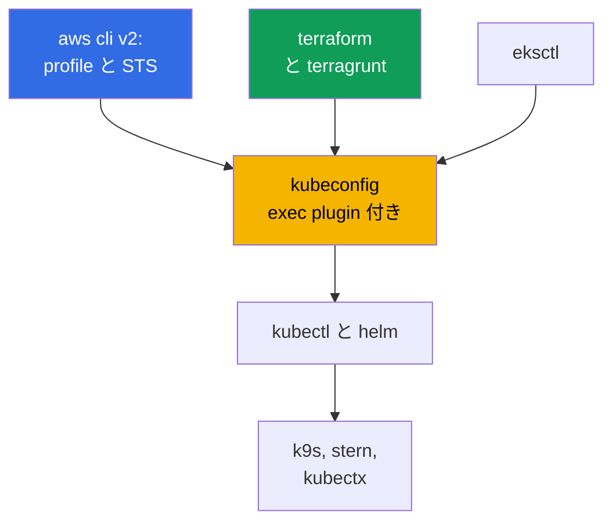
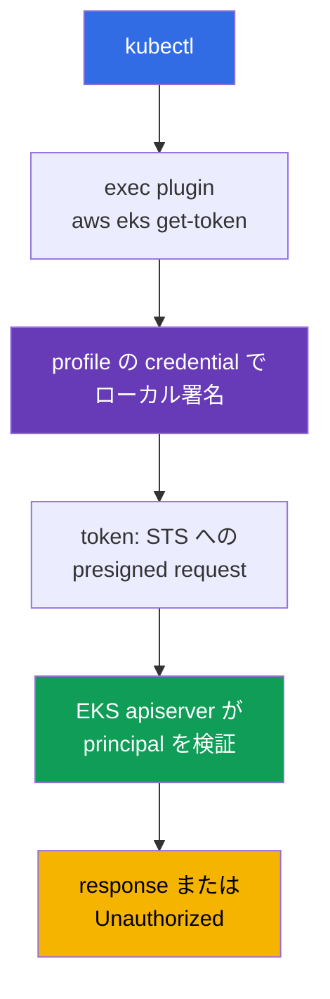
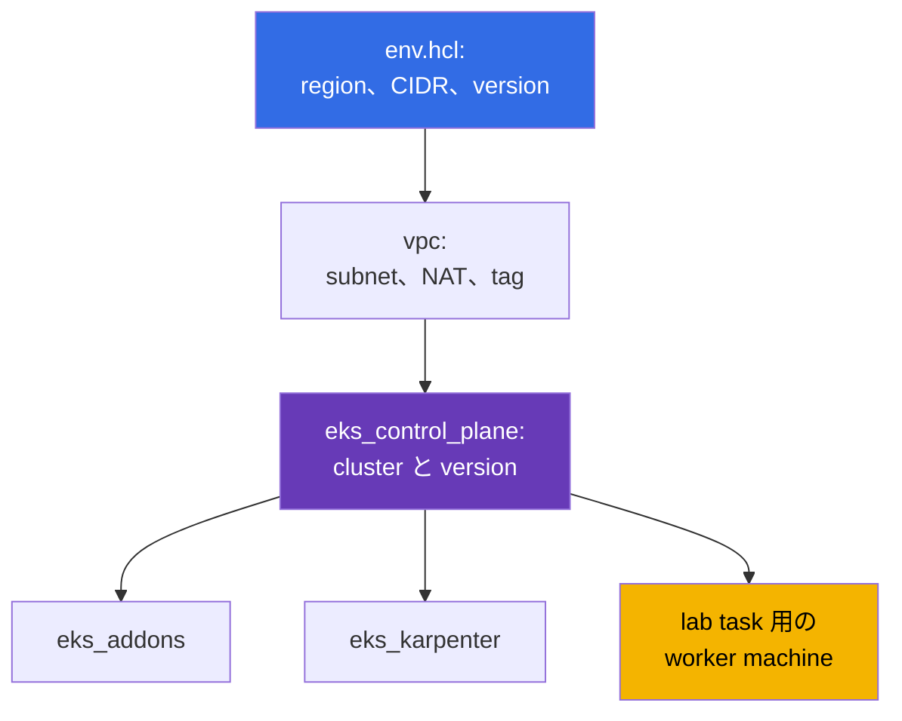

[Русская версия](ru.md) · [Eng version](en.md) · [Versión en español](es.md) · [Version française](fr.md) · [Deutsche Version](de.md) · [ქართული ვერსია](ge.md) · [繁體中文版](tw.md)
# 第 0.5 章. ツール: aws cli、eksctl、terraform と terragrunt、helm、便利な plugin

> **次に進む内容。** アカウントと billing (第 0.1 章)、IAM (0.2)、VPC (0.3)、EC2 (0.4) を終えました。
> 作業環境を整えるだけです。kubectl と helm はすでに知っていますが、EKS ではその上に
> AWS の層が加わります。aws cli profile、token 用 exec plugin、terraform と terragrunt による IaC、managed
> addons です。この章は新しい Kubernetes abstraction ではなく、ツールと習慣について説明します。次から
> Part 1 が始まります。EKS が担うことと自分で担うこと (第 1 章)、そして最初の cluster です。

## 0.5.1. EKS のツール層: kubectl に追加されるもの

kubeadm cluster ではセットは短いものでした。kubectl、helm、node への ssh です。EKS では二つ目の
層が現れます。cluster は AWS API が作成し、アクセスは IAM が付与し、node は launch template から生まれ、
system component は managed addon または chart として導入されます。



重要な点は、**EKS の kubectl は単独で完結しない**ことです。正しい profile を持つ動作中の aws cli が
そばになければ認証できません。ほぼすべての「奇妙な」アクセスエラーはここから生じます。

## 0.5.2. aws cli v2: profile、region、問題発生時の最初のコマンド

一つの package で導入できます (AWS サイトの archive、`brew install awscli`、distribution package)。重要なのは
一つだけです。**v1 ではなく v2**です。`aws configure sso` と最新の `eks get-token` が使えます。設定は
`~/.aws/config` (profile、region、SSO) と `~/.aws/credentials` (存在する場合の key) にあります。profile は
名前付きのアクセス parameter 集合で、常に複数持ちます。account と role ごとに一つ、`prod` には独自の
`role_arn` と `source_profile` があります。

profile は `--profile` flag または `AWS_PROFILE` 変数、region は `--region` または `AWS_REGION` で選びます。
変数の方が便利です。terraform、eksctl、helm provider からも見えるためです。長期 key は不要です。IAM Identity Center が
STS 経由でアクセスを付与します (第 0.2 章)。設定は一度だけで、以後は browser で login します。API response は巨大ですが、
`--query` の JMESPath expression と人間が読むための `--output table` という二つの flag が助けになります。

profile の切り替えと session 保持は、素の変数より utility が便利です。`aws-vault` は system keychain に credential を
保管し、secret を environment に公開せず一時 session で command を実行します: `aws-vault exec prod -- terraform apply`。
`granted` (`assume` command) は SSO profile を素早く切り替え、対象 account の console を別の browser tab で開くため、
「今どの account にいるか」という混乱を防ぎます。

```bash
export AWS_PROFILE=dev             # 使用する profile
export AWS_REGION=eu-central-1     # default region

# 問題発生時に必ず最初に実行する command: account、ARN identity、userId
aws sts get-caller-identity

aws configure sso --profile prod   # 一度だけ: start URL、account、role
aws sso login --profile prod       # 毎朝: 数時間有効な一時 credential

aws eks describe-cluster --name demo \
  --query 'cluster.{name:name,status:status,version:version}' --output table

aws ec2 describe-subnets --filters "Name=tag:karpenter.sh/discovery,Values=demo" \
  --query 'Subnets[].[SubnetId,AvailabilityZone,CidrBlock]' --output table
```

## 0.5.3. EKS 用 kubeconfig: kubectl が token を取得する仕組み

kubeconfig は一つの command で書き込まれます。既存 entry を壊さずに cluster、context、user を追加します。

```bash
# 最小構成に加え、context 名、個別 file、profile 固定を指定できる
aws eks update-kubeconfig --region eu-central-1 --name demo \
  --alias eks-demo --kubeconfig ~/.kube/eks-demo.yaml --profile prod
```

次に EKS 固有の点です。kubeconfig には **token も client certificate もありません**。その代わりに
`aws eks get-token --cluster-name demo` を実行する `exec` section があります。この command は現在の credential で
request に署名し、apiserver は IAM を通じて署名を検証し、principal を取得してから RBAC に map します。



ここでは余計な不安を抱きやすいため、仕組みを明確にします。plugin は **token のために STS へアクセスしません**。
credential で `sts:GetCallerIdentity` への presigned request をローカル署名し、この署名済み request 自体が token です。
提示されたものを検証するときに STS を呼ぶのは apiserver です。もう一つは、plugin が各 HTTP request ごとに動くわけではないことです。
`status.expirationTimestamp` field を持つ `ExecCredential` object を返し、`client-go` はその時刻まで取得済み credential を
process memory に保持します。そのため、長く動く `k9s`、`kubectl get -w`、loop 内の script は AWS API call の rate limit に
達しません。cache は process 内にあります。新しい `kubectl` は毎回 plugin を起動しますが、これは network call ではなく
ローカル署名です。

```bash
# client-go が現在の token を再利用する期限
aws eks get-token --cluster-name demo --query 'status.expirationTimestamp'
```

throttling に関する注意はありますが、token 自体についてではありません。profile credential が SSO または `assume-role` 経由なら、
CLI は IAM Identity Center と STS に実際にアクセスします。response は `~/.aws/sso/cache` と `~/.aws/cli/cache` に cache されます。
そのため「念のため」に削除すると、多数の call を起こして `Throttling` を受ける確実な方法になります。

- **kubeconfig に secret はありません**。token は短命で、権限は IAM と RBAC が決めます。
- **token は profile に依存します。** `AWS_PROFILE` を変更すると、同じ context でも別の identity で cluster にアクセスします。
  `update-kubeconfig` 時の `--profile` flag は `args` に書き込まれ、この曖昧さを取り除きます。cluster は多くなるため、
  `kubectl config get-contexts` と `use-context` が習慣になります (または `kubectx` が置き換えます)。
- **`error: You must be logged in to the server (Unauthorized)`** は通常 RBAC の問題ではなく principal の問題です。
  `aws sso login` の期限切れ、他の `AWS_PROFILE` の export、または role が cluster に追加されていないことです。確認順は
  `aws sts get-caller-identity`、次に access entries (第 5 章) です。

## 0.5.4. eksctl: 優れた偵察役、production の所有者には不適

`eksctl` は EKS の公式 CLI です。一つの command で VPC、node group、role、OIDC provider を含む cluster を作成します。
内部では直接の API call ではなく CloudFormation を生成します。

```bash
eksctl create cluster --name demo --region eu-central-1 --version 1.34 \
  --nodegroup-name ng-default --node-type t3.medium --nodes 2 --managed

# 作成方法を問わない cluster の調査
eksctl get cluster --region eu-central-1
eksctl get nodegroup --cluster demo --region eu-central-1
```

一日だけ cluster を立ち上げたり、node group と addon の概要を確認したりするには不可欠です。production では破綻します。
command は **imperative** で state が repository に記述されず、内部に **独自の CloudFormation** があり terraform から見えず、
IaC 外での変更は **drift** を生みます。一部を eksctl、一部を terraform で作成した cluster は、きれいに削除することがほぼ不可能です。
このコースの規則は、**eksctl と console は読み、terraform は書く**ことです (第 4 章)。

| 方法 | 長所 | 短所 | 使用するとき |
|--------|-------|--------|-----------------|
| AWS console | 分かりやすく準備不要 | 再現性なし | 確認、試行 |
| `eksctl` | 一つの command で cluster | imperative、独自 CFN | 学習、ad hoc、偵察 |
| terraform + terragrunt | git の code、review | 初動が遅く HCL が必要 | 長期間残るすべて |

## 0.5.5. terraform: cluster を code で記述する理由

EKS cluster は一つの resource ではありません。tag を持つ VPC、subnet、IAM role、OIDC provider、node
 group、addon、security group です。手作業で組み立てることはできますが、三つの environment で一年後に
再現することはできません。最初の `apply` の前に理解すべきことは三つです。

- **State.** 「code 内の resource - AWS 内の resource」の対応は state file に保存されます。team では、二人の engineer が
  同時に `apply` しないよう lock を備えた remote location に置かれます。repository では backend は
  `terraform/environments/terragrunt.hcl` に一度定義されます。`encrypt = true` を持つ S3 bucket、lock 用の DynamoDB table、
  stack path から得る state key です。
- **Providers.** `aws` は AWS resource を作成し、`kubernetes` と `helm` はすでに起動済みの cluster 内で動作します。
  ここから鶏と卵の問題が生じます。`kubernetes` provider は planning 時にまだ存在しないかもしれない cluster 向けに設定されるため、
  cluster とその内部 content は別 stack に分けます。
- **Modules.** input と output を持つ再利用可能な block です。VPC 用、control plane 用、node group 用に一つずつあります。
  このコースの lab は `terraform/modules` の module を使い、command は通常どおりです:
  `terraform init`、`plan`、`apply`、`destroy`。

## 0.5.6. terragrunt: このコースの environment 構成

Terragrunt は terraform の薄い wrapper です。copy-paste をなくします。全 stack 共通の backend、environment parameter を一か所に、
stack 間 dependency、複数 stack を一つの command で実行する機能です。lab environment はこのように組まれています。lab directory に
parameter を持つ `env.hcl` があり、stack ごとの subdirectory にそれぞれ `terragrunt.hcl` があります。



lab 02 の `env.hcl` に実際に含まれるものです (Karpenter、第 12 章)。`region = "eu-central-1"`、
`vpc_default_cidr = "10.10.0.0/16"`、`stack_name`、`stack_name` に `TF_VAR_USER_ID` と `TF_VAR_ENV_ID` を加えた
 environment 名 `env_name` (このため各 student の resource 名は異なります)、二つの public subnet と四つの private subnet
 (EKS 用二つ、RDS 用二つ) の map `subnets`、`kubernetes.io/role/elb`、`kubernetes.io/role/internal-elb`、
`karpenter.sh/discovery` tag、subnet ごとの NAT mode (`DEFAULT`、`SINGLE`、`NONE`)、`k8_version`、
`node_type` (`ondemand` または `spot`)、instance type と spot type の list、`gp3` の `root_volume`、cost accounting 用の
共通 `tags` です。表示したもの以外に `ssh-keys` と `eks_fargate_system` stack もあります。dependency は
`dependency` block で記述します。`eks_control_plane` は `dependency "vpc"` を宣言し、その output から `vpc_id` と
subnet list を取得します。terragrunt はこれらの block から実行 graph を構築します。

```bash
terragrunt run-all apply     # dependency を考慮した全 stack。destroy は逆順
terragrunt run-all output    # 全 stack の output を収集
```

binary についても補足します。Terragrunt は terraform と **OpenTofu** の両方で同じように動きます。OpenTofu は license への
依存を避けるためによく選ばれる open fork です。このコースの module と `terragrunt.hcl` は互換性があり、code を変更する必要は
ありません。orchestrate に使う binary を指定するだけです。

```hcl
# terragrunt.hcl: plan と apply を実行する binary
terraform_binary = "tofu"
```

同じことは environment variable (`TERRAGRUNT_TFPATH`、新しい version では `TG_TF_PATH`) でも設定でき、CI では便利です。
新しい Terragrunt version は `tofu` があれば自動的に優先するため、両方の binary がある machine では明示的に選択を固定します。
そうしないと、local と pipeline の plan が別の tool で計算される可能性があります。

## 0.5.7. helm: controller の導入と managed addon を選ぶ場合

Helm はすでに知っているため、ここでは EKS に絞ります。AWS Load Balancer Controller (第 26 章)、Karpenter (12)、
external-dns と cert-manager (29)、kube-prometheus-stack (33)、External Secrets (18)、Fluent Bit (34) など、
platform layer のほぼすべてを chart で導入します。AWS の chart の一部は `oci://public.ecr.aws` にあり、考え方は同じです。
明示した version と git 内の自分の `values.yaml` です。

```bash
helm repo add eks https://aws.github.io/eks-charts && helm repo update

helm upgrade --install aws-load-balancer-controller eks/aws-load-balancer-controller \
  --namespace kube-system --version 1.13.0 \
  --set clusterName=demo --set serviceAccount.create=false \
  --set serviceAccount.name=aws-load-balancer-controller

helm get values aws-load-balancer-controller -n kube-system   # 導入済み values を確認
```

public chart は authorization なしで取得できますが、company の **独自 platform chart** は通常 private ECR にあり、helm は docker とは
別に login が必要です。OCI registry なので docker と同じ token を使う `helm registry login` が動作します。

```bash
# private ECR に helm を login。token は数時間有効で、CI では install 前にこの step を繰り返す
aws ecr get-login-password --region eu-central-1 \
  | helm registry login --username AWS --password-stdin \
    123456789012.dkr.ecr.eu-central-1.amazonaws.com

# 次は通常どおりだが、oci link と明示した version で chart を導入する
helm upgrade --install platform-base \
  oci://123456789012.dkr.ecr.eu-central-1.amazonaws.com/charts/platform-base \
  --version 2.4.1 -n platform -f values-prod.yaml
```

user 名は常に文字どおり `AWS` で、password は一時 token です。そのため pipeline では保存された secret ではなく、install の前の
step になります。pull 権限は image と同じ IAM role が付与し、cross-account access は repository policy が決めます (第 20 章)。

二つの習慣があります。**`--version` なしには決して導入しない**ことです。そうしないと次回の `upgrade` で cluster が自動的に変わります。
もう一つは、誰かの bash history にある `--set` ではなく **file 内の values** を使うことです。chart が多いときは declarative に保持します。
`helmfile` は一つの `helmfile.yaml` に version と `values.yaml` path を持つ release list を記述し、`helmfile apply` は cluster を
その記述へ一致させます。terraform の「git 内の code」と同じ原則を helm に適用するものです。VPC CNI、kube-proxy、CoreDNS、
EBS CSI、Pod Identity Agent のような一部 component は、AWS が **managed addons** として提供します。互換性は AWS が計算し、
update は cluster API 経由です。自由度は下がりますが、作業も減ります。

| 基準 | Managed addon | Helm chart |
|----------|---------------|-----------|
| cluster version との互換性 | AWS が検証 | 自分で検証 |
| 更新 | API EKS、IaC と console に表示 | pipeline 内の `helm upgrade` |
| values の柔軟性 | 制限あり | 完全 |
| incident を調査する人 | AWS support に context がある | 自分たち |

通常の実践は、base component を managed addons、application 向けと急速に発展するもの (Karpenter、LB Controller、observability) を
helm にすることです。境界は第 37 章で扱います。

## 0.5.8. 便利な plugin と utility

| ツール | 一行での用途 |
|------------|----------------------|
| `kubectx` / `kubens` | kubeconfig を編集せず context と namespace を切り替える |
| `k9s` | terminal UI: Pod、log、event、二回の操作で exec |
| `stern` | prefix または selector に一致する全 Pod の log |
| `krew` | kubectl plugin manager。これで他の plugin を導入する |
| `kubectl-neat` | `get -o yaml` から service noise を取り除く |
| `eks-node-viewer` | load と cost を伴う EKS node map。Karpenter 作業で必要 |
| `kubectl-k8i` | load、instance type、spot または on-demand、zone、NodePool を持つ node table |
| `jq` | `--query` が扱いにくい場合に aws cli の JSON を filter |
| `yq` | YAML に同じ手法を使う: chart values、manifest、kubeconfig |

```bash
kubectx eks-demo && kubens kube-system   # context と namespace
stern -n kube-system karpenter           # Karpenter の全 Pod の log
aws eks describe-nodegroup --cluster-name demo --nodegroup-name ng-default | jq '.nodegroup'
```

plugin については個別に説明する価値があります。日常の便利機能の半分はここにあるためです。仕組みは単純です。
**`PATH` にある `kubectl-<name>` という任意の executable file は、`kubectl <name>` subcommand になります**。手作業で
導入する必要はなく、そのために index、search、update を提供する plugin manager **krew** があります。

```bash
kubectl krew update                  # plugin index を更新
kubectl krew search                  # 全 catalog。語による検索: krew search node
kubectl krew info k8i                # 説明、version、home page
kubectl krew install k8i             # 導入
kubectl krew list                    # 導入済みのもの
kubectl krew upgrade                 # 導入済みをすべて更新
kubectl krew uninstall k8i           # 削除

kubectl plugin list                  # kubectl から見える PATH 内の plugin
```

plugin は main index だけにあるとは限りません。独自または company index は追加 index として接続できます。その後 plugin は prefix で
導入します (`kubectl krew index add <name> <git-url>`、続いて `kubectl krew install <name>/<plugin>`)。ただし plugin は
自分の権限と kubeconfig で実行される外部 executable file です。production environment では plugin list を、他の dependency と
同様に承認します (第 20 章)。

EKS で特に便利な plugin の例が **`kubectl-k8i`** です。標準の `kubectl get nodes` は node を抽象的な machine として示しますが、
EKS では通常、別の質問をします。spot か on-demand か、どの instance type か、どの zone か、どの NodePool からか、誰が作成したか
(Karpenter、Cluster Autoscaler、Spot.io)、そして requests と limits に対して実際にどの程度 load されているかです。`k8i` は
これらを load percentage を持つ一つの table にまとめ、どの属性でも filter と sort ができ、taint で node を group 化し、
`analyze` subcommand では選択した node にどの workload があり limits と requests がどれほど異なるかを表示します。

```bash
# Plugin: github.com/ViktorUJ/kubectl-k8i (krew にある。あるいは releases から binary)
kubectl krew install k8i

kubectl k8i                                    # 全 node: load、type、zone、pool
kubectl k8i --filter ec2_type=spot             # spot node のみ (第 13 章)
kubectl k8i --autoscaler karpenter --sort cpu_load=desc   # load 順の Karpenter node
kubectl k8i --group-by taint                   # どの論理 node group があるか
kubectl k8i analyze --autoscaler karpenter --cpu-overcommit 100   # 要求が五分の一の workload
```

usage 値は metrics-server から来ます。これがなければ load column は zero になりますが、requests と limits は確認できます。
これは第 12 と 13 章 (NodePool、spot)、特に requests、limits、実際の消費の差を扱う第 14 章で役立ちます。

## 0.5.9. 作業 environment の衛生管理

- **version を固定します。** kubectl は cluster と minor version の範囲内、terraform と terragrunt は repository で pin し、
  chart version は code に置きます。そうしないと `apply` の結果が毎回異なります。
- **profile は account ごとに分離します。** profile 名は environment (`dev`、`stage`、`prod`) と一致させ、`prod` には固有の
  `role_arn` と MFA を持たせます。production を指す `default` profile は使いません。長期 key は一切ありません。
  `aws configure sso` と `aws sso login` を使い、有効期限は時間単位です (第 0.2 章)。`~/.aws/credentials` 内の `AKIA...` は
  発生を待つ incident です。
- **破壊的 command の前に region と account を確認します。** `aws sts get-caller-identity` と
  `kubectl config current-context` は `run-all destroy` の前に五秒で済み、shell prompt の account 強調表示は
  「別の場所を削除した」という一連の error を防ぎます。
- **CLI hint を有効にします。** aws cli v2 には built-in auto-prompt があります。`on-partial` mode は subcommand と
  parameter を示しますが、command が不完全または validation に失敗したときだけ介入します。当番中、長い `--query` と
  `--filters` を組み立てる時間を節約します。

```bash
aws configure set cli_auto_prompt on-partial   # mode: on、on-partial、off
```

## 0.5.10. production での適用方法

- **cluster を作成するのは IaC だけです。** terraform または terragrunt の repository、PR の review、個別 role による CI からの
  apply を使用します。console では read のみです。
- **統一したツール image。** version を固定した aws cli、kubectl、helm、terraform、terragrunt を含む container または devcontainer を
  用意します。engineer と CI は同じセットを使います。
- **SSO と role によるアクセス。** role は一時的に付与され、kubeconfig は exec plugin 経由で token を取得し、アクセスの revoke は
  cluster を編集せず Identity Center で行います。
- **eksctl は diagnostic tool として保持します。** `get nodegroup` と `get addon` のために使いますが、production は操作しません。
  AWS に managed addon として任せられるものは任せ、残りは GitOps 経由で明示した version の chart として導入します (第 44 章)。

## 0.5.11. ミニ用語集

- **aws cli v2** は AWS の主要 CLI です。設定は `~/.aws/config` にあり、アクセスは `--profile` または
  `AWS_PROFILE` で選びます。**profile** は region、role、SSO を含む名前付き parameter 集合です。
  **`aws sts get-caller-identity`** は「自分は誰か」を確認する command です。account、ARN、userId を示します。
  **`aws-vault`** は credential を keychain に保管して一時 session で command を実行し、
  **`granted`** (`assume`) は SSO profile を素早く切り替え console に login します。
- **kubeconfig exec plugin** は `aws eks get-token` を呼び出す `exec` section です。file に長期 token はなく、
  取得した credential は `client-go` が `status.expirationTimestamp` まで cache します。**eksctl** は EKS 公式 CLI で、
  CloudFormation を通じて動作し、imperative です。
- **kubectl plugin** は `PATH` 内の `kubectl-<name>` file であり、`kubectl <name>` として使えます。
  **krew** は index、`search`、`install`、`upgrade` を持つ plugin manager で、独自 index もサポートします。
  **`kubectl plugin list`** は kubectl が `PATH` に見つけたものを示します。
- **State** は terraform の state file で、team では lock 付き remote location に保存します。
  **provider** は terraform plugin (`aws`、`kubernetes`、`helm`) です。
- **terragrunt** は terraform の wrapper です。共通 backend、`env.hcl`、`dependency`、`run-all`、copy-paste のない
  DRY module を提供します。**OpenTofu** は terraform の open fork で、このコースの module と互換性があります。
  `terraform_binary = "tofu"` attribute で選択します。**stack** は一つの `terragrunt.hcl` を持ち unit として apply される
  directory です。**helmfile** は version と values を一つの file に持つ helm release set の declarative 記述です。
  **Managed addon** は EKS が version と update を管理する cluster component です。

## 0.5.12. この章のまとめ

- aws cli v2 と profile、`AWS_REGION` はすべての基盤です。`aws sts get-caller-identity` は理解できない error で最初に実行する
  command であり、`--query` と `--output table` は API response を読みやすくします。
- `aws eks update-kubeconfig` は secret のない context を作成します。token は `aws eks get-token` が取得するため、
  `Unauthorized` は通常、profile が違うか SSO が期限切れであることを示します (第 5 章)。
- eksctl は素早い cluster と偵察に適していますが、独自の CloudFormation を生成し drift を引き起こします。production は
  terraform と terragrunt で記述します (第 4 章)。terragrunt は `env.hcl`、stack への分割、stack 間 dependency を追加します。
  このようにコースの lab は構成されています。
- Helm は明示した version と git の values で controller を導入し、base component は多くの場合 managed addons にします (第 37 章)。
  plugin と environment hygiene (version 固定、profile 分離、長期 key を使わないこと、`destroy` 前の account 確認) は
  時間と費用を節約します。

## 0.5.13. 実際の業務で役立つ点

ツール層は incident における反応速度を決めます。node が cluster に参加しないとき (第 45 章)、一分で profile を切り替え、
`eksctl get nodegroup` で node group を調べ、`stern` で log を読み、`describe-subnets` で subnet tag を照合できます。
別の account で environment を再現する必要があれば、`env.hcl` を変更して `run-all` を実行します。

## 0.5.14. 自己確認の質問

1. `~/.aws/config` と `~/.aws/credentials` の違いは何ですか。また `AWS_PROFILE` は何をしますか。
2. なぜアクセス問題では最初に `aws sts get-caller-identity` を実行しますか。
3. EKS の kubeconfig には token の代わりに何があり、kubectl はどのようにアクセスを取得しますか。
4. `kubectl` が `Unauthorized` を返します。RBAC より前に確認する三つの原因は何ですか。
5. eksctl は何に適し、なぜ production cluster の作成には使わないのですか。
6. terragrunt は terraform に何を追加し、`vpc` と `eks_control_plane` stack はどう結び付きますか。
7. component を managed addon として導入する方がよいのはいつで、helm chart にする方がよいのはいつですか。
8. kubectl は plugin をどう見つけ、krew はどのように助けますか。検索と更新にはどの command を使いますか。
9. EKS の `kubectl get nodes` は node に関するすべての質問に答えないのはなぜで、`k8i` は何を追加しますか。

## 演習

Part 0 には独自の lab はありませんが、ここでコースの lab の実行方法を理解するのに便利です。environment は repository root の
Makefile target により展開されます。target は lab directory を working directory に copy し、そこで core 数に応じた parallelism を
持つ `terragrunt run-all` を実行します。lab 番号は `TASK` variable で渡し、environment identifier は `USER_ID` と `ENV_ID` です。
これらは `env_name` に入り、student 間で resource が衝突しません。

```bash
TASK=02 make run_eks_task          # lab 02 (Karpenter、第 12 章) の environment を展開
make output_eks_task               # stack output: cluster parameter、worker machine address
TASK=02 make delete_eks_task       # NAT、cluster、node の費用を避けるため environment を削除
TASK=02 make run_eks_task_clean    # working directory を消去して再展開
```

展開後は environment の worker machine に入り、kubeconfig を取得して通常どおり kubectl を使います。task は worker machine の
`check_result` command で検証します。この command は cluster state の自動確認を実行し、task が合格したかを示します。まず
`aws sts get-caller-identity` と `kubectl config current-context` を実行するべきです。次は Part 1 です。EKS が具体的に何を
担うのか、そして managed control plane が managed cluster を意味しない理由を説明します。

---
[目次](../README_JP.md) · [第 0.4 章](../00-4-ec2/jp.md) · [第 1 章](../01/jp.md)
