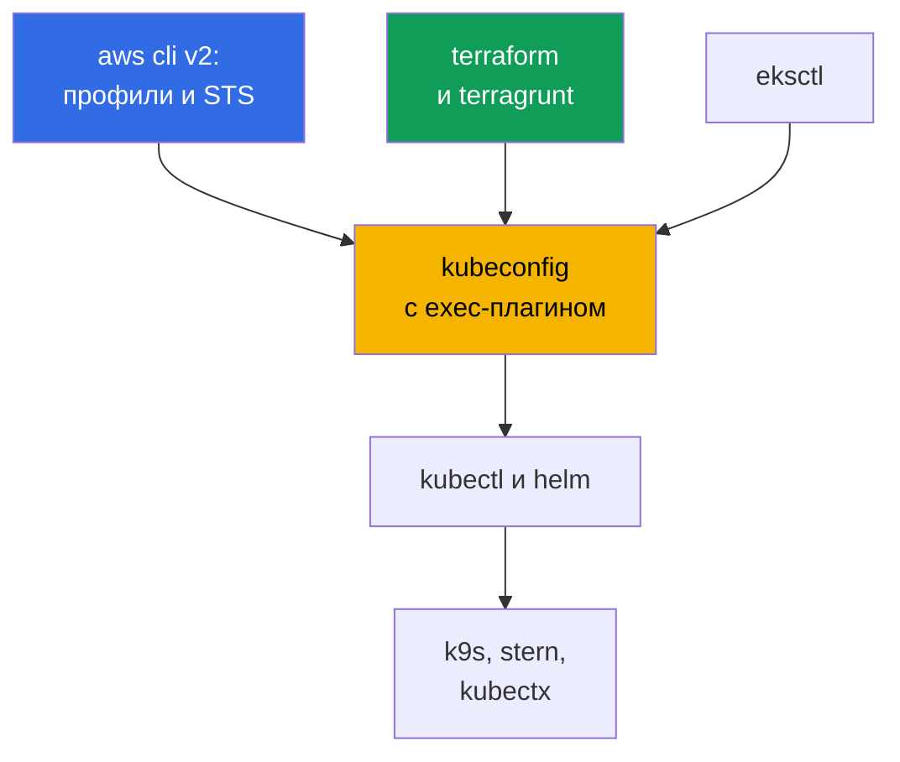
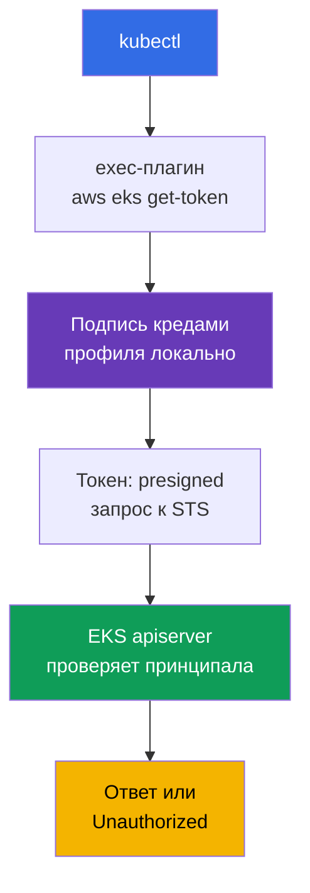
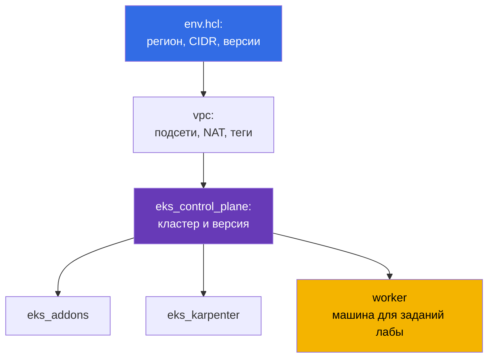

[Eng version](en.md) · [Versión en español](es.md) · [Version française](fr.md) · [Deutsche Version](de.md) · [ქართული ვერსია](ge.md) · [繁體中文版](tw.md) · [日本語版](jp.md)
# Глава 0.5. Инструменты: aws cli, eksctl, terraform и terragrunt, helm, полезные плагины

> **Что дальше.** За спиной аккаунт и биллинг (глава 0.1), IAM (0.2), VPC (0.3) и EC2 (0.4).
> Осталось собрать рабочее место: kubectl и helm вы знаете, но в EKS к ним добавляется слой
> AWS - профили aws cli, exec-плагин для токена, IaC на terraform и terragrunt, managed
> addons. Глава про инструменты и привычки, а не про новые абстракции Kubernetes. Дальше
> начинается Часть 1: что берёт на себя EKS и что остаётся на вас (глава 1), и первый кластер.

## 0.5.1. Инструментальный слой EKS: что добавляется к kubectl

В kubeadm-кластере набор был короткий: kubectl, helm, ssh на ноды. В EKS появляется второй
контур: кластер создаёт API AWS, доступ выдаёт IAM, ноды рождаются из launch template, а
системные компоненты ставятся либо как managed addon, либо чартом.



Ключевая мысль: **kubectl в EKS не самодостаточен**. Он не аутентифицируется, если рядом нет
работающего aws cli с правильным профилем. Отсюда почти все «странные» ошибки доступа.

## 0.5.2. aws cli v2: профили, регион и первая команда при любой проблеме

Ставится одним пакетом (архив с сайта AWS, `brew install awscli`, пакет дистрибутива). Важно
одно: **v2, не v1** - там есть `aws configure sso` и актуальный `eks get-token`. Конфигурация
живёт в `~/.aws/config` (профили, регионы, SSO) и `~/.aws/credentials` (ключи, если они вообще
есть). Профиль - именованный набор параметров доступа, и их всегда несколько: по одному на
аккаунт и роль, у `prod` свой `role_arn` и `source_profile`.

Профиль выбирается флагом `--profile` или переменной `AWS_PROFILE`, регион - `--region` или
`AWS_REGION`. Переменные удобнее: их видят и terraform, и eksctl, и helm-провайдеры.
Долгоживущие ключи не нужны: доступ выдаёт IAM Identity Center через STS (глава 0.2),
настройка разовая, дальше вход по браузеру. Ответы API огромные, и два флага спасают:
`--query` с выражением JMESPath и `--output table` для чтения человеком.

Переключать профили и хранить сессии удобнее не голыми переменными, а утилитами. `aws-vault`
держит креды в системном keychain и запускает команду во временной сессии, не выкладывая
секрет в окружение: `aws-vault exec prod -- terraform apply`. `granted` (команда `assume`)
быстро переключает SSO-профили и открывает консоль нужного аккаунта в отдельной вкладке
браузера, что снимает путаницу «в каком аккаунте я сейчас».

```bash
export AWS_PROFILE=dev             # какой профиль использовать
export AWS_REGION=eu-central-1     # регион по умолчанию

# Первая команда при ЛЮБОЙ проблеме: аккаунт, ARN identity, userId
aws sts get-caller-identity

aws configure sso --profile prod   # один раз: start URL, аккаунт, роль
aws sso login --profile prod       # каждое утро: временные креды на несколько часов

aws eks describe-cluster --name demo \
  --query 'cluster.{name:name,status:status,version:version}' --output table

aws ec2 describe-subnets --filters "Name=tag:karpenter.sh/discovery,Values=demo" \
  --query 'Subnets[].[SubnetId,AvailabilityZone,CidrBlock]' --output table
```

## 0.5.3. kubeconfig для EKS: как kubectl получает токен

kubeconfig пишется одной командой: она добавляет кластер, контекст и пользователя, не ломая
существующие записи.

```bash
# Минимум, плюс опции: своё имя контекста, отдельный файл, фиксация профиля
aws eks update-kubeconfig --region eu-central-1 --name demo \
  --alias eks-demo --kubeconfig ~/.kube/eks-demo.yaml --profile prod
```

Дальше специфика EKS: в kubeconfig **нет ни токена, ни клиентского сертификата**. Вместо них
секция `exec`, которая запускает `aws eks get-token --cluster-name demo`. Тот подписывает
запрос текущими кредами, а apiserver проверяет подпись через IAM и получает принципала,
который дальше маппится на RBAC.



Здесь легко напридумывать лишних страхов, поэтому уточним механику. Плагин **не обращается в
STS за токеном**: он локально подписывает вашими кредами presigned-запрос к
`sts:GetCallerIdentity`, и этот подписанный запрос и есть токен. Вызов в STS делает уже
apiserver, когда проверяет предъявленное. Второе: плагин работает не на каждый HTTP-запрос -
он возвращает объект `ExecCredential` с полем `status.expirationTimestamp`, и `client-go`
держит полученные креды в памяти процесса до этого времени. Поэтому долгоживущий `k9s`,
`kubectl get -w` или скрипт в цикле не упираются в лимиты частоты вызовов AWS API. Кэш живёт в
рамках процесса: каждый новый `kubectl` снова запускает плагин, но это локальная подпись, не
сетевой вызов.

```bash
# До какого момента client-go будет переиспользовать текущий токен
aws eks get-token --cluster-name demo --query 'status.expirationTimestamp'
```

Оговорка про throttling всё же есть, но она не про сам токен: если креды профиля приходят из
SSO или через `assume-role`, то за ними CLI ходит в IAM Identity Center и STS по-настоящему.
Эти ответы кэшируются в `~/.aws/sso/cache` и `~/.aws/cli/cache`, поэтому удалять их «на всякий
случай» - верный способ устроить себе шквал вызовов и получить `Throttling`.

- **В kubeconfig нет секрета**, токен короткоживущий, права определяет IAM плюс RBAC.
- **Токен зависит от профиля.** Смените `AWS_PROFILE` - и тот же контекст пойдёт в кластер от
  другой identity; флаг `--profile` при `update-kubeconfig` пишется в `args` и снимает эту
  неоднозначность. Кластеров будет много, поэтому `kubectl config get-contexts` и
  `use-context` войдут в привычку (или их заменит `kubectx`).
- **`error: You must be logged in to the server (Unauthorized)`** обычно не про RBAC, а про
  принципала: истёк `aws sso login`, экспортирован чужой `AWS_PROFILE`, или роль не добавлена
  в кластер. Порядок проверки: `aws sts get-caller-identity`, затем access entries (глава 5).

## 0.5.4. eksctl: отличный разведчик, плохой владелец продакшена

`eksctl` - официальная CLI для EKS. Одной командой создаёт кластер с VPC, node group, ролями
и OIDC-провайдером. Внутри это не прямые вызовы API, а генерация CloudFormation.

```bash
eksctl create cluster --name demo --region eu-central-1 --version 1.34 \
  --nodegroup-name ng-default --node-type t3.medium --nodes 2 --managed

# Разведка кластера, созданного чем угодно
eksctl get cluster --region eu-central-1
eksctl get nodegroup --cluster demo --region eu-central-1
```

Он незаменим, чтобы поднять кластер на день или посмотреть сводку по node groups и аддонам.
Для продакшена ломается: команды **императивны** (состояние не описано в репозитории), под
капотом **свой CloudFormation**, невидимый вашему terraform, а правка мимо IaC даёт **дрейф**.
Кластер, часть которого создана eksctl, а часть terraform, почти невозможно удалить чисто.
Правило курса: **eksctl и консоль читают, terraform пишет** (глава 4).

| Способ | Плюсы | Минусы | Когда применять |
|--------|-------|--------|-----------------|
| Консоль AWS | наглядно, ноль подготовки | нет воспроизводимости | посмотреть, потрогать |
| `eksctl` | кластер за одну команду | императивность, свой CFN | учёба, ad hoc, разведка |
| terraform + terragrunt | код в git, review | дольше старт, нужен HCL | всё, что живёт долго |

## 0.5.5. terraform: почему кластер описывают кодом

Кластер EKS - это не один ресурс, а VPC с тегами, подсети, IAM-роли, OIDC-провайдер, node
groups, аддоны, security groups. Собрать руками можно, повторить в трёх средах и через год -
нет. Три вещи, которые надо понимать до первого `apply`:

- **State.** Соответствие «ресурс в коде - ресурс в AWS» хранится в файле состояния. Для
  команды он лежит удалённо с блокировкой, чтобы два инженера не делали `apply` одновременно.
  В репозитории backend задан один раз в `terraform/environments/terragrunt.hcl`: бакет S3 с
  `encrypt = true`, DynamoDB-таблица для блокировок, ключ состояния из пути стека.
- **Providers.** `aws` создаёт ресурсы AWS, `kubernetes` и `helm` работают внутри уже
  поднятого кластера. Отсюда проблема курицы и яйца: провайдер `kubernetes` настраивается на
  кластер, которого при планировании может не быть, поэтому кластер и его содержимое разводят
  по разным стекам.
- **Модули.** Повторяемый блок с входами и выходами: один на VPC, один на control plane, один
  на node group. Лабы курса используют модули из `terraform/modules`, команды привычные:
  `terraform init`, `plan`, `apply`, `destroy`.

## 0.5.6. terragrunt: как устроены стенды этого курса

Terragrunt - тонкая обёртка над terraform. Она снимает копипасту: единый backend для всех
стеков, параметры окружения в одном месте, зависимости между стеками, запуск группы стеков
одной командой. Стенды лаб собраны так: в каталоге лабы лежит `env.hcl` с параметрами и по
подкаталогу на стек, в каждом свой `terragrunt.hcl`.



Что реально лежит в `env.hcl` лабы 02 (Karpenter, глава 12): `region = "eu-central-1"`,
`vpc_default_cidr = "10.10.0.0/16"`, `stack_name`, имя стенда `env_name` из `stack_name` плюс
`TF_VAR_USER_ID` и `TF_VAR_ENV_ID` (поэтому у каждого студента свои имена ресурсов), карта
`subnets` из двух публичных и четырёх приватных подсетей (две под EKS, две под RDS) с тегами
`kubernetes.io/role/elb`, `kubernetes.io/role/internal-elb` и `karpenter.sh/discovery`, режим
NAT на подсеть (`DEFAULT`, `SINGLE`, `NONE`), `k8_version`, `node_type` (`ondemand` или
`spot`), типы инстансов и список спот-типов, `root_volume` на `gp3`, общие `tags` для учёта
расходов. Кроме показанных, есть стеки `ssh-keys` и `eks_fargate_system`. Зависимости описаны
блоком `dependency`: `eks_control_plane` объявляет `dependency "vpc"` и берёт из его выходов
`vpc_id` и списки подсетей, а terragrunt по этим блокам строит граф запуска.

```bash
terragrunt run-all apply     # все стеки с учётом зависимостей; destroy - в обратном порядке
terragrunt run-all output    # собрать выходы всех стеков
```

Отдельно про бинарь. Terragrunt одинаково работает и с terraform, и с **OpenTofu** - открытым
форком, который часто выбирают, чтобы не зависеть от лицензии. Модули и `terragrunt.hcl` этого
курса с ним совместимы, менять код не нужно, достаточно указать, чем оркестрировать:

```hcl
# terragrunt.hcl: чем именно запускать план и apply
terraform_binary = "tofu"
```

То же задаётся переменной окружения (`TERRAGRUNT_TFPATH`, в новых версиях `TG_TF_PATH`), что
удобно в CI. Свежие версии Terragrunt при наличии `tofu` предпочитают его сами, поэтому на
машинах, где стоят оба бинаря, выбор фиксируют явно - иначе локально и в пайплайне план может
считаться разными инструментами.

## 0.5.7. helm: чем ставят контроллеры, и когда лучше managed addon

Helm вам знаком, поэтому только про EKS. Чартами ставится почти весь платформенный слой: AWS
Load Balancer Controller (глава 26), Karpenter (12), external-dns и cert-manager (29),
kube-prometheus-stack (33), External Secrets (18), Fluent Bit (34). Часть чартов AWS живёт в
`oci://public.ecr.aws`, логика одна: явная версия плюс свой `values.yaml` в git.

```bash
helm repo add eks https://aws.github.io/eks-charts && helm repo update

helm upgrade --install aws-load-balancer-controller eks/aws-load-balancer-controller \
  --namespace kube-system --version 1.13.0 \
  --set clusterName=demo --set serviceAccount.create=false \
  --set serviceAccount.name=aws-load-balancer-controller

helm get values aws-load-balancer-controller -n kube-system   # с какими values стоит
```

Публичные чарты тянутся без авторизации, а вот **свои платформенные чарты** компании обычно
лежат в приватном ECR, и туда helm нужно логинить отдельно от docker. Реестр OCI, поэтому
работает `helm registry login` с тем же токеном, что и у docker:

```bash
# Логин helm в приватный ECR; токен живёт часами, в CI шаг повторяют перед install
aws ecr get-login-password --region eu-central-1 \
  | helm registry login --username AWS --password-stdin \
    123456789012.dkr.ecr.eu-central-1.amazonaws.com

# Дальше чарт ставится как обычно, но по oci-ссылке и с явной версией
helm upgrade --install platform-base \
  oci://123456789012.dkr.ecr.eu-central-1.amazonaws.com/charts/platform-base \
  --version 2.4.1 -n platform -f values-prod.yaml
```

Имя пользователя всегда буквально `AWS`, а пароль - временный токен, поэтому в пайплайне это
шаг перед установкой, а не сохранённый секрет. Права на pull даёт та же IAM-роль, что и для
образов, а cross-account доступ - политика репозитория (глава 20).

Две привычки: **никогда без `--version`** (иначе кластер меняется сам при следующем `upgrade`)
и **values в файле**, а не в `--set` из чьей-то истории bash. Когда чартов много, их держат
декларативно: `helmfile` описывает список релизов с версиями и путями к `values.yaml` в одном
`helmfile.yaml`, а `helmfile apply` приводит кластер к этому описанию - тот же принцип «код в
git», что и у terraform, только для helm. Часть компонентов (VPC CNI,
kube-proxy, CoreDNS, EBS CSI, Pod Identity Agent) AWS предлагает как **managed addons**:
совместимость считает AWS, обновление идёт через API кластера. Меньше свободы, меньше работы.

| Критерий | Managed addon | Helm-чарт |
|----------|---------------|-----------|
| Совместимость с версией кластера | проверяет AWS | проверяете вы |
| Обновление | API EKS, видно в IaC и консоли | `helm upgrade` в вашем пайплайне |
| Гибкость values | ограниченная | полная |
| Кто разбирает инцидент | AWS support имеет контекст | вы |

Практика по умолчанию: базовые компоненты - managed addons, всё прикладное и быстро
развивающееся (Karpenter, LB Controller, наблюдаемость) - helm. Граница в главе 37.

## 0.5.8. Полезные плагины и утилиты

| Инструмент | Польза в одну строку |
|------------|----------------------|
| `kubectx` / `kubens` | переключение контекста и namespace без правки kubeconfig |
| `k9s` | терминальный UI: поды, логи, события, exec в два нажатия |
| `stern` | логи сразу из всех подов по префиксу или селектору |
| `krew` | менеджер плагинов kubectl, через него ставится остальное |
| `kubectl-neat` | убирает служебный шум из `get -o yaml` |
| `eks-node-viewer` | карта нод EKS с загрузкой и стоимостью, нужен при работе с Karpenter |
| `kubectl-k8i` | таблица нод с загрузкой, типом инстанса, spot или on-demand, зоной и NodePool |
| `jq` | фильтрация JSON от aws cli там, где `--query` уже неудобен |
| `yq` | тот же приём для YAML: values чартов, манифесты, kubeconfig |

```bash
kubectx eks-demo && kubens kube-system   # контекст и namespace
stern -n kube-system karpenter           # логи всех подов Karpenter
aws eks describe-nodegroup --cluster-name demo --nodegroup-name ng-default | jq '.nodegroup'
```

Про плагины стоит сказать отдельно, потому что половина повседневных удобств живёт именно там.
Механика простая: **любой исполняемый файл с именем `kubectl-<имя>` в `PATH` становится
подкомандой `kubectl <имя>`**. Ставить их руками не нужно, для этого есть **krew** - менеджер
плагинов с индексом, поиском и обновлением:

```bash
kubectl krew update                  # обновить индекс плагинов
kubectl krew search                  # весь каталог; или по слову: krew search node
kubectl krew info k8i                # что это, версия, домашняя страница
kubectl krew install k8i             # поставить
kubectl krew list                    # что уже стоит
kubectl krew upgrade                 # обновить все установленные
kubectl krew uninstall k8i           # снять

kubectl plugin list                  # взгляд со стороны kubectl: что он видит в PATH
```

Плагины бывают не только в основном индексе: свой или корпоративный подключается как
дополнительный индекс, после чего плагин ставится с префиксом (`kubectl krew index add
<имя> <git-url>`, затем `kubectl krew install <имя>/<плагин>`). Помните при этом, что плагин -
это чужой исполняемый файл, который запускается с вашими правами и вашим kubeconfig: для
прод-окружений список плагинов согласуют так же, как любую другую зависимость (глава 20).

Пример плагина, полезного именно на EKS, - **`kubectl-k8i`**. Штатный `kubectl get nodes`
показывает ноду как абстрактную машину, а на EKS вопросы обычно другие: это spot или
on-demand, какой тип инстанса, в какой зоне, из какого NodePool, кто её создал (Karpenter,
Cluster Autoscaler или Spot.io), и насколько она реально загружена против requests и limits.
`k8i` собирает это в одну таблицу с процентами загрузки и умеет фильтровать и сортировать по
любому из этих признаков, группировать ноды по taint, а подкомандой `analyze` показывать, какие
именно нагрузки живут на выбранных нодах и насколько у них limits расходятся с requests.

```bash
# Плагин: github.com/ViktorUJ/kubectl-k8i (есть в krew, либо бинарь из releases)
kubectl krew install k8i

kubectl k8i                                    # все ноды: загрузка, тип, зона, пул
kubectl k8i --filter ec2_type=spot             # только spot-ноды (глава 13)
kubectl k8i --autoscaler karpenter --sort cpu_load=desc   # ноды Karpenter по загрузке
kubectl k8i --group-by taint                   # какие логические группы нод есть
kubectl k8i analyze --autoscaler karpenter --cpu-overcommit 100   # кто просит впятеро меньше
```

Значения usage приходят из metrics-server: без него столбцы загрузки будут нулевыми, а
requests и limits видны всё равно. Пригодится это в главах 12 и 13 (NodePool, spot) и особенно
в главе 14, где как раз разбирается разрыв между requests, limits и фактическим потреблением.

## 0.5.9. Гигиена рабочего окружения

- **Версии фиксируются.** kubectl в пределах минорной версии от кластера, terraform и
  terragrunt пинятся в репозитории, версии чартов - в коде: иначе `apply` даёт разный итог.
- **Профили изолированы по аккаунтам.** Имена профилей совпадают со средами (`dev`, `stage`,
  `prod`), у `prod` свой `role_arn` и MFA. Никаких профилей `default`, ведущих в продакшен.
  Долгоживущих ключей нет вовсе: `aws configure sso` плюс `aws sso login`, срок жизни в часах
  (глава 0.2). Ключ `AKIA...` в `~/.aws/credentials` - инцидент, ожидающий своего часа.
- **Регион и аккаунт проверяются перед разрушающей командой.** `aws sts get-caller-identity` и
  `kubectl config current-context` перед `run-all destroy` стоят пять секунд, а подсветка
  аккаунта в приглашении shell снимает весь класс ошибок «удалил не там».
- **Подсказки CLI включены.** У aws cli v2 есть встроенный auto-prompt: режим `on-partial`
  подсказывает подкоманды и параметры, но вмешивается только когда команда неполная или не
  прошла валидацию. На дежурстве это экономит время при сборке длинных `--query` и `--filters`.

```bash
aws configure set cli_auto_prompt on-partial   # режимы: on, on-partial, off
```

## 0.5.10. Как это применяют в продакшене

- **Кластер создаёт только IaC.** Репозиторий с terraform или terragrunt, review на PR,
  применение из CI под отдельной ролью. Руками в консоли - только чтение.
- **Единый инструментальный образ.** Контейнер или devcontainer с зафиксированными версиями
  aws cli, kubectl, helm, terraform, terragrunt: у инженеров и у CI один набор.
- **Доступ через SSO и роли.** Роль выдаётся на время, kubeconfig берёт токен через
  exec-плагин, отзыв доступа делается в Identity Center, а не правкой кластера.
- **eksctl держат как диагностический инструмент** ради `get nodegroup` и `get addon`, но
  продакшн им не трогают. Что можно отдать AWS как managed addon - отдают, остальное ставят
  чартами с явными версиями через GitOps (глава 44).

## 0.5.11. Мини-глоссарий

- **aws cli v2** - основная CLI для AWS; конфигурация в `~/.aws/config`, доступ выбирается
  через `--profile` или `AWS_PROFILE`. **Профиль** - именованный набор параметров: регион,
  роль, SSO. **`aws sts get-caller-identity`** - команда «кто я»: аккаунт, ARN, userId.
  **`aws-vault`** - хранение кредов в keychain и запуск команд во временной сессии;
  **`granted`** (`assume`) - быстрое переключение SSO-профилей и вход в консоль.
- **exec-плагин kubeconfig** - секция `exec`, вызывающая `aws eks get-token`; долгоживущего
  токена в файле нет, а полученные креды `client-go` кэширует до
  `status.expirationTimestamp`. **eksctl** - официальная CLI для EKS, работает через
  CloudFormation, императивна.
- **Плагин kubectl** - файл `kubectl-<имя>` в `PATH`, доступный как `kubectl <имя>`.
  **krew** - менеджер плагинов: индекс, `search`, `install`, `upgrade`; поддерживает свои
  индексы. **`kubectl plugin list`** - что kubectl видит в `PATH`.
- **State** - файл состояния terraform, для команды хранится удалённо с блокировкой.
  **Провайдер** - плагин terraform (`aws`, `kubernetes`, `helm`).
- **terragrunt** - обёртка над terraform: общий backend, `env.hcl`, `dependency`, `run-all`,
  DRY-модули без копипасты. **OpenTofu** - открытый форк terraform, совместимый с модулями
  курса; выбирается атрибутом `terraform_binary = "tofu"`. **Стек** - каталог с одним
  `terragrunt.hcl`, применяемый как единица. **helmfile** - декларативное описание набора
  helm-релизов с версиями и values в одном файле. **Managed addon** - компонент кластера,
  версиями и обновлением которого управляет EKS.

## 0.5.12. Итоги главы

- aws cli v2 плюс профили и `AWS_REGION` - основа всего; `aws sts get-caller-identity` первая
  команда при непонятной ошибке, а `--query` и `--output table` делают ответы API читаемыми.
- `aws eks update-kubeconfig` создаёт контекст без секретов: токен добывает `aws eks
  get-token`, поэтому `Unauthorized` обычно значит не тот профиль или истёкший SSO (глава 5).
- eksctl хорош для быстрых кластеров и разведки, но тянет свой CloudFormation и даёт дрейф;
  продакшн описывают terraform и terragrunt (глава 4), а terragrunt добавляет `env.hcl`,
  разбиение на стеки и зависимости между ними: так собраны лабы курса.
- Helm ставит контроллеры с явными версиями и values в git, базовые компоненты чаще берут как
  managed addons (глава 37). Плагины и гигиена окружения (фиксация версий, изоляция профилей,
  отказ от долгоживущих ключей, проверка аккаунта перед `destroy`) экономят время и деньги.

## 0.5.13. Как это пригодится в реальной работе

Инструментальный слой определяет скорость реакции в инциденте. Когда ноды не присоединяются к
кластеру (глава 45), вы за минуту переключаете профиль, смотрите node group через `eksctl get
nodegroup`, читаете логи через `stern`, сверяете теги подсетей через `describe-subnets`.
Когда нужно повторить стенд в другом аккаунте, вы меняете `env.hcl` и запускаете `run-all`.

## 0.5.14. Вопросы для самопроверки

1. Чем `~/.aws/config` отличается от `~/.aws/credentials` и что делает `AWS_PROFILE`?
2. Почему `aws sts get-caller-identity` выполняют первой при проблеме доступа?
3. Что лежит в kubeconfig для EKS вместо токена и как kubectl получает доступ?
4. `kubectl` отдаёт `Unauthorized`. Какие три причины проверяются раньше RBAC?
5. Для чего годится eksctl и почему им не создают продакшн-кластер?
6. Что даёт terragrunt поверх terraform и как связаны стеки `vpc` и `eks_control_plane`?
7. Когда компонент лучше поставить managed addon, а когда helm-чартом?
8. Как kubectl находит плагины и чем в этом помогает krew? Какими командами искать и обновлять?
9. Почему `kubectl get nodes` на EKS отвечает не на все вопросы о ноде и что добавляет `k8i`?

## Практика

Своих лаб у Части 0 нет, но здесь удобно разобраться, как запускаются лабы курса. Стенды
разворачиваются целями Makefile в корне репозитория: цель копирует каталог лабы в рабочую
директорию и запускает там `terragrunt run-all` с параллелизмом по числу ядер. Номер лабы
передаётся переменной `TASK`, идентификаторы стенда - `USER_ID` и `ENV_ID` (они попадают в
`env_name`, поэтому ресурсы разных студентов не конфликтуют).

```bash
TASK=02 make run_eks_task          # развернуть стенд лабы 02 (Karpenter, глава 12)
make output_eks_task               # выходы стеков: параметры кластера, адрес worker-машины
TASK=02 make delete_eks_task       # снести стенд, чтобы не платить за NAT, кластер и ноды
TASK=02 make run_eks_task_clean    # очистить рабочую директорию и развернуть заново
```

После разворота вы заходите на worker-машину стенда, получаете kubeconfig и работаете привычным
kubectl. Задания проверяются командой `check_result` на worker-машине: она запускает
автопроверку состояния кластера и говорит, зачтено задание или нет. Первым делом стоит
выполнить `aws sts get-caller-identity` и `kubectl config current-context`. Дальше - Часть 1:
что именно берёт на себя EKS и почему управляемый control plane не значит управляемый кластер.

---
[Оглавление](../README_RU.md) · [Глава 0.4](../00-4-ec2/ru.md) · [Глава 1](../01/ru.md)
