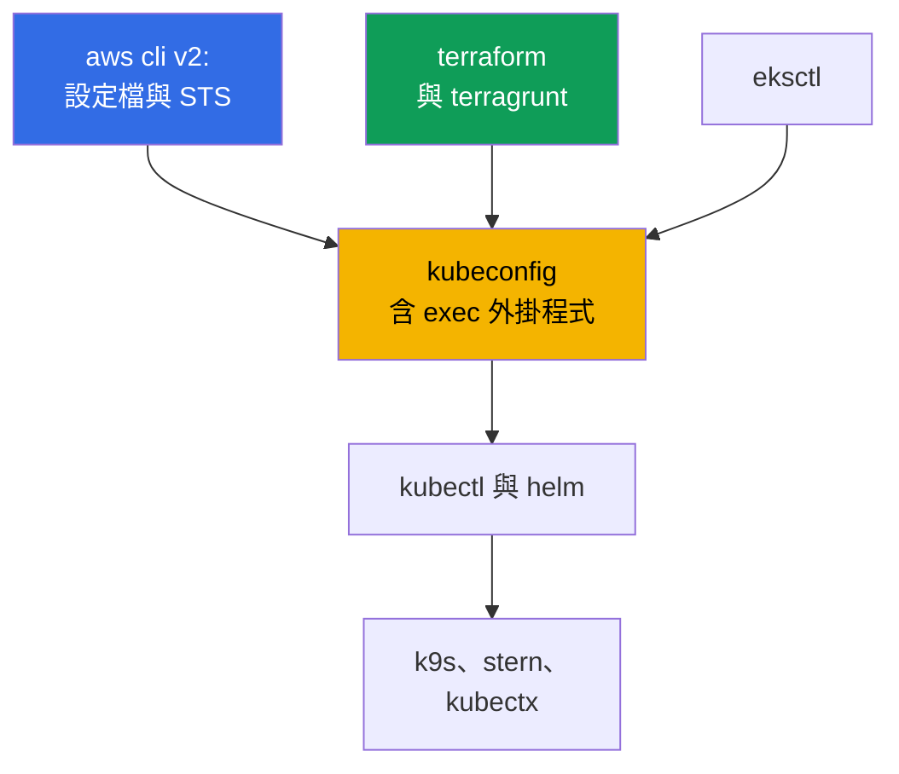
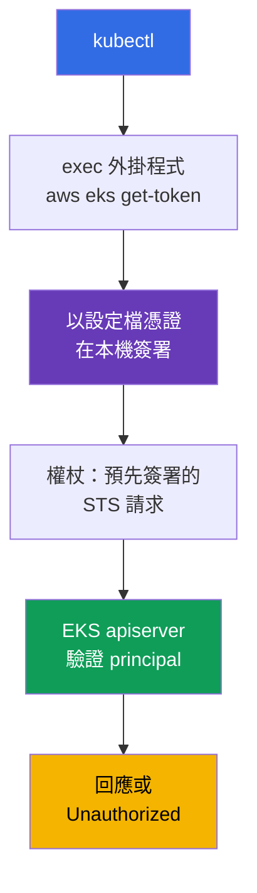
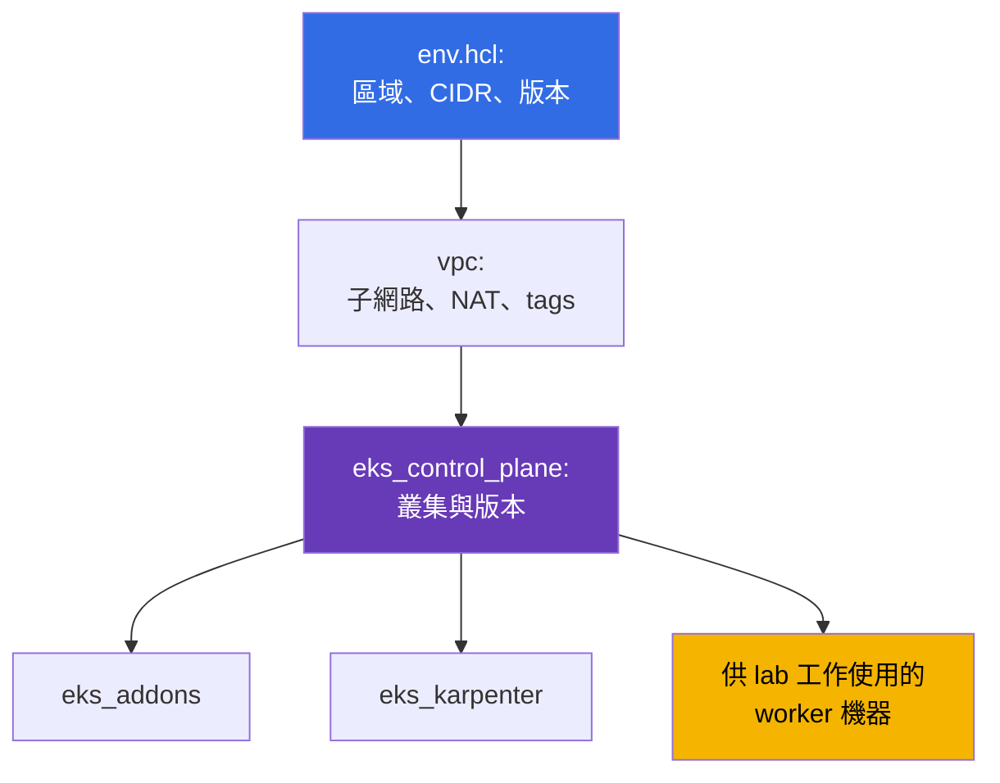

[Русская версия](ru.md) · [Eng version](en.md) · [Versión en español](es.md) · [Version française](fr.md) · [Deutsche Version](de.md) · [ქართული ვერსია](ge.md) · [日本語版](jp.md)
# 第 0.5 章。工具：aws cli、eksctl、terraform 與 terragrunt、helm、實用外掛程式

> **接下來是什麼。** 您已經完成帳戶與帳單（第 0.1 章）、IAM（0.2）、VPC（0.3）及 EC2（0.4）。
> 現在只剩下建立工作環境：您熟悉 kubectl 與 helm，但 EKS 另外增加了一層
> AWS：aws cli 設定檔、用於權杖的 exec 外掛程式、以 terraform 和 terragrunt 管理的 IaC、受管
> addons。本章談的是工具與習慣，而非新的 Kubernetes 抽象概念。接著進入第 1 部分：EKS 承擔什麼、哪些仍由您負責（第 1 章），以及第一個叢集。

## 0.5.1. EKS 工具層：kubectl 新增了什麼

在 kubeadm 叢集中，工具集很精簡：kubectl、helm、連線到節點的 ssh。EKS 增加了第二個
範圍：AWS API 建立叢集、IAM 授予存取權、launch template 產生節點，而
系統元件則以受管 addon 或 chart 安裝。



關鍵概念：**EKS 中的 kubectl 並非自足**。如果旁邊沒有使用正確設定檔、正常運作的 aws cli，
它就無法驗證身分。幾乎所有「奇怪的」存取錯誤皆由此而來。

## 0.5.2. aws cli v2：設定檔、區域，以及任何問題的第一個命令

可用單一套件安裝（AWS 網站的封存檔、`brew install awscli`、發行版套件）。重要的是
一點：**使用 v2，不是 v1** - v2 提供 `aws configure sso` 與最新的 `eks get-token`。設定儲存於
`~/.aws/config`（設定檔、區域、SSO）及 `~/.aws/credentials`（若仍有金鑰）。設定檔是
具名存取參數組，您始終會有數個：每個帳戶與角色各一個；`prod` 有其專屬的 `role_arn` 與 `source_profile`。

設定檔以 `--profile` 旗標或 `AWS_PROFILE` 變數選擇，區域則用 `--region` 或 `AWS_REGION`。
變數更方便：terraform、eksctl 和 helm providers 都會讀取它們。
不需要長期金鑰：IAM Identity Center 透過 STS 授予存取權（第 0.2 章），
設定一次後即可透過瀏覽器登入。API 回應很龐大，兩個旗標很有幫助：
帶 JMESPath 表達式的 `--query`，以及供人閱讀的 `--output table`。

比起直接切換變數及儲存工作階段，使用工具更加方便。`aws-vault`
會將憑證放在系統 keychain，並在暫時工作階段中執行命令，避免將
秘密公開於環境：`aws-vault exec prod -- terraform apply`。`granted`（`assume` 命令）
可快速切換 SSO 設定檔，並在獨立瀏覽器分頁開啟正確帳戶的主控台，避免「我目前在哪個帳戶」的混淆。

```bash
export AWS_PROFILE=dev             # 要使用的設定檔
export AWS_REGION=eu-central-1     # 預設區域

# 遇到任何問題的第一個命令：帳戶、identity ARN、userId
aws sts get-caller-identity

aws configure sso --profile prod   # 一次性：start URL、帳戶、角色
aws sso login --profile prod       # 每天早上：取得數小時有效的暫時憑證

aws eks describe-cluster --name demo \
  --query 'cluster.{name:name,status:status,version:version}' --output table

aws ec2 describe-subnets --filters "Name=tag:karpenter.sh/discovery,Values=demo" \
  --query 'Subnets[].[SubnetId,AvailabilityZone,CidrBlock]' --output table
```

## 0.5.3. 用於 EKS 的 kubeconfig：kubectl 如何取得權杖

kubeconfig 以單一命令寫入：它會加入叢集、context 與使用者，不會破壞現有記錄。

```bash
# 最小設定，加上選項：自訂 context 名稱、獨立檔案、固定設定檔
aws eks update-kubeconfig --region eu-central-1 --name demo \
  --alias eks-demo --kubeconfig ~/.kube/eks-demo.yaml --profile prod
```

接下來是 EKS 的特性：kubeconfig 中**沒有權杖，也沒有用戶端憑證**。取而代之的是
`exec` 區段，它執行 `aws eks get-token --cluster-name demo`。該命令以目前憑證簽署
請求，apiserver 經由 IAM 驗證簽章並取得 principal，
之後再映射到 RBAC。



這裡很容易徒增不必要的顧慮，因此澄清運作機制。外掛程式**不會向 STS 取得權杖**：
它以您的憑證在本機簽署發往 `sts:GetCallerIdentity` 的預先簽署請求，該簽署請求
本身就是權杖。實際呼叫 STS 的是 apiserver，會在驗證呈交內容時執行。第二，
外掛程式不會針對每個 HTTP 請求執行 - 它會傳回具有 `status.expirationTimestamp` 欄位的
`ExecCredential` 物件，`client-go` 在程序記憶體中保留取得的憑證直至該時間。因此長時間執行的
`k9s`、`kubectl get -w` 或迴圈腳本不會受 AWS API 呼叫速率限制影響。快取存在於
程序範圍內：每個新的 `kubectl` 都會再次啟動外掛程式，但那是本機簽署，不是網路呼叫。

```bash
# client-go 會重複使用目前權杖到何時
aws eks get-token --cluster-name demo --query 'status.expirationTimestamp'
```

仍有 throttling 的注意事項，但並非關於權杖本身：若設定檔憑證來自 SSO 或
`assume-role`，CLI 會確實連線至 IAM Identity Center 和 STS 取得它們。
這些回應快取於 `~/.aws/sso/cache` 與 `~/.aws/cli/cache`，因此「以防萬一」將其刪除
反而必然造成大量呼叫並收到 `Throttling`。

- **kubeconfig 中沒有秘密**，權杖有效期短，權限由 IAM 加 RBAC 決定。
- **權杖取決於設定檔。** 變更 `AWS_PROFILE` 後，同一 context 會以不同 identity
  進入叢集；在 `update-kubeconfig` 使用 `--profile` 會把它寫入 `args`，消除這項
  模糊性。您將有許多叢集，因此 `kubectl config get-contexts` 與
  `use-context` 會成為習慣（或以 `kubectx` 取代）。
- **`error: You must be logged in to the server (Unauthorized)`** 通常不是 RBAC 問題，而是
  principal 問題：`aws sso login` 已過期、匯出了其他人的 `AWS_PROFILE`，或角色尚未加入
  叢集。檢查順序：先用 `aws sts get-caller-identity`，再檢查 access entries（第 5 章）。

## 0.5.4. eksctl：出色的偵察工具，不適合擁有生產環境

`eksctl` 是 EKS 的官方 CLI。一條命令即可建立含 VPC、node group、角色
與 OIDC provider 的叢集。其內部不是直接呼叫 API，而是產生 CloudFormation。

```bash
eksctl create cluster --name demo --region eu-central-1 --version 1.34 \
  --nodegroup-name ng-default --node-type t3.medium --nodes 2 --managed

# 探查任何方式建立的叢集
eksctl get cluster --region eu-central-1
eksctl get nodegroup --cluster demo --region eu-central-1
```

它非常適合建立一天用的叢集，或查看 node groups 和 addons 的摘要。用於生產環境就會失效：
命令是**命令式的**（狀態未在儲存庫描述），底層使用**自己的 CloudFormation**，
您的 terraform 看不到它，IaC 之外的變更就產生**漂移**。一部分由 eksctl 建立、
一部分由 terraform 建立的叢集，幾乎不可能乾淨地刪除。課程規則：**eksctl 與主控台只讀，terraform 負責寫入**（第 4 章）。

| 方法 | 優點 | 缺點 | 何時使用 |
|--------|-------|--------|-----------------|
| AWS 主控台 | 直觀，無需準備 | 不可重現 | 查看、操作 |
| `eksctl` | 一條命令建立叢集 | 命令式、自有 CFN | 學習、ad hoc、偵察 |
| terraform + terragrunt | git 中的程式碼、review | 啟動較慢，需要 HCL | 所有長期存在的內容 |

## 0.5.5. terraform：為何以程式碼描述叢集

EKS 叢集不是單一資源，而是帶 tags 的 VPC、子網路、IAM 角色、OIDC provider、node
groups、addons、security groups。可手動組建，但無法在三個環境與一年後重現。第一次 `apply` 前必須理解的三件事：

- **State。** 「程式碼中的資源 - AWS 中的資源」對應關係儲存在狀態檔。對團隊而言，它遠端存放且具鎖定，避免兩名工程師同時執行 `apply`。
  儲存庫中 backend 僅在 `terraform/environments/terragrunt.hcl` 指定一次：具 `encrypt = true` 的 S3 bucket、用於鎖定的 DynamoDB table，以及來自 stack 路徑的狀態 key。
- **Providers。** `aws` 建立 AWS 資源，`kubernetes` 與 `helm` 在已啟動的叢集內運作。
  因此有先有雞或先有蛋的問題：`kubernetes` provider 需設定為連到叢集，而該叢集在規劃時可能尚未存在，因此叢集與其內容分在不同 stack。
- **Modules。** 包含輸入與輸出的可重複區塊：一個用於 VPC、一個用於 control plane、一個用於 node group。課程 lab 使用 `terraform/modules` 中的 modules，常用命令是
  `terraform init`、`plan`、`apply`、`destroy`。

## 0.5.6. terragrunt：本課程環境的組成方式

Terragrunt 是 terraform 的輕量包裝。它消除複製貼上：所有 stacks 共用 backend、環境參數集中一處、stacks 間的相依性，以及用單一命令執行一組 stacks。Lab 環境的組成如下：lab 目錄有參數用的 `env.hcl`，並且每個 stack 各有子目錄與自己的 `terragrunt.hcl`。



Lab 02（Karpenter，第 12 章）的 `env.hcl` 實際包含：`region = "eu-central-1"`、
`vpc_default_cidr = "10.10.0.0/16"`、`stack_name`、由 `stack_name` 加上 `TF_VAR_USER_ID` 與 `TF_VAR_ENV_ID` 組成的環境名稱 `env_name`（因此每位學生有自己的資源名稱）、含兩個公有及四個私有子網路（兩個供 EKS、兩個供 RDS）的 `subnets` map，並帶有
`kubernetes.io/role/elb`、`kubernetes.io/role/internal-elb` 及 `karpenter.sh/discovery` tags、每個子網路的 NAT 模式（`DEFAULT`、`SINGLE`、`NONE`）、`k8_version`、`node_type`（`ondemand` 或
`spot`）、instance types 與 spot types 清單、使用 `gp3` 的 `root_volume`、以及用於成本核算的共用 `tags`。除已展示項目外，還有 `ssh-keys` 與 `eks_fargate_system` stacks。相依性由 `dependency` block 描述：`eks_control_plane` 宣告 `dependency "vpc"` 並從其 outputs 取得 `vpc_id` 和子網路清單；terragrunt 依這些 blocks 建構執行圖。

```bash
terragrunt run-all apply     # 按相依關係執行所有 stacks；destroy 以反向順序執行
terragrunt run-all output    # 收集所有 stacks 的 outputs
```

另談 binary。Terragrunt 能同樣搭配 terraform 與 **OpenTofu** 運作，後者是常用於避免受授權限制的開放 fork。本課程的 modules 和 `terragrunt.hcl` 與它相容，不必改動程式碼，只要指定使用何者編排即可：

```hcl
# terragrunt.hcl：實際用何者執行 plan 與 apply
terraform_binary = "tofu"
```

也可使用環境變數設定（`TERRAGRUNT_TFPATH`，新版為 `TG_TF_PATH`），這對 CI 很方便。近期版本的 Terragrunt 發現 `tofu` 時會自動偏好它，因此在同時安裝兩個 binaries 的機器上要明確固定選擇，否則本機與 pipeline 的 plan 可能由不同工具計算。

## 0.5.7. helm：安裝 controllers 的方式，以及何時較適合 managed addon

您已熟悉 Helm，因此這裡只談 EKS。幾乎整個平台層都以 charts 安裝：AWS
Load Balancer Controller（第 26 章）、Karpenter（12）、external-dns 和 cert-manager（29）、
kube-prometheus-stack（33）、External Secrets（18）、Fluent Bit（34）。部分 AWS charts 位於
`oci://public.ecr.aws`，原則相同：明確版本加上 git 中自有的 `values.yaml`。

```bash
helm repo add eks https://aws.github.io/eks-charts && helm repo update

helm upgrade --install aws-load-balancer-controller eks/aws-load-balancer-controller \
  --namespace kube-system --version 1.13.0 \
  --set clusterName=demo --set serviceAccount.create=false \
  --set serviceAccount.name=aws-load-balancer-controller

helm get values aws-load-balancer-controller -n kube-system   # 目前使用哪些 values
```

公開 charts 無須驗證即可拉取，但公司的**自有平台 charts**通常位於私有 ECR，
helm 必須與 docker 分開登入。這是 OCI registry，因此使用與 docker 相同權杖的
`helm registry login`：

```bash
# 將 helm 登入私有 ECR；權杖有效數小時，CI 會在 install 前重複此步驟
aws ecr get-login-password --region eu-central-1 \
  | helm registry login --username AWS --password-stdin \
    123456789012.dkr.ecr.eu-central-1.amazonaws.com

# 接著照常安裝 chart，但使用 oci 連結並固定版本
helm upgrade --install platform-base \
  oci://123456789012.dkr.ecr.eu-central-1.amazonaws.com/charts/platform-base \
  --version 2.4.1 -n platform -f values-prod.yaml
```

使用者名稱永遠是字面上的 `AWS`，密碼是暫時權杖，因此 pipeline 應在安裝前執行這個步驟，而不是儲存秘密。與映像檔相同的 IAM 角色授予 pull 權限，而 cross-account 存取權則由 repository policy 授予（第 20 章）。

兩個習慣：**永遠使用 `--version`**（否則下次 `upgrade` 時叢集會自行變更）以及**將 values 放在檔案中**，而非某段 bash 歷史中的 `--set`。當 charts 很多時，應以宣告方式管理：`helmfile` 在一個 `helmfile.yaml` 中描述 releases 清單及其版本與 `values.yaml` 路徑，而 `helmfile apply` 使叢集符合此描述 - 與 terraform 相同的「git 中的程式碼」原則，只是用於 helm。部分元件（VPC CNI、kube-proxy、CoreDNS、EBS CSI、Pod Identity Agent）由 AWS 提供為 **managed addons**：AWS 計算相容性，並透過叢集 API 更新。自由度較少，工作量也較少。

| 條件 | Managed addon | Helm chart |
|----------|---------------|-----------|
| 與叢集版本的相容性 | 由 AWS 檢查 | 由您檢查 |
| 更新 | EKS API，可在 IaC 和主控台看到 | 您的 pipeline 中的 `helm upgrade` |
| values 彈性 | 有限 | 完整 |
| 誰處理 incident | AWS support 有脈絡 | 您 |

預設實務：基礎元件使用 managed addons，所有應用層與快速演進元件（Karpenter、LB Controller、observability）使用 helm。界線見第 37 章。

## 0.5.8. 實用外掛程式與工具

| 工具 | 一句話用途 |
|------------|----------------------|
| `kubectx` / `kubens` | 不修改 kubeconfig 即可切換 context 與 namespace |
| `k9s` | 終端 UI：pods、logs、events、兩次按鍵即可 exec |
| `stern` | 依 prefix 或 selector 取得所有 pods 的 logs |
| `krew` | kubectl 外掛程式管理器，其餘工具皆可經由它安裝 |
| `kubectl-neat` | 從 `get -o yaml` 移除服務性雜訊 |
| `eks-node-viewer` | 顯示 EKS nodes、使用率與成本的地圖，使用 Karpenter 時很需要 |
| `kubectl-k8i` | 顯示 nodes 的表格，含使用率、instance type、spot 或 on-demand、zone 與 NodePool |
| `jq` | 在 `--query` 不再方便時過濾 aws cli 的 JSON |
| `yq` | 同樣用於 YAML：chart values、manifests、kubeconfig |

```bash
kubectx eks-demo && kubens kube-system   # context 與 namespace
stern -n kube-system karpenter           # 所有 Karpenter pods 的 logs
aws eks describe-nodegroup --cluster-name demo --nodegroup-name ng-default | jq '.nodegroup'
```

外掛程式值得另外說明，因為日常便利性有一半都存在於此處。機制很簡單：**PATH 中任何名為 `kubectl-<名稱>` 的可執行檔，都會成為 `kubectl <名稱>` 子命令**。不必手動安裝，為此有 **krew** - 外掛程式管理器，提供索引、搜尋與更新：

```bash
kubectl krew update                  # 更新外掛程式索引
kubectl krew search                  # 整個目錄；或依詞搜尋：krew search node
kubectl krew info k8i                # 內容、版本、首頁
kubectl krew install k8i             # 安裝
kubectl krew list                    # 已安裝項目
kubectl krew upgrade                 # 更新所有已安裝項目
kubectl krew uninstall k8i           # 移除

kubectl plugin list                  # 從 kubectl 的角度查看它在 PATH 中找到什麼
```

外掛程式不只在主索引中：自有或公司的索引可作為額外索引加入，之後外掛程式可用前綴安裝（`kubectl krew index add
<名稱> <git-url>`，接著 `kubectl krew install <名稱>/<外掛程式>`）。但請記住，外掛程式是以您權限和 kubeconfig 執行的第三方可執行檔：生產環境的外掛程式清單應如同其他任何 dependency 一樣完成核准（第 20 章）。

一個特別適合 EKS 的外掛程式範例是 **`kubectl-k8i`**。內建的 `kubectl get nodes`
將 node 顯示成抽象機器，而 EKS 通常有其他問題：這是 spot 還是
on-demand、instance type 是什麼、位於哪個 zone、屬於哪個 NodePool、由誰建立（Karpenter、Cluster Autoscaler 或 Spot.io），以及它相對於 requests 和 limits 的實際使用率。`k8i` 將這些資料彙整在一個有使用率百分比的表格中，並可以任何這些特徵篩選及排序、按 taint 分組 nodes，且以 `analyze` 子命令顯示哪些 workloads 位於所選 nodes，以及其 limits 與 requests 的差異程度。

```bash
# 外掛程式：github.com/ViktorUJ/kubectl-k8i（已在 krew 中，或從 releases 取得 binary）
kubectl krew install k8i

kubectl k8i                                    # 所有 nodes：使用率、類型、zone、pool
kubectl k8i --filter ec2_type=spot             # 僅 spot nodes（第 13 章）
kubectl k8i --autoscaler karpenter --sort cpu_load=desc   # 依使用率排列 Karpenter nodes
kubectl k8i --group-by taint                   # 有哪些邏輯 node 群組
kubectl k8i analyze --autoscaler karpenter --cpu-overcommit 100   # 誰只申請實際的五分之一
```

usage 值來自 metrics-server：缺少它時使用率欄位為零，但 requests 和 limits 仍可見。這在第 12 與 13 章（NodePool、spot）很有用，尤其第 14 章正好討論 requests、limits 與實際消耗之間的差距。

## 0.5.9. 工作環境衛生

- **固定版本。** kubectl 與叢集相差不超過一個 minor version，terraform 和 terragrunt 在儲存庫中釘選，charts 版本在程式碼中指定：否則 `apply` 會得到不同結果。
- **依帳戶隔離設定檔。** 設定檔名稱與環境相符（`dev`、`stage`、`prod`），`prod` 有其自己的 `role_arn` 和 MFA。絕不使用指向生產環境的 `default` 設定檔。
  完全不使用長期金鑰：`aws configure sso` 加 `aws sso login`，有效期以小時計（第 0.2 章）。`~/.aws/credentials` 中的 `AKIA...` 金鑰是一個等待發生的 incident。
- **執行破壞性命令前檢查區域與帳戶。** `run-all destroy` 前花五秒執行 `aws sts get-caller-identity` 及
  `kubectl config current-context`，而 shell prompt 中的帳戶醒目提示可避免整類「在錯誤位置刪除」的錯誤。
- **開啟 CLI 提示。** aws cli v2 有內建 auto-prompt：`on-partial` 模式提示子命令及參數，但只會在命令不完整或未通過驗證時介入。值班時，它能節省撰寫冗長 `--query` 和 `--filters` 的時間。

```bash
aws configure set cli_auto_prompt on-partial   # 模式：on、on-partial、off
```

## 0.5.10. 在生產環境如何應用

- **僅由 IaC 建立叢集。** 使用 terraform 或 terragrunt 的儲存庫、PR review、以獨立角色從 CI 套用。手動在主控台只進行讀取。
- **統一工具映像檔。** 具固定版本 aws cli、kubectl、helm、terraform、terragrunt 的 container 或 devcontainer：工程師與 CI 使用同一套工具。
- **經由 SSO 和 roles 存取。** 暫時授予 role，kubeconfig 經 exec 外掛程式取得權杖，在 Identity Center 中撤銷存取權，不必修改叢集。
- **將 eksctl 保留作診斷工具**，用於 `get nodegroup` 與 `get addon`，但不以它變更生產環境。能交由 AWS 作為 managed addon 的就交給它，其餘則以明確版本透過 GitOps 安裝 charts（第 44 章）。

## 0.5.11. 迷你詞彙表

- **aws cli v2** - AWS 的主要 CLI；設定在 `~/.aws/config`，使用 `--profile` 或 `AWS_PROFILE` 選取存取權。**設定檔** - 具名參數組：區域、role、SSO。**`aws sts get-caller-identity`** - 「我是誰」命令：帳戶、ARN、userId。
  **`aws-vault`** - 在 keychain 儲存憑證並在暫時工作階段執行命令；
  **`granted`**（`assume`）- 快速切換 SSO 設定檔並登入主控台。
- **kubeconfig exec 外掛程式** - 呼叫 `aws eks get-token` 的 `exec` 區段；檔案中沒有長期權杖，取得的憑證由 `client-go` 快取到
  `status.expirationTimestamp`。**eksctl** - EKS 官方 CLI，經由
  CloudFormation 運作且為命令式。
- **kubectl 外掛程式** - PATH 中的 `kubectl-<名稱>` 檔案，可作為 `kubectl <名稱>` 使用。
  **krew** - 外掛程式管理器：索引、`search`、`install`、`upgrade`；支援自有索引。**`kubectl plugin list`** - kubectl 在 PATH 中看到的內容。
- **State** - terraform 狀態檔，團隊使用時以鎖定方式遠端儲存。
  **Provider** - terraform 外掛程式（`aws`、`kubernetes`、`helm`）。
- **terragrunt** - terraform 的包裝：共用 backend、`env.hcl`、`dependency`、`run-all`、無複製貼上的 DRY modules。**OpenTofu** - terraform 的開放 fork，與課程 modules 相容；以 `terraform_binary = "tofu"` 屬性選取。**Stack** - 含一個 `terragrunt.hcl`、作為單位套用的目錄。**helmfile** - 在一個檔案中以版本和 values 宣告 helm releases 集合。**Managed addon** - 由 EKS 管理版本與更新的叢集元件。

## 0.5.12. 本章總結

- aws cli v2 加上設定檔與 `AWS_REGION` 是一切的基礎；`aws sts get-caller-identity` 是面對不明錯誤的第一個命令，`--query` 與 `--output table` 則讓 API 回應易讀。
- `aws eks update-kubeconfig` 建立無秘密的 context：`aws eks get-token` 取得權杖，因此 `Unauthorized` 通常表示使用了錯誤設定檔或 SSO 已過期（第 5 章）。
- eksctl 適用於快速建立叢集及偵察，但它帶來自己的 CloudFormation 與漂移；生產環境以 terraform 和 terragrunt 描述（第 4 章），而 terragrunt 加入 `env.hcl`、stack 拆分及其相依性：課程 labs 即以此方式組成。
- Helm 以明確版本及 git 中 values 安裝 controllers，基礎元件通常採用 managed addons（第 37 章）。外掛程式與環境衛生（固定版本、隔離設定檔、拒絕長期金鑰、在 `destroy` 前檢查帳戶）可節省時間與金錢。

## 0.5.13. 在實際工作中如何派上用場

工具層決定您在 incident 中的反應速度。當 nodes 無法加入叢集（第 45 章）時，您可在一分鐘內切換設定檔、用 `eksctl get
nodegroup` 查看 node group、以 `stern` 讀取 logs、並以 `describe-subnets` 核對子網路 tags。
若要在另一個帳戶中重建環境，您只需變更 `env.hcl` 並執行 `run-all`。

## 0.5.14. 自我檢查問題

1. `~/.aws/config` 與 `~/.aws/credentials` 有何不同，`AWS_PROFILE` 做什麼？
2. 為何存取問題時首先執行 `aws sts get-caller-identity`？
3. EKS 的 kubeconfig 中用什麼取代權杖，kubectl 如何取得存取權？
4. `kubectl` 傳回 `Unauthorized`。在 RBAC 之前要檢查哪三個原因？
5. eksctl 適合做什麼，為何不用它建立生產叢集？
6. terragrunt 在 terraform 之上提供什麼，`vpc` 與 `eks_control_plane` stacks 如何關聯？
7. 何時元件應安裝為 managed addon，何時應使用 helm chart？
8. kubectl 如何找到外掛程式，krew 如何協助？用哪些命令搜尋及更新？
9. 為何 EKS 中的 `kubectl get nodes` 無法回答所有關於 node 的問題，`k8i` 補充什麼？

## 實作

第 0 部分沒有自己的 labs，但這裡適合理解如何執行課程 labs。環境由儲存庫根目錄的 Makefile targets 部署：target 會將 lab 目錄複製至工作目錄，並依 CPU cores 數量設定 parallelism 後在其中執行 `terragrunt run-all`。Lab 編號透過 `TASK` 變數傳入，環境識別碼為 `USER_ID` 與 `ENV_ID`（它們會進入 `env_name`，因此不同學生的資源不會衝突）。

```bash
TASK=02 make run_eks_task          # 部署 lab 02 環境（Karpenter，第 12 章）
make output_eks_task               # stack outputs：叢集參數、worker 機器位址
TASK=02 make delete_eks_task       # 移除環境，避免支付 NAT、叢集與 nodes 費用
TASK=02 make run_eks_task_clean    # 清理工作目錄並重新部署
```

部署後，您登入環境的 worker 機器、取得 kubeconfig，並使用熟悉的 kubectl 工作。任務由 worker 機器上的 `check_result` 命令檢查：它會執行叢集狀態自動檢查，並告知任務是否通過。首先應執行 `aws sts get-caller-identity` 和 `kubectl config current-context`。接下來是第 1 部分：EKS 實際承擔什麼，以及為何受管 control plane 不代表受管叢集。

---
[目錄](../README_TW.md) · [第 0.4 章](../00-4-ec2/tw.md) · [第 1 章](../01/tw.md)
