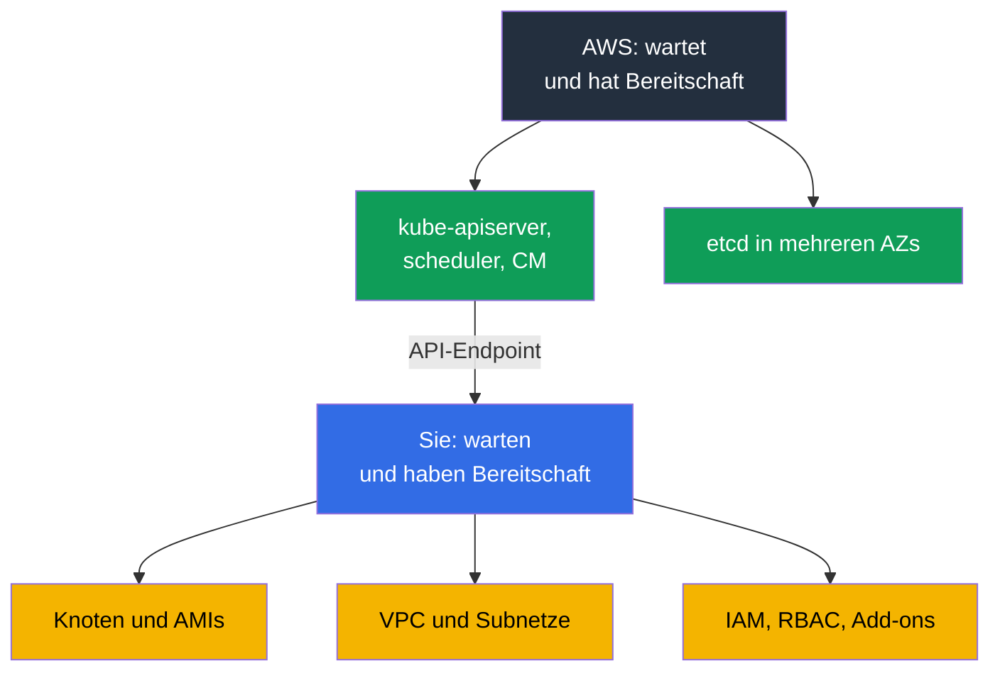
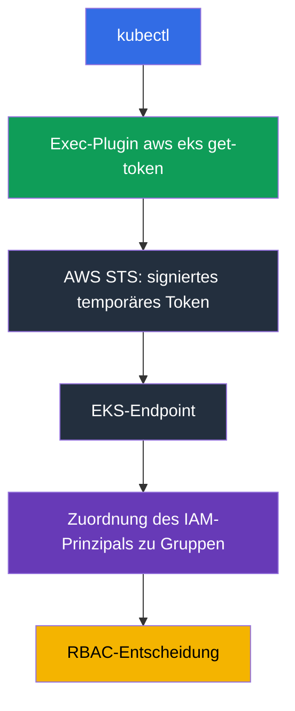
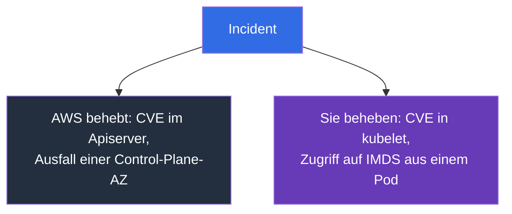

[Русская версия](ru.md) · [Eng version](en.md) · [Versión en español](es.md) · [Version française](fr.md) · [ქართული ვერსია](ge.md) · [繁體中文版](tw.md) · [日本語版](jp.md)
# Kapitel 1. Einführung: Was EKS übernimmt und was bei Ihnen bleibt

> **Wie es weitergeht.** Teil 0 hat das AWS-Vokabular vermittelt: Konten, IAM, VPC, EC2 und Werkzeuge. Jetzt kommt der Kernpunkt: Wo verläuft die Grenze zwischen „Das erledigt AWS“ und „Das erledigen Sie“? Nach kubeadm liegt der Gedanke nahe, EKS sei derselbe Cluster, nur dass jemand anderes `kube-apiserver` neu startet. Der Unterschied geht tiefer: Ein Teil der Arbeit entfällt, einige vertraute Werkzeuge entfallen, und neue Fehlerursachen kommen hinzu. Kapitel 2 behandelt die Control Plane konkret, Kapitel 3 Versionen und Upgrades.

## 1.1. Was in einem kubeadm-Cluster schmerzt

Erinnern Sie sich an einen gewöhnlichen Monat beim Betrieb eines mit kubeadm aufgebauten Clusters. Keinen Notfallmonat, sondern einen ruhigen. Was geschieht darin außer der Arbeit mit Workloads?

- Zertifikate laufen ab: Ein Jahr vergeht und `kubelet` kann nicht mehr mit dem API-Server sprechen. Jemand muss vorher und nicht erst danach `kubeadm certs check-expiration` ausführen.
- etcd muss gesichert und die Wiederherstellung getestet werden. Ein Snapshot, den niemand wiederhergestellt hat, ist kein Backup. Der Verlust des Quorums bedeutet einen nicht funktionsfähigen Cluster und eine Nacht Arbeit.
- Ein Upgrade einer Minor-Version ist auf jedem Control-Plane-Knoten eine manuelle Abfolge mit Wartungsfenster und einem Rückfallplan, der sich in der Praxis auf „Wir stellen etcd wieder her“ beschränkt.
- Betriebssystem-Patches und CVEs in Control-Plane-Komponenten liegen ebenfalls bei Ihnen: zusammenstellen, ausrollen, prüfen. All das muss über Fehlerdomänen verteilt werden, und Sie müssen darauf achten, dass es verteilt bleibt.

Das bringt dem Unternehmen keinen Nutzen: Es ist die Abgabe für das Recht, Kubernetes zu betreiben.

**Amazon EKS** ist eine verwaltete Kubernetes-Control-Plane: AWS betreibt und wartet API-Server, Scheduler, Controller Manager und etcd, während Sie einen Endpoint erhalten, mit dem sich Ihr `kubectl` und Ihre Knoten verbinden. Es ist dasselbe Upstream-Kubernetes mit denselben APIs und Manifesten. Nicht Kubernetes ändert sich, sondern wer für sein Herz Bereitschaft hat.



## 1.2. Was AWS übernimmt und worauf Sie dafür verzichten

Das Erste, wonach ein Engineer nach CKA in einem neuen Cluster sucht, ist die Control Plane. `kubectl get pods -n kube-system` zeigt weder `kube-apiserver` noch `etcd`, und `kubectl get nodes` zeigt keine Master-Knoten. Der Cluster ist nicht kaputt: Die Control Plane lebt im AWS-Konto, gehört Ihnen nicht und befindet sich nicht in Ihrer VPC.

Was AWS für Sie erledigt: Es betreibt API-Server, Scheduler und Controller Manager in mehreren Availability Zones, skaliert und ersetzt ausgefallene Instanzen; es hält, sichert und stellt etcd wieder her; es patcht die Control-Plane-Komponenten, und der Patch-Stand wird durch die **Platform Version** bezeichnet, die ohne Ihr Zutun steigt; es bietet monatlich ein SLA von 99,95 % für die Verfügbarkeit des API-Servers, was eine Service-Level-Spezifikation und kein Preis ist; und es liefert Control-Plane-Logs an CloudWatch, wenn Sie diese aktiviert haben (Kapitel 2). Im Gegenzug verlieren Sie genau die Werkzeuge, an die Sie gewöhnt sind:

| Gewohnheit aus kubeadm | So funktioniert es in EKS |
|------------------------|---------------------------|
| `etcdctl snapshot save` | Es gibt keinen Zugriff auf etcd, weder über das Netzwerk noch per exec; der Clusterzustand wird anders gesichert (Kapitel 41) |
| Bearbeiten von `/etc/kubernetes/manifests/kube-apiserver.yaml` | Static Pods der Control Plane sind nicht verfügbar und Apiserver-Flags können nicht bearbeitet werden |
| eigenes `--enable-admission-plugins` | Der Plugin-Satz ist durch AWS festgelegt; Ihr Erweiterungspunkt sind Webhooks und Richtlinien (Kapitel 22) |
| `--feature-gates` am Apiserver | Nicht verfügbar; Feature Gates kommen mit der Version |
| `kubeadm upgrade apply` | Ein Control-Plane-Upgrade ist ein Aufruf der AWS-API, jeweils eine Minor-Version (Kapitel 38) |
| Rotation der Clusterzertifikate | AWS wartet die Zertifikate der Control Plane; Ihr Zugriff basiert auf IAM (Kapitel 5) |
| `ssh` auf einen Master und Logs auf der Festplatte | Control-Plane-Logs sind, sofern aktiviert, nur über CloudWatch verfügbar (Kapitel 2) |
| eigener `kube-scheduler` mit Profilen | Ein zweiter Scheduler ist nur als Ihr Pod auf Ihren Knoten möglich |

```bash
# Liste der Cluster in der Region
aws eks list-clusters --region eu-central-1

# Kubernetes-Version, Patch-Stand der Control Plane, Endpoint
aws eks describe-cluster --name demo \
  --query 'cluster.{version:version,platform:platformVersion,endpoint:endpoint}'

# Dieselbe Version aus Sicht von Kubernetes
kubectl get --raw /version
```

## 1.3. Was bei Ihnen bleibt

Alles zwischen einer Benutzeranfrage und einem laufenden Pod liegt weiterhin bei Ihnen: Maschinen, Adressen, Berechtigungen und die Rechnung dafür.

| Bereich | kubeadm | EKS | Wo im Kurs |
|---------|---------|-----|------------|
| API-Server, Scheduler, Controller Manager, etcd | Sie | AWS | Kapitel 2 |
| Control-Plane-Patches, Platform Version | Sie | AWS | Kapitel 2, 3 |
| Auswahl der Minor-Version und Dauer ihrer Unterstützung | Sie | Sie, innerhalb der unterstützten Versionen | Kapitel 3 |
| Knoten: AMI, Bootstrap, OS-Patches, Upgrades, Skalierung | Sie | Sie | Kapitel 10, 11, 12, 38 |
| CNI, Adressplan, IPs für Pods | Sie | Sie | Kapitel 6, 7, 8 |
| Authentifizierung, RBAC, Mandantenfähigkeit | Sie, Zertifikate | Sie, IAM und Access Entries | Kapitel 5, 22 |
| Add-ons: CoreDNS, kube-proxy, CSI, Versionen | Sie | Sie, verwaltete Add-ons helfen | Kapitel 37 |
| Load Balancer, Ingress, DNS, TLS | Sie | Sie | Kapitel 26-29 |
| Speicher: StorageClass, Volumes, Snapshots | Sie | Sie | Kapitel 23, 24, 25 |
| Secrets und ihre Verschlüsselung | Sie | Sie, KMS hilft | Kapitel 18 |
| Observability und Kosten | Sie | Sie | Kapitel 33-36, 43 |
| Backups des Kubernetes-Zustands und der Volumes | Sie | Sie, AWS Backup hilft | Kapitel 41, 42 |

Das Bild ist ehrlich: EKS nimmt den beängstigendsten Teil der Arbeit ab, aber nicht den größten. Das Übrige ist zudem komplexer geworden: Es geht jetzt nicht nur um Kubernetes, sondern auch um AWS darunter.

## 1.4. Wie sich die Gewohnheiten von Engineers ändern

Jede Gewohnheit in dieser Liste kostet eine verlorene Stunde, wenn man sie erst im Incident kennenlernt.

**Zugriff wird über IAM und nicht über ein Zertifikat gewährt.** Bei kubeadm haben Sie ein Client-Zertifikat mit Ihrer CA signiert und kubeconfig verteilt. In EKS enthält kubeconfig keine langlebigen Credentials: Es ruft das Exec-Plugin `aws eks get-token` auf, dieses bezieht bei STS ein temporäres Token, und der Cluster ordnet den IAM-Prinzipal über einen **Access Entry** oder die veraltete `aws-auth` ConfigMap RBAC-Gruppen zu. Daraus entsteht ein typisches Symptom: kubeconfig ist richtig, aber die Antwort lautet `error: You must be logged in to the server`, weil die Rolle im Cluster nicht registriert ist (Kapitel 5).



**Knoten sind austauschbar.** Eine manuell reparierte Instanz wird beim Upgrade einer Node Group oder bei der Konsolidierung durch Karpenter ersetzt, und die Änderung verschwindet mit ihr. Eine Änderung an einem Knoten gehört ausschließlich in das Launch Template, die User Data oder die AMI (Kapitel 10 und 12). Gleichzeitig ist `ssh` nicht mehr das wichtigste Werkzeug: In Produktion haben Knoten oft weder öffentliche Adresse noch Schlüssel, der Zugriff erfolgt über SSM Session Manager, und die Fehlersuche stützt sich auf Logs, die den Knoten selbstständig verlassen.

**Die Fehlersuche verlagert sich in die AWS-API.** Das Symptom ist in `kubectl` sichtbar, die Ursache liegt in AWS: Der Knoten hat die falsche IAM-Rolle, die Adressen im Subnetz sind erschöpft, das vCPU-Kontingent ist ausgeschöpft, das EBS-Volume liegt in einer anderen AZ oder dem Subnetz fehlt das erforderliche Tag. Das ist genau das Zwei-Schichten-Diagramm aus Kapitel 0.1. Ein Teil des Clusterzustands ist in `kubectl` überhaupt nicht sichtbar: Endpoint-Konfiguration, Control-Plane-Logs, Versionen verwalteter Add-ons, Secret-Verschlüsselung und der Zustand der Node Group sind AWS-Objekte; sie werden mit `aws eks` gelesen und als Code beschrieben (Kapitel 4).

## 1.5. Geteilte Verantwortung konkret

Die Formulierung „AWS ist für die Sicherheit der Cloud verantwortlich, Sie für die Sicherheit in der Cloud“ klingt wie Marketing, bis man sie auf einen konkreten Incident anwendet. Dann wird innerhalb einer Minute klar, wer ihn beheben muss. Die folgende Matrix teilt das Modell in drei Bereiche: reine AWS-Verantwortung, reine Ihre Verantwortung und den gemeinsamen Bereich, in dem AWS den Mechanismus bereitstellt, Sie ihn aber konfigurieren.

| AWS-Bereich (Sicherheit der Cloud) | Gemeinsamer Bereich | Ihr Bereich (Sicherheit in der Cloud) |
|------------------------------------|---------------------|---------------------------------------|
| Control Plane, etcd, Hypervisor, physische Infrastruktur | IAM und RBAC, Access Entries | Knoten, OS, AMI, kubelet, containerd |
| Control-Plane-Patches, Platform Version | Endpoint-Zugriffsmodus | Anwendungen, Requests/Limits, NetworkPolicy |
| Multi-AZ-Betrieb der Control Plane | Secret-Verschlüsselung über KMS | Daten in Volumes und deren Backup |

Der gemeinsame Bereich ist die Ursache der meisten Incidents: Das Werkzeug existiert, aber die Konfiguration liegt bei Ihnen. Ein anschauliches Beispiel ist die Verschlüsselung der Kubernetes-API-Daten. AWS verschlüsselt die etcd-Festplatten, und ab Version 1.28 funktioniert Envelope Encryption über KMS Provider v2 standardmäßig mit einem AWS-Schlüssel, ohne Ihr Zutun. Ein eigener Customer Managed Key ändert nicht die Tatsache der Verschlüsselung, sondern die Zuständigkeit: Schlüsselrichtlinie, Prüfung von Entschlüsselungen in CloudTrail und die Folgen des Entzugs des Schlüsselzugriffs liegen bei Ihnen, während AWS den Provider in `kube-apiserver` integriert und Sie diese Integration nicht konfigurieren können (Kapitel 18).



| Situation | Zuständigkeit | Was in der Praxis geschieht |
|-----------|---------------|-----------------------------|
| CVE in `kube-apiserver` | AWS | Eine neue Platform Version erscheint; die Control Plane wird ohne Ihr Zutun gepatcht |
| CVE in `kubelet`, containerd oder dem Kernel des Knotens | Sie | Auf eine neue AMI warten und Ersatzknoten ausrollen; alte Knoten sind verwundbar, solange sie laufen (Kapitel 10, 38) |
| Verlust von Credentials über IMDS aus einem Pod | Sie | IMDSv2 und Hop Limit, Wechsel von der Knotenrolle zu IRSA oder Pod Identity (Kapitel 16, 17, 19) |
| Ausfall einer AZ mit einer Control-Plane-Instanz | AWS | Der API-Server bleibt verfügbar; Ihre Aufgabe ist, dass die Knoten nicht in nur einer Zone liegen (Kapitel 40) |
| Öffentlicher Endpoint für das gesamte Internet geöffnet | Sie | Das ist Ihre Konfiguration: Zugriffsmodus und `publicAccessCidrs` (Kapitel 2) |
| Pod mit `hostPath` auf `/` und Root-Berechtigungen | Sie | Pod Security Admission und Richtlinien (Kapitel 19, 22) |

Die Schlussfolgerung: Eine verwaltete Control Plane reduziert nicht den Umfang der Sicherheitsarbeit, sondern nimmt nur einen Teil davon ab. Alles auf den Knoten und in Ihrem Konto bleibt Ihre Aufgabe.

## 1.6. Was EKS nicht erledigt, obwohl es oft erwartet wird

Ein Team wechselt zu einem verwalteten Service und meint, „AWS wird schon aufpassen“. Das wird AWS, aber nur bei der Control Plane. Folgendes wird nicht geschehen:

- **Es aktualisiert keine Knoten.** Eine Managed Node Group kann ein Upgrade ausrollen, aber Sie geben den Befehl. Ein Knoten mit einer drei Monate alten AMI läuft weiter und meldet sich nicht selbst (Kapitel 38).
- **Es aktualisiert keine Add-ons.** Selbst ein verwaltetes Add-on wird auf Ihre Entscheidung aktualisiert, und seine Version ist nicht mit jeder Clusterversion kompatibel (Kapitel 37).
- **Es plant keinen Adressraum.** Ein `/24` pro Subnetz sieht bis zur ersten Skalierung vernünftig aus: VPC CNI weist Pods Adressen aus dem Subnetz zu (Kapitel 6 und 7).
- **Es stimmt keine Workloads ab** und **schreibt keine NetworkPolicy.** Requests und Limits, HPA, PDB, Topology Spread und Pod-Isolation liegen bei Ihnen (Kapitel 14, 30, 35, 40).
- **Es sichert den Kubernetes-Zustand nicht selbst.** Weder Objekte noch Volumes: Das Backup wird konfiguriert und die Wiederherstellung separat geprüft (Kapitel 41 und 42).
- **Es berechnet keine Kosten** und **wählt keine Zugriffsarchitektur.** Die Zuordnung nach Teams wird auf Tags aufgebaut, und Sie wählen IRSA oder Pod Identity (Kapitel 5, 16, 17, 43).

Ein gesonderter Hinweis zu **Auto Mode**: Das ist ein Modus, in dem AWS auch Knoten, grundlegende Add-ons und deren Updates übernimmt. Die Skalierung darin arbeitet mit Karpenter: Instanzen werden passend zu den Requests nicht eingeplanter Pods ausgewählt, doch den Controller administriert AWS und nicht Sie. Daher unterscheidet sich das Betriebsmodell der Compute-Schicht (Kapitel 11 und 12). Es verschiebt die Grenze, beseitigt sie jedoch nicht und bringt eigene Kompromisse mit sich; behandelt wird dies in Kapitel 9. Bis dahin wird von einem Cluster ausgegangen, dessen Knoten Ihnen gehören.

## 1.7. Der Preis der Verwaltbarkeit

Sie zahlen mit zwei Währungen. Geld: Für die Control Plane fällt eine **stündliche Gebühr** an, unabhängig davon, ob Sie drei oder dreihundert Knoten haben. Für einen großen Cluster ist sie gegenüber EC2 kaum relevant, für ein Dutzend kleiner Entwicklungscluster hingegen ein merklicher Posten. Daraus folgt die typische Entscheidung: ein Cluster mit Isolierung nach Namespace statt eines Clusters pro Team (Kapitel 22 und 43). Wechselt eine Minor-Version in den Extended Support, steigt die stündliche Gebühr für diesen Cluster. Das ist ein struktureller Anreiz, rechtzeitig zu aktualisieren, statt veraltete Cluster anzuhäufen (Kapitel 38).

Die stündliche Gebühr ist jedoch nicht der einzige Posten, den Verwaltbarkeit mit sich bringt. Control-Plane-Logs sind standardmäßig deaktiviert; alle fünf Kategorien gleichzeitig in einem aktiven Cluster zu aktivieren, erzeugt einen Datenstrom, in dem `audit` und `api` deutlich umfangreicher sind als die übrigen. Sie zahlen sowohl für die Aufnahme als auch für die Speicherung in CloudWatch Logs, und eine Log Group ohne festgelegte Aufbewahrungszeit sammelt Daten unbegrenzt an. In einem sehr gesprächigen Cluster kann dieser Posten die Gebühr für die Control Plane selbst übersteigen. Deshalb wird die Aufbewahrung im selben Schritt festgelegt, in dem Logs aktiviert werden (Kapitel 2); Umfang, Filter und Archivierung werden in Kapitel 34 und 43 behandelt.

Freiheit: Die Control Plane ist geschlossen, und mit ihr sind auch ihre Einstellungen geschlossen.

| Einschränkung | Was das in der Praxis bedeutet |
|---------------|--------------------------------|
| Keine benutzerdefinierten Apiserver-Flags | Sie können kein Flag hinzufügen und keine Timeouts ändern; verfügbar ist nur, was die EKS-API bereitstellt |
| Fester Satz von Admission-Plugins | Eine eigene Regel wird als Validating oder Mutating Webhook implementiert (Kapitel 22) |
| Kein Zugriff auf etcd | Weder `etcdctl` noch eigene Einstellungen; Backups nur über unterstützte Mechanismen (Kapitel 41) |
| Nur unterstützte Minor-Versionen | Eine neue Version erscheint in EKS nicht am Tag des Upstream-Releases, und eine alte wird nach Zeitplan abgekündigt (Kapitel 3) |
| Eine Minor-Version pro Upgrade | Das Überspringen einer Version ist nicht möglich; der Plan wird schrittweise erstellt (Kapitel 38) |
| Extended Support | Höhere stündliche Gebühr für eine veraltete Version: ein Aufschub, keine Lösung (Kapitel 3, 38) |

Die Kompatibilität wird vor einem Upgrade geprüft, und nicht nur für den Cluster: Add-ons haben eigene Matrizen.

```bash
# Was derzeit im Cluster installiert ist
aws eks describe-cluster --name demo --query 'cluster.[version,platformVersion,status]'

# Welche Add-on-Versionen für eine bestimmte Clusterversion verfügbar sind
aws eks describe-addon-versions --addon-name vpc-cni --kubernetes-version 1.33 \
  --query 'addons[].addonVersions[].addonVersion'
```

## 1.8. Wann EKS nicht benötigt wird

Der Kurs handelt von EKS, aber die ehrliche Antwort auf die Frage „Brauche ich es?“ lautet manchmal nein.

- **On-Premises oder eine andere Cloud.** EKS Anywhere und EKS Hybrid Nodes gibt es, aber sie sind eigenständige Produkte mit einem eigenen Betriebsmodell und nicht „dasselbe EKS auf Ihrer Infrastruktur“. Dazu kommen **regulatorische Anforderungen an den Speicherort von Daten**, die verfügbare Regionen nicht erfüllen.
- **Lokale Entwicklung und CI.** Für Manifeste und Tests von Charts sind kind oder minikube schneller und kostenlos; ein kostenpflichtiger Cluster ist dort nötig, wo die AWS-Integration getestet wird.
- **Sie benötigen eine eigene Control Plane.** Benutzerdefinierte Apiserver-Flags, eigene Admission-Plugins oder exotische Feature Gates gibt es in EKS nicht; ein selbstverwalteter Cluster auf EC2 bleibt mit all seinen Kosten eine Option.
- **Eine Anwendung ohne Kubernetes.** ECS, Fargate, Lambda oder App Runner lösen die Aufgabe günstiger als ein Cluster, der betrieben werden muss.

## 1.9. Wie dies in der Produktion angewendet wird

- **Die Verantwortungsgrenze wird schriftlich festgehalten.** Im Runbook steht: API-Server nicht verfügbar, Ticket bei AWS; Knoten `NotReady`, wir untersuchen selbst. Das spart die ersten zwanzig Minuten eines Incidents. **Knoten gelten als Verbrauchsmaterial**: AMI-Austausch nach Zeitplan und nicht erst bei einem CVE; ein Knoten, der monatelang lebt, ist technische Schuld (Kapitel 38).
- **Der Cluster und seine begleitende Infrastruktur werden als Code beschrieben.** Endpoint-Konfiguration, Control-Plane-Logs, Add-on-Versionen und Node Groups stehen in Terraform oder eksctl, ohne Änderungen in der Konsole (Kapitel 4).
- **Zugriff nur über zeitlich begrenzte IAM-Rollen.** Keine langlebigen Schlüssel in kubeconfig; eine separate Break-Glass-Rolle mit Alarm bei ihrer Verwendung (Kapitel 0.2 und 5).
- **Versionen werden geplant.** Das Ende des Standard-Supports steht im Kalender, und das Upgrade durchläuft zuerst einen Entwicklungscluster (Kapitel 3). Die Wiederherstellung aus dem Backup wird vierteljährlich auf einem Testcluster geprüft, statt sie nur als eingerichtet zu betrachten (Kapitel 41 und 42).
- **Kosten werden als Metrik betrachtet.** Aufschlüsselung nach Clustern und Teams, Budgets mit Alarmen sowie Analyse des Wachstums von Traffic und NAT (Kapitel 31 und 43).

## 1.10. Mini-Glossar

- **Amazon EKS** ist verwaltetes Kubernetes in AWS: AWS wartet die Control Plane, Knoten und begleitende Infrastruktur liegen bei Ihnen. Die **Control Plane** besteht aus API-Server, Scheduler, Controller Manager und etcd; in EKS leben sie im AWS-Konto außerhalb Ihrer VPC und sind in `kubectl get pods -n kube-system` nicht sichtbar. Die **Data Plane** sind Ihre Knoten und alles, was auf ihnen ausgeführt wird.
- **Platform Version** ist der Patch-Stand der EKS-Control-Plane innerhalb einer Kubernetes-Minor-Version und steigt ohne Ihr Zutun. Der **Cluster Endpoint** ist die Adresse des API-Servers: öffentlich, privat oder beides (Kapitel 2).
- **Access Entry** ordnet einen IAM-Prinzipal den Berechtigungen im Cluster zu und ist der moderne Ersatz für die `aws-auth` ConfigMap (Kapitel 5).
- **Managed Node Group** ist eine Knotengruppe, deren Lebenszyklus EKS auf Ihren Befehl verwaltet. **Auto Mode** ist ein Modus, in dem AWS auch Knoten und grundlegende Add-ons übernimmt (Kapitel 9). Ein **Managed Add-on** ist ein Add-on wie VPC CNI, CoreDNS, kube-proxy oder CSI, dessen Version EKS auf Ihre Anfrage verwaltet (Kapitel 37).
- **Shared Responsibility** bedeutet, dass AWS für die Sicherheit der Cloud verantwortlich ist und Sie für die Sicherheit in der Cloud.

## 1.11. Zusammenfassung des Kapitels

- EKS nimmt den unerquicklichsten Teil des Betriebs ab: die Bereitschaft für API-Server, Scheduler, Controller Manager und etcd, deren Patches und den Multi-AZ-Betrieb.
- Im Gegenzug entfallen Werkzeuge: kein Zugriff auf etcd und `etcdctl`, keine Static Pods der Control Plane, keine Bearbeitung von Apiserver-Flags und kein eigener Satz von Admission-Plugins.
- Alles andere liegt bei Ihnen: Knoten und AMIs, Netzwerk und Adressplan, IAM und RBAC, Add-ons, Speicher, Secrets, Observability, Backups und Kosten. Die Gewohnheiten ändern sich: Zugriff über IAM statt Zertifikat, Knoten sind austauschbar, `ssh` ist nicht das wichtigste Werkzeug und die Ursache eines Problems liegt oft in AWS.
- Die Verantwortung ist konkret geteilt: Ein CVE im Apiserver geht an AWS, ein CVE in kubelet an Sie; ein AZ-Ausfall der Control Plane an AWS, ein offenes IMDS in einem Pod an Sie.
- Der Preis der Verwaltbarkeit besteht aus einer stündlichen Gebühr, geschlossenen Einstellungen der Control Plane, auf unterstützte Versionen beschränkten Versionen und Upgrades jeweils um eine Minor-Version. EKS ist nicht universell: On-Premises, regulatorische Anforderungen, lokale Entwicklung und eine benutzerdefinierte Control Plane sind Gründe, etwas anderes zu wählen.

## 1.12. Wie dies in der täglichen Arbeit hilft

Die erste Frage bei jedem EKS-Incident lautet: Liegt er auf unserer Seite der Grenze oder nicht? Die Antwort entscheidet, ob Sie zu `kubectl` und der AWS-API gehen oder ein Support-Ticket eröffnen. Der zweite Effekt ist die Planung: Sobald klar ist, dass niemand Knoten aktualisiert, Add-on-Versionen verwaltet oder den Clusterzustand für Sie sichert, landen diese Aufgaben frühzeitig im Kalender, statt erst aufzutauchen, wenn die Version bereits aus dem Support gefallen ist. Der dritte Effekt betrifft die Kommunikation mit dem Management: „Wir sind auf verwaltetes Kubernetes umgestiegen“ bedeutet nicht „Es gibt weniger Arbeit“, und die Tabelle aus Abschnitt 1.3 erklärt das besser als Worte.

## 1.13. Fragen zur Selbstkontrolle

1. Welche Kubernetes-Komponenten wartet AWS in EKS und warum fehlen sie in `kubectl get pods`?
2. Was ist eine Platform Version und wie unterscheidet sie sich von einer Kubernetes-Version?
3. Warum können Sie in EKS nicht `etcdctl snapshot save` ausführen, und wie sichern Sie den Cluster stattdessen?
4. Sie müssen ein Flag von `kube-apiserver` ändern. Welche Möglichkeiten haben Sie in EKS?
5. Wie wird der Clusterzugriff in EKS gewährt, und warum kann eine korrekte kubeconfig trotzdem nicht funktionieren?
6. Es erscheint ein CVE in kubelet und ein CVE im Apiserver. Was tun Sie jeweils?
7. Eine Availability Zone fällt aus. Wofür ist AWS verantwortlich und wofür Sie?
8. Warum gilt eine manuell an einem Knoten vorgenommene Änderung als verloren?
9. Was erledigt EKS nicht selbst: Knoten-Upgrades, Add-on-Upgrades, NetworkPolicy, Backups?
10. Wie beeinflusst die stündliche Gebühr für die Control Plane die Entscheidung zwischen einem Cluster pro Team und einem Cluster mit Isolierung nach Namespace?
11. In welchen Fällen würden Sie empfehlen, EKS nicht zu verwenden?
12. Ein Pod ist `Pending` und Kubernetes-Ereignisse sind spärlich. Wohin schauen Sie nach `kubectl`?

## Praxis

Die Praxis zu Teil 1 beginnt im nächsten Kapitel. Bis dahin ist es sinnvoll, `aws eks list-clusters` und `aws eks describe-cluster` auf einem beliebigen zugänglichen Cluster auszuführen und in der Ausgabe Version, Platform Version, Endpoint und Zugriffsmodus zu finden. Kapitel 2 behandelt diese Felder einzeln.

---
[Inhaltsverzeichnis](../README_DE.md) · [Teil 0](../00-1-aws/de.md) · [Kapitel 2](../02/de.md)
