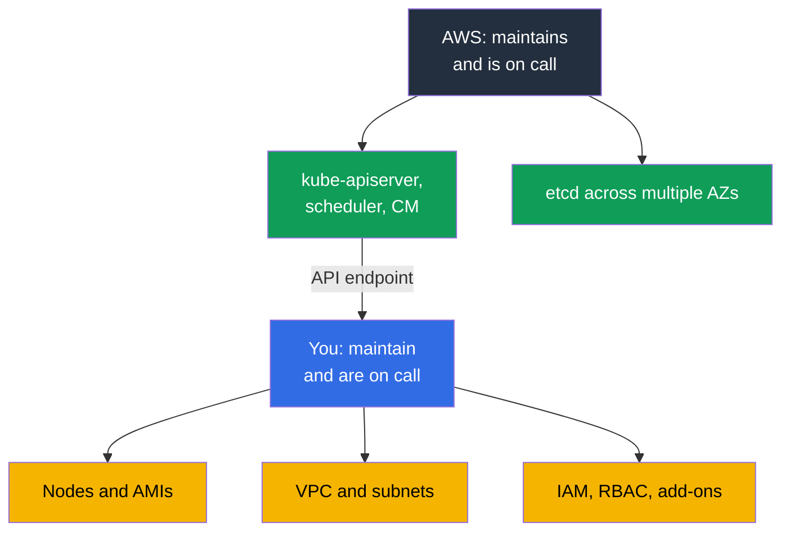
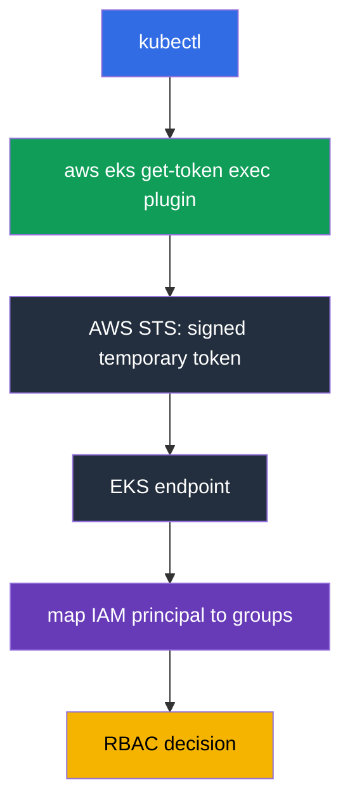
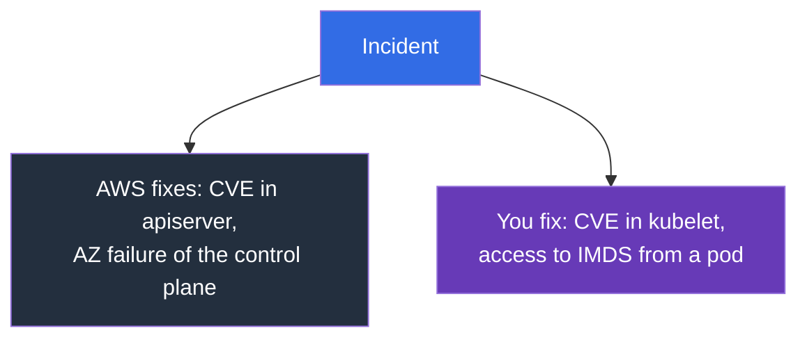

[Русская версия](ru.md) · [Versión en español](es.md) · [Version française](fr.md) · [Deutsche Version](de.md) · [ქართული ვერსია](ge.md) · [繁體中文版](tw.md) · [日本語版](jp.md)
# Chapter 1. Introduction: what EKS takes on and what remains yours

> **What comes next.** Part 0 provided the AWS vocabulary: accounts, IAM, VPC, EC2, and tools. Now for the main point: where the boundary lies between "AWS does this" and "you do this." After kubeadm, it is tempting to think that EKS is the same cluster, except someone else restarts `kube-apiserver`. The difference is deeper: some work disappears, some familiar tools disappear, and new causes of failure emerge. Chapter 2 examines the control plane in detail; Chapter 3 covers versions and upgrades.

## 1.1. What hurts in a kubeadm cluster

Recall an ordinary month operating a cluster built with kubeadm. Not an emergency month, but a quiet one. What happens in it apart from working with workloads?

- Certificates expire: one year passes, and `kubelet` can no longer talk to the API server. Someone must run `kubeadm certs check-expiration` before that happens, not after.
- etcd must be backed up and its restoration tested. A snapshot that no one has restored is not a backup. Losing quorum means an unusable cluster and a night of work.
- A minor-version upgrade is a manual sequence on every control plane node, with a maintenance window and a rollback plan that in practice comes down to "we will restore etcd."
- OS patches and CVEs in control plane components are also yours: assemble, roll out, verify. And all of it must be distributed across failure domains, with ongoing checks that it remains distributed.

This brings no business value: it is a tax for the right to run Kubernetes.

**Amazon EKS** is a managed Kubernetes control plane: AWS runs and maintains the API server, scheduler, controller manager, and etcd, while you get an endpoint to which your `kubectl` and nodes connect. It is the same upstream Kubernetes with the same APIs and manifests. What changes is not Kubernetes, but who is on call for its heart.



## 1.2. What AWS takes on and what you lose in return

The first thing an engineer does after CKA on a new cluster is look for the control plane. `kubectl get pods -n kube-system` shows neither `kube-apiserver` nor `etcd`, and `kubectl get nodes` shows no master nodes. The cluster is not broken: the control plane lives in the AWS account, does not belong to you, and is not in your VPC.

What AWS does for you: runs the API server, scheduler, and controller manager across several Availability Zones; scales and replaces failed instances; keeps, backs up, and restores etcd; patches control plane components, with the patch level represented by the **platform version**, which increases without your intervention; provides a monthly 99.95% SLA for API server availability (this is a service-level specification, not a price); and sends control plane logs to CloudWatch if you enable them (Chapter 2). In return, you lose precisely the tools you are accustomed to:

| kubeadm habit | How it works in EKS |
|---------------------|-----------|
| `etcdctl snapshot save` | there is no etcd access, neither over the network nor through exec; cluster state is backed up differently (Chapter 41) |
| editing `/etc/kubernetes/manifests/kube-apiserver.yaml` | control plane static pods are unavailable, and apiserver flags cannot be edited |
| your own `--enable-admission-plugins` | the plugin set is fixed by AWS; your extension point is webhooks and policies (Chapter 22) |
| `--feature-gates` on apiserver | unavailable; feature gates arrive with the version |
| `kubeadm upgrade apply` | a control plane upgrade is an AWS API call, one minor version at a time (Chapter 38) |
| cluster certificate rotation | AWS maintains control plane certificates; your access is built on IAM (Chapter 5) |
| `ssh` to a master and logs on disk | control plane logs are available only through CloudWatch, if enabled (Chapter 2) |
| your own `kube-scheduler` with profiles | a second scheduler is possible only as your pod on your nodes |

```bash
# List clusters in a Region
aws eks list-clusters --region eu-central-1

# Kubernetes version, control plane patch level, endpoint
aws eks describe-cluster --name demo \
  --query 'cluster.{version:version,platform:platformVersion,endpoint:endpoint}'

# The same version as seen by Kubernetes
kubectl get --raw /version
```

## 1.3. What remains yours

Everything between a user request and a running pod is still yours: machines, addresses, permissions, and the bill for them.

| Area | kubeadm | EKS | Where in the course |
|---------|---------|-----|-------------|
| API server, scheduler, controller manager, etcd | you | AWS | Chapter 2 |
| Control plane patches, platform version | you | AWS | Chapters 2, 3 |
| Selecting the minor version and its support lifetime | you | you, within supported versions | Chapter 3 |
| Nodes: AMIs, bootstrap, OS patches, upgrades, scaling | you | you | Chapters 10, 11, 12, 38 |
| CNI, address plan, IPs for pods | you | you | Chapters 6, 7, 8 |
| Authentication, RBAC, multi-tenancy | you, certificates | you, IAM and access entries | Chapters 5, 22 |
| Add-ons: CoreDNS, kube-proxy, CSI, versions | you | you, managed add-ons help | Chapter 37 |
| Load balancers, Ingress, DNS, TLS | you | you | Chapters 26-29 |
| Storage: StorageClass, volumes, snapshots | you | you | Chapters 23, 24, 25 |
| Secrets and their encryption | you | you, KMS helps | Chapter 18 |
| Observability and cost | you | you | Chapters 33-36, 43 |
| Kubernetes state and volume backups | you | you, AWS Backup helps | Chapters 41, 42 |

The picture is honest: EKS removes the most frightening part of the work, but not the largest. What remains has also become more complex: it is now not only Kubernetes, but AWS underneath it.

## 1.4. How engineering habits change

Each habit in this list costs one lost hour if you learn about it during an incident.

**Access is granted through IAM, not a certificate.** With kubeadm, you signed a client certificate with your CA and distributed kubeconfig. In EKS, kubeconfig does not contain long-lived credentials: it invokes the `aws eks get-token` exec plugin, which obtains a temporary token from STS, and the cluster maps the IAM principal to RBAC groups through an **access entry** (or the legacy `aws-auth` ConfigMap). This leads to a common symptom: kubeconfig is correct, but the response is `error: You must be logged in to the server`, because the role is not registered in the cluster (Chapter 5).



**Nodes are disposable.** An instance fixed manually will be replaced during a node group upgrade or Karpenter consolidation, and the change will disappear with it. A change on a node belongs only in the launch template, user data, or AMI (Chapters 10 and 12). At the same time, `ssh` stops being the primary tool: in production, nodes often have no public address or key, access is through SSM Session Manager, and troubleshooting relies on logs that leave the node automatically.

**Troubleshooting moves to the AWS API.** The symptom is visible in `kubectl`, while the cause lies in AWS: the node has the wrong IAM role, subnet addresses are exhausted, the vCPU quota is exhausted, the EBS volume is in another AZ, or the subnet lacks the required tag. This is exactly the two-layer diagram from Chapter 0.1. Some cluster state is not visible in `kubectl` at all: endpoint configuration, control plane logs, managed add-on versions, secret encryption, and node group state are AWS objects, read through `aws eks` and described as code (Chapter 4).

## 1.5. Shared responsibility in concrete terms

The phrase "AWS is responsible for cloud security, you are responsible for security in the cloud" sounds like marketing until you apply it to a specific incident. Then it makes clear within a minute who needs to fix it. The matrix below divides the model into three areas: AWS-only responsibility, your-only responsibility, and the shared area where AWS provides the mechanism but you configure it.

| AWS area (security of the cloud) | Shared area | Your area (security in the cloud) |
|--------------------------------|-----------------|-----------------------------------|
| control plane, etcd, hypervisor, physical infrastructure | IAM and RBAC, access entries | nodes, OS, AMI, kubelet, containerd |
| control plane patches, platform version | endpoint access mode | applications, requests/limits, NetworkPolicy |
| control plane multi-AZ deployment | secret encryption through KMS | data in volumes and its backup |

The shared area is the source of most incidents: the tool exists, but the configuration is yours. A representative example is encryption of Kubernetes API data. AWS encrypts etcd disks, and on version 1.28 and later, envelope encryption through KMS provider v2 works by default using an AWS key, without your involvement. Your own customer managed key changes not the fact of encryption, but ownership: the key policy, CloudTrail auditing of decryptions, and the consequences of revoking key access are yours, while AWS integrates the provider into `kube-apiserver`, and you cannot configure that integration (Chapter 18).



| Situation | Whose | What happens in practice |
|----------|-----|----------------------------|
| CVE in `kube-apiserver` | AWS | a new platform version is released; the control plane is patched without you |
| CVE in `kubelet`, containerd, or the node kernel | you | wait for a new AMI and roll out node replacements; old nodes are vulnerable while they remain alive (Chapters 10, 38) |
| Credential leak through IMDS from a pod | you | IMDSv2 and hop limit, move from the node role to IRSA or Pod Identity (Chapters 16, 17, 19) |
| AZ failure involving a control plane instance | AWS | the API server remains available; your task is to ensure that nodes are not in a single AZ (Chapter 40) |
| Public endpoint open to the entire Internet | you | this is your configuration: access mode and `publicAccessCidrs` (Chapter 2) |
| Pod with `hostPath` on `/` and root permissions | you | Pod Security Admission and policies (Chapters 19, 22) |

The conclusion: managing the control plane does not reduce the amount of security work; it removes one part of it. Everything on the nodes and in your account remains yours.

## 1.6. What EKS will not do, although it is often expected to

A team moves to a managed service and assumes that "AWS will keep an eye on it." It will, but only on the control plane. What will not happen:

- **It will not upgrade nodes.** A managed node group can roll out an upgrade, but you give the command. A node with a three-month-old AMI keeps running and will not report itself (Chapter 38).
- **It will not upgrade add-ons.** Even a managed add-on is upgraded by your decision, and its version is not compatible with every cluster version (Chapter 37).
- **It will not plan the address space.** A `/24` per subnet looks fine until the first scaling event: VPC CNI assigns pods addresses from the subnet (Chapters 6 and 7).
- **It will not tune workloads** or **write NetworkPolicy.** Requests and limits, HPA, PDB, topology spread, and pod isolation are yours (Chapters 14, 30, 35, 40).
- **It will not back up Kubernetes state by itself.** Neither objects nor volumes: backup is configured, and restoration is tested separately (Chapters 41 and 42).
- **It will not calculate costs** or **choose an access architecture.** Team-level allocation is built on tags, and you choose IRSA or Pod Identity (Chapters 5, 16, 17, 43).

A separate note on **Auto Mode**: this is a mode in which AWS also takes on nodes, core add-ons, and their upgrades. Scaling within it operates on Karpenter: instances are selected to fit the requests of unscheduled pods, but AWS administers the controller rather than you, which is why the compute-layer operating model differs (Chapters 11 and 12). It moves the boundary, but does not remove it and comes with its own trade-offs; Chapter 9 covers it. Until then, assume a cluster where the nodes are yours.

## 1.7. The cost of manageability

You pay in two currencies. Money: there is an **hourly charge** for the control plane, regardless of whether you have three nodes or three hundred. For a large cluster, it is noise compared with EC2; for a dozen small development clusters, it is a noticeable line item, which leads to a common decision: one cluster with namespace isolation instead of a cluster for every team (Chapters 22 and 43). When a minor version moves to extended support, the hourly charge for that cluster increases. This is a structural incentive to upgrade on time rather than accumulate outdated clusters (Chapter 38).

The hourly charge is not the only cost that manageability brings. Control plane logs are disabled by default, and enabling all five categories at once on an active cluster creates a data stream in which `audit` and `api` are noticeably larger than the rest. You pay for both ingestion and storage in CloudWatch Logs, and a log group without a configured retention period accumulates data indefinitely. On a chatty cluster, this line item can outgrow the control plane charge itself. Therefore, set retention when enabling logs (Chapter 2); volume, filters, and archival are covered in Chapters 34 and 43.

Freedom: the control plane is closed, and its settings are closed with it.

| Limitation | What it means in practice |
|-------------|----------------------------|
| No custom apiserver flags | you cannot add a flag or change timeouts; only what is exposed in the EKS API is available |
| Fixed set of admission plugins | implement your own rule as a validating or mutating webhook (Chapter 22) |
| No access to etcd | no `etcdctl` and no custom settings; backups only through supported mechanisms (Chapter 41) |
| Supported minor versions only | a new version does not appear in EKS on the day of the upstream release, and an old one leaves on a schedule (Chapter 3) |
| One minor version per upgrade | skipping a version is impossible; build the plan in steps (Chapter 38) |
| Extended support | a higher hourly charge for an outdated version: a deferral, not a solution (Chapters 3, 38) |

Check compatibility before an upgrade, and not only for the cluster: add-ons have their own matrices.

```bash
# What is currently installed in the cluster
aws eks describe-cluster --name demo --query 'cluster.[version,platformVersion,status]'

# Which add-on versions are available for a particular cluster version
aws eks describe-addon-versions --addon-name vpc-cni --kubernetes-version 1.33 \
  --query 'addons[].addonVersions[].addonVersion'
```

## 1.8. When EKS is not needed

This is a course about EKS, but the honest answer to "do I need it?" is sometimes no.

- **On-premises or another cloud.** EKS Anywhere and EKS Hybrid Nodes exist, but they are separate products with their own operating model, not "the same EKS on your infrastructure." This also includes **regulatory data-placement requirements** that available Regions do not satisfy.
- **Local development and CI.** kind or minikube are faster and free for manifests and chart testing; a paid cluster is needed where AWS integration is tested.
- **You need your own control plane.** Custom apiserver flags, your own admission plugins, or exotic feature gates are not available in EKS; a self-managed cluster on EC2 remains an option with all its cost.
- **One application without Kubernetes.** ECS, Fargate, Lambda, or App Runner can solve the task more cheaply than a cluster that must be operated.

## 1.9. How this is applied in production

- **The responsibility boundary is documented.** The runbook says: API server unavailable, open a ticket with AWS; nodes `NotReady`, investigate ourselves. This saves the first twenty minutes of an incident. **Nodes are treated as consumables**: AMI replacement is scheduled, not triggered by a CVE; a node that lives for months is debt (Chapter 38).
- **The cluster and its surrounding infrastructure are described as code.** Endpoint configuration, control plane logs, add-on versions, and node groups are in Terraform or eksctl, with no console edits (Chapter 4).
- **Access only through temporary IAM roles.** No long-lived keys in kubeconfig; a separate break-glass role with an alert on its use (Chapters 0.2 and 5).
- **Versions are planned.** The standard-support end date is on the calendar, and the upgrade goes through a development cluster first (Chapter 3). Restore from backup is tested quarterly on a test cluster, rather than merely considered configured (Chapters 41 and 42).
- **Cost is viewed as a metric.** Breakdown by clusters and teams, budgets with alarms, and analysis of traffic and NAT growth (Chapters 31 and 43).

## 1.10. Mini-glossary

- **Amazon EKS** is managed Kubernetes in AWS: AWS maintains the control plane, while nodes and surrounding infrastructure are yours. The **control plane** is the API server, scheduler, controller manager, and etcd; in EKS they live in the AWS account, outside your VPC, and are not visible in `kubectl get pods -n kube-system`. The **data plane** is your nodes and everything that runs on them.
- **Platform version** is the EKS control plane patch level within a Kubernetes minor version and increases without your intervention. The **cluster endpoint** is the API server address: public, private, or both (Chapter 2).
- **Access entry** maps an IAM principal to permissions in the cluster, the modern replacement for the `aws-auth` ConfigMap (Chapter 5).
- **Managed node group** is a node group whose lifecycle EKS manages at your command. **Auto Mode** is a mode where AWS also takes on nodes and core add-ons (Chapter 9). A **managed add-on** is an add-on (VPC CNI, CoreDNS, kube-proxy, CSI) whose version EKS manages at your request (Chapter 37).
- **Shared responsibility** means AWS is responsible for security of the cloud and you are responsible for security in the cloud.

## 1.11. Chapter summary

- EKS removes the most unpleasant part of operations: being on call for the API server, scheduler, controller manager, and etcd, their patching, and multi-AZ deployment.
- In return, tools disappear: no access to etcd or `etcdctl`, no control plane static pods, no editing apiserver flags, and no custom set of admission plugins.
- Everything else is yours: nodes and AMIs, network and address plan, IAM and RBAC, add-ons, storage, secrets, observability, backups, and cost. Habits change: access is through IAM rather than a certificate, nodes are disposable, `ssh` is not the primary tool, and the cause of a problem often lies in AWS.
- Responsibility is divided concretely: a CVE in apiserver goes to AWS, a CVE in kubelet goes to you; a control plane AZ failure goes to AWS, an open IMDS in a pod goes to you.
- The cost of manageability is an hourly charge, closed control plane settings, versions limited to supported ones, and upgrades one minor version at a time. EKS is not universal: on-premises, regulatory requirements, local development, and a custom control plane are reasons to choose something else.

## 1.12. How this helps in real work

The first question in any EKS incident is whether it is on our side of the boundary. The answer determines whether you go to `kubectl` and the AWS API or open a support ticket. The second effect is planning: once it is clear that nobody will upgrade nodes, manage add-on versions, or back up cluster state for you, these tasks go on the calendar in advance instead of surfacing when the version is already out of support. The third is a conversation with management: "we moved to managed Kubernetes" does not mean "there is less work," and the table in section 1.3 explains this better than words.

## 1.13. Self-check questions

1. Which Kubernetes components does AWS maintain in EKS, and why are they absent from `kubectl get pods`?
2. What is a platform version, and how does it differ from a Kubernetes version?
3. Why can you not run `etcdctl snapshot save` in EKS, and how should you back up the cluster instead?
4. You need to change a `kube-apiserver` flag. What options do you have in EKS?
5. How is cluster access granted in EKS, and why can a correct kubeconfig fail to work?
6. A CVE was released in kubelet and a CVE in apiserver. What do you do in each case?
7. An Availability Zone failed. What is AWS responsible for, and what are you responsible for?
8. Why is a manual change made on a node considered lost?
9. What will EKS not do itself: node upgrades, add-on upgrades, NetworkPolicy, backups?
10. How does the hourly control plane charge affect the choice between a cluster per team and one cluster with namespace isolation?
11. In which cases would you recommend not using EKS?
12. A pod is in `Pending` and Kubernetes events are sparse. Where do you look after `kubectl`?

## Practice

Practice for Part 1 begins in the next chapter. For now, it is useful to run `aws eks list-clusters` and `aws eks describe-cluster` on any cluster you can access and find the version, platform version, endpoint, and access mode in the output. Chapter 2 examines these fields one by one.

---
[Table of Contents](../README.md) · [Part 0](../00-1-aws/en.md) · [Chapter 2](../02/en.md)
