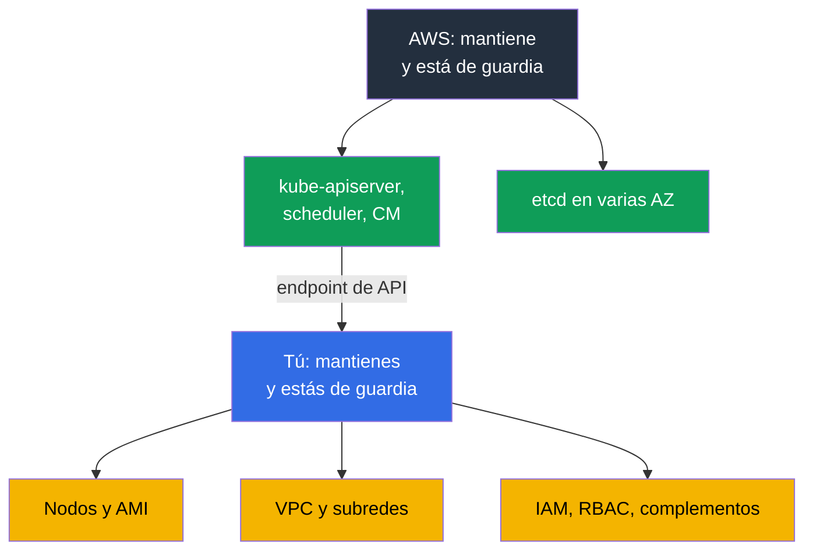
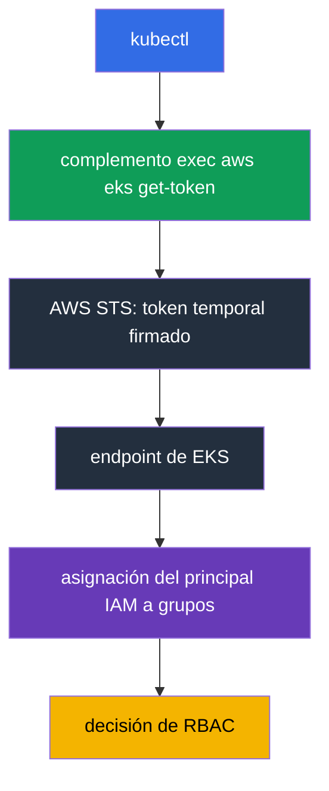
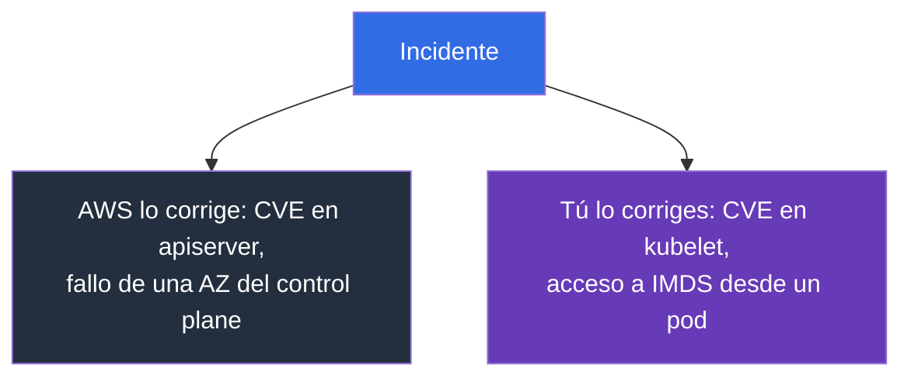

[Русская версия](ru.md) · [Eng version](en.md) · [Version française](fr.md) · [Deutsche Version](de.md) · [ქართული ვერსია](ge.md) · [繁體中文版](tw.md) · [日本語版](jp.md)
# Capítulo 1. Introducción: qué asume EKS y qué queda de tu lado

> **Qué sigue.** La parte 0 proporcionó el vocabulario de AWS: cuentas, IAM, VPC, EC2 y herramientas. Ahora viene lo principal: dónde está el límite entre «esto lo hace AWS» y «esto lo haces tú». Tras kubeadm, es tentador pensar que EKS es el mismo clúster, solo que otra persona reinicia `kube-apiserver`. La diferencia es más profunda: desaparece parte del trabajo, desaparecen algunas herramientas habituales y aparecen nuevas causas de fallos. El capítulo 2 examina el control plane en detalle, y el capítulo 3, las versiones y las actualizaciones.

## 1.1. Qué duele en un clúster kubeadm

Recuerda un mes habitual de operación de un clúster levantado mediante kubeadm. No uno de incidentes, sino tranquilo. ¿Qué ocurre, además de trabajar con las cargas?

- Los certificados caducan: pasa un año y `kubelet` no puede comunicarse con el servidor API. Alguien debe ejecutar `kubeadm certs check-expiration` antes de que ocurra, no después.
- Hay que respaldar etcd y comprobar la restauración. Una instantánea que nadie ha restaurado no es una copia de seguridad. Perder el quórum significa un clúster inoperativo y una noche de trabajo.
- Una actualización de versión menor es una secuencia manual en cada nodo del control plane, con una ventana de mantenimiento y un plan de reversión que, en la práctica, se reduce a «restauraremos etcd».
- Los parches del sistema operativo y los CVE de los componentes del control plane también son responsabilidad tuya: compilarlos, desplegarlos y verificarlos. Todo ello debe repartirse entre zonas de fallo y hay que vigilar que permanezca repartido.

Esto no aporta nada al negocio: es el impuesto por tener Kubernetes.

**Amazon EKS** es un control plane de Kubernetes administrado: AWS ejecuta y mantiene el servidor API, el scheduler, el controller manager y etcd, mientras tú recibes un endpoint al que se conectan tu `kubectl` y tus nodos. Es el mismo Kubernetes upstream, con las mismas API y manifiestos. No cambia Kubernetes, sino quién está de guardia por su corazón.



## 1.2. Qué asume AWS y de qué te priva a cambio

Lo primero que hace un ingeniero con CKA en un clúster nuevo es buscar el control plane. `kubectl get pods -n kube-system` no muestra ni `kube-apiserver` ni `etcd`, y `kubectl get nodes` no muestra nodos master. El clúster no está roto: el control plane vive en la cuenta de AWS, no te pertenece y no está en tu VPC.

AWS ejecuta por ti el servidor API, el scheduler y el controller manager en varias zonas de disponibilidad, escala y sustituye instancias fallidas; conserva, respalda y restaura etcd; aplica parches a los componentes del control plane, y el nivel de parche se denomina **platform version**, que aumenta sin tu intervención; ofrece un SLA mensual del 99,95 % para la disponibilidad del servidor API, que es una especificación de nivel de servicio, no un precio; entrega los registros del control plane a CloudWatch si los has habilitado (capítulo 2). A cambio, pierdes exactamente las herramientas a las que estás acostumbrado:

| Hábito de kubeadm | Cómo es en EKS |
|-------------------|----------------|
| `etcdctl snapshot save` | no hay acceso a etcd ni por red ni mediante exec; el estado del clúster se respalda de otra forma (capítulo 41) |
| editar `/etc/kubernetes/manifests/kube-apiserver.yaml` | los static pods del control plane no están disponibles y las opciones de apiserver no se pueden editar |
| tu propio `--enable-admission-plugins` | AWS fija el conjunto de plugins; tu punto de extensión son los webhooks y las políticas (capítulo 22) |
| `--feature-gates` en apiserver | no están disponibles; los feature gates llegan con la versión |
| `kubeadm upgrade apply` | la actualización del control plane es una llamada a la API de AWS, una versión menor cada vez (capítulo 38) |
| rotación de certificados del clúster | AWS mantiene los certificados del control plane; tu acceso se basa en IAM (capítulo 5) |
| `ssh` al master y registros en disco | los registros del control plane solo están disponibles mediante CloudWatch, si se habilitan (capítulo 2) |
| tu propio `kube-scheduler` con perfiles | un segundo scheduler solo es posible como tu pod en tus nodos |

```bash
# Lista de clústeres en la región
aws eks list-clusters --region eu-central-1

# Versión de Kubernetes, nivel de parche del control plane, endpoint
aws eks describe-cluster --name demo \
  --query 'cluster.{version:version,platform:platformVersion,endpoint:endpoint}'

# La misma versión vista por Kubernetes
kubectl get --raw /version
```


## 1.3. Qué queda de tu lado

Todo lo que se encuentra entre la solicitud de un usuario y un pod en ejecución sigue siendo tu responsabilidad: máquinas, direcciones, permisos y la factura correspondiente.

| Área | kubeadm | EKS | Dónde se trata en el curso |
|------|---------|-----|----------------------------|
| Servidor API, scheduler, controller manager, etcd | tú | AWS | capítulo 2 |
| Parches del control plane, platform version | tú | AWS | capítulos 2, 3 |
| Elección de la versión menor y duración de su vida útil | tú | tú, dentro de las compatibles | capítulo 3 |
| Nodos: AMI, bootstrap, parches del SO, actualización, escalado | tú | tú | capítulos 10, 11, 12, 38 |
| CNI, plan de direcciones, IP para pods | tú | tú | capítulos 6, 7, 8 |
| Autenticación, RBAC, multitenencia | tú, certificados | tú, IAM y access entries | capítulos 5, 22 |
| Complementos: CoreDNS, kube-proxy, CSI, versiones | tú | tú, managed addons ayudan | capítulo 37 |
| Balanceadores, Ingress, DNS, TLS | tú | tú | capítulos 26-29 |
| Almacenamiento: StorageClass, volúmenes, instantáneas | tú | tú | capítulos 23, 24, 25 |
| Secretos y su cifrado | tú | tú, KMS ayuda | capítulo 18 |
| Observabilidad y coste | tú | tú | capítulos 33-36, 43 |
| Copia de seguridad del estado de Kubernetes y los volúmenes | tú | tú, AWS Backup ayuda | capítulos 41, 42 |

La situación es honesta: EKS elimina la parte más temible del trabajo, pero no la mayor. Además, lo que queda se ha vuelto más complejo: ahora no es solo Kubernetes, sino también AWS debajo de él.

## 1.4. Qué cambia en los hábitos de un ingeniero

Cada hábito de esta lista cuesta una hora perdida si se descubre durante un incidente.

**El acceso se concede mediante IAM, no con un certificado.** En kubeadm firmabas un client cert con tu propia CA y distribuías kubeconfig. En EKS, kubeconfig no contiene credenciales de larga duración: invoca el complemento exec `aws eks get-token`, este obtiene un token temporal en STS y el clúster asigna el principal de IAM a grupos RBAC mediante una **access entry** (o la ConfigMap `aws-auth` obsoleta). De ahí el síntoma típico: kubeconfig es correcto, pero la respuesta es `error: You must be logged in to the server`, porque el rol no está registrado en el clúster (capítulo 5).



**Los nodos son desechables.** Una instancia reparada manualmente será sustituida al actualizar el node group o durante la consolidación de Karpenter, y el cambio desaparecerá con ella. Un cambio en el nodo solo perdura en el launch template, los user data o la AMI (capítulos 10 y 12). Por ello, `ssh` deja de ser la herramienta principal: en producción los nodos a menudo no tienen dirección pública ni clave, el acceso se realiza mediante SSM Session Manager y la depuración se basa en registros que salen del nodo por sí mismos.

**La depuración se traslada a la API de AWS.** El síntoma se ve en `kubectl`, pero la causa está en AWS: el nodo tiene un rol de IAM incorrecto, se han agotado las direcciones de la subred, se ha agotado la cuota de vCPU, el volumen EBS está en otra AZ o la subred no tiene la etiqueta necesaria. Es exactamente el diagrama de dos capas del capítulo 0.1. Parte del estado del clúster no se ve en absoluto en `kubectl`: la configuración del endpoint, los registros del control plane, las versiones de los managed addons, el cifrado de secretos y el estado del node group son objetos de AWS; se leen con `aws eks` y se describen como código (capítulo 4).

## 1.5. Responsabilidad compartida en términos concretos

La frase «AWS es responsable de la seguridad de la nube y tú, de la seguridad en la nube» suena a marketing hasta que se aplica a un incidente concreto. Entonces permite saber en un minuto quién debe arreglarlo. La matriz siguiente divide el modelo en tres zonas: responsabilidad exclusiva de AWS, responsabilidad exclusivamente tuya y una zona compartida, donde AWS proporciona el mecanismo y tú lo configuras.

| Zona de AWS (seguridad de la nube) | Zona compartida | Tu zona (seguridad en la nube) |
|------------------------------------|-----------------|--------------------------------|
| control plane, etcd, hipervisor, infraestructura física | IAM y RBAC, access entries | nodos, SO, AMI, kubelet, containerd |
| parches del control plane, platform version | modo de acceso al endpoint | aplicaciones, requests/limits, NetworkPolicy |
| multizona del control plane | cifrado de secretos mediante KMS | datos en volúmenes y su copia de seguridad |

La zona compartida es el origen de la mayoría de los incidentes: la herramienta existe, pero su configuración corre por tu cuenta. Un ejemplo ilustrativo es el cifrado de datos de la API de Kubernetes. AWS cifra los discos de etcd y, en las versiones 1.28 y posteriores, el envelope encryption mediante KMS provider v2 funciona de forma predeterminada, con una clave de AWS y sin intervención tuya. Una customer managed key no cambia el hecho del cifrado, sino la propiedad: la política de la clave, la auditoría de los descifrados en CloudTrail y las consecuencias de revocar el acceso a la clave son tuyas, mientras que AWS integra el proveedor en `kube-apiserver` y tú no puedes configurarlo (capítulo 18).



| Situación | De quién es | Qué ocurre en la práctica |
|-----------|-------------|----------------------------|
| CVE en `kube-apiserver` | AWS | aparece una nueva platform version y el control plane se parchea sin ti |
| CVE en `kubelet`, containerd o el kernel del nodo | tú | esperas una AMI nueva y despliegas nodos de reemplazo; los nodos antiguos son vulnerables mientras existan (capítulos 10, 38) |
| Filtración de credenciales a través de IMDS desde un pod | tú | IMDSv2 y hop limit, transición del rol de nodo a IRSA o Pod Identity (capítulos 16, 17, 19) |
| Fallo de una AZ con una instancia del control plane | AWS | el servidor API sigue disponible; tu responsabilidad es que los nodos no estén en una sola zona (capítulo 40) |
| Endpoint público abierto a todo Internet | tú | es tu configuración: el modo de acceso y `publicAccessCidrs` (capítulo 2) |
| Pod con `hostPath` en `/` y privilegios root | tú | Pod Security Admission y políticas (capítulos 19, 22) |

La conclusión: que el control plane sea administrado no reduce el trabajo de seguridad, sino que elimina una de sus partes. Todo lo que está en los nodos y en tu cuenta sigue siendo tuyo.


## 1.6. Lo que EKS no hará, aunque se espere de él

El equipo migra a un servicio administrado y cree que «AWS vigilará». Vigilará, pero solo el control plane. Esto es lo que no hará:

- **No actualizará los nodos.** Un managed node group puede desplegar una actualización, pero tú das la orden. Un nodo con una AMI de tres meses sigue funcionando y no avisará de sí mismo (capítulo 38).
- **No actualizará los complementos.** Incluso un managed addon se actualiza por tu decisión, y su versión no es compatible con todas las versiones del clúster (capítulo 37).
- **No planificará el plan de direcciones.** Una `/24` para una subred parece razonable hasta el primer escalado: VPC CNI asigna a los pods direcciones de la subred (capítulos 6 y 7).
- **No ajustará las cargas** ni **escribirá NetworkPolicy.** Requests y limits, HPA, PDB, topology spread y el aislamiento de pods son responsabilidad tuya (capítulos 14, 30, 35, 40).
- **No realizará por sí mismo una copia de seguridad del estado de Kubernetes.** Ni de los objetos ni de los volúmenes: la copia se configura y la restauración se verifica por separado (capítulos 41 y 42).
- **No calculará el coste** ni **elegirá la arquitectura de acceso.** La atribución por equipos se construye con etiquetas, e IRSA o Pod Identity las eliges tú (capítulos 5, 16, 17, 43).

Una aclaración aparte sobre **Auto Mode**: es un modo en que AWS asume también los nodos, los complementos básicos y sus actualizaciones. El escalado interno funciona mediante Karpenter: las instancias se eligen conforme a los requests de los pods no programados, pero AWS administra el controlador, no tú. De ahí la diferencia en el modelo de operación de la capa de compute (capítulos 11 y 12). Desplaza el límite, pero no lo elimina y tiene sus propias concesiones; se trata en el capítulo 9. Hasta entonces, se presupone un clúster cuyos nodos son tuyos.

## 1.7. El precio de la gestión administrada

Pagas con dos monedas. Dinero: se cobra una **tarifa por hora** por el control plane, sin importar si tienes tres nodos o trescientos. Para un clúster grande es ruido frente a EC2; para una docena de clústeres pequeños de desarrollo es una partida visible. De ahí la solución habitual: un clúster con aislamiento por namespace en lugar de un clúster por equipo (capítulos 22 y 43). Cuando una versión menor pasa a extended support, aumenta la tarifa por hora de ese clúster. Es un incentivo estructural para actualizar a tiempo, no para acumular clústeres obsoletos (capítulo 38).

La tarifa por hora no es, sin embargo, la única partida que conlleva una gestión administrada. Los registros del control plane están deshabilitados de forma predeterminada y habilitar a la vez las cinco categorías en un clúster activo produce un flujo de datos en el que `audit` y `api` tienen un volumen notablemente mayor que las demás. Se paga tanto por la ingesta como por el almacenamiento en CloudWatch Logs, y un log group sin un periodo de retención configurado acumula datos indefinidamente. En un clúster muy verboso, esta partida puede superar la propia tarifa del control plane. Por eso se configura la retención en el mismo paso que se habilitan los registros (capítulo 2); el volumen, los filtros y el archivo se tratan en los capítulos 34 y 43.

Libertad: el control plane está cerrado, y con él sus configuraciones.

| Restricción | Qué significa en la práctica |
|-------------|-------------------------------|
| No hay opciones personalizadas de apiserver | no se puede añadir una opción ni cambiar los tiempos de espera; solo está disponible lo expuesto en la API de EKS |
| Conjunto fijo de admission plugins | una regla propia se escribe como validating o mutating webhook (capítulo 22) |
| No hay acceso a etcd | ni `etcdctl` ni configuraciones propias; la copia de seguridad solo se hace con mecanismos compatibles (capítulo 41) |
| Solo versiones menores compatibles | una versión nueva aparece en EKS no el día de lanzamiento upstream, y una antigua se retira según el calendario (capítulo 3) |
| Una versión menor por actualización | no es posible saltar una versión; el plan se construye por pasos (capítulo 38) |
| Extended support | tarifa por hora más elevada por una versión obsoleta: un aplazamiento, no una solución (capítulos 3, 38) |

La compatibilidad se comprueba antes de actualizar, y no solo para el clúster: los complementos tienen sus propias matrices.

```bash
# Qué está instalado actualmente en el clúster
aws eks describe-cluster --name demo --query 'cluster.[version,platformVersion,status]'

# Qué versiones del complemento están disponibles para una versión concreta del clúster
aws eks describe-addon-versions --addon-name vpc-cni --kubernetes-version 1.33 \
  --query 'addons[].addonVersions[].addonVersion'
```

## 1.8. Cuándo no se necesita EKS

El curso trata sobre EKS, pero la respuesta honesta a «¿se necesita?» a veces es negativa.

- **On-prem u otra nube.** Existen EKS Anywhere y EKS Hybrid Nodes, pero son productos distintos con su propio modelo de operación, no «el mismo EKS en tus instalaciones». Esto incluye los **requisitos regulatorios de ubicación de datos** que no se resuelven con las regiones disponibles.
- **Desarrollo local y CI.** Para manifiestos y pruebas de charts, kind o minikube son más rápidos y gratuitos; un clúster de pago hace falta donde se prueba la integración con AWS.
- **Se necesita un control plane propio.** Opciones personalizadas de apiserver, admission plugins propios y feature gates exóticos no existen en EKS; un clúster autogestionado en EC2 sigue siendo una opción con todo su coste.
- **Una única aplicación sin Kubernetes.** ECS, Fargate, Lambda o App Runner resolverán la tarea por menos que un clúster que hay que operar.

## 1.9. Cómo se aplica esto en producción

- **El límite de responsabilidad se documenta por escrito.** El runbook dice: si el servidor API no está disponible, ticket a AWS; si los nodos están `NotReady`, lo investigamos nosotros. Esto ahorra los primeros veinte minutos de un incidente. **Los nodos se consideran consumibles**: se reemplaza la AMI según un calendario, no cuando aparece un CVE; un nodo que vive durante meses es deuda (capítulo 38).
- **El clúster y su infraestructura auxiliar se describen como código.** Configuración del endpoint, registros del control plane, versiones de complementos y node groups: en Terraform o eksctl, sin cambios en la consola (capítulo 4).
- **Acceso solo mediante roles de IAM temporales.** Sin claves de larga duración en kubeconfig, y un rol de break-glass independiente con alerta de uso (capítulos 0.2 y 5).
- **Las versiones se planifican.** La fecha de finalización del soporte estándar está en el calendario; primero se actualiza el clúster de desarrollo (capítulo 3). La restauración desde una copia de seguridad se comprueba trimestralmente en un clúster de pruebas, no se da por configurada (capítulos 41 y 42).
- **El coste se observa como una métrica.** Desglose por clústeres y equipos, presupuestos con alertas, análisis del crecimiento del tráfico y de NAT (capítulos 31 y 43).


## 1.10. Miniglosario

- **Amazon EKS** es Kubernetes administrado en AWS: AWS mantiene el control plane y los nodos y la infraestructura auxiliar son responsabilidad tuya. **Control plane** es el servidor API, scheduler, controller manager y etcd; en EKS viven en la cuenta de AWS, fuera de tu VPC, y no se ven en `kubectl get pods -n kube-system`. **Data plane** son tus nodos y todo lo que se ejecuta en ellos.
- **Platform version** es el nivel de parche del control plane de EKS dentro de una versión menor de Kubernetes y aumenta sin tu intervención. **Cluster endpoint** es la dirección del servidor API: público, privado o ambos (capítulo 2).
- **Access entry** es la vinculación de un principal de IAM con permisos en el clúster, el sustituto moderno de la ConfigMap `aws-auth` (capítulo 5).
- **Managed node group** es un grupo de nodos cuyo ciclo de vida gestiona EKS por tu orden. **Auto Mode** es un modo en que AWS asume también los nodos y los complementos básicos (capítulo 9). **Managed addon** es un complemento, como VPC CNI, CoreDNS, kube-proxy o CSI, cuya versión EKS administra a petición tuya (capítulo 37).
- **Shared responsibility** significa que AWS es responsable de la seguridad de la nube y tú, de la seguridad en la nube.

## 1.11. Resumen del capítulo

- EKS elimina la parte más desagradable de la operación: estar de guardia por el servidor API, el scheduler, el controller manager y etcd, sus parches y su despliegue multizona.
- A cambio, desaparecen herramientas: no hay acceso a etcd ni a `etcdctl`, no hay static pods del control plane, no se pueden editar las opciones de apiserver ni tener un conjunto propio de admission plugins.
- Lo demás es tuyo: nodos y AMI, red y plan de direcciones, IAM y RBAC, complementos, almacenamiento, secretos, observabilidad, copia de seguridad y coste. Los hábitos cambian: el acceso se realiza con IAM en lugar de certificado, los nodos son desechables, `ssh` no es la herramienta principal y la causa del problema suele estar en AWS.
- La responsabilidad se divide de manera concreta: CVE en apiserver, para AWS; CVE en kubelet, para ti; fallo de una AZ del control plane, para AWS; IMDS abierto en un pod, para ti.
- El precio de la gestión administrada: una tarifa por hora, configuraciones cerradas del control plane, versiones dentro de las compatibles y una actualización de una versión menor cada vez. EKS no es universal: on-prem, regulación, desarrollo local y un control plane personalizado son razones para elegir otra cosa.

## 1.12. Cómo sirve esto en el trabajo real

La primera pregunta en cualquier incidente de EKS es: ¿está de nuestro lado del límite o no? La respuesta determina si vas a `kubectl` y a la API de AWS, o si abres un ticket de soporte. El segundo efecto es la planificación: cuando está claro que nadie actualizará por ti los nodos, las versiones de complementos ni las copias de seguridad del estado del clúster, esas tareas entran en el calendario de antemano, en vez de aparecer cuando la versión ya ha quedado fuera de soporte. El tercero es la conversación con la dirección: «hemos pasado a Kubernetes administrado» no significa «hay menos trabajo», y la tabla de la sección 1.3 lo explica mejor que las palabras.

## 1.13. Preguntas de autoevaluación

1. ¿Qué componentes de Kubernetes mantiene AWS en EKS y por qué no están en `kubectl get pods`?
2. ¿Qué es una platform version y en qué se diferencia de la versión de Kubernetes?
3. ¿Por qué no se puede ejecutar `etcdctl snapshot save` en EKS y cómo se respalda entonces el clúster?
4. Necesitas cambiar una opción de `kube-apiserver`. ¿Qué opciones tienes en EKS?
5. ¿Cómo se concede acceso al clúster en EKS y por qué puede no funcionar un kubeconfig correcto?
6. Aparece un CVE en kubelet y otro en apiserver. ¿Qué haces tú en cada caso?
7. Falla una zona de disponibilidad. ¿De qué es responsable AWS y de qué eres responsable tú?
8. ¿Por qué un cambio manual en un nodo se considera perdido?
9. ¿Qué no hará EKS por sí mismo: actualizar nodos, actualizar complementos, NetworkPolicy o copias de seguridad?
10. ¿Cómo influye la tarifa por hora del control plane en la elección entre un clúster por equipo y un único clúster con aislamiento por namespace?
11. ¿En qué casos recomendarías no utilizar EKS?
12. Un pod está en `Pending` y hay pocos eventos de Kubernetes. ¿Dónde miras después de `kubectl`?

## Práctica

La práctica de la parte 1 comienza en el siguiente capítulo. Por ahora, es útil ejecutar `aws eks list-clusters` y `aws eks describe-cluster` en cualquier clúster accesible, y localizar en la salida la versión, la platform version, el endpoint y el modo de acceso. El capítulo 2 analiza estos campos uno por uno.

---
[Índice](../README_ES.md) · [Parte 0](../00-1-aws/es.md) · [Capítulo 2](../02/es.md)
