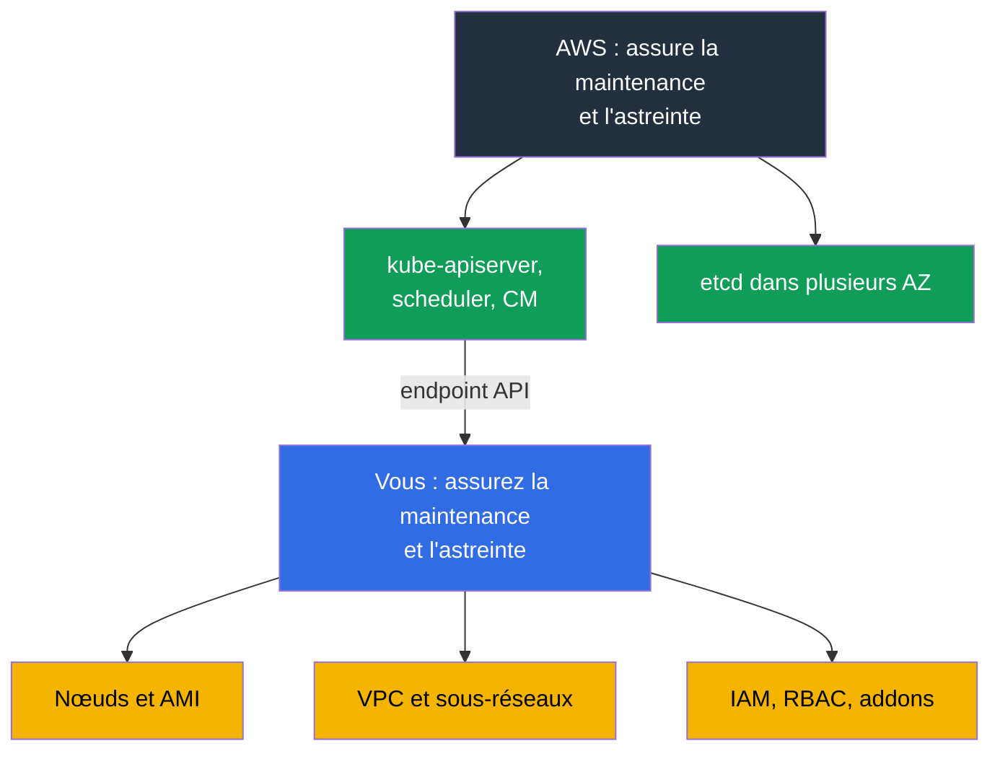
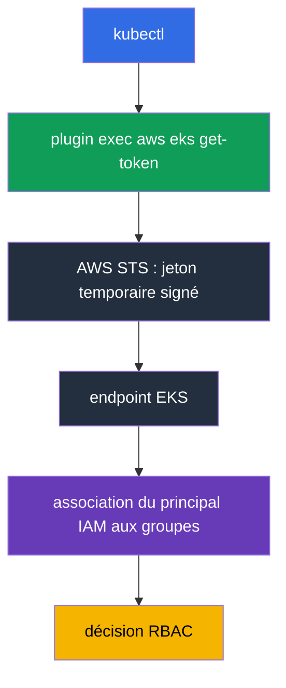
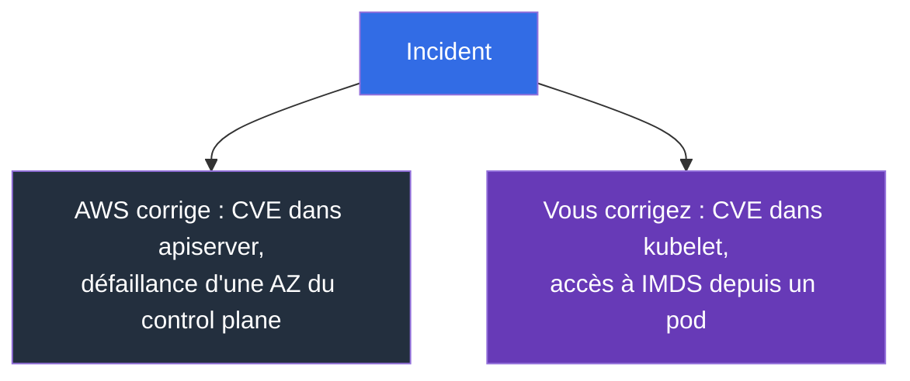

[Русская версия](ru.md) · [Eng version](en.md) · [Versión en español](es.md) · [Deutsche Version](de.md) · [ქართული ვერსია](ge.md) · [繁體中文版](tw.md) · [日本語版](jp.md)
# Chapitre 1. Introduction : ce que prend en charge EKS et ce qui reste à votre charge

> **La suite.** La partie 0 a fourni le vocabulaire AWS : comptes, IAM, VPC, EC2, outils. Maintenant,
> l'essentiel : où passe la frontière entre « AWS s'en charge » et « vous vous en chargez ». Après kubeadm, il est
> tentant de penser qu'EKS est le même cluster, sauf que quelqu'un d'autre redémarre `kube-apiserver`.
> La différence est plus profonde : une partie du travail disparaît, une partie des outils habituels disparaît,
> et de nouvelles causes de défaillance apparaissent. Le chapitre 2 examine concrètement le control plane, le chapitre 3
> traite des versions et des mises à jour.

## 1.1. Les difficultés d'un cluster kubeadm

Repensez à un mois d'exploitation ordinaire d'un cluster créé avec kubeadm. Pas un mois d'incident, mais
un mois calme. Que s'y passe-t-il, en plus de la gestion des charges de travail ?

- Les certificats expirent : après un an, `kubelet` ne peut plus communiquer avec le serveur API. Il faut que quelqu'un
  exécute `kubeadm certs check-expiration` avant cela, pas après.
- etcd doit être sauvegardé et la restauration doit être vérifiée. Un snapshot que personne n'a restauré
  n'est pas une sauvegarde. La perte du quorum signifie un cluster hors service et une nuit de travail.
- La mise à niveau d'une version mineure est une séquence manuelle sur chaque nœud du control plane, avec une fenêtre
  de maintenance et un plan de repli qui, en pratique, se résume à « nous restaurerons etcd ».
- Les correctifs de l'OS et les CVE des composants du control plane sont aussi votre responsabilité : il faut les
  préparer, les déployer et les vérifier. Il faut également les répartir entre les zones de défaillance et veiller à ce
  qu'ils le restent.

Cela n'apporte rien au métier : c'est la taxe à payer pour avoir Kubernetes.

**Amazon EKS** est un control plane Kubernetes géré : AWS exécute et assure la maintenance du
serveur API, du scheduler, du controller manager et d'etcd, tandis que vous obtenez un endpoint auquel
se connectent votre `kubectl` et vos nœuds. C'est le même Kubernetes upstream, avec les mêmes API et
manifestes. Ce n'est pas Kubernetes qui change, mais la personne qui assure l'astreinte pour son cœur.



## 1.2. Ce qu'AWS prend en charge et ce dont vous vous privez

La première chose que fait un ingénieur après le CKA sur un nouveau cluster est de chercher le control plane. `kubectl get
pods -n kube-system` n'affiche ni `kube-apiserver` ni `etcd`, et `kubectl get nodes` n'affiche aucun nœud master.
Le cluster n'est pas cassé : le control plane vit dans le compte AWS, ne vous appartient pas et n'est pas dans votre VPC.

AWS fait ceci pour vous : exécute le serveur API, le scheduler et le controller manager dans plusieurs
zones de disponibilité, met à l'échelle et remplace les instances défaillantes ; conserve, sauvegarde et
restaure etcd ; applique les correctifs aux composants du control plane, et le niveau de correctif est désigné par
la **platform version**, qui progresse sans votre intervention ; fournit un SLA mensuel de 99,95 % sur la
disponibilité du serveur API (c'est une spécification de niveau de service, pas un prix) ; transmet les logs du control
plane à CloudWatch si vous les avez activés (chapitre 2). En contrepartie, vous perdez précisément les
outils auxquels vous êtes habitué :

| Habitude issue de kubeadm | Dans EKS |
|---------------------------|----------|
| `etcdctl snapshot save` | aucun accès à etcd, ni réseau ni exec ; l'état du cluster est sauvegardé autrement (chapitre 41) |
| modification de `/etc/kubernetes/manifests/kube-apiserver.yaml` | les static pods du control plane sont inaccessibles, les flags de l'apiserver ne sont pas modifiables |
| son propre `--enable-admission-plugins` | l'ensemble des plugins est fixé par AWS ; votre point d'extension est constitué de webhooks et de politiques (chapitre 22) |
| `--feature-gates` sur l'apiserver | indisponibles, les feature gates arrivent avec la version |
| `kubeadm upgrade apply` | la mise à jour du control plane est un appel d'API AWS, une seule version mineure à la fois (chapitre 38) |
| rotation des certificats du cluster | AWS assure les certificats du control plane, votre accès est fondé sur IAM (chapitre 5) |
| `ssh` sur le master et logs sur disque | les logs du control plane ne passent que par CloudWatch, s'ils sont activés (chapitre 2) |
| son propre `kube-scheduler` avec profils | un second scheduler n'est possible que sous la forme de votre pod sur vos nœuds |

```bash
# Liste des clusters dans la région
aws eks list-clusters --region eu-central-1

# Version Kubernetes, niveau de correctif du control plane, endpoint
aws eks describe-cluster --name demo \
  --query 'cluster.{version:version,platform:platformVersion,endpoint:endpoint}'

# La même version vue par Kubernetes
kubectl get --raw /version
```

## 1.3. Ce qui reste à votre charge

Tout ce qui se trouve entre la demande d'un utilisateur et un pod opérationnel reste votre responsabilité : les machines,
les adresses, les droits et leur facture.

| Domaine | kubeadm | EKS | Où dans le cours |
|---------|---------|-----|------------------|
| Serveur API, scheduler, controller manager, etcd | vous | AWS | chapitre 2 |
| Correctifs du control plane, platform version | vous | AWS | chapitres 2, 3 |
| Choix d'une version mineure et durée de vie | vous | vous, dans les versions prises en charge | chapitre 3 |
| Nœuds : AMI, bootstrap, correctifs OS, mise à jour, mise à l'échelle | vous | vous | chapitres 10, 11, 12, 38 |
| CNI, plan d'adressage, IP pour les pods | vous | vous | chapitres 6, 7, 8 |
| Authentification, RBAC, multitenancy | vous, certificats | vous, IAM et access entries | chapitres 5, 22 |
| Addons : CoreDNS, kube-proxy, CSI, versions | vous | vous, les managed addons aident | chapitre 37 |
| Load balancers, Ingress, DNS, TLS | vous | vous | chapitres 26-29 |
| Stockage : StorageClass, volumes, snapshots | vous | vous | chapitres 23, 24, 25 |
| Secrets et leur chiffrement | vous | vous, KMS aide | chapitre 18 |
| Observabilité et coût | vous | vous | chapitres 33-36, 43 |
| Sauvegarde de l'état Kubernetes et des volumes | vous | vous, AWS Backup aide | chapitres 41, 42 |

Le constat est honnête : EKS enlève la partie la plus redoutable du travail, mais pas la plus importante. Le reste est
également devenu plus complexe : il ne s'agit plus seulement de Kubernetes, mais aussi d'AWS sous celui-ci.

## 1.4. Ce qui change dans les habitudes de l'ingénieur

Chaque habitude de cette liste coûte une heure perdue si vous la découvrez en situation réelle.

**L'accès est accordé par IAM, non par certificat.** Dans kubeadm, vous signiez un certificat client avec votre
CA et distribuiez le kubeconfig. Dans EKS, le kubeconfig ne contient pas d'identifiants de longue durée : il appelle
le plugin exec `aws eks get-token`, qui obtient un jeton temporaire dans STS, puis le cluster associe le
principal IAM à des groupes RBAC via une **access entry** (ou l'ancienne ConfigMap `aws-auth`). D'où le
symptôme courant : le kubeconfig est correct, mais renvoie `error: You must be logged in to the
server`, car le rôle n'est pas enregistré dans le cluster (chapitre 5).



**Les nœuds sont éphémères.** Une instance réparée à la main sera remplacée lors de la mise à jour du node group
ou de la consolidation Karpenter, et la modification disparaîtra avec elle. Toute modification d'un nœud ne vit que dans
le launch template, les user data ou l'AMI (chapitres 10 et 12). `ssh` cesse alors d'être l'outil principal : en production,
les nœuds n'ont souvent ni adresse publique ni clé, l'accès passe par SSM Session Manager, et le débogage se fonde sur
les logs qui quittent eux-mêmes le nœud.

**Le débogage passe par l'API AWS.** Le symptôme est visible dans `kubectl`, mais sa cause est dans AWS : rôle IAM
de nœud incorrect, adresses épuisées dans le sous-réseau, quota de vCPU atteint, volume EBS dans une autre AZ, ou
sous-réseau sans le tag requis. C'est exactement le diagramme à deux couches du chapitre 0.1. Une partie de l'état du
cluster n'est pas du tout visible dans `kubectl` : la configuration de l'endpoint, les logs du control plane, les versions
des managed addons, le chiffrement des secrets et l'état du node group sont des objets AWS, lus avec `aws eks` et
décrits sous forme de code (chapitre 4).

## 1.5. La responsabilité partagée en pratique

La formule « AWS est responsable de la sécurité du cloud, vous de la sécurité dans le cloud » ressemble à du
marketing tant qu'on ne l'applique pas à un incident concret. Dans ce cas, elle permet de comprendre en une minute
qui doit corriger. La matrice ci-dessous répartit le modèle en trois zones : responsabilité AWS pure,
responsabilité purement vôtre et responsabilité partagée, où AWS fournit le mécanisme mais où vous le configurez.

| Zone AWS (sécurité du cloud) | Zone partagée | Votre zone (sécurité dans le cloud) |
|------------------------------|---------------|-------------------------------------|
| control plane, etcd, hyperviseur, infrastructure physique | IAM et RBAC, access entries | nœuds, OS, AMI, kubelet, containerd |
| correctifs du control plane, platform version | mode d'accès à l'endpoint | applications, requests/limits, NetworkPolicy |
| multizonalité du control plane | chiffrement des secrets via KMS | données dans les volumes et leur sauvegarde |

La zone partagée est la source de la plupart des incidents : l'outil existe, mais sa configuration vous incombe.
Un exemple parlant est le chiffrement des données de l'API Kubernetes. AWS chiffre les disques etcd et, à partir des versions
1.28, le chiffrement d'enveloppe avec KMS provider v2 fonctionne par défaut, avec une clé AWS, sans votre intervention.
Votre propre customer managed key ne change pas le fait que les données sont chiffrées, mais la propriété : la politique de
clé, l'audit des déchiffrements dans CloudTrail et les conséquences de la révocation de l'accès à la clé sont de votre ressort,
tandis qu'AWS intègre le fournisseur dans `kube-apiserver`, et vous ne pouvez pas le configurer (chapitre 18).



| Situation | Responsable | Ce qui se passe en pratique |
|-----------|-------------|-----------------------------|
| CVE dans `kube-apiserver` | AWS | une nouvelle platform version sort, le control plane est corrigé sans vous |
| CVE dans `kubelet`, containerd, noyau du nœud | vous | vous attendez une nouvelle AMI et déployez le remplacement des nœuds ; les anciens nœuds restent vulnérables tant qu'ils existent (chapitres 10, 38) |
| Fuite d'identifiants via IMDS depuis un pod | vous | IMDSv2 et hop limit, abandon du rôle de nœud au profit d'IRSA ou de Pod Identity (chapitres 16, 17, 19) |
| Défaillance d'une AZ avec une instance du control plane | AWS | le serveur API reste disponible ; vous devez veiller à ce que les nœuds ne soient pas dans une seule zone (chapitre 40) |
| Endpoint public ouvert à tout Internet | vous | c'est votre réglage : mode d'accès et `publicAccessCidrs` (chapitre 2) |
| Pod avec `hostPath` sur `/` et droits root | vous | Pod Security Admission et politiques (chapitres 19, 22) |

La conclusion : la gestion du control plane ne réduit pas le volume de travail lié à la sécurité, elle en enlève
une partie. Tout ce qui concerne les nœuds et votre compte reste votre responsabilité.

## 1.6. Ce qu'EKS ne fera pas, même si on l'en attend souvent

Une équipe migre vers un service géré et pense qu'« AWS surveillera tout ». AWS le fera, mais
uniquement pour le control plane. Voici ce qui ne se produira pas :

- **EKS ne mettra pas à jour les nœuds.** Un managed node group peut déployer une mise à jour, mais c'est vous
  qui donnez l'ordre. Un nœud avec une AMI vieille de trois mois fonctionne sans vous en informer (chapitre 38).
- **EKS ne mettra pas à jour les addons.** Même un managed addon est mis à jour sur votre décision, et sa version
  n'est pas compatible avec toutes les versions du cluster (chapitre 37).
- **EKS ne planifiera pas le plan d'adressage.** Un `/24` par sous-réseau semble convenable jusqu'à la première
  mise à l'échelle : VPC CNI attribue aux pods des adresses du sous-réseau (chapitres 6 et 7).
- **EKS n'ajustera pas les charges de travail** et **n'écrira pas de NetworkPolicy.** Requests et limits, HPA, PDB,
  topology spread et isolation des pods sont votre responsabilité (chapitres 14, 30, 35, 40).
- **EKS ne sauvegardera pas lui-même l'état Kubernetes.** Ni les objets ni les volumes : la sauvegarde se configure,
  puis la restauration se vérifie séparément (chapitres 41 et 42).
- **EKS ne calculera pas les coûts** et **ne choisira pas l'architecture d'accès.** La répartition par équipe s'appuie
  sur les tags, et c'est vous qui choisissez IRSA ou Pod Identity (chapitres 5, 16, 17, 43).

Une précision concernant le **Auto Mode** : c'est un mode dans lequel AWS prend également en charge les nœuds,
les addons de base et leurs mises à jour. La mise à l'échelle y fonctionne avec Karpenter : les instances
sont choisies selon les requests des pods non planifiés, mais le contrôleur est administré par AWS et non par vous,
d'où la différence dans le modèle d'exploitation de la couche compute (chapitres 11 et 12). Il déplace la frontière,
mais ne la supprime pas, et comporte ses propres compromis ; il est étudié au chapitre 9. Jusque-là, on suppose
un cluster dont les nœuds sont les vôtres.

## 1.7. Le prix de la gestion déléguée

Vous payez avec deux monnaies. L'argent : le control plane fait l'objet d'une **facturation horaire**, quel que
soit votre nombre de nœuds, trois ou trois cents. Pour un grand cluster, c'est négligeable face à EC2 ; pour une dizaine
de petits clusters de développement, c'est une ligne de coût notable. La décision typique qui en découle est donc
un cluster unique avec isolation par namespace plutôt qu'un cluster pour chaque équipe (chapitres 22 et 43). Lorsqu'une
version mineure passe en extended support, la facturation horaire de ce cluster augmente : c'est une incitation structurelle
à mettre à jour dans les délais, plutôt qu'à accumuler les clusters obsolètes (chapitre 38).

La facturation horaire n'est cependant pas la seule ligne de coût qu'apporte la gestion déléguée. Les logs du control
plane sont désactivés par défaut, et l'activation simultanée des cinq catégories sur un cluster actif produit un flux de
données dans lequel `audit` et `api` sont nettement plus volumineux que les autres. Vous payez à la fois l'ingestion et
le stockage dans CloudWatch Logs, et un log group sans durée de rétention définie accumule les données indéfiniment.
Sur un cluster bavard, cette ligne peut dépasser le coût du control plane lui-même. C'est pourquoi la rétention est définie
en même temps que les logs sont activés (chapitre 2), tandis que le volume, les filtres et l'archivage sont traités dans
les chapitres 34 et 43.

La liberté : le control plane est fermé, et ses réglages le sont avec lui.

| Limitation | Ce que cela signifie en pratique |
|------------|----------------------------------|
| Pas de flags apiserver personnalisés | impossible d'ajouter un flag ou de modifier les délais d'expiration ; seul ce qui est exposé dans l'API EKS est disponible |
| Ensemble fixe de plugins d'admission | une règle personnalisée s'écrit sous forme de webhook validating ou mutating (chapitre 22) |
| Pas d'accès à etcd | ni `etcdctl` ni réglages personnels ; sauvegarde uniquement par les mécanismes pris en charge (chapitre 41) |
| Uniquement les versions mineures prises en charge | une nouvelle version arrive dans EKS non le jour de la release upstream, et l'ancienne est retirée selon un calendrier (chapitre 3) |
| Une version mineure par mise à jour | impossible de sauter une version, le plan est réalisé étape par étape (chapitre 38) |
| Extended support | facturation horaire accrue pour une version obsolète : un report, pas une solution (chapitres 3, 38) |

La compatibilité est vérifiée avant la mise à jour, et pas seulement pour le cluster : les addons ont leurs propres matrices.

```bash
# Ce qui est actuellement installé dans le cluster
aws eks describe-cluster --name demo --query 'cluster.[version,platformVersion,status]'

# Versions de l'addon disponibles pour une version précise du cluster
aws eks describe-addon-versions --addon-name vpc-cni --kubernetes-version 1.33 \
  --query 'addons[].addonVersions[].addonVersion'
```

## 1.8. Quand EKS n'est pas nécessaire

Le cours porte sur EKS, mais la réponse honnête à la question « en a-t-on besoin ? » est parfois non.

- **On-prem ou autre cloud.** EKS Anywhere et EKS Hybrid Nodes existent, mais ce sont des produits distincts avec
  leur propre modèle de fonctionnement, pas « le même EKS chez soi ». Cela inclut aussi les **exigences réglementaires
  de localisation des données** qui ne sont pas satisfaites par les régions disponibles.
- **Développement local et CI.** Pour les manifestes et les tests de charts, kind ou minikube sont plus rapides et
  gratuits ; un cluster payant est nécessaire là où l'intégration avec AWS est testée.
- **Besoin d'un control plane personnalisé.** Flags apiserver personnalisés, plugins d'admission propres,
  feature gates exotiques : cela n'existe pas dans EKS ; un cluster self-managed sur EC2 reste une option, avec tout
  son coût.
- **Une application sans Kubernetes.** ECS, Fargate, Lambda ou App Runner rempliront la fonction à moindre coût qu'un
  cluster qu'il faut exploiter.

## 1.9. Application en production

- **La frontière de responsabilité est documentée.** Le runbook indique : serveur API indisponible,
  ticket AWS ; nœuds `NotReady`, investigation par nos soins. Cela économise les vingt premières minutes d'un incident.
  **Les nœuds sont traités comme des consommables** : remplacement d'AMI planifié, pas après la découverte d'un CVE ;
  un nœud qui vit pendant des mois est une dette (chapitre 38).
- **Le cluster et son infrastructure sont décrits en code.** Configuration de l'endpoint, logs du control plane,
  versions des addons, node groups : tout est dans Terraform ou eksctl, sans modifications dans la console (chapitre 4).
- **L'accès passe uniquement par des rôles IAM temporaires.** Aucune clé de longue durée dans le kubeconfig,
  rôle break-glass distinct avec alerte lors de son utilisation (chapitres 0.2 et 5).
- **Les versions sont planifiées.** La date de fin du support standard est inscrite dans le calendrier ; la mise à jour
  passe d'abord par un cluster de développement (chapitre 3). La restauration depuis une sauvegarde est vérifiée chaque
  trimestre sur un cluster de test, elle n'est pas simplement considérée comme configurée (chapitres 41 et 42).
- **Le coût est suivi comme une métrique.** Répartition par clusters et équipes, budgets avec alertes,
  analyse de l'augmentation du trafic et du NAT (chapitres 31 et 43).

## 1.10. Mini-glossaire

- **Amazon EKS** est Kubernetes géré dans AWS : AWS assure le control plane, les nœuds et
  l'infrastructure sont à votre charge. Le **control plane** est le serveur API, le scheduler, le controller manager et etcd ;
  dans EKS, ils vivent dans le compte AWS, hors de votre VPC, et ne sont pas visibles dans `kubectl get pods -n kube-system`.
  Le **data plane** désigne vos nœuds et tout ce qui s'exécute sur eux.
- **Platform version** est le niveau de correctif du control plane EKS au sein d'une version mineure Kubernetes,
  qui progresse sans votre intervention. Le **cluster endpoint** est l'adresse du serveur API : public, privé ou
  les deux (chapitre 2).
- **Access entry** est l'association d'un principal IAM à des droits dans le cluster, le remplaçant moderne de la
  ConfigMap `aws-auth` (chapitre 5).
- **Managed node group** est un groupe de nœuds dont EKS gère le cycle de vie sur votre instruction. **Auto Mode** est le
  mode dans lequel AWS prend aussi en charge les nœuds et les addons de base (chapitre 9). Un **managed addon** est un addon
  (VPC CNI, CoreDNS, kube-proxy, CSI) dont EKS gère la version à votre demande (chapitre 37).
- **Shared responsibility** signifie qu'AWS est responsable de la sécurité du cloud et vous de la sécurité dans le cloud.

## 1.11. Résumé du chapitre

- EKS enlève la partie la plus pénible de l'exploitation : l'astreinte du serveur API, du scheduler,
  du controller manager et d'etcd, leurs correctifs et leur multizonalité.
- En contrepartie, les outils disparaissent : pas d'accès à etcd ni à `etcdctl`, pas de static pods du control
  plane, pas de modification des flags apiserver, pas de propre ensemble de plugins d'admission.
- Le reste est à votre charge : nœuds et AMI, réseau et plan d'adressage, IAM et RBAC, addons, stockage, secrets,
  observabilité, sauvegarde et coût. Les habitudes changent : accès par IAM au lieu d'un certificat,
  nœuds éphémères, `ssh` n'est plus l'outil principal, et la cause du problème se trouve souvent dans AWS.
- La responsabilité est répartie concrètement : un CVE dans apiserver relève d'AWS, un CVE dans kubelet relève de vous ;
  une défaillance d'AZ du control plane relève d'AWS, un IMDS ouvert dans un pod relève de vous.
- Le prix de la gestion déléguée : facturation horaire, réglages fermés du control plane, versions dans les limites
  de celles prises en charge et mise à jour d'une seule version mineure à la fois. EKS n'est pas universel : on-prem,
  exigences réglementaires, développement local et control plane personnalisé sont des raisons de choisir autre chose.

## 1.12. En quoi cela servira dans le travail réel

La première question lors de tout incident EKS est : est-ce de notre côté de la frontière ou non ? La réponse détermine
si vous allez dans `kubectl` et l'API AWS ou si vous ouvrez un ticket au support. Le deuxième effet est la planification :
lorsqu'il est clair que personne ne mettra à jour vos nœuds, les versions des addons ni la sauvegarde de l'état du cluster à
votre place, ces tâches sont inscrites au calendrier à l'avance, au lieu de surgir quand la version est déjà hors support.
Le troisième est la discussion avec le management : « nous sommes passés à Kubernetes géré » ne signifie pas « il y a moins
de travail », et le tableau de la section 1.3 l'explique mieux que des mots.

## 1.13. Questions d'auto-évaluation

1. Quels composants Kubernetes AWS gère-t-il dans EKS et pourquoi ne figurent-ils pas dans `kubectl get pods` ?
2. Qu'est-ce qu'une platform version et en quoi diffère-t-elle de la version Kubernetes ?
3. Pourquoi ne peut-on pas exécuter `etcdctl snapshot save` dans EKS et comment sauvegarder le cluster dans ce cas ?
4. Vous devez modifier un flag de `kube-apiserver`. Quelles options avez-vous dans EKS ?
5. Comment l'accès au cluster est-il accordé dans EKS et pourquoi un kubeconfig correct peut-il ne pas fonctionner ?
6. Un CVE est publié dans kubelet et un autre dans apiserver. Que faites-vous dans chaque cas ?
7. Une zone de disponibilité tombe en panne. De quoi AWS est-il responsable et de quoi êtes-vous responsable ?
8. Pourquoi une modification faite manuellement sur un nœud est-elle considérée comme perdue ?
9. Qu'est-ce qu'EKS ne fera pas seul : mise à jour des nœuds, mise à jour des addons, NetworkPolicy, sauvegarde ?
10. Comment la facturation horaire du control plane influence-t-elle le choix entre un cluster par équipe et un
    cluster unique avec isolation par namespace ?
11. Dans quels cas recommanderiez-vous de ne pas utiliser EKS ?
12. Un pod est en `Pending`, les événements Kubernetes sont peu nombreux. Où regardez-vous après `kubectl` ?

## Pratique

La pratique de la partie 1 commence au chapitre suivant. Pour le moment, il est utile d'exécuter `aws eks
list-clusters` et `aws eks describe-cluster` sur tout cluster accessible, puis de trouver dans la sortie la
version, la platform version, l'endpoint et le mode d'accès. Le chapitre 2 examine ces champs un par un.

---
[Sommaire](../README_FR.md) · [Partie 0](../00-1-aws/fr.md) · [Chapitre 2](../02/fr.md)
