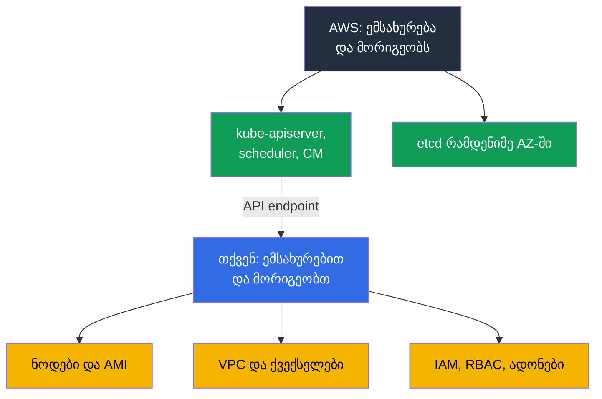
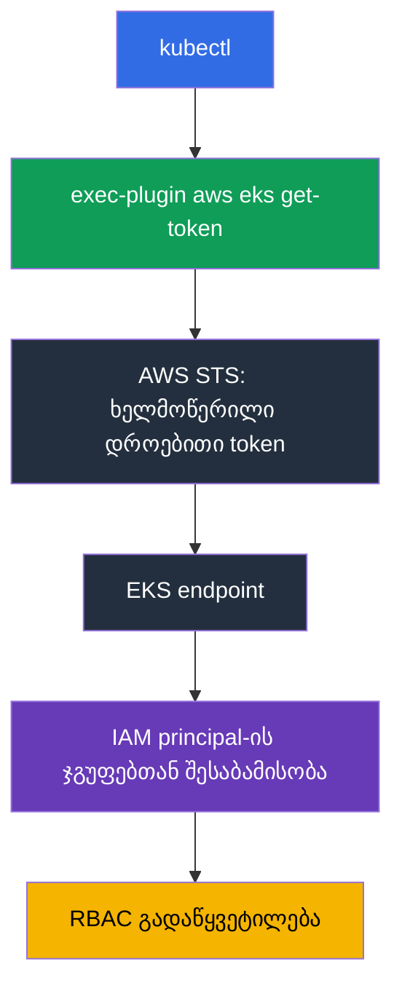
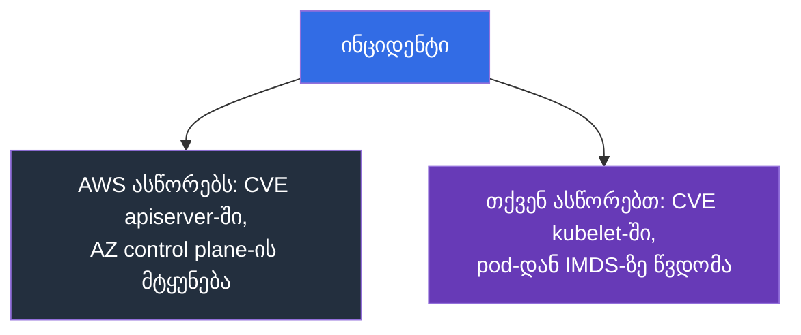

[Русская версия](ru.md) · [Eng version](en.md) · [Versión en español](es.md) · [Version française](fr.md) · [Deutsche Version](de.md) · [繁體中文版](tw.md) · [日本語版](jp.md)
# თავი 1. შესავალი: რას იღებს საკუთარ თავზე EKS და რა რჩება თქვენზე

> **რა გველოდება შემდეგ.** ნაწილმა 0 მოგცათ AWS-ის ლექსიკონი: ანგარიშები, IAM, VPC, EC2, ინსტრუმენტები. ახლა მთავარია, სად გადის ზღვარი „ამას AWS აკეთებს“ და „ამას თქვენ აკეთებთ“ შორის. kubeadm-ის შემდეგ ადვილია იფიქროთ, რომ EKS იგივე კლასტერია, უბრალოდ `kube-apiserver`-ს ვიღაც სხვა გადატვირთავს. სხვაობა უფრო ღრმაა: ქრება სამუშაოს ნაწილი, ქრება ჩვეული ინსტრუმენტების ნაწილიც და ჩნდება მტყუნების ახალი მიზეზები. მე-2 თავი control plane-ს დეტალურად განიხილავს, მე-3 თავი კი ვერსიებსა და განახლებებს.

## 1.1. რა პრობლემებია kubeadm-კლასტერში

გაიხსენეთ kubeadm-ით შექმნილი კლასტერის ექსპლუატაციის ჩვეულებრივი თვე. არა ავარიული, არამედ მშვიდი. დატვირთვებთან მუშაობის გარდა, რა ხდება მასში?

- სერტიფიკატებს ვადა გასდით: ერთი წელი გავიდა და `kubelet` ვეღარ უკავშირდება API-სერვერს. ვიღაცამ მანამდე, და არა შემდეგ, უნდა გაუშვას `kubeadm certs check-expiration`.
- საჭიროა etcd-ის სარეზერვო ასლის შექმნა და აღდგენის შემოწმება. snapshot, რომელიც არავის აღუდგენია, სარეზერვო ასლი არ არის. quorum-ის დაკარგვა ნიშნავს გაუმართავ კლასტერსა და ღამით მუშაობას.
- minor ვერსიის განახლება თითოეულ control plane ნოდზე ხელით შესასრულებელი მიმდევრობაა, მომსახურების ფანჯრითა და უკან დახევის გეგმით, რომელიც პრაქტიკაში „etcd-ს აღვადგენთ“-მდე დადის.
- OS-ის პატჩები და CVE control plane კომპონენტებშიც თქვენია: შეაგროვეთ, გაავრცელეთ, შეამოწმეთ. ეს ყველაფერი მტყუნების ზონებშიც უნდა გაანაწილოთ და აკონტროლოთ, რომ განაწილებული დარჩეს.

ბიზნესს ამას არაფერი მოაქვს: ეს Kubernetes-ის ფლობის გადასახადია.

**Amazon EKS** Kubernetes-ის მართული control plane-ია: AWS უშვებს და ემსახურება API-სერვერს, scheduler-ს, controller manager-სა და etcd-ს, თქვენ კი იღებთ endpoint-ს, რომელსაც თქვენი `kubectl` და ნოდები უკავშირდება. ეს იგივე upstream Kubernetes-ია იმავე API-ებითა და manifest-ებით. Kubernetes არ იცვლება, იცვლება ის, ვისაც მისი გულის მორიგეობა ეკისრება.



## 1.2. რას იღებს AWS საკუთარ თავზე და რას კარგავთ ამის სანაცვლოდ

პირველი, რასაც ახალი კლასტერის CKA-ის შემდეგ ინჟინერი აკეთებს, control plane-ის ძებნაა. `kubectl get pods -n kube-system` არც `kube-apiserver`-ს აჩვენებს და არც `etcd`-ს, ხოლო `kubectl get nodes` master-ნოდებს არ აჩვენებს. კლასტერი არ არის გაფუჭებული: control plane AWS-ის ანგარიშში ცხოვრობს, თქვენ არ გეკუთვნით და თქვენს VPC-ში არ არის.

AWS თქვენ ნაცვლად აკეთებს შემდეგს: API-სერვერს, scheduler-სა და controller manager-ს ხელმისაწვდომობის რამდენიმე ზონაში უშვებს, მასშტაბირებს და მტყუნებული instance-ებს ცვლის; etcd-ს ინახავს, ასარეზერვო ასლს ქმნის და აღადგენს; control plane კომპონენტებს პატჩავს, ხოლო patch-დონე აღინიშნება **platform version**-ით, რომელიც თქვენი მონაწილეობის გარეშე იზრდება; API-სერვერის ხელმისაწვდომობისთვის თვეში 99.95% SLA-ს იძლევა (ეს მომსახურების დონის სპეციფიკაციაა და არა ფასი); control plane ლოგებს CloudWatch-ში აგზავნის, თუ ისინი ჩართული გაქვთ (მე-2 თავი). სანაცვლოდ ზუსტად იმ ინსტრუმენტებს კარგავთ, რომლებსაც შეჩვეული ხართ:

| kubeadm-ის ჩვევა | როგორაა EKS-ში |
|-----------------|----------------|
| `etcdctl snapshot save` | etcd-ზე წვდომა არც ქსელით და არც exec-ით არ არსებობს; კლასტერის მდგომარეობის სარეზერვო ასლი სხვაგვარად იქმნება (თავი 41) |
| `/etc/kubernetes/manifests/kube-apiserver.yaml`-ის შეცვლა | control plane static pod-ები მიუწვდომელია, apiserver-ის flags არ რედაქტირდება |
| საკუთარი `--enable-admission-plugins` | plugin-ების ნაკრები AWS-ის მიერ არის დაფიქსირებული; თქვენი გაფართოების წერტილია webhooks და policies (თავი 22) |
| apiserver-ზე `--feature-gates` | მიუწვდომელია, feature gates ვერსიასთან ერთად მოდის |
| `kubeadm upgrade apply` | control plane-ის განახლება AWS API-ის გამოძახებაა, ერთ ჯერზე ერთი minor ვერსია (თავი 38) |
| კლასტერის სერტიფიკატების როტაცია | control plane სერტიფიკატებს AWS ემსახურება, თქვენი წვდომა IAM-ზეა აგებული (თავი 5) |
| `ssh` master-ზე და ლოგები დისკზე | control plane ლოგები მხოლოდ CloudWatch-ითაა ხელმისაწვდომი, თუ ჩართულია (თავი 2) |
| საკუთარი `kube-scheduler` პროფილებით | მეორე scheduler შესაძლებელია მხოლოდ როგორც თქვენი pod თქვენს ნოდებზე |

```bash
# რეგიონში არსებული კლასტერების სია
aws eks list-clusters --region eu-central-1

# Kubernetes ვერსია, control plane-ის patch-დონე, endpoint
aws eks describe-cluster --name demo \
  --query 'cluster.{version:version,platform:platformVersion,endpoint:endpoint}'

# იგივე ვერსია Kubernetes-ის თვალით
kubectl get --raw /version
```

## 1.3. რა რჩება თქვენზე

ყველაფერი, რაც მომხმარებლის მოთხოვნასა და მომუშავე pod-ს შორისაა, კვლავ თქვენია: მანქანები, მისამართები, უფლებები და ამის ანგარიში.

| სფერო | kubeadm | EKS | სად არის კურსში |
|-------|---------|-----|----------------|
| API-სერვერი, scheduler, controller manager, etcd | თქვენ | AWS | თავი 2 |
| control plane-ის პატჩები, platform version | თქვენ | AWS | თავები 2, 3 |
| minor ვერსიის არჩევა და მისი სიცოცხლის ვადა | თქვენ | თქვენ, მხარდაჭერილი ვერსიების ფარგლებში | თავი 3 |
| ნოდები: AMI, bootstrap, OS-ის პატჩები, განახლება, მასშტაბირება | თქვენ | თქვენ | თავები 10, 11, 12, 38 |
| CNI, მისამართების გეგმა, IP pod-ებისთვის | თქვენ | თქვენ | თავები 6, 7, 8 |
| ავთენტიკაცია, RBAC, მრავალმომხმარებლიანობა | თქვენ, სერტიფიკატები | თქვენ, IAM და access entries | თავები 5, 22 |
| ადონები: CoreDNS, kube-proxy, CSI, ვერსიები | თქვენ | თქვენ, managed addons გეხმარებათ | თავი 37 |
| დატვირთვის დამბალანსებლები, Ingress, DNS, TLS | თქვენ | თქვენ | თავები 26-29 |
| საცავი: StorageClass, ტომები, snapshot-ები | თქვენ | თქვენ | თავები 23, 24, 25 |
| სეკრეტები და მათი დაშიფვრა | თქვენ | თქვენ, KMS გეხმარებათ | თავი 18 |
| დაკვირვებადობა და ღირებულება | თქვენ | თქვენ | თავები 33-36, 43 |
| Kubernetes მდგომარეობისა და ტომების სარეზერვო ასლი | თქვენ | თქვენ, AWS Backup გეხმარებათ | თავები 41, 42 |

სურათი სამართლიანია: EKS მუშაობის ყველაზე საშიშ ნაწილს შლის, მაგრამ არა ყველაზე დიდს. დარჩენილი კიდევ უფრო გართულდა: ახლა ეს მხოლოდ Kubernetes კი არა, მის ქვემოთ არსებული AWS-იცაა.

## 1.4. რა იცვლება ინჟინრის ჩვევებში

ამ სიიდან თითოეული ჩვევა ერთ დაკარგულ საათად ღირს, თუ მის შესახებ ბრძოლისას გაიგებთ.

**წვდომა IAM-ით გაიცემა და არა სერტიფიკატით.** kubeadm-ში client cert-ს საკუთარი CA-ით აწერდით ხელს და kubeconfig-ს არიგებდით. EKS-ში kubeconfig არ შეიცავს ხანგრძლივად მოქმედ credentials-ს: ის იძახებს exec-plugin-ს `aws eks get-token`, რომელიც STS-დან დროებით token-ს იღებს, ხოლო კლასტერი IAM principal-ს RBAC ჯგუფებს **access entry**-ს (ან მოძველებული `aws-auth` ConfigMap-ის) მეშვეობით უსადაგებს. აქედან ტიპური სიმპტომი: kubeconfig სწორია, მაგრამ პასუხია `error: You must be logged in to the server`, რადგან კლასტერში role არ არის რეგისტრირებული (თავი 5).



**ნოდები ერთჯერადია.** ხელით გამოკეთებული instance node group-ის განახლებისას ან Karpenter-ის კონსოლიდაციისას შეიცვლება და შესწორებაც მასთან ერთად გაქრება. ნოდზე ცვლილება მხოლოდ launch template-ში, user data-ში ან AMI-ში ცხოვრობს (თავები 10 და 12). ამასთან, `ssh` მთავარ ინსტრუმენტად აღარ რჩება: production-ში ნოდებს ხშირად არც საჯარო მისამართი აქვთ და არც გასაღები, წვდომა SSM Session Manager-ით ხორციელდება, ხოლო გამართვა ნოდიდან ავტომატურად გასული ლოგებით კეთდება.

**გამართვა AWS API-ში გადადის.** სიმპტომი `kubectl`-ში ჩანს, მიზეზი AWS-შია: ნოდს არასწორი IAM role აქვს, ქვექსელში მისამართები ამოიწურა, vCPU კვოტა შეივსო, EBS ტომი სხვა AZ-შია, ქვექსელს საჭირო tag არ აქვს. ეს ზუსტად მე-0.1 თავის ორ-შრიანი დიაგრამაა. კლასტერის მდგომარეობის ნაწილი `kubectl`-ში საერთოდ არ ჩანს: endpoint კონფიგურაცია, control plane ლოგები, managed addon-ების ვერსიები, სეკრეტების დაშიფვრა, node group-ის მდგომარეობა AWS ობიექტებია, მათ `aws eks`-ით კითხულობენ და კოდით აღწერენ (თავი 4).

## 1.5. გაზიარებული პასუხისმგებლობა კონკრეტულად

ფორმულირება „AWS პასუხს აგებს ღრუბლის უსაფრთხოებაზე, თქვენ კი ღრუბელში უსაფრთხოებაზე“ მარკეტინგად ჟღერს, სანამ მას კონკრეტულ ინციდენტს არ მოარგებთ. ამის შემდეგ ერთ წუთში გასაგებია, ვინ უნდა გამოასწოროს. ქვემოთ მოცემული მატრიცა მოდელს სამ ზონად ყოფს: სრულად AWS-ის პასუხისმგებლობა, სრულად თქვენი და გაზიარებული, სადაც AWS მექანიზმს გაძლევთ, მაგრამ მას თქვენ აწყობთ.

| AWS ზონა (ღრუბლის უსაფრთხოება) | გაზიარებული ზონა | თქვენი ზონა (ღრუბელში უსაფრთხოება) |
|--------------------------------|------------------|-------------------------------------|
| control plane, etcd, hypervisor, ფიზიკური ინფრასტრუქტურა | IAM და RBAC, access entries | ნოდები, OS, AMI, kubelet, containerd |
| control plane-ის პატჩები, platform version | endpoint-ის წვდომის რეჟიმი | აპლიკაციები, requests/limits, NetworkPolicy |
| control plane-ის მრავალზონიანობა | სეკრეტების დაშიფვრა KMS-ით | მონაცემები ტომებში და მათი სარეზერვო ასლი |

გაზიარებული ზონა ინციდენტების უმეტესობის წყაროა: ინსტრუმენტი არსებობს, მაგრამ მისი კონფიგურაცია თქვენზეა. თვალსაჩინო მაგალითია Kubernetes API-ის მონაცემთა დაშიფვრა. etcd დისკებს AWS შიფრავს, ხოლო 1.28 და უფრო მაღალ ვერსიებზე envelope encryption KMS provider v2-ით ნაგულისხმევად მუშაობს, AWS-ის გასაღებით და თქვენი მონაწილეობის გარეშე. საკუთარი customer managed key ცვლის არა დაშიფვრის ფაქტს, არამედ მფლობელობას: key policy, CloudTrail-ში გაშიფვრის audit და გასაღებზე წვდომის გაუქმების შედეგები თქვენია, მაშინ როცა provider-ის `kube-apiserver`-ში ინტეგრაციას AWS აკეთებს და მის გამართვას ვერ შეძლებთ (თავი 18).



| სიტუაცია | ვისი | რა ხდება პრაქტიკაში |
|----------|------|---------------------|
| CVE `kube-apiserver`-ში | AWS | გამოდის ახალი platform version, control plane თქვენ გარეშე პატჩდება |
| CVE `kubelet`-ში, containerd-ში, ნოდის kernel-ში | თქვენ | ახალ AMI-ს ელით და ნოდების ჩანაცვლებას ავრცელებთ; ძველი ნოდები მოწყვლადია, სანამ ცოცხლობს (თავები 10, 38) |
| pod-დან IMDS-ის გავლით credentials-ის გაჟონვა | თქვენ | IMDSv2 და hop limit, ნოდის role-დან IRSA-ზე ან Pod Identity-ზე გადასვლა (თავები 16, 17, 19) |
| control plane instance-ით AZ-ის მტყუნება | AWS | API-სერვერი ხელმისაწვდომი რჩება; თქვენი საქმეა, რომ ნოდები ერთ ზონაში არ იყოს (თავი 40) |
| საჯარო endpoint მთელი ინტერნეტისთვისაა ღია | თქვენ | ეს თქვენი პარამეტრია: წვდომის რეჟიმი და `publicAccessCidrs` (თავი 2) |
| pod `hostPath`-ით `/`-ზე და root უფლებებით | თქვენ | Pod Security Admission და policies (თავები 19, 22) |

დასკვნა: control plane-ის მართვადობა უსაფრთხოებაზე სამუშაოს მოცულობას არ ამცირებს, ის მის ერთ ნაწილს ხსნის. ნოდებსა და თქვენს ანგარიშში ყველაფერი კვლავ თქვენია.

## 1.6. რას არ გააკეთებს EKS, მიუხედავად იმისა, რომ ხშირად ელიან

გუნდი მართულ სერვისზე გადადის და ფიქრობს, რომ „AWS მიხედავს“. მიხედავს, მაგრამ მხოლოდ control plane-ს. რაც არ მოხდება:

- **ნოდებს არ განაახლებს.** Managed node group-ს განახლების გავრცელება შეუძლია, მაგრამ ბრძანებას თქვენ აძლევთ. სამთვიანი AMI-ით ნოდი მუშაობს და საკუთარ თავზე არაფერს შეგატყობინებთ (თავი 38).
- **ადონებს არ განაახლებს.** managed addon-იც თქვენი გადაწყვეტილებით ახლდება და მისი ვერსია კლასტერის ყველა ვერსიასთან თავსებადი არაა (თავი 37).
- **მისამართების გეგმას არ დაგიგეგმავთ.** ქვექსელისთვის `/24` პირველი მასშტაბირებამდე ნორმალურად ჩანს: VPC CNI pod-ებს ქვექსელიდან მისამართებს აძლევს (თავები 6 და 7).
- **დატვირთვებს არ დაატიუნინგებს** და **NetworkPolicy-ს არ დაწერს.** Requests და limits, HPA, PDB, topology spread, pod-ების იზოლაცია თქვენია (თავები 14, 30, 35, 40).
- **Kubernetes-ის მდგომარეობას თავად არ დაასარეზერვოებს.** არც ობიექტებს, არც ტომებს: სარეზერვო ასლი უნდა გამართოთ, ხოლო აღდგენა ცალკე შეამოწმოთ (თავები 41 და 42).
- **თანხას არ დაგითვლით** და **წვდომის არქიტექტურას არ აირჩევს.** გუნდების მიხედვით აღრიცხვა tag-ებით ეწყობა, IRSA-ს თუ Pod Identity-ს არჩევას კი თქვენ აკეთებთ (თავები 5, 16, 17, 43).

ცალკე შენიშვნა **Auto Mode**-ზე: ეს არის რეჟიმი, რომელშიც AWS საკუთარ თავზე ნოდებს, საბაზისო ადონებსა და მათ განახლებებსაც იღებს. მის შიგნით მასშტაბირება Karpenter-ზე მუშაობს: instance-ები განუთავსებელი pod-ების requests-ისთვის შეირჩევა, მაგრამ controller-ს AWS მართავს და არა თქვენ, აქედან compute-შრის ოპერირების მოდელის განსხვავებაც (თავები 11 და 12). ის საზღვარს წევს, მაგრამ არ აუქმებს და საკუთარი კომპრომისები აქვს; განხილულია მე-9 თავში. მანამდე იგულისხმება კლასტერი, სადაც ნოდები თქვენია.

## 1.7. მართვადობის ფასი

ორი ვალუტით იხდით. ფული: control plane-სთვის **საათობრივი გადასახადი** გერიცხებათ, მიუხედავად იმისა, სამი ნოდი გაქვთ თუ სამასი. დიდი კლასტერისთვის ეს EC2-ის ფონზე ხმაურია, ათობით პატარა dev-კლასტერისთვის კი შესამჩნევი მუხლია, ამიტომ ტიპური გადაწყვეტილებაა ერთ კლასტერში namespace-ით იზოლაცია და არა თითოეულ გუნდზე ცალკე კლასტერი (თავები 22 და 43). როდესაც minor ვერსია extended support-ზე გადადის, ასეთი კლასტერის საათობრივი გადასახადი იზრდება, ეს სტიმულია დროულად განახლებისთვის და არა მოძველებული კლასტერების დაგროვებისთვის (თავი 38).

საათობრივი გადასახადი მართვადობის ერთადერთი მუხლი არაა. control plane ლოგები ნაგულისხმევად გამორთულია, ხოლო აქტიურ კლასტერზე ხუთივე კატეგორიის ერთდროულად ჩართვა მონაცემთა ნაკადს იძლევა, სადაც `audit` და `api` დანარჩენებზე საგრძნობლად დიდია. იხდით როგორც CloudWatch Logs-ში მიღებისთვის, ისე შენახვისთვის, ხოლო შენახვის ვადის გარეშე log group მონაცემებს უსასრულოდ აგროვებს, ხმაურიან კლასტერზე ეს მუხლი თავად control plane-ის ფასსაც გადააჭარბებს. ამიტომ retention იმავე მოქმედებით განისაზღვრება, რომლითაც ლოგები ირთვება (თავი 2), ხოლო მოცულობა, ფილტრები და archive თავებში 34 და 43 განიხილება.

თავისუფლება: control plane დახურულია და მასთან ერთად მისი პარამეტრებიც.

| შეზღუდვა | რას ნიშნავს ეს პრაქტიკაში |
|----------|---------------------------|
| apiserver-ის custom flags არ არის | შეუძლებელია flag-ის დამატება ან timeout-ების შეცვლა; ხელმისაწვდომია მხოლოდ ის, რაც EKS API-შია გატანილი |
| admission-plugin-ების ფიქსირებული ნაკრები | საკუთარი წესი validating ან mutating webhook-ად იწერება (თავი 22) |
| etcd-ზე წვდომა არ არის | არც `etcdctl`, არც საკუთარი პარამეტრები; სარეზერვო ასლი მხოლოდ მხარდაჭერილი მექანიზმებით (თავი 41) |
| მხოლოდ მხარდაჭერილი minor ვერსიები | ახალი ვერსია EKS-ში upstream release-ის დღეს არ ჩნდება, ძველი კი გრაფიკით გადის (თავი 3) |
| განახლებაზე ერთი minor ვერსია | ვერსიაზე გადახტომა შეუძლებელია, გეგმა ეტაპებად იგება (თავი 38) |
| Extended support | მოძველებული ვერსიისთვის გაზრდილი საათობრივი გადასახადი: გადადებაა და არა გამოსავალი (თავები 3, 38) |

განახლებამდე თავსებადობას ამოწმებენ და არა მხოლოდ კლასტერისთვის: ადონებს საკუთარი მატრიცები აქვთ.

```bash
# რა დგას ახლა კლასტერში
aws eks describe-cluster --name demo --query 'cluster.[version,platformVersion,status]'

# რომელი addon ვერსიებია ხელმისაწვდომი კლასტერის კონკრეტული ვერსიისთვის
aws eks describe-addon-versions --addon-name vpc-cni --kubernetes-version 1.33 \
  --query 'addons[].addonVersions[].addonVersion'
```

## 1.8. როდის არ გჭირდებათ EKS

კურსი EKS-ზეა, მაგრამ გულწრფელი პასუხი კითხვაზე „მჭირდება თუ არა ის“ ზოგჯერ უარყოფითია.

- **On-prem ან სხვა ღრუბელი.** არსებობს EKS Anywhere და EKS Hybrid Nodes, თუმცა ეს ცალკე პროდუქტებია საკუთარი მუშაობის მოდელით და არა „იგივე EKS შენთან“. აქვეა **მონაცემთა განთავსების მარეგულირებელი მოთხოვნები**, რომლებსაც ხელმისაწვდომი რეგიონები ვერ აკმაყოფილებს.
- **ლოკალური განვითარება და CI.** manifest-ებისა და chart-ების ტესტებისთვის kind ან minikube უფრო სწრაფი და უფასოა; ფასიანი კლასტერი საჭიროა იქ, სადაც AWS-თან ინტეგრაცია მოწმდება.
- **საკუთარი control plane გჭირდებათ.** custom apiserver flags, საკუთარი admission-plugin-ები, ეგზოტიკური feature gates, ეს EKS-ში არ არსებობს; EC2-ზე self-managed კლასტერი თავისი სრული ფასით კვლავ ვარიანტად რჩება.
- **ერთი აპლიკაცია Kubernetes-ის გარეშე.** ECS, Fargate, Lambda ან App Runner კლასტერის ოპერირებაზე იაფად დაფარავს ამოცანას.

## 1.9. როგორ იყენებენ ამას production-ში

- **პასუხისმგებლობის საზღვარს წერილობით აფიქსირებენ.** runbook-ში წერია: API-სერვერი მიუწვდომელია, AWS-ში ticket უნდა გაიხსნას; ნოდები `NotReady`-ა, თავად ვიკვლევთ. ეს ინციდენტის პირველ ოც წუთს ზოგავს. **ნოდებს სახარჯ მასალად მიიჩნევენ**: AMI-ის შეცვლა გრაფიკით ხდება და არა CVE-ის აღმოჩენისას; თვეებით მცხოვრები ნოდი ვალია (თავი 38).
- **კლასტერი და მისი გარემო კოდითაა აღწერილი.** endpoint კონფიგურაცია, control plane ლოგები, addon ვერსიები, node groups Terraform-ში ან eksctl-შია, კონსოლში შესწორებების გარეშე (თავი 4).
- **წვდომა მხოლოდ დროებითი IAM roles-ითაა.** kubeconfig-ში არავითარი ხანგრძლივი keys, ცალკე break-glass role გამოყენებაზე alert-ით (თავები 0.2 და 5).
- **ვერსიებს გეგმავენ.** სტანდარტული მხარდაჭერის დასასრულის თარიღი კალენდარშია, განახლება ჯერ dev-კლასტერზე გადის (თავი 3). სარეზერვო ასლიდან აღდგენას კვარტალში ერთხელ ტესტ-კლასტერზე ამოწმებენ და უბრალოდ გამართულად არ თვლიან (თავები 41 და 42).
- **ღირებულებას მეტრიკად აკვირდებიან.** კლასტერებისა და გუნდების მიხედვით დაყოფა, budgets alert-ებით, ტრაფიკისა და NAT-ის ზრდის ანალიზი (თავები 31 და 43).

## 1.10. მინი-გლოსარიუმი

- **Amazon EKS** AWS-ში მართული Kubernetes-ია: control plane-ს AWS ემსახურება, ნოდები და გარემო თქვენზეა. **Control plane** არის API-სერვერი, scheduler, controller manager და etcd; EKS-ში ისინი AWS-ის ანგარიშში, თქვენი VPC-ის გარეთ ცხოვრობენ და `kubectl get pods -n kube-system`-ში არ ჩანან. **Data plane** თქვენი ნოდები და მათზე გაშვებული ყველაფერია.
- **Platform version** Kubernetes minor ვერსიის შიგნით EKS control plane-ის patch-დონეა და თქვენი მონაწილეობის გარეშე იზრდება. **Cluster endpoint** API-სერვერის მისამართია: public, private ან ორივე (თავი 2).
- **Access entry** IAM principal-ის კლასტერის უფლებებთან მიბმაა, `aws-auth` ConfigMap-ის თანამედროვე შემცვლელი (თავი 5).
- **Managed node group** ნოდების ჯგუფია, რომლის lifecycle-ს EKS თქვენი ბრძანებით მართავს. **Auto Mode** რეჟიმია, სადაც AWS ნოდებსა და საბაზისო ადონებსაც იღებს საკუთარ თავზე (თავი 9). **Managed addon** addon-ია (VPC CNI, CoreDNS, kube-proxy, CSI), რომლის ვერსიასაც EKS თქვენი მოთხოვნით მართავს (თავი 37).
- **Shared responsibility** ნიშნავს, რომ AWS ღრუბლის უსაფრთხოებაზე პასუხობს, თქვენ კი ღრუბელში უსაფრთხოებაზე.

## 1.11. თავის შეჯამება

- EKS ექსპლუატაციის ყველაზე უსიამოვნო ნაწილს ხსნის: API-სერვერის, scheduler-ის, controller manager-ისა და etcd-ის მორიგეობას, მათ პატჩებსა და მრავალზონიანობას.
- სანაცვლოდ ინსტრუმენტები ქრება: არ გაქვთ წვდომა etcd-სა და `etcdctl`-ზე, control plane static pod-ებზე, apiserver flags-ის შეცვლაზე და საკუთარი admission-plugin-ების ნაკრებზე.
- დანარჩენი თქვენია: ნოდები და AMI, ქსელი და მისამართების გეგმა, IAM და RBAC, ადონები, საცავი, სეკრეტები, დაკვირვებადობა, სარეზერვო ასლი და ღირებულება. ჩვევები იცვლება: წვდომა სერტიფიკატის ნაცვლად IAM-ითაა, ნოდები ერთჯერადია, `ssh` მთავარი ინსტრუმენტი არაა, პრობლემის მიზეზი ხშირად AWS-შია.
- პასუხისმგებლობა კონკრეტულად იყოფა: CVE apiserver-ში AWS-ს ეკუთვნის, CVE kubelet-ში თქვენ; AZ control plane-ის მტყუნება AWS-ს ეკუთვნის, pod-ში ღია IMDS თქვენ.
- მართვადობის ფასი: საათობრივი გადასახადი, დახურული control plane პარამეტრები, მხარდაჭერილი ვერსიების ფარგლებში ყოფნა და განახლება ერთ ჯერზე ერთი minor ვერსიით. EKS უნივერსალური არაა: on-prem, რეგულატორული მოთხოვნები, ლოკალური განვითარება და custom control plane სხვა არჩევანის მიზეზია.

## 1.12. როგორ გამოგადგებათ ეს რეალურ სამუშაოში

EKS-ში ნებისმიერი ინციდენტის პირველი კითხვა ასეთია: საზღვრის ჩვენს მხარესაა თუ არა? პასუხი წყვეტს, გადახვალთ `kubectl`-სა და AWS API-ში თუ support-ში ticket-ს გახსნით. მეორე ეფექტი დაგეგმვაა: როცა ნათელია, რომ ნოდების განახლებას, addon ვერსიებსა და კლასტერის მდგომარეობის სარეზერვო ასლს ვერავინ გააკეთებს თქვენს ნაცვლად, ეს ამოცანები კალენდარში წინასწარ ხვდება და არ ჩნდება მაშინ, როცა ვერსია უკვე მხარდაჭერიდან გასულია. მესამეა საუბარი მენეჯმენტთან: „მართულ Kubernetes-ზე გადავედით“ არ ნიშნავს „სამუშაო ნაკლებია“, და 1.3 განყოფილების ცხრილი ამას სიტყვებზე უკეთ განმარტავს.

## 1.13. თვითშემოწმების კითხვები

1. Kubernetes-ის რომელ კომპონენტებს ემსახურება AWS EKS-ში და რატომ არ ჩანს ისინი `kubectl get pods`-ში?
2. რა არის platform version და რით განსხვავდება ის Kubernetes ვერსიისგან?
3. რატომ ვერ შეასრულებთ EKS-ში `etcdctl snapshot save`-ს და როგორ უნდა შეიქმნას მაშინ კლასტერის სარეზერვო ასლი?
4. გჭირდებათ `kube-apiserver` flag-ის შეცვლა. რა ვარიანტები გაქვთ EKS-ში?
5. როგორ გაიცემა EKS-ში კლასტერზე წვდომა და რატომ შეიძლება სწორ kubeconfig-მა არ იმუშაოს?
6. გამოვიდა CVE kubelet-ში და CVE apiserver-ში. რას აკეთებთ თქვენ თითოეულ შემთხვევაში?
7. ხელმისაწვდომობის ზონა მწყობრიდან გამოვიდა. რაზეა პასუხისმგებელი AWS და რაზე თქვენ?
8. რატომ ითვლება ნოდზე ხელით გაკეთებული შესწორება დაკარგულად?
9. რას არ გააკეთებს EKS თავად: ნოდების განახლებას, ადონების განახლებას, NetworkPolicy-ს, სარეზერვო ასლს?
10. როგორ მოქმედებს control plane-ის საათობრივი გადასახადი გუნდისთვის ცალკე კლასტერისა და namespace-ით იზოლირებული ერთი კლასტერის არჩევაზე?
11. რომელ შემთხვევებში ურჩევდით EKS-ის არ გამოყენებას?
12. pod `Pending`-შია, Kubernetes მოვლენები ცოტაა. `kubectl`-ის შემდეგ სად იხედებით?

## პრაქტიკა

ნაწილი 1-ის პრაქტიკა შემდეგი თავიდან იწყება. მანამდე სასარგებლოა ნებისმიერ ხელმისაწვდომ კლასტერზე `aws eks list-clusters` და `aws eks describe-cluster` გაუშვათ და გამოსავალში იპოვოთ ვერსია, platform version, endpoint და წვდომის რეჟიმი. მე-2 თავი ამ ველებს სათითაოდ განიხილავს.

---
[სარჩევი](../README_GE.md) · [ნაწილი 0](../00-1-aws/ge.md) · [თავი 2](../02/ge.md)
