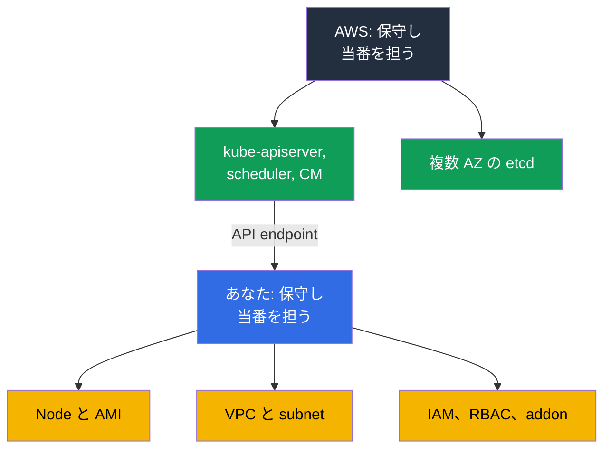
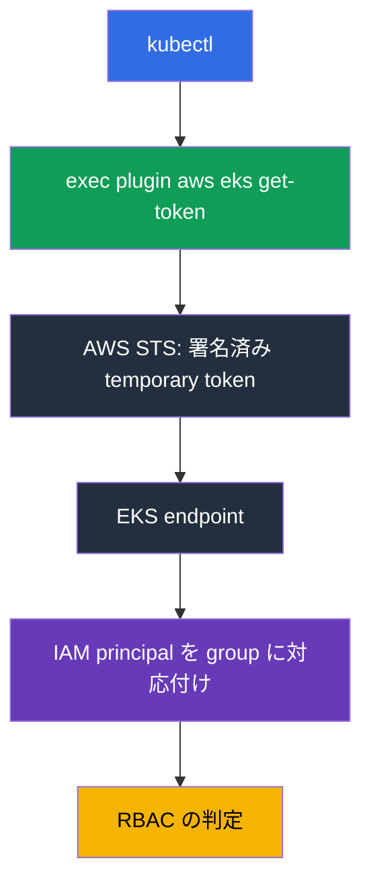
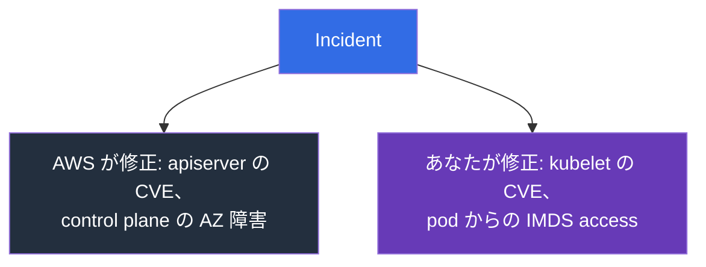

[ロシア語版](ru.md) · [英語版](en.md) · [スペイン語版](es.md) · [フランス語版](fr.md) · [ドイツ語版](de.md) · [ジョージア語版](ge.md) · [繁体字中国語版](tw.md)
# 第 1 章. はじめに: EKS が担うことと、あなたに残ること

> **この先の内容。** Part 0 で AWS の用語を扱いました: account、IAM、VPC、EC2、tool です。ここからが本題です。"AWS が行うこと" と "あなたが行うこと" の境界はどこにあるのでしょうか。kubeadm の後では、EKS は誰かが `kube-apiserver` を再起動するだけの同じ cluster だと思いがちです。違いはもっと深いものです。一部の作業と慣れた tool がなくなり、新しい障害原因が現れます。第 2 章では control plane を具体的に扱い、第 3 章では version と upgrade を扱います。

## 1.1. kubeadm cluster で大変なこと

kubeadm で構築した cluster を運用する、平常な一か月を思い出してください。障害月ではありません。workload の作業以外に、何が起きるでしょうか。

- certificate は期限切れになります。一年が経つと `kubelet` は API server と通信できなくなります。その前に、誰かが `kubeadm certs check-expiration` を実行しなければなりません。
- etcd は backup し、restore を検証する必要があります。誰も restore していない snapshot は backup ではありません。quorum を失えば cluster は使えず、一晩の作業になります。
- minor version の upgrade は、各 control plane node で行う手動の手順です。maintenance window と rollback plan が必要で、実際には "etcd を restore する" ことになりがちです。
- control plane component の OS patch と CVE もあなたの担当です。用意し、roll out し、確認します。さらに failure domain に分散されていることを維持しなければなりません。

これは business value を生みません。Kubernetes を持つための税金です。

**Amazon EKS** は managed Kubernetes control plane です。AWS が API server、scheduler、controller manager、etcd を実行、保守し、あなたは `kubectl` と node が接続する endpoint を得ます。同じ API と manifest を持つ upstream Kubernetes です。変わるのは Kubernetes ではなく、その中核を誰が当番として担うかです。



## 1.2. AWS が担うことと、その代わりに失うもの

CKA の後、新しい cluster で engineer が最初にすることは control plane を探すことです。`kubectl get pods -n kube-system` に `kube-apiserver` も `etcd` もなく、`kubectl get nodes` に master node もありません。cluster が壊れているわけではありません。control plane は AWS account にあり、あなたの所有物でも VPC 内のものでもありません。

AWS は API server、scheduler、controller manager を複数の Availability Zone で実行し、障害 instance を scale、交換します。etcd を保持、backup、restore し、control plane component を patch します。patch level は操作なしで上がる **platform version** として示されます。API server の可用性には月間 99.95% の SLA があります。これは料金ではなく service-level specification です。control plane log は有効化すれば CloudWatch に出力されます (第 2 章)。代わりに、慣れ親しんだ tool を失います。

| kubeadm での習慣 | EKS での方法 |
|---------------------|-----------|
| `etcdctl snapshot save` | network 経由でも exec 経由でも etcd へはアクセスできない。cluster state は別の方法で backup する (第 41 章) |
| `/etc/kubernetes/manifests/kube-apiserver.yaml` の編集 | control plane の static pod は利用できず、apiserver flag は編集できない |
| 独自の `--enable-admission-plugins` | plugin set は AWS が固定する。拡張点は webhook と policy (第 22 章) |
| apiserver の `--feature-gates` | 利用できない。feature gate は version とともに導入される |
| `kubeadm upgrade apply` | control plane upgrade は AWS API call であり、一度に一つの minor version だけ進める (第 38 章) |
| cluster certificate の rotation | AWS が control plane certificate を保守する。アクセスは IAM で構成する (第 5 章) |
| master への `ssh` と disk 上の log | control plane log は有効化時のみ CloudWatch から利用できる (第 2 章) |
| profile を持つ独自の `kube-scheduler` | 二つ目の scheduler は、自分の node 上の自分の pod としてのみ可能 |

```bash
# Region 内の cluster 一覧
aws eks list-clusters --region eu-central-1

# Kubernetes version、control plane patch level、endpoint
aws eks describe-cluster --name demo \
  --query 'cluster.{version:version,platform:platformVersion,endpoint:endpoint}'

# Kubernetes から見た同じ version
kubectl get --raw /version
```

## 1.3. あなたに残ること

user request と動作中の pod の間にあるものは、今もすべてあなたのものです。machine、address、permission、そしてその請求額です。

| 領域 | kubeadm | EKS | コース内の場所 |
|---------|---------|-----|-------------|
| API server、scheduler、controller manager、etcd | あなた | AWS | 第 2 章 |
| Control plane patch、platform version | あなた | AWS | 第 2、3 章 |
| minor version の選択と support 期間 | あなた | あなた、support 対象内で | 第 3 章 |
| Node: AMI、bootstrap、OS patch、upgrade、scale | あなた | あなた | 第 10、11、12、38 章 |
| CNI、address plan、pod の IP | あなた | あなた | 第 6、7、8 章 |
| 認証、RBAC、マルチテナンシー | あなた、certificate | あなた、IAM と access entry | 第 5、22 章 |
| Addon: CoreDNS、kube-proxy、CSI、version | あなた | あなた、managed addon が補助 | 第 37 章 |
| Load balancer、Ingress、DNS、TLS | あなた | あなた | 第 26-29 章 |
| Storage: StorageClass、volume、snapshot | あなた | あなた | 第 23、24、25 章 |
| Secret とその encryption | あなた | あなた、KMS が補助 | 第 18 章 |
| Observability と cost | あなた | あなた | 第 33-36、43 章 |
| Kubernetes state と volume の backup | あなた | あなた、AWS Backup が補助 | 第 41、42 章 |

現実は明確です。EKS は最も恐ろしい作業を取り除きますが、最も大きな作業を取り除くわけではありません。残るものはさらに複雑です。今や Kubernetes だけでなく、その下の AWS も扱う必要があります。

## 1.4. engineer の習慣で変わること

この一覧の各習慣は、実際の incident で初めて知ると一時間を失います。

**アクセスは certificate ではなく IAM で付与されます。** kubeadm では client cert に自分の CA で署名し、kubeconfig を配布しました。EKS の kubeconfig には長期 credential は入っていません。`aws eks get-token` の exec plugin を呼び、plugin は STS から temporary token を得ます。cluster は IAM principal を **access entry** (または古い `aws-auth` ConfigMap) を通じて RBAC group に対応付けます。そのため、kubeconfig は正しくても role が cluster に登録されておらず、`error: You must be logged in to the server` が返ることがあります (第 5 章)。



**Node は使い捨てです。** 手作業で直した instance は node group upgrade や Karpenter の consolidation で置き換えられ、変更も消えます。node 上の変更は launch template、user data、AMI にのみ置くべきです (第 10、12 章)。同時に `ssh` は主な tool ではなくなります。production の node には public address や key がないことが多く、access は SSM Session Manager 経由で、troubleshooting は node から自動的に送られる log を基にします。

**Troubleshooting は AWS API へ移ります。** 症状は `kubectl` に見えても、原因は AWS にあります。node の IAM role が違う、subnet の address が尽きた、vCPU quota が尽きた、EBS volume が別の AZ にある、subnet に必要な tag がない、などです。これは第 0.1 章の二層 diagram そのものです。endpoint configuration、control plane log、managed addon version、secret encryption、node group state は AWS object なので、`kubectl` にはまったく見えない cluster state もあります。それらは `aws eks` で読み、code で定義します (第 4 章)。

## 1.5. 具体的な shared responsibility

"AWS は cloud の security に責任を持ち、あなたは cloud 内の security に責任を持つ" という表現は、具体的な incident に当てはめるまで marketing のように聞こえます。しかし当てはめれば、一分で誰が直すべきかが分かります。次の matrix は、AWS だけの責任、あなた自身の責任、そして AWS が仕組みを提供してあなたが設定する共同領域の三つに分けます。

| AWS の領域 (cloud の security) | 共同領域 | あなたの領域 (cloud 内の security) |
|--------------------------------|-----------------|-----------------------------------|
| control plane、etcd、hypervisor、物理インフラストラクチャ | IAM と RBAC、access entry | node、OS、AMI、kubelet、containerd |
| control plane patch、platform version | エンドポイントアクセスモード | application、requests/limits、NetworkPolicy |
| control plane の multi-AZ 配置 | KMS による secret encryption | volume 内の data とその backup |

共同領域は多くの incident の原因です。tool は存在しても設定はあなたの担当だからです。代表例は Kubernetes API data の encryption です。AWS は etcd disk を暗号化します。version 1.28 以降では、KMS provider v2 による envelope encryption が AWS key でデフォルト動作し、あなたの操作は不要です。独自の customer managed key は暗号化の有無ではなく所有権を変えます。key policy、CloudTrail における decrypt の audit、key access を取り消す影響はあなたの責任です。一方、AWS は provider を `kube-apiserver` に統合しており、その統合は設定できません (第 18 章)。



| 状況 | 担当 | 実際に起きること |
|----------|-----|----------------------------|
| `kube-apiserver` の CVE | AWS | 新しい platform version が出て、control plane はあなたなしで patch される |
| `kubelet`、containerd、node kernel の CVE | あなた | 新しい AMI を待ち、node を置き換える。古い node は生きている間脆弱なまま (第 10、38 章) |
| pod から IMDS 経由で credential が漏洩 | あなた | IMDSv2 と hop limit を使い、node role から IRSA または Pod Identity へ移行する (第 16、17、19 章) |
| control plane instance がある AZ の障害 | AWS | API server は利用可能なまま。node が一つの AZ に偏らないようにするのはあなたの仕事 (第 40 章) |
| public endpoint を Internet 全体に公開 | あなた | access mode と `publicAccessCidrs` はあなたの設定 (第 2 章) |
| `/` の `hostPath` と root 権限を持つ pod | あなた | Pod Security Admission と policy を使う (第 19、22 章) |

結論として、control plane の管理を委ねても security 作業の量は減りません。その一部が取り除かれるだけです。node 上と自分の account 内にあるものはすべて、依然としてあなたの担当です。

## 1.6. よく期待されるが EKS がしないこと

team が managed service へ移行すると、"AWS が見てくれる" と考えがちです。見てくれるのは control plane だけです。次のことは起きません。

- **Node を update しません。** Managed node group は upgrade を roll out できますが、command を出すのはあなたです。三か月前の AMI を持つ node も動き続け、自分から報告はしません (第 38 章)。
- **Addon を update しません。** managed addon であっても update はあなたの判断であり、その version はすべての cluster version と互換ではありません (第 37 章)。
- **Address plan を設計しません。** subnet ごとの `/24` は最初の scale まで正常に見えます。VPC CNI は subnet から pod に address を割り当てます (第 6、7 章)。
- **Workload を tune せず**、**NetworkPolicy も書きません。** Requests と limits、HPA、PDB、topology spread、pod isolation はあなたのものです (第 14、30、35、40 章)。
- **Kubernetes state を自動で backup しません。** object も volume も対象外です。backup は設定し、restore は別途検証します (第 41、42 章)。
- **Cost を計算せず**、**access architecture も選びません。** team ごとの配賦は tag で構成し、IRSA と Pod Identity はあなたが選びます (第 5、16、17、43 章)。

**Auto Mode** について補足します。これは AWS が node、基本 addon、その update も担う mode です。内部の scaling は Karpenter によって動作します。未配置 pod の requests に合わせて instance を選びますが、controller を管理するのはあなたではなく AWS です。そのため compute layer の運用 model は異なります (第 11、12 章)。これは境界を移動させますが、取り除くわけではなく、独自の trade-off があります。第 9 章で扱います。それまでは node が自分のものである cluster を前提にします。

## 1.7. 管理されることのコスト

支払う通貨は二つです。第一は money です。node が三台でも三百台でも、control plane には **時間単位の料金** がかかります。大きな cluster では EC2 に比べれば小さくても、小さな development cluster が十個あれば目立つ費目になります。そのため、team ごとに cluster を作るのではなく、namespace isolation を持つ一つの cluster にする判断がよくあります (第 22、43 章)。minor version が extended support に入ると、その cluster の時間料金は上がります。古い cluster をためず期限内に upgrade するための構造的な動機です (第 38 章)。

時間料金だけが managed service の費目ではありません。control plane log はデフォルトで無効です。active cluster で五カテゴリすべてを同時に有効化すると、`audit` と `api` が他より大きい data stream になります。CloudWatch Logs では ingestion と storage の両方に支払い、retention を設定しない log group は data を無期限に蓄積します。log の多い cluster ではこの費目が control plane 料金を上回ることもあります。したがって log を有効化する時に retention を設定します (第 2 章)。volume、filter、archive は第 34、43 章で扱います。

第二は自由です。control plane は閉じており、その設定も閉じています。

| 制限 | 実際の意味 |
|-------------|----------------------------|
| custom apiserver flag なし | flag の追加や timeout の変更はできない。EKS API に公開されたものだけを使える |
| 固定された admission plugin set | 独自 rule は validating または mutating webhook として実装する (第 22 章) |
| etcd への access なし | `etcdctl` も独自設定も使えない。backup は support される mechanism のみ (第 41 章) |
| support 対象の minor version のみ | 新 version は upstream release 当日に EKS に現れず、古い version は schedule に従って消える (第 3 章) |
| upgrade ごとに minor version 一つ | version を飛ばすことはできない。plan は段階的に作る (第 38 章) |
| Extended support | 古い version に対する高い時間料金。解決ではなく延期 (第 3、38 章) |

upgrade 前に compatibility を確認します。cluster だけでなく addon にも独自の matrix があります。

```bash
# 現在 cluster にあるもの
aws eks describe-cluster --name demo --query 'cluster.[version,platformVersion,status]'

# 特定 cluster version で利用可能な addon version
aws eks describe-addon-versions --addon-name vpc-cni --kubernetes-version 1.33 \
  --query 'addons[].addonVersions[].addonVersion'
```

## 1.8. EKS が不要なとき

このコースは EKS を扱いますが、"必要か" という問いへの正直な答えが no になることもあります。

- **On-premises または別の cloud。** EKS Anywhere と EKS Hybrid Nodes はありますが、これらは独自の運用 model を持つ別 product であり、"自分の環境にある同じ EKS" ではありません。利用可能な Region で満たせない **data placement の規制要件** もここに含まれます。
- **Local development と CI。** manifest や chart の test には kind や minikube の方が速く無料です。有料 cluster が必要なのは AWS integration を test する場所です。
- **独自の control plane が必要。** custom apiserver flag、独自 admission plugin、特殊な feature gate は EKS にはありません。EC2 上の self-managed cluster は、すべてのコストを伴う選択肢として残ります。
- **Kubernetes を使わない一つの application。** ECS、Fargate、Lambda、App Runner は、運用が必要な cluster より安く課題を解決できます。

## 1.9. production での適用方法

- **責任境界を文書化します。** runbook には次のように書きます。API server が利用不能なら AWS に ticket を出し、node が `NotReady` なら自分たちで調べます。これで incident 最初の二十分を節約できます。**Node は消耗品として扱います。** AMI の置換は CVE 発生時ではなく schedule に入れます。何か月も生きる node は負債です (第 38 章)。
- **Cluster と周辺 infrastructure は code で記述します。** endpoint configuration、control plane log、addon version、node group を Terraform または eksctl に置き、console では編集しません (第 4 章)。
- **アクセスは一時的な IAM role 経由だけにします。** kubeconfig に長期 key を置かず、使用時に alert が出る専用 break-glass role を用意します (第 0.2、5 章)。
- **Version を計画します。** standard support 終了日は calendar に入れ、upgrade はまず development cluster で行います (第 3 章)。backup からの restore は設定済みと見なすだけでなく、test cluster で四半期ごとに検証します (第 41、42 章)。
- **Cost を metric として見ます。** cluster と team 別の内訳、alarm 付き budget、traffic と NAT の増加を確認します (第 31、43 章)。

## 1.10. ミニ用語集

- **Amazon EKS** は AWS の managed Kubernetes です。control plane は AWS が保守し、node と周辺 infrastructure はあなたのものです。**Control plane** は API server、scheduler、controller manager、etcd であり、EKS では AWS account 内、VPC の外にあり、`kubectl get pods -n kube-system` には見えません。**Data plane** はあなたの node と、その上で動くすべてです。
- **プラットフォームバージョン** は Kubernetes minor version 内の EKS control plane patch level で、あなたの操作なしに上がります。**Cluster endpoint** は API server の address で、public、private、または両方です (第 2 章)。
- **Access entry** は IAM principal を cluster 内の permission に対応付けるもので、`aws-auth` ConfigMap の現在の代替です (第 5 章)。
- **Managed node group** は、あなたの command により EKS が lifecycle を管理する node group です。**Auto Mode** は AWS が node と基本 addon も担う mode です (第 9 章)。**Managed addon** は EKS があなたの要求に応じて version を管理する addon (VPC CNI、CoreDNS、kube-proxy、CSI) です (第 37 章)。
- **Shared responsibility** は、AWS が cloud の security に、あなたが cloud 内の security に責任を持つことです。

## 1.11. この章のまとめ

- EKS は運用で最も厄介な部分を取り除きます。API server、scheduler、controller manager、etcd の当番、それらの patch、multi-AZ 配置です。
- 代わりに tool がなくなります。etcd と `etcdctl` への access、control plane の static pod、apiserver flag の編集、独自 admission plugin set は使えません。
- そのほかはあなたの担当です。node と AMI、network と address plan、IAM と RBAC、addon、storage、secret、observability、backup、cost です。習慣も変わります。certificate ではなく IAM による access、使い捨ての node、主な tool ではない `ssh`、そして原因が AWS にあることが多い点です。
- 責任は具体的に分かれます。apiserver の CVE は AWS、kubelet の CVE はあなたです。control plane の AZ 障害は AWS、pod から開かれた IMDS はあなたの担当です。
- 管理されることのコストは、時間料金、閉じた control plane 設定、support 対象 version に限られること、一度に一つの minor version だけ upgrade できることです。EKS は万能ではありません。on-premises、規制要件、local development、custom control plane は別の選択肢を選ぶ理由になります。

## 1.12. 実際の業務で役立つ点

EKS の incident で最初に問うべきことは、それが責任境界のこちら側かどうかです。答えにより、`kubectl` と AWS API を調べるか、support ticket を出すかが決まります。次の効果は計画です。node upgrade、addon version の管理、cluster state の backup を誰も代わりにしないと分かれば、version が support 外になってからではなく、事前に calendar へ入れられます。三つ目は management との会話です。"managed Kubernetes に移行した" は "作業が減った" という意味ではなく、section 1.3 の table はそれを言葉よりよく示します。

## 1.13. 自己確認の質問

1. EKS で AWS が保守する Kubernetes component は何ですか。また、なぜ `kubectl get pods` にないのですか。
2. platform version とは何で、Kubernetes version とどう違いますか。
3. EKS で `etcdctl snapshot save` を実行できない理由と、代わりの cluster backup 方法は何ですか。
4. `kube-apiserver` の flag を変更する必要があります。EKS ではどのような選択肢がありますか。
5. EKS では cluster access をどう付与し、正しい kubeconfig でもなぜ動かないことがありますか。
6. kubelet と apiserver の CVE が公開されました。それぞれであなたは何をしますか。
7. Availability Zone が障害になりました。AWS とあなたはそれぞれ何に責任を持ちますか。
8. node に手作業で加えた変更が失われたと見なされるのはなぜですか。
9. EKS が自動でしないことは何ですか。node upgrade、addon upgrade、NetworkPolicy、backup について答えてください。
10. control plane の時間料金は、team ごとの cluster と namespace isolation を持つ一つの cluster の選択にどう影響しますか。
11. EKS を使わない方がよいのはどのような場合ですか。
12. pod が `Pending` で Kubernetes event が少ないとき、`kubectl` の後にどこを見ますか。

## 演習

Part 1 の演習は次の章から始まります。まずは access できる任意の cluster で `aws eks list-clusters` と `aws eks describe-cluster` を実行し、output 内の version、platform version、endpoint、access mode を探すとよいでしょう。第 2 章でこれらの field を一つずつ説明します。

---
[目次](../README_JP.md) · [Part 0](../00-1-aws/jp.md) · [第 2 章](../02/jp.md)
