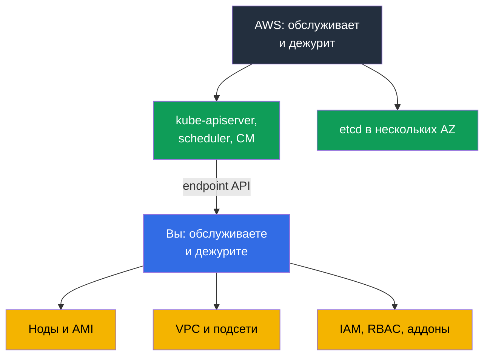
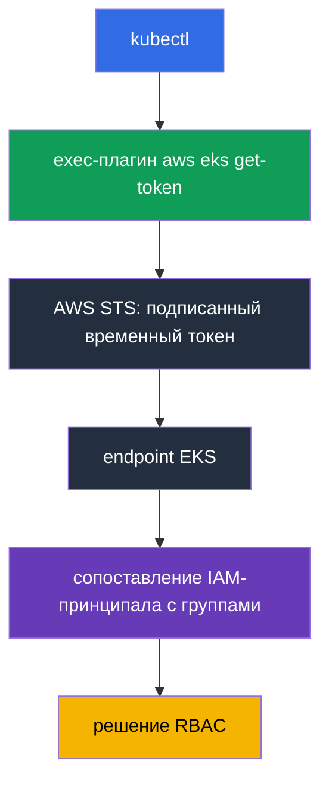
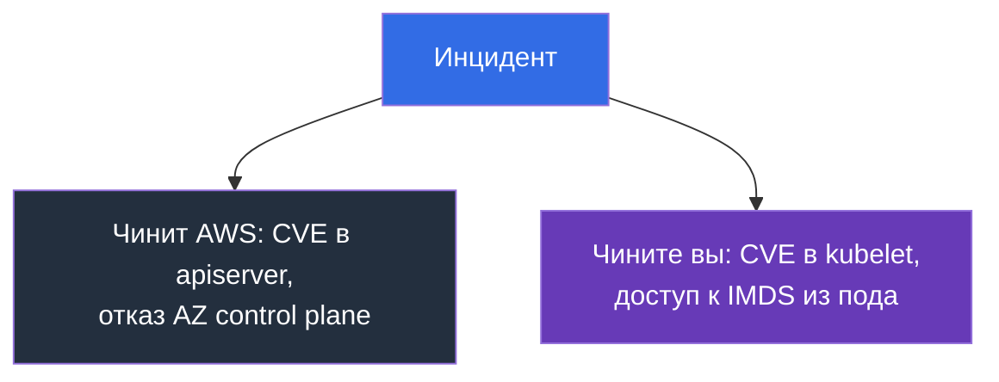

# Глава 1. Введение: что берёт на себя EKS и что остаётся на вас

> **Что дальше.** Часть 0 дала словарь AWS: аккаунты, IAM, VPC, EC2, инструменты. Теперь
> главное: где проходит граница между «это делает AWS» и «это делаете вы». После kubeadm есть
> соблазн думать, что EKS - тот же кластер, только `kube-apiserver` перезапускает кто-то
> другой. Разница глубже: исчезает часть работы, исчезает часть привычных инструментов и
> появляются новые причины отказов. Глава 2 разбирает control plane предметно, глава 3 -
> версии и обновления.

## 1.1. Что болит в kubeadm-кластере

Вспомните обычный месяц эксплуатации кластера, поднятого через kubeadm. Не аварийный, а
спокойный. Что в нём происходит помимо работы с нагрузками?

- Истекают сертификаты: год, и `kubelet` не может поговорить с API-сервером. Кто-то должен
  запустить `kubeadm certs check-expiration` до этого, а не после.
- etcd надо бэкапить и проверять восстановление. Снапшот, который никто не восстанавливал,
  бэкапом не является. Потеря кворума означает нерабочий кластер и ночь работы.
- Апгрейд минорной версии - ручная последовательность на каждом control plane узле, с окном
  обслуживания и планом отхода, который на практике сводится к «восстановим etcd».
- Патчи ОС и CVE в компонентах control plane тоже ваши: собрать, раскатить, проверить. И всё
  это надо разложить по зонам отказа и следить, чтобы оно осталось разложенным.

Бизнесу это не приносит ничего: налог за право иметь Kubernetes.

**Amazon EKS** - управляемый control plane Kubernetes: AWS запускает и обслуживает
API-сервер, scheduler, controller manager и etcd, а вы получаете endpoint, к которому
подключаются ваш `kubectl` и ваши ноды. Это тот же upstream Kubernetes с теми же API и
манифестами. Меняется не Kubernetes, а то, кто несёт дежурство за его сердце.



## 1.2. Что берёт на себя AWS и чего вы за это лишаетесь

Первое, что делает инженер после CKA на новом кластере: ищет control plane. `kubectl get
pods -n kube-system` не показывает ни `kube-apiserver`, ни `etcd`, а `kubectl get nodes` не
показывает master-узлов. Кластер не сломан: control plane живёт в аккаунте AWS, вам он не
принадлежит, и в вашем VPC его нет.

Что AWS делает за вас: запускает API-сервер, scheduler и controller manager в нескольких
зонах доступности, масштабирует и заменяет отказавшие экземпляры; держит, бэкапит и
восстанавливает etcd; патчит компоненты control plane, и patch-уровень обозначен
**platform version**, которая растёт без вашего участия; даёт SLA 99.95% в месяц на
доступность API-сервера (это спецификация уровня обслуживания, не цена); отдаёт логи control
plane в CloudWatch, если вы их включили (глава 2). Взамен вы лишаетесь
ровно тех инструментов, к которым привыкли:

| Привычка из kubeadm | Как в EKS |
|---------------------|-----------|
| `etcdctl snapshot save` | доступа к etcd нет ни по сети, ни через exec; состояние кластера бэкапится иначе (глава 41) |
| правка `/etc/kubernetes/manifests/kube-apiserver.yaml` | static pods control plane недоступны, флаги apiserver не редактируются |
| свой `--enable-admission-plugins` | набор плагинов фиксирован AWS; ваша точка расширения - webhooks и политики (глава 22) |
| `--feature-gates` на apiserver | недоступны, feature gates приходят вместе с версией |
| `kubeadm upgrade apply` | обновление control plane - вызов API AWS, одна минорная версия за раз (глава 38) |
| ротация сертификатов кластера | сертификаты control plane обслуживает AWS, ваш доступ строится на IAM (глава 5) |
| `ssh` на master и логи на диске | логи control plane только через CloudWatch, если включены (глава 2) |
| свой `kube-scheduler` с профилями | второй scheduler возможен только как ваш под на ваших нодах |

```bash
# Список кластеров в регионе
aws eks list-clusters --region eu-central-1

# Версия Kubernetes, patch-уровень control plane, endpoint
aws eks describe-cluster --name demo \
  --query 'cluster.{version:version,platform:platformVersion,endpoint:endpoint}'

# Та же версия глазами Kubernetes
kubectl get --raw /version
```

## 1.3. Что остаётся на вас

Всё, что стоит между запросом пользователя и работающим подом, по-прежнему ваше: машины,
адреса, права и счёт за это.

| Область | kubeadm | EKS | Где в курсе |
|---------|---------|-----|-------------|
| API-сервер, scheduler, controller manager, etcd | вы | AWS | глава 2 |
| Патчи control plane, platform version | вы | AWS | главы 2, 3 |
| Выбор минорной версии и срок её жизни | вы | вы, в рамках поддерживаемых | глава 3 |
| Ноды: AMI, bootstrap, патчи ОС, обновление, масштаб | вы | вы | главы 10, 11, 12, 38 |
| CNI, адресный план, IP для подов | вы | вы | главы 6, 7, 8 |
| Аутентификация, RBAC, мультитенантность | вы, сертификаты | вы, IAM и access entries | главы 5, 22 |
| Аддоны: CoreDNS, kube-proxy, CSI, версии | вы | вы, managed addons помогают | глава 37 |
| Балансировщики, Ingress, DNS, TLS | вы | вы | главы 26-29 |
| Хранилище: StorageClass, тома, снапшоты | вы | вы | главы 23, 24, 25 |
| Секреты и их шифрование | вы | вы, KMS помогает | глава 18 |
| Наблюдаемость и стоимость | вы | вы | главы 33-36, 43 |
| Бэкап состояния Kubernetes и томов | вы | вы, AWS Backup помогает | главы 41, 42 |

Картина честная: EKS убирает самую страшную часть работы, но не самую большую. Оставшееся к
тому же стало сложнее: это теперь не только Kubernetes, но и AWS под ним.

## 1.4. Что меняется в привычках инженера

Каждая привычка из этого списка стоит одного потерянного часа, если узнать о ней в бою.

**Доступ выдаётся через IAM, а не сертификатом.** В kubeadm вы подписывали client cert своим
CA и раздавали kubeconfig. В EKS kubeconfig не содержит долгоживущих кредов: он вызывает
exec-плагин `aws eks get-token`, тот берёт временный токен в STS, а кластер сопоставляет
IAM-принципал с группами RBAC через **access entry** (или устаревшую `aws-auth` ConfigMap).
Отсюда типовой симптом: kubeconfig верный, а в ответ `error: You must be logged in to the
server`, потому что роль в кластере не зарегистрирована (глава 5).



**Ноды одноразовые.** Инстанс, вылеченный руками, будет заменён при обновлении node group
или консолидации Karpenter, и правка исчезнет вместе с ним. Изменение на ноде живёт только в
launch template, user data или AMI (главы 10 и 12). `ssh` при этом перестаёт быть основным
инструментом: в проде ноды часто без публичного адреса и без ключа, доступ идёт через SSM
Session Manager, а отладка строится на логах, которые уходят с ноды сами.

**Отладка уходит в AWS API.** Симптом виден в `kubectl`, причина лежит в AWS: не та IAM-роль
у ноды, кончились адреса в подсети, исчерпана квота на vCPU, том EBS в другой AZ, у подсети
нет нужного тега. Это ровно диаграмма двух слоёв из главы 0.1. Часть состояния кластера в
`kubectl` не видна вообще: конфигурация endpoint, логи control plane, версии managed addons,
шифрование секретов, состояние node group - объекты AWS, их читают через `aws eks`, а
описывают кодом (глава 4).

## 1.5. Разделённая ответственность предметно

Формулировка «AWS отвечает за безопасность облака, вы - за безопасность в облаке» звучит как
маркетинг, пока не приложить её к конкретному инциденту. Тогда по ней за минуту понятно,
кому чинить. Матрица ниже раскладывает модель на три зоны: чистая ответственность AWS,
чистая ваша и совместная, где AWS даёт механизм, а настраиваете его вы.

| Зона AWS (безопасность облака) | Совместная зона | Зона ваша (безопасность в облаке) |
|--------------------------------|-----------------|-----------------------------------|
| control plane, etcd, гипервизор, физика | IAM и RBAC, access entries | ноды, ОС, AMI, kubelet, containerd |
| патчи control plane, platform version | режим доступа к endpoint | приложения, requests/limits, NetworkPolicy |
| мультизональность control plane | шифрование секретов через KMS | данные в томах и их бэкап |

Совместная зона - источник большинства инцидентов: инструмент есть, но настройка на вас.
Показательный пример - шифрование данных Kubernetes API. Диски etcd шифрует AWS, а на версиях
1.28 и выше envelope encryption через KMS provider v2 работает по умолчанию, ключом AWS, без
вашего участия. Свой customer managed key меняет не факт шифрования, а владение: политика
ключа, аудит расшифровок в CloudTrail и последствия отзыва доступа к ключу - ваши, тогда как
интеграцию провайдера в `kube-apiserver` делает AWS, и настраивать её вы не можете (глава 18).



| Ситуация | Чья | Что происходит на практике |
|----------|-----|----------------------------|
| CVE в `kube-apiserver` | AWS | выходит новая platform version, control plane патчится без вас |
| CVE в `kubelet`, containerd, ядре ноды | вы | ждёте новую AMI и катите замену нод; старые ноды уязвимы, пока живут (главы 10, 38) |
| Утечка кредов через IMDS из пода | вы | IMDSv2 и hop limit, уход от роли ноды к IRSA или Pod Identity (главы 16, 17, 19) |
| Отказ AZ с экземпляром control plane | AWS | API-сервер остаётся доступен; ваше дело - чтобы ноды были не в одной зоне (глава 40) |
| Публичный endpoint открыт всему интернету | вы | это ваша настройка: режим доступа и `publicAccessCidrs` (глава 2) |
| Под с `hostPath` на `/` и правами root | вы | Pod Security Admission и политики (главы 19, 22) |

Вывод: управляемость control plane не уменьшает объём работы по безопасности, она снимает
одну её часть. Всё на нодах и в вашем аккаунте остаётся вашим.

## 1.6. Чего EKS не сделает, хотя от него часто ждут

Команда переезжает на управляемый сервис и считает, что «AWS присмотрит». Присмотрит, но
только за control plane. Чего не будет:

- **Не обновит ноды.** Managed node group умеет катить обновление, но команду даёте вы. Нода
  с трёхмесячной AMI работает и о себе не сообщит (глава 38).
- **Не обновит аддоны.** Даже managed addon обновляется по вашему решению, а его версия
  совместима не со всеми версиями кластера (глава 37).
- **Не спланирует адресный план.** `/24` на подсеть выглядит нормально до первого
  масштабирования: VPC CNI выдаёт подам адреса из подсети (главы 6 и 7).
- **Не оттюнит нагрузки** и **не напишет NetworkPolicy.** Requests и limits, HPA, PDB,
  topology spread, изоляция подов - ваши (главы 14, 30, 35, 40).
- **Не забэкапит состояние Kubernetes сам.** Ни объекты, ни тома: бэкап настраивается, а
  восстановление проверяется отдельно (главы 41 и 42).
- **Не посчитает деньги** и **не выберет архитектуру доступа.** Учёт по командам строится на
  тегах, а IRSA или Pod Identity выбираете вы (главы 5, 16, 17, 43).

Отдельная оговорка про **Auto Mode**: это режим, в котором AWS берёт на себя ещё и ноды,
базовые аддоны и их обновления. Масштабирование внутри него работает на Karpenter: инстансы
подбираются под requests неразмещённых подов, но контроллер администрирует AWS, а не вы -
отсюда и разница в модели эксплуатации compute-слоя (главы 11 и 12). Он сдвигает границу, но
не убирает её и стоит своих компромиссов; разбираем в главе 9. До тех пор подразумевается
кластер, где ноды ваши.

## 1.7. Цена управляемости

Платите вы двумя валютами. Деньги: за control plane берётся **почасовая плата**, независимо
от того, три у вас ноды или триста. Для крупного кластера это шум на фоне EC2, для десятка
мелких dev-кластеров заметная строка, и отсюда типовое решение - один кластер с изоляцией по
namespace вместо кластера на каждую команду (главы 22 и 43). Когда минорная версия уходит на
extended support, почасовая плата за такой кластер повышается - это структурный стимул
обновляться в срок, а не копить устаревшие кластеры (глава 38).

Почасовая плата при этом не единственная строка, которую приносит управляемость. Логи control
plane выключены по умолчанию, и включение всех пяти категорий сразу на активном кластере даёт
поток данных, где `audit` и `api` заметно объёмнее остальных. Платите и за приём, и за
хранение в CloudWatch Logs, а log group без выставленного срока хранения копит данные
бесконечно - на болтливом кластере эта строка способна перерасти саму плату за control plane.
Поэтому retention задают тем же движением, которым включают логи (глава 2), а объём, фильтры
и архив разбираются в главах 34 и 43.

Свобода: control plane закрыт, а вместе с ним закрыты его настройки.

| Ограничение | Что это значит на практике |
|-------------|----------------------------|
| Нет кастомных флагов apiserver | нельзя добавить флаг или поменять таймауты; доступно только то, что вынесено в API EKS |
| Фиксированный набор admission-плагинов | своё правило пишется как validating или mutating webhook (глава 22) |
| Нет доступа к etcd | ни `etcdctl`, ни своих настроек; бэкап только поддерживаемыми механизмами (глава 41) |
| Только поддерживаемые минорные версии | новая версия появляется в EKS не в день релиза upstream, старая уходит по расписанию (глава 3) |
| Одна минорная версия за обновление | прыжок через версию невозможен, план строится по шагам (глава 38) |
| Extended support | повышенная почасовая плата за устаревшую версию: отсрочка, а не решение (главы 3, 38) |

Совместимость проверяют до обновления, и не только для кластера: у аддонов свои матрицы.

```bash
# Что стоит в кластере сейчас
aws eks describe-cluster --name demo --query 'cluster.[version,platformVersion,status]'

# Какие версии аддона доступны для конкретной версии кластера
aws eks describe-addon-versions --addon-name vpc-cni --kubernetes-version 1.33 \
  --query 'addons[].addonVersions[].addonVersion'
```

## 1.8. Когда EKS не нужен

Курс про EKS, но честный ответ на вопрос «нужен ли он» иногда отрицательный.

- **On-prem или другое облако.** Есть EKS Anywhere и EKS Hybrid Nodes, но это отдельные
  продукты со своей моделью работы, а не «тот же EKS у себя». Сюда же **регуляторные
  требования к размещению данных**, которые не закрываются доступными регионами.
- **Локальная разработка и CI.** Для манифестов и тестов чартов kind или minikube быстрее и
  бесплатны; платный кластер нужен там, где проверяется интеграция с AWS.
- **Нужен свой control plane.** Кастомные флаги apiserver, свои admission-плагины,
  экзотические feature gates - этого в EKS нет; self-managed кластер на EC2 остаётся
  вариантом со всей его ценой.
- **Одно приложение без Kubernetes.** ECS, Fargate, Lambda или App Runner закроют задачу
  дешевле кластера, который надо эксплуатировать.

## 1.9. Как это применяют в продакшене

- **Границу ответственности фиксируют письменно.** В runbook написано: недоступен
  API-сервер - тикет в AWS, ноды `NotReady` - разбираемся сами. Это экономит первые двадцать
  минут инцидента. **Ноды считают расходным материалом**: замена AMI по расписанию, а не по
  факту CVE; нода, живущая месяцами, это долг (глава 38).
- **Кластер и обвязка описаны кодом.** Конфигурация endpoint, логи control plane, версии
  аддонов, node groups - в Terraform или eksctl, без правок в консоли (глава 4).
- **Доступ только через IAM-роли на время.** Никаких долгоживущих ключей в kubeconfig,
  отдельная break-glass роль с алертом на использование (главы 0.2 и 5).
- **Версии планируют.** Дата окончания стандартной поддержки стоит в календаре, обновление
  сначала проходит на dev-кластере (глава 3). Восстановление из бэкапа проверяют раз в
  квартал на тестовом кластере, а не считают настроенным (главы 41 и 42).
- **Стоимость смотрят как метрику.** Разбивка по кластерам и командам, бюджеты с алармами,
  разбор роста трафика и NAT (главы 31 и 43).

## 1.10. Мини-глоссарий

- **Amazon EKS** - управляемый Kubernetes в AWS: control plane обслуживает AWS, ноды и
  обвязка на вас. **Control plane** - API-сервер, scheduler, controller manager и etcd; в EKS
  живут в аккаунте AWS, вне вашего VPC, и не видны в `kubectl get pods -n kube-system`.
  **Data plane** - ваши ноды и всё, что на них запускается.
- **Platform version** - patch-уровень control plane EKS внутри минорной версии Kubernetes,
  растёт без вашего участия. **Cluster endpoint** - адрес API-сервера: public, private или
  оба (глава 2).
- **Access entry** - привязка IAM-принципала к правам в кластере, современная замена
  `aws-auth` ConfigMap (глава 5).
- **Managed node group** - группа нод, жизненным циклом которой управляет EKS по вашей
  команде. **Auto Mode** - режим, где AWS берёт на себя также ноды и базовые аддоны
  (глава 9). **Managed addon** - аддон (VPC CNI, CoreDNS, kube-proxy, CSI), версией которого
  управляет EKS по вашему запросу (глава 37).
- **Shared responsibility** - AWS отвечает за безопасность облака, вы - в облаке.

## 1.11. Итоги главы

- EKS снимает самую неприятную часть эксплуатации: дежурство за API-сервером, scheduler,
  controller manager и etcd, их патчи и мультизональность.
- Взамен исчезают инструменты: нет доступа к etcd и `etcdctl`, нет static pods control
  plane, нет правки флагов apiserver, нет своего набора admission-плагинов.
- Остальное ваше: ноды и AMI, сеть и адресный план, IAM и RBAC, аддоны, хранилище, секреты,
  наблюдаемость, бэкап и стоимость. Меняются привычки: доступ через IAM вместо сертификата,
  ноды одноразовые, `ssh` не основной инструмент, причина проблемы часто лежит в AWS.
- Ответственность делится предметно: CVE в apiserver - к AWS, CVE в kubelet - к вам; отказ
  AZ control plane - к AWS, открытый IMDS в поде - к вам.
- Цена управляемости: почасовая плата, закрытые настройки control plane, версии в рамках
  поддерживаемых и обновление по одной минорной версии за раз. EKS не универсален: on-prem,
  регуляторка, локальная разработка и кастомный control plane - причины выбрать другое.

## 1.12. Как это пригодится в реальной работе

Первый вопрос на любом инциденте в EKS: это по нашу сторону границы или нет. Ответ решает,
идёте вы в `kubectl` и AWS API или пишете тикет в поддержку. Второй эффект - планирование:
когда ясно, что обновления нод, версии аддонов и бэкап состояния кластера никто за вас не
сделает, эти задачи попадают в календарь заранее, а не всплывают в момент, когда версия уже
вышла из поддержки. Третий - разговор с менеджментом: «перешли на управляемый Kubernetes» не
означает «работы стало меньше», и таблица из раздела 1.3 объясняет это лучше слов.

## 1.13. Вопросы для самопроверки

1. Какие компоненты Kubernetes в EKS обслуживает AWS и почему их нет в `kubectl get pods`?
2. Что такое platform version и чем она отличается от версии Kubernetes?
3. Почему в EKS нельзя сделать `etcdctl snapshot save` и как тогда бэкапить кластер?
4. Вам нужно поменять флаг `kube-apiserver`. Какие у вас варианты в EKS?
5. Как в EKS выдаётся доступ к кластеру и почему верный kubeconfig может не работать?
6. Вышел CVE в kubelet и CVE в apiserver. Что делаете вы в каждом случае?
7. Отказала зона доступности. За что отвечает AWS, а за что вы?
8. Почему правка, сделанная руками на ноде, считается потерянной?
9. Что EKS не сделает сам: обновление нод, обновление аддонов, NetworkPolicy, бэкап?
10. Как почасовая плата за control plane влияет на выбор между кластером на команду и одним
    кластером с изоляцией по namespace?
11. В каких случаях вы порекомендуете не использовать EKS?
12. Под в `Pending`, событий Kubernetes мало. Куда смотрите после `kubectl`?

## Практика

Практика Части 1 начинается со следующей главы. Пока полезно выполнить `aws eks
list-clusters` и `aws eks describe-cluster` на любом доступном кластере и найти в выводе
версию, platform version, endpoint и режим доступа. Глава 2 разбирает эти поля по одному.

---
[Оглавление](../README_RU.md) · [Часть 0](../00-1-aws/ru.md) · [Глава 2](../02/ru.md)
