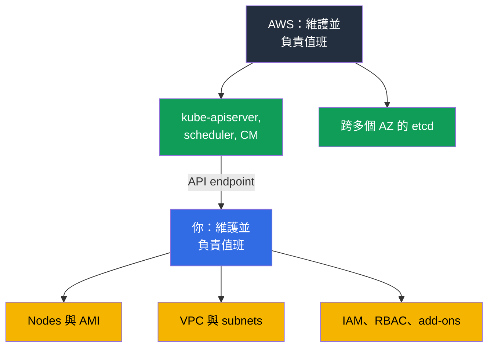
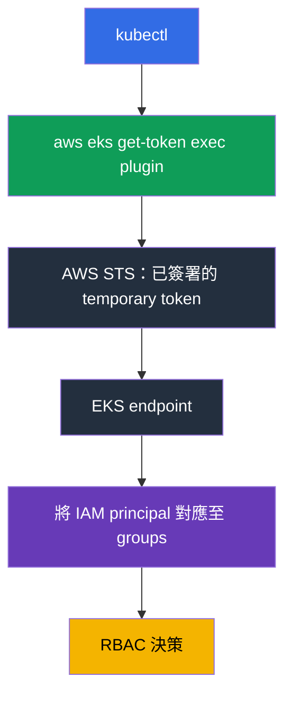
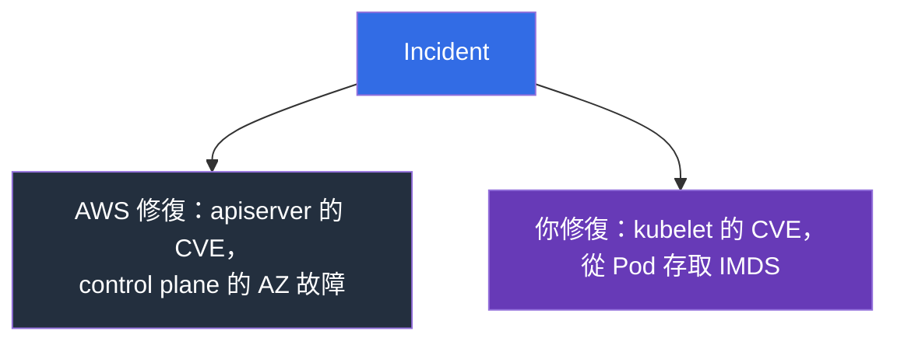

[Русская версия](ru.md) · [Eng version](en.md) · [Versión en español](es.md) · [Version française](fr.md) · [Deutsche Version](de.md) · [ქართული ვერსია](ge.md) · [日本語版](jp.md)
# 第 1 章. 導言：EKS 負責什麼，哪些仍由你負責

> **接下來。** 第 0 部分提供了 AWS 詞彙：帳戶、IAM、VPC、EC2 與工具。現在來看重點：界線劃在「AWS 做這件事」與「你做這件事」之間的哪裡。使用 kubeadm 後，很容易以為 EKS 是同一個集群，只是 `kube-apiserver` 由別人重新啟動。差異更深：部分工作消失了，部分熟悉的工具消失了，也出現新的故障原因。第 2 章會具體說明 control plane，第 3 章則討論版本與升級。

## 1.1. kubeadm 集群的痛點

回想使用 kubeadm 建立的集群平常運行的一個月。不是緊急狀況，而是平靜的一個月。除了處理工作負載外，還會發生什麼？

- 憑證會過期：一年一到，`kubelet` 就無法與 API server 溝通。必須有人在此前執行 `kubeadm certs check-expiration`，而不是事後才執行。
- 必須備份 etcd，並測試還原。從未還原過的 snapshot 不算備份。失去 quorum 代表集群無法運作，且得忙上一整夜。
- minor version 升級是在每個 control plane node 上手動執行的一連串程序，需要維護窗口與 rollback 計畫，而實務上往往就是「我們會還原 etcd」。
- control plane 元件的 OS patches 與 CVE 同樣由你負責：建置、部署、驗證。而且必須分散到 failure domains，並持續確認它們保持分散。

這些不帶來任何商業價值：它是獲得 Kubernetes 使用權所要付出的稅。

**Amazon EKS** 是受管 Kubernetes control plane：AWS 執行並維護 API server、scheduler、controller manager 與 etcd，而你取得一個讓 `kubectl` 與 nodes 連線的 endpoint。它仍是相同 upstream Kubernetes，具有相同的 API 與 manifests。改變的不是 Kubernetes，而是誰為它的核心值班。



## 1.2. AWS 負責什麼，以及你為此失去什麼

完成 CKA 後，工程師在新集群做的第一件事就是尋找 control plane。`kubectl get pods -n kube-system` 不會顯示 `kube-apiserver` 或 `etcd`，`kubectl get nodes` 也不會顯示 master nodes。集群沒有壞掉：control plane 位於 AWS 帳戶中，不屬於你，也不在你的 VPC 裡。

AWS 為你執行的工作包括：在數個 Availability Zones 運行 API server、scheduler 與 controller manager，擴展並替換故障 instance；保存、備份與還原 etcd；修補 control plane 元件，patch level 以 **platform version** 表示並會在你未介入時提高；針對 API server 可用性提供每月 99.95% SLA，這是服務等級規格而非價格；若你啟用，也會將 control plane logs 傳送至 CloudWatch（第 2 章）。作為交換，你會失去正是自己已習慣的工具：

| kubeadm 慣例 | 在 EKS 中的作法 |
|---------------------|-----------|
| `etcdctl snapshot save` | 無法透過網路或 exec 存取 etcd；集群狀態以不同方式備份（第 41 章） |
| 編輯 `/etc/kubernetes/manifests/kube-apiserver.yaml` | 無法使用 control plane static pods，也無法編輯 apiserver flags |
| 自訂 `--enable-admission-plugins` | plugin set 由 AWS 固定；可擴充點是 webhooks 與 policies（第 22 章） |
| apiserver 的 `--feature-gates` | 無法使用；feature gates 隨版本提供 |
| `kubeadm upgrade apply` | control plane 升級是 AWS API 呼叫，每次一個 minor version（第 38 章） |
| 集群憑證輪替 | AWS 維護 control plane certificates；你的存取建構於 IAM（第 5 章） |
| 對 master 使用 `ssh`，並在磁碟上查看 logs | control plane logs 只能在啟用時透過 CloudWatch 取得（第 2 章） |
| 使用帶 profiles 的自訂 `kube-scheduler` | 只有將第二個 scheduler 作為你的 Pod，運行在你的 nodes 上才可行 |

```bash
# 列出 Region 中的集群
aws eks list-clusters --region eu-central-1

# Kubernetes 版本、control plane patch level、endpoint
aws eks describe-cluster --name demo \
  --query 'cluster.{version:version,platform:platformVersion,endpoint:endpoint}'

# 從 Kubernetes 角度取得相同版本
kubectl get --raw /version
```

## 1.3. 哪些仍由你負責

從使用者請求到運行中 Pod 之間的一切，仍由你負責：machines、addresses、permissions，以及相應帳單。

| 範圍 | kubeadm | EKS | 課程位置 |
|---------|---------|-----|-------------|
| API server、scheduler、controller manager、etcd | 你 | AWS | 第 2 章 |
| Control plane patches、platform version | 你 | AWS | 第 2、3 章 |
| 選擇 minor version 與其支援期限 | 你 | 你，在支援版本範圍內 | 第 3 章 |
| Nodes：AMI、bootstrap、OS patches、升級、scaling | 你 | 你 | 第 10、11、12、38 章 |
| CNI、address plan、Pod IP | 你 | 你 | 第 6、7、8 章 |
| Authentication、RBAC、multi-tenancy | 你，certificates | 你，IAM 與 access entries | 第 5、22 章 |
| Add-ons：CoreDNS、kube-proxy、CSI、versions | 你 | 你，managed add-ons 能提供協助 | 第 37 章 |
| Load balancers、Ingress、DNS、TLS | 你 | 你 | 第 26-29 章 |
| Storage：StorageClass、volumes、snapshots | 你 | 你 | 第 23、24、25 章 |
| Secrets 與其 encryption | 你 | 你，KMS 能提供協助 | 第 18 章 |
| Observability 與 cost | 你 | 你 | 第 33-36、43 章 |
| Kubernetes state 與 volume backups | 你 | 你，AWS Backup 能提供協助 | 第 41、42 章 |

情況很誠實：EKS 移除了最可怕的一部分工作，卻不是最大的一部分。剩下的工作也更複雜了：現在不只是 Kubernetes，還有其下層的 AWS。

## 1.4. 工程師習慣如何改變

清單中的每個習慣，如果在 incident 中才知道，都會浪費一個小時。

**存取權透過 IAM 授予，而不是憑證。** 使用 kubeadm 時，你用自己的 CA 簽署 client certificate 並發放 kubeconfig。在 EKS 中，kubeconfig 不含 long-lived credentials：它會呼叫 `aws eks get-token` exec plugin，該 plugin 從 STS 取得 temporary token，而集群會透過 **access entry** 將 IAM principal 對應至 RBAC groups，或使用舊版的 `aws-auth` ConfigMap。因此常見症狀是：kubeconfig 正確，卻回應 `error: You must be logged in to the server`，因為 role 尚未在集群中註冊（第 5 章）。



**Nodes 是一次性的。** 手動修好的 instance 會在 node group 升級或 Karpenter consolidation 時被替換，修改也會隨之消失。對 node 的修改只能存在於 launch template、user data 或 AMI 中（第 10、12 章）。同時，`ssh` 不再是主要工具：生產環境中的 nodes 通常沒有 public address 或 key，存取透過 SSM Session Manager，而除錯依賴自行離開 node 的 logs。

**除錯轉移到 AWS API。** 症狀出現在 `kubectl`，原因卻在 AWS：node 使用錯誤 IAM role、subnet addresses 已耗盡、vCPU quota 已耗盡、EBS volume 位於另一個 AZ，或 subnet 缺少必要 tag。這正是第 0.1 章的兩層圖。部分 cluster state 在 `kubectl` 根本看不到：endpoint configuration、control plane logs、managed add-on versions、secret encryption 與 node group state 都是 AWS objects，透過 `aws eks` 讀取並以程式碼描述（第 4 章）。

## 1.5. 具體說明責任共擔

「AWS 負責雲端安全，你負責雲端中的安全」這句話，若不套用到具體 incident，聽起來像行銷話術。一旦套用，就能在一分鐘內知道該由誰修復。下方矩陣將模型分為三個區域：純 AWS 責任、純你的責任，以及 AWS 提供機制但由你設定的共用區域。

| AWS 區域（雲端安全） | 共用區域 | 你的區域（雲端中的安全） |
|--------------------------------|-----------------|-----------------------------------|
| control plane、etcd、hypervisor、實體基礎設施 | IAM 與 RBAC、access entries | nodes、OS、AMI、kubelet、containerd |
| control plane patches、platform version | endpoint access mode | applications、requests/limits、NetworkPolicy |
| control plane 的 multi-AZ 部署 | 透過 KMS 的 secret encryption | volumes 中的資料及其 backup |

共用區域是大部分 incidents 的來源：工具存在，但設定由你負責。代表性例子是 Kubernetes API data 的 encryption。AWS 會加密 etcd disks，而在 1.28 以上版本，透過 KMS provider v2 的 envelope encryption 預設使用 AWS key 運作，不需要你介入。你自己的 customer managed key 改變的不是是否加密，而是所有權：key policy、CloudTrail 對 decryptions 的 audit，以及撤銷 key access 的後果都由你負責；AWS 則將 provider 整合到 `kube-apiserver` 中，你無法設定該整合（第 18 章）。



| 情況 | 誰負責 | 實務上會發生什麼 |
|----------|-----|----------------------------|
| `kube-apiserver` 的 CVE | AWS | 發布新的 platform version；control plane 會在未介入下修補 |
| `kubelet`、containerd 或 node kernel 的 CVE | 你 | 等待新 AMI 並部署 node replacements；舊 nodes 存活期間仍有漏洞（第 10、38 章） |
| Pod 透過 IMDS 洩漏 credentials | 你 | 使用 IMDSv2 與 hop limit，從 node role 遷移至 IRSA 或 Pod Identity（第 16、17、19 章） |
| 涉及 control plane instance 的 AZ 故障 | AWS | API server 仍可用；你必須確保 nodes 不只位於一個 AZ（第 40 章） |
| Public endpoint 對整個 Internet 開放 | 你 | 這是你的設定：access mode 與 `publicAccessCidrs`（第 2 章） |
| Pod 在 `/` 使用 `hostPath` 並具有 root permissions | 你 | 使用 Pod Security Admission 與 policies（第 19、22 章） |

結論是：管理 control plane 不會減少安全工作的總量，它只移除了其中一部分。nodes 與你的帳戶中的一切仍由你負責。

## 1.6. EKS 不會做什麼，儘管人們經常期待它會做

團隊遷移到 managed service 後，常以為「AWS 會照看它」。它會照看，但只照看 control plane。以下事情不會發生：

- **它不會升級 nodes。** Managed node group 可以部署升級，但命令由你下達。使用三個月前 AMI 的 node 仍會運行，卻不會主動回報（第 38 章）。
- **它不會升級 add-ons。** 即使是 managed add-on，也由你決定升級，而其版本不會與所有 cluster versions 相容（第 37 章）。
- **它不會規劃 address space。** 每個 subnet 一個 `/24` 看似足夠，直到第一次擴展：VPC CNI 會從 subnet 為 Pods 指派 addresses（第 6、7 章）。
- **它不會調校 workloads**，也**不會撰寫 NetworkPolicy。** Requests 與 limits、HPA、PDB、topology spread，以及 Pod isolation 都由你負責（第 14、30、35、40 章）。
- **它不會自行備份 Kubernetes state。** 無論 objects 或 volumes 都不會：必須設定 backup，並另行測試 restoration（第 41、42 章）。
- **它不會計算 costs**，也**不會選擇 access architecture。** 依團隊分攤費用以 tags 為基礎，而由你選擇 IRSA 或 Pod Identity（第 5、16、17、43 章）。

另需說明 **Auto Mode**：這是一個 AWS 也負責 nodes、core add-ons 與其 upgrades 的模式。其內部 scaling 由 Karpenter 運作：instances 會根據 unscheduled Pods 的 requests 選取，但 controller 由 AWS 而不是你管理，因此 compute-layer 的操作模型不同（第 11、12 章）。它移動了界線，卻沒有消除界線，且有自身的取捨；第 9 章會討論它。在此之前，請假設是 nodes 由你負責的集群。

## 1.7. 受管性的代價

你以兩種貨幣付款。金錢方面：control plane 會收取**每小時費用**，無論你有三個 nodes 還是三百個。對大型 cluster 而言，與 EC2 相比這筆費用微不足道；對十幾個小型 dev clusters 而言，它是顯著的項目，因此常見決定是建立一個以 namespace 隔離的 cluster，而非每個團隊一個 cluster（第 22、43 章）。當 minor version 轉入 extended support，該 cluster 的每小時費用會提高。這是督促按時升級而非累積過時 clusters 的結構性誘因（第 38 章）。

每小時費用並非受管性帶來的唯一成本。Control plane logs 預設停用，在活躍 cluster 上一次啟用全部五種類別，會形成資料流，其中 `audit` 與 `api` 明顯大於其餘類別。你要支付 CloudWatch Logs 的 ingestion 與 storage 費用，而未設定 retention period 的 log group 會無限累積資料。在嘈雜 cluster 上，這個項目可能超過 control plane 費用本身。因此，啟用 logs 時就要設定 retention（第 2 章）；volume、filters 與 archival 會在第 34、43 章討論。

自由方面：control plane 是封閉的，它的 settings 也隨之封閉。

| 限制 | 實務上的意義 |
|-------------|----------------------------|
| 沒有自訂 apiserver flags | 無法加入 flag 或修改 timeouts；只能使用 EKS API 公開的功能 |
| 固定的 admission plugins 集合 | 以 validating 或 mutating webhook 實作自訂 rule（第 22 章） |
| 無法存取 etcd | 無法使用 `etcdctl`，也無法自訂 settings；只能透過支援的機制進行 backups（第 41 章） |
| 僅支援的 minor versions | 新版本不會在 upstream release 當天出現在 EKS，而舊版本依時程離開（第 3 章） |
| 每次升級一個 minor version | 無法跳過 version，必須分步制定計畫（第 38 章） |
| Extended support | 過時 version 的每小時費用較高：它是延期而非解決方案（第 3、38 章） |

升級前需檢查相容性，而且不只檢查 cluster：add-ons 有各自的 matrices。

```bash
# 集群目前安裝的內容
aws eks describe-cluster --name demo --query 'cluster.[version,platformVersion,status]'

# 特定集群版本可用的 add-on versions
aws eks describe-addon-versions --addon-name vpc-cni --kubernetes-version 1.33 \
  --query 'addons[].addonVersions[].addonVersion'
```

## 1.8. 何時不需要 EKS

這是一門 EKS 課程，但對「我需要它嗎？」的誠實答案有時是否定的。

- **On-premises 或其他雲端。** 有 EKS Anywhere 與 EKS Hybrid Nodes，但它們是有自己操作模型的獨立產品，不是「在自己的基礎設施上使用相同 EKS」。這也包含可用 Regions 無法滿足的**資料存放法規要求**。
- **Local development 與 CI。** kind 或 minikube 更適合 manifests 與 chart testing，速度更快且免費；只有測試 AWS integration 時才需要付費 cluster。
- **你需要自己的 control plane。** EKS 不提供 custom apiserver flags、自訂 admission plugins 或特殊的 feature gates；EC2 上 self-managed cluster 仍是一個選項，但也承擔它的全部成本。
- **不含 Kubernetes 的單一 application。** ECS、Fargate、Lambda 或 App Runner 可以比必須操作的 cluster 更便宜地解決問題。

## 1.9. 如何套用至生產環境

- **以文件記錄責任界線。** Runbook 應寫明：API server 無法使用時，向 AWS 開 ticket；nodes `NotReady` 時，由我們自行調查。這能節省 incident 的前二十分鐘。**把 nodes 視為消耗品**：AMI replacement 按時程進行，而非等到出現 CVE；存活數月的 node 就是技術債（第 38 章）。
- **以程式碼描述 cluster 與其周邊基礎設施。** Endpoint configuration、control plane logs、add-on versions 與 node groups 放在 Terraform 或 eksctl，不在 console 中修改（第 4 章）。
- **僅透過暫時性 IAM roles 存取。** Kubeconfig 中不使用 long-lived keys；獨立的 break-glass role 在使用時應觸發 alert（第 0.2、5 章）。
- **規劃 versions。** 將 standard-support 結束日期排入行事曆，先在 development cluster 完成 upgrade（第 3 章）。每季在 test cluster 測試從 backup restore，而非僅假設已設定完成（第 41、42 章）。
- **將 cost 視為 metric。** 依 clusters 與 teams 分析、設定帶 alarms 的 budgets，並分析 traffic 與 NAT 成長（第 31、43 章）。

## 1.10. 迷你詞彙表

- **Amazon EKS** 是 AWS 中的 managed Kubernetes：AWS 維護 control plane，而 nodes 與周邊基礎設施由你負責。**Control plane** 是 API server、scheduler、controller manager 與 etcd；在 EKS 中它們位於 AWS 帳戶、你的 VPC 外，且不會出現在 `kubectl get pods -n kube-system`。**Data plane** 是你的 nodes 與其上運行的一切。
- **Platform version** 是 Kubernetes minor version 內的 EKS control plane patch level，會在你未介入時提高。**Cluster endpoint** 是 API server address：public、private 或兩者皆有（第 2 章）。
- **Access entry** 將 IAM principal 對應至 cluster permissions，是 `aws-auth` ConfigMap 的現代替代方案（第 5 章）。
- **Managed node group** 是由 EKS 按你的命令管理 lifecycle 的 node group。**Auto Mode** 是 AWS 也負責 nodes 與 core add-ons 的模式（第 9 章）。**Managed add-on** 是由 EKS 按你的請求管理版本的 add-on，例如 VPC CNI、CoreDNS、kube-proxy、CSI（第 37 章）。
- **Shared responsibility** 意味著 AWS 負責雲端安全，而你負責雲端中的安全。

## 1.11. 本章小結

- EKS 移除了最令人不愉快的操作工作：為 API server、scheduler、controller manager 與 etcd 值班，以及它們的 patching 與 multi-AZ deployment。
- 作為交換，工具消失了：無法存取 etcd 或使用 `etcdctl`，沒有 control plane static pods，無法編輯 apiserver flags，也無法使用自訂 admission plugins 集合。
- 其他一切都由你負責：nodes 與 AMIs、network 與 address plan、IAM 與 RBAC、add-ons、storage、secrets、observability、backups 與 cost。習慣也會改變：以 IAM 取代 certificate 存取，nodes 是一次性的，`ssh` 不再是主要工具，問題原因經常位於 AWS。
- 責任劃分很具體：apiserver 的 CVE 交給 AWS，kubelet 的 CVE 由你處理；control plane AZ failure 交給 AWS，Pod 中開放的 IMDS 由你處理。
- 受管性的代價是每小時費用、封閉的 control plane settings、僅限支援 versions，以及每次升級一個 minor version。EKS 並不適合所有情境：on-premises、法規要求、local development 與自訂 control plane 都是應選擇其他方案的理由。

## 1.12. 這如何幫助實際工作

任何 EKS incident 的第一個問題是，它是否位於責任界線的我方一側。答案決定你應前往 `kubectl` 與 AWS API，或開出 support ticket。第二個影響是規劃：一旦清楚沒有人會替你升級 nodes、管理 add-on versions 或備份 cluster state，這些工作就會提早排入行事曆，而不會等到 version 已失去支援才浮現。第三個影響是與管理層溝通：「我們遷移至 managed Kubernetes」不代表「工作變少」，第 1.3 節的表格比文字更能說明這一點。

## 1.13. 自我檢查問題

1. AWS 在 EKS 中維護哪些 Kubernetes components，為什麼它們不會出現在 `kubectl get pods`？
2. 什麼是 platform version，它與 Kubernetes version 有何差異？
3. 為什麼無法在 EKS 中執行 `etcdctl snapshot save`，又該如何備份 cluster？
4. 你需要修改 `kube-apiserver` flag。在 EKS 中有哪些選項？
5. EKS 如何授予 cluster access，為什麼正確的 kubeconfig 仍可能無法運作？
6. kubelet 與 apiserver 各出現一個 CVE。每種情況下你要做什麼？
7. 一個 Availability Zone 故障。AWS 負責什麼，而你負責什麼？
8. 為什麼在 node 上手動進行的修改應視為已遺失？
9. EKS 不會自行做哪些事：node upgrades、add-on upgrades、NetworkPolicy、backups？
10. Control plane 的每小時費用如何影響「每個 team 一個 cluster」與「一個以 namespace 隔離的 cluster」之間的選擇？
11. 在哪些情況下你會建議不要使用 EKS？
12. 一個 Pod 處於 `Pending`，Kubernetes events 很少。執行 `kubectl` 後要看哪裡？

## 實作

第 1 部分的實作從下一章開始。目前適合在任何你能存取的 cluster 上執行 `aws eks list-clusters` 與 `aws eks describe-cluster`，並在輸出中找到 version、platform version、endpoint 與 access mode。第 2 章會逐一說明這些欄位。

---
[目錄](../README_TW.md) · [第 0 部分](../00-1-aws/tw.md) · [第 2 章](../02/tw.md)
