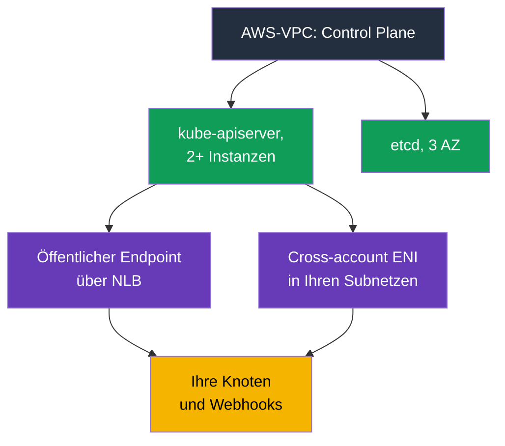
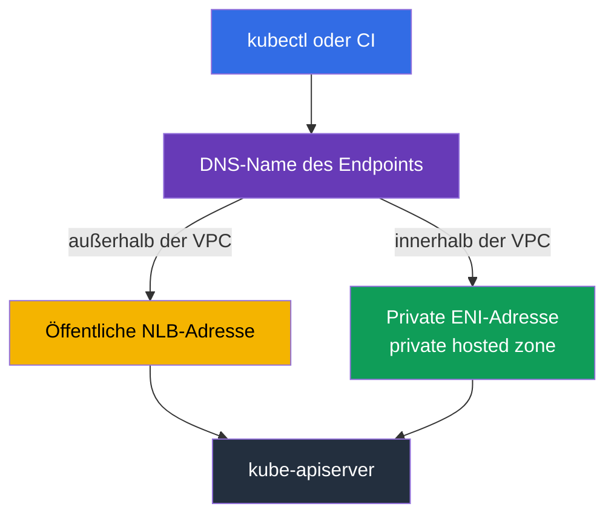
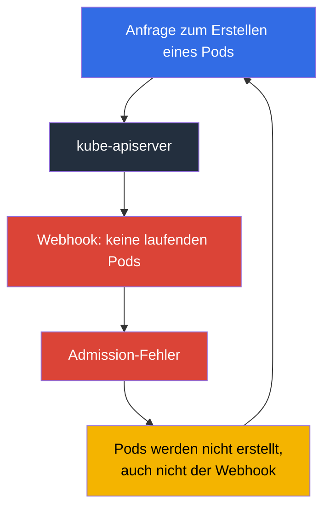

[Русская версия](ru.md) · [Eng version](en.md) · [Versión en español](es.md) · [Version française](fr.md) · [ქართული ვერსია](ge.md) · [繁體中文版](tw.md) · [日本語版](jp.md)
# Kapitel 2. EKS Control Plane: öffentlicher und privater Endpoint, Platform Versions, SLA und Logs

> **Wie es weitergeht.** Die Verantwortungsgrenze wurde behandelt (Kapitel 1); jetzt geht es konkret darum, was auf der AWS-Seite liegt. Die Control Plane ist in `kubectl` nicht sichtbar, aber keine Abstraktion: Sie hat eine Adresse, Netzwerkschnittstellen in Ihren Subnetzen, eine Security Group, ihren eigenen Patch-Stand, Logs und ein SLA. Die Hälfte der Incidents „Cluster nicht erreichbar“ und „Pods werden nicht erstellt“ lässt sich durch diese Einstellungen und nicht durch Kubernetes erklären. Kapitel 3 führt mit Versionen und ihren Support-Zeiträumen fort.

## 2.1. Der Cluster läuft, aber die Control Plane ist nicht zu finden

Die typische erste Aufgabe in einem neuen Cluster lautet: Zugang zum API-Server schließen. Ein Engineer sucht nach Control-Plane-Instanzen in EC2, findet keine, sucht anschließend in der VPC-Konsole nach dem Endpoint in der Liste der VPC Endpoints und findet ihn dort ebenfalls nicht. Das ist kein Fehler: Die **Control Plane lebt in einer AWS gehörenden VPC**, und in Ihrem Account gibt es keine ihrer Instanzen. In der Dokumentation steht ausdrücklich, dass der private Endpoint des Clusters kein gewöhnlicher PrivateLink-Endpoint ist und nicht in der VPC-Konsole angezeigt wird.

Was von der Control Plane trotzdem in Ihrer VPC vorhanden ist: Beim Erstellen des Clusters legt EKS in den angegebenen Subnetzen **cross-account elastic network interfaces** an, 2 bis 4 Netzwerkschnittstellen, die dem Service gehören, aber Ihre Adressen verwenden. Über sie fließt der Traffic von der Control Plane zu Ihren Ressourcen: Zugriff auf kubelet an Port 10250 (`kubectl exec`, `logs`, `port-forward`, `attach`, `cp`), Aufrufe von Admission Webhooks, des OIDC-Providers und Ihrer aggregated API servers. In Gegenrichtung greifen die Knoten über den Cluster-Endpoint auf den API-Server zu.



Die praktische Konsequenz lautet: **Die bei der Clustererstellung angegebenen Subnetze sind nicht nebensächlich**. Sie brauchen freie Adressen, nicht nur beim Start: Bei einer Änderung der Control-Plane-Logging-Konfiguration verlangt EKS bis zu fünf freie IP-Adressen in jedem Subnetz. Sind die Adressen erschöpft, schlägt der Vorgang fehl.

## 2.2. Cluster Security Group: Was sie zulässt und was ihr nicht unterliegt

Zusammen mit dem Cluster erstellt EKS eine Security Group mit einem Namen wie `eks-cluster-sg-<cluster>-<uniqueID>`. Die Standardregeln sind sämtlicher eingehender Traffic von sich selbst (source self) und sämtlicher ausgehender Traffic zu `0.0.0.0/0`. Dieselbe Gruppe wird automatisch an die cross-account ENI des Clusters und an die Schnittstellen der Knoten aus managed node groups angehängt, sodass Control Plane und Knoten sich standardmäßig vollständig erreichen können.

Wichtig ist, genau zu verstehen, was sie steuert. Die Cluster Security Group regelt zwei Verbindungstypen: Zugriff auf den **private Endpoint** und Zugriff auf die **kubelet API**. Auf den öffentlichen Endpoint hat sie keinerlei Einfluss; dieser wird ausschließlich durch die CIDR-Liste begrenzt.

| Aktion | Erforderlich in der Cluster Security Group |
|-------------|------------------------------------|
| Unverändert lassen | ingress from self + egress `0.0.0.0/0`, alles funktioniert, die Regeln sind jedoch sehr weit |
| Breiten egress entfernen | mindestens TCP 443 und TCP 10250 in der Cluster Security Group, TCP und UDP 53 für DNS |
| `kubectl exec` und `logs` | die Control Plane muss kubelet der Knoten auf 10250 erreichen, sonst hängen die Befehle |
| Zugriff von Bastion oder Büro auf den private Endpoint | ingress TCP 443 von der Quelle (SG der Bastion, CIDR des Büros oder Transitnetz) |
| Self-Regeln entfernen | EKS stellt sie beim nächsten Cluster-Update wieder her; auch Tags stellt der Service wieder her |

Knoten brauchen darüber hinaus ausgehenden Zugang: zur EKS-API für die Registrierung und zu ECR und S3 für Images. Private Cluster ohne Internetzugang und die erforderlichen VPC Endpoints behandelt Kapitel 19.

```bash
# Vollständige Netzwerkkonfiguration des Clusters: Modi, Subnetze, SG
aws eks describe-cluster --name demo --query 'cluster.resourcesVpcConfig'

# Nur die Kennung der Cluster Security Group
aws eks describe-cluster --name demo \
  --query 'cluster.resourcesVpcConfig.clusterSecurityGroupId' --output text
```


## 2.3. Endpoint-Zugriffsmodi und woran jeder scheitert

Ein neuer Cluster wird standardmäßig mit öffentlichem Endpoint erstellt: `endpointPublicAccess=true`, `endpointPrivateAccess=false`. Das ist bequem und zugleich der erste Beanstandungspunkt eines Audits. Drei Kombinationen sind möglich, jeweils mit eigener Traffic-Mechanik.

| Modus | Flags | Traffic-Pfad | Zugriffssteuerung |
|-------|-------|------------------|---------------------|
| Nur public (Standard) | `endpointPublicAccess=true`, `endpointPrivateAccess=false` | Anfragen von Knoten innerhalb der VPC verlassen die VPC, bleiben aber im Amazon-Netz | nur `publicAccessCidrs` |
| Public und private | beide `true` | Anfragen aus der VPC laufen über private Endpoint, externe über den öffentlichen | `publicAccessCidrs` für public, Cluster Security Group für private |
| Nur private | `endpointPublicAccess=false`, `endpointPrivateAccess=true` | gesamter API-Server-Traffic nur aus der VPC oder einem verbundenen Netz | nur Cluster Security Group; `publicAccessCidrs` wirkt nicht |

Ist private access aktiviert, erstellt EKS in Ihrem Namen eine **private hosted zone in Route 53** und verknüpft sie mit der Cluster-VPC. Die Zone verwaltet der Service, sie ist in Ihren Route-53-Ressourcen nicht sichtbar. Damit der Endpoint-Name zu einer privaten Adresse aufgelöst wird, müssen im VPC `enableDnsHostnames` und `enableDnsSupport` aktiv sein und das DHCP options set `AmazonProvidedDNS` enthalten. Genau deshalb kann „Cluster erstellt, Knoten verbinden sich nicht“ an der VPC-Konfiguration und nicht an EKS liegen (Kapitel 0.3).

Eine weitere Besonderheit von private-only: Der Endpoint-Name wird inzwischen in der VPC über öffentliche DNS in eine private Adresse aufgelöst, während dies früher nur innerhalb der VPC geschah. Gibt ein lange bestehender Cluster keine private Adresse zurück, empfiehlt die Dokumentation, den öffentlichen Zugang einmal ein- und wieder auszuschalten.

Typische zeitaufwendige Ausfälle:

- **CI deployt nicht mehr.** SaaS-Runner leben außerhalb Ihres Netzes. Private-only unterbricht sie zwangsläufig; Abhilfe schaffen Runner in der VPC, self-hosted Agents oder Zugang über ein Transitnetz. Vor dem Umschalten testen, nicht danach.
- **`kubectl` aus dem Büro antwortet nicht.** Bei private-only ist die API nur aus der VPC oder einem verbundenen Netz erreichbar. Bastion im Cluster-Subnetz mit SSM Session Manager (ohne offenen Port 22), AWS Client VPN, Direct Connect, transit gateway oder CloudShell in der VPC sind Optionen. Die Cluster Security Group benötigt zudem ingress 443 von dieser Quelle.
- **Knoten in einer anderen VPC.** Der private Endpoint wird in der Cluster-VPC aufgelöst. Peering allein löst den Namen nicht auf: Zone zuordnen oder eigenen Resolver bereitstellen.
- **Hybrid Nodes mit beiden aktivierten Modi.** Knoten außerhalb der VPC lösen den Namen auf öffentliche Adressen auf; die Dokumentation empfiehlt für sie einen statt beider Modi.
- **Verbindungsabbrüche beim Scale der Control Plane.** API-Server-Instanzen werden ersetzt, der Name liefert andere Adressen und der TTL der managed Zone beträgt 60 Sekunden. Clients, die DNS für die gesamte Prozesslaufzeit cachen, erhalten Timeouts; Namen erneut auflösen und Retries verwenden.

```bash
# Private Endpoint öffnen und öffentlichen Zugang in einem Vorgang beschränken
aws eks update-cluster-config --name demo --resources-vpc-config \
  endpointPublicAccess=true,endpointPrivateAccess=true,publicAccessCidrs=203.0.113.0/24

# Auf Abschluss warten: Status Successful
aws eks describe-update --name demo --update-id <id> --query 'update.status'
```



## 2.4. Öffentlicher Endpoint ohne 0.0.0.0/0

Der Standardwert von `publicAccessCidrs` ist `0.0.0.0/0` (zusätzlich `::/0` für dual-stack Cluster mit `IPv6`). Damit ist der öffentliche Endpoint standardmäßig aus dem gesamten Internet erreichbar. Das ist eine bewusste AWS-Entscheidung zugunsten eines einfachen Starts, kein Versehen.

Die Liste einzuschränken ist die günstigste Sicherheitskorrektur im Cluster: ein Befehl, keine Änderungen an Workloads. Wichtig ist:

- Beschränken Sie CIDRs **ohne private Endpoint zu aktivieren**, müssen die Adressen enthalten sein, von denen Knoten und Fargate-Pods den öffentlichen Endpoint ansprechen. Andernfalls fallen die Knoten ab. Die Dokumentation empfiehlt einfacher: private access aktivieren.
- Die Liste akzeptiert `IPv4` CIDRs; `IPv6` CIDRs sind nur für dual-stack Cluster mit `ipFamily=IPv6`, erstellt nach Oktober 2024, zulässig, sonst erscheint `The following CIDRs are invalid in publicAccessCidrs`.
- Büro- und VPN-Adressen ändern sich. Die CIDR-Liste ist lebende Konfiguration als Code (Kapitel 4), keine einmalige Konsolenänderung.

Vor allem gilt: **Das ist ein Netzwerkfilter, keine Authentifizierung**. CIDR-Beschränkung ersetzt weder IAM noch RBAC. Eine Anfrage von einer erlaubten Adresse durchläuft weiterhin IAM-Prinzipalprüfung und RBAC-Autorisierung (Kapitel 5), und eine kompromittierte Administratorrolle von einer erlaubten Adresse bleibt erfolgreich. Der umgekehrte Fehler kommt ebenfalls vor: private-only als Grund zu betrachten, `cluster-admin` an alle zu vergeben.

## 2.5. Die Control Plane ruft Sie an: Webhooks

Validierende und mutierende Admission Webhooks ruft der **API-Server** auf. Der Traffic geht also durch cross-account ENI von der AWS-VPC in Ihre VPC, gewöhnlich auf Port 443, meist zum Service Ihres Controllers. Die Verfügbarkeit Ihrer Pods wird damit zur Bedingung für den Betrieb des API-Servers.

Der unerquicklichste EKS-Incident lautet: **Webhook nicht erreichbar - Pods werden nicht erstellt**.



Der Kreislauf schließt sich: Der Webhook liegt, weil seine Pods nicht entstehen, und Pods entstehen nicht, weil der Webhook liegt. Das geschieht oft nach einem Scale auf null Knoten, nach dem Verschieben des Webhooks auf Spot oder bei `failurePolicy: Fail` mit breiten Regeln. AWS-Empfehlungen und praxiserprobte Maßnahmen:

- Keine „catch-all“ Webhooks mit `apiGroups: ["*"]`, `resources: ["*"]`, `operations: ["*"]` erstellen.
- Timeout deutlich unter 30 Sekunden halten und `failurePolicy` bewusst wählen. Fail-open senkt das Risiko blockierter kritischer Operationen, fail-closed bewahrt die Policy-Garantie. Die Wahl wird je Objekt getroffen, nicht überall gleich (Kapitel 22).
- `kube-system` und den Namespace des Controllers aus dem Wirkungsbereich des Webhooks ausschließen.
- Webhook mit mehreren Replikas in unterschiedlichen AZs und mit PDB betreiben (Kapitel 40).
- Den Netzwerkpfad offen halten. Standardmäßig verwaltet AWS den Control-Plane-egress (`controlPlaneEgressMode=AWS_MANAGED`); `CUSTOMER_ROUTED` überträgt diesen Pfad samt Verantwortung für Routen, NACL und Security Groups an Sie und ist unumkehrbar: zurück zu `AWS_MANAGED` geht nicht. Control-Plane-Knoten-Traffic über cluster ENI, einschließlich kubelet API auf 10250, hängt nicht von Ihrem Egress-Gerät ab; betroffen sind nur ausgehende Aufrufe wie Webhooks und OIDC-Authentifizierung.

## 2.6. Platform Version: der Patch-Stand, der selbst steigt

`kubectl get --raw /version` zeigt die Kubernetes-Version, nicht aber, welche EKS Control Plane sie bedient. Dafür gibt es die **Platform Version** wie `eks.14`.

Sie beschreibt Control-Plane-Fähigkeiten von EKS innerhalb einer Kubernetes-Minor-Version: aktive API-Server-Flags, aktive Admission Controller und den aktuellen Kubernetes-Patch-Stand. Die Nummerierung ist für jede Minor-Version unabhängig, startet bei `eks.1` und steigt, wenn AWS neue Control-Plane-Einstellungen oder Sicherheitskorrekturen veröffentlicht. `eks.1` in 1.30 und `eks.1` in 1.31 sind daher unterschiedliche Control-Plane-Builds. Der wichtigste Unterschied zur Kubernetes-Version: **Sie starten kein Platform-Version-Update**. AWS hebt bestehende Cluster schrittweise auf die aktuelle Platform Version ihrer Minor-Version. Neue Platform Versions bringen keine Breaking Changes und keine Ausfallzeit.

| Frage | Kubernetes-Version | Platform Version |
|--------|-------------------|------------------|
| Wer initiiert die Änderung | Sie, per EKS-API (Kapitel 38) | AWS, automatisch |
| Format | `1.33` | `eks.14` |
| Bringt inkompatible Änderungen | ja, darauf wird vorbereitet | nein |
| Inhalt | Kubernetes-Version und API | Apiserver-Flags, Admission-Plugins, Kubernetes-Patch |
| Wann ist es Ihr Problem | immer: Support-Zeitraum und Upgrade-Plan | wenn der Cluster mehr als zwei Platform Versions zurückliegt |

Die letzte Zeile ist der einzige praktische Grund, die Platform Version in der Bereitschaft anzusehen. Mehr als zwei Versionen Rückstand bedeuten, dass das automatische Update nicht durchgelaufen ist; prüfen Sie den Troubleshooting-Abschnitt der Dokumentation, statt es zu ignorieren.

```bash
# Kubernetes-Version, Platform Version und Clusterstatus
aws eks describe-cluster --name demo \
  --query 'cluster.[version,platformVersion,status]' --output text

# Gegenwärtig aktiviertes Control-Plane-Logging
aws eks describe-cluster --name demo --query 'cluster.logging'
```

## 2.7. Control-Plane-Logs: fünf Typen, standardmäßig nicht vorhanden

Es gibt kein `ssh` mehr auf den Master und kein `kubectl logs -n kube-system kube-apiserver-...` (Kapitel 1). Der einzige Kanal ist **CloudWatch Logs**, und er ist standardmäßig deaktiviert. Der Cluster läuft, ein Incident tritt ein und es gibt keine Historie: Logs, die vorher nicht aktiviert wurden, erscheinen nicht nachträglich. Das ist die erste Einstellung eines neuen Clusters.

Es gibt genau fünf Typen, die in der API genau so heißen: `api`, `audit`, `authenticator`, `controllerManager`, `scheduler`.

| Typ | Inhalt | Wann er hilft |
|-----|-----------|---------------|
| `api` | Logs der kube-apiserver-Komponente; bei Aktivierung zur Erstellung stehen die Start-Flags am Anfang des Streams | API-Fehler und Timeouts, Control-Plane-Konfiguration |
| `audit` | wer wann mit welcher Anfrage und welchem Ergebnis Clusterobjekte geändert hat | „wer hat den Namespace gelöscht“, Incident-Untersuchung und Compliance (Kapitel 21) |
| `authenticator` | EKS-spezifische RBAC-Authentifizierung mit IAM-Credentials | `You must be logged in to the server`, Access Entries und IRSA (Kapitel 5, 47) |
| `controllerManager` | reguläre Kubernetes Control Loops | Objekte werden nicht erstellt oder gelöscht, hängende Finalizer, Controller-Probleme |
| `scheduler` | Entscheidungen über Ort und Zeitpunkt für Pods | `Pending` Pods ohne brauchbare Events, Konflikte bei affinity und topology spread |

Vor dem Einschalten wichtig: Die Log Group heißt `/aws/eks/<cluster-name>/cluster`, Streams sind komponentenweise wie `kube-apiserver-audit-<id>`; bei Wachstum rotieren sie, und der jüngste wird über sein letztes Event bestimmt. Die Zustellung benötigt wenige Minuten und ist best effort. Aktiviert wird pro Typ und Cluster per Konsole, CLI oder API; verbosity ist 2 und die Änderung benötigt bis zu fünf freie IPs pro Subnetz. **Es kostet Geld**: Zusätzlich zu EKS fallen CloudWatch-Logs-Tarife für Ingestion, Speicherung und Daten-Scans an; `audit` erzeugt das meiste Volumen. Retention wird in CloudWatch Logs eingestellt, nicht in EKS. Eine Log Group ohne Frist speichert und berechnet Daten unbegrenzt: Rufen Sie daher sofort `aws logs put-retention-policy` für `/aws/eks/<cluster>/cluster` auf, etwa für 7-14 Tage, und verschieben Sie Langzeitarchive nach S3 (Kapitel 34 und 43). In der Praxis ist `audit` immer aktiv und die Retention explizit gesetzt.

```bash
# Zwei Typen aktivieren; weitere werden in derselben Liste ergänzt
aws eks update-cluster-config --name demo \
  --logging '{"clusterLogging":[{"types":["api","audit"],"enabled":true}]}'

# Alle fünf Typen auf einmal
TYPES='["api","audit","authenticator","controllerManager","scheduler"]'
aws eks update-cluster-config --name demo \
  --logging "{\"clusterLogging\":[{\"types\":$TYPES,\"enabled\":true}]}"

# Existenz und Retention der Log Group
aws logs describe-log-groups --log-group-name-prefix /aws/eks/demo \
  --query 'logGroups[].[logGroupName,retentionInDays]' --output table

# Aufbewahrungsfrist setzen; ohne sie sammelt die Log Group unbegrenzt Logs
aws logs put-retention-policy --log-group-name /aws/eks/demo/cluster \
  --retention-in-days 14

# Audit live verfolgen
aws logs tail /aws/eks/demo/cluster \
  --log-stream-name-prefix kube-apiserver-audit --since 10m --follow
```

## 2.8. Control-Plane-Observability: Die 429 kommen zu Ihnen

Eine verwaltete Control Plane bedeutet nicht, dass sie nicht beobachtet werden muss. Ein schlecht geschriebener Controller, ein Script mit `kubectl` in einer Schleife oder tausend gleichzeitig erzeugte Pods können dazu führen, dass der API-Server `429 Too Many Requests` liefert. Das ist Schutz und kein Ausfall: Er begrenzt gleichzeitige Anfragen und lehnt Überschuss lieber ab, als zu degradieren. **API Priority and Fairness** verteilt dieses Kontingent über FlowSchema und PriorityLevelConfiguration. In EKS werden diese Objekte automatisch verwaltet und die Standardkonfiguration der Minor-Version genutzt. Das Kontingent wächst mit dem Scale der Control Plane, die mindestens zwei API-Server hat, ist aber nicht unbegrenzt.

Control-Plane-Metriken sind über `kubectl get --raw /metrics` im Prometheus-Format verfügbar.

| Beobachtung | Metriken | Bedeutung eines Anstiegs |
|--------------|---------|---------------------------|
| API-Latenz | `apiserver_request_duration_seconds` | Control Plane oder etcd unter Last, schwere LISTs oder ohne Pagination |
| Fehler und Throttling | `apiserver_request_total` nach code | 429-Spitze: Client überlastet Cluster; bei 5xx `api`-Logs prüfen |
| Admission | `apiserver_admission_controller_admission_duration_seconds`, `apiserver_admission_webhook_rejection_count` | langsamer oder ablehnender Webhook, Ihre eigene Bremse (Abschnitt 2.5) |
| etcd | `etcd_request_duration_seconds`, `apiserver_storage_size_bytes` | Datenbankgrößenlimit nahe; voll wird sie read-only |
| Clients | `rest_client_requests_total` | welcher Controller den Hauptstrom erzeugt |

```bash
# API-Server-Metriken im Prometheus-Format
kubectl get --raw /metrics | head -20

# Wie viele Anfragen mit 429 endeten
kubectl get --raw /metrics | grep 'apiserver_request_total.*code="429"'

# Aktuelle Konfiguration der Request-Prioritäten
kubectl get flowschemas
kubectl get prioritylevelconfigurations
```

Günstige Gewohnheiten vermeiden die Hälfte der Probleme: `kubectl` nicht in Schleifen ausführen, Client-Cache (`--cache-dir`) in Containern nicht verlieren, PDBs verwenden, damit der Abgang von Pods und Knoten nicht zu einer Lawine von EndpointSlice-Updates wird, und den Cluster nicht sprunghaft um Dutzende Prozent skalieren.


## 2.9. SLA, Multi-AZ und was trotzdem bei Ihnen bleibt

Die EKS Control Plane ist von Beginn an multi-zonal: mindestens zwei API-Server-Instanzen und drei etcd-Instanzen in drei Availability Zones einer Region, jeder Cluster mit eigener Control Plane ohne Überschneidungen mit anderen Clustern oder Accounts. Eine ausgefallene Instanz ersetzt EKS selbst, bei Bedarf in einer anderen AZ, und passt die Leistung der Control Plane selbst an die Last an.

Auf dieser Architektur beruht das SLA: Für Cluster mit standard control plane sagt AWS eine Verfügbarkeit des Kubernetes Endpoints mit einem Monthly Uptime Percentage von mindestens **99,95 %** pro monatlichem Abrechnungszyklus zu, gemessen in Fünf-Minuten-Intervallen. Für Cluster mit provisioned control plane, bei denen die Control-Plane-Kapazität im Voraus über Preisstufen zugewiesen wird, gilt ein erhöhtes SLA von 99,99 %, gemessen pro Minute. Aktuelle Bedingungen und der Ausgleichsprozess stehen immer auf der SLA-Seite des Service.

Was Ihnen die Multi-Zonalität der Control Plane nicht gibt:

| Bleibt Ihre Aufgabe | Warum |
|------------------------|--------|
| Knoten in unterschiedlichen AZs | die Control Plane überlebt den Ausfall einer Zone, Ihr Deployment auf Knoten einer AZ jedoch nicht (Kapitel 40) |
| Knoten-Subnetze in unterschiedlichen AZs und freie Adressen | sonst gibt es keinen Ort, an den Last verteilt werden kann (Kapitel 6, 7) |
| topology spread, PDB, korrektes Herunterfahren von Knoten | Anwendungsverfügbarkeit wird nicht von API-Verfügbarkeit geerbt (Kapitel 40) |
| Bindung von EBS-Volumes an eine AZ | ein Volume wandert nicht mit dem Pod zwischen Zonen (Kapitel 23) |
| Verfügbarkeit Ihrer Webhooks und Add-ons | Abschnitte 2.5 und Kapitel 37: Sie lassen sie ausfallen, die Admission leidet |
| Multi-Region | das SLA ist regional; DR ist eine gesonderte Aufgabe (Kapitel 42) |

Die Formulierung für das Unternehmen: Das SLA deckt die Verfügbarkeit des **API-Server-Endpoints** ab, nicht die Verfügbarkeit Ihrer Anwendung. Ihre Anwendung kann bei perfekt laufender Control Plane ausfallen, und es bleibt vollständig Ihr Incident.

## 2.10. Anwendung in der Produktion

- **Beide Endpoint-Modi sind aktiv, der öffentliche ist eingeschränkt.** `endpointPrivateAccess=true` plus `publicAccessCidrs` aus Büro- und VPN-Bereichen. Komplettes private-only ist eine bewusste Entscheidung, für die CI, Bastion und DNS vorbereitet werden.
- **Endpoint-Konfiguration als Code.** Modi, CIDRs, Security Groups und Log-Typen liegen in Terraform oder eksctl (Kapitel 4). Eine Konsolenänderung überlebt nur bis zum nächsten `apply`.
- **Logs ab dem ersten Tag.** Mindestens `audit` und `authenticator`, Retention explizit gesetzt und für verdächtige `audit`-Events Metrikfilter und Alarme eingerichtet (Kapitel 21).
- **Control-Plane-Metriken im Dashboard.** API-Latenz, Anteil 429 und 5xx, Admission-Dauer und etcd-Datenbankgröße. Eine 429-Spitze wird als Incident behandelt: Client finden.
- **Webhooks gelten als Teil der Control Plane.** Enger Wirkungsbereich, kurzer Timeout, ausgenommenes `kube-system`, mehrere Replikas in unterschiedlichen AZs und PDB.
- **Die Cluster Security Group ist weder „alles erlaubt“ noch „alles verboten“.** Behalten Sie die dokumentierten Minimalregeln und zusätzlich expliziten ingress 443 für Bastion und Transitnetz.

## 2.11. Mini-Glossar

- **Cluster Endpoint** ist die Adresse der Kubernetes-API des Clusters. Der **public Endpoint** ist aus dem Internet erreichbar und nur durch CIDRs begrenzt; der **private Endpoint** ist aus der VPC erreichbar und durch die Cluster Security Group begrenzt.
- **`endpointPublicAccess` / `endpointPrivateAccess`** sind boolesche Flags des Zugriffsmodus, standardmäßig `true` und `false`. **`publicAccessCidrs`** ist die Liste der CIDRs, die den öffentlichen Endpoint erreichen dürfen, standardmäßig `0.0.0.0/0`.
- **Cross-account ENI** sind Netzwerkschnittstellen, die EKS in Ihren Subnetzen zur Verbindung der Control Plane mit Knoten, kubelet API, Webhooks und OIDC anlegt. **Cluster Security Group** ist die automatisch angelegte Gruppe auf diesen Schnittstellen und den Knoten aus managed node groups.
- **Private hosted zone** ist die Route-53-Zone, die EKS erstellt und mit Ihrer VPC verknüpft, damit der Endpoint-Name zu einer privaten Adresse aufgelöst wird.
- **Platform Version** ist Patch-Stand und Satz der EKS-Control-Plane-Fähigkeiten in einer Kubernetes-Minor-Version, Format `eks.<n>`, und wird von AWS automatisch aktualisiert.
- **Control-Plane-Log-Typen** sind `api`, `audit`, `authenticator`, `controllerManager`, `scheduler`; sie werden erst nach Aktivierung nach CloudWatch Logs geschrieben.
- **API Priority and Fairness** ist ein Kubernetes-Mechanismus, der das Kontingent gleichzeitiger Anfragen nach Typ verteilt; bei Erschöpfung erhält der Client `429`.

## 2.12. Zusammenfassung des Kapitels

- Die Control Plane lebt in einer AWS-VPC, aber in Ihren Subnetzen befinden sich 2-4 cross-account ENI und die Cluster Security Group. Über sie läuft Traffic zu kubelet auf 10250, zu Webhooks und zu OIDC.
- Die Cluster Security Group steuert private Endpoint und kubelet API, nicht den öffentlichen Endpoint. Dieser wird nur durch `publicAccessCidrs` begrenzt, standardmäßig `0.0.0.0/0`.
- Es gibt drei Zugriffsmodi: nur public (Standard), public und private, nur private. Die Umstellung unterbricht Dinge außerhalb der VPC: SaaS-CI-Runner, `kubectl` aus dem Büro, Knoten in einer peered VPC. Private access braucht private hosted zone und korrektes DNS im VPC.
- CIDR-Beschränkung ist ein Netzwerkfilter, keine Authentifizierung: IAM und RBAC bleiben Pflicht.
- Der API-Server ruft Ihre Webhooks auf; ein nicht erreichbarer Webhook mit breiten Regeln stoppt die Pod-Erstellung und schließt den Kreislauf um sich selbst.
- Die Platform Version ist der Patch-Stand der Control Plane und steigt selbst; reagieren müssen Sie nur bei mehr als zwei Versionen Rückstand.
- Die fünf Control-Plane-Log-Typen sind standardmäßig aus, werden in CloudWatch Logs geschrieben und kosten Geld; die Retention wird in CloudWatch konfiguriert.
- Die Control Plane ist auf drei AZs verteilt, das Standard-SLA für den Endpoint beträgt 99,95 %. Multi-Zonalität von Anwendung, Volumes und Webhooks bleibt Ihre Aufgabe.

## 2.13. Wie dies in der realen Arbeit hilft

Drei Bereitschaftssituationen. Erstens: „Cluster nicht erreichbar“. Die Frage lautet nicht Kubernetes, sondern woher die Anfrage kommt und welcher Endpoint-Modus aktiv ist; `describe-cluster` mit `resourcesVpcConfig` liefert die Antwort in zehn Sekunden. Zweitens: „Pods werden nicht erstellt, Events sind leer“. Prüfen Sie Admission, Webhook-Metriken und `api`-Logs. Waren Logs nicht aktiviert, erfahren Sie das im schlimmsten Moment, daher werden sie vorher eingeschaltet. Drittens: Audit möchte wissen, wer eine Ressource gelöscht hat. Die Antwort steht nur in `audit`, und nur wenn es aktiviert und noch nicht aus der Retention gefallen ist. Außerdem gehören das Einschränken von `publicAccessCidrs` und das Aktivieren des private Endpoints zu den günstigsten Punkten jeder EKS-Sicherheitscheckliste: Minuten Aufwand, keine Anwendungsänderungen.

## 2.14. Fragen zur Selbstkontrolle

1. Warum ist der private Endpoint des Clusters nicht in der Liste der VPC Endpoints sichtbar?
2. Was ist eine cross-account ENI, in welchen Subnetzen wird sie angelegt und welcher Traffic läuft darüber?
3. Welche zwei Verbindungstypen steuert die Cluster Security Group, und welchen nicht?
4. Nennen Sie die drei Endpoint-Zugriffsmodi und die Standardwerte der Flags.
5. Sie stellen auf private-only um. Was bricht in CI und in Ihrem `kubectl`?
6. Wozu erstellt EKS eine private hosted zone, und welche VPC-Einstellungen sind dafür erforderlich?
7. Wie lautet der Standardwert von `publicAccessCidrs`, und warum ersetzt eine Einschränkung RBAC nicht?
8. Knoten registrieren sich nach Einschränkung des öffentlichen Zugangs nicht mehr. Was haben Sie vergessen?
9. Warum hält ein nicht erreichbarer validating Webhook die Pod-Erstellung an, und wie brechen Sie den Kreislauf?
10. Worin unterscheidet sich die Platform Version von der Kubernetes-Version, und wer aktualisiert sie?
11. Nennen Sie die fünf Control-Plane-Log-Typen und denjenigen für „wer hat den Namespace gelöscht“.
12. Der API-Server liefert `429`. Was bedeutet das, und womit beginnen Sie die Analyse?
13. Was deckt das EKS SLA ab, und was bleibt bei einem AZ-Ausfall Ihre Verantwortung?

## Praxis

Dieses Kapitel hat noch kein Lab, aber alles darin lässt sich auf jedem zugänglichen Cluster lesen: `aws eks describe-cluster` mit `--query 'cluster.resourcesVpcConfig'` zeigt Modi, CIDRs und Cluster Security Group, `--query 'cluster.[version,platformVersion]'` zeigt Versionen und `--query 'cluster.logging'` die aktivierten Log-Typen. Danach folgen `aws logs describe-log-groups --log-group-name-prefix /aws/eks` und `kubectl get --raw /metrics`. Kapitel 3 wechselt zu Kubernetes-Versionen: Support-Zeiträume, standard und extended support sowie Upgrade-Strategie.

---
[Inhaltsverzeichnis](../README_DE.md) · [Kapitel 1](../01/de.md) · [Kapitel 3](../03/de.md)