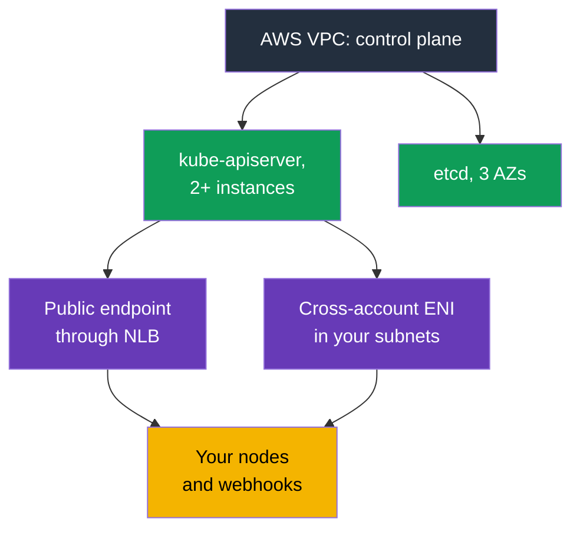
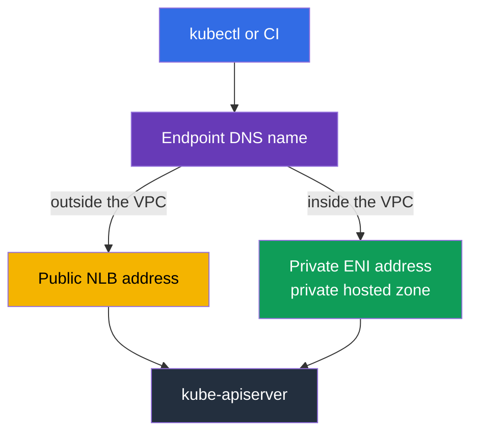
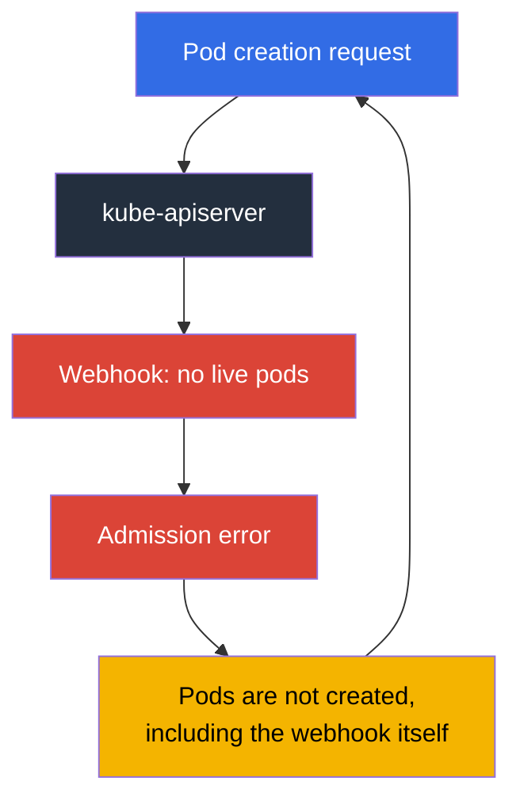

[Русская версия](ru.md) · [Versión en español](es.md) · [Version française](fr.md) · [Deutsche Version](de.md) · [ქართული ვერსია](ge.md) · [繁體中文版](tw.md) · [日本語版](jp.md)
# Chapter 2. EKS Control Plane: public and private endpoints, platform versions, SLA, logs

> **What is next.** The responsibility boundary is covered in Chapter 1; now we turn specifically to what
> is on the AWS side. The control plane is not visible in `kubectl`, but it is not an abstraction: it has
> an address, network interfaces in your subnets, a security group, its own patch level, logs, and an
> SLA. Half of the incidents reported as "the cluster is unavailable" or "pods are not being created" are
> explained by these settings, not by Kubernetes. Chapter 3 continues with versions and their support periods.

## 2.1. The cluster is running, but the control plane cannot be found

A typical first task on a new cluster is to close access to the API server. An engineer looks for
control plane instances in EC2, finds none, then goes to the VPC console to look for the endpoint
in the VPC endpoints list, and finds nothing there either. This is not an error: **the control plane
lives in a VPC owned by AWS**, and there are no instances for it in your account. The documentation
explicitly says that a cluster private endpoint is not an ordinary PrivateLink endpoint and is not shown
in the VPC console.

What you do have from the control plane in your VPC is this: when creating a cluster, EKS creates
**cross-account elastic network interfaces** in the subnets you specified, from 2 to 4 network interfaces
owned by the service but using your addresses. Traffic from the control plane to your resources passes
through them: calls to kubelet on port 10250 (this is `kubectl exec`, `logs`, `port-forward`,
`attach`, `cp`), admission webhook calls, calls to the OIDC provider, and calls to your
aggregated API servers. In the reverse direction, nodes send traffic to the API server through the cluster endpoint.



The practical consequence is that **the subnets specified when creating a cluster cannot be treated
as secondary**. They need free addresses, not only at the start: changing the control plane logging
configuration requires up to five free IP addresses in each subnet. If addresses run out, the operation fails.

## 2.2. Cluster security group: what it allows and what it does not govern

Along with the cluster, EKS creates a security group named like
`eks-cluster-sg-<cluster>-<uniqueID>`. The default rules are all inbound traffic from itself
(source self) and all outbound traffic to `0.0.0.0/0`. This group is also automatically attached
to the cluster's cross-account ENIs and the interfaces of nodes in managed node groups, so out of the box
the control plane and nodes have full visibility of each other.

It is important to understand exactly what it controls. The cluster security group governs two types of
connections: access to the **private endpoint** and access to the **kubelet API**. It has no effect at all
on the public endpoint, which is limited only by the CIDR list.

| What you do | What is needed in the cluster security group |
|-------------|----------------------------------------------|
| Leave it as is | ingress from self + egress `0.0.0.0/0`, everything works, but the rules are as broad as possible |
| Remove broad egress | minimum: TCP 443 and TCP 10250 in the cluster security group, TCP and UDP 53 for DNS |
| `kubectl exec` and `logs` | the control plane must be able to reach node kubelet on 10250, otherwise commands hang |
| Access the private endpoint from a bastion or the office | ingress TCP 443 from the source (bastion SG, office CIDR, or transit network) |
| Delete self rules | EKS restores them at the next cluster update; the service also restores tags |

Nodes also need outbound access: to the EKS API to register, and to ECR and S3 for images. For
private clusters with no Internet egress and the necessary VPC endpoints, see Chapter 19.

```bash
# Full cluster network configuration: modes, subnets, security group
aws eks describe-cluster --name demo --query 'cluster.resourcesVpcConfig'

# Only the cluster security group ID
aws eks describe-cluster --name demo \
  --query 'cluster.resourcesVpcConfig.clusterSecurityGroupId' --output text
```

## 2.3. Endpoint access modes and how each can fail

A new cluster is created with a public endpoint by default: `endpointPublicAccess=true`,
`endpointPrivateAccess=false`. This is convenient, and it is also the audit team's first objection. Three
combinations are available, and each has its own traffic mechanics.

| Mode | Flags | How traffic flows | What controls access |
|-------|-------|-------------------|----------------------|
| Public only (default) | `endpointPublicAccess=true`, `endpointPrivateAccess=false` | requests from nodes inside the VPC leave the VPC but remain on the Amazon network | only `publicAccessCidrs` |
| Public and private | both `true` | requests from inside the VPC use the private endpoint; from outside, the public endpoint | `publicAccessCidrs` for public, cluster security group for private |
| Private only | `endpointPublicAccess=false`, `endpointPrivateAccess=true` | all traffic to the API server comes only from the VPC or a connected network | only cluster security group; `publicAccessCidrs` does not apply |

When private access is enabled, EKS creates a **private hosted zone in Route 53** on your behalf
and associates it with the cluster VPC. The zone is managed by the service and is not visible in your
Route 53 resources. To resolve the endpoint name to a private address, the VPC must have
`enableDnsHostnames` and `enableDnsSupport` enabled, and its DHCP options set must have
`AmazonProvidedDNS`. This is exactly the case where "the cluster was created, but nodes do not connect"
is explained not by EKS but by VPC settings (Chapter 0.3).

One further nuance of private-only mode: the endpoint name now resolves through public DNS
to a private address from within the VPC, whereas it previously resolved only from inside the VPC. If an
old long-running cluster does not return a private address for the name, the documentation suggests enabling
public access and disabling it again. Once is enough.

Typical failures that cost time:

- **CI stopped deploying.** SaaS runners live outside your network. Switching to private-only
  will reliably break them; use runners inside the VPC, self-hosted agents, or access through a
  transit network. Verify this before switching, not afterwards.
- **`kubectl` from the office does not respond.** In private-only mode, API access is available only from the VPC or
  a connected network. Working options include a bastion host in the cluster subnet connected through SSM
  Session Manager (without exposing port 22), AWS Client VPN, Direct Connect, transit gateway, or
  CloudShell in the VPC. The cluster security group also needs ingress 443 from this source. Without it,
  a path exists but access does not.
- **Nodes in another VPC.** The private endpoint resolves in the cluster VPC. Peering alone does not
  provide name resolution: you need a zone association or your own resolver, otherwise nodes cannot find the API.
- **Hybrid nodes with both modes enabled.** Nodes outside the VPC resolve the name to public
  addresses; the documentation recommends choosing one mode for them, not both.
- **Connection interruptions while scaling the control plane.** API server instances are replaced,
  the name starts returning different addresses, and the TTL in the managed zone is 60 seconds. Clients
  that cache DNS for the lifetime of the process experience timeouts; resolve the name again and retry.

```bash
# Enable the private endpoint and narrow public access in one operation
aws eks update-cluster-config --name demo --resources-vpc-config \
  endpointPublicAccess=true,endpointPrivateAccess=true,publicAccessCidrs=203.0.113.0/24

# Wait for completion: Successful status
aws eks describe-update --name demo --update-id <id> --query 'update.status'
```



## 2.4. A public endpoint without 0.0.0.0/0

The default `publicAccessCidrs` value is `0.0.0.0/0` (plus `::/0` for dual-stack clusters with
`IPv6`). In other words, the public endpoint is accessible from the whole Internet by default. This is an
deliberate AWS choice in favor of an easy start, not an oversight.

Narrowing the list is the least expensive security improvement for a cluster: one command and zero workload
changes. Things to remember:

- If you restrict CIDRs and **do not enable the private endpoint**, the list must include the
  addresses from which nodes and Fargate pods access the public endpoint. Otherwise nodes will
  disconnect. The documentation's recommendation is simpler: enable private access and do not guess.
- The list accepts `IPv4` CIDRs. `IPv6` CIDRs are accepted only by dual-stack clusters with
  `ipFamily=IPv6` created after October 2024. Otherwise you receive
  `The following CIDRs are invalid in publicAccessCidrs`.
- Office and VPN addresses change. The CIDR list is a living configuration in code (Chapter 4), not
  a one-off console change, otherwise it will one day lock you out.

Most importantly, **this is a network filter, not authentication**. CIDR restriction replaces neither
IAM nor RBAC. A request from an allowed address must still pass IAM-principal verification and RBAC
authorization (Chapter 5), while a request from an allowed address under a compromised administrator role
succeeds. The inverse mistake also occurs: treating private-only as sufficient justification to give everyone
`cluster-admin`.


## 2.5. The control plane calls you: webhooks

This is the point that breaks the idea of an "isolated control plane." Validating and mutating
admission webhooks are called by the **API server**, so traffic goes from the AWS VPC to your VPC through
a cross-account ENI, usually to port 443, most often to the Service of your controller. Therefore,
the availability of your pods becomes a condition for the API server to work.

This leads to the most frustrating EKS incident: **the webhook is unavailable, so pods are not created**.



The loop closes: the webhook is down because its pods are not created, and the pods are not created
because the webhook is down. This most often happens after scaling the cluster to zero nodes,
after moving the webhook to Spot, or after using `failurePolicy: Fail` with broad rules. What AWS
recommends and what works in practice:

- Do not create "catch-all" webhooks with `apiGroups: ["*"]`, `resources: ["*"]`, `operations: ["*"]`.
- Keep the timeout well below 30 seconds and choose `failurePolicy` deliberately. Fail-open
  reduces the risk of blocking critical operations, while fail-closed preserves the policy guarantee. Choose
  per object, not "the same everywhere" (Chapter 22).
- Exclude `kube-system` and the controller's own namespace from the webhook scope.
- Run the webhook in multiple instances and across different AZs, with a PDB (Chapter 40).
- Remember networking: the path from the control plane to the webhook must be open. By default,
  control plane egress is managed by AWS (`controlPlaneEgressMode=AWS_MANAGED`); the
  `CUSTOMER_ROUTED` mode gives you this path together with responsibility for routes, NACLs, and
  security groups, and switching to it is one-way: you cannot return to `AWS_MANAGED`.
  It is important to understand the boundary: traffic between the control plane and nodes through the cluster ENI (including
  kubelet API on 10250) does not depend on your egress device. What breaks is traffic that
  goes outside: webhook calls and OIDC authentication.

## 2.6. Platform version: a patch level that increases on its own

`kubectl get --raw /version` shows the Kubernetes version, but does not tell you which exact
EKS control plane serves it. For this, there is a **platform version** such as `eks.14`.

It describes the EKS control plane capabilities within a Kubernetes minor version: which API server
flags are enabled, which admission controller set is active, and the current Kubernetes patch level.
Numbering is independent for each minor version: it starts at `eks.1` and increments when AWS releases
new control plane settings or security fixes. Therefore, `eks.1` in 1.30 and `eks.1` in 1.31 are
different control plane builds. The key distinction from the Kubernetes version is this: **you do not
initiate a platform version update**. AWS raises existing clusters to the current platform version for their
minor version itself, rolling it out gradually. New platform versions do not introduce breaking changes
and do not cause downtime.

| Question | Kubernetes version | Platform version |
|----------|--------------------|------------------|
| Who initiates the change | you, by calling the EKS API (Chapter 38) | AWS, automatically |
| Format | `1.33` | `eks.14` |
| Introduces incompatible changes | yes, that is what you prepare for | no |
| What is inside | Kubernetes version and its APIs | apiserver flags, admission plugin set, Kubernetes patch |
| When it is your problem | always: support period, update plan | if the cluster lags more than two platform versions |

The final row is the only practical reason to monitor platform version while on call. A lag of
more than two versions means the automatic update did not complete, and it should be investigated using
the troubleshooting section of the documentation rather than ignored.

```bash
# Kubernetes version, platform version, and cluster status
aws eks describe-cluster --name demo \
  --query 'cluster.[version,platformVersion,status]' --output text

# What control plane logging is enabled right now
aws eks describe-cluster --name demo --query 'cluster.logging'
```

## 2.7. Control plane logs: five types, and none are enabled by default

There is no longer `ssh` to a master, nor `kubectl logs -n kube-system kube-apiserver-...` (Chapter 1).
The only channel is **CloudWatch Logs**, and it is disabled by default. The cluster is running,
an incident occurs, and there is no history: logs that were not enabled beforehand cannot appear
retroactively. This is the first thing configured on a new cluster.

There are exactly five types, and the API calls them precisely this: `api`, `audit`, `authenticator`,
`controllerManager`, `scheduler`.

| Type | What it contains | When it helps |
|------|------------------|---------------|
| `api` | kube-apiserver component logs; if enabled at cluster creation, the beginning of the stream shows the flags used to start the API server | investigating API errors and timeouts, understanding control plane configuration |
| `audit` | who changed cluster objects, when, with which request and result: users, administrators, system components | "who deleted the namespace," incident investigation, compliance (Chapter 21) |
| `authenticator` | an EKS-specific component: RBAC authentication using IAM credentials | `You must be logged in to the server`, debugging access entries and IRSA (Chapters 5, 47) |
| `controllerManager` | standard Kubernetes control loops | objects are not created or deleted, stuck finalizers, controller issues |
| `scheduler` | decisions about where and when to run pods | pods in `Pending` without meaningful events, affinity and topology spread conflicts |

What is important to know before enabling them:

- The log group is named `/aws/eks/<cluster-name>/cluster`; streams are by component, with names
  such as `kube-apiserver-audit-<id>`. They rotate as they grow, and the most recent one is identified
  by its last event. Delivery takes a few minutes and is described as best effort.
- Logging is enabled per type and per cluster, through the console, CLI, or API. Verbosity when enabled
  is level 2. Recall the address requirement: changing the configuration needs up to five free IP addresses in each
  subnet.
- **This costs money.** EKS charges remain standard, with regular CloudWatch Logs rates on top for ingestion,
  storage, and data scanning. The most voluminous type is `audit`; on an active cluster it can become
  a significant line item on the bill.
- Retention is set in CloudWatch Logs, not EKS. A log group without a configured retention period
  stores data indefinitely at a cost. Therefore, immediately after enabling logs, run
  `aws logs put-retention-policy` on `/aws/eks/<cluster>/cluster` with a reasonable retention period
  (usually 7-14 days in the stream), while a long-term archive goes to S3 (Chapters 34 and 43).
  Practice: `audit` is always enabled and retention is set explicitly.

```bash
# Enable two types; add the rest to the same list
aws eks update-cluster-config --name demo \
  --logging '{"clusterLogging":[{"types":["api","audit"],"enabled":true}]}'

# Enable all five types at once
TYPES='["api","audit","authenticator","controllerManager","scheduler"]'
aws eks update-cluster-config --name demo \
  --logging "{\"clusterLogging\":[{\"types\":$TYPES,\"enabled\":true}]}"

# Check whether the log group exists and its retention
aws logs describe-log-groups --log-group-name-prefix /aws/eks/demo \
  --query 'logGroups[].[logGroupName,retentionInDays]' --output table

# Set retention: without it the log group retains logs indefinitely
aws logs put-retention-policy --log-group-name /aws/eks/demo/cluster \
  --retention-in-days 14

# Live audit tail
aws logs tail /aws/eks/demo/cluster \
  --log-stream-name-prefix kube-apiserver-audit --since 10m --follow
```

## 2.8. Control plane observability: 429s come to you

A managed control plane does not mean "you do not need to watch it." A poorly written controller,
a script running `kubectl` in a loop, a thousand pods created in one burst, and the API server starts
returning `429 Too Many Requests`. This is protection, not a failure: the API server limits the number
of concurrent requests and prefers rejecting excess requests over degrading. **API Priority and Fairness**
uses FlowSchema and PriorityLevelConfiguration to distribute this quota among request types. In EKS, these
objects are managed automatically and the default configuration for the minor version is used. The quota
increases as the control plane scales, and the cluster has at least two API servers, so overall throughput
is higher than a single instance, but it is not infinite.

Control plane metrics are available through the API: `kubectl get --raw /metrics` in Prometheus format.
What is worth collecting (Chapters 33 and 34 describe where exactly):

| What to watch | Metrics | What an increase indicates |
|---------------|---------|----------------------------|
| API latency | `apiserver_request_duration_seconds` | control plane or etcd under load, requests without pagination, heavy LIST operations |
| Errors and throttling | `apiserver_request_total` by code | a 429 spike means a client is overwhelming the cluster; for 5xx, inspect `api` logs |
| Admission | `apiserver_admission_controller_admission_duration_seconds`, `apiserver_admission_webhook_rejection_count` | a slow or rejecting webhook, your own bottleneck (Section 2.5) |
| etcd | `etcd_request_duration_seconds`, `apiserver_storage_size_bytes` | approaching the database size limit: when full, the cluster becomes read-only |
| Clients | `rest_client_requests_total` | which controller generates the main request stream |

```bash
# API server metrics in Prometheus format
kubectl get --raw /metrics | head -20

# Number of requests that completed with 429
kubectl get --raw /metrics | grep 'apiserver_request_total.*code="429"'

# Current request-priority configuration
kubectl get flowschemas
kubectl get prioritylevelconfigurations
```

Low-cost habits that eliminate half the problems: do not run `kubectl` in loops, do not lose the
client cache (`--cache-dir`) in containers, use PDBs so pod and node churn does not become an
avalanche of EndpointSlice updates, and do not scale a cluster in jumps of tens of percent at a time.


## 2.9. SLA, multi-AZ design, and what still remains yours

The EKS control plane is multi-AZ by design: at least two API server instances and three etcd
instances in three Availability Zones of one Region. Each cluster has its own separate control plane,
with no overlap with other clusters or accounts. EKS replaces a failed instance itself, in another AZ
if necessary, and adjusts control plane capacity to load itself.

This architecture underpins the SLA: for clusters with a standard control plane, AWS commits to
Kubernetes endpoint availability with a Monthly Uptime Percentage of at least **99.95%** during
a monthly billing cycle, measured in five-minute intervals. For clusters with a provisioned control
plane (a mode where control plane capacity is allocated in advance by pricing tier), a higher 99.99% SLA
is stated, measured per minute. Current terms and the compensation procedure are always on the service SLA page.

What control plane multi-AZ design does not provide for you:

| Still your responsibility | Why |
|---------------------------|-----|
| Nodes in different AZs | the control plane survives an AZ failure, but your Deployment on nodes in one AZ does not (Chapter 40) |
| Node subnets in different AZs and free addresses | otherwise there is nowhere to distribute the workload (Chapters 6, 7) |
| Topology spread, PDB, correct node shutdown | application availability is not inherited from API availability (Chapter 40) |
| EBS volume attachment to an AZ | a volume does not move between zones with the pod (Chapter 23) |
| Availability of your webhooks and add-ons | Section 2.5 and Chapter 37: you take them down, but admission suffers |
| Multi-Region | the SLA is regional; a cluster is in one Region, and DR is separate work (Chapter 42) |

The wording for a conversation with the business: the SLA covers availability of the **API server endpoint**,
not the availability of your application. The application can be down with a perfectly functioning control
plane, and it will be entirely your incident.

## 2.10. How this is applied in production

- **Both endpoint modes are enabled, with public access narrowed.** `endpointPrivateAccess=true` plus
  `publicAccessCidrs` for office and VPN ranges. Full private-only is a deliberate step for which CI,
  bastion, and DNS are prepared in advance.
- **Endpoint configuration is in code.** Modes, CIDRs, security groups, and logging types are in
  Terraform or eksctl (Chapter 4). A console change lives until the next `apply`.
- **Logs are enabled from day one.** At least `audit` and `authenticator`, with retention set
  explicitly and metric filters and alarms configured for suspicious events in `audit` (Chapter 21).
- **Control plane metrics are on a dashboard.** API latency, the share of 429s and 5xx,
  admission duration, and etcd database size. A 429 spike is investigated as an incident: find the client.
- **Webhooks are considered part of the control plane.** Narrow scope, short timeout,
  excluded `kube-system`, multiple replicas in different AZs, and a PDB.
- **The cluster security group is neither "allow everything" nor "deny everything."** Keep the
  minimum documentation rules plus explicit ingress 443 for the bastion and transit network.

## 2.11. Mini glossary

- **Cluster endpoint**: the cluster Kubernetes API address. The **public endpoint** is available from
  the Internet and limited only by the CIDR list; the **private endpoint** is available from the VPC and
  limited by the cluster security group.
- **`endpointPublicAccess` / `endpointPrivateAccess`**: Boolean access-mode flags; their defaults
  are `true` and `false`. **`publicAccessCidrs`**: the list of CIDRs allowed to access the
  public endpoint; its default is `0.0.0.0/0`.
- **Cross-account ENI**: network interfaces EKS creates in your subnets for connectivity between the
  control plane and nodes, kubelet API, webhooks, and OIDC. **Cluster security group**: the group
  created automatically for the cluster and attached to these interfaces and managed node group nodes.
- **Private hosted zone**: a Route 53 zone EKS creates and associates with your VPC so the endpoint
  name resolves to a private address.
- **Platform version**: the EKS control plane patch level and feature set within a Kubernetes minor
  version, in the format `eks.<n>`, updated automatically by AWS.
- **Control plane log types**: `api`, `audit`, `authenticator`, `controllerManager`,
  `scheduler`; written to CloudWatch Logs only after being enabled.
- **API Priority and Fairness**: a Kubernetes mechanism that distributes the quota of concurrent
  requests among their types; when exhausted, the client receives `429`.

## 2.12. Chapter summary

- The control plane lives in an AWS VPC, but your subnets contain 2-4 cross-account ENIs and a
  cluster security group for it. They carry traffic to kubelet on 10250, webhooks, and OIDC.
- The cluster security group governs the private endpoint and kubelet API, but not the public endpoint.
  The public endpoint is limited only by `publicAccessCidrs`, which defaults to `0.0.0.0/0`.
- Three access modes exist: public only (default), public and private, and private only. Changing the
  mode breaks what lives outside the VPC: SaaS CI runners, `kubectl` from the office, and nodes in a peered
  VPC. Private access requires a private hosted zone and correct DNS settings in the VPC.
- CIDR restriction is a network filter, not authentication: IAM and RBAC remain mandatory.
- The API server calls your webhooks; an unavailable webhook with broad rules stops pod creation
  and creates a loop for itself.
- Platform version is the control plane patch level and grows on its own; your response is needed only when
  the cluster lags more than two versions.
- Five control plane log types are disabled by default, write to CloudWatch Logs, and cost
  money; retention is configured in CloudWatch.
- The control plane is spread across three AZs, and the endpoint availability SLA for standard mode is
  99.95%. Multi-AZ design for applications, volumes, and webhooks remains your responsibility.

## 2.13. How this helps in real work

Three on-call situations. First: "the cluster is unavailable." The question is not Kubernetes, but where
the request originated and which endpoint mode is enabled. `describe-cluster` with `resourcesVpcConfig`
answers that in ten seconds. Second: "pods are not created, events are empty." Check admission:
webhook metrics and `api` logs. If logging was not enabled, you learn that at the worst moment,
which is why logs are enabled in advance. Third: audit asks who deleted a resource. The answer is
only in `audit`, and only if it is enabled and has not aged out of retention. In addition, narrowing
`publicAccessCidrs` and enabling the private endpoint are the least expensive items in any EKS security
checklist: minutes of work and no application changes.

## 2.14. Self-check questions

1. Why is the cluster private endpoint not visible in the VPC endpoints list?
2. What is a cross-account ENI, in which subnets is it created, and what traffic passes through it?
3. Which two types of connection does the cluster security group govern, and which does it not govern?
4. List the three endpoint access modes and state the default flag values.
5. You switched the cluster to private-only. What breaks in CI and in your `kubectl`?
6. Why does EKS create a private hosted zone, and which VPC settings are mandatory for it?
7. What is the default `publicAccessCidrs` value and why does narrowing it not replace RBAC?
8. Nodes stopped registering after public access was restricted. What did you forget?
9. Why does an unavailable validating webhook stop pod creation and how do you break the loop?
10. How does platform version differ from Kubernetes version, and who updates it?
11. Name the five control plane log types and the one in which you look for "who deleted the
    namespace."
12. The API server returns `429`. What does this mean and where do you begin the investigation?
13. What does the EKS SLA cover and what remains your responsibility after an AZ failure?

## Practice

There is no lab for this chapter yet, but everything in it can be read on any accessible cluster: `aws eks
describe-cluster` with `--query 'cluster.resourcesVpcConfig'` shows modes, CIDRs, and the cluster
security group; `--query 'cluster.[version,platformVersion]'` shows versions; `--query
'cluster.logging'` shows which log types are enabled. Then use `aws logs describe-log-groups
--log-group-name-prefix /aws/eks` and `kubectl get --raw /metrics`. Chapter 3 moves on to Kubernetes
versions: support periods, standard and extended support, and upgrade strategy.

---
[Table of contents](../README.md) · [Chapter 1](../01/en.md) · [Chapter 3](../03/en.md)
