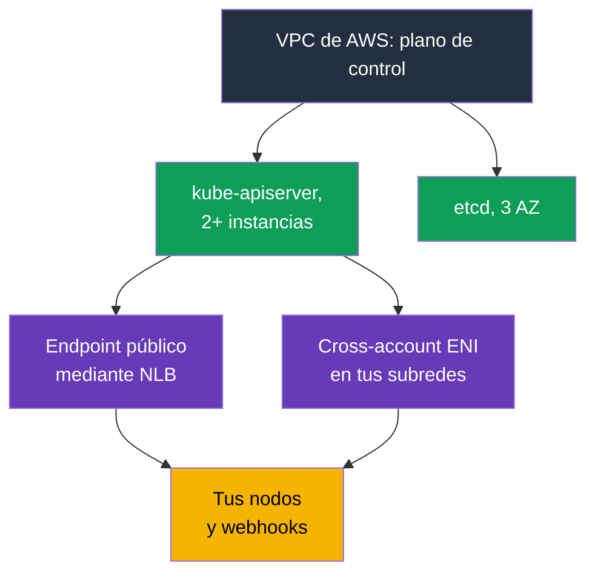
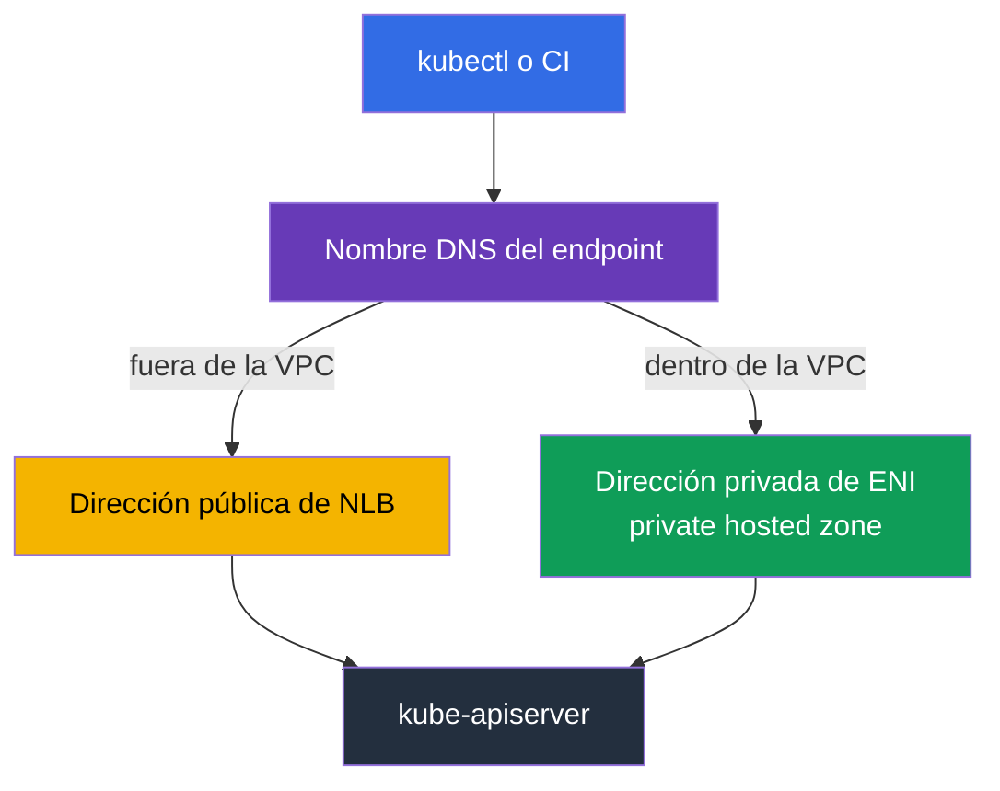
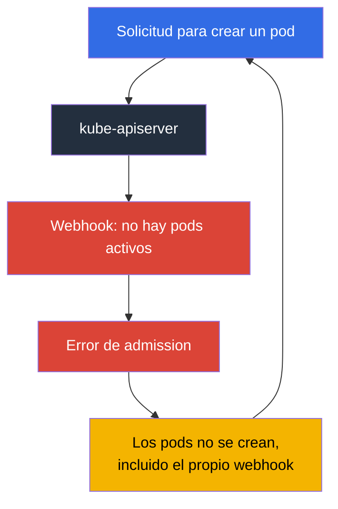

[Русская версия](ru.md) · [Eng version](en.md) · [Version française](fr.md) · [Deutsche Version](de.md) · [ქართული ვერსია](ge.md) · [繁體中文版](tw.md) · [日本語版](jp.md)
# Capítulo 2. Plano de control de EKS: endpoints público y privado, versiones de plataforma, SLA y logs

> **Qué sigue.** Ya se ha explicado el límite de responsabilidades (capítulo 1); ahora toca hablar en detalle de lo que está del lado de AWS. El plano de control no se ve en `kubectl`, pero no es una abstracción: tiene una dirección, interfaces de red en tus subredes, un security group, su propio nivel de parche, sus propios logs y un SLA. La mitad de los incidentes de «el clúster no está disponible» y «los pods no se crean» se explican precisamente por esta configuración, y no por Kubernetes. El capítulo 3 continuará con el tema de las versiones y sus plazos de soporte.

## 2.1. El clúster funciona, pero no se encuentra el plano de control

La primera tarea típica en un clúster nuevo es cerrar el acceso al servidor de API. El ingeniero va a buscar instancias del plano de control en EC2, no las encuentra, va a la consola de VPC a buscar el endpoint en la lista de VPC endpoints y tampoco está allí. No es un error: el **plano de control vive en una VPC propiedad de AWS**; no hay instancias suyas en tu cuenta. La documentación indica explícitamente que el endpoint privado del clúster no es un endpoint de PrivateLink habitual y no se muestra en la consola de VPC.

Lo que sí hay del plano de control en tu VPC: al crear el clúster, EKS crea en las subredes que indicaste **cross-account elastic network interfaces**, de 2 a 4 interfaces de red que pertenecen al servicio, pero viven en tus direcciones. A través de ellas circula el tráfico desde el plano de control hacia tus recursos: acceso al kubelet en el puerto 10250 (esto es `kubectl exec`, `logs`, `port-forward`, `attach`, `cp`), llamadas a admission webhooks, acceso al proveedor OIDC y a tus aggregated API servers. En sentido contrario, desde los nodos al servidor de API, el tráfico va al endpoint del clúster.



La consecuencia práctica: **las subredes indicadas al crear el clúster no pueden considerarse secundarias**. Necesitan direcciones libres, y no solo al inicio: para modificar la configuración de logs del plano de control, EKS requiere hasta cinco direcciones IP libres en cada subred. Si se terminan las direcciones, la operación no se realiza.

## 2.2. Cluster security group: qué permite y a qué no está sujeto

Junto con el clúster, EKS crea un security group con un nombre como `eks-cluster-sg-<cluster>-<uniqueID>`. Las reglas predeterminadas son: todo el tráfico entrante desde sí mismo (source self) y todo el tráfico saliente a `0.0.0.0/0`. Este mismo grupo se adjunta automáticamente a los cross-account ENI del clúster y a las interfaces de nodos de los managed node groups, por lo que, de fábrica, el plano de control y los nodos se ven por completo.

Es importante entender exactamente qué controla. El cluster security group gestiona dos tipos de conexiones: el acceso al **private endpoint** y el acceso a la **kubelet API**. No afecta en absoluto al endpoint público; este solo se restringe mediante la lista de CIDR.

| Qué haces | Qué se necesita en el cluster security group |
|-------------|------------------------------------|
| Lo dejas tal cual | ingress from self + egress `0.0.0.0/0`, todo funciona, pero las reglas son lo más amplias posible |
| Eliminas el egress amplio | mínimo: TCP 443 y TCP 10250 en el cluster security group, TCP y UDP 53 para DNS |
| `kubectl exec` y `logs` | el plano de control debe poder llegar al kubelet de los nodos en 10250; de lo contrario, los comandos se quedan bloqueados |
| Acceso desde bastion u oficina al private endpoint | ingress TCP 443 desde el origen (SG del bastion, CIDR de la oficina o red de tránsito) |
| Eliminas las reglas self | EKS las restaurará en la siguiente actualización del clúster; el servicio también restaura las etiquetas |

Los nodos también necesitan acceso saliente: a la API de EKS para registrarse y a ECR y S3 para obtener imágenes. Sobre los clústeres privados sin salida a Internet y los VPC endpoints necesarios, consulta el capítulo 19.

```bash
# Configuración completa de red del clúster: modos, subredes y security group
aws eks describe-cluster --name demo --query 'cluster.resourcesVpcConfig'

# Solo el identificador del cluster security group
aws eks describe-cluster --name demo \
  --query 'cluster.resourcesVpcConfig.clusterSecurityGroupId' --output text
```

## 2.3. Modos de acceso al endpoint y cómo falla cada uno

De forma predeterminada, un clúster nuevo se crea con un endpoint público: `endpointPublicAccess=true`, `endpointPrivateAccess=false`. Es cómodo y también es la primera objeción de una auditoría. Hay tres combinaciones disponibles, y cada una tiene su propia mecánica de tráfico.

| Modo | Flags | Cómo circula el tráfico | Cómo se gestiona el acceso |
|-------|-------|------------------|------------------------|
| Solo público (predeterminado) | `endpointPublicAccess=true`, `endpointPrivateAccess=false` | las solicitudes de nodos dentro de la VPC salen de la VPC, pero permanecen en la red de Amazon | solo `publicAccessCidrs` |
| Público y privado | ambos `true` | las solicitudes desde dentro de la VPC pasan por el private endpoint; desde fuera, por el público | `publicAccessCidrs` para el público, cluster security group para el privado |
| Solo privado | `endpointPublicAccess=false`, `endpointPrivateAccess=true` | todo el tráfico al servidor de API procede solo de la VPC o de una red conectada | solo cluster security group; `publicAccessCidrs` no se aplica |

Cuando se habilita el acceso privado, EKS crea en tu nombre una **private hosted zone en Route 53** y la asocia con la VPC del clúster. La zona la gestiona el servicio y no aparece en tus recursos de Route 53. Para que el nombre del endpoint se resuelva a una dirección privada, la VPC debe tener habilitados `enableDnsHostnames` y `enableDnsSupport`, y el DHCP options set debe usar `AmazonProvidedDNS`. Este es exactamente el caso en el que «el clúster se creó, los nodos no se conectan» no se explica por EKS, sino por la configuración de VPC (capítulo 0.3).

Hay otra sutileza sobre el modo solo privado: ahora el nombre del endpoint se resuelve mediante DNS públicos a una dirección privada desde la VPC, mientras que antes solo se resolvía dentro de la VPC. Si en un clúster antiguo el nombre no devuelve una dirección privada, la documentación propone habilitar el acceso público y volver a deshabilitarlo; basta con hacerlo una vez.

Fallos habituales que cuestan tiempo:

- **CI dejó de desplegar.** Los runners de SaaS viven fuera de tu red. Cambiar a private-only los rompe inevitablemente; se corrige con runners dentro de la VPC, agentes self-hosted o acceso mediante una red de tránsito. Debe comprobarse antes del cambio, no después.
- **`kubectl` desde la oficina no responde.** En private-only, el acceso a la API solo procede de la VPC o de una red conectada. Opciones válidas: un bastion host en la subred del clúster conectado mediante SSM Session Manager (sin abrir el puerto 22), AWS Client VPN, Direct Connect, transit gateway o CloudShell en la VPC. Además, el cluster security group necesita ingress 443 desde ese origen; sin él, existe la ruta, pero no el acceso.
- **Nodos en otra VPC.** El private endpoint se resuelve en la VPC del clúster. El peering por sí solo no da resolución de nombres: se necesita una asociación de zona o un resolvedor propio; de lo contrario, los nodos no encuentran la API.
- **Hybrid nodes con ambos modos habilitados.** Los nodos fuera de la VPC resuelven el nombre a direcciones públicas; la documentación recomienda elegir un modo para ellos, no ambos.
- **Cortes de conexión al escalar el plano de control.** Las instancias del servidor de API se sustituyen, el nombre empieza a devolver otras direcciones y el TTL de la zona gestionada es de 60 segundos. Los clientes que almacenan DNS en caché durante toda la vida del proceso sufren timeouts; se corrige resolviendo de nuevo el nombre y aplicando retry.

```bash
# Habilitar el private endpoint y restringir el acceso público en una operación
aws eks update-cluster-config --name demo --resources-vpc-config \
  endpointPublicAccess=true,endpointPrivateAccess=true,publicAccessCidrs=203.0.113.0/24

# Esperar a que termine: estado Successful
aws eks describe-update --name demo --update-id <id> --query 'update.status'
```



## 2.4. Endpoint público sin 0.0.0.0/0

El valor predeterminado de `publicAccessCidrs` es `0.0.0.0/0` (y además `::/0` para los clústeres dual-stack con `IPv6`). Es decir, de forma predeterminada el endpoint público es accesible desde todo Internet, y es una decisión consciente de AWS a favor de la facilidad de inicio, no un descuido.

Reducir la lista es el ajuste más económico para la seguridad del clúster: un comando y cero cambios en las cargas de trabajo. Conviene recordar lo siguiente:

- Si restringes los CIDR y **no habilitas el private endpoint**, la lista debe incluir las direcciones desde las que los nodos y los pods de Fargate acceden al endpoint público. De lo contrario, los nodos se desconectarán. La recomendación de la documentación es más sencilla: habilita private access y no adivines.
- La lista admite CIDR `IPv4`; los CIDR `IPv6` solo se aceptan en clústeres dual-stack con `ipFamily=IPv6`, creados después de octubre de 2024; de lo contrario aparecerá el error `The following CIDRs are invalid in publicAccessCidrs`.
- Las direcciones de oficina y VPN cambian. La lista de CIDR es una configuración viva en código (capítulo 4), no una modificación puntual en la consola; de lo contrario, algún día te cerrará el acceso a ti mismo.

Y lo principal: **es un filtro de red, no autenticación**. La restricción por CIDR no reemplaza ni IAM ni RBAC. Una solicitud desde una dirección permitida sigue pasando la comprobación del principal de IAM y la autorización RBAC (capítulo 5), y una solicitud desde una dirección permitida con un rol de administrador comprometido tendrá éxito. También se produce el error contrario: considerar que private-only es motivo suficiente para conceder `cluster-admin` a todo el mundo.

## 2.5. El plano de control te llama: webhooks

Este es el momento que rompe la idea de que «el plano de control está aislado». Los admission webhooks de validación y mutación los llama el **servidor de API**, es decir, el tráfico va desde la VPC de AWS a tu VPC a través de cross-account ENI, normalmente al puerto 443 y, con mayor frecuencia, a un Service de tu controlador. Por tanto, la disponibilidad de tus pods se convierte en una condición para el funcionamiento del servidor de API.

De ahí surge el incidente más frustrante en EKS: **el webhook no está disponible, los pods no se crean**.



El ciclo se cierra: el webhook está caído porque sus pods no se crean, y los pods no se crean porque el webhook está caído. Lo más frecuente es que ocurra después de escalar el clúster a cero nodos, tras mover el webhook a spot o con `failurePolicy: Fail` y reglas amplias. Lo que AWS recomienda y lo que funciona en la práctica:

- No crear webhooks «catch-all» con `apiGroups: ["*"]`, `resources: ["*"]`, `operations: ["*"]`.
- Mantener el timeout claramente por debajo de 30 segundos y elegir conscientemente `failurePolicy`. Fail-open reduce el riesgo de bloquear operaciones críticas; fail-closed conserva la garantía de la política. La elección se hace por objeto, no «igual en todas partes» (capítulo 22).
- Excluir `kube-system` y el namespace del propio controlador del ámbito de acción del webhook.
- Mantener el webhook en varias instancias y en distintas AZ, con PDB (capítulo 40).
- Recordar la red: la ruta del plano de control al webhook debe estar abierta. De forma predeterminada, AWS gestiona el egress del plano de control (`controlPlaneEgressMode=AWS_MANAGED`); el modo `CUSTOMER_ROUTED` te entrega esta ruta junto con la responsabilidad de las rutas, NACL y security groups, y el cambio a este modo es unidireccional: no se puede volver a `AWS_MANAGED`. Es importante comprender el límite: el tráfico entre el plano de control y los nodos mediante el cluster ENI (incluida la kubelet API en 10250) no depende de tu dispositivo de egress; lo que se rompe es precisamente lo que sale hacia fuera: llamadas a webhooks y autenticación OIDC.

## 2.6. Platform version: el nivel de parche que crece por sí mismo

`kubectl get --raw /version` muestra la versión de Kubernetes, pero no indica qué plano de control de EKS la atiende exactamente. Para eso existe la **platform version**, con formato `eks.14`.

Describe las capacidades del plano de control de EKS dentro de la versión menor de Kubernetes: qué flags del servidor de API están habilitados, qué conjunto de admission controllers está activo y cuál es el nivel de parche actual de Kubernetes. La numeración es independiente para cada versión menor: empieza en `eks.1` y se incrementa cuando AWS publica configuraciones nuevas del plano de control o correcciones de seguridad; es decir, `eks.1` en 1.30 y `eks.1` en 1.31 son compilaciones distintas del plano de control. La diferencia clave frente a la versión de Kubernetes: **no inicias la actualización de la platform version**. AWS eleva por sí mismo los clústeres existentes a la platform version actual de su versión menor, desplegándola gradualmente. Las nuevas platform versions no introducen breaking changes ni provocan tiempo de inactividad.

| Pregunta | Versión de Kubernetes | Platform version |
|--------|-------------------|------------------|
| Quién inicia el cambio | tú, mediante una llamada a la API de EKS (capítulo 38) | AWS, automáticamente |
| Formato | `1.33` | `eks.14` |
| Introduce cambios incompatibles | sí, para eso se prepara | no |
| Qué contiene | versión de Kubernetes y su API | flags de apiserver, conjunto de admission plugins, parche de Kubernetes |
| Cuándo es tu problema | siempre: plazo de soporte, plan de actualización | si el clúster queda retrasado más de dos platform versions |

La última fila es el único motivo práctico para mirar la platform version durante una guardia. Un retraso de más de dos versiones significa que la actualización automática no se realizó, y conviene investigarlo en la sección de troubleshooting de la documentación, no ignorarlo.

```bash
# Versión de Kubernetes, platform version y estado del clúster
aws eks describe-cluster --name demo \
  --query 'cluster.[version,platformVersion,status]' --output text

# Qué está habilitado en los logs del plano de control ahora mismo
aws eks describe-cluster --name demo --query 'cluster.logging'
```

## 2.7. Logs del plano de control: cinco tipos, y no existen de forma predeterminada

Ya no existe `ssh` al master, ni `kubectl logs -n kube-system kube-apiserver-...` (capítulo 1). El único canal es **CloudWatch Logs**, y está deshabilitado de forma predeterminada. El clúster funciona, ocurre un incidente y no hay historial: los logs que no se habilitaron previamente no aparecerán de forma retroactiva. Es lo primero que se configura en un clúster nuevo.

Hay exactamente cinco tipos, y en la API se llaman así: `api`, `audit`, `authenticator`, `controllerManager`, `scheduler`.

| Tipo | Qué contiene | Cuándo ayuda |
|-----|-----------|---------------|
| `api` | logs del componente kube-apiserver; si se habilita al crearlo, al inicio del flujo se ven los flags con los que se inició el servidor de API | análisis de errores y timeouts de API, comprensión de la configuración del plano de control |
| `audit` | quién, cuándo, con qué solicitud y con qué resultado modificó objetos del clúster: usuarios, administradores, componentes del sistema | «quién eliminó el namespace», investigación de incidentes, cumplimiento (capítulo 21) |
| `authenticator` | componente exclusivo de EKS: autenticación RBAC mediante credenciales de IAM | `You must be logged in to the server`, depuración de access entries e IRSA (capítulos 5, 47) |
| `controllerManager` | control loops estándar de Kubernetes | objetos que no se crean o eliminan, finalizadores bloqueados, problemas de controladores |
| `scheduler` | decisiones sobre dónde y cuándo iniciar pods | pods en `Pending` sin eventos claros, conflictos de affinity y topology spread |

Qué es importante saber antes de habilitarlos:

- El log group se llama `/aws/eks/<cluster-name>/cluster`, los flujos se organizan por componentes, con nombres como `kube-apiserver-audit-<id>`; al crecer se rotan, y el más reciente se identifica por el último evento. La entrega se realiza en cuestión de minutos y se declara como best effort.
- La habilitación se hace por tipos y por clúster, mediante consola, CLI o API. El nivel de verbosity al habilitarla es 2. Recuerda las direcciones: cambiar la configuración requiere hasta cinco IP libres en cada subred.
- **Esto cuesta dinero.** La tarifa de EKS sigue siendo la estándar, y además se aplican las tarifas habituales de CloudWatch Logs por ingestion, almacenamiento y escaneo de datos. El tipo de mayor volumen es `audit`; en un clúster activo puede convertirse en una partida notable de la factura.
- El retention se configura en CloudWatch Logs, no en EKS. Un log group sin un plazo de retención configurado guarda datos indefinidamente y con coste. Por eso, justo después de habilitar los logs se llama a `aws logs put-retention-policy` en `/aws/eks/<cluster>/cluster` con un plazo razonable (normalmente 7-14 días en el flujo), y el archivo de largo plazo se envía a S3 (capítulos 34 y 43). Práctica: `audit` siempre está habilitado y el retention se establece explícitamente.

```bash
# Habilitar dos tipos; el resto se añade a la misma lista
aws eks update-cluster-config --name demo \
  --logging '{"clusterLogging":[{"types":["api","audit"],"enabled":true}]}'

# Los cinco tipos de una vez
TYPES='["api","audit","authenticator","controllerManager","scheduler"]'
aws eks update-cluster-config --name demo \
  --logging "{\"clusterLogging\":[{\"types\":$TYPES,\"enabled\":true}]}"

# Ver si existe el log group y cuál es su retention
aws logs describe-log-groups --log-group-name-prefix /aws/eks/demo \
  --query 'logGroups[].[logGroupName,retentionInDays]' --output table

# Establecer retention: sin él, el log group acumula logs indefinidamente
aws logs put-retention-policy --log-group-name /aws/eks/demo/cluster \
  --retention-in-days 14

# Seguimiento en vivo de la auditoría
aws logs tail /aws/eks/demo/cluster \
  --log-stream-name-prefix kube-apiserver-audit --since 10m --follow
```

## 2.8. Observabilidad del plano de control: los 429 te llegan a ti

Un plano de control gestionado no significa «no hace falta vigilarlo». Un controlador mal escrito, un script con `kubectl` en un bucle, mil pods creados de golpe, y el servidor de API empieza a responder `429 Too Many Requests`. Es protección, no un fallo: el servidor de API limita el número de solicitudes simultáneas y prefiere rechazar las sobrantes antes que degradarse. **API Priority and Fairness** gestiona la distribución de esta cuota entre los tipos de solicitudes mediante FlowSchema y PriorityLevelConfiguration; en EKS, estos objetos se gestionan automáticamente y se utiliza la configuración predeterminada para la versión menor. La cuota aumenta junto con el escalado del plano de control, y el clúster tiene al menos dos servidores de API, de modo que la capacidad total es mayor que la de uno único, pero no es infinita.

Las métricas del plano de control están disponibles mediante la API: `kubectl get --raw /metrics`, en formato Prometheus. Qué conviene recopilar (los capítulos 33 y 34 explican dónde hacerlo exactamente):

| Qué observar | Métricas | Qué indica un aumento |
|--------------|---------|--------------------|
| Latencia de API | `apiserver_request_duration_seconds` | plano de control o etcd bajo carga, solicitudes sin paginación, LIST pesados |
| Errores y throttling | `apiserver_request_total` por code | un pico de 429 significa que un cliente está asfixiando el clúster; para 5xx, revisar los logs `api` |
| Admission | `apiserver_admission_controller_admission_duration_seconds`, `apiserver_admission_webhook_rejection_count` | webhook lento o que rechaza, tu propio freno (sección 2.5) |
| etcd | `etcd_request_duration_seconds`, `apiserver_storage_size_bytes` | aproximación al límite de tamaño de la base de datos: al llenarse, el clúster pasa a read-only |
| Clientes | `rest_client_requests_total` | qué controlador genera el flujo principal de solicitudes |

```bash
# Métricas del servidor de API en formato Prometheus
kubectl get --raw /metrics | head -20

# Cuántas solicitudes terminaron con 429
kubectl get --raw /metrics | grep 'apiserver_request_total.*code="429"'

# Configuración actual de prioridades de solicitudes
kubectl get flowschemas
kubectl get prioritylevelconfigurations
```

Hábitos económicos que eliminan la mitad de los problemas: no ejecutar `kubectl` en bucles, no perder la caché de cliente (`--cache-dir`) en contenedores, usar PDB para que la salida de pods y nodos no se convierta en una avalancha de actualizaciones de EndpointSlice, y no escalar el clúster en saltos de decenas de puntos porcentuales de una vez.

## 2.9. SLA, multizona y lo que sigue siendo tu responsabilidad

El plano de control de EKS es multizona desde el principio: como mínimo dos instancias del servidor de API y tres instancias de etcd en tres zonas de disponibilidad de una región, cada clúster con su plano de control separado, sin compartirse con otros clústeres ni cuentas. EKS sustituye por sí mismo una instancia que falla, si es necesario en otra AZ, y ajusta automáticamente la capacidad del plano de control a la carga.

Sobre esta arquitectura se construye el SLA: para los clústeres con un plano de control estándar, AWS se compromete a proporcionar disponibilidad del Kubernetes endpoint con un Monthly Uptime Percentage de al menos **99,95%** en un ciclo de facturación mensual, medido en intervalos de cinco minutos. Para los clústeres con provisioned control plane (modo en que la capacidad del plano de control se asigna por adelantado mediante niveles de precios) se declara un SLA mayor de 99,99%, medido por minuto. Las condiciones vigentes y el procedimiento de compensación están siempre en la página del SLA del servicio.

Lo que la multizona del plano de control no te proporciona:

| Sigue siendo tu tarea | Por qué |
|------------------------|--------|
| Nodos en distintas AZ | el plano de control sobrevivirá al fallo de una zona, pero tu Deployment en nodos de una sola AZ no (capítulo 40) |
| Subredes para nodos en distintas AZ y direcciones libres | de lo contrario, simplemente no hay dónde distribuir la carga (capítulos 6, 7) |
| topology spread, PDB, apagado correcto de nodos | la disponibilidad de la aplicación no se hereda de la disponibilidad de la API (capítulo 40) |
| Vinculación de volúmenes EBS a una AZ | un volumen no se mueve entre zonas junto con el pod (capítulo 23) |
| Disponibilidad de tus webhooks y addons | sección 2.5 y capítulo 37: tú los derribas, pero admission sufre las consecuencias |
| Multirregión | el SLA es regional; un clúster en una región y DR es trabajo separado (capítulo 42) |

La formulación para hablar con el negocio: el SLA cubre la disponibilidad del **endpoint del servidor de API**, no la disponibilidad de tu aplicación. La aplicación puede estar caída con un plano de control que funciona perfectamente, y será por completo tu incidente.

## 2.10. Cómo se aplica en producción

- **Ambos modos de endpoint están habilitados y el público se restringe.** `endpointPrivateAccess=true` más `publicAccessCidrs` de los rangos de oficina y VPN. El private-only completo es un paso consciente para el que se preparan previamente CI, bastion y DNS.
- **Configuración del endpoint en código.** Los modos, CIDR, security groups y tipos de logs se guardan en Terraform o eksctl (capítulo 4). Un cambio en la consola dura hasta el siguiente `apply`.
- **Logs habilitados desde el primer día.** Como mínimo `audit` y `authenticator`, con retention configurado explícitamente y filtros de métricas y alarmas para eventos sospechosos en `audit` (capítulo 21).
- **Métricas del plano de control en el dashboard.** Latencia de API, proporción de 429 y 5xx, duración de admission y tamaño de la base de etcd. Un pico de 429 se investiga como incidente: se busca el cliente.
- **Los webhooks se consideran parte del plano de control.** Ámbito de acción estrecho, timeout reducido, `kube-system` excluido, varias réplicas en distintas AZ y PDB.
- **El cluster security group no es «todo permitido» ni «todo prohibido».** Se conservan las reglas mínimas de la documentación, más un ingress 443 explícito para bastion y la red de tránsito.

## 2.11. Mini glosario

- **Cluster endpoint**: dirección de la API de Kubernetes del clúster. El **public endpoint** es accesible desde Internet y solo se limita mediante la lista CIDR; el **private endpoint** es accesible desde la VPC y se limita mediante el cluster security group.
- **`endpointPublicAccess` / `endpointPrivateAccess`**: flags booleanos del modo de acceso; de forma predeterminada `true` y `false`. **`publicAccessCidrs`**: lista de CIDR autorizados para el endpoint público; por defecto, `0.0.0.0/0`.
- **Cross-account ENI**: interfaces de red que EKS crea en tus subredes para conectar el plano de control con los nodos, la kubelet API, webhooks y OIDC. **Cluster security group**: grupo creado automáticamente para el clúster y adjuntado a estas interfaces y a los nodos de managed node groups.
- **Private hosted zone**: zona de Route 53 que EKS crea y asocia con tu VPC para que el nombre del endpoint se resuelva a una dirección privada.
- **Platform version**: nivel de parche y conjunto de capacidades del plano de control de EKS dentro de una versión menor de Kubernetes; formato `eks.<n>`, actualizado automáticamente por AWS.
- **Tipos de logs del plano de control**: `api`, `audit`, `authenticator`, `controllerManager`, `scheduler`; se escriben en CloudWatch Logs solo después de habilitarlos.
- **API Priority and Fairness**: mecanismo de Kubernetes que distribuye la cuota de solicitudes simultáneas entre sus tipos; al agotarse, el cliente recibe `429`.

## 2.12. Conclusiones del capítulo

- El plano de control vive en una VPC de AWS, pero en tus subredes tiene cross-account ENI (2-4) y un cluster security group. Por ellos circula el tráfico al kubelet en 10250, a webhooks y a OIDC.
- El cluster security group gestiona el private endpoint y la kubelet API, pero no el endpoint público. El público se limita solo mediante `publicAccessCidrs`, cuyo valor predeterminado es `0.0.0.0/0`.
- Hay tres modos de acceso: solo público (predeterminado), público y privado, y solo privado. Cambiar el modo rompe lo que vive fuera de la VPC: runners de CI de SaaS, `kubectl` desde la oficina y nodos en una VPC con peering. El acceso privado requiere una private hosted zone y una configuración DNS correcta en la VPC.
- La restricción por CIDR es un filtro de red, no autenticación: IAM y RBAC siguen siendo obligatorios.
- El servidor de API llama a tus webhooks; un webhook no disponible con reglas amplias detiene la creación de pods y crea un ciclo sobre sí mismo.
- La platform version es el nivel de parche del plano de control y aumenta por sí sola; tu reacción solo es necesaria si el clúster se ha retrasado más de dos versiones.
- Los cinco tipos de logs del plano de control están deshabilitados de forma predeterminada, se escriben en CloudWatch Logs y cuestan dinero; el retention se configura en CloudWatch.
- El plano de control se distribuye en tres AZ y el SLA de disponibilidad del endpoint en el modo estándar es del 99,95%. La multizona de la aplicación, los volúmenes y los webhooks sigue siendo tu responsabilidad.

## 2.13. Cómo resultará útil en el trabajo real

Tres situaciones de guardia. La primera: «el clúster no está disponible». La pregunta no es sobre Kubernetes, sino de dónde llegó la solicitud y qué modo de endpoint está habilitado; `describe-cluster` con `resourcesVpcConfig` responde en diez segundos. La segunda: «los pods no se crean, events está vacío». Se comprueba admission: métricas del webhook y logs de `api`; y si los logs no se habilitaron, lo descubrirás en el peor momento, por eso se habilitan antes. La tercera: auditoría pide mostrar quién eliminó un recurso. La respuesta solo está en `audit`, y solo si está habilitado y aún no ha superado el retention. Además, restringir `publicAccessCidrs` y habilitar el private endpoint son los puntos más económicos de cualquier lista de seguridad de EKS: minutos de trabajo, sin cambios en las aplicaciones.

## 2.14. Preguntas de autoevaluación

1. ¿Por qué el private endpoint del clúster no se ve en la lista de VPC endpoints?
2. ¿Qué es un cross-account ENI, en qué subredes se crea y qué tráfico circula por él?
3. ¿Qué dos tipos de conexiones gestiona el cluster security group y cuál no gestiona?
4. Enumera los tres modos de acceso al endpoint e indica los valores predeterminados de los flags.
5. Cambiaste el clúster a private-only. ¿Qué se romperá en CI y en tu `kubectl`?
6. ¿Para qué crea EKS una private hosted zone y qué configuración de VPC es obligatoria para ella?
7. ¿Cuál es el valor predeterminado de `publicAccessCidrs` y por qué restringirlo no sustituye a RBAC?
8. Los nodos dejaron de registrarse después de restringir el acceso público. ¿Qué olvidaste?
9. ¿Por qué un validating webhook no disponible detiene la creación de pods y cómo se rompe el ciclo?
10. ¿En qué se diferencia la platform version de la versión de Kubernetes y quién la actualiza?
11. Nombra los cinco tipos de logs del plano de control y aquel en el que buscar «quién eliminó el
    namespace».
12. El servidor de API responde `429`. ¿Qué significa y por dónde empezarías el análisis?
13. ¿Qué cubre el SLA de EKS y qué sigue siendo tu responsabilidad si falla una AZ?

## Práctica

El capítulo todavía no tiene laboratorio, pero todo lo que contiene se puede consultar en cualquier clúster accesible: `aws eks describe-cluster` con `--query 'cluster.resourcesVpcConfig'` mostrará los modos, CIDR y el cluster security group; `--query 'cluster.[version,platformVersion]'`, las versiones; `--query 'cluster.logging'`, qué tipos de logs están habilitados. Después, `aws logs describe-log-groups --log-group-name-prefix /aws/eks` y `kubectl get --raw /metrics`. El capítulo 3 pasa a las versiones de Kubernetes: plazos de soporte, standard y extended support, y estrategia de actualizaciones.

---
[Índice](../README_ES.md) · [Capítulo 1](../01/es.md) · [Capítulo 3](../03/es.md)
