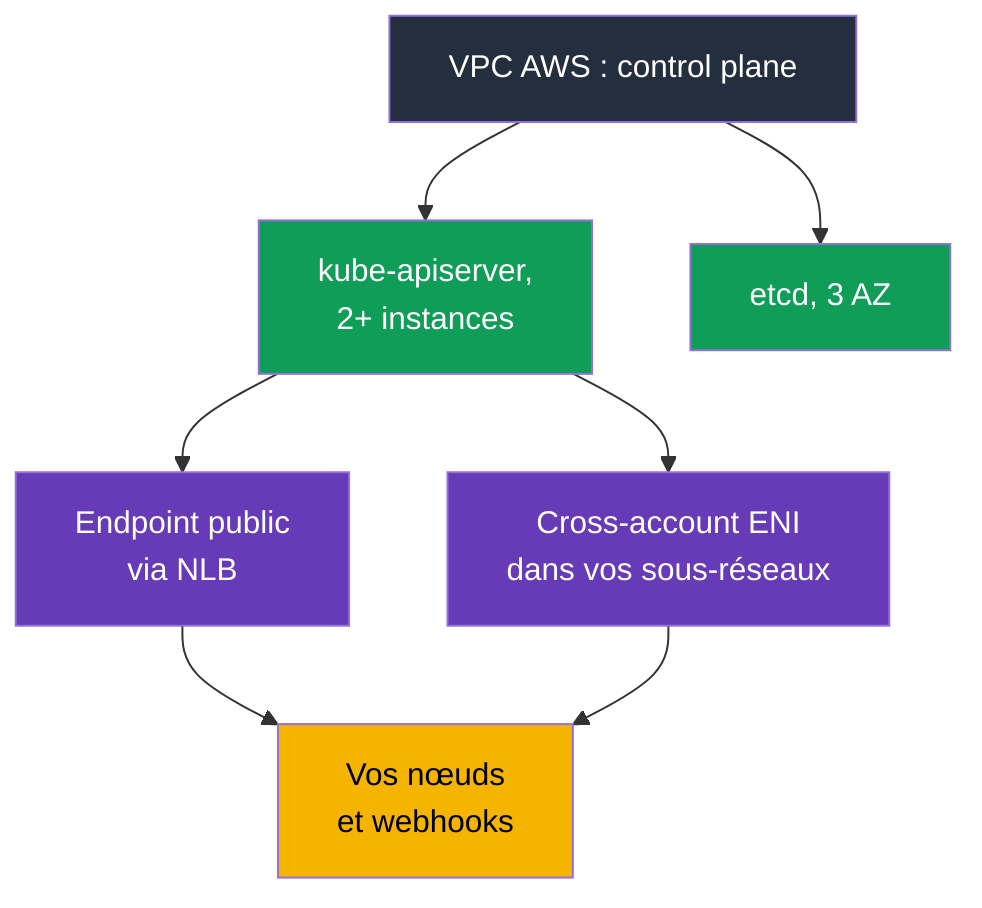
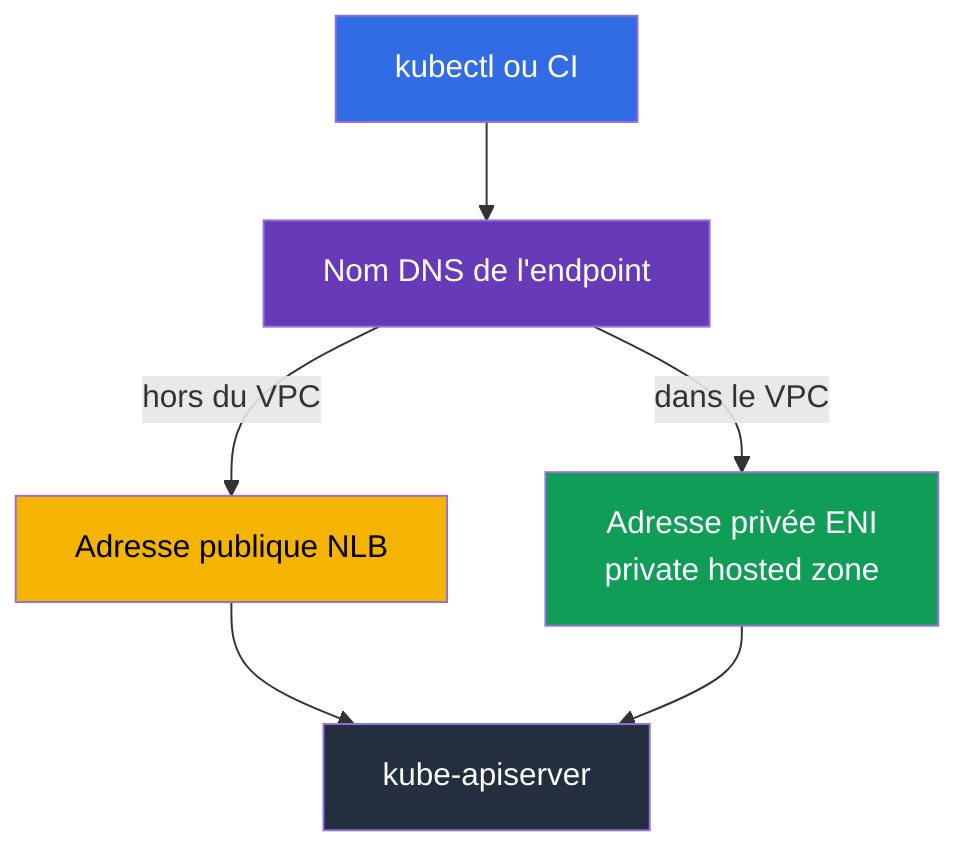
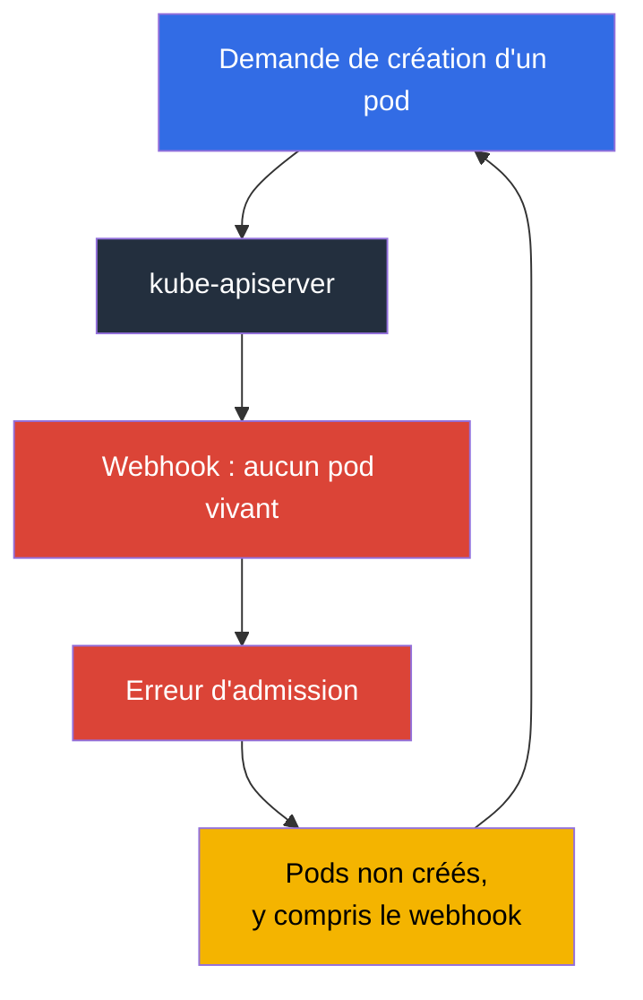

[Русская версия](ru.md) · [Eng version](en.md) · [Versión en español](es.md) · [Deutsche Version](de.md) · [ქართული ვერსია](ge.md) · [繁體中文版](tw.md) · [日本語版](jp.md)
# Chapitre 2. Control plane EKS : endpoint public et privé, platform versions, SLA et logs

> **La suite.** La frontière des responsabilités a été examinée (chapitre 1) ; voyons maintenant concrètement ce qui relève d'AWS. Le control plane n'est pas visible dans `kubectl`, mais ce n'est pas une abstraction : il possède une adresse, des interfaces réseau dans vos sous-réseaux, une security group, son propre niveau de patch, ses logs et son SLA. La moitié des incidents « cluster indisponible » et « pods non créés » s'explique par ces paramètres, et non par Kubernetes. Le chapitre 3 poursuivra avec les versions et leurs périodes de support.

## 2.1. Le cluster fonctionne, mais le control plane est introuvable

La première tâche habituelle sur un nouveau cluster consiste à fermer l'accès au serveur API. L'ingénieur cherche les instances du control plane dans EC2, ne les trouve pas, puis cherche l'endpoint dans la liste des VPC endpoints de la console VPC, sans plus de résultat. Ce n'est pas une erreur : le **control plane vit dans un VPC détenu par AWS**, et votre compte ne contient pas ses instances. La documentation indique explicitement que le private endpoint du cluster n'est pas un endpoint PrivateLink ordinaire et n'apparaît pas dans la console VPC.

Ce qui existe malgré tout dans votre VPC : lors de la création du cluster, EKS crée dans les sous-réseaux indiqués des **cross-account elastic network interfaces**, de 2 à 4 interfaces réseau appartenant au service mais utilisant vos adresses. Le trafic du control plane vers vos ressources les emprunte : accès au kubelet sur le port 10250 (`kubectl exec`, `logs`, `port-forward`, `attach`, `cp`), appels des admission webhooks, de l'OIDC provider et de vos aggregated API servers. En sens inverse, les nœuds accèdent au serveur API par l'endpoint du cluster.



Conséquence pratique : **les sous-réseaux indiqués à la création du cluster ne sont pas secondaires**. Ils ont besoin d'adresses libres, et pas seulement au départ : pour modifier la configuration des logs du control plane, EKS demande jusqu'à cinq adresses IP libres dans chaque sous-réseau. Plus d'adresses signifie que l'opération échoue.

## 2.2. Cluster security group : ce qu'elle autorise et ce qui ne lui obéit pas

Avec le cluster, EKS crée une security group appelée `eks-cluster-sg-<cluster>-<uniqueID>`. Ses règles par défaut sont tout trafic entrant depuis elle-même (source self) et tout trafic sortant vers `0.0.0.0/0`. Cette même groupe est automatiquement associée aux cross-account ENI du cluster et aux interfaces des nœuds des managed node groups, donc, par défaut, control plane et nœuds se voient entièrement.

Il faut savoir exactement ce qu'elle contrôle. La cluster security group régit deux types de connexions : l'accès au **private endpoint** et au **kubelet API**. Elle n'a aucun effet sur l'endpoint public, qui n'est limité que par la liste des CIDR.

| Action | Ce qui est requis dans la cluster security group |
|-------------|------------------------------------|
| Ne rien changer | ingress from self + egress `0.0.0.0/0`, tout fonctionne, mais les règles sont très larges |
| Supprimer le large egress | minimum : TCP 443 et TCP 10250 dans la cluster security group, TCP et UDP 53 pour DNS |
| `kubectl exec` et `logs` | le control plane doit atteindre le kubelet des nœuds sur 10250, sinon les commandes restent bloquées |
| Accès depuis un bastion ou le bureau au private endpoint | ingress TCP 443 depuis la source (SG du bastion, CIDR du bureau ou réseau de transit) |
| Supprimer les règles self | EKS les recrée à la prochaine mise à jour du cluster ; le service restaure aussi les tags |

Les nœuds nécessitent séparément un accès sortant : vers l'API EKS pour leur enregistrement et vers ECR et S3 pour les images. Les clusters privés sans accès Internet et les VPC endpoints nécessaires sont abordés au chapitre 19.

```bash
# Configuration réseau complète du cluster : modes, sous-réseaux, SG
aws eks describe-cluster --name demo --query 'cluster.resourcesVpcConfig'

# Uniquement l'identifiant de la cluster security group
aws eks describe-cluster --name demo \
  --query 'cluster.resourcesVpcConfig.clusterSecurityGroupId' --output text
```


## 2.3. Modes d'accès à l'endpoint et ce que chacun peut casser

Un nouveau cluster est créé par défaut avec un endpoint public : `endpointPublicAccess=true`, `endpointPrivateAccess=false`. C'est pratique, et c'est aussi la première remarque d'un audit. Trois combinaisons sont possibles, chacune avec son propre chemin de trafic.

| Mode | Flags | Chemin du trafic | Contrôle de l'accès |
|-------|-------|------------------|---------------------|
| Public seul (par défaut) | `endpointPublicAccess=true`, `endpointPrivateAccess=false` | les demandes des nœuds dans le VPC sortent du VPC mais restent sur le réseau Amazon | seulement `publicAccessCidrs` |
| Public et privé | les deux à `true` | les demandes internes passent par le private endpoint, les demandes externes par le public | `publicAccessCidrs` pour le public, cluster security group pour le privé |
| Privé seul | `endpointPublicAccess=false`, `endpointPrivateAccess=true` | tout trafic vers l'API-server uniquement depuis le VPC ou un réseau connecté | uniquement cluster security group ; `publicAccessCidrs` est sans effet |

Quand le private access est activé, EKS crée en votre nom une **private hosted zone dans Route 53** et l'associe au VPC du cluster. Elle est administrée par le service et invisible dans vos ressources Route 53. Pour que le nom d'endpoint se résolve en adresse privée, le VPC doit activer `enableDnsHostnames` et `enableDnsSupport`, et son DHCP options set doit contenir `AmazonProvidedDNS`. Voilà pourquoi « le cluster est créé, les nœuds ne se connectent pas » peut s'expliquer par le VPC, non par EKS (chapitre 0.3).

Autre nuance du privé seul : le nom d'endpoint se résout désormais depuis le VPC, par DNS public, en adresse privée ; auparavant il ne se résolvait que depuis le VPC. Pour un ancien cluster dont le nom ne renvoie pas l'adresse privée, la documentation conseille d'activer puis de désactiver l'accès public : une seule fois suffit.

Pannes fréquentes qui coûtent du temps :

- **Le CI ne déploie plus.** Les runners SaaS vivent hors de votre réseau. Le private-only les casse nécessairement ; utilisez des runners dans le VPC, des agents self-hosted ou un accès par réseau de transit. Vérifiez avant la bascule.
- **`kubectl` du bureau ne répond pas.** En private-only, l'API est accessible seulement depuis le VPC ou un réseau connecté. Bastion dans le sous-réseau avec SSM Session Manager (sans ouvrir 22), AWS Client VPN, Direct Connect, transit gateway ou CloudShell dans le VPC sont possibles. La cluster security group doit aussi avoir un ingress 443 depuis cette source.
- **Nœuds dans un autre VPC.** Le private endpoint se résout dans le VPC du cluster. Le peering seul ne résout pas le nom : il faut associer la zone ou installer son propre résolveur.
- **Hybrid nodes avec les deux modes actifs.** Les nœuds hors VPC résolvent le nom sur des adresses publiques ; la documentation recommande un seul mode pour eux.
- **Connexions coupées lors du scale de la Control Plane.** Des instances API-server sont remplacées, le nom renvoie de nouvelles adresses et le TTL de la zone gérée est de 60 secondes. Les clients qui mettent DNS en cache pour toute leur durée de vie subissent des timeouts ; résolvez à nouveau le nom et ajoutez des retries.

```bash
# Ouvrir le private endpoint et restreindre l'accès public en une opération
aws eks update-cluster-config --name demo --resources-vpc-config \
  endpointPublicAccess=true,endpointPrivateAccess=true,publicAccessCidrs=203.0.113.0/24

# Attendre la fin : statut Successful
aws eks describe-update --name demo --update-id <id> --query 'update.status'
```



## 2.4. Endpoint public sans 0.0.0.0/0

La valeur par défaut de `publicAccessCidrs` est `0.0.0.0/0` (et `::/0` pour les clusters dual-stack avec `IPv6`). L'endpoint public est donc, par défaut, disponible depuis tout Internet : c'est un choix AWS pour faciliter le démarrage, non un oubli.

Restreindre la liste est la correction de sécurité la moins coûteuse du cluster : une commande, aucune modification des workloads. Retenez ceci :

- Si vous restreignez les CIDR **sans activer le private endpoint**, la liste doit inclure les adresses depuis lesquelles les nœuds et pods Fargate atteignent l'endpoint public ; sinon les nœuds se déconnectent. La recommandation de la documentation est plus simple : activez le private access.
- La liste accepte des CIDR `IPv4`; les CIDR `IPv6` ne sont admis que pour les clusters dual-stack avec `ipFamily=IPv6`, créés après octobre 2024, sinon l'erreur est `The following CIDRs are invalid in publicAccessCidrs`.
- Les adresses de bureau et VPN changent. La liste CIDR est une configuration vivante en code (chapitre 4), pas une modification unique dans la console.

Surtout, **c'est un filtre réseau, pas une authentification**. Restreindre les CIDR ne remplace ni IAM ni RBAC. Une demande provenant d'une adresse autorisée passe toujours l'identité IAM et l'autorisation RBAC (chapitre 5), tandis qu'un rôle d'administrateur compromis depuis cette adresse réussira toujours. L'erreur inverse existe aussi : considérer private-only comme une raison de distribuer `cluster-admin` à tout le monde.

## 2.5. Le Control Plane vous appelle : webhooks

Les admission webhooks validants et mutateurs sont appelés par l'**API-server** : le trafic va donc du VPC AWS vers votre VPC par les cross-account ENI, généralement au port 443, le plus souvent vers le Service de votre contrôleur. La disponibilité de vos pods devient ainsi une condition du fonctionnement de l'API-server.

L'incident EKS le plus frustrant est : **webhook indisponible - les pods ne sont pas créés**.



Le cycle se referme : le webhook est indisponible car ses pods ne sont pas créés, et les pods ne sont pas créés car le webhook est indisponible. Cela arrive après un scale à zéro nœud, le déplacement du webhook sur du spot, ou `failurePolicy: Fail` associé à des règles larges. Recommandations AWS et pratique :

- Ne créez pas de webhook « catch-all » avec `apiGroups: ["*"]`, `resources: ["*"]`, `operations: ["*"]`.
- Maintenez le timeout nettement sous 30 secondes et choisissez `failurePolicy` consciemment. Fail-open réduit le risque de bloquer les opérations critiques ; fail-closed conserve la garantie de politique. Le choix s'effectue par objet, pas uniformément (chapitre 22).
- Excluez `kube-system` et le namespace du contrôleur de la portée du webhook.
- Exécutez plusieurs répliques de webhook dans différentes AZ avec un PDB (chapitre 40).
- Le chemin réseau doit être ouvert. Par défaut, AWS gère l'egress de la Control Plane (`controlPlaneEgressMode=AWS_MANAGED`); `CUSTOMER_ROUTED` vous transfère ce chemin, les routes, NACL et security groups, et est irréversible : retour à `AWS_MANAGED` impossible. Le trafic Control Plane-nœuds via cluster ENI, y compris kubelet API 10250, ne dépend pas de votre dispositif egress ; seuls les appels sortants, notamment webhooks et authentification OIDC, sont concernés.

## 2.6. Platform version : le niveau de patch qui progresse seul

`kubectl get --raw /version` affiche la version Kubernetes, sans révéler la Control Plane EKS qui la sert. Pour cela existe la **platform version**, par exemple `eks.14`.

Elle décrit les capacités de la Control Plane EKS dans une version Kubernetes mineure : flags d'API-server actifs, admission controllers actifs et niveau de patch Kubernetes courant. La numérotation est indépendante par version mineure, commence à `eks.1` et augmente lorsque AWS publie paramètres de Control Plane ou correctifs de sécurité. Ainsi, `eks.1` en 1.30 et `eks.1` en 1.31 sont des builds distincts. Différence essentielle : **vous ne lancez pas une mise à jour de platform version**. AWS élève progressivement les clusters existants à la platform version courante de leur mineure. Les nouvelles versions ne provoquent ni breaking change ni indisponibilité.

| Question | Version Kubernetes | Platform version |
|--------|-------------------|------------------|
| Qui initie le changement | vous, via l'API EKS (chapitre 38) | AWS, automatiquement |
| Format | `1.33` | `eks.14` |
| Apporte des changements incompatibles | oui, il faut s'y préparer | non |
| Contenu | version Kubernetes et API | flags apiserver, admission plugins, patch Kubernetes |
| Quand cela devient votre problème | toujours : support et plan d'upgrade | si le cluster a plus de deux platform versions de retard |

La dernière ligne est la seule raison pratique de vérifier la platform version en astreinte. Un retard supérieur à deux versions indique que la mise à jour automatique a échoué : consultez la section troubleshooting de la documentation plutôt que de l'ignorer.

```bash
# Version Kubernetes, platform version et statut du cluster
aws eks describe-cluster --name demo \
  --query 'cluster.[version,platformVersion,status]' --output text

# Logging Control Plane actuellement activé
aws eks describe-cluster --name demo --query 'cluster.logging'
```

## 2.7. Logs du Control Plane : cinq types, désactivés par défaut

Il n'y a plus de `ssh` vers le master ni de `kubectl logs -n kube-system kube-apiserver-...` (chapitre 1). L'unique canal est **CloudWatch Logs**, désactivé par défaut. Le cluster peut fonctionner, l'incident survenir, et aucun historique ne peut être reconstruit : les logs non activés à l'avance ne réapparaissent pas. C'est la première configuration d'un nouveau cluster.

Les cinq types, exactement tels que l'API les nomme, sont `api`, `audit`, `authenticator`, `controllerManager`, `scheduler`.

| Type | Contenu | Quand il aide |
|-----|-----------|---------------|
| `api` | logs de kube-apiserver ; si activé à la création, les flags de démarrage sont au début du flux | erreurs et timeouts API, configuration de la Control Plane |
| `audit` | qui a modifié quel objet, quand, par quelle demande et avec quel résultat | « qui a supprimé le namespace », incident et conformité (chapitre 21) |
| `authenticator` | composant EKS d'authentification RBAC par credentials IAM | `You must be logged in to the server`, access entries et IRSA (chapitres 5, 47) |
| `controllerManager` | control loops Kubernetes standard | objets bloqués, finalizers suspendus, problèmes de contrôleurs |
| `scheduler` | décisions d'emplacement et de lancement des pods | pods `Pending`, conflits affinity et topology spread |

À connaître avant l'activation : la Log Group s'appelle `/aws/eks/<cluster-name>/cluster`, les flux sont par composant, tels que `kube-apiserver-audit-<id>`, et le plus récent est déterminé par son dernier événement. La livraison prend quelques minutes et relève du best effort. L'activation est faite par type, par cluster, par console, CLI ou API ; le niveau de verbosity est 2 et la modification demande jusqu'à cinq IP libres dans chaque sous-réseau. **Cela coûte de l'argent** : aux coûts EKS s'ajoutent ingestion, stockage et scan CloudWatch Logs ; `audit` est le plus volumineux. La retention est configurée dans CloudWatch Logs, pas dans EKS. Une Log Group sans durée conserve et facture les données indéfiniment : définissez donc `aws logs put-retention-policy` pour `/aws/eks/<cluster>/cluster`, par exemple 7-14 jours, et archivez à long terme dans S3 (chapitres 34 et 43). En pratique, `audit` est toujours activé avec une retention explicite.

```bash
# Activer deux types ; les autres s'ajoutent dans la même liste
aws eks update-cluster-config --name demo \
  --logging '{"clusterLogging":[{"types":["api","audit"],"enabled":true}]}'

# Les cinq types à la fois
TYPES='["api","audit","authenticator","controllerManager","scheduler"]'
aws eks update-cluster-config --name demo \
  --logging "{\"clusterLogging\":[{\"types\":$TYPES,\"enabled\":true}]}"

# Présence et retention de la Log Group
aws logs describe-log-groups --log-group-name-prefix /aws/eks/demo \
  --query 'logGroups[].[logGroupName,retentionInDays]' --output table

# Définir la retention ; sans elle, la Log Group accumule les logs indéfiniment
aws logs put-retention-policy --log-group-name /aws/eks/demo/cluster \
  --retention-in-days 14

# Suivre l'audit en direct
aws logs tail /aws/eks/demo/cluster \
  --log-stream-name-prefix kube-apiserver-audit --since 10m --follow
```

## 2.8. Observabilité du Control Plane : les 429 vous reviennent

Une Control Plane gérée ne signifie pas qu'il ne faut pas la surveiller. Un contrôleur mal écrit, un script avec `kubectl` en boucle ou mille pods créés d'un coup peuvent faire répondre l'API-server `429 Too Many Requests`. C'est une protection : il limite les requêtes simultanées et préfère rejeter l'excédent plutôt que de se dégrader. **API Priority and Fairness** répartit le quota par FlowSchema et PriorityLevelConfiguration ; EKS administre automatiquement ces objets et utilise la configuration par défaut de la mineure. Le quota augmente avec le scale de la Control Plane, qui possède au moins deux API-servers, mais il n'est pas infini.

Les métriques sont disponibles via `kubectl get --raw /metrics`, au format Prometheus.

| À surveiller | Métriques | Signification d'une hausse |
|--------------|---------|---------------------------|
| Latence API | `apiserver_request_duration_seconds` | Control Plane ou etcd en charge, LIST lourds ou sans pagination |
| Erreurs et throttling | `apiserver_request_total` par code | hausse 429 : le client étouffe le cluster ; 5xx : consulter les logs `api` |
| Admission | `apiserver_admission_controller_admission_duration_seconds`, `apiserver_admission_webhook_rejection_count` | webhook lent ou rejetant, votre propre frein (section 2.5) |
| etcd | `etcd_request_duration_seconds`, `apiserver_storage_size_bytes` | limite de taille de base proche ; pleine, elle passe read-only |
| Clients | `rest_client_requests_total` | quel contrôleur génère le flux principal |

```bash
# Métriques API-server au format Prometheus
kubectl get --raw /metrics | head -20

# Nombre de requêtes terminées en 429
kubectl get --raw /metrics | grep 'apiserver_request_total.*code="429"'

# Configuration courante des priorités de requêtes
kubectl get flowschemas
kubectl get prioritylevelconfigurations
```

Quelques habitudes peu coûteuses évitent la moitié des problèmes : ne lancez pas `kubectl` dans des boucles, conservez le cache client (`--cache-dir`) dans les conteneurs, utilisez des PDB pour que le départ de pods et nœuds ne devienne pas une avalanche de mises à jour EndpointSlice, et ne scalez pas le cluster par bonds de dizaines de pour cent.


## 2.9. SLA, multi-AZ et ce qui reste tout de même à votre charge

La Control Plane EKS est multi-zones dès l'origine : au moins deux instances API-server et trois instances etcd dans trois zones de disponibilité d'une région, chaque cluster possédant sa Control Plane isolée des autres clusters et comptes. EKS remplace lui-même une instance défaillante, au besoin dans une autre AZ, et ajuste la puissance de la Control Plane à la charge.

Cette architecture fonde le SLA : pour les clusters avec standard control plane, AWS s'engage sur une disponibilité du Kubernetes endpoint avec un Monthly Uptime Percentage d'au moins **99,95 %** par cycle de facturation mensuel, mesuré à des intervalles de cinq minutes. Pour provisioned control plane, où la capacité est préallouée par niveaux tarifaires, le SLA annoncé est 99,99 %, mesuré chaque minute. Les conditions à jour et le processus de compensation restent sur la page SLA du service.

Ce que la multi-zonalité de la Control Plane ne vous donne pas :

| Reste votre tâche | Pourquoi |
|------------------------|--------|
| Nœuds dans plusieurs AZ | la Control Plane survivra à une AZ, mais pas votre Deployment sur les nœuds d'une seule AZ (chapitre 40) |
| Sous-réseaux de nœuds dans plusieurs AZ et adresses libres | sinon, il n'y a nulle part où répartir la charge (chapitres 6, 7) |
| topology spread, PDB, arrêt correct des nœuds | la disponibilité de l'application n'est pas héritée de celle de l'API (chapitre 40) |
| Affinité des volumes EBS à une AZ | un volume ne se déplace pas avec le pod entre zones (chapitre 23) |
| Disponibilité des webhooks et addons | sections 2.5 et chapitre 37 : vous les faites tomber, l'admission en souffre |
| Multi-région | le SLA est régional ; DR est un travail distinct (chapitre 42) |

Formulation pour l'entreprise : le SLA couvre la disponibilité de **l'endpoint API-server**, pas celle de votre application. Votre application peut être indisponible avec une Control Plane parfaite, et l'incident reste entièrement le vôtre.

## 2.10. Application en production

- **Les deux modes endpoint sont activés, le public est restreint.** `endpointPrivateAccess=true` avec `publicAccessCidrs` des plages bureau et VPN. Le private-only est une décision consciente, préparée par CI, bastion et DNS.
- **Configuration d'endpoint en code.** Modes, CIDR, security groups et types de logs sont dans Terraform ou eksctl (chapitre 4). Une correction dans la console vit jusqu'au prochain `apply`.
- **Logs dès le premier jour.** Au minimum `audit` et `authenticator`, avec retention explicite et filtres métriques/alertes sur les événements `audit` suspects (chapitre 21).
- **Métriques Control Plane sur le dashboard.** Latence API, proportion de 429 et 5xx, durée d'admission, taille etcd. Une hausse de 429 est un incident : recherchez le client.
- **Les webhooks sont une partie de la Control Plane.** Portée étroite, timeout court, `kube-system` exclu, plusieurs répliques en AZ différentes et PDB.
- **La cluster security group n'est ni « tout autorisé » ni « tout interdit ».** Conservez les règles minimales documentées, plus un ingress 443 explicite pour le bastion et le réseau de transit.

## 2.11. Mini-glossaire

- **Cluster endpoint** : adresse de l'API Kubernetes du cluster. Le **public endpoint** est accessible depuis Internet et limité seulement par les CIDR ; le **private endpoint** est accessible depuis le VPC et limité par la cluster security group.
- **`endpointPublicAccess` / `endpointPrivateAccess`** : flags booléens du mode d'accès ; par défaut `true` et `false`. **`publicAccessCidrs`** est la liste CIDR autorisée sur l'endpoint public, par défaut `0.0.0.0/0`.
- **Cross-account ENI** : interfaces créées par EKS dans vos sous-réseaux pour relier la Control Plane aux nœuds, kubelet API, webhooks et OIDC. **Cluster security group** : groupe automatiquement créé, attaché à ces interfaces et aux nœuds des managed node groups.
- **Private hosted zone** : zone Route 53 créée et associée à votre VPC par EKS afin que le nom d'endpoint se résolve en adresse privée.
- **Platform version** : niveau de patch et capacités de la Control Plane EKS dans une mineure Kubernetes, format `eks.<n>`, mis à jour automatiquement par AWS.
- **Types de logs Control Plane** : `api`, `audit`, `authenticator`, `controllerManager`, `scheduler`, envoyés dans CloudWatch Logs uniquement après activation.
- **API Priority and Fairness** : mécanisme Kubernetes qui répartit le quota de requêtes simultanées entre leurs types ; le client reçoit `429` lorsqu'il est épuisé.

## 2.12. Résumé du chapitre

- La Control Plane vit dans un VPC AWS, mais vos sous-réseaux contiennent 2-4 cross-account ENI et la cluster security group. Ils portent le trafic vers kubelet sur 10250, webhooks et OIDC.
- La cluster security group gère private endpoint et kubelet API, pas le public endpoint. Ce dernier est limité uniquement par `publicAccessCidrs`, par défaut `0.0.0.0/0`.
- Trois modes existent : public seul (par défaut), public et privé, privé seul. Un changement casse ce qui vit hors VPC : runners CI SaaS, `kubectl` du bureau, nœuds d'une VPC peerée. Private access exige private hosted zone et DNS VPC correct.
- Restreindre par CIDR est un filtre réseau, non une authentification : IAM et RBAC restent obligatoires.
- L'API-server appelle vos webhooks ; un webhook indisponible avec règles larges arrête la création de pods et crée son propre cycle.
- La platform version est le patch de la Control Plane, progresse seule ; vous réagissez seulement si le cluster a plus de deux versions de retard.
- Les cinq types de logs Control Plane sont désactivés par défaut, écrits dans CloudWatch Logs et payants ; la retention est configurée côté CloudWatch.
- La Control Plane est répartie sur trois AZ ; le SLA standard d'endpoint est 99,95 %. Multi-zonalité de l'application, volumes et webhooks restent votre responsabilité.

## 2.13. Utilité dans le travail réel

Trois situations d'astreinte. Première : « cluster indisponible ». La question n'est pas Kubernetes mais l'origine de la requête et le mode endpoint actif ; `describe-cluster` avec `resourcesVpcConfig` répond en dix secondes. Deuxième : « les pods ne se créent pas, les events sont vides ». Vérifiez l'admission, les métriques de webhook et les logs `api`; si les logs n'étaient pas activés, vous le découvrez au pire moment, donc activez-les en amont. Troisième : l'audit demande qui a supprimé une ressource. La réponse n'existe que dans `audit`, s'il est activé et pas encore purgé par la retention. Enfin, restreindre `publicAccessCidrs` et activer le private endpoint sont les mesures les moins coûteuses d'une checklist de sécurité EKS : quelques minutes, sans modifier les applications.

## 2.14. Questions d'auto-évaluation

1. Pourquoi le private endpoint d'un cluster n'est-il pas visible dans les VPC endpoints ?
2. Qu'est-ce qu'une cross-account ENI, dans quels sous-réseaux est-elle créée et quel trafic y passe ?
3. Quels deux types de connexion sont contrôlés par la cluster security group, et lequel ne l'est pas ?
4. Citez les trois modes d'accès à l'endpoint et les valeurs des flags par défaut.
5. Vous passez en private-only. Que cassez-vous dans CI et dans votre `kubectl` ?
6. Pourquoi EKS crée-t-il une private hosted zone, et quelles options VPC sont obligatoires ?
7. Quelle est la valeur par défaut de `publicAccessCidrs`, et pourquoi sa restriction ne remplace-t-elle pas RBAC ?
8. Les nœuds ne s'enregistrent plus après une restriction de l'accès public. Qu'avez-vous oublié ?
9. Pourquoi un validating webhook indisponible empêche-t-il les pods d'être créés, et comment casser le cycle ?
10. En quoi platform version diffère-t-elle de la version Kubernetes, et qui la met à jour ?
11. Nommez les cinq types de logs Control Plane et celui où chercher « qui a supprimé le namespace ».
12. L'API-server répond `429`. Que signifie-t-il et par quoi commencez-vous l'analyse ?
13. Que couvre le SLA EKS et que reste-t-il de votre responsabilité lors d'une panne d'AZ ?

## Pratique

Cette chapitre n'a pas encore de lab, mais tout peut être observé sur un cluster accessible : `aws eks describe-cluster` avec `--query 'cluster.resourcesVpcConfig'` montre modes, CIDR et cluster security group ; `--query 'cluster.[version,platformVersion]'` montre les versions ; `--query 'cluster.logging'` montre les types de logs actifs. Ensuite, utilisez `aws logs describe-log-groups --log-group-name-prefix /aws/eks` et `kubectl get --raw /metrics`. Le chapitre 3 passe aux versions Kubernetes : périodes de support, standard et extended support, stratégie d'upgrade.

---
[Sommaire](../README_FR.md) · [Chapitre 1](../01/fr.md) · [Chapitre 3](../03/fr.md)