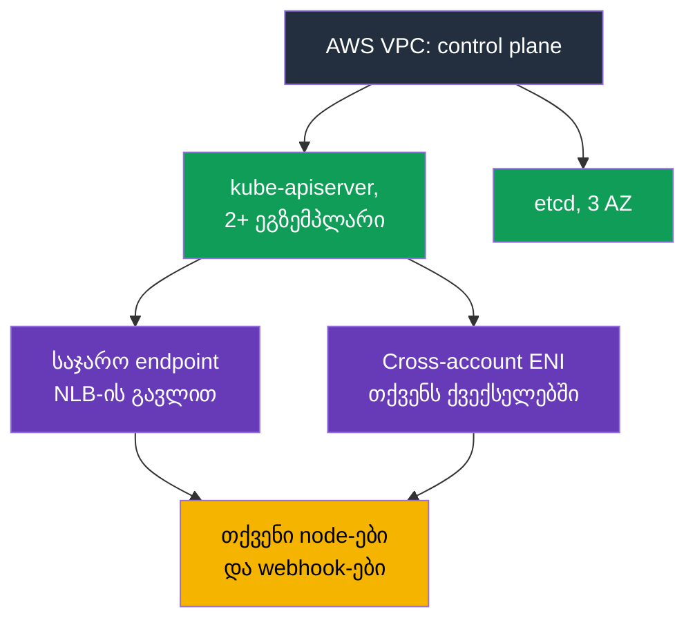
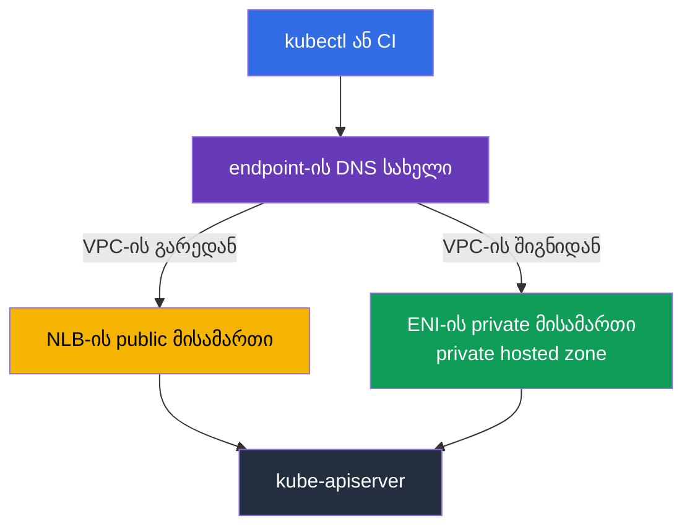
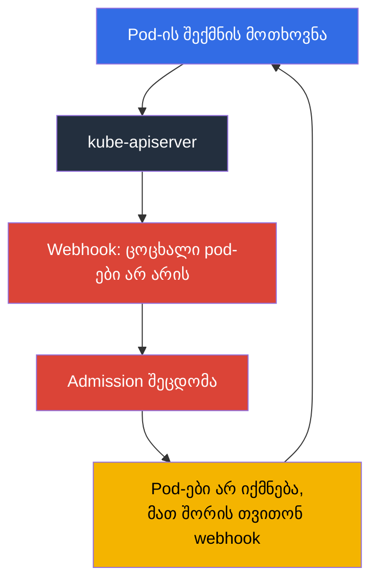

[Русская версия](ru.md) · [Eng version](en.md) · [Versión en español](es.md) · [Version française](fr.md) · [Deutsche Version](de.md) · [繁體中文版](tw.md) · [日本語版](jp.md)
# თავი 2. EKS control plane: public და private endpoint, platform version-ები, SLA, ლოგები

> **რა გველოდება შემდეგ.** პასუხისმგებლობის საზღვარი განხილულია (თავი 1), ახლა კონკრეტულად იმაზე, რაც AWS-ის მხარესაა. Control plane `kubectl`-ში არ ჩანს, მაგრამ ის აბსტრაქცია არ არის: მას აქვს მისამართი, თქვენს ქვექსელებში ქსელური ინტერფეისები, security group, საკუთარი patch-დონე, ლოგები და SLA. ინციდენტების ნახევარი, როგორიცაა „კლასტერი მიუწვდომელია“ და „pod-ები არ იქმნება“, სწორედ ამ პარამეტრებით აიხსნება და არა Kubernetes-ით. თავი 3 გააგრძელებს ვერსიებისა და მათი მხარდაჭერის ვადების თემით.

## 2.1. კლასტერი მუშაობს, მაგრამ control plane ვერ იპოვეთ

ახალ კლასტერზე ტიპური პირველი ამოცანაა API-სერვერზე წვდომის შეზღუდვა. ინჟინერი control plane-ის instance-ებს EC2-ში ეძებს, ვერ პოულობს, შემდეგ VPC console-ში ეძებს endpoint-ს VPC endpoint-ების სიაში, და იქაც არ არის. ეს შეცდომა არ არის: **control plane AWS-ის კუთვნილ VPC-ში ცხოვრობს**, თქვენს ანგარიშში მისი instance-ები არ არის. დოკუმენტაციაში პირდაპირ წერია, რომ კლასტერის private endpoint ჩვეულებრივი PrivateLink endpoint არ არის და VPC console-ში არ ჩანს.

რაც control plane-იდან მაინც არის თქვენს VPC-ში: კლასტერის შექმნისას EKS თქვენს მითითებულ ქვექსელებში ქმნის **cross-account elastic network interface-ებს**, 2-დან 4-მდე ქსელურ ინტერფეისს, რომლებიც სერვისს ეკუთვნის, მაგრამ თქვენს მისამართებზეა განთავსებული. მათი საშუალებით control plane-დან თქვენს რესურსებამდე მიდის ტრაფიკი: kubelet-ზე 10250 პორტით მიმართვა (ესაა `kubectl exec`, `logs`, `port-forward`, `attach`, `cp`), admission webhook-ების გამოძახება, OIDC provider-სა და თქვენს aggregated API server-ებთან მიმართვა. საპირისპიროდ, node-ებიდან API-სერვერამდე ტრაფიკი კლასტერის endpoint-ზე მიდის.



პრაქტიკული შედეგი: **კლასტერის შექმნისას მითითებული ქვექსელები მეორეხარისხოვნად არ უნდა ჩაითვალოს**. მათში თავისუფალი მისამართებია საჭირო და არა მხოლოდ დასაწყისში: control plane-ის ლოგირების კონფიგურაციის შესაცვლელად EKS თითოეულ ქვექსელში ხუთამდე თავისუფალ IP მისამართს მოითხოვს. მისამართები თუ ამოიწურა, ოპერაცია ვერ შესრულდება.

## 2.2. Cluster security group: რას ატარებს და რას არ ექვემდებარება

კლასტერთან ერთად EKS ქმნის security group-ს სახელით `eks-cluster-sg-<cluster>-<uniqueID>`. ნაგულისხმევი წესებია: მთელი შემომავალი ტრაფიკი საკუთარი თავისგან (source self) და მთელი გამავალი ტრაფიკი `0.0.0.0/0`-ში. ეს ჯგუფი ავტომატურად ემატება კლასტერის cross-account ENI-ებსა და managed node group-ებიდან node-ების ინტერფეისებს, ამიტომ თავიდანვე control plane და node-ები ერთმანეთთან სრულად დაკავშირებულია.

მნიშვნელოვანია, ზუსტად რას აკონტროლებს ის. Cluster security group მართავს ორი სახის შეერთებას: **private endpoint**-ზე წვდომას და **kubelet API**-ზე წვდომას. ის public endpoint-ზე საერთოდ არ მოქმედებს, public endpoint მხოლოდ CIDR სიის მიერ იზღუდება.

| რას აკეთებთ | რა არის საჭირო cluster security group-ში |
|-------------|------------------------------------------|
| უცვლელად ტოვებთ | ingress from self + egress `0.0.0.0/0`, ყველაფერი მუშაობს, თუმცა წესები მაქსიმალურად ფართოა |
| ფართო egress-ს შლით | მინიმუმ: TCP 443 და TCP 10250 cluster security group-ში, DNS-ისთვის TCP და UDP 53 |
| `kubectl exec` და `logs` | control plane-მა node-ების kubelet-მდე 10250 პორტზე უნდა მიაღწიოს, თორემ ბრძანებები გაჩერდება |
| bastion-იდან ან ოფისიდან private endpoint-ზე წვდომა | ingress TCP 443 წყაროდან (bastion-ის SG, ოფისის CIDR ან transit ქსელი) |
| self წესებს შლით | EKS მათ კლასტერის მომდევნო განახლებისას დააბრუნებს; სერვისი tag-ებსაც აღადგენს |

node-ებს ცალკე სჭირდება გამავალი წვდომა: EKS API-მდე რეგისტრაციისთვის, ECR-სა და S3-მდე image-ებისთვის. ინტერნეტში გასვლის გარეშე private კლასტერებისა და საჭირო VPC endpoint-ების შესახებ, იხილეთ თავი 19.

```bash
# კლასტერის სრული ქსელური კონფიგურაცია: რეჟიმები, ქვექსელები, SG
aws eks describe-cluster --name demo --query 'cluster.resourcesVpcConfig'

# მხოლოდ cluster security group-ის იდენტიფიკატორი
aws eks describe-cluster --name demo \
  --query 'cluster.resourcesVpcConfig.clusterSecurityGroupId' --output text
```

## 2.3. Endpoint-ზე წვდომის რეჟიმები და რით ფუჭდება თითოეული

ახალი კლასტერი ნაგულისხმევად public endpoint-ით იქმნება: `endpointPublicAccess=true`, `endpointPrivateAccess=false`. ეს მოსახერხებელია და ამავე დროს აუდიტის პირველი შენიშვნაა. ხელმისაწვდომია სამი კომბინაცია და თითოეულს ტრაფიკის საკუთარი მექანიკა აქვს.

| რეჟიმი | ფლაგები | როგორ მიდის ტრაფიკი | რით იმართება წვდომა |
|-------|-------|---------------------|---------------------|
| მხოლოდ public (ნაგულისხმევად) | `endpointPublicAccess=true`, `endpointPrivateAccess=false` | VPC-ში არსებული node-ების მოთხოვნები VPC-დან გადის, თუმცა Amazon-ის ქსელში რჩება | მხოლოდ `publicAccessCidrs` |
| Public და private | ორივე `true` | VPC-დან მოთხოვნები private endpoint-ით მიდის, გარედან კი public endpoint-ით | public-ისთვის `publicAccessCidrs`, private-ისთვის cluster security group |
| მხოლოდ private | `endpointPublicAccess=false`, `endpointPrivateAccess=true` | API-სერვერისკენ მთელი ტრაფიკი მხოლოდ VPC-დან ან დაკავშირებული ქსელიდან | მხოლოდ cluster security group; `publicAccessCidrs` არ მოქმედებს |

როდესაც private access ჩართულია, EKS თქვენი სახელით ქმნის **private hosted zone-ს Route 53-ში** და მას კლასტერის VPC-ს უკავშირებს. ზონას სერვისი მართავს და თქვენს Route 53 რესურსებში არ ჩანს. იმისათვის, რომ endpoint-ის სახელი private მისამართად გადაწყდეს, VPC-ში ჩართული უნდა იყოს `enableDnsHostnames` და `enableDnsSupport`, ხოლო DHCP options set-ში უნდა იყოს `AmazonProvidedDNS`. სწორედ ის შემთხვევაა, როცა „კლასტერი შეიქმნა, node-ები არ ერთვება“ EKS-ით კი არა, VPC-ის პარამეტრებით აიხსნება (თავი 0.3).

private-only რეჟიმის კიდევ ერთი ნიუანსი: ახლა endpoint-ის სახელი public DNS-ით VPC-დან private მისამართად წყდება, მაშინ როცა ადრე ის მხოლოდ VPC-ს შიგნით წყდებოდა. თუ ხანგრძლივად მოქმედი კლასტერის სახელი private მისამართს არ აბრუნებს, დოკუმენტაცია გვთავაზობს public access ჩართოთ და ხელახლა გამორთოთ, ერთხელ საკმარისია.

ტიპური დაზიანებები, რომლებიც დროს გართმევთ:

- **CI-მ deployment შეწყვიტა.** SaaS-ში runner-ები თქვენი ქსელის გარეთ ცხოვრობენ. private-only-ზე გადართვა მათ აუცილებლად დააზიანებს; გამოსწორება ხდება VPC-ში runner-ებით, self-hosted agent-ებით ან transit ქსელის გავლით წვდომით. ეს გადართვამდე უნდა შეამოწმოთ და არა შემდეგ.
- **ოფისიდან `kubectl` არ პასუხობს.** private-only-ში API-ზე წვდომა მხოლოდ VPC-დან ან დაკავშირებული ქსელიდან მოდის. სამუშაო ვარიანტებია: კლასტერის ქვექსელში bastion host SSM Session Manager-ით (ღია 22 პორტის გარეშე), AWS Client VPN, Direct Connect, transit gateway, VPC-ში CloudShell. Cluster security group-ში ამ წყაროდან ingress 443-იც საჭიროა, თორემ გზა არსებობს, მაგრამ წვდომა არა.
- **Node-ები სხვა VPC-შია.** Private endpoint კლასტერის VPC-ში წყდება. მხოლოდ peering სახელის გადაწყვეტას არ იძლევა: საჭიროა ზონის ასოციაცია ან საკუთარი resolver, თორემ node-ები API-ს ვერ იპოვიან.
- **Hybrid node-ები ორივე ჩართული რეჟიმით.** VPC-ის გარეთ node-ები სახელს public მისამართებად წყვეტენ; დოკუმენტაცია მათთვის გირჩევთ ერთი რეჟიმი აირჩიოთ და არა ორივე.
- **Control plane-ის მასშტაბირებისას შეერთებები წყდება.** API-სერვერის ეგზემპლარები იცვლება, სახელი სხვა მისამართებს აბრუნებს, ხოლო managed ზონაში TTL 60 წამია. კლიენტები, რომლებიც DNS-ს პროცესის მთელი სიცოცხლისთვის ინახავენ, timeout-ებს იღებენ; მკურნალობაა სახელის ხელახალი გადაწყვეტა და retry.

```bash
# Private endpoint-ის გახსნა და public access-ის შეზღუდვა ერთი ოპერაციით
aws eks update-cluster-config --name demo --resources-vpc-config \
  endpointPublicAccess=true,endpointPrivateAccess=true,publicAccessCidrs=203.0.113.0/24

# დასრულებას დაელოდეთ: სტატუსი Successful
aws eks describe-update --name demo --update-id <id> --query 'update.status'
```



## 2.4. Public endpoint `0.0.0.0/0`-ის გარეშე

`publicAccessCidrs`-ის ნაგულისხმევი მნიშვნელობაა `0.0.0.0/0` (და დამატებით `::/0` `IPv6`-ით dual-stack კლასტერებისთვის). ანუ public endpoint ნაგულისხმევად მთელი ინტერნეტიდან არის ხელმისაწვდომი. ეს AWS-ის გაცნობიერებული გადაწყვეტილებაა მარტივი დასაწყისისთვის და არა უყურადღებობა.

სიის შეზღუდვა კლასტერის უსაფრთხოებაში ყველაზე იაფი შესწორებაა: ერთი ბრძანება და დატვირთვებში ნულოვანი ცვლილება. გასათვალისწინებელია:

- თუ CIDR-ს ზღუდავთ და **private endpoint არ ჩაგირთავთ**, სიაში აუცილებლად უნდა მოხვდეს მისამართები, რომლებითაც node-ები და Fargate pod-ები public endpoint-ს მიმართავენ. სხვაგვარად node-ები გაითიშება. დოკუმენტაციის რჩევა მარტივია: ჩართეთ private access და გამოცნობას მოეშვით.
- სიაში `IPv4` CIDR-ები შედის; `IPv6` CIDR მიიღება მხოლოდ `ipFamily=IPv6`-ის მქონე dual-stack კლასტერებში, რომლებიც 2024 წლის ოქტომბრის შემდეგ შეიქმნა, სხვაგვარად მიიღებთ შეცდომას `The following CIDRs are invalid in publicAccessCidrs`.
- ოფისისა და VPN-ის მისამართები იცვლება. CIDR სია ცოცხალი კონფიგურაციაა კოდში (თავი 4) და არა კონსოლში ერთჯერადი შესწორება, თორემ ერთ დღეს თქვენივე წვდომას დახურავს.

და მთავარი: **ეს ქსელური ფილტრია და არა ავთენტიკაცია**. CIDR-ით შეზღუდვა არც IAM-ს ცვლის და არც RBAC-ს. დაშვებული მისამართიდან მოთხოვნა მაინც გადის IAM principal-ის შემოწმებასა და RBAC ავტორიზაციას (თავი 5), ხოლო კომპრომეტირებული administrator role-ით დაშვებული მისამართიდან მოთხოვნა წარმატებულია. საპირისპირო შეცდომაც ხშირია: private-only საკმარის საფუძვლად ჩათვალოთ, რომ ყველას `cluster-admin` მისცეთ.

## 2.5. Control plane გიკავშირდებათ: webhook-ები

ეს არღვევს წარმოდგენას, რომ control plane იზოლირებულია. Validating და mutating admission webhook-ებს **API-სერვერი** იძახებს, ანუ ტრაფიკი AWS VPC-დან თქვენს VPC-მდე cross-account ENI-ით მიდის, როგორც წესი 443 პორტზე და ყველაზე ხშირად თქვენი controller-ის Service-მდე. შესაბამისად, თქვენი pod-ების ხელმისაწვდომობა API-სერვერის მუშაობის პირობად იქცევა.

აქედან მოდის EKS-ის ყველაზე საწყენი ინციდენტი: **webhook მიუწვდომელია, pod-ები არ იქმნება**.



ციკლი იკვრება: webhook გამორთულია, რადგან მისი pod-ები არ იქმნება, ხოლო pod-ები არ იქმნება, რადგან webhook გამორთულია. ყველაზე ხშირად ეს ხდება კლასტერის ნულ node-მდე შემცირების შემდეგ, webhook-ის spot-ზე გადატანის შემდეგ ან ფართო წესებით `failurePolicy: Fail`-ის შემდეგ. რას გირჩევთ AWS და რა მუშაობს პრაქტიკაში:

- არ შექმნათ „catch-all“ webhook-ები `apiGroups: ["*"]`, `resources: ["*"]`, `operations: ["*"]`-ით.
- timeout მნიშვნელოვნად ნაკლები გქონდეთ 30 წამზე და გააზრებულად აირჩიოთ `failurePolicy`. Fail-open ამცირებს კრიტიკული ოპერაციების დაბლოკვის რისკს, fail-closed პოლიტიკის გარანტიას ინარჩუნებს. არჩევანი ობიექტის მიხედვით კეთდება და არა „ყველგან ერთნაირად“ (თავი 22).
- `kube-system` და თავად controller-ის namespace გამორიცხეთ webhook-ის მოქმედების არედან.
- Webhook რამდენიმე ეგზემპლარად და სხვადასხვა AZ-ში, PDB-ით შეინარჩუნეთ (თავი 40).
- ქსელი გახსოვდეთ: control plane-დან webhook-მდე გზა ღია უნდა იყოს. ნაგულისხმევად control plane-ის egress-ს AWS მართავს (`controlPlaneEgressMode=AWS_MANAGED`); `CUSTOMER_ROUTED` რეჟიმი ამ გზას თქვენ გადმოგცემთ მარშრუტების, NACL-ისა და security group-ების პასუხისმგებლობასთან ერთად, და მასზე გადასვლა ცალმხრივია, `AWS_MANAGED`-ში დაბრუნება შეუძლებელია. საზღვარი გასაგები უნდა იყოს: control plane-სა და node-ებს შორის cluster ENI-ით ტრაფიკი (მათ შორის 10250-ზე kubelet API) თქვენს egress მოწყობილებაზე არაა დამოკიდებული, ზიანდება ზუსტად ის, რაც გარეთ მიდის, webhook-ების გამოძახება და OIDC ავთენტიკაცია.

## 2.6. Platform version: patch-დონე, რომელიც თავისით იზრდება

`kubectl get --raw /version` Kubernetes ვერსიას აჩვენებს, მაგრამ არ ამბობს, ზუსტად რომელი EKS control plane ემსახურება მას. ამისთვის არსებობს `eks.14` ფორმატის **platform version**.

ის აღწერს EKS control plane-ის შესაძლებლობებს Kubernetes-ის minor ვერსიის შიგნით: რომელი API-სერვერის ფლაგებია ჩართული, რომელი admission controller-ების ნაკრებია აქტიური, Kubernetes-ის რომელი მიმდინარე patch-დონეა. ნუმერაცია დამოუკიდებელია თითოეული minor ვერსიისთვის: `eks.1`-ით იწყება და იზრდება, როცა AWS control plane-ის ახალ პარამეტრებს ან უსაფრთხოების შესწორებებს უშვებს. ანუ `eks.1` 1.30-ში და `eks.1` 1.31-ში control plane-ის სხვადასხვა build-ია. Kubernetes ვერსიისგან მთავარი განსხვავება: **platform version-ის განახლებას თქვენ არ იწყებთ**. AWS თავად ზრდის არსებულ კლასტერებს მათი minor ვერსიის მიმდინარე platform version-მდე, თანდათანობით ავრცელებს. ახალი platform version-ები breaking change-ებს არ მოაქვს და downtime-ს არ იწვევს.

| კითხვა | Kubernetes ვერსია | Platform version |
|--------|-------------------|------------------|
| ვინ იწყებს ცვლილებას | თქვენ, EKS API-ის გამოძახებით (თავი 38) | AWS, ავტომატურად |
| ფორმატი | `1.33` | `eks.14` |
| მოაქვს შეუთავსებელი ცვლილებები | დიახ, ამისთვის მზადდებიან | არა |
| რა არის შიგნით | Kubernetes ვერსია და მისი API | apiserver ფლაგები, admission plugin-ების ნაკრები, Kubernetes patch |
| როდის არის ეს თქვენი პრობლემა | ყოველთვის: მხარდაჭერის ვადა, განახლების გეგმა | თუ კლასტერი ორ platform version-ზე მეტად ჩამორჩა |

ბოლო სტრიქონი მორიგეობისას platform version-ის შემოწმების ერთადერთი პრაქტიკული მიზეზია. ორ ვერსიაზე მეტი ჩამორჩენა ნიშნავს, რომ ავტომატურმა განახლებამ ვერ გაიარა და ეს troubleshooting დოკუმენტაციის მიხედვით უნდა გაარჩიოთ, არა დააიგნოროთ.

```bash
# Kubernetes ვერსია, platform version და კლასტერის სტატუსი
aws eks describe-cluster --name demo \
  --query 'cluster.[version,platformVersion,status]' --output text

# რა არის ახლა ჩართული control plane-ის ლოგირებაში
aws eks describe-cluster --name demo --query 'cluster.logging'
```

## 2.7. Control plane-ის ლოგები: ხუთი ტიპი და ნაგულისხმევად არცერთი

master-ზე `ssh` აღარ არის, არც `kubectl logs -n kube-system kube-apiserver-...` (თავი 1). ერთადერთი არხია **CloudWatch Logs**, და ის ნაგულისხმევად გამორთულია. კლასტერი მუშაობს, ინციდენტი მოხდა, მაგრამ ისტორია არ არსებობს: ლოგები, რომლებიც წინასწარ არ ჩაგირთავთ, მოგვიანებით არ გამოჩნდება. ახალ კლასტერზე პირველი გასამართი სწორედ ესაა.

ტიპი ზუსტად ხუთია და API-ში სწორედ ასე იწოდება: `api`, `audit`, `authenticator`, `controllerManager`, `scheduler`.

| ტიპი | რა არის შიგნით | როდის გშველით |
|-----|---------------|---------------|
| `api` | kube-apiserver კომპონენტის ლოგები; თუ შექმნისასვე ჩართავთ, ნაკადის დასაწყისში ჩანს ფლაგები, რომლებითაც API-სერვერი გაეშვა | API შეცდომებისა და timeout-ების გამოძიება, control plane-ის კონფიგურაციის გაგება |
| `audit` | ვინ, როდის, რომელი მოთხოვნით და რა შედეგით შეცვალა კლასტერის ობიექტები: მომხმარებლები, ადმინისტრატორები, სისტემური კომპონენტები | „ვინ წაშალა namespace“, ინციდენტის გამოძიება, შესაბამისობა (თავი 21) |
| `authenticator` | EKS-ის უნიკალური კომპონენტი: RBAC ავთენტიკაცია IAM credentials-ით | `You must be logged in to the server`, access entry-ებისა და IRSA-ის გამართვა (თავები 5, 47) |
| `controllerManager` | Kubernetes-ის სტანდარტული control loop-ები | ობიექტები არ იქმნება ან არ იშლება, გაჭედილი finalizer-ები, controller-ების პრობლემები |
| `scheduler` | გადაწყვეტილებები, სად და როდის გაეშვას pod-ები | `Pending`-ში მყოფი pod-ები გასაგები event-ების გარეშე, affinity და topology spread კონფლიქტები |

ჩართვამდე მნიშვნელოვანია იცოდეთ:

- Log group-ის სახელია `/aws/eks/<cluster-name>/cluster`, ნაკადები კომპონენტების მიხედვითაა, სახელებით `kube-apiserver-audit-<id>`; ზრდისას ისინი როტირდება, ახალი ნაკადი ბოლო event-ით განისაზღვრება. მიწოდება რამდენიმე წუთში ხდება და best effort-ადაა გამოცხადებული.
- ჩართვა ხდება ტიპებით, კლასტერზე, console-ის, CLI-ის ან API-ის მეშვეობით. ჩართვის verbosity დონეა 2. მისამართები გახსოვდეთ: კონფიგურაციის ცვლილებისთვის ყოველ ქვექსელში ხუთამდე თავისუფალი IP არის საჭირო.
- **ეს ფული ღირს.** EKS-ის გადასახადი სტანდარტული რჩება, მას ზემოდან ემატება CloudWatch Logs-ის ჩვეულებრივი ტარიფები ingestion-ზე, შენახვასა და მონაცემების სკანირებაზე. ყველაზე მოცულობითი ტიპია `audit`; აქტიურ კლასტერზე ის ანგარიშში შესამჩნევ პუნქტად შეიძლება იქცეს.
- Retention CloudWatch Logs-ის მხარეს განისაზღვრება და არა EKS-ში. შენახვის ვადის გარეშე დატოვებული log group მონაცემებს უსასრულოდ და ფასიანად ინახავს. ამიტომ ლოგების ჩართვისთანავე `/aws/eks/<cluster>/cluster`-ზე გონივრული ვადით (ნაკადში ჩვეულებრივ 7-14 დღე) იძახებენ `aws logs put-retention-policy`, ხანგრძლივი არქივი კი S3-ში გადადის (თავები 34 და 43). პრაქტიკა: `audit` ყოველთვის ჩართულია, retention აშკარად არის მითითებული.

```bash
# ორი ტიპის ჩართვა; დანარჩენებიც იმავე სიაში ემატება
aws eks update-cluster-config --name demo \
  --logging '{"clusterLogging":[{"types":["api","audit"],"enabled":true}]}'

# ხუთივე ტიპი ერთდროულად
TYPES='["api","audit","authenticator","controllerManager","scheduler"]'
aws eks update-cluster-config --name demo \
  --logging "{\"clusterLogging\":[{\"types\":$TYPES,\"enabled\":true}]}"

# არსებობს თუ არა log group და როგორია მისი retention
aws logs describe-log-groups --log-group-name-prefix /aws/eks/demo \
  --query 'logGroups[].[logGroupName,retentionInDays]' --output table

# შენახვის ვადის მითითება: მის გარეშე log group ლოგებს უსასრულოდ აგროვებს
aws logs put-retention-policy --log-group-name /aws/eks/demo/cluster \
  --retention-in-days 14

# Audit-ის ცოცხალი კუდი
aws logs tail /aws/eks/demo/cluster \
  --log-stream-name-prefix kube-apiserver-audit --since 10m --follow
```

## 2.8. Control plane-ის დაკვირვებადობა: 429 თქვენამდე მოდის

მართული control plane არ ნიშნავს „მასზე ყურება არ გვჭირდება“. ცუდად დაწერილი controller, ციკლში გაშვებული `kubectl` სკრიპტი, ერთბაშად შექმნილი ათასი pod, და API-სერვერი იწყებს პასუხს `429 Too Many Requests`-ით. ეს დაცვაა და არა მარცხი: API-სერვერი ერთდროული მოთხოვნების რაოდენობას ზღუდავს და ზედმეტებს უარყოფას ამჯობინებს, ვიდრე დეგრადაციას. ამ კვოტის მოთხოვნების ტიპებს შორის განაწილებას **API Priority and Fairness** მართავს FlowSchema-სა და PriorityLevelConfiguration-ის მეშვეობით; EKS-ში ეს ობიექტები ავტომატურად იმართება და minor ვერსიისთვის ნაგულისხმევი კონფიგურაცია გამოიყენება. კვოტა control plane-ის მასშტაბირებასთან ერთად იზრდება, ხოლო კლასტერში მინიმუმ ორი API-სერვერია, ამიტომ საერთო გამტარუნარიანობა ერთზე მეტია, თუმცა უსასრულო არ არის.

Control plane-ის მეტრიკები API-ითაა ხელმისაწვდომი: `kubectl get --raw /metrics` Prometheus ფორმატში. რის შეგროვებას აქვს აზრი (თავები 33 და 34, თუ სად):

| რას უყურებთ | მეტრიკები | რაზე მიუთითებს ზრდა |
|-------------|----------|---------------------|
| API-ის დაყოვნება | `apiserver_request_duration_seconds` | control plane ან etcd დატვირთულია, pagination-ის გარეშე მოთხოვნები, მძიმე LIST |
| შეცდომები და throttling | `apiserver_request_total` code-ის მიხედვით | 429-ის ნახტომი, კლიენტი კლასტერს აწვება; 5xx, ნახეთ `api` ლოგები |
| Admission | `apiserver_admission_controller_admission_duration_seconds`, `apiserver_admission_webhook_rejection_count` | ნელი ან უარმყოფელი webhook, თქვენი საკუთარი შემაფერხებელი (ნაწილი 2.5) |
| etcd | `etcd_request_duration_seconds`, `apiserver_storage_size_bytes` | ბაზის ზომის ლიმიტთან მიახლოება: გადავსებისას კლასტერი read-only-ში გადადის |
| კლიენტები | `rest_client_requests_total` | რომელი controller ქმნის მოთხოვნების ძირითად ნაკადს |

```bash
# API-სერვერის მეტრიკები Prometheus ფორმატში
kubectl get --raw /metrics | head -20

# რამდენი მოთხოვნა დასრულდა 429-ით
kubectl get --raw /metrics | grep 'apiserver_request_total.*code="429"'

# მოთხოვნის პრიორიტეტების მიმდინარე კონფიგურაცია
kubectl get flowschemas
kubectl get prioritylevelconfigurations
```

იაფი ჩვევები, რომლებიც პრობლემების ნახევარს ხსნის: `kubectl` ციკლებში არ გაუშვათ, კონტეინერებში კლიენტის cache (`--cache-dir`) არ დაკარგოთ, PDB გამოიყენეთ, რათა pod-ებისა და node-ების გადინება EndpointSlice განახლებების ზვავად არ გადაიქცეს, და კლასტერი ერთბაშად ათობით პროცენტით არ გააფართოოთ.

## 2.9. SLA, მრავალზონიანობა და რაც მაინც თქვენ გრჩებათ

EKS control plane თავიდანვე მრავალზონიანია: მინიმუმ ორი API-სერვერის ეგზემპლარი და etcd-ის სამი ეგზემპლარი ერთი რეგიონის სამ availability zone-ში, თითოეულ კლასტერისთვის საკუთარი იზოლირებული control plane-ით, სხვა კლასტერებთან და ანგარიშებთან გადაკვეთის გარეშე. მწყობრიდან გამოსულ ეგზემპლარს EKS თავად ცვლის, საჭიროებისას სხვა AZ-ში, და control plane-ის სიმძლავრეს დატვირთვას თავად უსადაგებს.

ამ არქიტექტურაზეა აგებული SLA: standard control plane-ის მქონე კლასტერებისთვის AWS ვალდებულებას იღებს Kubernetes endpoint-ის ხელმისაწვდომობა თვიურ billing ციკლში მინიმუმ **99,95%** Monthly Uptime Percentage დონეზე უზრუნველყოს, ხუთწუთიანი ინტერვალებით გაზომვით. Provisioned control plane-ის კლასტერებისთვის (რეჟიმი, სადაც control plane-ის სიმძლავრე წინასწარ გამოიყოფა ტარიფის დონეებით) მითითებულია გაზრდილი 99,99% SLA, წუთობრივი გაზომვით. მიმდინარე პირობები და კომპენსაციის წესი ყოველთვის სერვისის SLA გვერდზეა.

რას არ გაძლევთ control plane-ის მრავალზონიანობა:

| თქვენი ამოცანა რჩება | რატომ |
|----------------------|-------|
| Node-ები სხვადასხვა AZ-ში | control plane ზონის მარცხს გადაიტანს, თქვენი Deployment ერთ AZ-ის node-ებზე კი ვერა (თავი 40) |
| Node-ებისთვის სხვადასხვა AZ-ში ქვექსელები და თავისუფალი მისამართები | სხვაგვარად დატვირთვის გადასანაწილებელი ადგილი უბრალოდ არ არის (თავები 6, 7) |
| topology spread, PDB, node-ების სწორი shutdown | აპლიკაციის ხელმისაწვდომობა API-ის ხელმისაწვდომობას არ მემკვიდრეობს (თავი 40) |
| EBS ტომების AZ-ზე მიბმა | ტომი pod-თან ერთად ზონებს შორის არ გადადის (თავი 23) |
| თქვენი webhook-ებისა და addon-ების ხელმისაწვდომობა | ნაწილი 2.5 და თავი 37: მათ თქვენ აგდებთ, admission კი ზარალდება |
| მრავალრეგიონიანობა | SLA რეგიონულია; ერთი რეგიონის კლასტერი, DR ცალკე სამუშაოა (თავი 42) |

ბიზნესთან საუბრის ფორმულირება: SLA ფარავს **API-სერვერის endpoint-ის ხელმისაწვდომობას** და არა თქვენი აპლიკაციის ხელმისაწვდომობას. აპლიკაცია შეიძლება გაჩერდეს იდეალურად მომუშავე control plane-ის პირობებშიც და ეს მთლიანად თქვენი ინციდენტი იქნება.

## 2.10. როგორ იყენებენ ამას production-ში

- **Endpoint-ის ორივე რეჟიმი ჩართულია, public შეზღუდულია.** `endpointPrivateAccess=true` და `publicAccessCidrs` ოფისისა და VPN-ის დიაპაზონებით. სრული private-only გააზრებული ნაბიჯია, რომლისთვისაც CI, bastion და DNS წინასწარ მზადდება.
- **Endpoint-ის კონფიგურაცია კოდშია.** რეჟიმები, CIDR, security group-ები და ლოგების ტიპები Terraform-ში ან eksctl-შია (თავი 4). Console-ში ცვლილება მომდევნო `apply`-მდე ცოცხლობს.
- **ლოგები პირველივე დღიდან ჩართულია.** მინიმუმ `audit` და `authenticator`, retention აშკარად არის მითითებული, `audit`-ის საეჭვო მოვლენებზე მეტრიკის filter-ები და alert-ები გამართულია (თავი 21).
- **Control plane-ის მეტრიკები dashboard-ზეა.** API დაყოვნება, 429-ისა და 5xx-ის წილი, admission-ის ხანგრძლივობა, etcd ბაზის ზომა. 429-ის ნახტომი ინციდენტად იკვლევა: კლიენტს პოულობენ.
- **Webhook-ები control plane-ის ნაწილად ითვლება.** ვიწრო მოქმედების არე, მცირე timeout, გამორიცხული `kube-system`, რამდენიმე replica სხვადასხვა AZ-ში, PDB.
- **Cluster security group არც „ყველაფერი დაშვებულია“ და არც „ყველაფერი აკრძალულია“.** დატოვებულია დოკუმენტაციიდან მინიმალური წესები, პლუს აშკარა ingress 443 bastion-ისა და transit ქსელისთვის.

## 2.11. მინი-გლოსარიუმი

- **Cluster endpoint** Kubernetes API-ის კლასტერის მისამართია. **Public endpoint** ინტერნეტიდანაა ხელმისაწვდომი და მხოლოდ CIDR სიით იზღუდება; **private endpoint** VPC-დანაა ხელმისაწვდომი და cluster security group-ით იზღუდება.
- **`endpointPublicAccess` / `endpointPrivateAccess`** წვდომის რეჟიმის boolean ფლაგებია; ნაგულისხმევად `true` და `false`. **`publicAccessCidrs`** არის CIDR სია, რომელსაც public endpoint-ზე წვდომა აქვს; ნაგულისხმევად `0.0.0.0/0`.
- **Cross-account ENI** არის ქსელური ინტერფეისები, რომლებსაც EKS თქვენს ქვექსელებში ქმნის control plane-ის node-ებთან, kubelet API-სთან, webhook-ებთან და OIDC-თან დასაკავშირებლად. **Cluster security group** არის ჯგუფი, რომელიც კლასტერისთვის ავტომატურად იქმნება და ამ ინტერფეისებსა და managed node group-ების node-ებს ემატება.
- **Private hosted zone** არის Route 53 ზონა, რომელსაც EKS ქმნის და თქვენს VPC-ს უკავშირებს, რათა endpoint-ის სახელი private მისამართად გადაწყდეს.
- **Platform version** არის EKS control plane-ის patch-დონე და შესაძლებლობების ნაკრები Kubernetes-ის minor ვერსიის შიგნით, ფორმატით `eks.<n>`, რომელიც AWS-ის მიერ ავტომატურად ახლდება.
- **Control plane-ის ლოგის ტიპები** არის `api`, `audit`, `authenticator`, `controllerManager`, `scheduler`; ისინი CloudWatch Logs-ში მხოლოდ ჩართვის შემდეგ იწერება.
- **API Priority and Fairness** არის Kubernetes-ის მექანიზმი, რომელიც ერთდროული მოთხოვნების კვოტას მათ ტიპებს შორის ანაწილებს; ამოწურვისას კლიენტი `429`-ს იღებს.

## 2.12. თავის შეჯამება

- Control plane AWS VPC-ში ცხოვრობს, მაგრამ თქვენს ქვექსელებში მასგან cross-account ENI (2-4) და cluster security group არის. მათი საშუალებით მიდის ტრაფიკი kubelet-მდე 10250 პორტზე, webhook-ებამდე და OIDC-მდე.
- Cluster security group მართავს private endpoint-სა და kubelet API-ს, მაგრამ არა public endpoint-ს. Public endpoint მხოლოდ `publicAccessCidrs`-ით იზღუდება, ნაგულისხმევად `0.0.0.0/0`.
- წვდომის სამი რეჟიმია: მხოლოდ public (ნაგულისხმევად), public და private, მხოლოდ private. რეჟიმის შეცვლა აზიანებს იმას, რაც VPC-ის გარეთ ცხოვრობს: SaaS CI runner-ებს, ოფისიდან `kubectl`-ს, peer-ირებულ VPC-ში node-ებს. Private access private hosted zone-სა და VPC-ში DNS-ის სწორ პარამეტრებს მოითხოვს.
- CIDR-ით შეზღუდვა ქსელური ფილტრია და არა ავთენტიკაცია: IAM და RBAC აუცილებელი რჩება.
- API-სერვერი თქვენს webhook-ებს იძახებს; ფართო წესებით მიუწვდომელი webhook pod-ების შექმნას აჩერებს და ციკლს საკუთარ თავზე კეტავს.
- Platform version control plane-ის patch-დონეა, თავად იზრდება; თქვენი რეაქცია მხოლოდ მაშინაა საჭირო, თუ კლასტერი ორ ვერსიაზე მეტად ჩამორჩა.
- Control plane-ის ლოგის ხუთი ტიპი ნაგულისხმევად გამორთულია, CloudWatch Logs-ში იწერება და ფული ღირს; retention CloudWatch-ის მხარეს ეწყობა.
- Control plane სამ AZ-ზეა გადანაწილებული, standard რეჟიმის endpoint-ის ხელმისაწვდომობის SLA 99,95%-ია. აპლიკაციის, ტომებისა და webhook-ების მრავალზონიანობა თქვენს ამოცანად რჩება.

## 2.13. როგორ გამოგადგებათ ეს რეალურ სამუშაოში

სამი მორიგეობის სიტუაცია. პირველი: „კლასტერი მიუწვდომელია“. კითხვა Kubernetes-ს კი არა, მოთხოვნის წყაროსა და ჩართულ endpoint რეჟიმს ეხება, `describe-cluster` `resourcesVpcConfig`-ით ათ წამში პასუხობს. მეორე: „pod-ები არ იქმნება, event-ები ცარიელია“. მოწმდება admission: webhook-ის მეტრიკები და `api` ლოგები. თუ ლოგები ჩართული არ ყოფილა, ამას ყველაზე ცუდ მომენტში გაიგებთ, ამიტომ წინასწარ რთავენ. მესამე: აუდიტი მოითხოვს იმის ჩვენებას, ვინ წაშალა რესურსი. პასუხი მხოლოდ `audit`-შია და მხოლოდ მაშინ, თუ ის ჩართული იყო და retention ვადას არ გასცდა. ამასთან, `publicAccessCidrs`-ის შეზღუდვა და private endpoint-ის ჩართვა EKS უსაფრთხოების ნებისმიერ checklist-ში ყველაზე იაფი პუნქტებია: წუთების საქმეა, აპლიკაციებში ცვლილებების გარეშე.

## 2.14. თვითშემოწმების კითხვები

1. რატომ არ ჩანს კლასტერის private endpoint VPC endpoint-ების სიაში?
2. რა არის cross-account ENI, რომელ ქვექსელებში იქმნება და რა ტრაფიკი გადის მასში?
3. შეერთებების რომელ ორ ტიპს მართავს cluster security group და რომელს არ მართავს?
4. ჩამოთვალეთ endpoint-ზე წვდომის სამი რეჟიმი და მიუთითეთ ფლაგების ნაგულისხმევი მნიშვნელობები.
5. კლასტერი private-only-ზე გადაიყვანეთ. რა გაფუჭდება CI-ში და თქვენს `kubectl`-ში?
6. რატომ ქმნის EKS private hosted zone-ს და VPC-ის რომელი პარამეტრებია მისთვის აუცილებელი?
7. რას უდრის ნაგულისხმევად `publicAccessCidrs` და რატომ არ ცვლის მისი შეზღუდვა RBAC-ს?
8. Public წვდომის შეზღუდვის შემდეგ node-ებმა რეგისტრაცია შეწყვიტეს. რა დაგავიწყდათ?
9. რატომ აჩერებს მიუწვდომელი validating webhook pod-ების შექმნას და როგორ გაწყვეტთ ციკლს?
10. რით განსხვავდება platform version Kubernetes ვერსიისგან და ვინ აახლებს მას?
11. დაასახელეთ control plane-ის ხუთი ლოგის ტიპი და რომელი მათგანით მოძებნით „ვინ წაშალა namespace“.
12. API-სერვერი `429`-ით პასუხობს. რას ნიშნავს ეს და რით დაიწყებთ გამოძიებას?
13. რას ფარავს EKS SLA და AZ-ის მარცხისას რა რჩება თქვენს პასუხისმგებლობად?

## პრაქტიკა

თავს ჯერ ლაბორატორიული დავალება არ აქვს, მაგრამ მასში ყველაფერი იკითხება ნებისმიერ ხელმისაწვდომ კლასტერზე: `aws eks describe-cluster` `--query 'cluster.resourcesVpcConfig'`-ით გაჩვენებთ რეჟიმებს, CIDR-სა და cluster security group-ს, `--query 'cluster.[version,platformVersion]'` ვერსიებს, `--query 'cluster.logging'` კი ჩართულ ლოგების ტიპებს. შემდეგ გამოიყენეთ `aws logs describe-log-groups --log-group-name-prefix /aws/eks` და `kubectl get --raw /metrics`. თავი 3 Kubernetes ვერსიებზე გადადის: მხარდაჭერის ვადებზე, standard და extended support-ზე, განახლების სტრატეგიებზე.

---
[სარჩევი](../README_GE.md) · [თავი 1](../01/ge.md) · [თავი 3](../03/ge.md)
