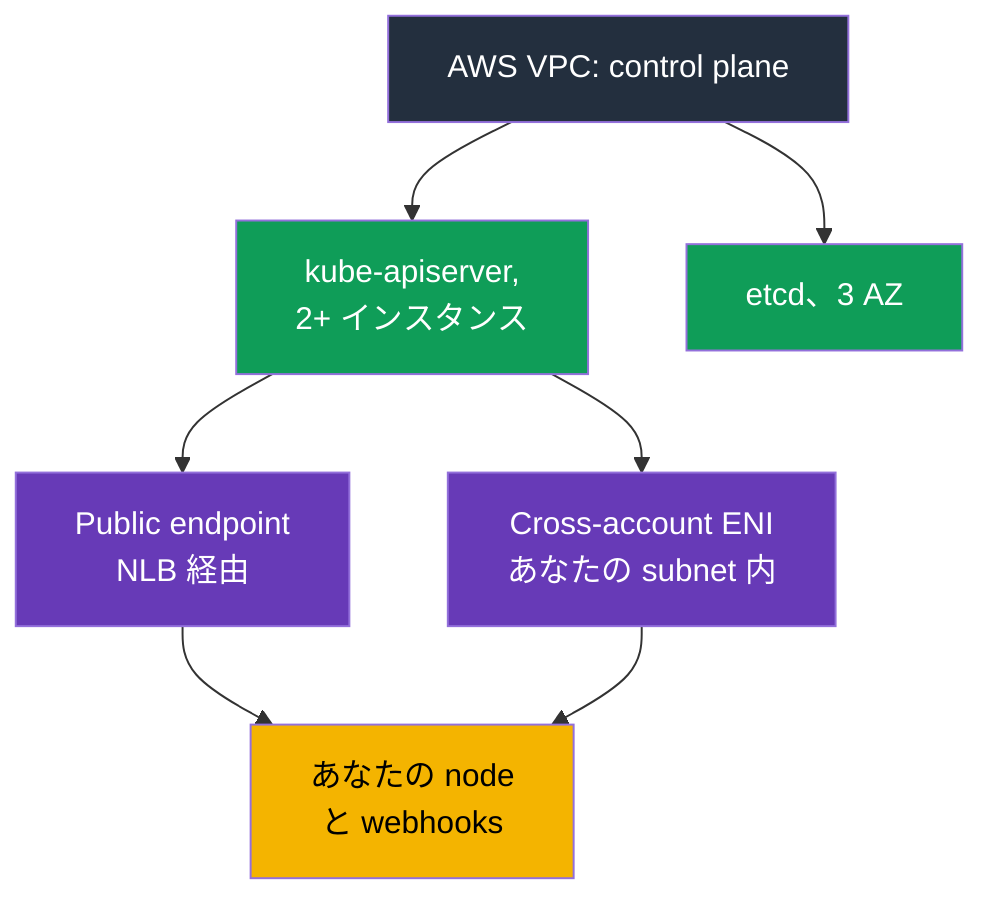
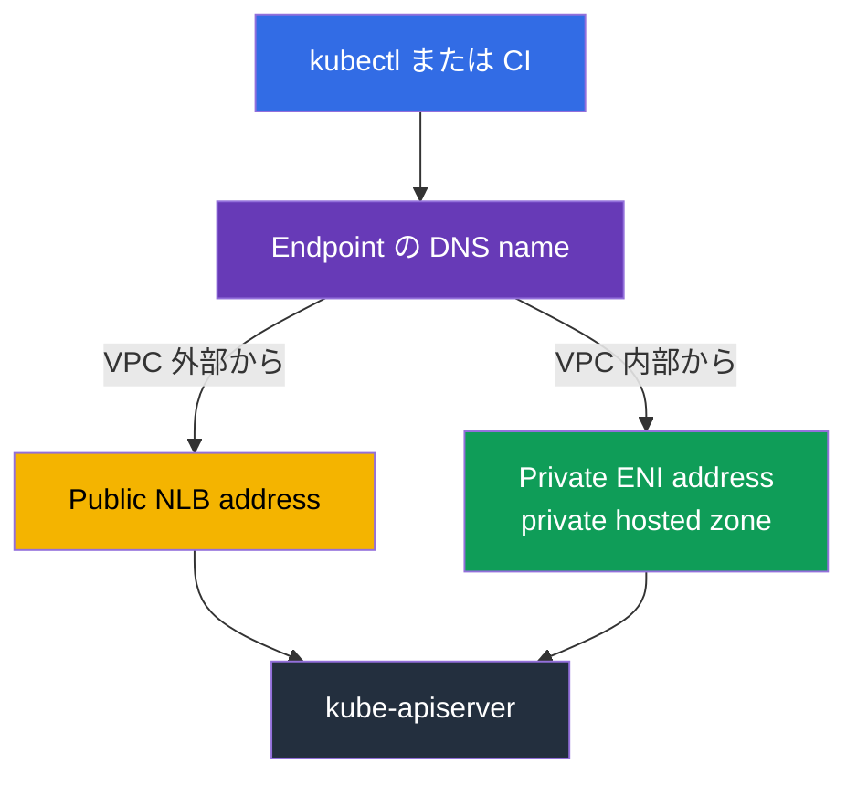
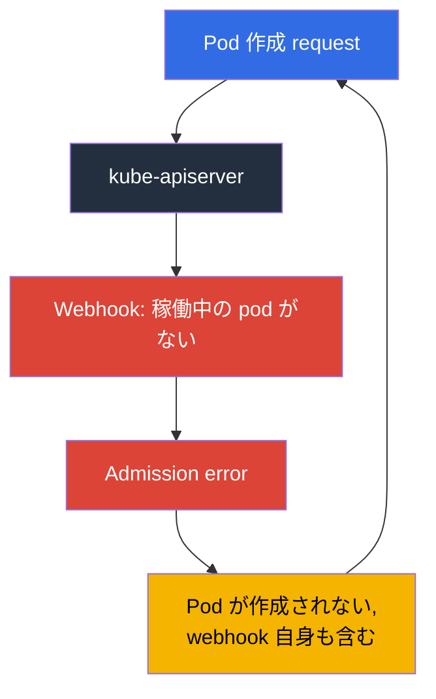

[Русская версия](ru.md) · [Eng version](en.md) · [Versión en español](es.md) · [Version française](fr.md) · [Deutsche Version](de.md) · [ქართული ვერსია](ge.md) · [繁體中文版](tw.md)
# 第 2 章. EKS control plane: public と private endpoint、platform version、SLA、logs

> **この先の内容。** 責任境界は第 1 章で扱いました。ここからは AWS 側にあるものを具体的に見ます。control plane は `kubectl` には見えませんが、抽象概念ではありません。address、あなたの subnet 内の network interface、security group、独自の patch level、logs、SLA があります。「cluster にアクセスできない」や「pod が作成されない」という incident の半分は、Kubernetes ではなくこれらの設定で説明できます。第 3 章では version とその support 期間を続けて扱います。

## 2.1. Cluster は動いているのに control plane が見つからない

新しい cluster でよくある最初の作業は、API server への access を閉じることです。engineer は EC2 に control plane instance を探し、見つからないので VPC console の VPC endpoints 一覧で endpoint を探しますが、そこにもありません。これは error ではありません。**control plane は AWS が所有する VPC にあり**、あなたの account にはその instance がありません。documentation でも、cluster の private endpoint は通常の PrivateLink endpoint ではなく、VPC console に表示されないと明記されています。

あなたの VPC に control plane から存在するものはあります。cluster 作成時に EKS は指定した subnet に **cross-account elastic network interfaces** を 2 から 4 個作成します。service が所有し、あなたの address 上にある network interface です。control plane からあなたの resource への traffic はここを通ります。kubelet の port 10250 への呼び出し (`kubectl exec`、`logs`、`port-forward`、`attach`、`cp`)、admission webhook の呼び出し、OIDC provider と aggregated API servers へのアクセスです。逆方向では、node から API server への traffic は cluster endpoint に向かいます。



実務上の結論は、**cluster 作成時に指定する subnet を二次的なものとして扱えない**ことです。開始時だけでなく、常に free address が必要です。control plane logging configuration を変更する際、EKS は各 subnet に最大 5 個の free IP address を必要とします。address が尽きると operation は失敗します。

## 2.2. Cluster security group: 許可するものと、従わないもの

EKS は cluster とともに `eks-cluster-sg-<cluster>-<uniqueID>` のような名前の security group を作成します。default rule は、自身からのすべての inbound traffic (source self) と、`0.0.0.0/0` 宛てのすべての outbound traffic です。同じ group は cluster の cross-account ENI と managed node groups の node interface に自動的に付加されるため、標準状態では control plane と node は完全に相互通信できます。

何を制御するかを正確に理解することが重要です。cluster security group は **private endpoint** への access と **kubelet API** への access という二種類の connection を制御します。public endpoint にはまったく影響せず、public endpoint は CIDR list だけで制限されます。

| 行うこと | cluster security group に必要なこと |
|-------------|------------------------------------|
| そのままにする | ingress from self + egress `0.0.0.0/0`。動作するが rule は最大限に広い |
| 広範な egress を削除する | 最低限、cluster security group 内の TCP 443 と TCP 10250、DNS 用の TCP と UDP 53 |
| `kubectl exec` と `logs` | control plane が node の kubelet に 10250 で到達できなければ command は停止する |
| bastion または office から private endpoint へ access する | source (bastion の SG、office の CIDR、transit network) からの ingress TCP 443 |
| self rule を削除する | EKS は次回の cluster update で戻す。service は tag も復元する |

node には別途 outbound access も必要です。登録するための EKS API と、image を取得する ECR および S3 への access です。Internet egress のない private cluster と必要な VPC endpoints は第 19 章で扱います。

```bash
# Cluster の完全な network configuration: mode、subnet、SG
aws eks describe-cluster --name demo --query 'cluster.resourcesVpcConfig'

# Cluster security group の ID だけを取得
aws eks describe-cluster --name demo \
  --query 'cluster.resourcesVpcConfig.clusterSecurityGroupId' --output text
```

## 2.3. Endpoint access mode と、それぞれで壊れるもの

新しい cluster は default で public endpoint として作成されます。`endpointPublicAccess=true`、`endpointPrivateAccess=false` です。これは便利である一方、audit で最初に指摘される点でもあります。利用できる組み合わせは三つで、それぞれ traffic の流れが異なります。

| Mode | Flags | traffic の流れ | access の制御 |
|-------|-------|------------------|------------------------|
| Public のみ (default) | `endpointPublicAccess=true`, `endpointPrivateAccess=false` | VPC 内の node からの request は VPC を出るが Amazon network 内に留まる | `publicAccessCidrs` のみ |
| Public と private | 両方 `true` | VPC 内からの request は private endpoint、外部からは public endpoint を通る | public は `publicAccessCidrs`、private は cluster security group |
| Private のみ | `endpointPublicAccess=false`, `endpointPrivateAccess=true` | API server への全 traffic は VPC または接続済み network からのみ | cluster security group のみ。`publicAccessCidrs` は効かない |

private access を有効にすると、EKS はあなたに代わって **Route 53 の private hosted zone** を作成し、cluster VPC に関連付けます。この zone は service が管理し、あなたの Route 53 resource には表示されません。endpoint name を private address に resolve するには、VPC で `enableDnsHostnames` と `enableDnsSupport` を有効にし、DHCP options set に `AmazonProvidedDNS` が必要です。「cluster は作成されたが node が接続しない」という問題が EKS ではなく VPC setting で説明されるのは、まさにこの場合です (第 0.3 章)。

private-only mode には別の注意点があります。現在は VPC 内から public DNS を介して endpoint name が private address に resolve されますが、以前は VPC の内側からしか resolve されませんでした。長く稼働している cluster で name が private address を返さない場合、documentation は public access を有効にしてから再び無効にすることを勧めています。一回で十分です。

時間を奪う典型的な障害は次のとおりです。

- **CI が deploy しなくなった。** SaaS runner はあなたの network 外にあります。private-only への切り替えは確実に壊します。VPC 内の runner、self-hosted agent、transit network 経由の access で直します。切り替えの後ではなく前に確認します。
- **office の `kubectl` が応答しない。** private-only では API access は VPC または接続済み network からだけです。cluster subnet の bastion host と SSM Session Manager (port 22 を開けない)、AWS Client VPN、Direct Connect、transit gateway、VPC 内の CloudShell が使えます。cluster security group にもその source からの ingress 443 が必要です。path があっても access はありません。
- **別の VPC にある node。** private endpoint は cluster VPC 内で resolve されます。peering だけでは name resolution を提供しません。zone association または独自の resolver が必要で、なければ node は API を見つけられません。
- **両 mode を有効にした Hybrid nodes。** VPC 外の node は name を public address に resolve します。documentation は両方ではなく一つの mode を選ぶことを勧めています。
- **control plane scaling 中の connection interruption。** API server instance が置き換わると name は別の address を返し、managed zone の TTL は 60 秒です。process lifetime 全体で DNS を cache する client は timeout になります。name を再 resolve し、retry します。

```bash
# Private endpoint を開き、public access を一回の operation で絞る
aws eks update-cluster-config --name demo --resources-vpc-config \
  endpointPublicAccess=true,endpointPrivateAccess=true,publicAccessCidrs=203.0.113.0/24

# 完了を待つ: status は Successful
aws eks describe-update --name demo --update-id <id> --query 'update.status'
```



## 2.4. `0.0.0.0/0` を使わない public endpoint

`publicAccessCidrs` の default value は `0.0.0.0/0` です (`IPv6` を使う dual-stack cluster にはさらに `::/0`)。つまり public endpoint は default で Internet 全体から access できます。これは AWS が開始を簡単にするために選んだ仕様であり、見落としではありません。

list を絞ることは、cluster security において最も安価な修正です。command 一つ、workload の変更はゼロです。覚えておくことがあります。

- CIDR を制限して **private endpoint を有効にしない**場合、node と Fargate pod が public endpoint に access する address を list に含めなければなりません。そうしないと node は切断されます。documentation のより簡単な勧めは private access を有効にして推測しないことです。
- list は `IPv4` CIDR を受け入れます。`IPv6` CIDR は、2024 年 10 月以降に作成された `ipFamily=IPv6` の dual-stack cluster でのみ受け入れられます。そうでなければ `The following CIDRs are invalid in publicAccessCidrs` error になります。
- office と VPN の address は変わります。CIDR list は code 内の生きた configuration (第 4 章) であり、console で一度だけ行う変更ではありません。そうしなければ、いつか自分自身を締め出します。

最も重要なのは、**これは network filter であり authentication ではない**ことです。CIDR restriction は IAM も RBAC も置き換えません。許可された address からの request でも IAM principal の検証と RBAC authorization を通過します (第 5 章)。許可された address から compromised administrator role で行う request も成功します。逆の誤りもあります。private-only を全員へ `cluster-admin` を与える十分な理由と見なすことです。

## 2.5. Control plane からあなたへ: webhooks

「control plane は隔離されている」という考えが崩れる点です。validating と mutating admission webhook は **API server** が呼び出します。つまり traffic は AWS VPC から cross-account ENI を通ってあなたの VPC へ向かい、通常は port 443、最も多くは controller の Service に届きます。そのため、あなたの pod の availability が API server の稼働条件になります。

EKS で最も悔しい incident は、**webhook が利用できないため pod が作成されない**ことです。



cycle は閉じます。webhook の pod が作成されないので webhook は停止し、webhook が停止しているので pod が作成されません。多くは cluster を zero node へ scale した後、webhook を Spot に移した後、広い rule を持つ `failurePolicy: Fail` を使った後に起きます。AWS の推奨と実務で効くことは次です。

- `apiGroups: ["*"]`、`resources: ["*"]`、`operations: ["*"]` を持つ「catch-all」webhook を作らない。
- timeout を 30 秒より十分短くし、`failurePolicy` を意識して選ぶ。Fail-open は critical operation を止める risk を減らし、fail-closed は policy guarantee を維持します。選択は object ごとに行い、「どこでも同じ」にはしません (第 22 章)。
- webhook scope から `kube-system` と controller 自身の namespace を除外する。
- webhook を複数 instance、異なる AZ、PDB とともに維持する (第 40 章)。
- network を忘れない。control plane から webhook への path は開いている必要があります。default では control plane egress は AWS が管理します (`controlPlaneEgressMode=AWS_MANAGED`)。`CUSTOMER_ROUTED` mode は route、NACL、security group の責任とともにこの path をあなたに渡し、切り替えは片方向です。`AWS_MANAGED` には戻せません。境界を理解することが大切です。cluster ENI 経由の control plane と node の間の traffic (10250 の kubelet API を含む) はあなたの egress device に依存しません。壊れるのは webhook call と OIDC authentication のように外へ向かう traffic です。

## 2.6. Platform version: 自動で上がる patch level

`kubectl get --raw /version` は Kubernetes version を表示しますが、それを提供する正確な EKS control plane は示しません。そのために `eks.14` のような **platform version** があります。

これは Kubernetes minor version 内の EKS control plane capability を示します。どの API server flag が有効か、どの admission controller set が active か、現在の Kubernetes patch level は何かです。番号は minor version ごとに独立し、`eks.1` から始まります。AWS が新しい control plane setting や security fix を出すと increment されます。したがって、1.30 の `eks.1` と 1.31 の `eks.1` は異なる control plane build です。Kubernetes version との重要な違いは、**platform version update をあなたが開始しない**ことです。AWS が既存 cluster をその minor version の current platform version に徐々に上げます。新しい platform version は breaking change を持ち込まず、downtime も発生させません。

| 質問 | Kubernetes version | Platform version |
|--------|-------------------|------------------|
| 変更を開始するのは誰か | あなた。EKS API を呼び出す (第 38 章) | AWS。自動 |
| Format | `1.33` | `eks.14` |
| 互換性のない変更を持ち込むか | はい。だから準備する | いいえ |
| 内容 | Kubernetes version とその API | apiserver flag、admission plugin set、Kubernetes patch |
| いつあなたの問題になるか | 常に。support 期間と update plan | cluster が platform version を二つ以上遅れた場合 |

最後の row が、on-call 中に platform version を見る唯一の実務上の理由です。二 version より大きな遅れは automatic update が完了しなかったことを意味します。無視せず documentation の troubleshooting section に沿って調べます。

```bash
# Kubernetes version、platform version、cluster status
aws eks describe-cluster --name demo \
  --query 'cluster.[version,platformVersion,status]' --output text

# 現在有効な control plane logging
aws eks describe-cluster --name demo --query 'cluster.logging'
```

## 2.7. Control plane logs: 五つの type、default ではなし

master への `ssh` も `kubectl logs -n kube-system kube-apiserver-...` もありません (第 1 章)。唯一の channel は **CloudWatch Logs** ですが、default で無効です。cluster は動作し incident が起きても履歴はありません。事前に有効にしていない log は後から現れません。新しい cluster で最初に設定すべきものです。

type はちょうど五つで、API の名称も `api`、`audit`、`authenticator`、`controllerManager`、`scheduler` です。

| Type | 内容 | 役立つ場面 |
|-----|-----------|---------------|
| `api` | kube-apiserver component の log。cluster 作成時から有効にすると stream の始めに API server 起動 flag が見える | API error と timeout の調査、control plane configuration の理解 |
| `audit` | 誰が、いつ、どの request と result で cluster object を変更したか。user、administrator、system component | 「誰が namespace を削除したか」、incident 調査、compliance (第 21 章) |
| `authenticator` | EKS 固有の component。IAM credential による RBAC authentication | `You must be logged in to the server`、access entry と IRSA の debug (第 5、47 章) |
| `controllerManager` | 標準 Kubernetes control loop | object が作成または削除されない、stuck finalizer、controller の問題 |
| `scheduler` | pod をどこでいつ起動するかの判断 | 明確な event のない `Pending` pod、affinity と topology spread の conflict |

有効にする前に知っておくことがあります。

- Log group の名前は `/aws/eks/<cluster-name>/cluster` で、stream は component ごとに `kube-apiserver-audit-<id>` のような名前になります。成長すると rotate され、最新の stream は最後の event で判断します。delivery は数分で行われ、best effort とされています。
- logging は type ごと、cluster ごとに console、CLI、API で有効にします。有効化時の verbosity は level 2 です。address の条件も忘れないでください。configuration の変更には各 subnet で最大五つの free IP address が必要です。
- **これは費用がかかります。** EKS の料金は通常どおりで、その上に CloudWatch Logs の ingestion、storage、data scanning の通常料金がかかります。最も volume が多い type は `audit` で、active cluster では bill の目立つ項目になり得ます。
- retention は EKS ではなく CloudWatch Logs 側で設定します。retention period を設定しない log group は data を無期限かつ有料で保存します。そのため logging を有効にした直後、`/aws/eks/<cluster>/cluster` に合理的な retention period (通常 stream では 7-14 日) を指定した `aws logs put-retention-policy` を呼び、long-term archive は S3 へ送ります (第 34、43 章)。実務では `audit` を常に有効にし、retention を明示します。

```bash
# 二つの type を有効にする。残りも同じ list に追加できる
aws eks update-cluster-config --name demo \
  --logging '{"clusterLogging":[{"types":["api","audit"],"enabled":true}]}'

# 五つすべての type を一度に有効にする
TYPES='["api","audit","authenticator","controllerManager","scheduler"]'
aws eks update-cluster-config --name demo \
  --logging "{\"clusterLogging\":[{\"types\":$TYPES,\"enabled\":true}]}"

# Log group があり、retention が何日かを調べる
aws logs describe-log-groups --log-group-name-prefix /aws/eks/demo \
  --query 'logGroups[].[logGroupName,retentionInDays]' --output table

# Retention を設定する。ない場合 log group は無期限に log を蓄積する
aws logs put-retention-policy --log-group-name /aws/eks/demo/cluster \
  --retention-in-days 14

# Audit の live tail
aws logs tail /aws/eks/demo/cluster \
  --log-stream-name-prefix kube-apiserver-audit --since 10m --follow
```

## 2.8. Control plane observability: 429 はあなたに届く

managed control plane は「監視する必要がない」ことを意味しません。品質の悪い controller、loop 内で `kubectl` を実行する script、一度に作成される千個の pod によって、API server は `429 Too Many Requests` を返し始めます。これは failure ではなく保護です。API server は concurrent request 数を制限し、劣化するより余分な request を拒否します。**API Priority and Fairness** は FlowSchema と PriorityLevelConfiguration を通じて、この quota を request type 間に配分します。EKS ではこれらの object は自動管理され、minor version の default configuration が使われます。quota は control plane scaling とともに増え、cluster には少なくとも二つの API server があるため全体の throughput は一 instance より高いですが、無限ではありません。

control plane metric は API から Prometheus format の `kubectl get --raw /metrics` で取得できます。収集すべきものは次です (配置先は第 33、34 章で扱います)。

| 見るもの | Metrics | 増加が示すこと |
|--------------|---------|--------------------|
| API latency | `apiserver_request_duration_seconds` | control plane または etcd の負荷、pagination のない request、重い LIST |
| Error と throttling | code 別の `apiserver_request_total` | 429 の spike は client が cluster を圧迫していること、5xx は `api` log を確認 |
| Admission | `apiserver_admission_controller_admission_duration_seconds`, `apiserver_admission_webhook_rejection_count` | 遅いまたは拒否する webhook、あなた自身の bottleneck (section 2.5) |
| etcd | `etcd_request_duration_seconds`, `apiserver_storage_size_bytes` | database size limit への接近。満杯になると cluster は read-only になる |
| Client | `rest_client_requests_total` | 主な request stream を生成する controller |

```bash
# Prometheus format の API server metrics
kubectl get --raw /metrics | head -20

# 429 で終了した request 数
kubectl get --raw /metrics | grep 'apiserver_request_total.*code="429"'

# 現在の request priority configuration
kubectl get flowschemas
kubectl get prioritylevelconfigurations
```

低コストで問題の半分を取り除く習慣があります。`kubectl` を loop で実行しない、container 内で client cache (`--cache-dir`) を失わない、pod と node の churn が EndpointSlice update の avalanche にならないよう PDB を使う、cluster を一度に数十 percent ずつ scale しないことです。

## 2.9. SLA、multi-AZ と、それでもあなたに残ること

EKS control plane は元から multi-AZ です。一つの Region の三つの Availability Zone に、少なくとも二つの API server instance と三つの etcd instance があり、各 cluster は他の cluster や account と重ならない専用 control plane を持ちます。EKS は failure した instance を必要に応じて別の AZ で置き換え、control plane capacity を load に合わせて調整します。

この architecture が SLA の基礎です。standard control plane を持つ cluster について、AWS は月間 billing cycle 中、五分 interval で測定する Kubernetes endpoint の Monthly Uptime Percentage が **99.95%** 以上であることを約束します。provisioned control plane (pricing tier によって control plane capacity を事前確保する mode) の cluster では、分単位で測定する 99.99% のより高い SLA が示されています。最新の条件と compensation procedure は常に service SLA page にあります。

control plane の multi-AZ があなたに提供しないものは次です。

| あなたに残る作業 | 理由 |
|------------------------|--------|
| 異なる AZ の node | control plane は AZ failure を生き残るが、一つの AZ の node 上にある Deployment は生き残らない (第 40 章) |
| 異なる AZ の node subnet と free address | そうでなければ workload を分散する場所がない (第 6、7 章) |
| topology spread、PDB、適切な node shutdown | application availability は API availability を継承しない (第 40 章) |
| EBS volume の AZ への attachment | volume は pod とともに AZ 間を移動しない (第 23 章) |
| あなたの webhook と addon の availability | section 2.5 と第 37 章。停止させるのはあなたで、admission が影響を受ける |
| Multi-Region | SLA は regional。cluster は一 Region にあり、DR は別の作業 (第 42 章) |

business に説明するときの表現はこうです。SLA は **API server endpoint の availability** を対象とし、あなたの application の availability は対象としません。control plane が完全に動作していても application は停止でき、それは全面的にあなたの incident です。

## 2.10. Production での適用方法

- **両 endpoint mode を有効にし、public を絞る。** `endpointPrivateAccess=true` に office と VPN range の `publicAccessCidrs` を組み合わせます。完全な private-only は、CI、bastion、DNS を事前に準備した上での意識的な選択です。
- **Endpoint configuration を code に置く。** mode、CIDR、security group、log type は Terraform または eksctl に置きます (第 4 章)。console での変更は次の `apply` までしか残りません。
- **初日から log を有効にする。** 最低でも `audit` と `authenticator` を有効にし、retention を明示し、`audit` 内の疑わしい event に metric filter と alarm を設定します (第 21 章)。
- **Dashboard に control plane metric を置く。** API latency、429 と 5xx の割合、admission duration、etcd database size です。429 の spike は incident として調査し、client を探します。
- **Webhook を control plane の一部として扱う。** 狭い scope、短い timeout、`kube-system` の除外、異なる AZ の複数 replica、PDB を使います。
- **Cluster security group は「すべて許可」でも「すべて拒否」でもない。** documentation の最小 rule に、bastion と transit network 用の明示的な ingress 443 を追加します。

## 2.11. ミニ用語集

- **Cluster endpoint** は cluster の Kubernetes API address です。**Public endpoint** は Internet から利用でき、CIDR list のみで制限されます。**private endpoint** は VPC から利用でき、cluster security group で制限されます。
- **`endpointPublicAccess` / `endpointPrivateAccess`** は access mode の Boolean flag で、default は `true` と `false` です。**`publicAccessCidrs`** は public endpoint を利用できる CIDR の list で、default は `0.0.0.0/0` です。
- **Cross-account ENI** は、control plane と node、kubelet API、webhook、OIDC の connectivity のため、EKS があなたの subnet に作成する network interface です。**Cluster security group** は cluster 用に自動作成され、これらの interface と managed node group の node に付加される group です。
- **Private hosted zone** は endpoint name が private address に resolve されるよう、EKS が作成してあなたの VPC に関連付ける Route 53 zone です。
- **Platform version** は Kubernetes minor version 内の EKS control plane の patch level と capability set です。format は `eks.<n>` で、AWS により自動 update されます。
- **Control plane log type** は `api`、`audit`、`authenticator`、`controllerManager`、`scheduler` です。有効にした後にのみ CloudWatch Logs へ書き込まれます。
- **API Priority and Fairness** は concurrent request の quota を type 間に配分する Kubernetes mechanism です。quota が尽きると client は `429` を受け取ります。

## 2.12. この章のまとめ

- Control plane は AWS VPC にありますが、あなたの subnet には 2-4 個の cross-account ENI と cluster security group があります。これらは 10250 の kubelet、webhook、OIDC への traffic を運びます。
- Cluster security group は private endpoint と kubelet API を制御しますが、public endpoint は制御しません。public endpoint は `publicAccessCidrs` のみで制限され、default は `0.0.0.0/0` です。
- access mode は三つです。public のみ (default)、public と private、private のみです。mode の変更は VPC 外にあるものを壊します。SaaS CI runner、office の `kubectl`、peered VPC の node です。private access には private hosted zone と VPC の正しい DNS setting が必要です。
- CIDR restriction は network filter であり authentication ではありません。IAM と RBAC は必須のままです。
- API server はあなたの webhook を呼びます。広い rule を持つ利用不能な webhook は pod creation を止め、自身に対する cycle を作ります。
- Platform version は control plane の patch level で自動的に上がります。cluster が二 version より遅れた場合だけ対応が必要です。
- 五つの control plane log type は default で無効で、CloudWatch Logs に書き込まれ、費用がかかります。retention は CloudWatch で設定します。
- Control plane は三つの AZ に分散され、standard mode の endpoint availability SLA は 99.95% です。application、volume、webhook の multi-AZ はあなたの責任として残ります。

## 2.13. 実際の業務で役立つ点

on-call 中の三つの状況を考えます。一つ目は「cluster に access できない」です。問題は Kubernetes ではなく、request の発信元と有効な endpoint mode にあります。`resourcesVpcConfig` を指定した `describe-cluster` は十秒で答えます。二つ目は「pod が作成されず、event が空」です。admission を確認します。webhook metric と `api` log です。logging が有効でなかった場合、最悪の時点でそれを知るため、事前に有効にします。三つ目は audit が resource を誰が削除したかを求める場合です。答えは `audit` にしかなく、それが有効で retention から外れていない場合に限られます。さらに、`publicAccessCidrs` を絞り private endpoint を有効にすることは、どの EKS security checklist でも最も安価な項目です。数分の作業で application の変更はありません。

## 2.14. 自己確認の質問

1. Cluster の private endpoint が VPC endpoints list に表示されないのはなぜですか。
2. Cross-account ENI とは何ですか。どの subnet に作成され、どの traffic が通りますか。
3. Cluster security group はどの二種類の connection を制御し、どれを制御しませんか。
4. Endpoint access mode を三つ挙げ、default flag value を示してください。
5. Cluster を private-only に切り替えました。CI とあなたの `kubectl` では何が壊れますか。
6. EKS が private hosted zone を作成する理由と、必須の VPC setting は何ですか。
7. `publicAccessCidrs` の default value は何ですか。なぜ絞っても RBAC を置き換えられませんか。
8. Public access を制限した後に node が登録しなくなりました。何を忘れましたか。
9. 利用できない validating webhook が pod creation を停止する理由と、cycle を断つ方法は何ですか。
10. Platform version は Kubernetes version と何が異なり、誰が update しますか。
11. Control plane log type を五つ挙げ、「誰が namespace を削除したか」をどれで探すか答えてください。
12. API server が `429` を返します。これは何を意味し、どこから調査しますか。
13. EKS SLA は何を対象とし、AZ failure 時に何があなたの責任として残りますか。

## 演習

この章にはまだ lab はありませんが、内容は access できる任意の cluster で確認できます。`--query 'cluster.resourcesVpcConfig'` を使う `aws eks describe-cluster` は mode、CIDR、cluster security group を示します。`--query 'cluster.[version,platformVersion]'` は version を、`--query 'cluster.logging'` は有効な log type を示します。次に `aws logs describe-log-groups --log-group-name-prefix /aws/eks` と `kubectl get --raw /metrics` を使います。第 3 章では Kubernetes version、support period、standard と extended support、upgrade strategy に進みます。

---
[目次](../README_JP.md) · [第 1 章](../01/jp.md) · [第 3 章](../03/jp.md)
