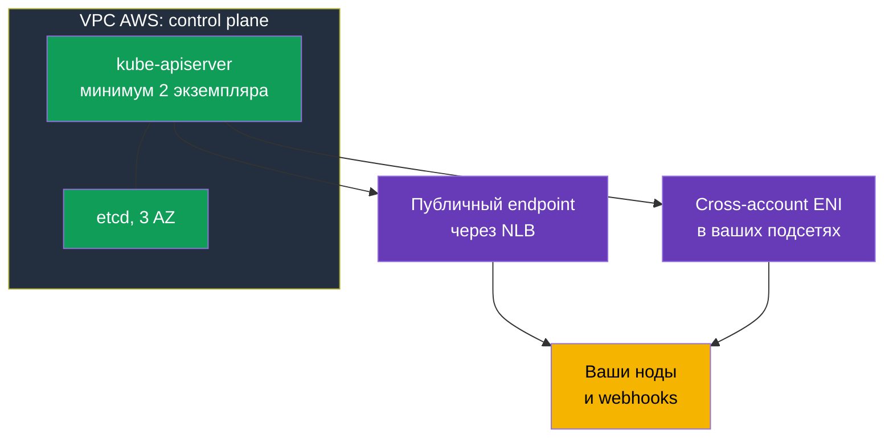
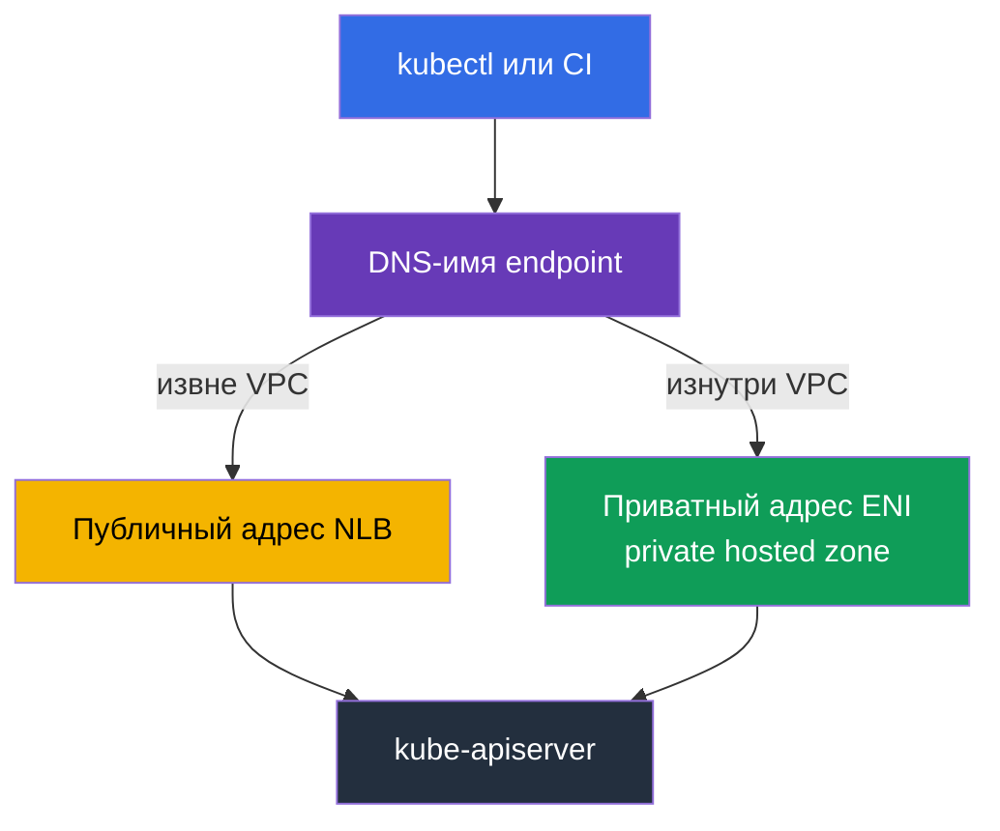
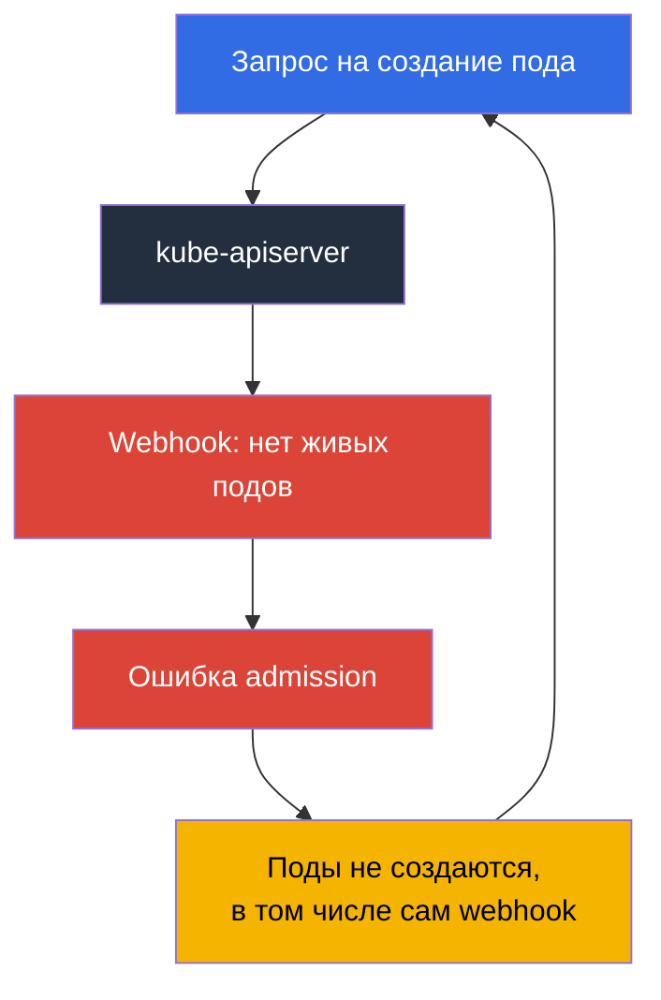

# Глава 2. Control plane EKS: endpoint public и private, platform versions, SLA, логи

> **Что дальше.** Граница ответственности разобрана (глава 1), теперь предметно про то, что
> лежит на стороне AWS. Control plane не виден в `kubectl`, но он не абстракция: у него есть
> адрес, сетевые интерфейсы в ваших подсетях, security group, свой patch-уровень, свои логи и
> SLA. Половина инцидентов «кластер недоступен» и «поды не создаются» объясняется именно
> этими настройками, а не Kubernetes. Глава 3 продолжит темой версий и сроков их поддержки.

## 2.1. Кластер работает, а control plane не найти

Типовая первая задача на новом кластере: закрыть доступ к API-серверу. Инженер идёт искать
инстансы control plane в EC2, не находит, идёт в VPC console искать endpoint в списке VPC
endpoints - и там его тоже нет. Это не ошибка: **control plane живёт в VPC, которым владеет
AWS**, в вашем аккаунте его инстансов нет. В документации прямо сказано, что private endpoint
кластера не является обычным PrivateLink-эндпоинтом и в консоли VPC не показывается.

Что от control plane всё-таки есть в вашем VPC: при создании кластера EKS создаёт в указанных
вами подсетях **cross-account elastic network interfaces** - от 2 до 4 сетевых интерфейсов,
принадлежащих сервису, но живущих на ваших адресах. Через них идёт трафик от control plane к
вашим ресурсам: обращение к kubelet на порт 10250 (это `kubectl exec`, `logs`, `port-forward`,
`attach`, `cp`), вызовы admission webhooks, обращения к OIDC-провайдеру и к вашим
aggregated API servers. Обратно, от нод к API-серверу, трафик идёт на endpoint кластера.



Практическое следствие: **подсети, указанные при создании кластера, нельзя считать
второстепенными**. В них нужны свободные адреса, и не только на старте: на изменение
конфигурации логирования control plane EKS требует до пяти свободных IP-адресов в каждой
подсети. Кончились адреса - операция не проходит.

## 2.2. Cluster security group: что она пропускает и что ей не подчиняется

Вместе с кластером EKS создаёт security group с именем вида
`eks-cluster-sg-<cluster>-<uniqueID>`. Правила по умолчанию: весь входящий трафик от самой
себя (source self) и весь исходящий в `0.0.0.0/0`. Эта же группа автоматически навешивается
на cross-account ENI кластера и на интерфейсы нод из managed node groups, поэтому «из коробки»
control plane и ноды видят друг друга полностью.

Важно понимать, что именно она контролирует. Cluster security group управляет двумя типами
соединений: доступом к **private endpoint** и доступом к **kubelet API**. На публичный
endpoint она не влияет вообще - тот ограничивается только списком CIDR.

| Что делаете | Что нужно в cluster security group |
|-------------|------------------------------------|
| Оставляете как есть | ingress from self + egress `0.0.0.0/0`, всё работает, но правила максимально широкие |
| Убираете широкий egress | минимум: TCP 443 и TCP 10250 в cluster security group, TCP и UDP 53 для DNS |
| `kubectl exec` и `logs` | control plane должен достучаться до kubelet нод на 10250, иначе команды виснут |
| Доступ с bastion или из офиса к private endpoint | ingress TCP 443 из источника (SG бастиона, CIDR офиса или транзитной сети) |
| Удаляете правила self | EKS вернёт их обратно при следующем обновлении кластера; теги сервис тоже восстанавливает |

Отдельно нужен исходящий доступ у нод: к API EKS для регистрации, к ECR и S3 за образами. Про
приватные кластеры без выхода в интернет и нужные VPC endpoints - глава 19.

```bash
# Полная сетевая конфигурация кластера: режимы, подсети, SG
aws eks describe-cluster --name demo --query 'cluster.resourcesVpcConfig'

# Только идентификатор cluster security group
aws eks describe-cluster --name demo \
  --query 'cluster.resourcesVpcConfig.clusterSecurityGroupId' --output text
```

## 2.3. Режимы доступа к endpoint и чем каждый ломается

Новый кластер по умолчанию создаётся с публичным endpoint: `endpointPublicAccess=true`,
`endpointPrivateAccess=false`. Это удобно и это же первая претензия аудита. Доступны три
комбинации, и у каждой своя механика трафика.

| Режим | Флаги | Как ходит трафик | Чем управляется доступ |
|-------|-------|------------------|------------------------|
| Только public (по умолчанию) | `endpointPublicAccess=true`, `endpointPrivateAccess=false` | запросы от нод внутри VPC уходят из VPC, но остаются в сети Amazon | только `publicAccessCidrs` |
| Public и private | оба `true` | запросы изнутри VPC идут через private endpoint, извне - через публичный | `publicAccessCidrs` для публичного, cluster security group для приватного |
| Только private | `endpointPublicAccess=false`, `endpointPrivateAccess=true` | весь трафик к API-серверу только из VPC или из связанной сети | только cluster security group; `publicAccessCidrs` не действует |

Когда включён private access, EKS создаёт от вашего имени **private hosted zone в Route 53**
и связывает её с VPC кластера. Зона управляется сервисом и в ваших ресурсах Route 53 не
видна. Чтобы имя endpoint разрешалось в приватный адрес, у VPC должны быть включены
`enableDnsHostnames` и `enableDnsSupport`, а в DHCP options set должен быть
`AmazonProvidedDNS`. Это ровно тот случай, когда «кластер создан, ноды не подключаются»
объясняется не EKS, а настройками VPC (глава 0.3).

Отдельная тонкость про режим только private: сейчас имя endpoint разрешается публичными DNS
в приватный адрес из VPC, тогда как раньше разрешалось только изнутри VPC. Если у давно
живущего кластера имя не отдаёт приватный адрес, документация предлагает включить публичный
доступ и снова выключить его - одного раза достаточно.

Типовые поломки, за которые платят временем:

- **CI перестал деплоить.** Раннеры в SaaS живут вне вашей сети. Переключение на private-only
  ломает их гарантированно; чинится раннерами внутри VPC, self-hosted агентами или доступом
  через транзитную сеть. Проверять надо до переключения, а не после.
- **`kubectl` из офиса не отвечает.** В private-only нужен путь в VPC: VPN, Direct Connect,
  transit gateway, bastion, CloudShell в VPC. И в cluster security group нужен ingress 443 с
  этого источника - без него путь есть, а доступа нет.
- **Ноды в другой VPC.** Private endpoint резолвится в VPC кластера. Пиринг сам по себе не
  даёт разрешения имени: нужна ассоциация зоны или свой резолвер, иначе ноды не находят API.
- **Hybrid nodes с двумя включёнными режимами.** Ноды вне VPC разрешают имя в публичные
  адреса; документация рекомендует для них выбирать один режим, а не оба.
- **Обрыв соединений при масштабировании control plane.** Экземпляры API-сервера заменяются,
  имя начинает отдавать другие адреса, а TTL в managed-зоне 60 секунд. Клиенты, кеширующие
  DNS на всю жизнь процесса, ловят таймауты; лечится повторным разрешением имени и retry.

```bash
# Открыть private endpoint и сузить публичный доступ одной операцией
aws eks update-cluster-config --name demo --resources-vpc-config \
  endpointPublicAccess=true,endpointPrivateAccess=true,publicAccessCidrs=203.0.113.0/24

# Дождаться завершения: статус Successful
aws eks describe-update --name demo --update-id <id> --query 'update.status'
```



## 2.4. Публичный endpoint без 0.0.0.0/0

Значение `publicAccessCidrs` по умолчанию - `0.0.0.0/0` (и дополнительно `::/0` для
dual-stack кластеров с `IPv6`). То есть публичный endpoint по умолчанию доступен со всего
интернета, и это осознанное решение AWS в пользу простоты старта, а не недосмотр.

Сузить список - самая дешёвая правка в безопасности кластера: одна команда, ноль изменений в
нагрузках. Что стоит помнить:

- Если вы ограничиваете CIDR и **не включаете private endpoint**, в список обязаны попасть
  адреса, с которых ноды и Fargate-поды обращаются к публичному endpoint. Иначе ноды
  отвалятся. Рекомендация документации проще: включите private access и не гадайте.
- В список идут `IPv4` CIDR; `IPv6` CIDR принимаются только у dual-stack кластеров с
  `ipFamily=IPv6`, созданных после октября 2024, иначе будет ошибка
  `The following CIDRs are invalid in publicAccessCidrs`.
- Офисные и VPN-адреса меняются. Список CIDR - живая конфигурация в коде (глава 4), а не
  разовая правка в консоли, иначе однажды он закроет доступ вам самим.

И главное: **это сетевой фильтр, а не аутентификация**. Ограничение по CIDR не заменяет ни
IAM, ни RBAC. Запрос с разрешённого адреса всё равно проходит проверку IAM-принципала и
авторизацию RBAC (глава 5), а запрос с разрешённого адреса под скомпрометированной ролью
администратора успешен. Обратная ошибка тоже встречается: считать private-only достаточным
основанием, чтобы раздать всем `cluster-admin`.

## 2.5. Control plane звонит вам: webhooks

Момент, который ломает представление «control plane изолирован». Валидирующие и мутирующие
admission webhooks вызывает **API-сервер**, то есть трафик идёт из VPC AWS в ваш VPC через
cross-account ENI, обычно на порт 443, чаще всего в Service вашего контроллера. Значит
доступность ваших подов становится условием работы API-сервера.

Отсюда самый обидный инцидент в EKS: **webhook недоступен - не создаются поды**.



Цикл замыкается: webhook лежит, потому что его поды не создаются, а поды не создаются,
потому что webhook лежит. Чаще всего это случается после масштабирования кластера в ноль нод,
после переезда webhook на спот или после `failurePolicy: Fail` с широкими правилами. Что
рекомендует AWS и что работает на практике:

- Не делать «catch-all» webhooks с `apiGroups: ["*"]`, `resources: ["*"]`, `operations: ["*"]`.
- Держать таймаут заметно меньше 30 секунд и осознанно выбирать `failurePolicy`. Fail-open
  снижает риск блокировки критичных операций, fail-closed сохраняет гарантию политики - выбор
  делается по объекту, а не «везде одинаково» (глава 22).
- Исключать `kube-system` и namespace самого контроллера из области действия webhook.
- Держать webhook в нескольких экземплярах и в разных AZ, с PDB (глава 40).
- Помнить про сеть: путь от control plane до webhook должен быть открыт. По умолчанию egress
  control plane управляет AWS (`controlPlaneEgressMode=AWS_MANAGED`); режим
  `CUSTOMER_ROUTED` передаёт этот путь вам вместе с ответственностью за маршруты, NACL и
  security groups, и переключение в него одностороннее - вернуться к `AWS_MANAGED` нельзя.
  Важно понимать границу: трафик между control plane и нодами через cluster ENI (включая
  kubelet API на 10250) от вашего egress-устройства не зависит, ломается именно то, что
  ходит наружу - вызовы webhooks и аутентификация OIDC.

## 2.6. Platform version: patch-уровень, который растёт сам

`kubectl get --raw /version` показывает версию Kubernetes, но не говорит, какой именно
control plane EKS её обслуживает. Для этого есть **platform version** вида `eks.14`.

Она описывает возможности control plane EKS внутри минорной версии Kubernetes: какие флаги
API-сервера включены, какой набор admission-контроллеров активен, какой текущий patch-уровень
Kubernetes. Нумерация независима для каждой минорной версии: начинается с `eks.1` и
инкрементируется, когда AWS выпускает новые настройки control plane или исправления
безопасности. Ключевое отличие от версии Kubernetes: **обновление platform version вы не
запускаете**. AWS сам поднимает существующие кластеры до актуальной platform version их
минорной версии, раскатывая это постепенно. Новые platform versions не приносят breaking
changes и не вызывают простоя.

| Вопрос | Версия Kubernetes | Platform version |
|--------|-------------------|------------------|
| Кто инициирует изменение | вы, вызовом API EKS (глава 38) | AWS, автоматически |
| Формат | `1.33` | `eks.14` |
| Приносит несовместимые изменения | да, к этому и готовятся | нет |
| Что внутри | версия Kubernetes и её API | флаги apiserver, набор admission-плагинов, patch Kubernetes |
| Когда это ваша проблема | всегда: срок поддержки, план обновления | если кластер отстал более чем на две platform version |

Последняя строка - единственный практический повод смотреть на platform version в дежурстве.
Отставание больше двух версий означает, что автоматическое обновление не прошло, и это стоит
разобрать по разделу troubleshooting документации, а не игнорировать.

```bash
# Версия Kubernetes, platform version и статус кластера
aws eks describe-cluster --name demo \
  --query 'cluster.[version,platformVersion,status]' --output text

# Что включено в логирование control plane прямо сейчас
aws eks describe-cluster --name demo --query 'cluster.logging'
```

## 2.7. Логи control plane: пять типов, и по умолчанию их нет

`ssh` на master больше нет, `kubectl logs -n kube-system kube-apiserver-...` тоже (глава 1).
Единственный канал - **CloudWatch Logs**, и по умолчанию он выключен. Кластер работает,
инцидент случился, а истории нет: логи, которые не были включены заранее, задним числом не
появятся. Это первое, что настраивают на новом кластере.

Типов ровно пять, и в API они называются именно так: `api`, `audit`, `authenticator`,
`controllerManager`, `scheduler`.

| Тип | Что внутри | Когда спасает |
|-----|-----------|---------------|
| `api` | логи компонента kube-apiserver; если включить сразу при создании, в начале потока видны флаги, с которыми запущен API-сервер | разбор ошибок и таймаутов API, понимание конфигурации control plane |
| `audit` | кто, когда, каким запросом и с каким результатом менял объекты кластера: пользователи, администраторы, системные компоненты | «кто удалил namespace», расследование инцидентов, комплаенс (глава 21) |
| `authenticator` | уникальный для EKS компонент: аутентификация RBAC по IAM-кредам | `You must be logged in to the server`, отладка access entries и IRSA (главы 5, 47) |
| `controllerManager` | штатные control loops Kubernetes | объекты не создаются или не удаляются, зависшие финализаторы, проблемы контроллеров |
| `scheduler` | решения о том, где и когда запускать поды | поды в `Pending` без внятных событий, конфликты affinity и topology spread |

Что важно знать до включения:

- Log group называется `/aws/eks/<cluster-name>/cluster`, потоки - по компонентам, с именами
  вида `kube-apiserver-audit-<id>`; при росте они ротируются, свежий определяется по
  последнему событию. Доставка идёт за считанные минуты и заявлена как best effort.
- Включение по типам, на кластер, через консоль, CLI или API. Уровень verbosity при включении
  равен 2. Напомню про адреса: на изменение конфигурации нужно до пяти свободных IP в каждой
  подсети.
- **Это стоит денег.** Плата за EKS остаётся стандартной, а сверху идут обычные тарифы
  CloudWatch Logs на ingestion, хранение и сканирование данных. Самый объёмный тип - `audit`;
  на активном кластере он способен стать заметной строкой в счёте.
- Retention задаётся на стороне CloudWatch Logs, а не EKS. Log group, оставленная без
  настроенного срока хранения, хранит данные бесконечно и платно. Практика: `audit` включён
  всегда, retention выставлен явно, долгий архив уезжает в S3 (главы 34 и 43).

```bash
# Включить два типа; остальные добавляются в том же списке
aws eks update-cluster-config --name demo \
  --logging '{"clusterLogging":[{"types":["api","audit"],"enabled":true}]}'

# Все пять типов сразу
TYPES='["api","audit","authenticator","controllerManager","scheduler"]'
aws eks update-cluster-config --name demo \
  --logging "{\"clusterLogging\":[{\"types\":$TYPES,\"enabled\":true}]}"

# Есть ли log group и какой у неё retention
aws logs describe-log-groups --log-group-name-prefix /aws/eks/demo \
  --query 'logGroups[].[logGroupName,retentionInDays]' --output table

# Живой хвост аудита
aws logs tail /aws/eks/demo/cluster \
  --log-stream-name-prefix kube-apiserver-audit --since 10m --follow
```

## 2.8. Наблюдаемость control plane: 429 приходят вам

Управляемый control plane не значит «за него не надо смотреть». Плохо написанный контроллер,
скрипт с `kubectl` в цикле, тысяча подов, создаваемых залпом, - и API-сервер начинает
отвечать `429 Too Many Requests`. Это защита, а не отказ: API-сервер ограничивает число
одновременных запросов и предпочитает отклонить лишние, а не деградировать. Распределением
этой квоты между типами запросов управляет **API Priority and Fairness** через FlowSchema и
PriorityLevelConfiguration; в EKS эти объекты управляются автоматически и используется
конфигурация по умолчанию для минорной версии. Квота растёт вместе с масштабированием control
plane, и в кластере минимум два API-сервера, так что общая пропускная способность выше
одиночной, но она не бесконечна.

Метрики control plane доступны через API: `kubectl get --raw /metrics` в формате Prometheus.
Что стоит собирать (главы 33 и 34 про то, куда именно):

| Что смотреть | Метрики | О чём говорит рост |
|--------------|---------|--------------------|
| Латентность API | `apiserver_request_duration_seconds` | control plane или etcd под нагрузкой, запросы без пагинации, тяжёлые LIST |
| Ошибки и throttling | `apiserver_request_total` по code | всплеск 429 - клиент душит кластер; 5xx - смотреть логи `api` |
| Admission | `apiserver_admission_controller_admission_duration_seconds`, `apiserver_admission_webhook_rejection_count` | медленный или отклоняющий webhook, ваш собственный тормоз (раздел 2.5) |
| etcd | `etcd_request_duration_seconds`, `apiserver_storage_size_bytes` | приближение к лимиту размера базы: при переполнении кластер уходит в read-only |
| Клиенты | `rest_client_requests_total` | какой контроллер генерирует основной поток запросов |

```bash
# Метрики API-сервера в формате Prometheus
kubectl get --raw /metrics | head -20

# Сколько запросов завершилось 429
kubectl get --raw /metrics | grep 'apiserver_request_total.*code="429"'

# Текущая конфигурация приоритетов запросов
kubectl get flowschemas
kubectl get prioritylevelconfigurations
```

Дешёвые привычки, которые снимают половину проблем: не запускать `kubectl` в циклах, не терять
клиентский кеш (`--cache-dir`) в контейнерах, использовать PDB, чтобы отток подов и нод не
превращался в лавину обновлений EndpointSlice, и не масштабировать кластер скачками на
десятки процентов за раз.

## 2.9. SLA, мультизональность и что всё равно остаётся вам

Control plane EKS изначально мультизональный: минимум два экземпляра API-сервера и три
экземпляра etcd в трёх зонах доступности одного региона, каждый кластер со своим отдельным
control plane, без пересечений с другими кластерами и аккаунтами. Отказавший экземпляр EKS
заменяет сам, при необходимости в другой AZ, и сам подстраивает мощность control plane под
нагрузку.

На этой архитектуре построен SLA: для кластеров со стандартным control plane AWS обязуется
обеспечивать доступность Kubernetes endpoint с Monthly Uptime Percentage не менее **99,95%** в
месячном биллинговом цикле, с измерением пятиминутными интервалами. Для кластеров с
provisioned control plane (режим, где мощность control plane выделяется заранее по тарифным
уровням) заявлен повышенный SLA 99,99% с измерением по минуте. Актуальные условия и порядок
компенсации всегда на странице SLA сервиса.

Что мультизональность control plane вам не даёт:

| Остаётся вашей задачей | Почему |
|------------------------|--------|
| Ноды в разных AZ | control plane переживёт отказ зоны, ваш Deployment на нодах одной AZ - нет (глава 40) |
| Подсети для нод в разных AZ и свободные адреса | иначе распределять нагрузку просто некуда (главы 6, 7) |
| topology spread, PDB, корректный shutdown нод | доступность приложения не наследуется от доступности API (глава 40) |
| Привязка томов EBS к AZ | том не переезжает между зонами вместе с подом (глава 23) |
| Доступность ваших webhook и аддонов | разделы 2.5 и глава 37: их роняете вы, а страдает admission |
| Мультирегион | SLA региональный; кластер в одном регионе, DR - отдельная работа (глава 42) |

Формулировка для разговора с бизнесом: SLA покрывает доступность **endpoint API-сервера**, а
не доступность вашего приложения. Приложение может лежать при идеально работающем control
plane, и это будет полностью ваш инцидент.

## 2.10. Как это применяют в продакшене

- **Оба режима endpoint включены, публичный сужен.** `endpointPrivateAccess=true` плюс
  `publicAccessCidrs` из офисных и VPN-диапазонов. Полный private-only - осознанный шаг, к
  которому заранее готовят CI, bastion и DNS.
- **Конфигурация endpoint в коде.** Режимы, CIDR, security groups и типы логов лежат в
  Terraform или eksctl (глава 4). Правка в консоли живёт до следующего `apply`.
- **Логи включены с первого дня.** Как минимум `audit` и `authenticator`, retention выставлен
  явно, на подозрительные события в `audit` настроены метрик-фильтры и алармы (глава 21).
- **Метрики control plane на дашборде.** Латентность API, доля 429 и 5xx, длительность
  admission, размер базы etcd. Всплеск 429 разбирается как инцидент: ищется клиент.
- **Webhooks считаются частью control plane.** Узкая область действия, небольшой таймаут,
  исключённый `kube-system`, несколько реплик в разных AZ, PDB.
- **Cluster security group не «всё разрешено» и не «всё запрещено».** Оставлены минимальные
  правила из документации плюс явный ingress 443 для bastion и транзитной сети.

## 2.11. Мини-глоссарий

- **Cluster endpoint** - адрес Kubernetes API кластера. **Public endpoint** доступен из
  интернета и ограничивается только списком CIDR; **private endpoint** доступен из VPC и
  ограничивается cluster security group.
- **`endpointPublicAccess` / `endpointPrivateAccess`** - булевы флаги режима доступа; по
  умолчанию `true` и `false`. **`publicAccessCidrs`** - список CIDR, которым разрешён
  публичный endpoint; по умолчанию `0.0.0.0/0`.
- **Cross-account ENI** - сетевые интерфейсы, которые EKS создаёт в ваших подсетях для связи
  control plane с нодами, kubelet API, webhooks и OIDC. **Cluster security group** - группа,
  автоматически создаваемая для кластера и навешиваемая на эти интерфейсы и на ноды managed
  node groups.
- **Private hosted zone** - зона Route 53, которую EKS создаёт и связывает с вашим VPC, чтобы
  имя endpoint разрешалось в приватный адрес.
- **Platform version** - patch-уровень и набор возможностей control plane EKS внутри минорной
  версии Kubernetes, формат `eks.<n>`, обновляется AWS автоматически.
- **Типы логов control plane** - `api`, `audit`, `authenticator`, `controllerManager`,
  `scheduler`; пишутся в CloudWatch Logs только после включения.
- **API Priority and Fairness** - механизм Kubernetes, распределяющий квоту одновременных
  запросов между их типами; при исчерпании клиент получает `429`.

## 2.12. Итоги главы

- Control plane живёт в VPC AWS, но в ваших подсетях от него есть cross-account ENI (2-4) и
  cluster security group. Через них идёт трафик к kubelet на 10250, к webhooks и к OIDC.
- Cluster security group управляет private endpoint и kubelet API, но не публичным endpoint.
  Публичный ограничивается только `publicAccessCidrs`, по умолчанию `0.0.0.0/0`.
- Три режима доступа: только public (по умолчанию), public и private, только private. Смена
  режима ломает то, что живёт вне VPC: SaaS-раннеры CI, `kubectl` из офиса, ноды в пиринговой
  VPC. Private access требует private hosted zone и корректных настроек DNS в VPC.
- Ограничение по CIDR - сетевой фильтр, не аутентификация: IAM и RBAC остаются обязательными.
- API-сервер вызывает ваши webhooks; недоступный webhook с широкими правилами останавливает
  создание подов и замыкает цикл на себе.
- Platform version - patch-уровень control plane, растёт сама; ваша реакция нужна только если
  кластер отстал более чем на две версии.
- Пять типов логов control plane выключены по умолчанию, пишутся в CloudWatch Logs и стоят
  денег; retention настраивается на стороне CloudWatch.
- Control plane распределён по трём AZ, SLA на доступность endpoint для стандартного режима -
  99,95%. Мультизональность приложения, томов и webhooks остаётся вашей задачей.

## 2.13. Как это пригодится в реальной работе

Три ситуации из дежурства. Первая: «кластер недоступен». Вопрос не в Kubernetes, а в том,
откуда пришёл запрос и какой режим endpoint включён - `describe-cluster` с `resourcesVpcConfig`
отвечает за десять секунд. Вторая: «поды не создаются, events пустые». Проверяется admission:
метрики webhook и логи `api`, а если логи не были включены, вы узнаёте это в худший момент,
поэтому их включают заранее. Третья: аудит просит показать, кто удалил ресурс. Ответ есть
только в `audit`, и только если он включён и ещё не вышел за retention. Вдобавок сужение
`publicAccessCidrs` и включение private endpoint - самые дешёвые пункты в любом чеклисте
безопасности EKS: минуты работы, никаких изменений в приложениях.

## 2.14. Вопросы для самопроверки

1. Почему private endpoint кластера не виден в списке VPC endpoints?
2. Что такое cross-account ENI, в каких подсетях они создаются и какой трафик через них идёт?
3. Какими двумя типами соединений управляет cluster security group и каким не управляет?
4. Перечислите три режима доступа к endpoint и укажите значения флагов по умолчанию.
5. Вы переключили кластер в private-only. Что сломается в CI и в вашем `kubectl`?
6. Зачем EKS создаёт private hosted zone и какие настройки VPC для неё обязательны?
7. Чему равен `publicAccessCidrs` по умолчанию и почему его сужение не заменяет RBAC?
8. Ноды перестали регистрироваться после ограничения публичного доступа. Что вы забыли?
9. Почему недоступный validating webhook останавливает создание подов и как разорвать цикл?
10. Чем platform version отличается от версии Kubernetes и кто её обновляет?
11. Назовите пять типов логов control plane и то, в каком из них искать «кто удалил
    namespace».
12. API-сервер отвечает `429`. Что это значит и с чего вы начнёте разбор?
13. Что покрывает SLA EKS и что при отказе AZ остаётся вашей ответственностью?

## Практика

Лабы у главы пока нет, но всё из неё читается на любом доступном кластере: `aws eks
describe-cluster` с `--query 'cluster.resourcesVpcConfig'` покажет режимы, CIDR и cluster
security group, `--query 'cluster.[version,platformVersion]'` - версии, `--query
'cluster.logging'` - какие типы логов включены. Дальше `aws logs describe-log-groups
--log-group-name-prefix /aws/eks` и `kubectl get --raw /metrics`. Глава 3 переходит к версиям
Kubernetes: сроки поддержки, standard и extended support, стратегия обновлений.

---
[Оглавление](../README_RU.md) · [Глава 1](../01/ru.md) · [Глава 3](../03/ru.md)
