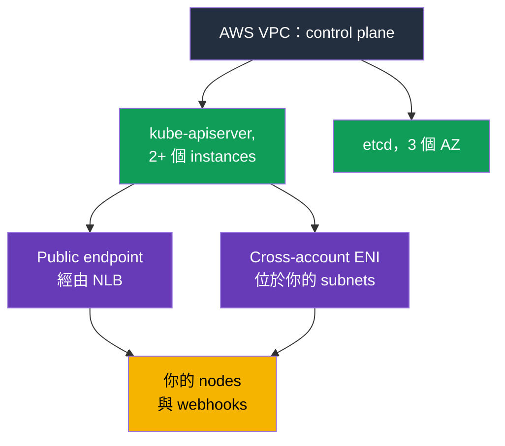
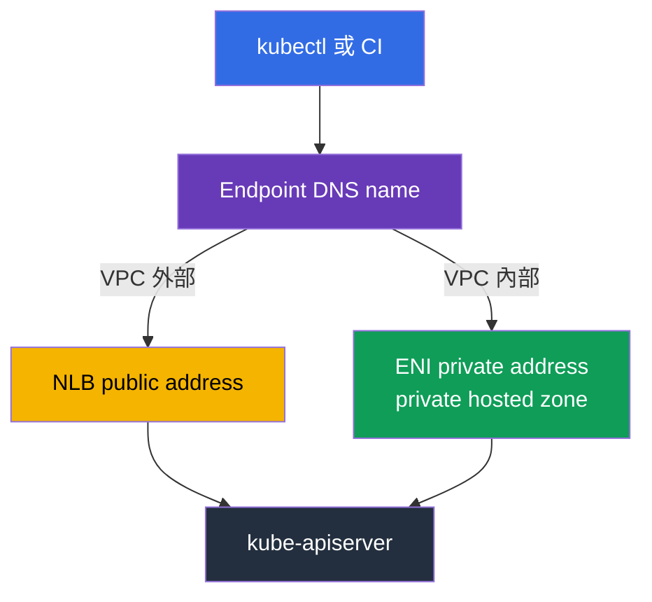
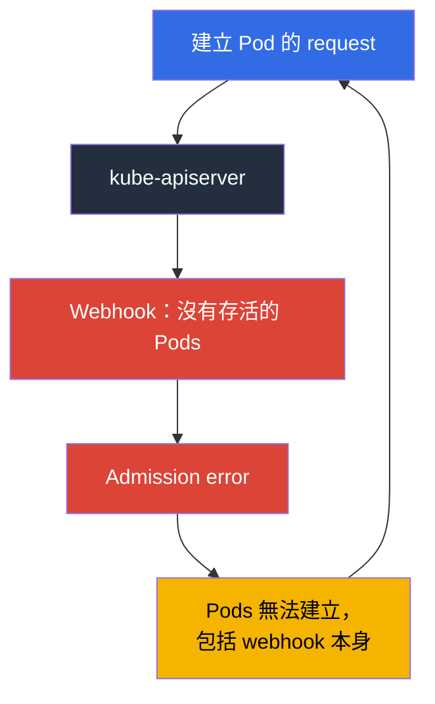

[Русская версия](ru.md) · [Eng version](en.md) · [Versión en español](es.md) · [Version française](fr.md) · [Deutsche Version](de.md) · [ქართული ვერსია](ge.md) · [日本語版](jp.md)
# 第 2 章. EKS control plane：public 與 private endpoint、platform versions、SLA、logs

> **接下來。** 責任界線已在第 1 章說明，現在具體討論 AWS 負責的一側。Control plane 在 `kubectl` 中看不見，但它不是抽象概念：它有 address、在你 subnets 中的 network interfaces、security group、自己的 patch level、logs 與 SLA。「cluster 無法使用」與「Pods 無法建立」這類 incidents 中，有一半正是由這些設定而不是 Kubernetes 引起。第 3 章將繼續討論 versions 與其支援期限。

## 2.1. Cluster 正在運行，卻找不到 control plane

新 cluster 的典型第一項工作，是關閉對 API server 的存取。工程師會到 EC2 尋找 control plane instances，找不到後，又到 VPC console 的 VPC endpoints 清單中尋找 endpoint，仍然找不到。這不是錯誤：**control plane 位於 AWS 擁有的 VPC**，你的 account 中沒有它的 instances。文件明確指出，cluster 的 private endpoint 不是一般的 PrivateLink endpoint，不會顯示於 VPC console。

你的 VPC 中仍有來自 control plane 的資源：建立 cluster 時，EKS 會在你指定的 subnets 建立 **cross-account elastic network interfaces**，共有 2 到 4 個 network interfaces，由服務擁有但使用你的 addresses。Control plane 透過它們與你的 resources 通訊：連線至 kubelet 的 10250 port（用於 `kubectl exec`、`logs`、`port-forward`、`attach`、`cp`）、呼叫 admission webhooks、存取 OIDC provider 與你的 aggregated API servers。反方向，nodes 至 API server 的流量會前往 cluster endpoint。



實務上的結果是：**建立 cluster 時指定的 subnets 不能視為次要項目**。其中必須有可用 addresses，而且不僅是在開始時：變更 control plane logging configuration 時，EKS 要求每個 subnet 最多有五個可用 IP addresses。地址耗盡時，操作便會失敗。

## 2.2. Cluster security group：它允許什麼，以及什麼不受它控制

EKS 會與 cluster 一起建立名稱如 `eks-cluster-sg-<cluster>-<uniqueID>` 的 security group。預設 rules 是來自自身的所有 inbound traffic（source self），以及至 `0.0.0.0/0` 的所有 outbound traffic。同一個 group 會自動套用至 cluster 的 cross-account ENI 及 managed node groups 中 nodes 的 interfaces，因此預設情況下 control plane 和 nodes 可以完整互通。

了解它實際控制什麼很重要。Cluster security group 管理兩類 connections：存取 **private endpoint** 與存取 **kubelet API**。它完全不影響 public endpoint，public endpoint 只由 CIDR list 限制。

| 操作 | cluster security group 所需設定 |
|-------------|------------------------------------|
| 保持原樣 | ingress from self + egress `0.0.0.0/0`，一切可運作，但 rules 極度寬鬆 |
| 移除寬鬆 egress | 最低要求：cluster security group 的 TCP 443 與 TCP 10250，以及 DNS 的 TCP 和 UDP 53 |
| `kubectl exec` 與 `logs` | control plane 必須能在 10250 存取 nodes 的 kubelet，否則 commands 會卡住 |
| 從 bastion 或 office 存取 private endpoint | 從來源進行 ingress TCP 443（bastion SG、office CIDR 或 transit network） |
| 刪除 self rules | EKS 會在下次 cluster update 時加回；service 也會還原 tags |

另外，nodes 需要 outbound access：向 EKS API 註冊，以及從 ECR 與 S3 取得 images。沒有 Internet 出口的 private clusters 與所需 VPC endpoints，請見第 19 章。

```bash
# Cluster 的完整 network configuration：modes、subnets、SG
aws eks describe-cluster --name demo --query 'cluster.resourcesVpcConfig'

# 僅取得 cluster security group identifier
aws eks describe-cluster --name demo \
  --query 'cluster.resourcesVpcConfig.clusterSecurityGroupId' --output text
```

## 2.3. Endpoint access modes 與各模式的故障方式

新 cluster 預設以 public endpoint 建立：`endpointPublicAccess=true`、`endpointPrivateAccess=false`。這很方便，也是 audit 的第一項質疑。共有三種 combinations，每種都有自己的 traffic mechanics。

| 模式 | Flags | Traffic 路徑 | Access 控制方式 |
|-------|-------|------------------|------------------------|
| 僅 public（預設） | `endpointPublicAccess=true`、`endpointPrivateAccess=false` | VPC 內 nodes 的 requests 離開 VPC，但仍留在 Amazon network | 僅 `publicAccessCidrs` |
| Public 與 private | 兩者皆為 `true` | VPC 內 requests 透過 private endpoint，外部 requests 透過 public endpoint | public 使用 `publicAccessCidrs`，private 使用 cluster security group |
| 僅 private | `endpointPublicAccess=false`、`endpointPrivateAccess=true` | 所有至 API server 的 traffic 僅能從 VPC 或連接的 network 發出 | 僅 cluster security group；`publicAccessCidrs` 無效 |

啟用 private access 時，EKS 會代表你建立 **Route 53 private hosted zone**，並將其關聯至 cluster VPC。此 zone 由服務管理，不會出現在你的 Route 53 resources 中。若要讓 endpoint name 解析為 private address，VPC 必須啟用 `enableDnsHostnames` 與 `enableDnsSupport`，且 DHCP options set 必須包含 `AmazonProvidedDNS`。這正是「cluster 已建立但 nodes 無法連線」由 VPC settings 而不是 EKS 設定所造成的情況（第 0.3 章）。

僅 private mode 還有一個細節：現在，endpoint name 會在 VPC 外透過 public DNS 解析為 private address，而過去僅能從 VPC 內解析。若長期運作的 cluster 名稱未回傳 private address，文件建議啟用再停用 public access，一次便已足夠。

常見而耗時的故障如下：

- **CI 停止部署。** SaaS 中的 runners 位於你的 network 外。切換至 private-only 一定會讓它們故障；可透過 VPC 中的 runners、self-hosted agents 或 transit network access 修正。必須在切換之前而非之後檢查。
- **Office 中的 `kubectl` 沒有回應。** 在 private-only mode，API access 僅能來自 VPC 或連接的 network。可行選項有：cluster subnet 中使用 SSM Session Manager 的 bastion host（不開放 port 22）、AWS Client VPN、Direct Connect、transit gateway、VPC 中的 CloudShell。Cluster security group 還必須允許來自該來源的 ingress 443，否則路徑雖在，access 仍不存在。
- **另一個 VPC 中的 nodes。** Private endpoint 在 cluster VPC 中解析。Peering 本身不會提供 name resolution：需要 zone association 或自己的 resolver，否則 nodes 找不到 API。
- **兩種 modes 都啟用的 Hybrid nodes。** VPC 外的 nodes 會將名稱解析為 public addresses；文件建議這些 nodes 選擇一種 mode，而不是兩者皆用。
- **Control plane scaling 時 connections 中斷。** API server instances 會被替換，名稱開始回傳不同 addresses，而 managed zone 的 TTL 是 60 秒。將 DNS 快取整個 process lifetime 的 clients 會遇到 timeouts；應重新解析名稱並 retry。

```bash
# 以單一操作開啟 private endpoint 並收緊 public access
aws eks update-cluster-config --name demo --resources-vpc-config \
  endpointPublicAccess=true,endpointPrivateAccess=true,publicAccessCidrs=203.0.113.0/24

# 等待完成：status 為 Successful
aws eks describe-update --name demo --update-id <id> --query 'update.status'
```



## 2.4. 沒有 0.0.0.0/0 的 public endpoint

`publicAccessCidrs` 的預設值為 `0.0.0.0/0`（對使用 `IPv6` 的 dual-stack clusters，另加 `::/0`）。也就是說，public endpoint 預設可從整個 Internet 存取，這是 AWS 為了簡化開始流程所做的有意選擇，並非疏失。

收緊 list 是 cluster security 中最便宜的修正：一個 command，workloads 零變更。請記住：

- 若限制 CIDR 且**未啟用 private endpoint**，list 必須包含 nodes 與 Fargate Pods 存取 public endpoint 時使用的 addresses。否則 nodes 會斷線。文件的建議更簡單：啟用 private access，不要猜測。
- List 中可使用 `IPv4` CIDRs；`IPv6` CIDRs 僅接受用 `ipFamily=IPv6`、於 2024 年 10 月後建立的 dual-stack clusters，否則會發生 `The following CIDRs are invalid in publicAccessCidrs` error。
- Office 與 VPN addresses 會變化。CIDR list 是 code 中持續變動的 configuration（第 4 章），不是 console 的一次性變更，否則有一天它會把你自己鎖在外面。

最重要的是：**這是 network filter，不是 authentication**。CIDR restriction 既不能取代 IAM，也不能取代 RBAC。從允許 address 發出的 request 仍會經過 IAM principal validation 與 RBAC authorization（第 5 章）；使用已遭入侵 administrator role 從允許 address 發出的 request 仍會成功。反過來的錯誤也很常見：以為 private-only 足以合理化將 `cluster-admin` 分給所有人。

## 2.5. Control plane 呼叫你：webhooks

這會打破「control plane 是隔離的」這個觀念。Validating 與 mutating admission webhooks 由 **API server** 呼叫，因此 traffic 會從 AWS VPC 經由 cross-account ENI 流向你的 VPC，通常至 443 port，最常見是 controller 的 Service。這表示你的 Pods 是否可用，成為 API server 運作的條件。

因此 EKS 中最令人痛心的 incident 是：**webhook 無法使用，Pods 無法建立**。



此 cycle 會閉合：webhook 停擺是因為其 Pods 無法建立，而 Pods 無法建立是因為 webhook 停擺。最常見的原因，是 cluster 被縮放至零 nodes、webhook 被移至 spot，或具有廣泛 rules 的 `failurePolicy: Fail`。AWS 的建議及實務可行做法如下：

- 不要建立 `apiGroups: ["*"]`、`resources: ["*"]`、`operations: ["*"]` 的「catch-all」webhooks。
- 保持 timeout 明顯小於 30 秒，並有意識地選擇 `failurePolicy`。Fail-open 降低阻塞 critical operations 的風險，fail-closed 保留 policy guarantee；應依 object 選擇，而非「到處都一樣」（第 22 章）。
- 從 webhook scope 中排除 `kube-system` 與 controller 自身的 namespace。
- 在不同 AZ 維持多個 webhook instances，搭配 PDB（第 40 章）。
- 請記得 network：control plane 至 webhook 的 path 必須開放。預設情況下 control plane egress 由 AWS 管理（`controlPlaneEgressMode=AWS_MANAGED`）；`CUSTOMER_ROUTED` mode 會將此 path 連同 routes、NACL 與 security groups 的責任交給你，且切換是單向的，無法回到 `AWS_MANAGED`。必須理解這個界線：control plane 與 nodes 之間經 cluster ENI 的 traffic（包括 10250 的 kubelet API）不依賴你的 egress device；真正會故障的是向外的 traffic，例如 webhook calls 與 OIDC authentication。

## 2.6. Platform version：自行提高的 patch level

`kubectl get --raw /version` 顯示 Kubernetes version，但不會告訴你是哪個 EKS control plane 在提供服務。此資訊由 **platform version** 提供，格式如 `eks.14`。

它描述 Kubernetes minor version 內 EKS control plane 的功能：啟用了哪些 API server flags、哪些 admission controllers 正在作用，以及目前的 Kubernetes patch level。編號對每個 Kubernetes minor version 獨立：從 `eks.1` 開始，當 AWS 發佈新的 control plane settings 或 security fixes 時增加。因此 1.30 的 `eks.1` 與 1.31 的 `eks.1` 是不同的 control plane builds。與 Kubernetes version 的關鍵差別是：**你不會啟動 platform version update**。AWS 會自動將現有 clusters 提升至其 minor version 最新的 platform version，並逐步 rollout。新的 platform versions 不帶來 breaking changes，也不會造成 downtime。

| 問題 | Kubernetes version | Platform version |
|--------|-------------------|------------------|
| 誰發起變更 | 你，呼叫 EKS API（第 38 章） | AWS，自動進行 |
| 格式 | `1.33` | `eks.14` |
| 是否帶來不相容 changes | 是，需為此準備 | 否 |
| 內容 | Kubernetes version 及其 API | apiserver flags、admission plugins 集合、Kubernetes patch |
| 何時是你的問題 | 一直都是：support period、upgrade plan | cluster 落後超過兩個 platform versions 時 |

最後一列是值班時查看 platform version 的唯一實際原因。落後超過兩個 versions 意味著 automatic update 未通過，應依文件的 troubleshooting section 調查，而不是忽略它。

```bash
# Kubernetes version、platform version 與 cluster status
aws eks describe-cluster --name demo \
  --query 'cluster.[version,platformVersion,status]' --output text

# 現在啟用了哪些 control plane logging
aws eks describe-cluster --name demo --query 'cluster.logging'
```

## 2.7. Control plane logs：五種類型，預設沒有

不再能 `ssh` 至 master，也無法使用 `kubectl logs -n kube-system kube-apiserver-...`（第 1 章）。唯一 channel 是 **CloudWatch Logs**，而且預設關閉。Cluster 正在運行、incident 發生，卻沒有歷史記錄：沒有事先啟用的 logs 無法事後出現。這是在新 cluster 上首先要設定的項目。

類型恰好有五種，API 名稱正是：`api`、`audit`、`authenticator`、`controllerManager`、`scheduler`。

| 類型 | 內容 | 何時能救場 |
|-----|-----------|---------------|
| `api` | kube-apiserver component logs；若在建立時立即啟用，stream 開頭可看到 API server 使用的 flags | 分析 API errors 與 timeouts、了解 control plane configuration |
| `audit` | 誰、何時、以哪個 request 及哪個結果變更 cluster objects：users、administrators、system components | 「誰刪除了 namespace」、incident investigation、compliance（第 21 章） |
| `authenticator` | EKS 特有的 component：使用 IAM credentials 的 RBAC authentication | `You must be logged in to the server`、debug access entries 與 IRSA（第 5、47 章） |
| `controllerManager` | 標準 Kubernetes control loops | objects 未建立或刪除、卡住的 finalizers、controller problems |
| `scheduler` | 決定何處與何時執行 Pods | Pods 處於 `Pending` 且沒有明確 events、affinity 與 topology spread conflicts |

啟用前必須知道：

- Log group 名稱是 `/aws/eks/<cluster-name>/cluster`，streams 按 components 分組，名稱形如 `kube-apiserver-audit-<id>`；它們會在成長時 rotate，最近的一個由最新 event 判斷。Delivery 在數分鐘內進行，並宣告為 best effort。
- 按 type、按 cluster 透過 console、CLI 或 API 啟用。啟用時 verbosity level 為 2。再次提醒 addresses：變更 configuration 時，每個 subnet 最多需要五個可用 IP。
- **這需要付費。** EKS charge 保持標準費率，而另外會按一般 CloudWatch Logs 的 ingestion、storage 與 data scanning rates 收費。最有大量資料的 type 是 `audit`，在 active cluster 上可能成為 bill 中顯著的一項。
- Retention 設定於 CloudWatch Logs 一側，而不是 EKS。一個沒有設定 retention period 的 log group 會無限且付費地保存 data。因此啟用 logs 後，應立即在 `/aws/eks/<cluster>/cluster` 呼叫 `aws logs put-retention-policy` 設定合理期限（stream 中通常 7 至 14 days），長期 archive 則移至 S3（第 34、43 章）。實務做法：`audit` 永遠啟用，並明確設定 retention。

```bash
# 啟用兩種類型；其他類型以相同 list 加入
aws eks update-cluster-config --name demo \
  --logging '{"clusterLogging":[{"types":["api","audit"],"enabled":true}]}'

# 一次啟用全部五種類型
TYPES='["api","audit","authenticator","controllerManager","scheduler"]'
aws eks update-cluster-config --name demo \
  --logging "{\"clusterLogging\":[{\"types\":$TYPES,\"enabled\":true}]}"

# 是否存在 log group，以及它的 retention 為何
aws logs describe-log-groups --log-group-name-prefix /aws/eks/demo \
  --query 'logGroups[].[logGroupName,retentionInDays]' --output table

# 設定 retention：沒有它，log group 會無限累積 logs
aws logs put-retention-policy --log-group-name /aws/eks/demo/cluster \
  --retention-in-days 14

# 即時 audit tail
aws logs tail /aws/eks/demo/cluster \
  --log-stream-name-prefix kube-apiserver-audit --since 10m --follow
```

## 2.8. Control plane observability：429 是給你的

Managed control plane 不代表「不必監控它」。寫得不好的 controller、循環執行 `kubectl` 的 script、一次建立的一千個 Pods，都可能讓 API server 開始回應 `429 Too Many Requests`。這是保護而不是 failure：API server 會限制 simultaneous requests 的數量，寧可拒絕額外 requests，也不願 degradation。**API Priority and Fairness** 透過 FlowSchema 與 PriorityLevelConfiguration 管理此 quota 在各類 request 間的分配；在 EKS 中，這些 objects 由系統自動管理，並使用該 minor version 的 default configuration。Quota 會隨 control plane scaling 而提高，cluster 中至少有兩個 API servers，因此總 throughput 高於單一 server，但仍非無限。

Control plane metrics 可透過 API 取得：`kubectl get --raw /metrics`，格式為 Prometheus。應收集的項目如下（第 33、34 章說明放置位置）：

| 觀察項目 | Metrics | 增長代表什麼 |
|--------------|---------|--------------------|
| API latency | `apiserver_request_duration_seconds` | control plane 或 etcd 負載過高、沒有 pagination 的 requests、繁重的 LIST |
| Errors 與 throttling | 按 code 的 `apiserver_request_total` | 429 暴增表示 client 正在壓垮 cluster；5xx 時查看 `api` logs |
| Admission | `apiserver_admission_controller_admission_duration_seconds`、`apiserver_admission_webhook_rejection_count` | 緩慢或拒絕的 webhook，即你的自身 bottleneck（第 2.5 節） |
| etcd | `etcd_request_duration_seconds`、`apiserver_storage_size_bytes` | 接近 database size limit：溢出時 cluster 轉為 read-only |
| Clients | `rest_client_requests_total` | 哪個 controller 產生主要 request stream |

```bash
# Prometheus format 的 API server metrics
kubectl get --raw /metrics | head -20

# 有多少 requests 以 429 結束
kubectl get --raw /metrics | grep 'apiserver_request_total.*code="429"'

# 當前 request priority configuration
kubectl get flowschemas
kubectl get prioritylevelconfigurations
```

簡單的習慣能消除半數問題：不要在 loops 中執行 `kubectl`，不要在 containers 中遺失 client cache（`--cache-dir`），使用 PDB，避免 Pods 與 nodes 的流失變成 EndpointSlice updates 的雪崩，也不要一次以數十 percent 的躍升方式縮放 cluster。

## 2.9. SLA、multi-AZ 與仍由你負責的部分

EKS control plane 原生採 multi-AZ：同一 region 的三個 Availability Zones 中，至少有兩個 API server instances 與三個 etcd instances；每個 cluster 都有自己的獨立 control plane，不與其他 clusters 或 accounts 共用。EKS 會自行替換失敗的 instance，必要時會在另一個 AZ 中替換，並自動依負載調整 control plane capacity。

此架構構成 SLA：對 standard control plane clusters，AWS 承諾在每月 billing cycle 內提供至少 **99.95%** Monthly Uptime Percentage 的 Kubernetes endpoint availability，以五分鐘 intervals 測量。對 provisioned control plane clusters（依 pricing tiers 預先配置 control plane capacity 的 mode），SLA 提高至 99.99%，以每分鐘測量。最新條款與 compensation procedure 一律以 service SLA page 為準。

Control plane 的 multi-AZ 不會給你以下保障：

| 仍是你的工作 | 原因 |
|------------------------|--------|
| 不同 AZ 中的 nodes | control plane 能承受 AZ failure，但所有 nodes 位於一個 AZ 的 Deployment 無法承受（第 40 章） |
| 不同 AZ 的 node subnets 與可用 addresses | 否則根本沒有地方可分散 workload（第 6、7 章） |
| topology spread、PDB、正確的 node shutdown | application availability 不會繼承 API availability（第 40 章） |
| EBS volumes 與 AZ 的綁定 | volume 不會隨 Pod 一起跨 AZ 移動（第 23 章） |
| 你的 webhooks 與 add-ons 的 availability | 第 2.5 節與第 37 章：由你讓它們失敗，但 admission 會受害 |
| Multi-region | SLA 是 regional；一個 region 中的 cluster，其 DR 是另一項工作（第 42 章） |

與 business 溝通時的表述：SLA 涵蓋的是 **API server endpoint availability**，而不是你的 application availability。即使 control plane 完美運作，application 仍可能停擺，這完全是你的 incident。

## 2.10. 如何在 production 中使用這些知識

- **兩種 endpoint modes 都啟用，且收緊 public access。** `endpointPrivateAccess=true` 加上 office 與 VPN ranges 的 `publicAccessCidrs`。完全 private-only 是有意識的步驟，必須先準備 CI、bastion 與 DNS。
- **Endpoint configuration 作為 code。** Modes、CIDRs、security groups 與 log types 位於 Terraform 或 eksctl 中（第 4 章）。Console 中的變更會存活到下一次 `apply` 為止。
- **從第一天就啟用 logs。** 至少要有 `audit` 與 `authenticator`，明確設定 retention，並為 `audit` 中可疑 events 設定 metric filters 與 alarms（第 21 章）。
- **Dashboard 上的 control plane metrics。** API latency、429 與 5xx 比率、admission duration、etcd database size。429 burst 要作為 incident 調查：找出 client。
- **將 webhooks 視為 control plane 的一部分。** Scope 狹窄、timeout 短、排除 `kube-system`、在不同 AZ 有多個 replicas、使用 PDB。
- **Cluster security group 既非「全部允許」，也非「全部禁止」。** 保留文件中的最低 rules，外加為 bastion 與 transit network 明確設定的 ingress 443。

## 2.11. 迷你詞彙表

- **Cluster endpoint** 是 cluster 的 Kubernetes API address。**Public endpoint** 可從 Internet 存取，僅受 CIDR list 限制；**private endpoint** 可從 VPC 存取，受 cluster security group 限制。
- **`endpointPublicAccess` / `endpointPrivateAccess`** 是 access mode boolean flags；預設為 `true` 與 `false`。**`publicAccessCidrs`** 是允許使用 public endpoint 的 CIDR list；預設為 `0.0.0.0/0`。
- **Cross-account ENI** 是 EKS 在你的 subnets 中建立、供 control plane 與 nodes、kubelet API、webhooks、OIDC 通訊的 network interfaces。**Cluster security group** 是自動為 cluster 建立、套用到這些 interfaces 與 managed node groups nodes 的 group。
- **Private hosted zone** 是 EKS 建立並關聯至你的 VPC 的 Route 53 zone，使 endpoint name 解析為 private address。
- **Platform version** 是 Kubernetes minor version 中 EKS control plane 的 patch level 與 feature set，格式為 `eks.<n>`，由 AWS 自動更新。
- **Control plane log types** 是 `api`、`audit`、`authenticator`、`controllerManager`、`scheduler`；僅在啟用後寫入 CloudWatch Logs。
- **API Priority and Fairness** 是 Kubernetes 在各類 simultaneous requests 間分配 quota 的機制；quota 耗盡時 client 會收到 `429`。

## 2.12. 本章小結

- Control plane 位於 AWS VPC，但你的 subnets 中有它的 cross-account ENI（2 至 4 個）及 cluster security group。流量經由這些到達 10250 的 kubelet、webhooks 與 OIDC。
- Cluster security group 管理 private endpoint 與 kubelet API，但不管理 public endpoint。Public endpoint 僅由 `publicAccessCidrs` 限制，預設為 `0.0.0.0/0`。
- 三種 access modes：僅 public（預設）、public 與 private、僅 private。切換 mode 會破壞 VPC 外的項目：SaaS CI runners、office 中的 `kubectl`、peered VPC 中的 nodes。Private access 需要 private hosted zone 及 VPC 中正確的 DNS settings。
- CIDR restriction 是 network filter，而非 authentication：IAM 與 RBAC 仍是必要條件。
- API server 會呼叫你的 webhooks；具有寬泛 rules 的不可用 webhook 會停止 Pod creation，並形成自身 cycle。
- Platform version 是 control plane patch level，會自行提升；僅當 cluster 落後超過兩個 versions 時才需採取行動。
- 五種 control plane log types 預設關閉、會寫入 CloudWatch Logs 並產生費用；retention 在 CloudWatch 一側設定。
- Control plane 分布於三個 AZ，standard mode endpoint availability 的 SLA 是 99.95%。Application、volumes 與 webhooks 的 multi-AZ 則仍是你的工作。

## 2.13. 這如何幫助實際工作

值班時的三個情況。第一個是「cluster 無法使用」。問題不在 Kubernetes，而是 request 從何處發出及啟用何種 endpoint mode，透過具有 `resourcesVpcConfig` 的 `describe-cluster` 可在十秒內回答。第二個是「Pods 無法建立，events 是空的」。應檢查 admission：webhook metrics 與 `api` logs；若 logs 尚未啟用，你會在最糟的時刻得知此事，因此要預先啟用。第三個是 audit 要求顯示誰刪除了 resource。答案只存在於 `audit`，而且僅在它已啟用且尚未超出 retention 的情況下。此外，收緊 `publicAccessCidrs` 並啟用 private endpoint，是任何 EKS security checklist 中最便宜的項目：幾分鐘的工作，application 零變更。

## 2.14. 自我檢查問題

1. 為什麼 cluster private endpoint 不會顯示在 VPC endpoints list 中？
2. 什麼是 cross-account ENI，它們在哪些 subnets 中建立，哪些 traffic 經由它們流動？
3. Cluster security group 管理哪兩類 connections，又不管理哪一類？
4. 列出三種 endpoint access modes，並指出預設 flag values。
5. 你把 cluster 切換為 private-only。你的 CI 與 `kubectl` 會有什麼故障？
6. 為什麼 EKS 建立 private hosted zone，且它必須具備哪些 VPC settings？
7. `publicAccessCidrs` 預設為何，為什麼收緊它不能取代 RBAC？
8. 限制 public access 後 nodes 停止註冊。你忘了什麼？
9. 為什麼不可用的 validating webhook 會停止 Pod creation，又如何中斷 cycle？
10. Platform version 與 Kubernetes version 有何不同，誰更新它？
11. 說出五種 control plane log types，以及應在哪一種中尋找「誰刪除了 namespace」。
12. API server 回應 `429`。這代表什麼，你會從哪裡開始調查？
13. EKS SLA 涵蓋什麼，而 AZ failure 時什麼仍是你的責任？

## 實作

本章尚無 lab，但其中所有內容都能在任何可存取的 cluster 上讀取：使用 `--query 'cluster.resourcesVpcConfig'` 的 `aws eks describe-cluster` 會顯示 modes、CIDR 與 cluster security group，`--query 'cluster.[version,platformVersion]'` 顯示 versions，`--query 'cluster.logging'` 顯示已啟用的 log types。接著使用 `aws logs describe-log-groups --log-group-name-prefix /aws/eks` 與 `kubectl get --raw /metrics`。第 3 章轉向 Kubernetes versions：support periods、standard 與 extended support、upgrade strategy。

---
[目錄](../README_TW.md) · [第 1 章](../01/tw.md) · [第 3 章](../03/tw.md)
