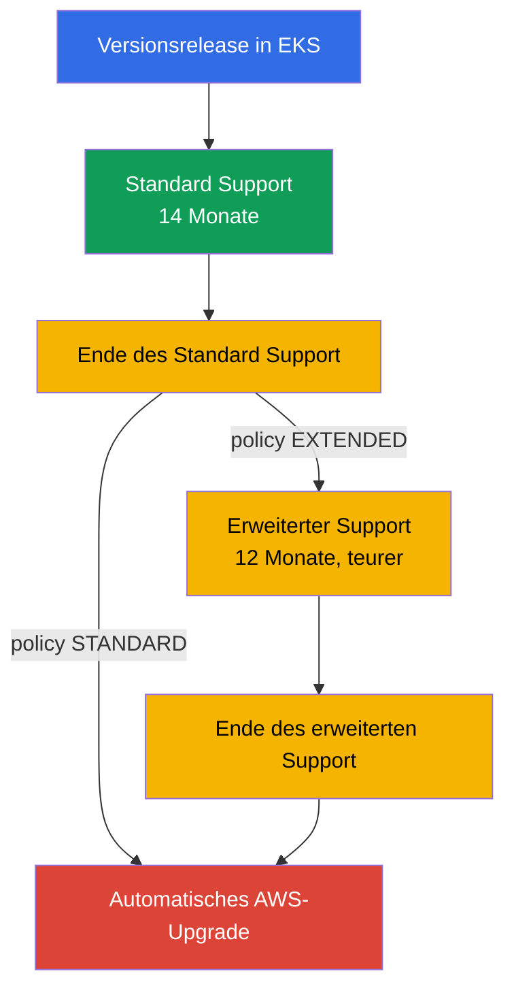
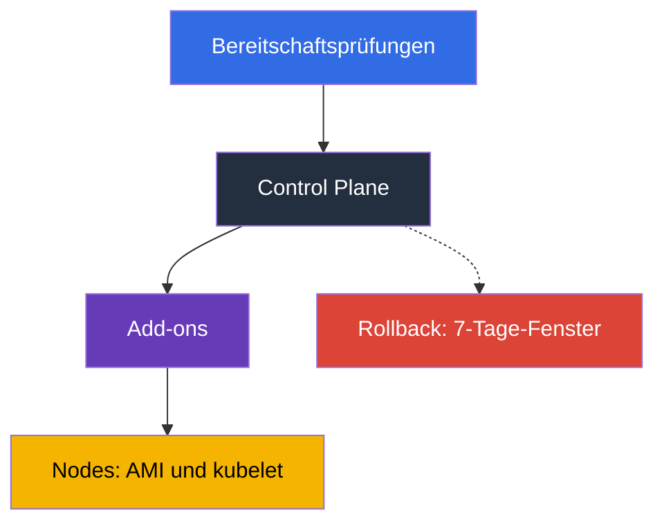

[Русская версия](ru.md) · [Eng version](en.md) · [Versión en español](es.md) · [Version française](fr.md) · [ქართული ვერსია](ge.md) · [繁體中文版](tw.md) · [日本語版](jp.md)
# Kapitel 3. Versionslebenszyklus: Standard- und erweiterter Support, Upgrade-Strategie

> **Wie es weitergeht.** AWS betreibt die Control Plane, aber Sie wählen die Kubernetes-Version,
> und diese Wahl hat ein Ablaufdatum: 14 Monate Standard Support und 12 Monate erweiterten
> Support, nach denen der Cluster ohne Ihre Mitwirkung aktualisiert wird. Dieses Kapitel behandelt
> Richtlinien und Planung: Fristen, Preise, Risiken, Vorbereitung und Teamrhythmus. Die Mechanik
> des Upgrades steht in Kapitel 38, der Rollback in Kapitel 39 und Add-on-Versionen in Kapitel 37.
> Hier entscheiden Sie, was und wann Sie tun, nicht womit.

## 3.1. Fünf Wege, im schlechtesten Moment von Versionen zu erfahren

Alle fünf Geschichten passieren Teams mit einem gut laufenden Cluster: Es tut nichts weh.

- **Ein Cluster, den ein Jahr lang niemand angefasst hat.** Die Version liegt zwei Minor Releases
  zurück, aber ein Upgrade ist nur um jeweils eine Minor Version möglich: nicht ein
  Wartungsfenster, sondern zwei.
- **Die Rechnung stieg, die Last aber nicht.** Die Version verließ den Standard Support, Cluster
  gingen in den erweiterten Support über, der mit einem höheren Stundensatz pro Cluster berechnet wird.
- **AWS hat den Cluster selbst aktualisiert.** Auch der erweiterte Support endet: außerhalb Ihres
  Fensters, ohne Ihren Prüfplan und ohne Möglichkeit, das Ergebnis zurückzusetzen.
- **Ein Add-on lief nicht.** Die Control Plane wurde aktualisiert, aber `vpc-cni` oder ein
  CSI-Treiber blieb auf einer Version, die von der neuen Minor Version nicht unterstützt wird, und
  die Symptome treten nicht sofort auf.
- **Ein Deployment brach nach dem Upgrade.** Ein Chart enthielt noch eine in der neuen Version
  entfernte `apiVersion`, während bestehende Objekte weiterliefen: Das Problem wird beim nächsten
  Release entdeckt, wenn `helm upgrade` fehlschlägt.

Der gemeinsame Nenner: Die Kubernetes-Version ist keine Cluster-Eigenschaft, sondern ein
**Prozess mit Kalender**.

## 3.2. Wie der Zyklus funktioniert: 14 plus 12

Upstream veröffentlicht ungefähr alle vier Monate Minor Versionen, und EKS folgt seinem Release-
und Deprecation-Zyklus. Danach kommt der EKS-spezifische Zähler: **Standard Support, die ersten 14
Monate**, nachdem eine Version in EKS erscheint (Patches, neue Platform Versions, regulärer Preis
pro Cluster), anschließend **erweiterter Support, die nächsten 12 Monate**, in denen
Sicherheitsupdates fortgesetzt werden, der Cluster aber mehr kostet. Das sind insgesamt **26
Monate**, nach denen der Cluster automatisch aktualisiert wird.



Der Kalender mit Release-Daten und den Enddaten beider Zeiträume ist in der EKS-Dokumentation und
über die API verfügbar. Codieren Sie Daten nicht fest in einem Runbook: Sie werden präzisiert und
Versionen kommen hinzu.

```bash
# Alle EKS-Versionen mit Support-Enddaten
aws eks describe-cluster-versions \
  --query 'clusterVersions[].[clusterVersion,versionStatus,endOfStandardSupportDate,endOfExtendedSupportDate]' \
  --output table

# Nur Versionen, die bereits im erweiterten Support sind
aws eks describe-cluster-versions --version-status extended-support
```

Ein Cluster kann mit jeder unterstützten Version erstellt werden, aber der Start mit einer Version
im erweiterten Support bedeutet einen höheren Tarif ab dem ersten Tag und weniger Zeit bis zum
Upgrade.

## 3.3. Upgrade policy: STANDARD oder EXTENDED

Was mit einem Cluster am Ende des Standard Support geschieht, bestimmt das Feld upgrade policy mit
dem Wert `supportType`. Der Unterschied besteht nicht darin, ob ein Upgrade stattfindet, sondern
wann AWS es ausführt.

| | `STANDARD` | `EXTENDED` |
|---|---|---|
| Was am Ende des Standard Support geschieht | AWS aktualisiert den Cluster automatisch auf die nächste unterstützte Version | der Cluster wechselt in den erweiterten Support und bleibt auf seiner Version |
| Zusätzliche Kosten | nein | ja, höherer Stundensatz pro Cluster |
| Wie lange die Version danach noch lebt | 0 Monate | 12 Monate |
| Was am Ende dieses Zeitraums geschieht | - | automatisches Upgrade durch AWS |
| Ob die Richtlinie geändert werden kann | ja, solange die Version im Standard Support ist | ein Zurückwechseln ist nicht möglich, sobald der Cluster im erweiterten Support ist |
| Rollback nach automatischem Upgrade | nicht verfügbar | am Ende des erweiterten Support nicht verfügbar |

Drei Details. **Der erweiterte Support ist standardmäßig aktiviert** für neue und vorhandene
Cluster: Sie sind vor einem plötzlichen Upgrade geschützt, aber nicht vor einer steigenden Rechnung.
**Der erweiterte Support kann nicht durch Umschalten der Richtlinie verlassen werden**: Er kann nur
abgeschaltet werden, solange die Version im Standard Support ist. **Aktivieren Sie `EXTENDED` im
Voraus**: Wenn das automatische Upgrade begonnen hat, kann die Richtlinienänderung zu spät wirken.

```bash
# Aktuelle Cluster-Richtlinie und -Version
aws eks describe-cluster --name demo \
  --query 'cluster.{version:version,platform:platformVersion,policy:upgradePolicy}'

# Erweiterten Support abschalten: Der Cluster wird am Ende des Standard Support automatisch aktualisiert
aws eks update-cluster-config --name demo --upgrade-policy supportType=STANDARD
```

Die Versuchung „AWS wird uns selbst aktualisieren“ funktioniert formal: Setzen Sie `STANDARD` und
machen Sie sich keine Gedanken. Praktisch gibt das Kontrolle über **Zeitpunkt** (das Upgrade kommt
nicht in Ihrem Fenster), **Reihenfolge** (die Control Plane wird vor der Prüfung von Add-ons und
Manifesten aktualisiert) und **Absicherung** (Rollback ist nicht verfügbar) auf.

## 3.4. Der Preis des Aufschubs

Erweiterter Support ist kein „besserer Support“, sondern ein Zähler. Die stündliche Gebühr pro
Cluster im erweiterten Support ist höher als der Standardtarif und wird mit der Zahl der Cluster
und Stunden multipliziert. Berechnen Sie sie so: Nehmen Sie die Standard- und Extended-Support-
Preise pro Cluster-Stunde von der EKS-Preisseite, multiplizieren Sie die Differenz mit 730 Stunden,
dann mit der Zahl der Cluster und Monate des Aufschubs, und vergleichen Sie dies mit den
Personentagen für Vorbereitung und Upgrade.

Die Vorbereitung erfolgt einmal für den Park, während die Gebühr für erweiterten Support für jeden
Cluster und jede Stunde aufläuft. Deshalb spricht die Rechnung gewöhnlich gegen den Aufschub.
Erweiterter Support ist für begründete Situationen sinnvoll: ein Freeze vor einem Release, eine
inkompatible Herstellerkomponente oder ein laufendes Audit. In jedem Fall hat der Aufschub ein
Enddatum und einen Verantwortlichen. Halten Sie `supportType` mit der Version im
Infrastrukturcode (Kapitel 4): Der Eintritt in den erweiterten Support ist in einem Pull Request
sichtbar, nicht auf der Rechnung.

## 3.5. Was sich beim Wechsel einer Minor Version genau ändert

Die API-Menge, das Verhalten der Komponenten und manchmal das Node-Basisimage ändern sich. Im
Folgenden steht, was in der Praxis bricht und wie dies vorab geprüft wird.

| Was bricht | Warum | Wie vorher prüfen |
|---|---|---|
| Entfernte API-Versionen in Manifesten und Charts | ein Objekt mit entfernter `apiVersion` wird vom API-Server nicht mehr akzeptiert; bestehende Objekte bleiben aktiv, aber ein neues `apply` schlägt fehl | Inventar von Manifesten und Charts, cluster insights, Audit-Logs zu deprecated APIs (Kapitel 21) |
| Add-on-Versionen | `vpc-cni`, `coredns`, `kube-proxy` und CSI-Treiber sind nicht mit jeder Cluster-Version kompatibel | `aws eks describe-addon-versions --kubernetes-version` (Kapitel 37) |
| CRD und Drittanbieter-Controller | ein Controller verwendet eine nicht mehr vorhandene API oder erklärt selbst keine Unterstützung der neuen Version | Kompatibilitätsmatrix für jeden Controller: ingress, autoscaler, service mesh, GitOps |
| Admission webhooks | neue eingebaute Typen und Felder treffen auf breite Webhook-Regeln; ein nicht verfügbarer Webhook stoppt die Admission (Kapitel 2) | Testlauf auf einem Dev-Cluster, enge Regeln, Prüfung der Timeouts |
| Node-Basis-AMI | `1.32` ist die letzte Version, für die EKS AMIs auf AL2 veröffentlicht; ab `1.33` gibt es nur AL2023 und Bottlerocket | user data, bootstrap, Packages und Agents auf AL2023 prüfen (Kapitel 10, 38) |
| Version skew von kubelet | kubelet darf dem API-Server nicht weiter hinterherhinken, als es die Upstream-Skew-Richtlinie erlaubt | Nodes im selben Zyklus wie den Cluster aktualisieren, nicht „irgendwann später“ |
| Verhalten des Schedulers und defaults | Änderungen an defaults und feature gates ändern Pod-Platzierung und Autoscaling | Lasttest auf dev, Metriken vergleichen |

Die AMI-Zeile steht gesondert: Sie ist der einzige Punkt, bei dem sich mit der Kubernetes-Version
gleichzeitig das Node-Betriebssystem ändert. Der Wechsel von AL2 zu AL2023 betrifft user data (ein
anderes bootstrap-Format), die Package-Menge, systemd-Units, Observability-Agents und alles
manuell Installierte; zwei Änderungen in einem Fenster sollten getrennt werden (Abschnitt 3.7 und
Kapitel 38).

## 3.6. Vorbereitung: Inventar, Insights, Dev-Testlauf

Upgrade-Bereitschaft ist kein Gefühl, sondern eine Menge von Prüfungen, die jeweils eine Ja-oder-
Nein-Antwort liefern.

**1. API-Inventar.** Alles, was Objekte im Cluster erstellt: Manifeste, Charts, CI-Templates und
Operatoren. Ziel ist es, `apiVersion`-Werte zu finden, die in der Zielversion nicht existieren.
Audit-Logs der Control Plane (Kapitel 2) zeigen reale Aufrufe veralteter APIs, nicht nur den Inhalt
von git.

```bash
# pluto: Audit entfernter und veralteter apiVersions in Manifesten und Charts; beendet sich mit Code 2-3 bei Funden
pluto detect-files -d ./manifests --target-versions k8s=v1.34.0
helm template ./chart | pluto detect - --target-versions k8s=v1.34.0

# kubent (kube-no-trouble): prüft den laufenden Cluster und Helm-Releases; -e lässt CI bei Funden fehlschlagen
kubent --target-version 1.34 --exit-error
```

Setzen Sie pluto und kubent in CI vor `update-cluster-version` ein: Der Build schlägt fehl, solange
eine entfernte `apiVersion` in git oder im Cluster lebt, und Quellmanifeste erfassen, was der
API-Server stillschweigend konvertiert.

**2. Cluster insights.** EKS selbst führt eine Reihe von Prüfungen auf dem Cluster aus und
aktualisiert sie ungefähr einmal täglich sowie auf Anforderung. `UPGRADE_READINESS` umfasst
Prüfungen, die die Upgrade-Fähigkeit betreffen, einschließlich veralteter APIs;
`ROLLBACK_READINESS` zeigt, ob ein Rollback noch möglich ist, und steht 7 Tage nach einer
Aktualisierung zur Verfügung (Kapitel 39).

```bash
# Upgrade-Bereitschaftsprüfungen und ihre Status
aws eks list-insights --cluster-name demo --filter categories=UPGRADE_READINESS \
  --query 'insights[].[name,insightStatus.status,kubernetesVersion]' --output table

# Details einer bestimmten Prüfung: was gefunden wurde und was empfohlen wird
aws eks describe-insight --cluster-name demo --id <insight-id>
```

**3. Add-on- und Controller-Matrix.** Liste der mit der Zielversion kompatiblen Add-on-Versionen
und Bestätigung der Unterstützung durch Drittanbieter-Controller.

```bash
# Verfügbare Add-on-Versionen für die Zielversion des Clusters
aws eks describe-addon-versions --addon-name vpc-cni --kubernetes-version 1.34 \
  --query 'addons[].addonVersions[].addonVersion' --output text

# API-Gruppen im Cluster und ob der Client hinter dem Server zurückliegt
kubectl api-resources --sort-by=name -o wide | head -30
kubectl version
```

Vor dem Wechsel der Control-Plane-Version durchläuft jedes Add-on und jedes CRD dieselbe
Checkliste:

- eine Zielversion des Add-ons existiert für die neue Cluster-Version (`describe-addon-versions`
  oben);
- der Drittanbieter-Controller (ingress, autoscaler, mesh, GitOps) erklärt die Unterstützung der Zielversion;
- CRD und sein Controller verwenden keine in der Zielversion entfernte `apiVersion` (pluto, kubent).

Ist ein Punkt nicht abgeschlossen, bleibt die Control Plane unangetastet: Sie würde aktualisiert,
bevor das Add-on aufschließen kann.

**4. Testlauf auf einem Dev-Cluster**, der der Produktion ähnelt: gleiche Add-ons, Controller,
Charts und Webhooks. Das findet Fehler, die in keiner Checkliste stehen; manche Probleme zeigen
sich nur unter Last.

**5. Checkliste und Entscheidung.** Zielversion, Add-on-Versionen, Änderungen an Manifesten,
Verantwortlicher für das Fenster, Validierungsplan nach dem Upgrade und Rollback-Bedingung. Ohne
die letzten zwei Punkte wird nicht begonnen.

## 3.7. In-place oder blue/green

Die Wahl wird einmal für den Park getroffen und für einzelne Cluster verfeinert (die Mechanik steht
in Kapitel 38).

| Kriterium | In-place | Blue/green |
|---|---|---|
| Was geschieht und was es kostet | derselbe Cluster wird um eine Minor Version angehoben: Stunden, ein Fenster, ein Cluster | daneben wird ein Cluster der neuen Version erstellt und der Verkehr auf ihn geleitet: Tage oder Wochen, doppelte Ressourcen |
| Eine Version überspringen | unmöglich, nur jeweils eine | möglich: der neue Cluster wird mit der benötigten Version erstellt |
| Absicherung | Rollback innerhalb von 7 Tagen, eine Version zurück (Kapitel 39) | Verkehr zurück auf den alten Cluster schalten |
| Wann gewählt | regulärer Versionsschritt, kleiner Park | Wechsel der Basis-AMI, mehrere Versionen Rückstand, strenge Verfügbarkeitsanforderungen |

Die Reihenfolge innerhalb eines Upgrades ist immer gleich: zuerst die Control Plane, dann Add-ons,
dann Nodes. Der Grund ist die Version-Skew-Richtlinie: kubelet darf hinter dem API-Server liegen,
nicht aber umgekehrt.



Beim Rollback sollte man ehrlich sein: Er ist eine schmale Absicherung, kein Plan. Er ist 7 Tage
nach einem Upgrade möglich, nur um eine Minor Version zurück und nur wenn das Upgrade in-place
war; Cluster, die am Ende des erweiterten Support automatisch aktualisiert wurden, können nicht
zurückgesetzt werden (Kapitel 39). Die Aktualisierung beginnt mit einem Befehl:

```bash
# Update der Control Plane um eine Minor Version starten (Details in Kapitel 38)
aws eks update-cluster-version --name demo --kubernetes-version 1.34
aws eks describe-update --name demo --update-id <update-id> --query 'update.[status,type]'
```

## 3.8. Rhythmus, Verantwortlicher und Cluster-Park

Ein Upgrade, das „gemacht wird, wenn Zeit ist“, wird nie gemacht. Nur ein fester Rhythmus
funktioniert.

| Richtlinie | Bedeutung | Vor- und Nachteile |
|---|---|---|
| latest | Upgrade, sobald eine Version in EKS erscheint | maximale Zeit bis zum Support-Ende, aber Sie finden die Probleme zuerst |
| N-1 | eine Version unter der aktuellen halten | Bugfixes und Community-Berichte existieren bereits, die Zeitreserve reicht aus |
| N-2 und tiefer | selten aktualisieren, in Schüben aufholen | jedes Upgrade hat mehrere Schritte, mit Risiko eines Wechsels in den erweiterten Support |
| extended als Norm | bis zum Ende auf einer Version bleiben | für die Anwendung vorhersagbar, teuer und endet mit einem automatischen Upgrade |

Ein praktischer Richtwert ist **eine Minor Version alle 4 bis 6 Monate** und eine N-1-Richtlinie:
Bei dem viermonatigen Upstream-Release-Zyklus hält dieser Rhythmus den Cluster im Standard Support,
ohne einem frischen Release hinterherzulaufen. Damit der Rhythmus besteht, braucht es einen
**Verantwortlichen** (ein Team oder eine Rolle mit Versionsupgrades als Aufgabe), **Kalenderdaten**
im Rückwärtszählen (Vorbereitung drei Monate vorher, Dev-Testlauf zwei Monate vorher, Produktion
einen Monat vorher), **Fristenüberwachung** und ein **regelmäßiges Fenster**.

Ein eigener Fall ist ein Park aus einem Dutzend Clustern, jeder mit eigener Version und eigenem
Add-on-Satz: Das Upgrade wird zu zehn verschiedenen Projekten statt zu einem. Vier Gewohnheiten
halten den Park in Ordnung: **die Version und `supportType` im Code**, ein Modul für alle Cluster
(Kapitel 4); **eine Rollout-Reihenfolge nach Umgebungen**, dev, stage, Produktion, mit einer
Beobachtungspause, weil manche Probleme am zweiten oder dritten Tag erscheinen; **Add-ons und
Controller in einer Version für den ganzen Park**, sonst können Prüfergebnisse nicht wiederverwendet
werden (Kapitel 37); **GitOps als Sichtbarkeitswerkzeug**, damit „was steht wo?“ mit einer
Repository-Abfrage beantwortet wird (Kapitel 44).

```bash
# Inventar der Versionen und Richtlinien regionaler Cluster: vergessene und zurückliegende Cluster finden
for c in $(aws eks list-clusters --query 'clusters[]' --output text); do
  aws eks describe-cluster --name "$c" --output text \
    --query 'cluster.[name,version,upgradePolicy.supportType]'; done
```

## 3.9. Anwendung in der Produktion

- **Der Versionskalender ist gemeinsam.** Die Daten für das Ende des Standard Support aller Cluster
  im Park stehen mit Countdown im Teamkalender, nicht im Kopf einer Person.
- **Die Richtlinie ist bewusst gewählt.** Produktion nutzt `EXTENDED` als Absicherung gegen ein
  plötzliches automatisches Upgrade, jedoch mit Plan für den Wechsel auf die neue Version vor
  Ende des Standard Support; dev nutzt `STANDARD`, damit automatische Upgrades Probleme vor der
  Produktion finden. Der Wechsel in den erweiterten Support ist eine Ausnahme mit Datum, Grund
  und Verantwortlichem.
- **Die Vorbereitung ist automatisiert.** Cluster insights werden regelmäßig geprüft, das Audit
  veralteter APIs mit pluto und kubent ist in CI, und die Add-on-Versionsmatrix wird vor dem Zyklus
  aktualisiert.
- **Aktualisieren Sie zuerst dev**, immer in der Reihenfolge Control Plane, Add-ons, Nodes, mit
  einer Rollback-Bedingung vor Beginn der Arbeit. **Planen Sie den Wechsel der Basis-AMI getrennt**,
  und behandeln Sie einen zurückliegenden kubelet als Betriebsincident.

## 3.10. Mini-Glossar

- **Standard Support**: die ersten 14 Monate im Leben einer Minor Version in EKS, zum regulären
  Stundenpreis pro Cluster. **Erweiterter Support**: die folgenden 12 Monate zu höherem Tarif,
  insgesamt 26 Monate.
- **Upgrade policy** (`supportType`): ein Cluster-Konfigurationsfeld mit den Werten `STANDARD` und
  `EXTENDED`, das das Verhalten am Ende des Standard Support festlegt. Der erweiterte Support ist
  standardmäßig aktiviert; verlassen kann man ihn nicht durch Umschalten der Richtlinie, sondern
  nur durch ein Upgrade.
- **Cluster insights**: automatische EKS-Clusterprüfungen; `UPGRADE_READINESS` betrifft die
  Upgrade-Bereitschaft und `ROLLBACK_READINESS` die Rollback-Möglichkeit, die 7 Tage verfügbar ist.
- **Version skew**: der durch die Upstream-Richtlinie erlaubte Rückstand von kubelet zum API-Server;
  Grund für die Reihenfolge „zuerst Control Plane, dann Nodes“. **In-place upgrade**: Upgrade
  desselben Clusters um eine Minor Version; **blue/green**: Erstellen eines Clusters der neuen
  Version daneben (Kapitel 38); **rollback**: Rückkehr der Version innerhalb von 7 Tagen nach
einem in-place Upgrade (Kapitel 39).

## 3.11. Zusammenfassung des Kapitels

- 14 Monate Standard Support plus 12 Monate erweiterter Support, insgesamt 26 Monate pro Minor
  Version; die Daten stammen aus `aws eks describe-cluster-versions`. Upgrades erfolgen nur eine
  Version nach der anderen, daher bedeuten zwei Minor Versionen Rückstand zwei Fenster.
- Eine Upgrade policy `STANDARD` bedeutet ein automatisches AWS-Upgrade am Ende des Standard
  Support; `EXTENDED` bedeutet den Wechsel in den erweiterten Support zu höherem Tarif. Der
  erweiterte Support ist standardmäßig aktiviert und kann nicht durch einen Richtlinienwechsel,
  sondern nur durch ein Upgrade verlassen werden.
- Am Ende des erweiterten Support wird der Cluster automatisch aktualisiert, und ein solcher
  Cluster kann nicht zurückgesetzt werden. Wer sich auf „AWS wird uns selbst aktualisieren“
  verlässt, gibt Zeitpunkt, Reihenfolge und Absicherung auf.
- Was bricht, sind entfernte und veraltete APIs in Manifesten und Charts, Add-on-Versionen,
  Controller und CRDs, Webhooks und ab `1.33` auch die Basis-AMI: `1.32` ist die letzte Version
  mit AMIs auf AL2.
- Vorbereitung bedeutet API-Inventar, cluster insights, Add-on-Versionsmatrix und Dev-Testlauf.
  Arbeitsreihenfolge: Control Plane, Add-ons, Nodes. Der Rollback ist eng begrenzt: 7 Tage, eine
  Version, in-place.
- Rhythmus ist wichtiger als Geschwindigkeit: N-1-Richtlinie, eine Version alle 4 bis 6 Monate,
  Verantwortlicher, Kalenderdaten und die Cluster-Version im Code für den gesamten Park.

## 3.12. Nutzen in der realen Arbeit

Die Frage „wann aktualisieren wir?“ wird zu Rechenaufgabe: Das Ende des Standard Support minus
drei Monate ist der Starttermin der Arbeit. Auch das Gespräch über Geld ist konkret: Der Zuschlag
für erweiterten Support wird pro Monat und Cluster berechnet und mit den Vorbereitungskosten
verglichen, die einmal für den Park anfallen. Ein Upgrade ist kein Feuerwehreinsatz mehr: Wenn das
API-Inventar in CI, cluster insights auf dem Dashboard und die Arbeitsreihenfolge im Runbook stehen,
kostet jedes nächste Update weniger als das vorherige. Einen für Sie aktualisierten Cluster müssen
Sie aber trotzdem reparieren.

## 3.13. Fragen zur Selbstkontrolle

1. Wie viele Monate lebt eine EKS-Minor-Version, und woraus besteht diese Zahl?
2. Worin unterscheiden sich `STANDARD` und `EXTENDED`, und was geschieht am Ende jedes Zeitraums?
3. Welcher Wert der upgrade policy ist Standard und warum ist das für die Rechnung wichtig?
4. Der Cluster befindet sich schon im erweiterten Support. Wie stoppen Sie den höheren Tarif?
5. Warum kostet ein Rückstand von zwei Minor Versionen mehr als einer und nicht nur doppelt so viel?
6. Wie berechnen Sie, was günstiger ist: sechs Monate erweiterter Support oder ein Team-Upgrade?
7. Was geschieht mit einem Cluster, der bis zum Ende des erweiterten Support nicht angefasst wird,
   und kann das zurückgesetzt werden?
8. Welche Prüfungskategorien liefern cluster insights und wofür dient `ROLLBACK_READINESS`?
9. Warum ist ein Upgrade von `1.32` auf `1.33` neben dem Kubernetes-Versionswechsel gefährlich?
10. Warum wird die Control Plane vor den Nodes aktualisiert und nicht umgekehrt?
11. In welchen Fällen würden Sie blue/green statt in-place wählen?
12. Ein Park hat zwölf Cluster mit unterschiedlichen Versionen. Womit beginnen Sie das Aufräumen?

## Praxis

Für dieses Kapitel gibt es kein Lab, aber sein gesamter Inhalt lässt sich an einem laufenden Cluster
ablesen. Beginnen Sie mit dem Kalender: `aws eks describe-cluster-versions` zeigt Versionen,
Status und Support-Enddaten. Notieren Sie die Daten für Ihre Cluster-Version. Verwenden Sie danach
`aws eks describe-cluster` mit den Feldern `version`, `platformVersion` und `upgradePolicy`. Prüfen
Sie die Bereitschaft mit `aws eks list-insights --cluster-name <cluster> --filter
categories=UPGRADE_READINESS` und untersuchen Sie die Ergebnisse mit `aws eks describe-insight`.
Prüfen Sie die Add-on-Kompatibilität mit `aws eks describe-addon-versions --addon-name coredns
--kubernetes-version <next>`. Auf Kubernetes-Seite sind `kubectl version` und `kubectl
api-resources -o wide` hilfreich. Kapitel 38 behandelt die Upgrade-Mechanik; Kapitel 39 den
Rollback.

---
[Inhaltsverzeichnis](../README_DE.md) · [Kapitel 2](../02/de.md) · [Kapitel 4](../04/de.md)