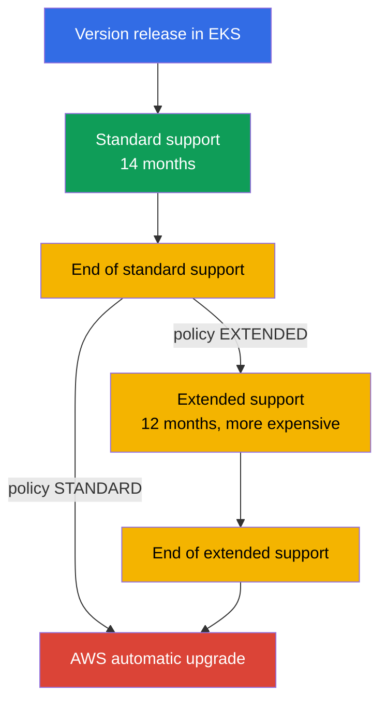
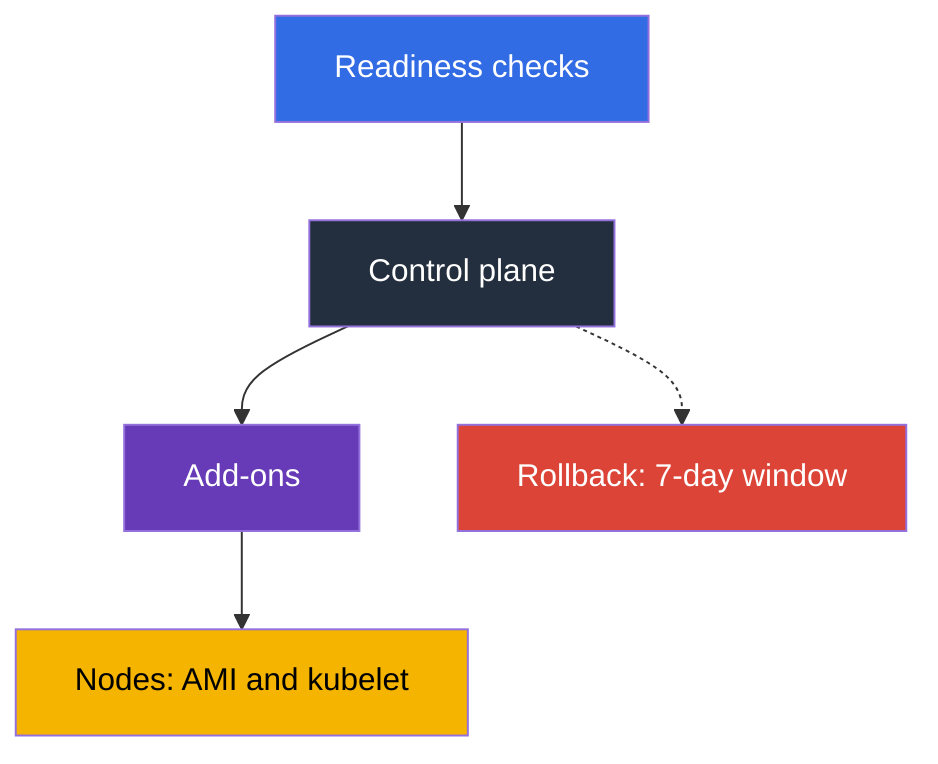

[Русская версия](ru.md) · [Versión en español](es.md) · [Version française](fr.md) · [Deutsche Version](de.md) · [ქართული ვერსია](ge.md) · [繁體中文版](tw.md) · [日本語版](jp.md)
# Chapter 3. Version lifecycle: standard and extended support, upgrade strategy

> **What is next.** AWS operates the control plane, but you select the Kubernetes version, and that
> selection has an expiration date: 14 months of standard support and 12 months of extended support,
> after which the cluster is upgraded without your involvement. This chapter covers policy and planning:
> timelines, pricing, risks, preparation, and the team cadence. Upgrade mechanics are in Chapter 38,
> rollback is in Chapter 39, and add-on versions are in Chapter 37. This is where you decide what and
> when you will do, not how.

## 3.1. Five ways to learn about versions at the worst moment

All five stories happen to teams with a healthy cluster: nothing hurts.

- **A cluster nobody touched for a year.** The version is two minor releases behind, but an upgrade
  is possible only one minor version at a time: not one maintenance window, but two.
- **The bill grew, but the load did not.** The version left standard support, clusters moved into
  extended support, and it is billed at a higher hourly rate per cluster.
- **AWS upgraded the cluster itself.** Extended support ends too: outside your window, without your
  validation plan, and with no way to roll back the result.
- **An add-on did not work.** The control plane was upgraded, but `vpc-cni` or a CSI driver remained
  on a version unsupported for the new minor version, and symptoms do not arrive immediately.
- **A deployment broke after the upgrade.** A chart still contained an `apiVersion` removed in the new
  version, while existing objects stayed alive: the problem is discovered at the next release, when
  `helm upgrade` fails.

The common denominator: the Kubernetes version is not a cluster property, but a **process with a calendar**.

## 3.2. How the lifecycle works: 14 plus 12

Upstream releases minor versions about every four months, and EKS follows its release and deprecation cycle.
Then comes the EKS-specific counter: **standard support, the first 14 months** after a version appears in
EKS (patches, new platform versions, regular per-cluster rate), followed by **extended support, the next
12 months**, when security updates continue but the cluster costs more. That is **26 months** in total,
after which the cluster is upgraded automatically.



The calendar with release dates and the end dates of both periods is available in EKS documentation and
through the API. Do not hardcode dates in a runbook: they are refined, and versions are added.

```bash
# All EKS versions with support end dates
aws eks describe-cluster-versions \
  --query 'clusterVersions[].[clusterVersion,versionStatus,endOfStandardSupportDate,endOfExtendedSupportDate]' \
  --output table

# Only versions already in extended support
aws eks describe-cluster-versions --version-status extended-support
```

A cluster can be created on any supported version, but starting on a version in extended support means a
higher rate from day one and less time before the upgrade.

## 3.3. Upgrade policy: STANDARD or EXTENDED

What happens to a cluster at the end of standard support is determined by the upgrade policy field,
whose value is `supportType`. The difference is not whether an upgrade occurs, but when AWS performs it.

| | `STANDARD` | `EXTENDED` |
|---|---|---|
| What happens at the end of standard support | AWS automatically upgrades the cluster to the next supported version | the cluster enters extended support and remains on its version |
| Additional charge | no | yes, a higher hourly rate per cluster |
| How long the version lives after that | 0 months | 12 months |
| What happens at the end of that period | - | an automatic upgrade by AWS |
| Can the policy be changed | yes, while the version is in standard support | it cannot be changed back after the cluster has entered extended support |
| Rollback after automatic upgrade | unavailable | unavailable at the end of extended support |

Three details. **Extended support is enabled by default** for new and existing clusters: you are protected
from a sudden upgrade, but not from a growing bill. **You cannot leave extended support by switching the
policy**: it can be disabled only while the version is in standard support. **Enable `EXTENDED` in advance**:
if the automatic upgrade has started, the policy change may not take effect in time.

```bash
# Current cluster policy and version
aws eks describe-cluster --name demo \
  --query 'cluster.{version:version,platform:platformVersion,policy:upgradePolicy}'

# Disable extended support: the cluster will be automatically upgraded at the end of standard support
aws eks update-cluster-config --name demo --upgrade-policy supportType=STANDARD
```

The temptation of "AWS will upgrade us itself" formally works: set `STANDARD` and do not think about it.
In practice, this gives up control over **timing** (the upgrade will not arrive in your window), **order**
(the control plane is upgraded before add-ons and manifests are checked), and **insurance** (rollback is
unavailable).

## 3.4. The cost of postponement

Extended support is not "better support", but a counter. The hourly charge per cluster in extended support
is higher than the standard rate and is multiplied by the number of clusters and hours. Calculate it as
follows: take the standard and extended-support per-cluster-hour rates from the EKS pricing page, multiply
the difference by 730 hours, then by the number of clusters and months of postponement, and compare it to
the person-days needed for preparation and the upgrade.

Preparation is done once for the fleet, while the extended-support charge accrues for every cluster and
every hour, so the arithmetic usually does not favor postponement. Extended support is reasonable for
justified situations: a freeze before a release, an incompatible vendor component, or an audit in progress;
in each, postponement has an end date and an owner. Keep `supportType` with the version in infrastructure
code (Chapter 4): entering extended support is visible in a pull request, not on the bill.

## 3.5. What exactly breaks when a minor version changes

The API set, component behavior, and sometimes the node base image change. Below are the things that break
in practice and how to check for them in advance.

| What breaks | Why | How to check in advance |
|---|---|---|
| Removed API versions in manifests and charts | an object with a removed `apiVersion` is no longer accepted by the API server; existing objects stay alive, but a new `apply` fails | inventory manifests and charts, cluster insights, audit logs for deprecated APIs (Chapter 21) |
| Add-on versions | `vpc-cni`, `coredns`, `kube-proxy`, and CSI drivers are not compatible with every cluster version | `aws eks describe-addon-versions --kubernetes-version` (Chapter 37) |
| CRDs and third-party controllers | a controller uses an API that no longer exists or does not itself claim support for the new version | a compatibility matrix for each controller: ingress, autoscaler, service mesh, GitOps |
| Admission webhooks | new built-in types and fields match broad webhook rules; an unavailable webhook stops admission (Chapter 2) | run it on a dev cluster, use narrow rules, check timeouts |
| Node base AMI | `1.32` is the last version for which EKS publishes AMIs on AL2; from `1.33`, only AL2023 and Bottlerocket | check user data, bootstrap, packages, and agents on AL2023 (Chapters 10, 38) |
| Kubelet version skew | kubelet must not lag the API server by more than upstream skew policy allows | upgrade nodes in the same cycle as the cluster, not "some time later" |
| Scheduler behavior and defaults | changing defaults and feature gates changes pod placement and autoscaling | run a load test on dev and compare metrics |

The AMI row stands apart: it is the only item where the node operating system changes together with the
Kubernetes version. The transition from AL2 to AL2023 affects user data (a different bootstrap format),
the package set, systemd units, observability agents, and everything installed manually; it is sensible to
separate two changes into different windows (Section 3.7 and Chapter 38).

## 3.6. Preparation: inventory, insights, dev run

Upgrade readiness is not a feeling, but a set of checks, each of which produces a yes-or-no answer.

**1. API inventory.** Everything that creates objects in the cluster: manifests, charts, CI templates,
and operators. The aim is to find `apiVersion` values that will not exist in the target version. Control
plane audit logs (Chapter 2) show actual calls to obsolete APIs, not just git contents.

```bash
# pluto: audit removed and deprecated apiVersions in manifests and charts; exits 2-3 when findings are present
pluto detect-files -d ./manifests --target-versions k8s=v1.34.0
helm template ./chart | pluto detect - --target-versions k8s=v1.34.0

# kubent (kube-no-trouble): checks the live cluster and Helm releases; -e fails CI when findings are present
kubent --target-version 1.34 --exit-error
```

Put pluto and kubent in CI before `update-cluster-version`: the build fails while a removed `apiVersion`
remains in git or the cluster, and source manifests catch what the API server silently converts.

**2. Cluster insights.** EKS itself runs a set of checks on the cluster and updates them about once per
day, as well as on request. `UPGRADE_READINESS` covers checks affecting upgrade eligibility, including
deprecated APIs; `ROLLBACK_READINESS` shows whether rollback remains possible and is available for 7 days
after an update (Chapter 39).

```bash
# Upgrade readiness checks and their statuses
aws eks list-insights --cluster-name demo --filter categories=UPGRADE_READINESS \
  --query 'insights[].[name,insightStatus.status,kubernetesVersion]' --output table

# Details of a specific check: what was found and what is recommended
aws eks describe-insight --cluster-name demo --id <insight-id>
```

**3. Add-on and controller matrix.** A list of add-on versions compatible with the target version and
confirmation of support from third-party controllers.

```bash
# Which add-on versions are available for the target cluster version
aws eks describe-addon-versions --addon-name vpc-cni --kubernetes-version 1.34 \
  --query 'addons[].addonVersions[].addonVersion' --output text

# Which API groups are present in the cluster and whether the client lags behind the server
kubectl api-resources --sort-by=name -o wide | head -30
kubectl version
```

Before changing the control plane version, every add-on and every CRD goes through the same checklist:

- a target add-on version exists for the new cluster version (`describe-addon-versions` above);
- the third-party controller (ingress, autoscaler, mesh, GitOps) declares support for the target version;
- the CRD and its controller do not use an `apiVersion` removed in the target version (pluto, kubent).

If an item is not complete, do not touch the control plane: it will be upgraded before the add-on catches up.

**4. Run on a dev cluster** that resembles production: the same add-ons, controllers, charts, and webhooks.
This finds errors absent from every checklist; some problems are visible only under load.

**5. Checklist and decision.** The target version, add-on versions, changes to manifests, the window owner,
the post-upgrade validation plan, and the rollback condition. Do not begin without the last two items.

## 3.7. In-place or blue/green

Choose once for the fleet and refine the decision for individual clusters (mechanics are in Chapter 38).

| Criterion | In-place | Blue/green |
|---|---|---|
| What happens and what it costs | the same cluster is raised by one minor version: hours, one window, one cluster | a new-version cluster is created alongside it and traffic is moved to it: days or weeks, double resources |
| Jumping over a version | impossible, one at a time only | possible: the new cluster is created on the required version |
| Insurance | rollback within 7 days, one version back (Chapter 39) | switch traffic back to the old cluster |
| When it is chosen | a regular version step, a small fleet | a base AMI change, being several versions behind, strict availability requirements |

The order inside an upgrade is the same: control plane first, then add-ons, then nodes. The reason is the
version-skew policy: kubelet can lag the API server, but not the reverse.



Be candid about rollback: it is narrow insurance, not a plan. It is possible for 7 days after an upgrade,
only one minor version back and only if the upgrade was in-place; clusters automatically upgraded at the end
of extended support cannot be rolled back (Chapter 39). The update starts with one command:

```bash
# Start a control plane update by one minor version (details in Chapter 38)
aws eks update-cluster-version --name demo --kubernetes-version 1.34
aws eks describe-update --name demo --update-id <update-id> --query 'update.[status,type]'
```

## 3.8. Cadence, owner, and cluster fleet

An upgrade done "when there is time" is never done. Only a cadence works.

| Policy | Meaning | Pros and cons |
|---|---|---|
| latest | upgrade as soon as a version appears in EKS | maximum time until support ends, but you find problems first |
| N-1 | keep one version below current | bug fixes and community reports already exist, and the time reserve is sufficient |
| N-2 and deeper | upgrade rarely, catching up in bursts | each upgrade takes several steps, with a risk of entering extended support |
| extended as the norm | stay on a version until the end | predictable for the application, expensive, and ends with an automatic upgrade |

A practical benchmark is **one minor version every 4-6 months** and an N-1 policy: with upstream's
four-month release cycle, this cadence keeps the cluster within standard support without chasing a fresh
release. For the cadence to exist, you need an **owner** (a team or role responsible for version upgrades),
**calendar dates** counted backward (preparation three months before, dev run two months before,
production one month before), **deadline monitoring**, and a **regular window**.

A separate story is a fleet of a dozen clusters, each with its own version and add-on set: the upgrade
becomes ten different projects instead of one. Four habits keep a fleet orderly: **the version and
`supportType` in code**, with one module for all clusters (Chapter 4); **a rollout order by environment**,
dev, stage, production, with a pause for observation because some problems appear on the second or third
day; **add-ons and controllers at one version across the fleet**, otherwise validation results cannot be
reused (Chapter 37); **GitOps as a visibility tool**, so "what is where" is answered with one repository
query (Chapter 44).

```bash
# Inventory versions and policies for regional clusters: find forgotten and outdated clusters
for c in $(aws eks list-clusters --query 'clusters[]' --output text); do
  aws eks describe-cluster --name "$c" --output text \
    --query 'cluster.[name,version,upgradePolicy.supportType]'; done
```

## 3.9. How this is applied in production

- **The version calendar is shared.** Standard-support end dates for every cluster in the fleet are in the
  team calendar with a countdown, not in someone's head.
- **The policy is deliberate.** Production uses `EXTENDED` as insurance against a sudden automatic upgrade,
  but with a plan to move to the new version before standard support ends; dev uses `STANDARD`, so automatic
  upgrades catch problems before production. Entering extended support is an exception with a date, reason,
  and owner.
- **Preparation is automated.** Cluster insights are reviewed regularly, deprecated-API auditing through
  pluto and kubent is in CI, and the add-on version matrix is updated before the cycle.
- **Upgrade dev first**, always in control-plane, add-on, node order, with a rollback condition set before
  work begins. **Plan a base-AMI change separately**, and treat a lagging kubelet as an operations incident.

## 3.10. Mini glossary

- **Standard support**: the first 14 months of a minor version's life in EKS, at the regular hourly
  per-cluster rate. **Extended support**: the next 12 months at a higher rate, 26 months total.
- **Upgrade policy** (`supportType`): a cluster configuration field with the values `STANDARD` and
  `EXTENDED`, which determines behavior at the end of standard support. Extended support is enabled by
  default; you cannot leave it by switching policy, only by upgrading.
- **Cluster insights**: automatic EKS cluster checks; `UPGRADE_READINESS` is about upgrade readiness,
  and `ROLLBACK_READINESS` is about rollback eligibility and is available for 7 days.
- **Version skew**: the kubelet lag behind the API server allowed by upstream policy; the reason for the
  order "control plane first, then nodes." **In-place upgrade**: updating the same cluster by one minor
  version; **blue/green**: creating a new-version cluster alongside it (Chapter 38); **rollback**:
  reverting the version within 7 days after an in-place upgrade (Chapter 39).

## 3.11. Chapter summary

- 14 months of standard support plus 12 months of extended support, 26 months per minor version in total;
  dates come from `aws eks describe-cluster-versions`. Upgrades are one version at a time, so being two
  minor versions behind means two windows.
- An upgrade policy of `STANDARD` means an AWS automatic upgrade at the end of standard support;
  `EXTENDED` means entering extended support at a higher rate. Extended support is enabled by default, and
  you cannot leave it by switching policy, only by upgrading.
- At the end of extended support, the cluster is upgraded automatically, and such a cluster cannot be
  rolled back. Relying on "AWS will upgrade us itself" gives up timing, order, and insurance.
- What breaks includes removed and deprecated APIs in manifests and charts, add-on versions, controllers
  and CRDs, webhooks, and from `1.33`, the base AMI as well: `1.32` is the last version with AMIs on AL2.
- Preparation is API inventory, cluster insights, an add-on version matrix, and a dev run. Work order:
  control plane, add-ons, nodes. Rollback is narrow: 7 days, one version, in-place.
- Cadence matters more than speed: an N-1 policy, one version every 4-6 months, an owner, calendar dates,
  and the cluster version in code for the entire fleet.

## 3.12. How this helps in real work

The question "when do we upgrade" becomes arithmetic: the end of standard support minus three months is
the work-start date. The conversation about money is concrete as well: the extended-support surcharge is
calculated per month per cluster and compared with the preparation cost, which is incurred once for the
fleet. An upgrade stops being a fire drill: when API inventory is in CI, cluster insights are on the
dashboard, and the work order is in the runbook, every next update costs less than the previous one. And
you still have to fix a cluster that was upgraded for you.

## 3.13. Self-check questions

1. How many months does an EKS minor version live, and what makes up that number?
2. How do `STANDARD` and `EXTENDED` differ, and what happens at the end of each period?
3. Which upgrade-policy value is the default, and why does that matter to the bill?
4. The cluster is already in extended support. How do you stop paying the higher rate?
5. Why is being two minor versions behind more expensive than being one behind, and not twice as expensive?
6. How do you calculate which is cheaper: six months of extended support or an upgrade by the team?
7. What happens to a cluster left untouched until extended support ends, and can that be rolled back?
8. Which categories of checks do cluster insights provide, and what is `ROLLBACK_READINESS` for?
9. Why is an upgrade from `1.32` to `1.33` dangerous beyond the Kubernetes version change?
10. Why is the control plane upgraded before nodes, rather than the other way around?
11. In which cases would you choose blue/green over in-place?
12. A fleet has twelve clusters at different versions. Where do you start bringing it into order?

## Practice

There is no lab for this chapter, but all its contents can be read on a live cluster. Start with the
calendar: `aws eks describe-cluster-versions` shows versions, their status, and support end dates: record
the dates for your cluster's version. Then use `aws eks describe-cluster` with the `version`,
`platformVersion`, and `upgradePolicy` fields. Check readiness through `aws eks list-insights
--cluster-name <cluster> --filter categories=UPGRADE_READINESS`, and use `aws eks describe-insight` for
findings. Check add-on compatibility with `aws eks describe-addon-versions --addon-name coredns
--kubernetes-version <next>`. From the Kubernetes side, `kubectl version` and `kubectl api-resources -o
wide` are useful. Chapter 38 covers upgrade mechanics; Chapter 39 covers rollback.

---
[Contents](../README.md) · [Chapter 2](../02/en.md) · [Chapter 4](../04/en.md)
