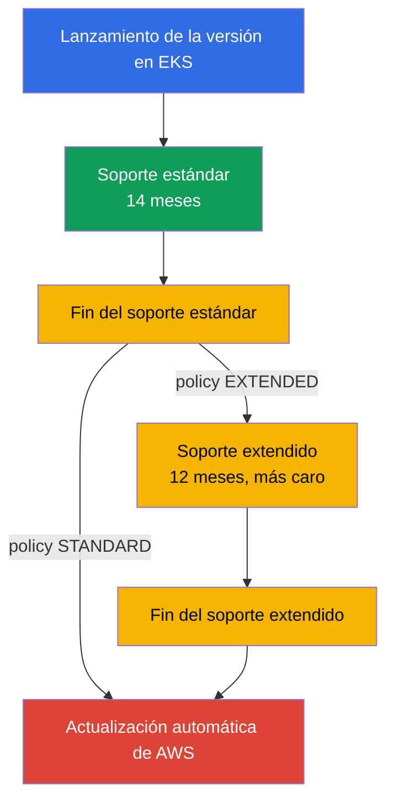
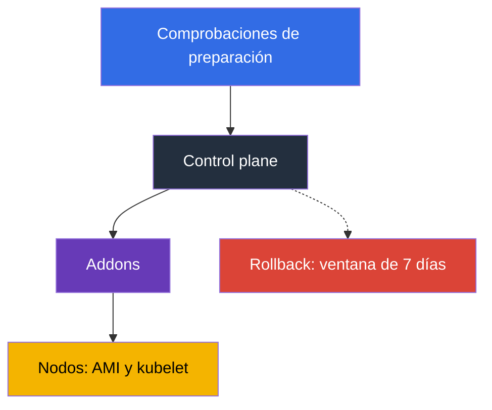

[Русская версия](ru.md) · [Eng version](en.md) · [Version française](fr.md) · [Deutsche Version](de.md) · [ქართული ვერსია](ge.md) · [繁體中文版](tw.md) · [日本語版](jp.md)
# Capítulo 3. Ciclo de vida de las versiones: soporte estándar y extendido, estrategia de actualizaciones

> **Qué sigue.** AWS mantiene el control plane, pero usted elige la versión de Kubernetes, y esa
> elección tiene fecha de caducidad: 14 meses de soporte estándar y 12 de soporte extendido,
> tras los cuales el clúster se actualizará sin su intervención. Este capítulo trata sobre política
> y planificación: plazos, tarifas, riesgos, preparación y ritmo del equipo. La mecánica de la
> actualización está en el capítulo 38, el rollback en el capítulo 39 y las versiones de los
> addons en el capítulo 37. Aquí se decide qué hará y cuándo, no con qué.

## 3.1. Cinco maneras de enterarse de las versiones en el peor momento

Las cinco historias ocurren en equipos cuyo clúster funciona bien: nada duele.

- **Un clúster que nadie tocó durante un año.** La versión quedó atrasada dos minor releases, y la
  actualización solo es posible de una versión menor cada vez: no una ventana de mantenimiento,
  sino dos.
- **La factura creció, pero la carga no.** La versión salió del soporte estándar, los clústeres
  pasaron al soporte extendido, y este se cobra a una tarifa horaria superior por clúster.
- **AWS actualizó el clúster por sí mismo.** El soporte extendido también termina: fuera de su
  ventana, sin su plan de verificación y sin posibilidad de revertir el resultado.
- **Un addon no funcionó.** El control plane se actualizó, pero `vpc-cni` o el controlador CSI se
  quedó en una versión no compatible con la nueva minor release, y los síntomas no llegan de inmediato.
- **El despliegue falló después de la actualización.** En el chart quedó una `apiVersion` eliminada
  en la nueva versión, mientras los objetos en ejecución siguen vivos: el problema aparece en la
  siguiente release cuando falla `helm upgrade`.

El denominador común: la versión de Kubernetes no es una propiedad del clúster, sino un **proceso
con calendario**.

## 3.2. Cómo funciona el ciclo: 14 más 12

Upstream publica versiones menores aproximadamente una vez cada cuatro meses; EKS sigue su ciclo
de releases y deprecaciones. Después entra el contador específico de EKS: **standard support, los
primeros 14 meses** desde que la versión aparece en EKS (parches, nuevas platform version, tarifa
normal por clúster), seguido de **extended support, los siguientes 12 meses**, durante los cuales
continúan las actualizaciones de seguridad, pero el clúster cuesta más. En total, **26 meses**,
después de los cuales el clúster se actualiza automáticamente.



El calendario con las fechas de lanzamiento y fin de ambos períodos está en la documentación de
EKS y en la API. No conviene codificar las fechas en el runbook: se precisan y se agregan versiones.

```bash
# Todas las versiones de EKS con fechas de finalización del soporte
aws eks describe-cluster-versions \
  --query 'clusterVersions[].[clusterVersion,versionStatus,endOfStandardSupportDate,endOfExtendedSupportDate]' \
  --output table

# Solo las versiones que ya están en soporte extendido
aws eks describe-cluster-versions --version-status extended-support
```

Puede crear un clúster con cualquier versión compatible, pero comenzar con una versión en soporte
extendido implica una tarifa superior desde el primer día y menos tiempo hasta la actualización.

## 3.3. Upgrade policy: STANDARD o EXTENDED

El campo de upgrade policy con el valor `supportType` determina qué ocurrirá con el clúster al final
del soporte estándar. La diferencia no está en si AWS realizará la actualización, sino en cuándo.

| | `STANDARD` | `EXTENDED` |
|---|---|---|
| Qué sucede al final del standard support | AWS actualiza automáticamente el clúster a la siguiente versión compatible | el clúster pasa a extended support y permanece en su versión |
| Cargo adicional | no | sí, tarifa horaria superior por clúster |
| Cuánto más vive la versión | 0 meses | 12 meses |
| Qué sucede al final de este período | - | actualización automática realizada por AWS |
| Si se puede cambiar la política | sí, mientras la versión esté en standard support | no se puede volver atrás si el clúster ya entró en extended support |
| Rollback después de la actualización automática | no disponible | no disponible al finalizar extended support |

Tres detalles. **El soporte extendido está habilitado de forma predeterminada** para clústeres nuevos
y existentes: está protegido de una actualización repentina, pero no del aumento de la factura.
**No se puede salir del soporte extendido cambiando la política**, solo se puede deshabilitar mientras
la versión está en soporte estándar. **Debe habilitar `EXTENDED` con antelación**: si la actualización
automática comenzó, el cambio de política puede no surtir efecto a tiempo.

```bash
# Política y versión actuales del clúster
aws eks describe-cluster --name demo \
  --query 'cluster.{version:version,platform:platformVersion,policy:upgradePolicy}'

# Deshabilitar el soporte extendido: el clúster se actualizará automáticamente al final del soporte estándar
aws eks update-cluster-config --name demo --upgrade-policy supportType=STANDARD
```

La tentación de "AWS nos actualizará" funciona formalmente: establecer `STANDARD` y no pensar más.
En la práctica, es renunciar al control sobre el **momento** (la actualización llegará fuera de su
ventana), el **orden** (el control plane se actualizará antes de verificar addons y manifiestos) y
la **salvaguarda** (el rollback no está disponible).

## 3.4. El precio de la postergación

El soporte extendido no es "mejor soporte", sino un contador. El cargo horario por clúster en
soporte extendido es mayor que el estándar y se multiplica por la cantidad de clústeres y horas.
Calcúlelo así: tome las tarifas por clúster-hora de standard y extended support de la página de
precios de EKS, multiplique la diferencia por 730 horas, luego por la cantidad de clústeres y meses
de postergación, y compárela con los días-persona necesarios para la preparación y la actualización.

La preparación se realiza una vez para todo el parque, mientras el cargo de soporte extendido se
acumula por cada clúster y cada hora; por eso, la aritmética normalmente no favorece la postergación.
Es razonable usar el soporte extendido en situaciones justificadas: congelación antes de un release,
incompatibilidad de un componente de proveedor, una auditoría en curso; en cada una, la postergación
tiene fecha de fin y responsable. Mantenga también `supportType` junto con la versión en el código
de infraestructura (capítulo 4): el paso a soporte extendido se ve en el pull request, no en la factura.

## 3.5. Qué se rompe exactamente al cambiar una versión menor

Cambian el conjunto de API, el comportamiento de los componentes y, a veces, la imagen base del
nodo. A continuación se muestra lo que se rompe en la práctica y cómo comprobarlo de antemano.

| Qué se rompe | Por qué | Cómo comprobarlo de antemano |
|---|---|---|
| Versiones de API eliminadas en manifiestos y charts | el API server ya no acepta un objeto con `apiVersion` eliminada; los objetos existentes siguen vivos, pero falla un nuevo `apply` | inventario de manifiestos y charts, cluster insights, audit logs sobre API deprecadas (capítulo 21) |
| Versiones de addons | `vpc-cni`, `coredns`, `kube-proxy` y los controladores CSI no son compatibles con todas las versiones del clúster | `aws eks describe-addon-versions --kubernetes-version` (capítulo 37) |
| CRD y controladores de terceros | el controlador usa una API que ya no existe, o no declara compatibilidad con la nueva versión | matriz de compatibilidad de cada controlador: ingress, autoscaler, service mesh, GitOps |
| Admission webhooks | nuevos tipos y campos integrados caen bajo reglas amplias del webhook; un webhook no disponible detiene la admisión (capítulo 2) | ejecución en un clúster dev, reglas acotadas, comprobación de timeouts |
| AMI base del nodo | `1.32` es la última versión para la que EKS publica AMI en AL2; desde `1.33`, solo AL2023 y Bottlerocket | comprobar user data, bootstrap, paquetes y agentes en AL2023 (capítulos 10, 38) |
| Version skew de kubelet | kubelet no debe quedar detrás del API server más de lo permitido por la política upstream de skew | actualizar los nodos en el mismo ciclo que el clúster, no "algún día después" |
| Comportamiento del scheduler y defaults | los cambios en defaults y feature gates modifican la distribución de pods y el autoscaling | prueba de carga en dev, comparación de métricas |

La línea sobre la AMI merece atención especial: es el único punto en que, junto con la versión de
Kubernetes, cambia el sistema operativo de los nodos. La transición de AL2 a AL2023 afecta al user
data (otro formato de bootstrap), al conjunto de paquetes, a las unidades systemd, a los agentes de
observabilidad y a todo lo instalado manualmente; es prudente separar dos cambios en una misma
ventana (sección 3.7 y capítulo 38).

## 3.6. Preparación: inventario, insights, ejecución en dev

La preparación para una actualización no es una impresión, sino un conjunto de comprobaciones, cada
una de las cuales da una respuesta sí o no.

**1. Inventario de API.** Todo lo que crea objetos en el clúster: manifiestos, charts, plantillas de
CI, operadores. El objetivo es encontrar `apiVersion` que no estarán en la versión objetivo. Los
audit logs del control plane (capítulo 2) muestran las solicitudes reales a API obsoletas, no solo
el contenido de git.

```bash
# pluto: auditoría de apiVersion eliminadas y obsoletas en manifiestos y charts; código 2-3 si encuentra resultados
pluto detect-files -d ./manifests --target-versions k8s=v1.34.0
helm template ./chart | pluto detect - --target-versions k8s=v1.34.0

# kubent (kube-no-trouble): comprueba el clúster activo y los releases de Helm; -e hace fallar CI si encuentra resultados
kubent --target-version 1.34 --exit-error
```

Instale pluto y kubent en CI antes de `update-cluster-version`: la build falla mientras siga viva
una `apiVersion` eliminada en git o en el clúster, y los manifiestos fuente detectan lo que el API
server convierte silenciosamente.

**2. Cluster insights.** EKS ejecuta por sí mismo un conjunto de comprobaciones sobre el clúster y
las actualiza aproximadamente una vez al día, y también bajo petición. `UPGRADE_READINESS` contiene
las comprobaciones que afectan a la posibilidad de actualizar, incluidas las API obsoletas;
`ROLLBACK_READINESS` muestra si se conserva la posibilidad de revertir y está disponible durante
7 días tras la actualización (capítulo 39).

```bash
# Comprobaciones de preparación para la actualización y sus estados
aws eks list-insights --cluster-name demo --filter categories=UPGRADE_READINESS \
  --query 'insights[].[name,insightStatus.status,kubernetesVersion]' --output table

# Detalles de una comprobación concreta: qué se encontró y qué se recomienda
aws eks describe-insight --cluster-name demo --id <insight-id>
```

**3. Matriz de addons y controladores.** La lista de versiones de addons compatibles con la versión
objetivo y la confirmación de compatibilidad de los controladores de terceros.

```bash
# Qué versiones del addon están disponibles para la versión objetivo del clúster
aws eks describe-addon-versions --addon-name vpc-cni --kubernetes-version 1.34 \
  --query 'addons[].addonVersions[].addonVersion' --output text

# Qué grupos de API están activos en el clúster y si el cliente no está retrasado respecto al servidor
kubectl api-resources --sort-by=name -o wide | head -30
kubectl version
```

Antes de cambiar la versión del control plane, cada addon y cada CRD pasan por la misma lista de
comprobación:

- la versión objetivo del addon existe para la nueva versión del clúster (`describe-addon-versions`
  anterior);
- el controlador de terceros (ingress, autoscaler, mesh, GitOps) declara compatibilidad con la
  versión objetivo;
- el CRD y su controlador no usan una `apiVersion` eliminada en la versión objetivo (pluto, kubent).

Si un punto no está cerrado, no se toca el control plane: se actualizará antes de que el addon lo
alcance.

**4. Ejecución en un clúster dev**, similar a producción: los mismos addons, controladores, charts y
webhooks. Así se encuentran errores que no aparecen en ninguna lista de comprobación; parte de los
problemas solo se ve bajo carga.

**5. Lista de comprobación y decisión.** La versión objetivo, las versiones de addons, qué cambia
en los manifiestos, el responsable de la ventana, el plan de verificación posterior a la actualización
y la condición de rollback. No se empieza sin los dos últimos puntos.

## 3.7. In-place o blue/green

La elección se hace una vez para el parque y se concreta para clústeres individuales (la mecánica
está en el capítulo 38).

| Criterio | In-place | Blue/green |
|---|---|---|
| Qué ocurre y cuánto cuesta | el mismo clúster se eleva una versión menor: horas, una ventana, un clúster | se crea junto a él un clúster de la nueva versión y se le redirige el tráfico: días o semanas, recursos duplicados |
| Salto de versión | imposible, solo de una en una | posible: el clúster nuevo se crea con la versión necesaria |
| Salvaguarda | rollback dentro de 7 días, una versión atrás (capítulo 39) | redirigir el tráfico de vuelta al clúster anterior |
| Cuándo se elige | un paso normal de versión, parque pequeño | cambio de AMI base, atraso de varias versiones, requisitos estrictos de disponibilidad |

El orden de acciones dentro de la actualización es siempre el mismo: primero el control plane, luego
los addons y después los nodos. La razón está en la política de version skew: kubelet puede quedar
detrás del API server, pero no al revés.



El rollback, francamente, es una salvaguarda limitada, no un plan. Es posible durante 7 días tras la
actualización, solo una versión menor hacia atrás y únicamente si la actualización fue in-place; los
clústeres actualizados automáticamente al finalizar el soporte extendido no se revierten (capítulo
39). La actualización se inicia con un único comando:

```bash
# Iniciar la actualización del control plane una versión menor (detalles en el capítulo 38)
aws eks update-cluster-version --name demo --kubernetes-version 1.34
aws eks describe-update --name demo --update-id <update-id> --query 'update.[status,type]'
```

## 3.8. Ritmo, responsable y parque de clústeres

Una actualización que se hace "cuando haya tiempo" nunca se hace. Solo funciona un ritmo.

| Política | Qué significa | Ventajas y desventajas |
|---|---|---|
| latest | actualizamos tan pronto como aparece la versión en EKS | máximo tiempo hasta el fin del soporte, pero es usted quien primero encuentra los problemas |
| N-1 | mantenemos una versión por debajo de la actual | ya existen bugfixes e informes de la comunidad, el margen de tiempo es suficiente |
| N-2 y más atrás | actualizamos pocas veces, recuperamos con saltos | cada actualización tiene varios pasos, riesgo de pasar a extended support |
| extended como norma | permanecemos en la versión hasta el final | predecible para la aplicación, caro y termina en actualización automática |

Una referencia práctica es **una versión menor cada 4-6 meses** y la política N-1: con el ciclo de
releases upstream de una vez cada cuatro meses, ese ritmo mantiene el clúster dentro del soporte
estándar sin correr detrás del release más reciente. Para que el ritmo exista, hacen falta un
**responsable** (un equipo o rol que tenga las actualizaciones de versiones entre sus obligaciones),
**fechas en el calendario** en cuenta regresiva (preparación tres meses antes, ejecución en dev dos,
producción uno), **monitorización de plazos** y una **ventana regular**.

Un caso aparte es un parque de una docena de clústeres, cada uno con su versión y conjunto de addons:
la actualización se convierte en diez proyectos diferentes en lugar de uno. Cuatro hábitos mantienen
el parque ordenado: **la versión y `supportType` en código**, un módulo para todos los clústeres
(capítulo 4); **el orden de despliegue por entornos**, dev, stage, producción, con una pausa de
observación, porque parte de los problemas aparece el segundo o tercer día; **addons y controladores
con una versión para todo el parque**, de otro modo el resultado de la comprobación no se puede
reutilizar (capítulo 37); **GitOps como herramienta de visibilidad**, para responder a "dónde está
instalado cada elemento" con una consulta al repositorio (capítulo 44).

```bash
# Inventario de versiones y políticas de los clústeres de la región: buscamos los olvidados y atrasados
for c in $(aws eks list-clusters --query 'clusters[]' --output text); do
  aws eks describe-cluster --name "$c" --output text \
    --query 'cluster.[name,version,upgradePolicy.supportType]'; done
```

## 3.9. Cómo se aplica esto en producción

- **El calendario de versiones es común.** Las fechas de fin del standard support de todos los
  clústeres del parque están en el calendario del equipo con cuenta regresiva, no en la cabeza de
  una persona.
- **La política es deliberada.** Producción en `EXTENDED` como salvaguarda frente a una actualización
  automática repentina, pero con un plan para pasar a una nueva versión antes del fin del soporte
  estándar; dev en `STANDARD`, para que la actualización automática detecte los problemas antes
  que producción. El paso a soporte extendido es una excepción con fecha, motivo y responsable.
- **La preparación está automatizada.** Los cluster insights se revisan regularmente, la auditoría
  de API obsoletas mediante pluto y kubent está en CI, y la matriz de versiones de addons se
  actualiza antes del ciclo.
- **La actualización se hace primero en dev**, siempre en orden control plane, addons, nodos, con
  la condición de rollback antes de comenzar. **El cambio de AMI base se planifica por separado**,
  y un kubelet atrasado se considera un incidente operativo.

## 3.10. Mini glosario

- **Standard support**: los primeros 14 meses de vida de una versión menor en EKS, con la tarifa
  horaria normal por clúster. **Extended support**: los siguientes 12 meses, con tarifa superior;
  26 meses en total.
- **Upgrade policy** (`supportType`): campo de configuración del clúster con los valores `STANDARD`
  y `EXTENDED`, que determina el comportamiento al final del soporte estándar. El soporte extendido
  está habilitado de forma predeterminada; no se puede salir de él cambiando la política, solo con
  una actualización.
- **Cluster insights**: comprobaciones automáticas del clúster de EKS; `UPGRADE_READINESS` trata de
  la preparación para actualizar y `ROLLBACK_READINESS` de la posibilidad de revertir, disponible
  durante 7 días.
- **Version skew**: retraso de kubelet respecto del API server permitido por la política upstream;
  razón del orden "primero control plane, después nodos". **In-place upgrade**: actualización del
  mismo clúster una versión menor, **blue/green**: creación junto a él de un clúster de nueva versión
  (capítulo 38), **rollback**: retorno de versión durante los 7 días posteriores a una actualización
  in-place (capítulo 39).

## 3.11. Resumen del capítulo

- 14 meses de standard support más 12 meses de extended support, 26 en total para una versión menor;
  las fechas se obtienen de `aws eks describe-cluster-versions`. La actualización solo puede ser de
  una versión cada vez, por lo que un atraso de dos minor releases significa dos ventanas.
- La upgrade policy `STANDARD` significa actualización automática de AWS al final del soporte estándar,
  y `EXTENDED`, transición a soporte extendido con tarifa superior. El soporte extendido está habilitado
  de forma predeterminada; no se puede salir de él cambiando la política, solo mediante actualización.
- Al finalizar el soporte extendido, el clúster se actualiza automáticamente y no se puede revertir.
  Confiar en "AWS nos actualizará" cede el momento, el orden y la salvaguarda.
- Se rompen las API eliminadas y obsoletas en manifiestos y charts, las versiones de addons, los
  controladores y CRD, los webhooks y, desde `1.33`, también la AMI base: `1.32` es la última versión
  con AMI en AL2.
- La preparación consiste en el inventario de API, cluster insights, la matriz de versiones de addons
  y la ejecución en dev. El orden de trabajo es: control plane, addons, nodos. El rollback es limitado:
  7 días, una versión, in-place.
- El ritmo importa más que la velocidad: política N-1, una versión cada 4-6 meses, responsable,
  fechas en el calendario y versión del clúster en código para todo el parque.

## 3.12. Cómo ayuda esto en el trabajo real

La pregunta "cuándo actualizamos" se convierte en aritmética: la fecha de fin del soporte estándar
menos tres meses es la fecha límite para iniciar el trabajo. La conversación sobre dinero también es
concreta: el recargo del soporte extendido se calcula por mes y por clúster y se compara con el coste
de la preparación, que se realiza una vez para todo el parque. Y la actualización deja de ser una
emergencia: cuando el inventario de API está en CI, los cluster insights en el dashboard y el orden
de trabajo en el runbook, cada actualización siguiente cuesta menos que la anterior. Pero un clúster
que AWS actualizó por usted aún tendrá que repararlo usted.

## 3.13. Preguntas para autoevaluación

1. ¿Cuántos meses vive una versión menor en EKS y cómo se compone ese número?
2. ¿En qué se diferencian `STANDARD` y `EXTENDED` y qué ocurre al final de cada período?
3. ¿Qué valor de upgrade policy se establece de forma predeterminada y por qué importa para la factura?
4. El clúster ya está en soporte extendido. ¿Cómo deja de pagar la tarifa superior?
5. ¿Por qué retrasarse dos versiones menores cuesta más que retrasarse una, y no el doble?
6. ¿Cómo calcular qué es más barato: soporte extendido durante seis meses o una actualización hecha
   por el equipo?
7. ¿Qué ocurrirá con un clúster que no se tocó hasta el fin del soporte extendido, y se podrá revertir?
8. ¿Qué categorías de comprobaciones proporcionan los cluster insights y para qué sirve
   `ROLLBACK_READINESS`?
9. ¿Qué peligro tiene actualizar de `1.32` a `1.33` además del cambio de versión de Kubernetes?
10. ¿Por qué primero se actualiza el control plane y luego los nodos, y no al revés?
11. ¿En qué casos elegiría blue/green en lugar de in-place?
12. En un parque hay doce clústeres con versiones diferentes. ¿Por dónde empezaría a ponerlos en orden?


## Práctica

No hay laboratorio para este capítulo, pero todo su contenido se puede leer en un clúster activo.
Comience por el calendario: `aws eks describe-cluster-versions` mostrará las versiones, su estado y
las fechas de fin del soporte; anote las fechas de la versión de su clúster. Después ejecute `aws eks
describe-cluster` con los campos `version`, `platformVersion` y `upgradePolicy`. Compruebe la
preparación mediante `aws eks list-insights --cluster-name <cluster> --filter
categories=UPGRADE_READINESS`, y para los hallazgos, `aws eks describe-insight`. La compatibilidad
de addons se comprueba con `aws eks describe-addon-versions --addon-name coredns
--kubernetes-version <next>`. Del lado de Kubernetes, resultan útiles `kubectl version` y
`kubectl api-resources -o wide`. La mecánica de actualización se explica en el capítulo 38 y el
rollback en el capítulo 39.

---
[Índice](../README_ES.md) · [Capítulo 2](../02/es.md) · [Capítulo 4](../04/es.md)
