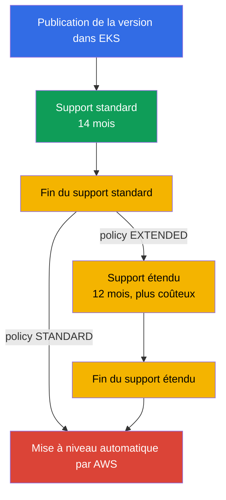
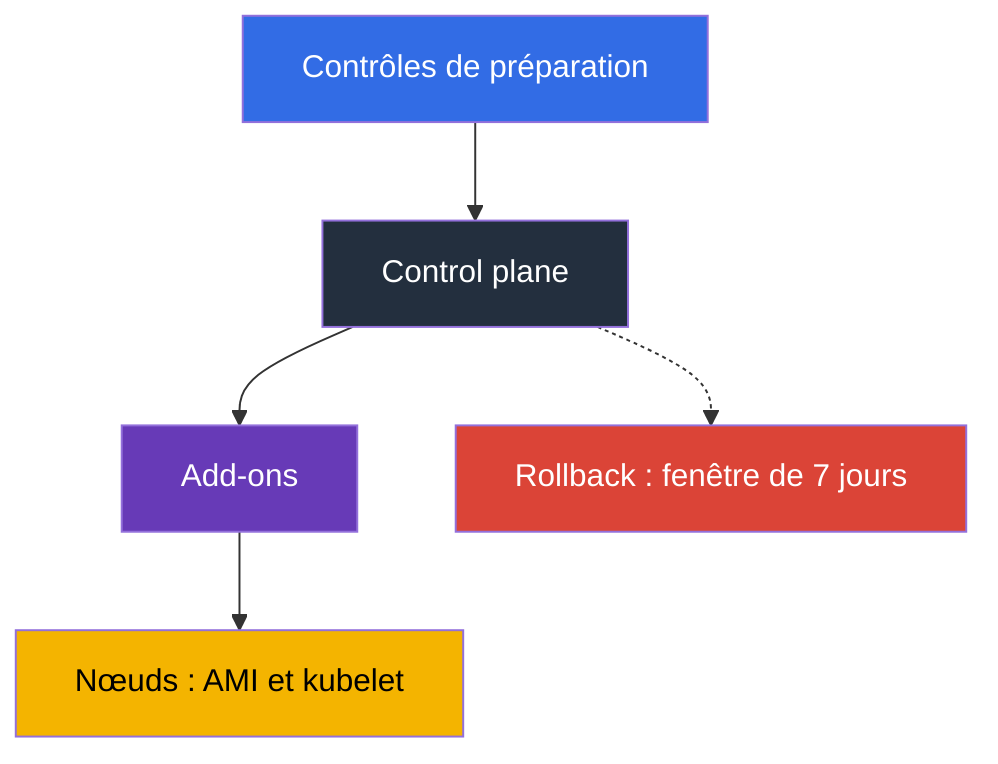

[Русская версия](ru.md) · [Eng version](en.md) · [Versión en español](es.md) · [Deutsche Version](de.md) · [ქართული ვერსია](ge.md) · [繁體中文版](tw.md) · [日本語版](jp.md)
# Chapitre 3. Cycle de vie des versions : support standard et étendu, stratégie de mise à niveau

> **La suite.** AWS exploite le control plane, mais vous choisissez la version de Kubernetes, et ce
> choix a une date d'expiration : 14 mois de support standard et 12 mois de support étendu, après
> quoi le cluster sera mis à niveau sans votre intervention. Ce chapitre traite de politique et de
> planification : délais, tarifs, risques, préparation et cadence de l'équipe. La mécanique de mise
> à niveau est abordée au chapitre 38, le rollback au chapitre 39 et les versions des add-ons au
> chapitre 37. Ici, il s'agit de décider quoi faire et quand, et non comment le faire.

## 3.1. Cinq façons de découvrir les versions au pire moment

Les cinq histoires arrivent à des équipes dont le cluster fonctionne bien : rien ne fait mal.

- **Un cluster que personne n'a touché depuis un an.** La version a deux versions mineures de
  retard, mais une mise à niveau n'est possible que d'une version mineure à la fois : non pas une
  fenêtre de maintenance, mais deux.
- **La facture a augmenté, pas la charge.** La version a quitté le support standard, les clusters
  sont passés au support étendu, facturé à un tarif horaire plus élevé par cluster.
- **AWS a mis le cluster à niveau lui-même.** Le support étendu finit aussi : hors de votre
  fenêtre, sans votre plan de validation et sans possibilité de rollback.
- **Un add-on n'a pas fonctionné.** Le control plane a été mis à niveau, mais `vpc-cni` ou un
  pilote CSI est resté sur une version non compatible avec la nouvelle version mineure, et les
  symptômes n'apparaissent pas immédiatement.
- **Un déploiement a échoué après la mise à niveau.** Un chart contenait encore une `apiVersion`
  supprimée dans la nouvelle version, alors que les objets existants restaient actifs : le problème
  est découvert au prochain release lorsque `helm upgrade` échoue.

Le dénominateur commun : la version Kubernetes n'est pas une propriété du cluster, mais un
**processus avec un calendrier**.

## 3.2. Comment fonctionne le cycle : 14 plus 12

Upstream publie des versions mineures environ tous les quatre mois, et EKS suit son cycle de
releases et de dépréciations. Vient ensuite le compteur propre à EKS : **support standard, les
14 premiers mois** après l'apparition d'une version dans EKS (patches, nouvelles platform versions,
tarif normal par cluster), puis **support étendu, les 12 mois suivants**, durant lesquels les mises
à jour de sécurité continuent mais le cluster coûte davantage. Cela fait **26 mois** au total,
après quoi le cluster est mis à niveau automatiquement.



Le calendrier des dates de release et de fin des deux périodes est disponible dans la documentation
EKS et dans l'API. Ne codez pas les dates en dur dans un runbook : elles sont affinées et des
versions s'ajoutent.

```bash
# Toutes les versions EKS avec les dates de fin du support
aws eks describe-cluster-versions \
  --query 'clusterVersions[].[clusterVersion,versionStatus,endOfStandardSupportDate,endOfExtendedSupportDate]' \
  --output table

# Seulement les versions déjà en support étendu
aws eks describe-cluster-versions --version-status extended-support
```

Un cluster peut être créé sur toute version prise en charge, mais commencer avec une version en
support étendu implique un tarif supérieur dès le premier jour et moins de temps avant la mise à
niveau.

## 3.3. Upgrade policy : STANDARD ou EXTENDED

Ce qui arrive à un cluster à la fin du support standard est déterminé par le champ upgrade policy,
dont la valeur est `supportType`. La différence n'est pas de savoir si une mise à niveau aura lieu,
mais quand AWS la réalisera.

| | `STANDARD` | `EXTENDED` |
|---|---|---|
| Ce qui se passe à la fin du support standard | AWS met automatiquement le cluster à niveau vers la prochaine version prise en charge | le cluster entre en support étendu et reste sur sa version |
| Frais supplémentaires | non | oui, tarif horaire plus élevé par cluster |
| Durée de vie supplémentaire de la version | 0 mois | 12 mois |
| Ce qui arrive à la fin de cette période | - | mise à niveau automatique par AWS |
| La politique peut-elle être changée ? | oui, tant que la version est en support standard | retour impossible une fois le cluster entré en support étendu |
| Rollback après une mise à niveau automatique | indisponible | indisponible à la fin du support étendu |

Trois détails. **Le support étendu est activé par défaut** pour les clusters nouveaux et existants :
vous êtes protégé contre une mise à niveau soudaine, mais pas contre une facture qui augmente.
**Il est impossible de quitter le support étendu en changeant la politique** : il ne peut être
désactivé que tant que la version est en support standard. **Activez `EXTENDED` à l'avance** : si
la mise à niveau automatique a commencé, la modification de politique peut ne pas prendre effet à
temps.

```bash
# Politique et version actuelles du cluster
aws eks describe-cluster --name demo \
  --query 'cluster.{version:version,platform:platformVersion,policy:upgradePolicy}'

# Désactiver le support étendu : le cluster sera automatiquement mis à niveau à la fin du support standard
aws eks update-cluster-config --name demo --upgrade-policy supportType=STANDARD
```

La tentation de « AWS nous mettra à niveau » fonctionne formellement : définissez `STANDARD` et
n'y pensez plus. En pratique, cela abandonne le contrôle du **moment** (la mise à niveau ne
surviendra pas dans votre fenêtre), de l'**ordre** (le control plane sera mis à niveau avant la
vérification des add-ons et manifestes) et de l'**assurance** (le rollback est indisponible).

## 3.4. Le coût du report

Le support étendu n'est pas un « meilleur support », mais un compteur. La facturation horaire par
cluster en support étendu est supérieure au tarif standard et se multiplie par le nombre de clusters
et d'heures. Calculez-la ainsi : prenez sur la page tarifaire EKS les tarifs par cluster-heure pour
le support standard et étendu, multipliez la différence par 730 heures, puis par le nombre de
clusters et les mois de report, et comparez-la aux jours-homme nécessaires à la préparation et à la
mise à niveau.

La préparation se fait une fois pour le parc, alors que le coût du support étendu s'accumule pour
chaque cluster et chaque heure : l'arithmétique favorise donc rarement le report. Le support étendu
convient à des situations justifiées : gel avant un release, composant fournisseur incompatible,
audit en cours ; dans chacune, le report a une date de fin et un responsable. Conservez
`supportType` avec la version dans le code d'infrastructure (chapitre 4) : l'entrée en support
étendu est visible dans une pull request, pas sur la facture.

## 3.5. Ce qui casse exactement lors du changement de version mineure

L'ensemble des API, le comportement des composants et parfois l'image de base des nœuds changent.
Voici ce qui casse en pratique et comment le vérifier à l'avance.

| Ce qui casse | Pourquoi | Comment vérifier à l'avance |
|---|---|---|
| Versions d'API supprimées dans les manifestes et charts | un objet avec une `apiVersion` supprimée n'est plus accepté par l'API server ; les objets existants restent actifs, mais un nouvel `apply` échoue | inventaire des manifestes et charts, cluster insights, audit logs sur les API dépréciées (chapitre 21) |
| Versions d'add-ons | `vpc-cni`, `coredns`, `kube-proxy` et les pilotes CSI ne sont pas compatibles avec toutes les versions de cluster | `aws eks describe-addon-versions --kubernetes-version` (chapitre 37) |
| CRD et contrôleurs tiers | un contrôleur utilise une API disparue ou ne déclare pas lui-même la prise en charge de la nouvelle version | matrice de compatibilité de chaque contrôleur : ingress, autoscaler, service mesh, GitOps |
| Admission webhooks | de nouveaux types et champs intégrés correspondent à de larges règles webhook ; un webhook indisponible bloque l'admission (chapitre 2) | exécution sur un cluster dev, règles étroites, vérification des timeouts |
| AMI de base des nœuds | `1.32` est la dernière version pour laquelle EKS publie des AMI sur AL2 ; à partir de `1.33`, seulement AL2023 et Bottlerocket | vérifier user data, bootstrap, packages et agents sur AL2023 (chapitres 10, 38) |
| Version skew de kubelet | kubelet ne doit pas être en retard sur l'API server au-delà de ce qu'autorise la politique upstream de skew | mettre les nœuds à niveau dans le même cycle que le cluster, pas « un jour plus tard » |
| Comportement du scheduler et defaults | des changements de defaults et de feature gates modifient le placement des pods et l'autoscaling | essai de charge sur dev, comparaison des métriques |

La ligne sur l'AMI est particulière : c'est le seul point où le système d'exploitation des nœuds
change avec la version Kubernetes. La transition d'AL2 à AL2023 touche user data (format de
bootstrap différent), l'ensemble des packages, les unités systemd, les agents d'observabilité et
tout ce qui a été installé à la main ; il est judicieux de séparer les deux changements dans des
fenêtres distinctes (section 3.7 et chapitre 38).

## 3.6. Préparation : inventaire, insights, essai sur dev

La préparation d'une mise à niveau n'est pas une impression, mais un ensemble de contrôles qui
donnent chacun une réponse oui ou non.

**1. Inventaire des API.** Tout ce qui crée des objets dans le cluster : manifestes, charts,
modèles CI et opérateurs. L'objectif est de trouver les `apiVersion` qui n'existeront pas dans la
version cible. Les audit logs du control plane (chapitre 2) montrent les vrais appels aux API
obsolètes, pas seulement le contenu de git.

```bash
# pluto : audit des apiVersion supprimées et dépréciées dans les manifestes et charts ; code 2-3 en cas de résultats
pluto detect-files -d ./manifests --target-versions k8s=v1.34.0
helm template ./chart | pluto detect - --target-versions k8s=v1.34.0

# kubent (kube-no-trouble) : vérifie le cluster actif et les releases Helm ; -e fait échouer CI en cas de résultats
kubent --target-version 1.34 --exit-error
```

Placez pluto et kubent dans CI avant `update-cluster-version` : le build échoue tant qu'une
`apiVersion` supprimée demeure dans git ou le cluster, et les manifestes sources détectent ce que
l'API server convertit silencieusement.

**2. Cluster insights.** EKS exécute lui-même un ensemble de contrôles sur le cluster et les met à
jour environ une fois par jour, ainsi qu'à la demande. `UPGRADE_READINESS` couvre les contrôles qui
influent sur la possibilité de mise à niveau, notamment les API dépréciées ; `ROLLBACK_READINESS`
indique si le rollback reste possible et est disponible pendant 7 jours après une mise à jour
(chapitre 39).

```bash
# Contrôles de préparation à la mise à niveau et leurs statuts
aws eks list-insights --cluster-name demo --filter categories=UPGRADE_READINESS \
  --query 'insights[].[name,insightStatus.status,kubernetesVersion]' --output table

# Détails d'un contrôle spécifique : éléments trouvés et recommandations
aws eks describe-insight --cluster-name demo --id <insight-id>
```

**3. Matrice des add-ons et contrôleurs.** Liste des versions d'add-ons compatibles avec la version
cible et confirmation de prise en charge par les contrôleurs tiers.

```bash
# Versions de l'add-on disponibles pour la version cible du cluster
aws eks describe-addon-versions --addon-name vpc-cni --kubernetes-version 1.34 \
  --query 'addons[].addonVersions[].addonVersion' --output text

# Groupes d'API présents dans le cluster et éventuel retard du client sur le serveur
kubectl api-resources --sort-by=name -o wide | head -30
kubectl version
```

Avant de changer la version du control plane, chaque add-on et chaque CRD passent la même
checklist :

- une version cible de l'add-on existe pour la nouvelle version de cluster (`describe-addon-versions`
  ci-dessus) ;
- le contrôleur tiers (ingress, autoscaler, mesh, GitOps) déclare la prise en charge de la version cible ;
- le CRD et son contrôleur n'utilisent pas une `apiVersion` supprimée dans la version cible (pluto, kubent).

Si un point n'est pas terminé, ne touchez pas au control plane : il sera mis à niveau avant que
l'add-on ne le rattrape.

**4. Essai sur un cluster dev** similaire à la production : mêmes add-ons, contrôleurs, charts et
webhooks. Cela révèle des erreurs absentes de toute checklist ; certains problèmes ne sont visibles
que sous charge.

**5. Checklist et décision.** Version cible, versions des add-ons, changements de manifestes,
responsable de la fenêtre, plan de validation après mise à niveau et condition de rollback. Ne
commencez pas sans les deux derniers éléments.

## 3.7. In-place ou blue/green

Le choix se fait une fois pour le parc, puis s'affine pour les clusters particuliers (la mécanique
est au chapitre 38).

| Critère | In-place | Blue/green |
|---|---|---|
| Ce qui arrive et ce que cela coûte | le même cluster monte d'une version mineure : heures, une fenêtre, un cluster | un cluster de nouvelle version est créé à côté et le trafic y est transféré : jours ou semaines, ressources doublées |
| Sauter une version | impossible, une seule à la fois | possible : le nouveau cluster est créé à la version voulue |
| Assurance | rollback dans les 7 jours, une version en arrière (chapitre 39) | basculer le trafic vers l'ancien cluster |
| Quand le choisir | étape habituelle de version, petit parc | changement d'AMI de base, retard de plusieurs versions, exigences strictes de disponibilité |

L'ordre des actions dans une mise à niveau est toujours le même : d'abord le control plane, puis
les add-ons, puis les nœuds. La raison est la politique de version skew : kubelet peut être en
retard sur l'API server, mais pas l'inverse.



Soyons francs sur le rollback : c'est une assurance limitée, pas un plan. Il est possible pendant
7 jours après une mise à niveau, d'une seule version mineure en arrière et seulement si la mise à
niveau était in-place ; les clusters mis à niveau automatiquement à la fin du support étendu ne
peuvent pas être restaurés (chapitre 39). La mise à jour démarre avec une commande :

```bash
# Lancer la mise à niveau du control plane d'une version mineure (détails au chapitre 38)
aws eks update-cluster-version --name demo --kubernetes-version 1.34
aws eks describe-update --name demo --update-id <update-id> --query 'update.[status,type]'
```

## 3.8. Cadence, responsable et parc de clusters

Une mise à niveau effectuée « quand il y aura du temps » n'est jamais effectuée. Seule une cadence
fonctionne.

| Politique | Signification | Avantages et inconvénients |
|---|---|---|
| latest | mise à niveau dès qu'une version apparaît dans EKS | temps maximal jusqu'à la fin du support, mais vous découvrez les problèmes en premier |
| N-1 | conserver une version sous la version actuelle | les correctifs et rapports de la communauté existent déjà, et la réserve de temps est suffisante |
| N-2 et au-delà | mise à niveau rare, rattrapage par à-coups | chaque mise à niveau demande plusieurs étapes, avec un risque d'entrer en support étendu |
| extended comme norme | rester sur une version jusqu'à la fin | prévisible pour l'application, coûteux et finit par une mise à niveau automatique |

Un repère pratique est **une version mineure tous les 4 à 6 mois** et une politique N-1 : avec le
cycle de release upstream de quatre mois, cette cadence maintient le cluster dans le support standard
sans courir après une release récente. Pour qu'une cadence existe, il faut un **responsable** (équipe
ou rôle chargé des mises à niveau de versions), des **dates au calendrier** comptées à rebours
(préparation trois mois avant, essai dev deux mois avant, production un mois avant), le
**suivi des échéances** et une **fenêtre régulière**.

Un autre cas est un parc d'une douzaine de clusters, chacun avec sa version et son jeu d'add-ons :
la mise à niveau devient dix projets différents au lieu d'un. Quatre habitudes maintiennent le parc
en ordre : **la version et `supportType` dans le code**, un module pour tous les clusters (chapitre
4) ; **un ordre de déploiement par environnement**, dev, stage, production, avec une pause
observation car certains problèmes apparaissent le deuxième ou troisième jour ; **des add-ons et
contrôleurs à une même version pour le parc**, sinon les résultats de vérification ne sont pas
réutilisables (chapitre 37) ; **GitOps comme outil de visibilité**, afin de répondre à « qu'avons-
nous où ? » avec une requête au dépôt (chapitre 44).

```bash
# Inventaire des versions et politiques des clusters régionaux : trouver les clusters oubliés et en retard
for c in $(aws eks list-clusters --query 'clusters[]' --output text); do
  aws eks describe-cluster --name "$c" --output text \
    --query 'cluster.[name,version,upgradePolicy.supportType]'; done
```

## 3.9. Application en production

- **Le calendrier des versions est partagé.** Les dates de fin du support standard de chaque
  cluster du parc sont dans le calendrier de l'équipe avec un compte à rebours, pas dans la tête
  de quelqu'un.
- **La politique est délibérée.** Production utilise `EXTENDED` comme assurance contre une mise à
  niveau automatique soudaine, avec un plan de passage à la nouvelle version avant la fin du
  support standard ; dev utilise `STANDARD`, afin que les mises à niveau automatiques trouvent les
  problèmes avant la production. L'entrée en support étendu est une exception avec date, raison et
  responsable.
- **La préparation est automatisée.** Les cluster insights sont examinés régulièrement, l'audit
  des API dépréciées avec pluto et kubent est dans CI et la matrice des versions d'add-ons est mise
  à jour avant le cycle.
- **Mettez d'abord dev à niveau**, toujours dans l'ordre control plane, add-ons, nœuds, avec une
  condition de rollback définie avant le travail. **Planifiez séparément un changement d'AMI de
  base**, et traitez un kubelet en retard comme un incident d'exploitation.

## 3.10. Mini-glossaire

- **Support standard** : les 14 premiers mois de vie d'une version mineure dans EKS, au tarif
  horaire normal par cluster. **Support étendu** : les 12 mois suivants à un tarif supérieur, soit
  26 mois au total.
- **Upgrade policy** (`supportType`) : champ de configuration d'un cluster avec les valeurs
  `STANDARD` et `EXTENDED`, qui détermine le comportement à la fin du support standard. Le support
  étendu est activé par défaut ; on ne peut le quitter en changeant la politique, seulement par une
  mise à niveau.
- **Cluster insights** : contrôles automatiques de cluster EKS ; `UPGRADE_READINESS` concerne la
  préparation à la mise à niveau et `ROLLBACK_READINESS` la possibilité de rollback, disponible 7
  jours.
- **Version skew** : retard de kubelet sur l'API server permis par la politique upstream ; raison
  de l'ordre « control plane d'abord, puis nœuds ». **In-place upgrade** : mise à niveau du même
  cluster d'une version mineure ; **blue/green** : création à côté d'un cluster de nouvelle version
  (chapitre 38) ; **rollback** : retour de version dans les 7 jours suivant une mise à niveau
  in-place (chapitre 39).

## 3.11. Résumé du chapitre

- 14 mois de support standard plus 12 mois de support étendu, soit 26 mois par version mineure ;
  les dates proviennent de `aws eks describe-cluster-versions`. Les mises à niveau se font une
  version à la fois : deux versions mineures de retard signifient deux fenêtres.
- Une upgrade policy `STANDARD` signifie une mise à niveau automatique AWS à la fin du support
  standard ; `EXTENDED` signifie l'entrée en support étendu à un tarif supérieur. Le support étendu
  est activé par défaut et ne peut être quitté par changement de politique, seulement par mise à
  niveau.
- À la fin du support étendu, le cluster est mis à niveau automatiquement et ne peut pas faire
  l'objet d'un rollback. Compter sur « AWS nous mettra à niveau » abandonne le moment, l'ordre et
  l'assurance.
- Ce qui casse comprend les API supprimées et dépréciées dans les manifestes et charts, les versions
  d'add-ons, les contrôleurs et CRD, les webhooks et, dès `1.33`, l'AMI de base : `1.32` est la
  dernière version avec des AMI sur AL2.
- La préparation consiste en l'inventaire des API, les cluster insights, une matrice de versions
  d'add-ons et un essai dev. Ordre de travail : control plane, add-ons, nœuds. Le rollback est
  limité : 7 jours, une version, in-place.
- La cadence est plus importante que la vitesse : politique N-1, une version tous les 4 à 6 mois,
  responsable, dates de calendrier et version du cluster dans le code pour tout le parc.

## 3.12. Utilité dans le travail réel

La question « quand mettons-nous à niveau ? » devient une arithmétique : la fin du support standard
moins trois mois est la date de début du travail. La discussion sur l'argent est aussi concrète : le
supplément du support étendu se calcule par mois et par cluster et se compare au coût de préparation,
engagé une fois pour le parc. Une mise à niveau cesse d'être un exercice d'urgence : lorsque
l'inventaire des API est dans CI, les cluster insights sur le dashboard et l'ordre de travail dans le
runbook, chaque mise à jour suivante coûte moins que la précédente. Mais un cluster mis à niveau
pour vous doit toujours être réparé par vous.

## 3.13. Questions d'auto-évaluation

1. Combien de mois vit une version mineure EKS et de quoi se compose ce nombre ?
2. Quelle est la différence entre `STANDARD` et `EXTENDED`, et que se passe-t-il à la fin de chaque période ?
3. Quelle valeur d'upgrade policy est celle par défaut et pourquoi cela compte-t-il pour la facture ?
4. Le cluster est déjà en support étendu. Comment arrêter de payer le tarif supérieur ?
5. Pourquoi deux versions mineures de retard coûtent-elles plus cher qu'une seule, et pas deux fois plus ?
6. Comment calculer ce qui est moins cher : six mois de support étendu ou une mise à niveau par l'équipe ?
7. Que devient un cluster laissé intact jusqu'à la fin du support étendu, et peut-on faire un rollback ?
8. Quelles catégories de contrôles fournissent les cluster insights et à quoi sert `ROLLBACK_READINESS` ?
9. Pourquoi une mise à niveau de `1.32` vers `1.33` est-elle risquée au-delà du changement de version Kubernetes ?
10. Pourquoi mettre le control plane à niveau avant les nœuds, et non l'inverse ?
11. Dans quels cas choisiriez-vous blue/green plutôt qu'in-place ?
12. Un parc comporte douze clusters à des versions différentes. Par où commencer pour le remettre en ordre ?

## Pratique

Il n'y a pas de lab pour ce chapitre, mais tout son contenu se lit sur un cluster actif. Commencez
par le calendrier : `aws eks describe-cluster-versions` montre les versions, leur statut et les
dates de fin du support ; relevez les dates correspondant à la version de votre cluster. Utilisez
ensuite `aws eks describe-cluster` avec les champs `version`, `platformVersion` et `upgradePolicy`.
Vérifiez la préparation avec `aws eks list-insights --cluster-name <cluster> --filter
categories=UPGRADE_READINESS`, puis consultez les résultats avec `aws eks describe-insight`. Vérifiez
la compatibilité des add-ons avec `aws eks describe-addon-versions --addon-name coredns
--kubernetes-version <next>`. Côté Kubernetes, `kubectl version` et `kubectl api-resources -o wide`
sont utiles. Le chapitre 38 traite de la mécanique de mise à niveau ; le chapitre 39 du rollback.

---
[Sommaire](../README_FR.md) · [Chapitre 2](../02/fr.md) · [Chapitre 4](../04/fr.md)