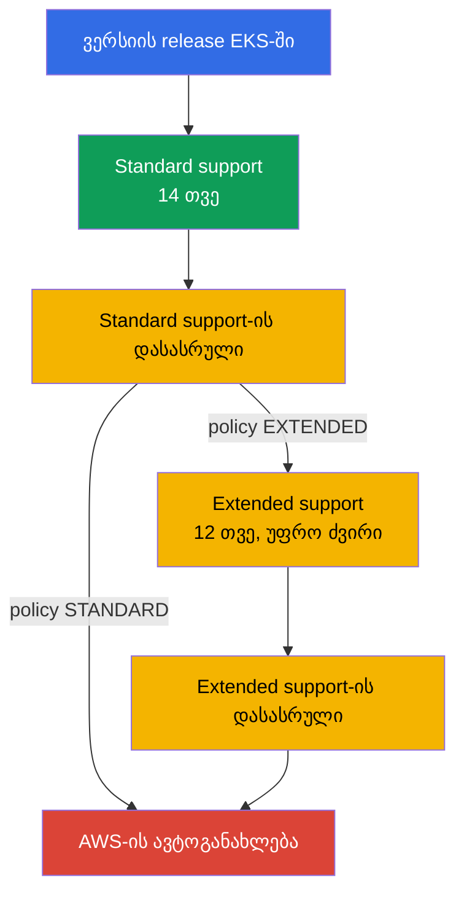
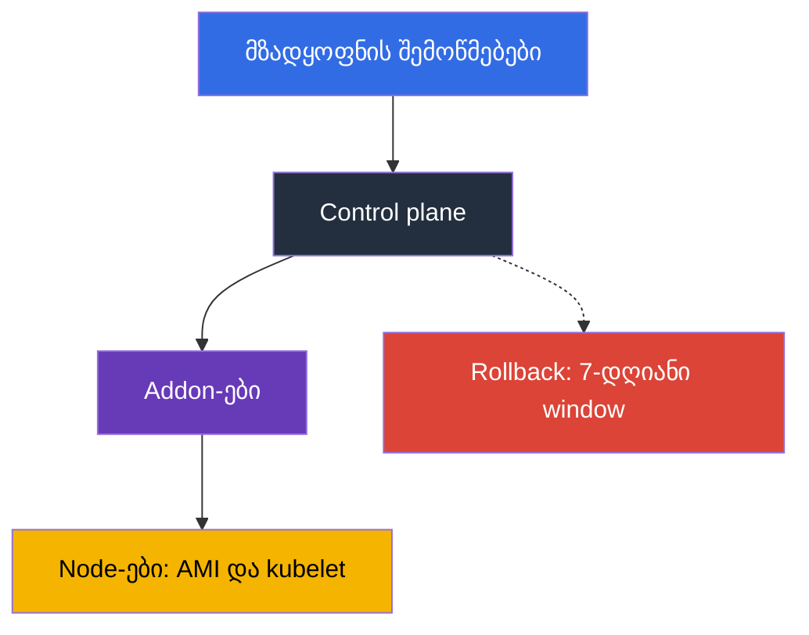

[Русская версия](ru.md) · [Eng version](en.md) · [Versión en español](es.md) · [Version française](fr.md) · [Deutsche Version](de.md) · [繁體中文版](tw.md) · [日本語版](jp.md)
# თავი 3. ვერსიების სასიცოცხლო ციკლი: standard და extended support, განახლების სტრატეგია

> **რა გველოდება შემდეგ.** Control plane-ს AWS ემსახურება, მაგრამ Kubernetes-ის ვერსიას თქვენ ირჩევთ და ამ
> არჩევანს მოქმედების ვადა აქვს: 14 თვე standard support და 12 თვე extended support, რის შემდეგაც
> კლასტერს თქვენ გარეშე განაახლებენ. თავი პოლიტიკასა და დაგეგმვაზეა: ვადები, ტარიფები,
> რისკები, მომზადება და გუნდის რიტმი. განახლების მექანიკა - თავი 38-ში, rollback - თავი 39-ში,
> addon-ების ვერსიები - თავი 37-ში. აქ წყდება, რას და როდის გააკეთებთ, და არა რით.

## 3.1. ვერსიების შესახებ ცუდ მომენტში გასაგებად ხუთი გზა

ხუთივე ისტორია იმ გუნდებს ემართებათ, რომელთა კლასტერიც კარგად მუშაობს: არაფერი აწუხებთ.

- **კლასტერი, რომელსაც ერთი წელია არავინ შეხებია.** ვერსია ორ minor ვერსიით ჩამორჩა, ხოლო განახლება
  მხოლოდ თითო minor ვერსიაზეა შესაძლებელი: ერთი maintenance window კი არა, ორი.
- **ანგარიში გაიზარდა, დატვირთვა კი არა.** ვერსია standard support-იდან გავიდა, კლასტერები გადავიდნენ
  extended support-ში, რომელიც კლასტერზე გაზრდილი საათობრივი განაკვეთით ტარიფდება.
- **AWS-მა კლასტერი თავად განაახლა.** Extended support-ც მთავრდება: არა თქვენს window-ში, თქვენი
  შემოწმების გეგმის გარეშე და შედეგის rollback-ის შესაძლებლობის გარეშე.
- **Addon-მა არ იმუშავა.** Control plane განახლდა, მაგრამ `vpc-cni` ან CSI-driver იმ ვერსიაზე დარჩა,
  რომელიც ახალი minor ვერსიისთვის არ არის მხარდაჭერილი, და სიმპტომები მაშინვე არ ჩანს.
- **Deployment გაფუჭდა upgrade-ის შემდეგ.** Chart-ში ახალი ვერსიიდან წაშლილი `apiVersion` დარჩა, ხოლო
  მოქმედი ობიექტები ცოცხალია: პრობლემას შემდეგ release-ზე პოულობენ, როცა `helm upgrade` ვარდება.

საერთო მნიშვნელი: Kubernetes-ის ვერსია კლასტერის თვისება კი არა, **კალენდრიანი პროცესია**.

## 3.2. როგორ მუშაობს ციკლი: 14 პლუს 12

Upstream საშუალოდ ოთხ თვეში ერთხელ უშვებს minor ვერსიებს, EKS მის release-ებისა და
deprecation-ების ციკლს მიჰყვება. შემდეგ იწყება EKS-სპეციფიკური მთვლელი: **standard support - პირველი 14 თვე**
ვერსიის EKS-ში გამოჩენიდან (patch-ები, ახალი platform version-ები, კლასტერის ჩვეულებრივი ტარიფი), შემდეგ
**extended support - მომდევნო 12 თვე**, როცა უსაფრთხოების განახლებები გრძელდება, მაგრამ
კლასტერი უფრო ძვირია. ჯამში **26 თვეა**, რის შემდეგაც კლასტერი ავტომატურად ახლდება.



Release-ისა და მხარდაჭერის ორივე პერიოდის დასრულების თარიღების კალენდარი არის EKS დოკუმენტაციაში და API-ში. თარიღების
hardcode-ით შეტანა runbook-ში არ ღირს: ისინი ზუსტდება და ვერსიები ემატება.

```bash
# EKS-ში ყველა ვერსია მხარდაჭერის დასრულების თარიღებით
aws eks describe-cluster-versions \
  --query 'clusterVersions[].[clusterVersion,versionStatus,endOfStandardSupportDate,endOfExtendedSupportDate]' \
  --output table

# მხოლოდ ის ვერსიები, რომლებიც უკვე extended support-შია
aws eks describe-cluster-versions --version-status extended-support
```

კლასტერი ნებისმიერ მხარდაჭერილ ვერსიაზე შეიძლება შექმნათ, მაგრამ extended support-ში მყოფი ვერსიით დაწყება
პირველი დღიდან გაზრდილ განაკვეთსა და upgrade-მდე ნაკლებ დროს ნიშნავს.

## 3.3. Upgrade policy: STANDARD ან EXTENDED

რა მოუვა კლასტერს standard support-ის ბოლოს, განისაზღვრება upgrade policy-ის `supportType` მნიშვნელობით.
განსხვავება არა იმაშია, იქნება თუ არა upgrade, არამედ იმაში, AWS როდის შეასრულებს მას.

| | `STANDARD` | `EXTENDED` |
|---|---|---|
| რა ხდება standard support-ის ბოლოს | AWS ავტომატურად აახლებს კლასტერს მომდევნო მხარდაჭერილ ვერსიაზე | კლასტერი გადადის extended support-ში და თავის ვერსიაზე რჩება |
| დამატებითი გადასახადი | არა | დიახ, კლასტერზე გაზრდილი საათობრივი განაკვეთი |
| კიდევ რამდენ ხანს ცოცხლობს ვერსია | 0 თვე | 12 თვე |
| რა ხდება ამ პერიოდის ბოლოს | - | AWS-ის მიერ ავტომატური განახლება |
| შესაძლებელია თუ არა policy-ის გადართვა | დიახ, სანამ ვერსია standard support-შია | უკან ვერ გადართავთ, თუ კლასტერი უკვე extended support-ში შევიდა |
| rollback ავტოგანახლების შემდეგ | მიუწვდომელია | მიუწვდომელია extended support-ის დასრულებისას |

სამი დეტალი. **Extended support ნაგულისხმევად ჩართულია** ახალი და არსებული კლასტერებისთვის: მოულოდნელი
upgrade-ისგან დაცული ხართ, მაგრამ ანგარიშის ზრდისგან არა. **Extended support-იდან გასვლა
policy-ის გადართვით შეუძლებელია**, ის მხოლოდ მაშინ ითიშება, სანამ ვერსია standard support-შია.
**`EXTENDED` წინასწარ უნდა ჩართოთ**: თუ ავტოგანახლება დაიწყო, policy-ის შეცვლამ შეიძლება ვეღარ მოასწროს.

```bash
# კლასტერის მიმდინარე policy და ვერსია
aws eks describe-cluster --name demo \
  --query 'cluster.{version:version,platform:platformVersion,policy:upgradePolicy}'

# Extended support-ის გამორთვა: კლასტერი standard support-ის ბოლოს ავტომატურად განახლდება
aws eks update-cluster-config --name demo --upgrade-policy supportType=STANDARD
```

ცდუნება, რომ „თავად განგვაახლებენ“, ფორმალურად მუშაობს: დააყენეთ `STANDARD` და აღარ იფიქროთ. პრაქტიკაში ეს
არის კონტროლის დათმობა **დროზე** (upgrade თქვენს window-ში არ მოვა), **რიგითობაზე** (control plane
addon-ებისა და manifest-ების შემოწმებამდე განახლდება) და **დაზღვევაზე** (rollback მიუწვდომელია).

## 3.4. გადავადების ფასი

Extended support „უკეთესი მხარდაჭერა“ კი არა, მთვლელია. Extended support-ში კლასტერის საათობრივი ფასი standard support-ის
ფასზე მეტია და მრავლდება კლასტერების რაოდენობასა და საათების რაოდენობაზე. გამოთვლა ასე ხდება: EKS-ის ფასების გვერდიდან
აიღეთ standard და extended support-ის cluster-hour განაკვეთები, სხვაობა გაამრავლეთ 730 საათზე,
შემდეგ კლასტერებისა და გადავადების თვეების რაოდენობაზე და შეადარეთ მომზადებისა და upgrade-ის ადამიან-დღეებს.

მომზადება პარკისთვის ერთხელ კეთდება, ხოლო extended support-ის გადასახადი ყველა კლასტერსა და ყოველ საათზე
გროვდება, ამიტომ არითმეტიკა ჩვეულებრივ გადავადების სასარგებლოდ არ არის. Extended support გონივრულად
იხარჯება დასაბუთებულ სიტუაციებში: release-მდე გაყინვა, vendor კომპონენტის შეუთავსებლობა, მიმდინარე აუდიტი;
თითოეულ შემთხვევაში გადავადებას აქვს დასრულების თარიღი და მფლობელი. და `supportType` ვერსიასთან ერთად
ინფრასტრუქტურის კოდში შეინახეთ (თავი 4): extended support-ში გადასვლა pull request-ში ჩანს და არა ანგარიშში.

## 3.5. ზუსტად რა ფუჭდება minor ვერსიის შეცვლისას

იცვლება API-ების ნაკრები, კომპონენტების ქცევა, ზოგჯერ node-ის საბაზო image. ქვემოთ არის ის, რაც პრაქტიკაში
ფუჭდება, და მისი წინასწარ შემოწმების გზა.

| რა ფუჭდება | რატომ | რით შეამოწმოთ წინასწარ |
|---|---|---|
| წაშლილი API ვერსიები manifest-ებსა და chart-ებში | წაშლილი `apiVersion`-ის მქონე ობიექტს API server აღარ იღებს; არსებული ობიექტები ცოცხალია, ახალი `apply` კი ვარდება | manifest-ებისა და chart-ების ინვენტარიზაცია, cluster insights, deprecated API-ის audit log-ები (თავი 21) |
| Addon-ების ვერსიები | `vpc-cni`, `coredns`, `kube-proxy`, CSI-driver-ები კლასტერის ყველა ვერსიასთან თავსებადი არ არის | `aws eks describe-addon-versions --kubernetes-version` (თავი 37) |
| CRD და მესამე მხარის controller-ები | controller იყენებს API-ს, რომელიც აღარ არსებობს, ან თვითონ არ აცხადებს ახალი ვერსიის მხარდაჭერას | თითოეული controller-ის თავსებადობის მატრიცა: ingress, autoscaler, service mesh, GitOps |
| Admission webhook-ები | ახალი ჩაშენებული ტიპები და ველები webhook-ის ფართო წესებში ხვდება; მიუწვდომელი webhook admission-ს აჩერებს (თავი 2) | dev-კლასტერზე გაშვება, ვიწრო წესები, timeout-ების შემოწმება |
| Node-ის საბაზო AMI | `1.32` ბოლო ვერსიაა, რომლისთვისაც EKS AL2-ზე AMI-ს უშვებს; `1.33`-დან მხოლოდ AL2023 და Bottlerocket | user data, bootstrap, package-ები და agent-ები შეამოწმეთ AL2023-ზე (თავები 10, 38) |
| Version skew kubelet | kubelet API server-ს upstream policy-ით დაშვებულზე მეტად არ უნდა ჩამორჩებოდეს | node-ები კლასტერის იმავე ციკლში განაახლეთ და არა „როდისმე მოგვიანებით“ |
| Scheduler-ისა და defaults-ის ქცევა | defaults-ისა და feature gate-ების ცვლილება pod-ების განაწილებასა და autoscaling-ს ცვლის | დატვირთვის გაშვება dev-ზე, metrics-ის შედარება |

AMI-ის სტრიქონი ცალკე დგას: ეს ერთადერთი პუნქტია, სადაც Kubernetes-ის ვერსიასთან ერთად node-ების ოპერაციული სისტემაც
იცვლება. AL2-დან AL2023-ზე გადასვლა ეხება user data-ს (სხვა bootstrap ფორმატი), package-ების ნაკრებს,
systemd unit-ებს, დაკვირვებადობის agent-ებსა და ყველაფერს, რაც ხელით დააყენეთ; ერთ window-ში ორი ცვლილება
გონივრულად უნდა გაიმიჯნოს (ნაწილი 3.7 და თავი 38).

## 3.6. მომზადება: ინვენტარიზაცია, insights, dev-გაშვება

Upgrade-ისთვის მზადყოფნა შეგრძნება კი არა, შემოწმებების ნაკრებია, რომელთაგან თითოეული პასუხს დიახ ან არა იძლევა.

**1. API-ის ინვენტარიზაცია.** ყველაფერი, რაც კლასტერის ობიექტებს ქმნის: manifest-ები, chart-ები, CI template-ები,
operator-ები. მიზანია იპოვოთ `apiVersion`, რომლებიც სამიზნე ვერსიაში აღარ იქნება. Control plane-ის audit log-ები
(თავი 2) აჩვენებს მოძველებულ API-ებთან რეალურ მიმართვებს და არა მხოლოდ git-ის შიგთავსს.

```bash
# pluto: წაშლილი და მოძველებული apiVersion-ების audit manifest-ებსა და chart-ებში, აღმოჩენისას კოდი 2-3
pluto detect-files -d ./manifests --target-versions k8s=v1.34.0
helm template ./chart | pluto detect - --target-versions k8s=v1.34.0

# kubent (kube-no-trouble): ცოცხალი კლასტერისა და Helm release-ების შემოწმება, -e აღმოჩენისას CI-ს აგდებს
kubent --target-version 1.34 --exit-error
```

pluto და kubent თავსდება CI-ში `update-cluster-version`-მდე: build ვარდება, სანამ git-ში ან კლასტერში
წაშლილი `apiVersion` ცოცხლობს, ხოლო საწყის manifest-ებში იჭერენ იმას, რასაც API server უხმოდ გარდაქმნის.

**2. Cluster insights.** EKS კლასტერზე თავად ატარებს შემოწმებების ნაკრებს და მას დაახლოებით დღეში ერთხელ,
ასევე მოთხოვნის მიხედვით ანახლებს. `UPGRADE_READINESS` მოიცავს upgrade-ის შესაძლებლობაზე მოქმედ შემოწმებებს,
მათ შორის მოძველებულ API-ებს; `ROLLBACK_READINESS` აჩვენებს, რჩება თუ არა rollback-ის შესაძლებლობა, და ის
განახლების შემდეგ 7 დღეა ხელმისაწვდომი (თავი 39).

```bash
# Upgrade-ისთვის მზადყოფნის შემოწმებები და მათი სტატუსები
aws eks list-insights --cluster-name demo --filter categories=UPGRADE_READINESS \
  --query 'insights[].[name,insightStatus.status,kubernetesVersion]' --output table

# კონკრეტული შემოწმების დეტალები: რა იპოვეს და რას გირჩევენ
aws eks describe-insight --cluster-name demo --id <insight-id>
```

**3. Addon-ებისა და controller-ების მატრიცა.** სამიზნე ვერსიასთან თავსებადი addon-ების ვერსიების სია და
მესამე მხარის controller-ების მხარდაჭერის დადასტურება.

```bash
# Addon-ის რომელი ვერსიებია ხელმისაწვდომი კლასტერის სამიზნე ვერსიისთვის
aws eks describe-addon-versions --addon-name vpc-cni --kubernetes-version 1.34 \
  --query 'addons[].addonVersions[].addonVersion' --output text

# რომელი API ჯგუფებია ცოცხალი კლასტერში და ჩამორჩება თუ არა კლიენტი server-ს
kubectl api-resources --sort-by=name -o wide | head -30
kubectl version
```

Control plane-ის ვერსიის შეცვლამდე თითოეული addon და თითოეული CRD ერთსა და იმავე checklist-ს გადის:

- ახალი კლასტერის ვერსიისთვის სამიზნე addon-ის ვერსია არსებობს (`describe-addon-versions` ზემოთ);
- მესამე მხარის controller-მა (ingress, autoscaler, mesh, GitOps) სამიზნე ვერსიის მხარდაჭერა გამოაცხადა;
- CRD და მისი controller სამიზნე ვერსიიდან წაშლილ `apiVersion`-ს არ იყენებს (pluto, kubent).

პუნქტი თუ დახურული არ არის, control plane-ს არ ეხებიან: ის addon-ის დაწევამდე განახლდება.

**4. გაშვება dev-კლასტერზე**, რომელიც production-ს ჰგავს: იგივე addon-ები, controller-ები, chart-ები და webhook-ები.
აქ პოულობენ შეცდომებს, რომლებიც არც ერთ checklist-ში არ არის; პრობლემების ნაწილი მხოლოდ დატვირთვისას ჩანს.

**5. Checklist და გადაწყვეტილება.** სამიზნე ვერსია, addon-ების ვერსიები, რა იცვლება manifest-ებში, window-ის
მფლობელი, upgrade-ის შემდგომი შემოწმების გეგმა და rollback-ის პირობა. ბოლო ორი პუნქტის გარეშე არ იწყებენ.

## 3.7. In-place თუ blue/green

არჩევანი პარკისთვის ერთხელ კეთდება და ცალკეული კლასტერებისთვის ზუსტდება (მექანიკა - თავი 38).

| კრიტერიუმი | In-place | Blue/green |
|---|---|---|
| რა ხდება და რა ღირს | იგივე კლასტერი თითო minor ვერსიით იწევს: საათები, ერთი window, ერთი კლასტერი | გვერდით ახალი ვერსიის კლასტერი იქმნება და traffic მასზე გადადის: დღეები ან კვირები, ორმაგი რესურსები |
| ვერსიის გამოტოვება | შეუძლებელია, მხოლოდ თითო-თითო | შესაძლებელია: ახალი კლასტერი საჭირო ვერსიაზე იქმნება |
| დაზღვევა | rollback 7 დღის განმავლობაში, ერთი ვერსიით უკან (თავი 39) | traffic-ის გადართვა ისევ ძველ კლასტერზე |
| როდის ირჩევენ | ვერსიაზე ჩვეულებრივი ნაბიჯი, მცირე პარკი | საბაზო AMI-ის შეცვლა, რამდენიმე ვერსიით ჩამორჩენა, ხელმისაწვდომობის მკაცრი მოთხოვნები |

Upgrade-ის შიგნით მოქმედებების რიგი ერთნაირია: ჯერ control plane, შემდეგ addon-ები, შემდეგ node-ები.
მიზეზი version skew policy-ია: kubelet შეიძლება API server-ს ჩამორჩებოდეს, მაგრამ პირიქით არა.



Rollback გულწრფელად რომ ვთქვათ ვიწრო დაზღვევაა და არა გეგმა. ის შესაძლებელია upgrade-ის შემდეგ 7 დღის
განმავლობაში, მხოლოდ ერთი minor ვერსიით უკან და მხოლოდ მაშინ, თუ upgrade in-place იყო; extended support-ის
დასრულებისას ავტომატურად განახლებული კლასტერების rollback არ ხდება (თავი 39). განახლება ერთი ბრძანებით იწყება:

```bash
# Control plane-ის ერთი minor ვერსიით განახლების დაწყება (დეტალები - თავი 38)
aws eks update-cluster-version --name demo --kubernetes-version 1.34
aws eks describe-update --name demo --update-id <update-id> --query 'update.[status,type]'
```

## 3.8. რიტმი, მფლობელი და კლასტერების პარკი

Upgrade, რომელსაც „როცა დრო გამოჩნდება“ აკეთებენ, არასოდეს კეთდება. მუშაობს მხოლოდ რიტმი.

| პოლიტიკა | რას ნიშნავს | დადებითი და უარყოფითი მხარეები |
|---|---|---|
| latest | ვახლდებით, როგორც კი ვერსია EKS-ში გამოჩნდება | support-ის დასრულებამდე მაქსიმალური დრო, მაგრამ პრობლემებს პირველები პოულობთ |
| N-1 | აქტუალურზე ერთი ვერსიით დაბლა გვიჭირავს | bugfix-ები და საზოგადოების ანგარიშები უკვე არსებობს, ვადების მარაგი საკმარისია |
| N-2 და უფრო ღრმა | იშვიათად ვაახლებთ, ნახტომებით ვეწევით | თითოეული upgrade რამდენიმე ნაბიჯია, extended support-ში გადასვლის რისკი |
| extended როგორც ნორმა | ბოლო მომენტამდე ვერსიაზე ვრჩებით | აპლიკაციისთვის პროგნოზირებადია, ძვირია და ავტოგანახლებით მთავრდება |

პრაქტიკული ორიენტირი არის **ერთი minor ვერსია ყოველ 4-6 თვეში** და N-1 policy: upstream-ის ოთხთვიანი
release ციკლისას ასეთი რიტმი კლასტერს standard support-ის ფარგლებში ინარჩუნებს, ახალი release-ის დევნის
გარეშე. რიტმის არსებობისთვის საჭიროა **მფლობელი** (გუნდი ან role, რომლის ვალდებულებებშიც ვერსიების
upgrade შედის), **კალენდარში თარიღები** უკუთვლით (სამი თვით ადრე მომზადება, ორი თვით ადრე dev-გაშვება,
ერთი თვით ადრე production), **ვადების monitoring** და **რეგულარული window**.

ცალკე ამბავია ათეული კლასტრის პარკი, თითოეულს თავისი ვერსია და addon-ების თავისი ნაკრები აქვს:
upgrade ერთი პროექტის ნაცვლად ათ სხვადასხვა პროექტად იქცევა. პარკს წესრიგში ოთხი ჩვევა ინარჩუნებს:
**ვერსია და `supportType` კოდში**, ყველა კლასტერისთვის ერთი module (თავი 4); **გარემოების მიხედვით rollout-ის
რიგი** dev, stage, production დაკვირვების პაუზით, რადგან პრობლემების ნაწილი მეორე-მესამე დღეს ვლინდება;
**addon-ები და controller-ები პარკისთვის ერთ ვერსიაზე**, თორემ შემოწმების შედეგს ვეღარ გამოიყენებთ (თავი 37);
**GitOps როგორც ხილვადობის ინსტრუმენტი**, რომ კითხვას „სად რა გვიდგას“ repository-ს ერთი მოთხოვნით უპასუხოთ (თავი 44).

```bash
# რეგიონში კლასტერების ვერსიებისა და policy-ების ინვენტარი: ვეძებთ დავიწყებულსა და ჩამორჩენილს
for c in $(aws eks list-clusters --query 'clusters[]' --output text); do
  aws eks describe-cluster --name "$c" --output text \
    --query 'cluster.[name,version,upgradePolicy.supportType]'; done
```

## 3.9. როგორ იყენებენ ამას production-ში

- **ვერსიების კალენდარი საერთოა.** პარკის ყველა კლასტერისთვის standard support-ის დასრულების თარიღები
  გუნდის კალენდარში უკუთვლითაა და არა ვიღაცის თავში.
- **Policy გააზრებულია.** Production `EXTENDED`-შია, როგორც მოულოდნელი ავტოგანახლებისგან დაზღვევა, მაგრამ
  ახალი ვერსიაზე გადასვლის გეგმით standard support-ის დასრულებამდე; dev `STANDARD`-შია, რათა
  ავტოგანახლებამ პრობლემები production-მდე იპოვოს. Extended support-ში გადასვლა გამონაკლისია თარიღით,
  მიზეზითა და მფლობელით.
- **მომზადება ავტომატიზებულია.** Cluster insights რეგულარულად მოწმდება, მოძველებული API-ების audit
  pluto-თი და kubent-ით CI-ში შედის, addon-ების ვერსიების მატრიცა ციკლის წინ ახლდება.
- **Upgrade ჯერ dev-ზე ხდება**, ყოველთვის control plane, addon-ები, node-ების რიგით, სამუშაოების დაწყებამდე
  განსაზღვრული rollback-ის პირობით. **საბაზო AMI-ის შეცვლა ცალკე იგეგმება**, ხოლო ჩამორჩენილი kubelet
  ოპერაციის incident-ად ითვლება.

## 3.10. მინი-გლოსარიუმი

- **Standard support** არის EKS-ში minor ვერსიის სიცოცხლის პირველი 14 თვე, კლასტერზე ჩვეულებრივი საათობრივი
  განაკვეთით. **Extended support** არის მომდევნო 12 თვე, გაზრდილი განაკვეთით; ჯამში 26 თვე.
- **Upgrade policy** (`supportType`) არის კლასტერის კონფიგურაციის ველი `STANDARD` და `EXTENDED` მნიშვნელობებით,
  რომელიც standard support-ის დასრულებისას ქცევას განსაზღვრავს. Extended support ნაგულისხმევად ჩართულია;
  მისგან policy-ის გადართვით გამოსვლა შეუძლებელია, მხოლოდ upgrade-ით.
- **Cluster insights** არის EKS-ის ავტომატური კლასტერის შემოწმებები; `UPGRADE_READINESS` upgrade-ისთვის
  მზადყოფნას ეხება, `ROLLBACK_READINESS` rollback-ის შესაძლებლობას და 7 დღეა ხელმისაწვდომი.
- **Version skew** არის upstream policy-ით დაშვებული kubelet-ის ჩამორჩენა API server-თან შედარებით; ეს არის
  რიგის „ჯერ control plane, შემდეგ node-ები“ მიზეზი. **In-place upgrade** იმავე კლასტერის ერთი minor ვერსიით
  განახლებაა, **blue/green** - ახალი ვერსიის კლასტერის გვერდით შექმნა (თავი 38), **rollback** - in-place
  upgrade-ის შემდეგ 7 დღის განმავლობაში ვერსიის დაბრუნება (თავი 39).

## 3.11. თავის შეჯამება

- 14 თვე standard support პლუს 12 თვე extended support, ჯამში 26 თითო minor ვერსიაზე; თარიღები
  `aws eks describe-cluster-versions`-დან აიღება. განახლება მხოლოდ თითო ვერსიაზეა შესაძლებელი, ამიტომ ორი
  minor ვერსიით ჩამორჩენა ორ window-ს ნიშნავს.
- Upgrade policy `STANDARD` standard support-ის ბოლოს AWS-ის მიერ ავტოგანახლებას ნიშნავს,
  `EXTENDED` - გაზრდილი განაკვეთით extended support-ში გადასვლას. Extended support ნაგულისხმევად ჩართულია,
  მისგან policy-ის გადართვით გამოსვლა შეუძლებელია, მხოლოდ upgrade-ით.
- Extended support-ის დასრულებისას კლასტერი ავტომატურად ახლდება და ასეთი კლასტერის rollback შეუძლებელია.
  გათვლა, რომ „თავად განგვაახლებენ“, დროს, რიგითობასა და დაზღვევას თმობს.
- ფუჭდება წაშლილი და მოძველებული API manifest-ებსა და chart-ებში, addon-ების ვერსიები, controller-ები და CRD,
  webhook-ები, ხოლო `1.33`-დან საბაზო AMI-ც: `1.32` AL2-ზე AMI-ით ბოლო ვერსიაა.
- მომზადება API-ის ინვენტარიზაცია, cluster insights, addon-ების ვერსიების მატრიცა და dev-ზე გაშვებაა.
  სამუშაოების რიგი: control plane, addon-ები, node-ები. Rollback ვიწროა: 7 დღე, ერთი ვერსია, in-place.
- რიტმი სიჩქარეზე მნიშვნელოვანია: N-1 policy, ერთი ვერსია ყოველ 4-6 თვეში, მფლობელი, კალენდარში თარიღები და
  კლასტერის ვერსია კოდში მთელი პარკისთვის.

## 3.12. როგორ გამოგადგებათ ეს რეალურ სამუშაოში

კითხვა „როდის ვაახლებთ“ არითმეტიკად იქცევა: standard support-ის დასრულების თარიღს მინუს სამი თვე და
სამუშაოების დაწყების ვადა გაქვთ. ფულზე საუბარიც საგნობრივია: extended support-ის დანამატი თვეში თითო
კლასტერზე ითვლება და მომზადების ღირებულებას შედარდება, რომელიც პარკისთვის ერთხელ კეთდება. Upgrade კი
აღარ არის ავრალი: როცა API-ის ინვენტარიზაცია CI-შია, cluster insights dashboard-ზეა, ხოლო სამუშაოების
რიგი runbook-შია, ყოველი შემდგომი განახლება წინაზე ნაკლები ღირს. და კლასტერს, რომელიც თქვენ მაგივრად
განაახლეს, მაინც თქვენ მოაწესრიგებთ.

## 3.13. თვითშემოწმების კითხვები

1. რამდენ თვეს ცოცხლობს minor ვერსია EKS-ში და რისგან შედგება ეს რიცხვი?
2. რით განსხვავდება `STANDARD` და `EXTENDED` და რა ხდება თითოეული პერიოდის ბოლოს?
3. რა მნიშვნელობა აქვს upgrade policy-ს ნაგულისხმევად და რატომ არის ეს მნიშვნელოვანი ანგარიშისთვის?
4. კლასტერი უკვე extended support-შია. როგორ შეწყვეტთ გაზრდილი განაკვეთის გადახდას?
5. რატომ არის ორი minor ვერსიით ჩამორჩენა ერთით ჩამორჩენაზე ძვირი და არა ორჯერ?
6. როგორ გამოთვლით, რა იაფია: extended support ნახევარი წლით თუ გუნდის ძალებით upgrade?
7. რა მოუვა კლასტერს, რომელსაც extended support-ის დასრულებამდე არ შეხებიან, და შესაძლებელი იქნება თუ არა rollback?
8. შემოწმებების რომელ კატეგორიებს იძლევა cluster insights და რისთვისაა საჭირო `ROLLBACK_READINESS`?
9. რატომ არის `1.32`-დან `1.33`-ზე upgrade საშიში Kubernetes-ის ვერსიის შეცვლის გარდა?
10. რატომ აახლებენ ჯერ control plane-ს, შემდეგ კი node-ებს და არა პირიქით?
11. რა შემთხვევებში აირჩევთ blue/green-ს in-place-ის ნაცვლად?
12. პარკში თორმეტი კლასტერია სხვადასხვა ვერსიით. რით დაიწყებთ წესრიგში მოყვანას?

## პრაქტიკა

თავს ლაბორატორიული დავალება არ აქვს, მაგრამ მთელი მისი შინაარსი ცოცხალ კლასტერზე იკითხება. დაიწყეთ
კალენდრით: `aws eks describe-cluster-versions` აჩვენებს ვერსიებს, მათ სტატუსსა და მხარდაჭერის დასრულების
თარიღებს - ამოიწერეთ თქვენი კლასტერის ვერსიის თარიღები. შემდეგ `aws eks describe-cluster` `version`,
`platformVersion` და `upgradePolicy` ველებით. მზადყოფნა შეამოწმეთ `aws eks list-insights
--cluster-name <cluster> --filter categories=UPGRADE_READINESS`-ით, ხოლო აღმოჩენებზე - `aws eks
describe-insight`-ით. Addon-ების თავსებადობა - `aws eks describe-addon-versions --addon-name
coredns --kubernetes-version <next>`. Kubernetes-ის მხრიდან სასარგებლოა `kubectl version` და
`kubectl api-resources -o wide`. განახლების მექანიკა განხილულია თავში 38, rollback - თავში 39.

---
[სარჩევი](../README_GE.md) · [თავი 2](../02/ge.md) · [თავი 4](../04/ge.md)
