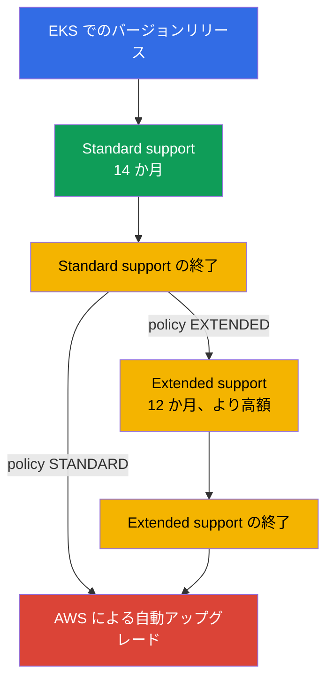
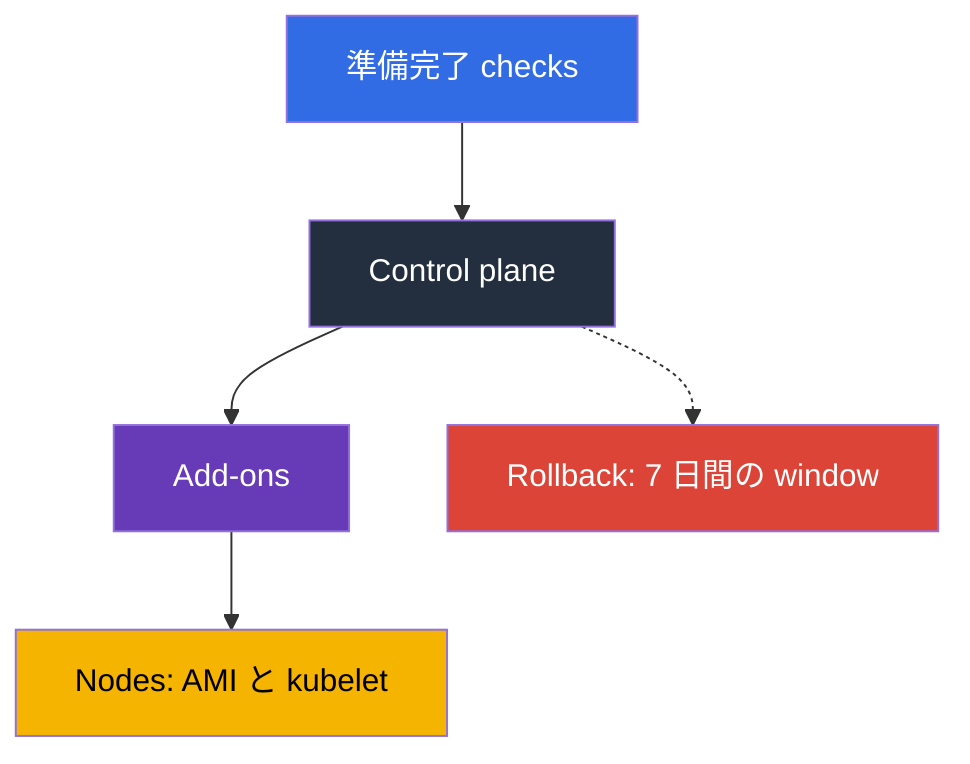

[Русская версия](ru.md) · [Eng version](en.md) · [Versión en español](es.md) · [Version française](fr.md) · [Deutsche Version](de.md) · [ქართული ვერსია](ge.md) · [繁體中文版](tw.md)
# 第 3 章. バージョンのライフサイクル: standard と extended support、アップグレード戦略

> **次に何をするか。** Control plane は AWS が運用しますが、Kubernetes のバージョンを選ぶのはあなたであり、その選択には有効期限があります。standard support は 14 か月、extended support は 12 か月で、期限後には関与しないまま cluster がアップグレードされます。本章はポリシーと計画について扱います。期間、料金、リスク、準備、チームのリズムです。アップグレードの仕組みは第 38 章、rollback は第 39 章、add-on のバージョンは第 37 章で説明します。ここで決めるのは、何をいつ行うかであり、どのように行うかではありません。

## 3.1. 最悪のタイミングでバージョン問題を知る五つの方法

この五つの出来事は、cluster が問題なく動いているチームで起こります。何も痛みがない状態です。

- **一年間誰も触らなかった cluster。** バージョンが二つの minor version 遅れていますが、アップグレードは一度に一つの minor version しか進められません。一つの maintenance window ではなく、二つ必要です。
- **負荷は変わらないのに請求額が増えた。** バージョンが standard support を終え、clusters が extended support に移行し、cluster ごとに高い時間料金で課金されます。
- **AWS が cluster を自動アップグレードした。** Extended support にも終わりがあります。あなたの window 外で、検証計画なしに実施され、結果を rollback することもできません。
- **Add-on が動かなかった。** Control plane はアップグレードされましたが、`vpc-cni` または CSI driver が新しい minor version でサポートされないバージョンのままで、症状はすぐには現れません。
- **アップグレード後に deployment が壊れた。** Chart に新バージョンで削除された `apiVersion` が残っていました。既存 objects は動き続けますが、次の release で `helm upgrade` が失敗して問題が発覚します。

共通する本質は、Kubernetes のバージョンは cluster の属性ではなく、**カレンダーを持つプロセス**だということです。

## 3.2. ライフサイクルの仕組み: 14 か月プラス 12 か月

Upstream は平均して四か月ごとに minor version をリリースし、EKS はそのリリースおよび deprecation cycle に従います。次に EKS 固有の期間が始まります。バージョンが EKS に登場してからの**最初の 14 か月が standard support**です。patches、新しい platform version、通常の cluster 料金が含まれます。その後の**12 か月が extended support**で、security updates は継続されますが、cluster の料金は高くなります。合計は **26 か月**で、その後 cluster は自動的にアップグレードされます。



リリース日と両期間の終了日を含むカレンダーは EKS documentation と API で確認できます。日付を runbook に hardcode しないでください。日付は更新され、新しいバージョンも追加されます。

```bash
# All EKS versions with support end dates
aws eks describe-cluster-versions \
  --query 'clusterVersions[].[clusterVersion,versionStatus,endOfStandardSupportDate,endOfExtendedSupportDate]' \
  --output table

# Only versions already in extended support
aws eks describe-cluster-versions --version-status extended-support
```

サポート対象の任意のバージョンで cluster を作成できますが、extended support 中のバージョンで開始すると、初日から高い料金がかかり、アップグレードまでの時間も短くなります。

## 3.3. Upgrade policy: STANDARD か EXTENDED

standard support の終了時に cluster に何が起きるかは、値が `supportType` である upgrade policy のフィールドで決まります。違いはアップグレードの有無ではなく、AWS がいつ実行するかです。

| | `STANDARD` | `EXTENDED` |
|---|---|---|
| Standard support 終了時の動作 | AWS が cluster を次のサポート対象バージョンへ自動アップグレードする | cluster は extended support に入り、現在のバージョンに留まる |
| 追加料金 | なし | あり。cluster ごとに高い時間料金 |
| その後バージョンが維持される期間 | 0 か月 | 12 か月 |
| この期間の終了時に起きること | - | AWS による自動アップグレード |
| ポリシーを切り替えられるか | はい。バージョンが standard support 中であれば可能 | cluster が extended support に入った後は元に戻せない |
| 自動アップグレード後の rollback | 利用不可 | extended support の終了時には利用不可 |

三つの詳細があります。**Extended support は新規および既存の clusters でデフォルト有効**です。突然のアップグレードからは守られますが、請求額の増加は防げません。**ポリシーの切り替えでは extended support を終了できません**。無効にできるのはバージョンが standard support 中の場合だけです。**`EXTENDED` は事前に有効化する必要があります**。自動アップグレードが始まると、ポリシー変更が間に合わないことがあります。

```bash
# Current cluster policy and version
aws eks describe-cluster --name demo \
  --query 'cluster.{version:version,platform:platformVersion,policy:upgradePolicy}'

# Disable extended support: the cluster will be automatically upgraded at the end of standard support
aws eks update-cluster-config --name demo --upgrade-policy supportType=STANDARD
```

「AWS が自動でアップグレードしてくれる」という誘惑は、形式上は機能します。`STANDARD` を設定して考えなければよいのです。しかし実際には、**時期**への制御を手放します。アップグレードはあなたの window には来ません。また、**順序**への制御も失います。add-ons と manifests を検証する前に control plane がアップグレードされます。さらに**保険**も失います。rollback は利用できません。

## 3.4. 先延ばしのコスト

Extended support は「より良い support」ではなく、料金カウンターです。extended support の cluster あたりの時間料金は standard rate より高く、clusters 数と時間数で乗算されます。次のように計算します。EKS pricing page から standard と extended support の cluster-hour あたりの rate を取得し、その差を 730 時間、clusters 数、先延ばしする月数で乗算します。そして準備とアップグレードに必要な person-days と比較します。

準備は fleet 全体に一度だけ行いますが、extended support の料金は各 cluster に対して毎時間積み上がるため、計算上は先延ばしが有利になることは通常ありません。Extended support は正当な状況で使うものです。release 前の freeze、vendor component の非互換、進行中の audit などです。どのケースでも先延ばしには終了日と owner を置きます。`supportType` は infrastructure code 内のバージョンと一緒に管理してください（第 4 章）。extended support への移行は請求書ではなく pull request で見えるようになります。

## 3.5. Minor version の変更で実際に壊れるもの

API のセット、component の動作、場合によっては node base image が変わります。以下は実務で壊れるものと、事前に確認する方法です。

| 壊れるもの | 理由 | 事前確認の方法 |
|---|---|---|
| Manifests と charts 内の削除済み API versions | 削除された `apiVersion` を持つ object は API server に受け入れられない。既存 objects は動き続けるが、新しい `apply` は失敗する | manifests と charts の inventory、cluster insights、deprecated API の audit logs（第 21 章） |
| Add-on versions | `vpc-cni`、`coredns`、`kube-proxy`、CSI drivers は、すべての cluster version と互換性があるわけではない | `aws eks describe-addon-versions --kubernetes-version`（第 37 章） |
| CRDs と third-party controllers | Controller が既に存在しない API を使う、または新しいバージョンのサポートを宣言していない | 各 controller の compatibility matrix: ingress、autoscaler、service mesh、GitOps |
| Admission webhooks | 新しい built-in types と fields が広すぎる webhook rules に一致する。利用不能な webhook は admission を停止させる（第 2 章） | dev cluster で実行し、狭い rules を使い、timeouts を確認する |
| Node base AMI | `1.32` は EKS が AL2 用 AMIs を公開する最後のバージョンである。`1.33` 以降は AL2023 と Bottlerocket のみ | AL2023 上で user data、bootstrap、packages、agents を確認する（第 10、38 章） |
| Kubelet version skew | kubelet は upstream skew policy が許容する範囲を超えて API server から遅れることはできない | nodes は「いつか後で」ではなく cluster と同じ cycle でアップグレードする |
| Scheduler の動作と defaults | defaults と feature gates の変更により Pod placement と autoscaling が変わる | dev で load test を行い metrics を比較する |

AMI の行は別格です。Kubernetes のバージョンと同時に node operating system が変わる唯一の項目だからです。AL2 から AL2023 への移行は、user data（異なる bootstrap format）、package set、systemd units、observability agents、および手作業で導入したすべてに影響します。二つの変更は別の windows に分けるのが賢明です（3.7 節および第 38 章）。

## 3.6. 準備: inventory、insights、dev での実行

アップグレードの準備完了は感覚ではなく、yes か no の答えを出す一連の checks です。

**1. API inventory。** Cluster 内に objects を作成するすべてのものを対象にします。manifests、charts、CI templates、operators です。目的は、target version に存在しなくなる `apiVersion` を見つけることです。Control plane audit logs（第 2 章）は、git の内容だけでなく、obsolete APIs への実際の calls を示します。

```bash
# pluto: audit removed and deprecated apiVersions in manifests and charts; exits 2-3 when findings are present
pluto detect-files -d ./manifests --target-versions k8s=v1.34.0
helm template ./chart | pluto detect - --target-versions k8s=v1.34.0

# kubent (kube-no-trouble): checks the live cluster and Helm releases; -e fails CI when findings are present
kubent --target-version 1.34 --exit-error
```

`update-cluster-version` の前に pluto と kubent を CI に入れます。git または cluster に削除済み `apiVersion` が残る限り build は失敗し、source manifests は API server が暗黙に変換するものを検出します。

**2. Cluster insights。** EKS 自身が cluster に対して一連の checks を実行し、およそ一日ごと、または要求時に更新します。`UPGRADE_READINESS` は deprecated APIs を含め、アップグレード可能性に影響する checks を扱います。`ROLLBACK_READINESS` は rollback が可能な状態かを示し、更新後 7 日間利用できます（第 39 章）。

```bash
# Upgrade readiness checks and their statuses
aws eks list-insights --cluster-name demo --filter categories=UPGRADE_READINESS \
  --query 'insights[].[name,insightStatus.status,kubernetesVersion]' --output table

# Details of a specific check: what was found and what is recommended
aws eks describe-insight --cluster-name demo --id <insight-id>
```

**3. Add-on と controller の matrix。** Target version と互換性のある add-on versions の一覧と、third-party controllers からのサポート確認です。

```bash
# Which add-on versions are available for the target cluster version
aws eks describe-addon-versions --addon-name vpc-cni --kubernetes-version 1.34 \
  --query 'addons[].addonVersions[].addonVersion' --output text

# Which API groups are present in the cluster and whether the client lags behind the server
kubectl api-resources --sort-by=name -o wide | head -30
kubectl version
```

Control plane のバージョンを変更する前に、すべての add-on と CRD は同じ checklist を通ります。

- 新しい cluster version 向けの target add-on version が存在すること（上記の `describe-addon-versions`）。
- Third-party controller（ingress、autoscaler、mesh、GitOps）が target version のサポートを宣言していること。
- CRD とその controller が target version で削除される `apiVersion` を使っていないこと（pluto、kubent）。

項目が未完了なら control plane に触れてはいけません。add-on が追随する前に control plane がアップグレードされます。

**4. 本番に似た dev cluster での実行。** 同じ add-ons、controllers、charts、webhooks を使用します。これにより、どの checklist にも現れない errors を見つけられます。一部の問題は負荷がある場合だけ見えます。

**5. Checklist と判断。** Target version、add-on versions、manifests の変更、window owner、アップグレード後の検証計画、rollback 条件です。最後の二項目なしに開始してはいけません。

## 3.7. In-place か blue/green か

Fleet に対して一度選択し、個別の clusters について判断を調整します（仕組みは第 38 章）。

| 基準 | In-place | Blue/green |
|---|---|---|
| 起きることとコスト | 同じ cluster を一つの minor version 上げる。数時間、一つの window、一つの cluster | 新バージョンの cluster を隣に作成して traffic を移す。数日または数週間、二重の resources |
| バージョンを飛ばすこと | 不可能。一度に一つだけ | 可能。新しい cluster を必要なバージョンで作成する |
| 保険 | 7 日以内に一つ前のバージョンへ rollback（第 39 章） | traffic を古い cluster に切り戻す |
| 選ぶ場面 | 通常のバージョン更新、小規模 fleet | Base AMI の変更、複数バージョンの遅れ、厳しい availability requirements |

アップグレード内の順序は同じです。最初に control plane、次に add-ons、最後に nodes です。理由は version skew policy にあります。kubelet は API server より遅れてもよいですが、その逆はできません。



Rollback は正直に捉えてください。計画ではなく、限定的な保険です。アップグレード後 7 日間だけ、一つ前の minor version に対してのみ、かつアップグレードが in-place の場合にのみ可能です。extended support の終了時に自動アップグレードされた clusters は rollback できません（第 39 章）。更新は一つの command で開始します。

```bash
# Start a control plane update by one minor version (details in Chapter 38)
aws eks update-cluster-version --name demo --kubernetes-version 1.34
aws eks describe-update --name demo --update-id <update-id> --query 'update.[status,type]'
```

## 3.8. リズム、owner、cluster fleet

「時間ができたら」行うアップグレードは、決して行われません。機能するのはリズムだけです。

| ポリシー | 意味 | 長所と短所 |
|---|---|---|
| latest | バージョンが EKS に登場したらすぐアップグレードする | support 終了までの時間は最大だが、問題を最初に見つける |
| N-1 | 現行より一つ低いバージョンを維持する | bug fixes と community reports が既にあり、時間の余裕も十分 |
| N-2 以降 | まれにアップグレードし、まとめて追いつく | 各アップグレードが複数ステップになり、extended support に入るリスクがある |
| extended を通常運用にする | 最後までバージョンを維持する | application には予測可能だが、高額で、最後は自動アップグレードになる |

実用的な目安は、**4-6 か月ごとに一つの minor version**と N-1 policy です。Upstream の四か月ごとの release cycle では、このリズムにより最新 release を追いかけずに cluster を standard support 内に保てます。リズムを実在させるには、**owner**（バージョンアップグレードを責務とする team または role）、逆算した**カレンダー日程**（三か月前に準備、二か月前に dev 実行、一か月前に本番）、**期限の監視**、**定期的な window**が必要です。

別の課題は、十数個の clusters を持つ fleet です。それぞれに異なるバージョンと add-on set があると、アップグレードは一つではなく十個の異なる projects になります。Fleet を整然と保つのは四つの習慣です。**バージョンと `supportType` を code で管理すること**、すべての clusters に一つの module を使うこと（第 4 章）。**environments ごとの rollout order**、dev、stage、production の順にし、問題の一部は二日目または三日目に現れるため観察の pause を入れること。**Fleet 全体で add-ons と controllers を一つのバージョンに揃えること**、そうでなければ検証結果を再利用できません（第 37 章）。そして、**可視性のツールとしての GitOps**です。これにより「どこで何が動いているか」を一つの repository query で答えられます（第 44 章）。

```bash
# Inventory versions and policies for regional clusters: find forgotten and outdated clusters
for c in $(aws eks list-clusters --query 'clusters[]' --output text); do
  aws eks describe-cluster --name "$c" --output text \
    --query 'cluster.[name,version,upgradePolicy.supportType]'; done
```

## 3.9. 本番での適用方法

- **バージョンカレンダーを共有する。** Fleet のすべての cluster における standard support 終了日を、誰かの頭の中ではなく、countdown 付きの team calendar に入れます。
- **ポリシーを意図的に選ぶ。** Production では突然の自動アップグレードへの保険として `EXTENDED` を使いますが、standard support 終了前に新しいバージョンへ移行する計画を持ちます。dev では `STANDARD` を使い、自動アップグレードで production より先に問題を発見します。extended support への移行は、日付、理由、owner を持つ例外です。
- **準備を自動化する。** Cluster insights を定期的に確認し、pluto と kubent による deprecated API の audit を CI に入れ、cycle の前に add-on version matrix を更新します。
- **最初に dev をアップグレードする。** 常に control plane、add-ons、nodes の順で実施し、作業開始前に rollback 条件を定めます。**Base AMI の変更は別途計画し**、遅れた kubelet は運用 incident として扱います。

## 3.10. ミニ用語集

- **Standard support** は EKS における minor version の最初の 14 か月で、通常の cluster 時間料金です。**Extended support** は次の 12 か月で、より高い料金になります。合計は 26 か月です。
- **Upgrade policy**（`supportType`）は `STANDARD` と `EXTENDED` の値を持つ cluster configuration field で、standard support 終了時の動作を決めます。Extended support はデフォルトで有効です。ポリシーの切り替えで終了することはできず、アップグレードでのみ終了できます。
- **Cluster insights** は EKS による自動 cluster checks です。`UPGRADE_READINESS` はアップグレードの準備、`ROLLBACK_READINESS` は rollback 可能性に関するもので、7 日間利用できます。
- **Version skew** は upstream policy が許容する kubelet の API server に対する遅れです。「最初に control plane、次に nodes」という順序の理由です。**In-place upgrade** は同じ cluster を一つの minor version アップグレードすること、**blue/green** は新バージョンの cluster を隣に作成すること（第 38 章）、**rollback** は in-place アップグレード後 7 日以内にバージョンを戻すことです（第 39 章）。

## 3.11. 本章のまとめ

- standard support は 14 か月、extended support は 12 か月で、minor version あたり合計 26 か月です。日付は `aws eks describe-cluster-versions` から取得します。アップグレードは一度に一つのバージョンだけなので、二つの minor version 遅れは二つの windows を意味します。
- Upgrade policy の `STANDARD` は standard support 終了時に AWS が自動アップグレードすることを、`EXTENDED` は高い料金で extended support に入ることを意味します。Extended support はデフォルトで有効であり、ポリシーの切り替えでは終了できず、アップグレードでのみ終了できます。
- Extended support の終了時に cluster は自動アップグレードされ、そのような cluster は rollback できません。「AWS が自動でアップグレードしてくれる」と考えると、時期、順序、保険を手放すことになります。
- 壊れる対象には manifests と charts の削除済みおよび deprecated APIs、add-on versions、controllers と CRDs、webhooks、さらに `1.33` 以降の base AMI が含まれます。`1.32` は AL2 用 AMIs がある最後のバージョンです。
- 準備は API inventory、cluster insights、add-on version matrix、dev での実行です。作業順序は control plane、add-ons、nodes です。Rollback は限定的で、7 日間、一つのバージョン、in-place に限られます。
- 速度よりリズムが重要です。N-1 policy、4-6 か月ごとに一つのバージョン、owner、カレンダー日程、fleet 全体の cluster version を code で管理することが必要です。

## 3.12. 実務での役立ち方

「いつアップグレードするか」という問いは計算になります。standard support の終了日から三か月を引いた日が作業開始日です。お金の話も具体的になります。extended support の追加料金は cluster ごとに月単位で計算し、一度だけ実行する fleet の準備コストと比較できます。アップグレードは火消しではなくなります。API inventory が CI にあり、cluster insights が dashboard にあり、作業順序が runbook にあると、次の更新は前回より低コストになります。そして、あなたの代わりにアップグレードされた cluster も、結局はあなたが修復する必要があります。

## 3.13. 自己確認の質問

1. EKS の minor version は何か月存続し、その内訳は何ですか。
2. `STANDARD` と `EXTENDED` はどう異なり、各期間の終了時には何が起きますか。
3. デフォルトの upgrade-policy value は何で、なぜ請求額にとって重要ですか。
4. Cluster が既に extended support にあります。高い料金の支払いを止めるにはどうしますか。
5. 二つの minor version 遅れが、一つの遅れより高額であり、単に二倍ではないのはなぜですか。
6. 半年の extended support とチームによるアップグレードのどちらが安いかを、どのように計算しますか。
7. extended support の終了まで放置された cluster には何が起き、それを rollback できますか。
8. Cluster insights はどの categories の checks を提供し、`ROLLBACK_READINESS` は何のためにありますか。
9. Kubernetes のバージョン変更以外に、`1.32` から `1.33` へのアップグレードが危険なのはなぜですか。
10. なぜ nodes より先に control plane をアップグレードし、その逆ではないのですか。
11. どのような場合に in-place ではなく blue/green を選びますか。
12. Fleet に異なるバージョンの clusters が十二個あります。どこから整理を始めますか。

## 実践

この章には lab はありませんが、内容はすべて live cluster で確認できます。まずカレンダーから始めます。`aws eks describe-cluster-versions` は versions、status、support 終了日を表示するため、cluster のバージョンの日付を記録してください。次に、`version`、`platformVersion`、`upgradePolicy` fields を指定した `aws eks describe-cluster` を使います。`aws eks list-insights --cluster-name <cluster> --filter categories=UPGRADE_READINESS` で readiness を確認し、findings に対しては `aws eks describe-insight` を使用します。add-on compatibility は `aws eks describe-addon-versions --addon-name coredns --kubernetes-version <next>` で確認します。Kubernetes 側では、`kubectl version` と `kubectl api-resources -o wide` が役立ちます。アップグレードの仕組みは第 38 章、rollback は第 39 章で扱います。

---
[目次](../README_JP.md) · [第 2 章](../02/jp.md) · [第 4 章](../04/jp.md)
