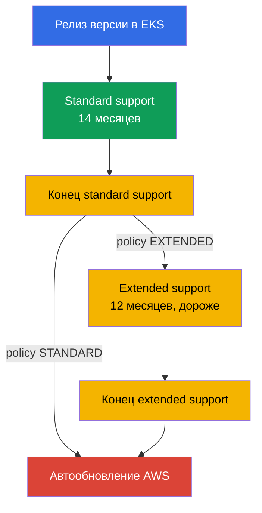
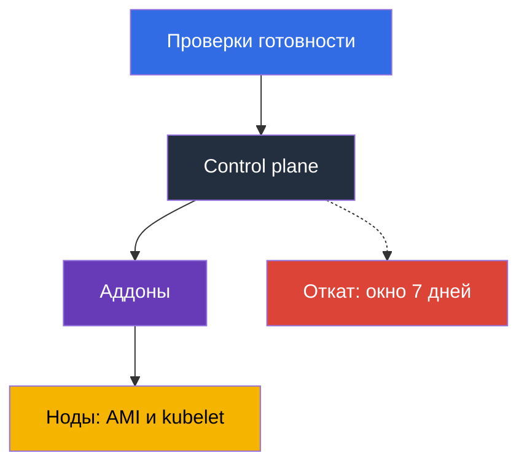

# Глава 3. Жизненный цикл версий: standard и extended support, стратегия обновлений

> **Что дальше.** Control plane обслуживает AWS, но версию Kubernetes выбираете вы, и у этого
> выбора есть срок годности: 14 месяцев стандартной поддержки и 12 месяцев продлённой, после
> чего кластер обновят без вашего участия. Глава про политику и планирование: сроки, тарифы,
> риски, подготовка и ритм команды. Механика обновления - в главе 38, откат - в главе 39,
> версии аддонов - в главе 37. Здесь решается, что и когда вы будете делать, а не чем.

## 3.1. Пять способов узнать про версии в худший момент

Все пять историй случаются с командами, у которых кластер работает хорошо: ничего не болит.

- **Кластер, которого никто не трогал год.** Версия отстала на два минора, а обновление
  возможно только по одной минорной версии за раз: не одно окно обслуживания, а два.
- **Счёт вырос, а нагрузка нет.** Версия ушла из стандартной поддержки, кластеры уехали в
  extended support, а он тарифицируется по повышенной почасовой ставке за кластер.
- **AWS обновил кластер сам.** Extended support тоже кончается: не в ваше окно, без вашего
  плана проверки и без возможности откатить результат.
- **Аддон не поехал.** Control plane обновился, а `vpc-cni` или CSI-драйвер остался на версии,
  которая для новой минорной версии не поддерживается, и симптомы приходят не сразу.
- **Деплой сломался после апгрейда.** В чарте остался `apiVersion`, удалённый в новой версии, а
  работающие объекты живы: проблему находят на следующем релизе, когда падает `helm upgrade`.

Общий знаменатель: версия Kubernetes - это не свойство кластера, а **процесс с календарём**.

## 3.2. Как устроен цикл: 14 плюс 12

Upstream выпускает минорные версии в среднем раз в четыре месяца, EKS следует его циклу релизов
и депрекейшенов. Дальше счётчик, специфичный для EKS: **standard support - первые 14 месяцев**
после появления версии в EKS (патчи, новые platform version, обычная ставка за кластер), затем
**extended support - следующие 12 месяцев**, где обновления безопасности продолжаются, но
кластер стоит дороже. Итого **26 месяцев**, после чего кластер обновляют автоматически.



Календарь с датами релиза и окончания обоих периодов есть в документации EKS и в API. Даты
хардкодить в runbook не стоит: они уточняются, а версии добавляются.

```bash
# Все версии в EKS с датами окончания поддержки
aws eks describe-cluster-versions \
  --query 'clusterVersions[].[clusterVersion,versionStatus,endOfStandardSupportDate,endOfExtendedSupportDate]' \
  --output table

# Только версии, которые уже в extended support
aws eks describe-cluster-versions --version-status extended-support
```

Создать кластер можно на любой поддерживаемой версии, но старт с версии в extended support
означает повышенную ставку с первого дня и меньше времени до апгрейда.

## 3.3. Upgrade policy: STANDARD или EXTENDED

Что произойдёт с кластером в конце стандартной поддержки, определяет поле upgrade policy со
значением `supportType`. Разница не в том, будет апгрейд, а в том, когда его сделает AWS.

| | `STANDARD` | `EXTENDED` |
|---|---|---|
| Что происходит в конце standard support | AWS автоматически обновляет кластер на следующую поддерживаемую версию | кластер переходит в extended support и остаётся на своей версии |
| Дополнительная плата | нет | да, повышенная почасовая ставка за кластер |
| Сколько ещё живёт версия | 0 месяцев | 12 месяцев |
| Что в конце этого периода | - | автоматическое обновление силами AWS |
| Можно ли переключить политику | да, пока версия в standard support | обратно нельзя, если кластер уже вошёл в extended support |
| Откат после автообновления | недоступен | недоступен по окончании extended support |

Три детали. **Extended support включён по умолчанию** для новых и существующих кластеров: вы
защищены от внезапного апгрейда, но не от роста счёта. **Выйти из extended support
переключением политики нельзя**, отключают его только пока версия в standard support.
**Включать `EXTENDED` надо заранее**: если автообновление началось, изменение политики может не
успеть подействовать.

```bash
# Текущая политика и версия кластера
aws eks describe-cluster --name demo \
  --query 'cluster.{version:version,platform:platformVersion,policy:upgradePolicy}'

# Отключить extended support: кластер будет автоматически обновлён в конце standard support
aws eks update-cluster-config --name demo --upgrade-policy supportType=STANDARD
```

Соблазн «нас обновят сами» формально рабочий: поставить `STANDARD` и не думать. Практически это
отказ от контроля над **временем** (апгрейд придёт не в ваше окно), **порядком** (control plane
обновится раньше проверки аддонов и манифестов) и **страховкой** (откат недоступен).

## 3.4. Цена отсрочки

Extended support - это не «поддержка получше», а счётчик. Почасовая плата за кластер в extended
support выше стандартной и умножается на число кластеров и на число часов. Считать так: взять
ставки за кластер-час для standard и extended support со страницы цен EKS, умножить разницу на
730 часов, потом на число кластеров и месяцев отсрочки, и сравнить с человеко-днями на
подготовку и апгрейд.

Подготовка делается один раз на парк, а плата за extended support капает за каждый кластер и
каждый час, поэтому арифметика обычно не в пользу отсрочки. Extended support разумно тратить на
обоснованные ситуации: заморозка перед релизом, несовместимость вендорского компонента, идущий
аудит; в каждой у отсрочки есть дата окончания и владелец. И держите `supportType` вместе с
версией в коде инфраструктуры (глава 4): переход в extended support виден в pull request, а не
в счёте.

## 3.5. Что именно ломается при смене минорной версии

Меняется набор API, поведение компонентов, иногда базовый образ ноды. Ниже то, что ломается на
практике, и способ проверить это заранее.

| Что ломается | Почему | Чем проверить заранее |
|---|---|---|
| Удалённые API-версии в манифестах и чартах | объект с удалённой `apiVersion` больше не принимается API-сервером; существующие объекты живы, а новый `apply` падает | инвентаризация манифестов и чартов, cluster insights, аудит-логи по deprecated API (глава 21) |
| Версии аддонов | `vpc-cni`, `coredns`, `kube-proxy`, CSI-драйверы совместимы не со всеми версиями кластера | `aws eks describe-addon-versions --kubernetes-version` (глава 37) |
| CRD и сторонние контроллеры | контроллер использует API, которого больше нет, или сам не заявляет поддержку новой версии | матрица совместимости каждого контроллера: ingress, autoscaler, service mesh, GitOps |
| Admission webhooks | новые встроенные типы и поля попадают под широкие правила webhook; недоступный webhook останавливает admission (глава 2) | прогон на dev-кластере, узкие правила, проверка таймаутов |
| Базовая AMI ноды | `1.32` - последняя версия, для которой EKS выпускает AMI на AL2; с `1.33` только AL2023 и Bottlerocket | проверить user data, bootstrap, пакеты и агенты на AL2023 (главы 10, 38) |
| Version skew kubelet | kubelet не должен отставать от API-сервера больше, чем позволяет upstream-политика skew | обновлять ноды в том же цикле, что и кластер, а не «когда-нибудь потом» |
| Поведение планировщика и defaults | изменения defaults и feature gates меняют раскладку подов и автоскейлинг | нагрузочный прогон на dev, сравнение метрик |

Строка про AMI стоит особняком: это единственный пункт, где вместе с версией Kubernetes
меняется операционная система нод. Переход с AL2 на AL2023 задевает user data (другой формат
bootstrap), набор пакетов, systemd-юниты, агенты наблюдаемости и всё, что доустанавливали
руками; два изменения в одном окне разумно разнести (раздел 3.7 и глава 38).

## 3.6. Подготовка: инвентаризация, insights, dev-прогон

Готовность к апгрейду - не ощущение, а набор проверок, каждая из которых даёт ответ да или нет.

**1. Инвентаризация API.** Всё, что создаёт объекты в кластере: манифесты, чарты, шаблоны CI,
операторы. Цель - найти `apiVersion`, которых в целевой версии не будет. Аудит-логи control
plane (глава 2) показывают реальные обращения к устаревшим API, а не только содержимое git.

```bash
# pluto: аудит удалённых и устаревших apiVersion в манифестах и чартах, код 2-3 при находках
pluto detect-files -d ./manifests --target-versions k8s=v1.34.0
helm template ./chart | pluto detect - --target-versions k8s=v1.34.0

# kubent (kube-no-trouble): проверка живого кластера и Helm-релизов, -e рушит CI при находках
kubent --target-version 1.34 --exit-error
```

pluto и kubent ставят в CI до `update-cluster-version`: сборка падает, пока в git или кластере
жив удалённый `apiVersion`, а исходные манифесты ловят то, что API-сервер молча конвертирует.

**2. Cluster insights.** EKS сам прогоняет по кластеру набор проверок и обновляет их примерно
раз в сутки, а также по запросу. `UPGRADE_READINESS` - проверки, влияющие на возможность
апгрейда, включая устаревшие API; `ROLLBACK_READINESS` показывает, сохраняется ли возможность
откатиться, и доступна 7 дней после обновления (глава 39).

```bash
# Проверки готовности к апгрейду и их статусы
aws eks list-insights --cluster-name demo --filter categories=UPGRADE_READINESS \
  --query 'insights[].[name,insightStatus.status,kubernetesVersion]' --output table

# Детали конкретной проверки: что найдено и что рекомендуется
aws eks describe-insight --cluster-name demo --id <insight-id>
```

**3. Матрица аддонов и контроллеров.** Список совместимых с целевой версией версий аддонов и
подтверждение поддержки от сторонних контроллеров.

```bash
# Какие версии аддона доступны для целевой версии кластера
aws eks describe-addon-versions --addon-name vpc-cni --kubernetes-version 1.34 \
  --query 'addons[].addonVersions[].addonVersion' --output text

# Какие API-группы живут в кластере и не отстал ли клиент от сервера
kubectl api-resources --sort-by=name -o wide | head -30
kubectl version
```

Перед сменой версии control plane каждый аддон и каждый CRD проходят один и тот же чек-лист:

- целевая версия аддона существует для новой версии кластера (`describe-addon-versions` выше);
- сторонний контроллер (ingress, autoscaler, mesh, GitOps) заявил поддержку целевой версии;
- CRD и его контроллер не используют `apiVersion`, удалённый в целевой версии (pluto, kubent).

Пункт не закрыт - control plane не трогают: он обновится раньше, чем аддон догонит.

**4. Прогон на dev-кластере**, похожем на прод: те же аддоны, контроллеры, чарты и webhooks.
Так находятся ошибки, которых нет ни в одном чеклисте; часть проблем видна только под
нагрузкой.

**5. Чеклист и решение.** Целевая версия, версии аддонов, что меняется в манифестах, владелец
окна, план проверки после апгрейда и условие отката. Без последних двух пунктов не начинают.

## 3.7. In-place или blue/green

Выбор делается один раз для парка и уточняется для отдельных кластеров (механика - глава 38).

| Критерий | In-place | Blue/green |
|---|---|---|
| Что происходит и чего стоит | тот же кластер поднимается на одну минорную версию: часы, одно окно, один кластер | рядом создаётся кластер новой версии и трафик переводится на него: дни или недели, двойные ресурсы |
| Прыжок через версию | невозможен, только по одной | возможен: новый кластер создаётся на нужной версии |
| Страховка | откат в течение 7 дней, на одну версию назад (глава 39) | переключение трафика назад на старый кластер |
| Когда выбирают | обычный шаг по версии, небольшой парк | смена базовой AMI, отставание на несколько версий, жёсткие требования к доступности |

Порядок действий внутри апгрейда одинаков: сначала control plane, потом аддоны, потом ноды.
Причина в политике version skew: kubelet может отставать от API-сервера, но не наоборот.



Откат честно: узкая страховка, а не план. Он возможен в течение 7 дней после апгрейда, только
на одну минорную версию назад и только если апгрейд был in-place; кластеры, обновлённые
автоматически по окончании extended support, не откатываются (глава 39). Обновление запускается
одной командой:

```bash
# Запуск обновления control plane на одну минорную версию (детали - глава 38)
aws eks update-cluster-version --name demo --kubernetes-version 1.34
aws eks describe-update --name demo --update-id <update-id> --query 'update.[status,type]'
```

## 3.8. Ритм, владелец и парк кластеров

Апгрейд, который делают «когда появится время», не делают никогда. Работает только ритм.

| Политика | Что означает | Плюсы и минусы |
|---|---|---|
| latest | обновляемся, как только версия появилась в EKS | максимум времени до конца поддержки, но вы первыми находите проблемы |
| N-1 | держим версию на одну ниже актуальной | багфиксы и отчёты сообщества уже есть, запас по срокам достаточный |
| N-2 и глубже | обновляемся редко, догоняем рывками | каждый апгрейд - несколько шагов, риск уехать в extended support |
| extended как норма | остаёмся на версии до последнего | предсказуемо для приложения, дорого и заканчивается автообновлением |

Практичный ориентир - **одна минорная версия за 4-6 месяцев** и политика N-1: при релизном
цикле upstream раз в четыре месяца такой ритм держит кластер внутри стандартной поддержки без
гонки за свежим релизом. Чтобы ритм существовал, нужен **владелец** (команда или роль, у
которой апгрейд версий в обязанностях), **даты в календаре** обратным отсчётом (за три месяца
подготовка, за два dev-прогон, за один прод), **мониторинг сроков** и **регулярное окно**.

Отдельная история - парк из десятка кластеров, у каждого своя версия и свой набор аддонов:
апгрейд превращается в десять разных проектов вместо одного. Держат парк в порядке четыре
привычки: **версия и `supportType` в коде**, один модуль на все кластеры (глава 4); **порядок
катки по окружениям** dev, stage, прод с паузой на наблюдение, потому что часть проблем
проявляется на второй-третий день; **аддоны и контроллеры одной версией на парк**, иначе
результат проверки нельзя переиспользовать (глава 37); **GitOps как инструмент видимости**,
чтобы отвечать на «где у нас что стоит» одним запросом к репозиторию (глава 44).

```bash
# Инвентарь версий и политик по кластерам региона: ищем забытые и отставшие
for c in $(aws eks list-clusters --query 'clusters[]' --output text); do
  aws eks describe-cluster --name "$c" --output text \
    --query 'cluster.[name,version,upgradePolicy.supportType]'; done
```

## 3.9. Как это применяют в продакшене

- **Календарь версий общий.** Даты конца standard support для всех кластеров парка лежат в
  календаре команды с обратным отсчётом, а не в чьей-то голове.
- **Политика осознанная.** Прод в `EXTENDED` как страховка от внезапного автообновления, но с
  планом уйти на новую версию до конца стандартной поддержки; dev в `STANDARD`, чтобы
  автообновление ловило проблемы раньше прода. Уход в extended support - исключение с датой,
  причиной и владельцем.
- **Подготовка автоматизирована.** Cluster insights смотрят регулярно, аудит устаревших API
  через pluto и kubent входит в CI, матрица версий аддонов обновляется перед циклом.
- **Апгрейд сначала на dev**, всегда в порядке control plane, аддоны, ноды, с условием отката
  до начала работ. **Смена базовой AMI планируется отдельно**, а отставший kubelet считается
  инцидентом эксплуатации.

## 3.10. Мини-глоссарий

- **Standard support** - первые 14 месяцев жизни минорной версии в EKS, обычная почасовая
  ставка за кластер. **Extended support** - следующие 12 месяцев, повышенная ставка; итого 26
  месяцев.
- **Upgrade policy** (`supportType`) - поле конфигурации кластера со значениями `STANDARD` и
  `EXTENDED`, определяющее поведение в конце стандартной поддержки. Extended support включён по
  умолчанию; выйти из него переключением политики нельзя, только апгрейдом.
- **Cluster insights** - автоматические проверки кластера от EKS; `UPGRADE_READINESS` про
  готовность к апгрейду, `ROLLBACK_READINESS` про возможность откатиться, доступна 7 дней.
- **Version skew** - допустимое upstream-политикой отставание kubelet от API-сервера; причина
  порядка «сначала control plane, потом ноды». **In-place upgrade** - обновление того же
  кластера на одну минорную версию, **blue/green** - создание кластера новой версии рядом
  (глава 38), **rollback** - возврат версии в течение 7 дней после in-place апгрейда (глава
  39).

## 3.11. Итоги главы

- 14 месяцев standard support плюс 12 месяцев extended support, итого 26 на минорную версию;
  даты берут из `aws eks describe-cluster-versions`. Обновление только на одну версию за раз,
  поэтому отставание на два минора означает два окна.
- Upgrade policy `STANDARD` означает автообновление силами AWS в конце стандартной поддержки,
  `EXTENDED` - переход в extended support по повышенной ставке. Extended support включён по
  умолчанию, выйти из него переключением политики нельзя, только апгрейдом.
- По окончании extended support кластер обновляется автоматически, и такой кластер откатить
  нельзя. Расчёт на «нас обновят сами» отдаёт время, порядок и страховку.
- Ломаются удалённые и устаревшие API в манифестах и чартах, версии аддонов, контроллеры и CRD,
  webhooks, а с `1.33` ещё и базовая AMI: `1.32` - последняя версия с AMI на AL2.
- Подготовка - это инвентаризация API, cluster insights, матрица версий аддонов и прогон на
  dev. Порядок работ: control plane, аддоны, ноды. Откат узкий: 7 дней, одна версия, in-place.
- Ритм важнее скорости: политика N-1, одна версия за 4-6 месяцев, владелец, даты в календаре и
  версия кластера в коде для всего парка.

## 3.12. Как это пригодится в реальной работе

Вопрос «когда мы обновляемся» становится арифметикой: дата конца стандартной поддержки минус
три месяца и есть срок начала работ. Разговор про деньги тоже предметный - доплата за extended
support считается за месяц на кластер и сравнивается со стоимостью подготовки, которая делается
один раз на парк. И апгрейд перестаёт быть авралом: когда инвентаризация API в CI, cluster
insights на дашборде, а порядок работ в runbook, каждое следующее обновление стоит дешевле
предыдущего. А кластер, который обновили за вас, чинить всё равно вам.

## 3.13. Вопросы для самопроверки

1. Сколько месяцев живёт минорная версия в EKS и из чего складывается это число?
2. Чем отличаются `STANDARD` и `EXTENDED` и что происходит в конце каждого периода?
3. Какое значение upgrade policy стоит по умолчанию и почему это важно для счёта?
4. Кластер уже в extended support. Как перестать платить повышенную ставку?
5. Почему отставание на две минорные версии дороже, чем на одну, и не в два раза?
6. Как посчитать, что дешевле: extended support на полгода или апгрейд силами команды?
7. Что будет с кластером, который не тронули до конца extended support, и откатят ли это?
8. Какие категории проверок дают cluster insights и для чего нужна `ROLLBACK_READINESS`?
9. Чем опасен апгрейд с `1.32` на `1.33` помимо смены версии Kubernetes?
10. Почему сначала обновляют control plane, а потом ноды, а не наоборот?
11. В каких случаях вы выберете blue/green вместо in-place?
12. В парке двенадцать кластеров с разными версиями. С чего начнёте приведение в порядок?

## Практика

Лабы у главы нет, но всё её содержание читается на живом кластере. Начните с календаря: `aws
eks describe-cluster-versions` покажет версии, их статус и даты окончания поддержки - выпишите
даты для версии своего кластера. Дальше `aws eks describe-cluster` с полями `version`,
`platformVersion` и `upgradePolicy`. Готовность проверьте через `aws eks list-insights
--cluster-name <cluster> --filter categories=UPGRADE_READINESS`, а по находкам - `aws eks
describe-insight`. Совместимость аддонов - `aws eks describe-addon-versions --addon-name
coredns --kubernetes-version <next>`. Со стороны Kubernetes полезны `kubectl version` и
`kubectl api-resources -o wide`. Механику обновления разбирает глава 38, откат - глава 39.

---
[Оглавление](../README_RU.md) · [Глава 2](../02/ru.md) · [Глава 4](../04/ru.md)
