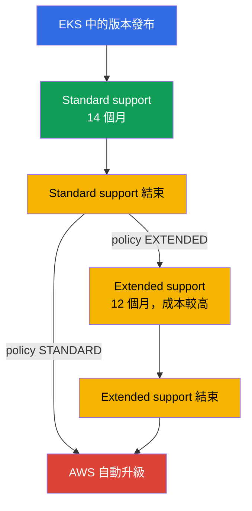
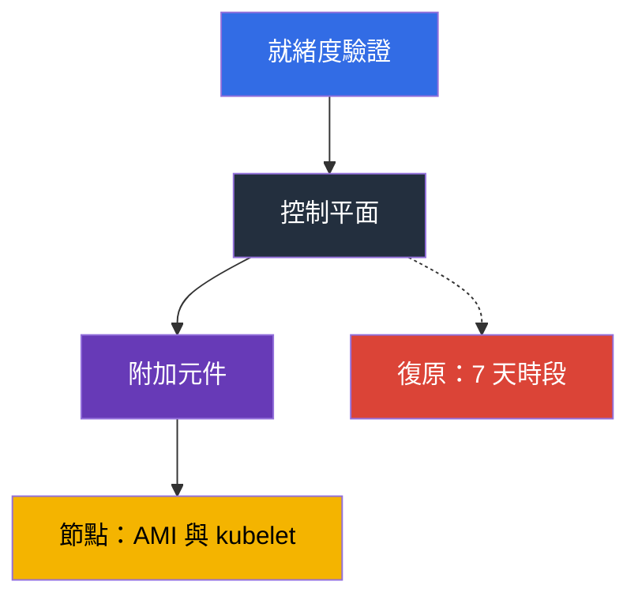

[Русская версия](ru.md) · [Eng version](en.md) · [Versión en español](es.md) · [Version française](fr.md) · [Deutsche Version](de.md) · [ქართული ვერსია](ge.md) · [日本語版](jp.md)
# 第 3 章. 版本生命週期：standard 與 extended support、升級策略

> **接下來。** AWS 維運 control plane，但 Kubernetes version 由你選擇，而這個選擇有到期日：14 個月的 standard support 與 12 個月的 extended support，之後 cluster 會在你未參與的情況下升級。本章討論 policy 與規劃：時程、費率、風險、準備工作及團隊節奏。升級機制見第 38 章，rollback 見第 39 章，add-on versions 見第 37 章。這裡決定的是你將做什麼、何時做，而不是如何做。

## 3.1. 在最糟時刻得知版本問題的五種方式

以下五種情況都發生在 cluster 運作良好的團隊：看似沒有任何問題。

- **一年都沒人碰過的 cluster。** 版本落後兩個 minor versions，但升級一次只能跨一個 minor version：不是一個 maintenance window，而是兩個。
- **帳單變高，負載卻沒有增加。** 版本離開 standard support，clusters 進入 extended support，並按每個 cluster 較高的 hourly rate 計費。
- **AWS 自行升級了 cluster。** Extended support 也會結束：不在你的 window 內、沒有你的驗證計畫，也無法 rollback 結果。
- **Add-on 無法運作。** Control plane 已升級，但 `vpc-cni` 或 CSI driver 仍停留在新 minor version 不支援的版本，症狀不會立刻出現。
- **升級後 deployment 壞了。** Chart 中仍有新版本已移除的 `apiVersion`，而既有 objects 仍存在：下次 release 時 `helm upgrade` 失敗才發現問題。

共同點是：Kubernetes version 不是 cluster 的屬性，而是**有行事曆的流程**。

## 3.2. 生命週期如何運作：14 加 12

Upstream 平均每四個月發布 minor versions，EKS 遵循其 release 與 deprecation cycle。接著是 EKS 專屬的計時：版本出現在 EKS 後的**前 14 個月為 standard support**（patches、new platform versions、一般 per-cluster rate），然後是**接下來 12 個月的 extended support**，期間 security updates 持續提供，但 cluster 成本更高。合計為 **26 個月**，之後 cluster 會自動升級。



包含 release dates 與兩個期間結束日期的行事曆可在 EKS documentation 與 API 中取得。不要在 runbook 中 hardcode 日期：日期會調整，也會新增 versions。

```bash
# 含 support 結束日期的所有 EKS versions
aws eks describe-cluster-versions \
  --query 'clusterVersions[].[clusterVersion,versionStatus,endOfStandardSupportDate,endOfExtendedSupportDate]' \
  --output table

# 僅已進入 extended support 的 versions
aws eks describe-cluster-versions --version-status extended-support
```

可在任何支援中的 version 建立 cluster，但若一開始就選擇 extended support 中的 version，從第一天起便是較高費率，且距離升級的時間較短。

## 3.3. Upgrade policy：STANDARD 或 EXTENDED

Cluster 在 standard support 結束時會發生什麼，由 upgrade policy 中值為 `supportType` 的欄位決定。差異不在於是否升級，而在於 AWS 何時執行升級。

| | `STANDARD` | `EXTENDED` |
|---|---|---|
| Standard support 結束時會發生什麼 | AWS 自動將 cluster 升級至下一個支援的 version | cluster 進入 extended support，並維持目前 version |
| 額外費用 | 無 | 有，每個 cluster 採較高 hourly rate |
| Version 還能存續多久 | 0 個月 | 12 個月 |
| 該期間結束時會發生什麼 | - | AWS 執行自動升級 |
| 能否切換 policy | 可以，version 處於 standard support 時 | cluster 已進入 extended support 後無法切回 |
| 自動升級後的 rollback | 不可用 | extended support 結束時不可用 |

有三個細節。**Extended support 預設為新舊 clusters 啟用**：它保護你免於突然升級，但無法防止帳單上升。**無法透過切換 policy 離開 extended support**：只有 version 尚在 standard support 時才能停用。**應預先啟用 `EXTENDED`**：若自動升級已開始，policy 變更可能來不及生效。

```bash
# 目前的 cluster policy 與 version
aws eks describe-cluster --name demo \
  --query 'cluster.{version:version,platform:platformVersion,policy:upgradePolicy}'

# 停用 extended support：cluster 會在 standard support 結束時自動升級
aws eks update-cluster-config --name demo --upgrade-policy supportType=STANDARD
```

「AWS 會自行替我們升級」的誘惑在形式上可行：設定 `STANDARD` 後便不再思考。實際上，這放棄了對**時間**的控制（升級不會在你的 window 內發生）、對**順序**的控制（control plane 在驗證 add-ons 與 manifests 前升級），以及**保險**（rollback 不可用）。


## 3.4. 延後的成本

Extended support 不是「更好的 support」，而是計時器。Extended support 的 per-cluster hourly charge 高於 standard rate，並會乘上 clusters 數量與小時數。計算方式如下：從 EKS pricing page 取得 standard 與 extended support 的 per-cluster-hour rates，將差額乘以 730 小時，再乘以 clusters 數量與延後的月數，並與準備及升級所需的 person-days 比較。

準備工作對整個 fleet 只做一次，而 extended support charge 會對每個 cluster、每個小時持續累積，因此算術通常不支持延後。Extended support 適合有正當理由的情況：release 前的 freeze、vendor component 不相容、進行中的 audit；每種情況中，延後都應有結束日期與 owner。將 `supportType` 與 version 一併放在 infrastructure code 中（第 4 章）：進入 extended support 會出現在 pull request，而非帳單上。

## 3.5. Minor version 變更時究竟哪些項目會壞掉

API 集合、component behavior，有時還有 node base image 都會改變。以下是實務上會壞掉的項目及事先檢查方式。

| 會壞掉的項目 | 原因 | 如何事先檢查 |
|---|---|---|
| Manifests 與 charts 中已移除的 API versions | 使用已移除 `apiVersion` 的 object 不再被 API server 接受；既有 objects 仍存活，但新的 `apply` 會失敗 | inventory manifests 與 charts、cluster insights、deprecated APIs 的 audit logs（第 21 章） |
| Add-on versions | `vpc-cni`、`coredns`、`kube-proxy` 及 CSI drivers 並非與所有 cluster versions 相容 | `aws eks describe-addon-versions --kubernetes-version`（第 37 章） |
| CRDs 與 third-party controllers | Controller 使用了不再存在的 API，或本身未宣告支援新 version | 每個 controller 的 compatibility matrix：ingress、autoscaler、service mesh、GitOps |
| Admission webhooks | 新的 built-in types 與欄位會符合寬鬆的 webhook rules；不可用的 webhook 會停止 admission（第 2 章） | 在 dev cluster 上執行、使用狹窄 rules、檢查 timeouts |
| Node base AMI | `1.32` 是 EKS 發布 AL2 AMIs 的最後一個 version；自 `1.33` 起僅有 AL2023 與 Bottlerocket | 在 AL2023 上檢查 user data、bootstrap、packages 與 agents（第 10、38 章） |
| Kubelet version skew | kubelet 不得比 API server 落後超過 upstream skew policy 所允許的程度 | 在與 cluster 相同的 cycle 中升級 nodes，而不是「之後有空再說」 |
| Scheduler behavior 與 defaults | Defaults 與 feature gates 的變更會改變 Pod placement 與 autoscaling | 在 dev 執行 load test 並比較 metrics |

AMI 一列不同於其他項目：它是唯一會與 Kubernetes version 一起改變 node operating system 的項目。從 AL2 過渡至 AL2023 會影響 user data（不同的 bootstrap format）、package set、systemd units、observability agents 及所有手動安裝的內容；將兩項變更拆分到不同 windows 是明智做法（第 3.7 節與第 38 章）。

## 3.6. 準備工作：inventory、insights、dev run

升級就緒度不是感覺，而是一組 checks，每一項都能得出是或否的答案。

**1. API inventory。** 所有會在 cluster 中建立 objects 的內容：manifests、charts、CI templates、operators。目標是找出 target version 中不存在的 `apiVersion`。Control plane audit logs（第 2 章）會顯示實際對 obsolete APIs 的 calls，而不只是 git 內容。

```bash
# pluto：稽核 manifests 與 charts 中已移除及 deprecated 的 apiVersions；有 findings 時以 code 2-3 結束
pluto detect-files -d ./manifests --target-versions k8s=v1.34.0
helm template ./chart | pluto detect - --target-versions k8s=v1.34.0

# kubent (kube-no-trouble)：檢查 live cluster 與 Helm releases；有 findings 時 -e 使 CI 失敗
kubent --target-version 1.34 --exit-error
```

在 `update-cluster-version` 前將 pluto 與 kubent 放入 CI：只要 git 或 cluster 中仍有已移除的 `apiVersion`，build 就會失敗，而 source manifests 能找出 API server 靜默轉換的內容。

**2. Cluster insights。** EKS 本身會在 cluster 上執行一組 checks，約每日更新一次，也能依請求更新。`UPGRADE_READINESS` 涵蓋影響升級資格的 checks，包括 deprecated APIs；`ROLLBACK_READINESS` 顯示 rollback 是否仍可行，並在更新後 7 天可用（第 39 章）。

```bash
# 升級就緒 checks 及其 statuses
aws eks list-insights --cluster-name demo --filter categories=UPGRADE_READINESS \
  --query 'insights[].[name,insightStatus.status,kubernetesVersion]' --output table

# 特定 check 的詳細資料：找到什麼及建議內容
aws eks describe-insight --cluster-name demo --id <insight-id>
```

**3. Add-on 與 controller matrix。** 列出與 target version 相容的 add-on versions，並取得 third-party controllers 的支援確認。

```bash
# Target cluster version 可用的 add-on versions
aws eks describe-addon-versions --addon-name vpc-cni --kubernetes-version 1.34 \
  --query 'addons[].addonVersions[].addonVersion' --output text

# Cluster 中有哪些 API groups，以及 client 是否落後 server
kubectl api-resources --sort-by=name -o wide | head -30
kubectl version
```

變更 control plane version 前，每個 add-on 與 CRD 都要通過相同 checklist：

- 新 cluster version 有目標 add-on version（上方的 `describe-addon-versions`）；
- Third-party controller（ingress、autoscaler、mesh、GitOps）宣告支援 target version；
- CRD 及其 controller 不使用 target version 已移除的 `apiVersion`（pluto、kubent）。

若有項目未完成，就不要碰 control plane：它會在 add-on 跟上前先升級。

**4. 在 dev cluster 執行測試**，該 cluster 應接近 production：相同的 add-ons、controllers、charts 與 webhooks。這能找出任何 checklist 中都沒有的 errors；某些問題只有在 load 下才看得見。

**5. Checklist 與決策。** Target version、add-on versions、manifests 的變更、window owner、升級後驗證計畫及 rollback condition。沒有最後兩項就不要開始。

## 3.7. In-place 或 blue/green

為 fleet 選擇一次，並針對個別 clusters 細化此決定（機制見第 38 章）。

| 準則 | 原地升級 | 藍綠部署 |
|---|---|---|
| 會發生什麼及其成本 | 同一個 cluster 提升一個 minor version：數小時、一個 window、一個 cluster | 在旁建立新 version cluster 並將 traffic 切換至它：數天或數週、雙倍 resources |
| 跳過 version | 不可能，只能一次一個 | 可以：新 cluster 建立在所需 version |
| 保險 | 7 天內 rollback 一個 version（第 39 章） | 將 traffic 切回舊 cluster |
| 何時選擇 | 例行 version step、小型 fleet | Base AMI 變更、落後數個 versions、嚴格 availability requirements |

升級內的順序相同：先 control plane，然後 add-ons，最後 nodes。原因是 version-skew policy：kubelet 可以落後 API server，但反過來不行。



坦白看待 rollback：它是狹窄的保險，而非計畫。它只在升級後 7 天內可用、只能退回一個 minor version，且僅限 in-place upgrade；在 extended support 結束時自動升級的 clusters 無法 rollback（第 39 章）。更新以一個 command 啟動：

```bash
# 啟動 control plane 一個 minor version 的更新（細節見第 38 章）
aws eks update-cluster-version --name demo --kubernetes-version 1.34
aws eks describe-update --name demo --update-id <update-id> --query 'update.[status,type]'
```


## 3.8. 節奏、owner 與 cluster fleet

「有時間再做」的升級永遠不會完成。只有節奏有效。

| 政策 | 意義 | 優缺點 |
|---|---|---|
| 最新版本 | EKS 一出現版本就升級 | 距離支援結束的時間最長，但你最先發現問題 |
| N-1 | 維持比 current 低一個 version | 已有 bug fixes 與 community reports，時間餘裕足夠 |
| N-2 及更深 | 很少升級，集中追趕 | 每次升級需要多個步驟，可能進入 extended support |
| extended 作為常態 | 版本維持到最後 | 對 application 可預期、昂貴，且最終仍是自動升級 |

實用的基準是**每 4 至 6 個月一個 minor version**與 N-1 policy：依 upstream 每四個月的 release cycle，這個節奏使 cluster 保持在 standard support 內，而不必追逐剛發布的 release。要讓節奏存在，必須有**owner**（負責 version upgrades 的 team 或 role）、倒數計算的**行事曆日期**（三個月前準備、兩個月前 dev run、一個月前 production）、**期限監控**與**固定 window**。

另一種情況是有十幾個 clusters 的 fleet，每個都有自己的 version 與 add-on set：升級會變成十個不同的 projects，而非一個。四種習慣能讓 fleet 維持整齊：**將 version 與 `supportType` 放在 code 中**，所有 clusters 使用一個 module（第 4 章）；**依 environments 的 rollout order**，dev、stage、production，中間暫停觀察，因為部分問題在第二或第三天才出現；**整個 fleet 的 add-ons 與 controllers 採相同 version**，否則無法重用驗證結果（第 37 章）；**以 GitOps 作為 visibility tool**，讓「哪裡運行什麼」可透過一次 repository query 回答（第 44 章）。

```bash
# Region 中 clusters 的 versions 與 policies inventory：找出被遺忘及落後的 clusters
for c in $(aws eks list-clusters --query 'clusters[]' --output text); do
  aws eks describe-cluster --name "$c" --output text \
    --query 'cluster.[name,version,upgradePolicy.supportType]'; done
```

## 3.9. 如何在 production 中套用

- **共用 version 行事曆。** Fleet 內所有 clusters 的 standard support 結束日期都放在含倒數計時的 team calendar，而非某個人的腦中。
- **Policy 是有意識的選擇。** Production 使用 `EXTENDED` 作為避免突然自動升級的保險，但計畫在 standard support 結束前轉至新 version；dev 使用 `STANDARD`，使自動升級在 production 前先發現問題。進入 extended support 是有日期、原因及 owner 的例外情況。
- **準備工作自動化。** 定期檢查 cluster insights，透過 pluto 與 kubent 的 deprecated-API audit 納入 CI，並在 cycle 前更新 add-on version matrix。
- **先升級 dev**，一律依 control plane、add-ons、nodes 的順序，並在開始前設定 rollback condition。**Base AMI 變更應另行規劃**，落後的 kubelet 應視為 operations incident。

## 3.10. 迷你詞彙表

- **Standard support** 是 EKS 中 minor version 生命週期的前 14 個月，採一般 per-cluster hourly rate。**Extended support** 是接下來 12 個月，採較高 rate；合計 26 個月。
- **Upgrade policy**（`supportType`）是 cluster configuration field，值為 `STANDARD` 與 `EXTENDED`，決定 standard support 結束時的行為。Extended support 預設啟用；無法靠切換 policy 離開，只能透過升級離開。
- **Cluster insights** 是 EKS 自動 cluster checks；`UPGRADE_READINESS` 關於 upgrade readiness，`ROLLBACK_READINESS` 關於 rollback eligibility，且可用 7 天。
- **Version skew** 是 upstream policy 允許的 kubelet 相對 API server 落後程度，是「先 control plane，後 nodes」順序的原因。**In-place upgrade** 是將同一個 cluster 升級一個 minor version；**blue/green** 是在旁建立 new-version cluster（第 38 章）；**rollback** 是在 in-place 升級後 7 天內還原 version（第 39 章）。

## 3.11. 本章小結

- 14 個月 standard support 加 12 個月 extended support，每個 minor version 合計 26 個月；日期取自 `aws eks describe-cluster-versions`。升級一次只能跨一個 version，因此落後兩個 minor versions 代表兩個 windows。
- Upgrade policy 為 `STANDARD` 表示 standard support 結束時 AWS 自動升級；`EXTENDED` 表示以較高 rate 進入 extended support。Extended support 預設啟用，無法透過切換 policy 離開，只能升級。
- Extended support 結束時 cluster 會自動升級，且此類 cluster 無法 rollback。依賴「AWS 會自行替我們升級」會放棄時間、順序與保險。
- 會壞掉的包括 manifests 與 charts 中已移除和 deprecated 的 APIs、add-on versions、controllers 與 CRDs、webhooks，以及自 `1.33` 起的 base AMI：`1.32` 是最後一個使用 AL2 AMIs 的 version。
- 準備工作是 API inventory、cluster insights、add-on version matrix 及 dev run。工作順序為 control plane、add-ons、nodes。Rollback 很受限：7 天、一個 version、in-place。
- 節奏比速度重要：N-1 policy、每 4 至 6 個月一個 version、owner、行事曆日期，以及整個 fleet 的 cluster version 都在 code 中。

## 3.12. 這如何幫助實際工作

「我們何時升級」這個問題會成為算術：standard support 結束日期減三個月，就是開始工作的日期。關於成本的對話也變得具體：extended support surcharge 按每個 cluster、每個月計算，並與只對 fleet 執行一次的準備成本比較。升級不再是救火：當 API inventory 在 CI、cluster insights 在 dashboard、工作順序在 runbook 中時，每次後續更新都比前一次成本低。而被替你升級的 cluster，仍然要由你修復。

## 3.13. 自我檢查問題

1. EKS minor version 可存續幾個月，這個數字由哪些部分組成？
2. `STANDARD` 與 `EXTENDED` 有何差異，各期間結束時會發生什麼？
3. 哪個 upgrade-policy value 是預設值，為何這對帳單很重要？
4. Cluster 已處於 extended support。如何停止支付較高 rate？
5. 為什麼落後兩個 minor versions 比落後一個更昂貴，而且不只是兩倍？
6. 如何計算半年 extended support 與由 team 升級，哪一個成本較低？
7. 一個 cluster 一直到 extended support 結束都未處理，會發生什麼，能否 rollback？
8. Cluster insights 提供哪些 categories 的 checks，`ROLLBACK_READINESS` 有何用途？
9. 除 Kubernetes version 變更外，為什麼從 `1.32` 升級至 `1.33` 很危險？
10. 為什麼先升級 control plane，然後才是 nodes，而非反過來？
11. 哪些情況下應選擇 blue/green 而非 in-place？
12. 一個 fleet 有十二個不同 versions 的 clusters。你會從哪裡開始將它們整理好？

## 實作

本章沒有 lab，但所有內容都能在 live cluster 上讀取。從行事曆開始：`aws eks describe-cluster-versions` 會顯示 versions、其 status 及 support 結束日期，請記下 cluster version 的日期。接著使用包含 `version`、`platformVersion` 及 `upgradePolicy` fields 的 `aws eks describe-cluster`。透過 `aws eks list-insights --cluster-name <cluster> --filter categories=UPGRADE_READINESS` 檢查 readiness，並針對 findings 使用 `aws eks describe-insight`。使用 `aws eks describe-addon-versions --addon-name coredns --kubernetes-version <next>` 檢查 add-on compatibility。Kubernetes 方面，`kubectl version` 與 `kubectl api-resources -o wide` 很有用。第 38 章說明升級機制，第 39 章說明 rollback。

---
[目錄](../README_TW.md) · [第 2 章](../02/tw.md) · [第 4 章](../04/tw.md)