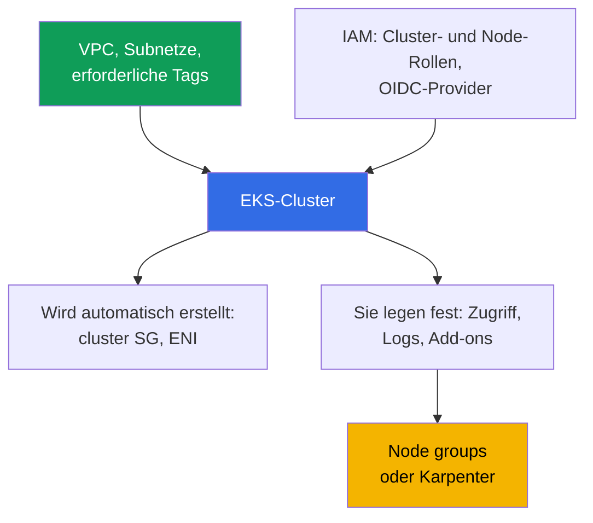
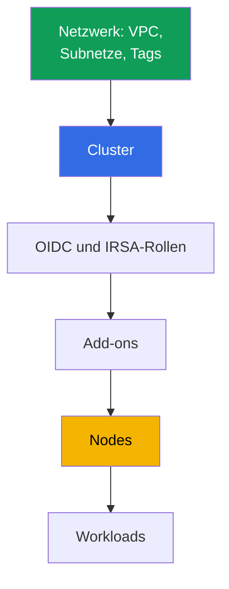

[Русская версия](ru.md) · [Eng version](en.md) · [Versión en español](es.md) · [Version française](fr.md) · [ქართული ვერსია](ge.md) · [繁體中文版](tw.md) · [日本語版](jp.md)
# Kapitel 4. Einen Cluster erstellen: eksctl, Terraform und Terragrunt, CloudFormation

> **Was kommt als Nächstes.** Ein Cluster wird einmal erstellt, aber das Team lebt jahrelang damit. Die Werkzeugwahl entscheidet daher darüber, wer den Infrastrukturzustand besitzt und ob Produktion in einem anderen Account wiederholbar ist. Dieses Kapitel behandelt die Bestandteile eines Clusters (20-30 Ressourcen, nicht nur ein API-Aufruf), den Vergleich von eksctl, CloudFormation, Terraform und Terragrunt, die Erstellungsreihenfolge sowie Parameter, die später nicht mehr geändert werden können. Zugriff folgt in Kapitel 5, Netzwerk in den Kapiteln 6 und 7, Nodes in den Kapiteln 9-12 und Add-ons in Kapitel 37.

## 4.1. Der Cluster, der nicht wiederholbar ist

Der Cluster wurde manuell in der Konsole zusammengestellt, er läuft, Anwendungen werden ausgeliefert. Das Problem beginnt nicht bei einem Ausfall, sondern bei einer gewöhnlichen Bitte: „Erstellt denselben Cluster in einem neuen Account für die zweite Region.“

- **Nicht wiederholbar.** Niemand erinnert sich an die Auswahlfelder im Assistenten: Authentifizierungsmodus, CIDR des öffentlichen Endpoint, Log-Satz, benutzerdefinierter Service-CIDR. Der zweite Cluster wird anders ausfallen.
- **Nicht übergebbar.** An den Subnetzen hängt das Tag `kubernetes.io/role/internal-elb`, und auf die Frage „wofür“ gibt es keine Antwort: Es wurde gesetzt, weil der Load Balancer nicht erstellt wurde.
- **Der Besitzer hat gekündigt.** Der Cluster wurde mit der persönlichen Rolle eines Engineers erstellt, und diese Rolle erhielt bei der Erstellung Administratorrechte im Cluster (Kapitel 5). Der Engineer ist nicht mehr im Unternehmen.
- **Produktion und dev sind auseinander gelaufen.** In dev ist der öffentliche Endpoint für die ganze Welt geöffnet, in Produktion geschlossen; Audit-Logs sind nur in Produktion aktiviert. Niemand kann die Unterschiede aufzählen, und ein Test in dev beweist nichts.
- **Nicht löschbar.** Terraform-Code existiert, aber es ist unklar, was er erstellt hat und was manuell nachbearbeitet wurde. `destroy` löscht die Hälfte und lässt Waisen zurück: ENI, security group, Rollen, Load Balancer mit DNS.

Der gemeinsame Nenner: Der Cluster existiert, aber **keine Beschreibung des Clusters existiert**.

## 4.2. „Cluster erstellen“ bedeutet 20-30 Ressourcen

Ein Aufruf von `CreateCluster` erstellt die control plane. Ein lauffähiger Cluster benötigt deutlich mehr, und fast alles davon existiert außerhalb des cluster-Objekts.



**Netzwerk.** VPC, mindestens zwei Subnetze in unterschiedlichen Availability Zones, Routen, NAT. Hinzu kommen Tags, ohne die einige Funktionen stillschweigend nicht arbeiten: `kubernetes.io/role/elb` auf öffentlichen Subnetzen, `kubernetes.io/role/internal-elb` auf privaten, `karpenter.sh/discovery` mit dem Clusternamen als Wert für Karpenter (Kapitel 6, 12). **IAM.** Die Clusterrolle, die Rolle für Nodes und der mit dem issuer verknüpfte IAM OIDC-provider: Ohne ihn gibt es kein IRSA und Controller mit API-Zugriff funktionieren nicht.

**Wird automatisch erstellt:** cross-account ENI in den angegebenen Subnetzen (typischerweise 2-4) und eine cluster security group wie `eks-cluster-sg-<cluster>-<id>` (Kapitel 2). Sie befinden sich nicht in Ihrem Code, aber im Account und überleben ein unsauberes `destroy`. **Bei der Erstellung festgelegt:** `authenticationMode` (`API`, `API_AND_CONFIG_MAP` oder `CONFIG_MAP`), access entries und die Rechte des Erstellers (Kapitel 5), Kubernetes-Version und `supportType` (`STANDARD` oder `EXTENDED`, Kapitel 3), Endpoint und `publicAccessCidrs`, control plane-Logs, Add-ons, Nodes und Standard-StorageClass.

Dasselbe Minimum in Terraform-Begriffen, wenn rohe Ressourcen ohne Modul verwendet werden. Genau darauf kann die control plane nicht verzichten, sonst wird sie entweder nicht erstellt oder startet keinen einzigen Pod.

| Was | Terraform resource | Warum erforderlich |
|---|---|---|
| Control plane | `aws_eks_cluster` | der Cluster selbst: Version, Rolle, `vpc_config`, `kubernetes_network_config`, endpoint access, Logs |
| Clusterrolle | `aws_iam_role` + `aws_iam_role_policy_attachment` (`AmazonEKSClusterPolicy`) | ohne sie verwaltet EKS keine Ressourcen im Account |
| Node-Rolle | `aws_iam_role` + `aws_iam_role_policy_attachment` (`AmazonEKSWorkerNodePolicy`, `AmazonEKS_CNI_Policy`, `AmazonEC2ContainerRegistryReadOnly`) | die Node registriert sich nicht und kann keine Images ziehen |
| OIDC für IRSA | `aws_iam_openid_connect_provider` (+ `data.tls_certificate`) | ohne ihn gibt es kein IRSA und keine Controller mit API-Zugriff |
| Netzwerk | `aws_vpc`, `aws_subnet` (oder `data`-Quellen), Tags `kubernetes.io/role/*`, `aws_security_group` | Subnetze in zwei Zonen und SG werden benötigt |
| Compute | `aws_eks_node_group` oder `aws_eks_fargate_profile` | andernfalls können Pods nirgends laufen; in den Labs Systemdienste auf Fargate plus Karpenter |
| Add-ons | `aws_eks_addon` (`vpc-cni`, `coredns`, `kube-proxy`, `eks-pod-identity-agent`) | Pod-Netzwerk, DNS, kube-proxy, pod identity |
| Zugriff | `aws_eks_access_entry`, `aws_eks_access_policy_association` (oder das veraltete `aws-auth`) | sonst kann außer dem Ersteller niemand in den Cluster (Kapitel 5) |

Das manuell zu schreiben ist möglich, aber teuer und fragil: Ein Subnetz-Tag, eine Policy für die Node-Rolle oder die OIDC-Verknüpfung mit einer Rolle wird leicht vergessen, und die fehlende Verknüpfung zeigt sich nicht bei `apply`, sondern später durch einen abgewiesenen Pod. Sonderfall: Ohne Nodes können Pods nirgends laufen, und ohne `AmazonEKS_CNI_Policy` an der Node-Rolle erhält die Node keine IP und wird nicht `Ready` (Kapitel 45). Deshalb werden diese Ressourcen selten einzeln geschrieben, sondern ein fertiges Modul wird verwendet (Abschnitt 4.7).

## 4.3. Womit Cluster erstellt werden: ein ehrlicher Vergleich

| Werkzeug | Reproduzierbarkeit | Review | Drift | Startgeschwindigkeit | Wer den Zustand besitzt |
|---|---|---|---|---|---|
| AWS-Konsole | nein | nichts zu prüfen | nicht nachverfolgt | Minuten | niemand |
| eksctl | teilweise, über yaml-Konfiguration | Konfiguration in git | eigene CloudFormation-Stacks außerhalb Ihres IaC | am höchsten | von eksctl erstelltes CloudFormation |
| CloudFormation | ja | Template in git | drift detection pro Stack | mittel | CloudFormation-Service |
| Terraform | ja | `plan` im pull request | sichtbar in `plan` | mittel | Ihr state in S3 |
| Terragrunt | ja, zusätzlich DRY für Umgebungen | dasselbe, `run-all plan` | dasselbe, nach Stacks | mittel | derselbe state, auf Stacks verteilt |
| CDK, Pulumi | ja | Code in einer Programmiersprache | über CloudFormation oder eigenen state | mittel | CloudFormation (CDK) oder Pulumi-Backend |
| Crossplane, ACK | ja, deklarativ im Cluster | Manifeste in git | Controller reconciliert kontinuierlich | niedrige Startgeschwindigkeit | Kubernetes-management-Cluster |

**Die Konsole** bleibt das beste Werkzeug zum Lesen, taugt jedoch nicht zum Erstellen von Produktion: Das Ergebnis ist nicht beschrieben. **CDK und Pulumi** sind Infrastruktur in TypeScript, Python oder Go: Der Vorteil sind normale Abstraktionen und Typen, der Nachteil ist, dass man leicht imperative Logik erhält, wo ein vorhersehbarer diff nötig ist. **Crossplane und ACK** beschreiben AWS-Ressourcen als Kubernetes-Objekte und führen sie kontinuierlich zum beschriebenen Zustand zurück, was Drift löst, aber die Abhängigkeit „ein Cluster verwaltet einen Cluster“ sowie die Frage hinzufügt, wer den management-Cluster erstellt (typischerweise Terraform).

## 4.4. eksctl: hervorragende Erkundung, schlechter Besitzer von Produktion

eksctl erstellt einen Cluster mit einem Befehl, und darin liegt sein eigentlicher Wert.

```bash
# Cluster ohne Nodes: control plane, VPC, Rollen, kubeconfig in einem Aufruf
eksctl create cluster --name demo --region eu-central-1 --version 1.34 --without-nodegroup
eksctl get cluster --region eu-central-1      # welche Cluster es überhaupt in der Region gibt
eksctl utils describe-stacks --cluster demo   # CloudFormation-Stacks, die es besitzt
```

**Eigener Zustand.** eksctl speichert den Zustand in CloudFormation-Stacks, die es selbst erstellt (Namen beginnen mit `eksctl-`). Die Infrastruktur hat zwei Besitzer: Ihren Terraform state und fremde Stacks, von denen Terraform nichts weiß. **Imperativität.** Ein Teil der eksctl-Operationen sind Aktionen, nicht die Beschreibung eines gewünschten Zustands: Die Antwort auf „was wird sich ändern?“ erhält man durch Ausführen, nicht durch einen Plan. **Grenzen.** eksctl ist genau innerhalb der Clustergrenze gut, während der Rest in Ihrem IaC lebt und die Schnittstelle der zwei Werkzeuge durch Netzwerk und IAM verläuft. Unersetzlich ist es für die Erkundung einer neuen Funktion, das Reproduzieren eines Bugs und einen temporären Cluster für einen Tag: Ein solcher Cluster wird vollständig erstellt und gelöscht.

## 4.5. Terraform konkret: state, Stacks, Henne und Ei

**State und Sperren.** State ist die Zuordnung zwischen Code und tatsächlichen Ressourcen. Er liegt in S3, wird versioniert und Schreibvorgänge werden gesperrt, damit zwei gleichzeitige `apply` einander nicht überschreiben. Die Sperre im Backend `s3` wird durch eine DynamoDB-Tabelle gehalten (Argument `dynamodb_table`); in Terraform 1.10 und neuer übernimmt dieselbe Rolle eine native lockfile im Bucket (`use_lockfile`). State enthält auch sensible Attribute, daher wird der Bucket verschlüsselt, der Zugriff auf die CI-Rolle beschränkt und die Versionierung vor dem ersten `apply` aktiviert.

**Aufteilung in Stacks.** Wird alles in einem Stack beschrieben, erfordert eine Tag-Änderung an Subnetzen einen `plan` für die gesamte Infrastruktur, und ein fehlgeschlagenes `apply` für Workloads blockiert das Netzwerk. Die Grenze folgt der Änderungsgeschwindigkeit und dem Eigentümer.

| Stack | Inhalt | Wie oft ändert es sich |
|---|---|---|
| Netzwerk | VPC, Subnetze, NAT, Routen, Tags | selten, Änderungen schmerzhaft |
| Cluster | control plane, Rollen, Endpoint, Logs, Version | selten, einige Parameter immutable |
| Plattform | OIDC und IRSA-Rollen, Add-ons, Controller, StorageClass | mittel, bei Updates |
| Nodes | node groups, launch templates, Karpenter NodePool | häufig |
| Workloads | Anwendungen, ihre Secrets und ingress | ständig, normalerweise nicht mehr Terraform |

**Henne-und-Ei-Problem mit Providern.** Die Provider `kubernetes` und `helm` werden für Endpoint und CA eines konkreten Clusters konfiguriert. Ist der Cluster im selben Stack beschrieben, fehlen diese Werte beim ersten `plan`: Terraform schlägt fehl oder plant, schlimmer noch, erfolgreich mit leeren Werten. Daraus folgt die Regel: **Cluster und Workloads werden nicht in einem Stack beschrieben**. Die Provider werden im folgenden Stack für den bereits vorhandenen Cluster konfiguriert, und Manifeste gehen in GitOps (Kapitel 44). Das zweite Argument: Terraform besitzt Kubernetes-Objekte schlecht, und ein `destroy` des Workload-Stacks beendet den Service.

## 4.6. Terragrunt: DRY und Abhängigkeiten zwischen Stacks

Terragrunt ersetzt Terraform nicht, sondern löst zwei seiner Schwächen: die Wiederholung von Backend-Konfiguration und Variablen in jedem Stack sowie fehlende Beziehungen zwischen Stacks. Das Verzeichnis einer Umgebung enthält `env.hcl` und je ein Unterverzeichnis pro Stack: `vpc`, `ssh-keys`, `eks_control_plane`, `eks_fargate_system`, `eks_addons`, `eks_karpenter`, `worker`. In jedem Unterverzeichnis verweist `terragrunt.hcl` mit `source` auf ein Terraform-Modul, liest `env.hcl` über `read_terragrunt_config(find_in_parent_folders("env.hcl"))` und deklariert Abhängigkeiten im Block `dependency`: `eks_control_plane` hängt von `vpc` ab und übernimmt `vpc_id` und die Subnetzlisten, `eks_addons` hängt von `eks_control_plane` ab und übernimmt den Clusternamen.

In `env.hcl` des Labs 02 sind genau die Parameter zusammengefasst, aus denen der Cluster besteht: `region`, `vpc_default_cidr`, `stack_name`, Umgebungskennungen aus `TF_VAR_USER_ID` und `TF_VAR_ENV_ID` (daraus wird `env_name` gebildet, damit die Umgebungen von Kursteilnehmenden nicht kollidieren), die Map `subnets` mit Subnetzen, ihren CIDR, Zonen, NAT-Modus und Tags (`kubernetes.io/cluster/<env_name>` mit dem Wert `owned`, `kubernetes.io/role/elb`, `kubernetes.io/role/internal-elb`, `karpenter.sh/discovery`), die Version `k8_version`, der Node-Typ `node_type` mit den Werten `ondemand` oder `spot`, Instanztypen und Eigentümer-Tags.

```bash
terragrunt run-all apply --terragrunt-parallelism=4  # destroy läuft in umgekehrter Reihenfolge
terragrunt run-all output                            # Ausgaben aller Stacks
terragrunt init && terragrunt plan && terragrunt apply   # einzelner Stack
```

Der Preis für den Komfort: eine weitere Abstraktionsschicht und Abhängigkeitsgraphen, die bei unachtsamem Design eine Änderung eines Parameters in die Neuberechnung der halben Umgebung verwandeln.

## 4.7. Das Modul terraform-aws-eks: was es übernimmt, Vor- und Nachteile, Risiken

Das Minimum aus Abschnitt 4.2 wird fast nie mit rohen Ressourcen geschrieben. Die Standardantwort der Community ist das Modul `terraform-aws-eks` (in den Kurs-Labs ist Version 21.10.1 festgelegt). Aus einem Satz Eingabevariablen stellt es control plane, IAM-Rollen, OIDC-provider, security groups, node groups und Fargate profiles, Add-ons, also genau diese 20-30 Ressourcen und ihre Verknüpfungen zusammen.

| Vorteile | Nachteile und Risiken |
|---|---|
| deckt 20-30 Ressourcen und ihre Verknüpfungen auf einmal ab | Major-Versionen bringen breaking changes und Umbenennungen von Ressourcen |
| sinnvolle Defaults, geringere Gefahr, Rolle, Tag oder Policy zu vergessen | Umbenennungen erfordern State-Migration: `moved`-Blöcke oder `state mv` |
| Unterstützung für access entries, node groups, Fargate, Add-ons | die Abstraktion verbirgt Details: schwerer zu verstehen, was tatsächlich erstellt wird |
| ein Modul für alle Cluster plus Parameterdatei | ein Modul-Upgrade kann das Ersetzen des Clusters oder der Nodes planen |
| aktiv durch die Community gepflegt | ein Teil der Arbeit bleibt bei Ihnen: VPC, Zugriff, ein Teil der Add-ons |

Das Hauptrisiko ist ein Upgrade. Bei einem Wechsel der Major-Version ändert das Modul interne Ressourcennamen, und `plan` zeigt replace an Stellen, an denen Daten weiterleben müssen: der Cluster selbst oder eine node group. Daher wird die Version fest fixiert (`version = "21.10.1"`, kein Bereich), vor dem Bump werden CHANGELOG und upgrade guide gelesen, und der `plan` wird gezielt auf die Zeilen mit replace geprüft, nicht nur auf das Ergebnis.

Weitere Hygieneregeln. Die Verwaltung eines Add-ons durch das Modul und manuell nicht mischen: Ein Add-on darf nur einen Besitzer haben (Abschnitt 4.10). Auf die Eingabe `enable_cluster_creator_admin_permissions` achten: Sie legt die Rechte des Erstellers im Cluster fest (Abschnitt 4.9 und Kapitel 5). Und die Grenze bedenken: Das Modul erstellt Infrastruktur, ist aber kein GitOps; das Upgrade von Kubernetes- und Add-on-Versionen bleibt ein eigener Vorgang mit eigener Reihenfolge (Kapitel 38 und 39). Außerdem Versionen unterscheiden: Die Version von `terraform-aws-eks` ist nicht die Kubernetes-Version. Ein Modul-Bump hebt den Cluster nicht an, die Kubernetes-Version wird über eine eigene Eingabe gesetzt, und Änderungen der Defaults zwischen Modulversionen zeigen sich in `plan` selbst als Drift oder Neuerstellung (Abschnitt 4.10).

## 4.8. Erstellungsreihenfolge und was später nicht geändert werden kann

Die Reihenfolge wird durch Abhängigkeiten vorgegeben: Jeder nächste Schritt benötigt die Ausgaben des vorherigen.



Zwei Stellen, an denen man stolpert. Add-ons wie `vpc-cni` und `coredns` werden vor den Nodes installiert: `coredns` bleibt ohne Nodes in `Pending`, aber CNI muss bereit sein, wenn eine Node eine IP anfordert. Controller mit Zugriff auf die AWS API benötigen den OIDC-provider vor sich selbst, sonst landet der Pod in `CrashLoopBackOff`.

Nun zur Unumkehrbarkeit: Der Preis eines Fehlers in dieser Liste ist die Neuerstellung des Clusters.

| Parameter | Auf einem laufenden Cluster änderbar? |
|---|---|
| `ipFamily` (`ipv4` oder `ipv6`) | nein, nur bei der Erstellung festgelegt |
| `serviceIpv4Cidr` (Service-CIDR) | nein, der benutzerdefinierte Block wird nur bei der Erstellung festgelegt |
| VPC des Clusters | nein, die Subnetze müssen in derselben VPC bleiben |
| Clustername, IAM-Rolle des Clusters | nein, `update-cluster-config` hat keine solchen Felder |
| Verschlüsselung von Secrets mit einem KMS-Schlüssel | kann in einem vorhandenen Cluster aktiviert, aber nicht deaktiviert werden |
| Subnetze und security groups | ja, mindestens zwei Subnetze in unterschiedlichen Zonen, dieselbe VPC |
| Endpoint public und private, `publicAccessCidrs` | ja |
| Control plane-Logs, `deletionProtection` | ja |
| `authenticationMode` | ja, in Richtung API (Kapitel 5) |
| Kubernetes-Version und `supportType` | ja, Version nur vorwärts um jeweils einen Minor (Kapitel 3) |

Vor dem ersten `apply` in einem neuen Account werden die ersten fünf Zeilen der Tabelle geprüft. `serviceIpv4Cidr` wird standardmäßig aus `10.100.0.0/16` oder `172.20.0.0/16` genommen, und wenn einer dieser Blöcke im verbundenen Netzwerk belegt ist, zeigt sich das später, wenn über VPN ClusterIP nicht erreichbar ist (Kapitel 6 und 7).

```bash
# Den Cluster direkt über die API erstellen: dieselben Felder, die jedes IaC setzt
aws eks create-cluster --name demo --kubernetes-version 1.34 \
  --role-arn arn:aws:iam::111122223333:role/eksClusterRole \
  --resources-vpc-config subnetIds=subnet-aaa,subnet-bbb,endpointPublicAccess=false

aws eks describe-cluster --name demo --query 'cluster.{v:version,acc:accessConfig}'
```

## 4.9. Wer den Cluster erstellt: Rechte und Schutz

**Der Cluster wird durch die CI-Rolle erstellt, nicht durch einen Menschen.** Der Grund ist nicht Disziplin: Der IAM-Prinzipal, der den Cluster erstellt hat, erhält Administratorrechte im Cluster, dafür ist das Feld `bootstrapClusterCreatorAdminPermissions` mit dem Standardwert `true` verantwortlich. Wird der Cluster mit der persönlichen Rolle eines Engineers erstellt, bleiben Administratorrechte dauerhaft bei ihr, und sie können nicht über IAM entfernt werden: Der Eintrag lebt in der Zugriffskonfiguration des Clusters. Das Flag wird auf `false` gesetzt (in `aws eks create-cluster` ist es `--access-config bootstrapClusterCreatorAdminPermissions=false`, bei eksctl das Flag `--bootstrap-cluster-creator-admin-permissions false` oder dasselbe Feld in `accessConfig`, im Modul `terraform-aws-eks` die boolesche Eingabe `enable_cluster_creator_admin_permissions = false`, die das Modul auf `bootstrapClusterCreatorAdminPermissions` in `accessConfig` abbildet), und der Zugriff wird explizit über access entries eingerichtet (im Modul die Eingabe `access_entries`). Dann werden Rechte durch Code statt durch die Entstehungsgeschichte beschrieben. Die Erstellerrolle wird genau einmal bei `create-cluster` benötigt; die weitere Administration erfolgt über getrennte, in access entries beschriebene Rollen, damit Rechte nicht aus der Historie geerbt werden. Die Option ist bei EKS-Clustern 1.23 und neuer zusammen mit dem Modus `API` verfügbar (Kapitel 5).

**Rechte der CI-Rolle selbst.** Das Erstellen eines Clusters erfordert umfassende Rechte: EKS, IAM (Rollen und OIDC-provider), EC2, oft KMS und CloudWatch Logs. Eine solche Rolle wird nicht Menschen gegeben: Sie wird von der Pipeline übernommen, ihr Vertrauen wird auf Repository und Branch beschränkt und sie ist in CloudTrail sichtbar (Kapitel 0.2 und 21).

**Secrets und Schutz vor Löschung.** Der Bucket mit dem state wird verschlüsselt und versioniert, Zugriff hat nur die CI-Rolle, state kommt niemals in git, `terraform output` mit Secrets wird nicht in Pipeline-Logs ausgegeben. Das Flag `deletionProtection` verhindert das Löschen des Clusters; auf Terraform-Seite übernimmt `prevent_destroy` in `lifecycle` dieselbe Rolle und auf Prozessseite getrennte Pipelines und das Lesen des Plans.

## 4.10. Drift: warum `plan` Dinge zeigt, die Sie nicht getan haben

Nach der Erstellung ändert sich der Cluster ohne Ihre Beteiligung: AWS fügt Dienst-Tags hinzu, EKS passt Regeln der cluster SG an, Controller erstellen Load Balancer, target groups und DNS-Einträge.

| Änderungsquelle | Wie es in `plan` aussieht | Was zu tun ist |
|---|---|---|
| Dienst-Tags von AWS und EKS | Versuch, „überflüssige“ Tags zu löschen | in `ignore_changes` ausschließen |
| Regeln der cluster security group | Änderung von Regeln, die Sie nicht geschrieben haben | diese SG nicht im Code beschreiben, auf ihre id verweisen |
| Load Balancer von AWS Load Balancer Controller | Ressourcen sind nicht im state, aber im Account vorhanden | Besitzer ist der Controller, nicht Terraform (Kapitel 26) |
| Route 53-Einträge von external-dns | Zone im Code, Eintrag nicht | Zone in Terraform, Einträge in external-dns (Kapitel 29) |
| Manuelle Änderungen in der Konsole, einschließlich Add-on-Versionen | Rücksetzung auf Werte aus dem Code | über den Code zurückführen, Add-on-Versionen im Code (Kapitel 37) |

Die Disziplin lässt sich auf eine Regel reduzieren: Jede Ressource hat genau einen Besitzer. Wenn ein Controller die Ressource erstellt, weiß Terraform nichts von ihr; wenn Terraform sie erstellt, geht man dafür nicht in die Konsole. Ein regelmäßiger `plan` nach Zeitplan macht Drift zu einer normalen Aufgabe statt zu einer Überraschung.

## 4.11. Clusterlandschaft: ein Modul, unterschiedliche Parameter

Bei mehr als drei Clustern wächst der Preis von Abweichungen schneller als ihre Zahl: Eine Prüfung lässt sich nicht mehr von einem Cluster auf einen anderen übertragen. Es gibt ein funktionierendes Schema: **ein Modul für alle Cluster plus eine Parameterdatei pro Umgebung**. Im Modul liegt die Logik (Ressourcenzusammensetzung, Tags, Abhängigkeiten), in der Umgebungsdatei die Unterschiede: Region, CIDR, Kubernetes-Version, `supportType`, Node-Größen, Add-ons, Endpoint-Flags. Ein guter Maßstab für das Innere eines solchen Moduls ist das öffentliche Community-Modul `terraform-aws-eks`: Es ist in Untermodule (Cluster, node groups, IRSA-Rollen, access entries) gegliedert und löst die Speicherung von state nicht für Sie, daher bleibt das Remote-Backend in S3 mit Sperre Ihre Aufgabe. Eine Änderung wird einmal eingebracht und in der Reihenfolge dev, stage, Produktion ausgerollt; der Unterschied zwischen Umgebungen ist als diff zweier Dateien lesbar; der Wechsel zu extended support ist im PR sichtbar und nicht erst auf der Rechnung (Kapitel 3).

## 4.12. So wird es in Produktion eingesetzt

- **Die Pipeline erstellt den Cluster.** CI-Rolle, Vertrauen in ein konkretes Repository, `plan` im pull request, `apply` nach dem Review. Persönliche Rollen erstellen nur temporäre Cluster zur Erkundung.
- **Stacks sind getrennt** in Netzwerk, Cluster, Plattform und Nodes; Workloads leben in GitOps, und die Provider `kubernetes` und `helm` werden für den vorhandenen Cluster konfiguriert.
- **`bootstrapClusterCreatorAdminPermissions` ist bewusst deaktiviert**, Administratorzugriff wird über access entries im Code beschrieben (Kapitel 5).
- **State liegt in S3** mit Versionierung, Verschlüsselung und Sperre, Zugriff nur für CI; `deletionProtection` und `prevent_destroy` in Produktion; eksctl bleibt für Erkundungen; ein nicht leerer `plan` ohne offenen pull request ist ein Prozessvorfall, keine Kleinigkeit.

## 4.13. Mini-Glossar

- **State** ist die Zuordnungsdatei zwischen Terraform-Code und realen Ressourcen; sie wird in S3 mit Versionierung und Schreibsperre gespeichert. **Drift** ist die Abweichung zwischen Code und tatsächlichem Infrastrukturzustand.
- Ein **Stack** ist eine unabhängig anwendbare Infrastruktureinheit mit eigenem state, und eine **Abhängigkeit zwischen Stacks** übergibt seine Ausgaben an die Eingaben eines anderen (in Terragrunt der Block `dependency`).
- **`bootstrapClusterCreatorAdminPermissions`** ist ein Feld der Zugriffskonfiguration bei der Erstellung; bei `true` (Standard) erhält der Clusterersteller Administratorrechte darin (Kapitel 5).
- **`authenticationMode`** ist der Authentifizierungsmodus: `API`, `API_AND_CONFIG_MAP`, `CONFIG_MAP`. **`deletionProtection`** ist ein Flag, das das Löschen des Clusters verbietet. Ein **immutable-Parameter** ist `ipFamily`, ein benutzerdefiniertes `serviceIpv4Cidr`, die VPC, der Name und die IAM-Rolle des Clusters.

## 4.14. Zusammenfassung des Kapitels

- „Cluster erstellen“ bedeutet, 20-30 Ressourcen zu beschreiben: Netzwerk mit Tags, IAM-Rollen, OIDC-provider, Zugriffskonfiguration, Add-ons, Nodes, StorageClass. Ein API-Aufruf liefert nur die control plane, während cluster SG und cross-account ENI automatisch entstehen.
- Die Werkzeuge unterscheiden sich nicht durch Syntax, sondern durch die Antwort auf die Frage, wer den Zustand besitzt: bei der Konsole niemand, bei eksctl dessen eigene CloudFormation-Stacks, bei Terraform und Terragrunt Ihr state, bei Crossplane und ACK der Controller im management-Cluster. eksctl eignet sich gut zur Erkundung und schlecht als Besitzer von Produktion: Imperativität, eigener Zustand, Schnittstelle mit Ihrem IaC bei Netzwerk und IAM.
- Cluster und Workloads werden nicht in einem Stack beschrieben: Die Provider `kubernetes` und `helm` können nicht für einen Cluster konfiguriert werden, der noch nicht existiert. Die Aufteilung lautet Netzwerk, Cluster, Plattform, Nodes; Terragrunt beseitigt Konfigurationswiederholung und leitet die Anwendungsreihenfolge aus dem Graphen ab.
- Die Reihenfolge: Netzwerk, Cluster, OIDC und Rollen, Add-ons, Nodes, Workloads. `ipFamily`, benutzerdefiniertes `serviceIpv4Cidr`, VPC, Name und Clusterrolle werden dauerhaft festgelegt; KMS-Verschlüsselung für Secrets wird bei einem laufenden Cluster aktiviert, aber nicht deaktiviert.
- Die CI-Rolle erstellt den Cluster, nicht ein Mensch: Der Ersteller erhält Administratorrechte im Cluster. Drift ist unvermeidlich, weil für einen Teil der Ressourcen nicht Terraform der rechtmäßige Besitzer ist: Das wird durch genau einen Besitzer pro Ressource und regelmäßigen geplanten `plan` gelöst.

## 4.15. Wie das in der täglichen Arbeit hilft

Die Frage „Wie lange dauert es, denselben Cluster in einem neuen Account bereitzustellen?“ wird überprüfbar: Entweder haben Sie ein Modul und eine Parameterdatei, und die Antwort wird in Stunden gemessen, oder es gibt keine Antwort. Der Unterschied zwischen dev und Produktion wird zum diff zweier Dateien, und die Analyse eines Vorfalls wird zum Lesen der pull request-Historie. Gut aufgeteilte Stacks machen sicher, was sonst beängstigend ist: Das Netzwerk unter einem Cluster anzufassen oder ein Add-on zu aktualisieren, ohne die control plane zu beeinträchtigen.

## 4.16. Fragen zur Selbstkontrolle

1. Zählen Sie die Ressourcen auf, die ein Cluster zusätzlich zum cluster-Objekt benötigt.
2. Welche Tags auf Subnetzen sind erforderlich und was funktioniert ohne jedes von ihnen nicht mehr?
3. Warum hat ein mit eksctl erstellter Cluster zwei Zustandsbesitzer und wann ist eksctl dennoch sinnvoll?
4. Warum können die Provider `kubernetes` und `helm` nicht im selben Stack wie der Cluster konfiguriert werden?
5. Wie würden Sie die Infrastruktur in Stacks aufteilen und nach welchem Kriterium?
6. Was bietet Terragrunt zusätzlich zu Terraform und welchen Preis zahlen Sie dafür?
7. Welche Clusterparameter können nach der Erstellung nicht geändert werden und lässt sich KMS-Verschlüsselung deaktivieren?
8. Was bewirkt `bootstrapClusterCreatorAdminPermissions` und warum ist das bei der Erstellung wichtig?
9. `plan` zeigt Änderungen, die Sie nicht gemacht haben. Wie finden Sie heraus, wer sie vorgenommen hat?
10. Es gibt zehn Cluster in der Landschaft, alle unterschiedlich. Womit beginnen Sie die Vereinheitlichung auf ein Modul?

## Praxis

Das Kurs-Lab zu diesem Thema: [Lab 101 - Cluster als Code](../../labs/101/README_DE.MD). Es stellt einen Cluster über Terragrunt bereit (vpc, control plane, Add-ons, Karpenter, Arbeitsmaschine), erläutert die Trennung zwischen control plane und Ihrem Verantwortungsbereich und wird mit dem Befehl `check_result` geprüft. Der Start erfolgt mit `TASK=101 make run_eks_task`.

Für einen einmaligen Cluster zur Erkundung (Abschnitt 4.4) gibt es offizielle AWS-Materialien: ein Schritt-für-Schritt-Szenario mit eksctl zum Erstellen, Prüfen und Löschen eines Clusters, die vollständige Anleitung für eksctl mit Konfigurationsdatei und Add-ons sowie einen AWS-Workshop mit Labs über einem fertigen Cluster.

```bash
# Get started with Amazon EKS - eksctl: Cluster und Nodes in einem Durchgang, danach löschen
# https://docs.aws.amazon.com/eks/latest/userguide/getting-started-eksctl.html

# Eksctl User Guide: Installation, Cluster aus yaml-Konfiguration, Add-ons, Auto Mode
# https://docs.aws.amazon.com/eks/latest/eksctl/tutorial.html

# EKS Workshop (Repository aws-samples/eks-workshop-v2): Labs über einem fertigen Cluster
# https://www.eksworkshop.com/
```

Ein solcher Cluster wird vollständig erstellt und gelöscht, während Produktion weiterhin in Ihrem IaC lebt: Zwei Zustandsbesitzer sind der Grund, weshalb eksctl ein Werkzeug zur Erkundung und nicht für Produktion bleibt.

Neben dem Lab kann der Kapitelinhalt auf jedem Cluster überprüft werden. Nehmen Sie `aws eks describe-cluster --name <cluster>` und notieren Sie alles, was sich auf die Erstellung bezieht: `version`, `roleArn`, `resourcesVpcConfig` (Subnetze, security groups, Endpoint-Flags), sowie `kubernetesNetworkConfig`, `accessConfig`, `logging`, `encryptionConfig` und `upgradePolicy`. Suchen Sie jeden Wert in Ihrem IaC: Was in der Ausgabe steht und im Code fehlt, ist technische Schuld. Es ist hilfreich, die Subnetz-Tags aus `aws ec2 describe-subnets` mit dem Code zu vergleichen und im Account eine cluster security group wie `eks-cluster-sg-<cluster>-<id>` zu finden.

Die Lab-Umgebungen des Repositorys sind mit Terragrunt aufgebaut und lassen sich als Beispiel für die Aufteilung in Stacks lesen. Im Lab 02 liegen die Verzeichnisse `vpc`, `ssh-keys`, `eks_control_plane`, `eks_fargate_system`, `eks_addons`, `eks_karpenter` und `worker` nebeneinander: Jedes enthält sein eigenes `terragrunt.hcl` mit einem Verweis auf das Modul und Blöcken `dependency` (`eks_control_plane` hängt von `vpc` ab, `eks_addons` von `eks_control_plane` und `eks_fargate_system`). Die Umgebungsparameter sind in einem einzigen `env.hcl` zusammengefasst.

---
[Inhaltsverzeichnis](../README_DE.md) · [Kapitel 3](../03/de.md) · [Kapitel 5](../05/de.md)
