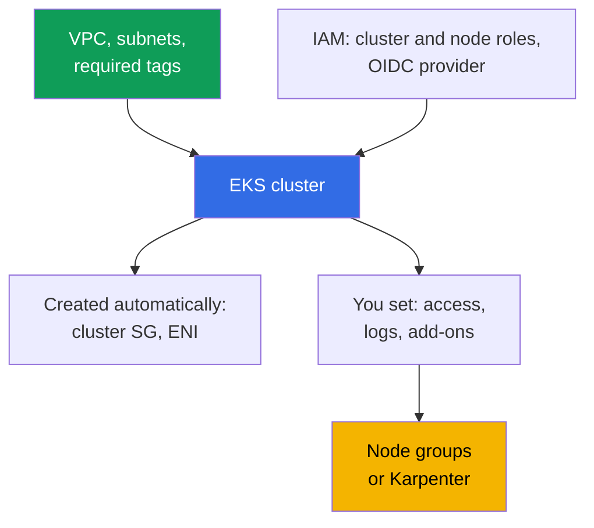
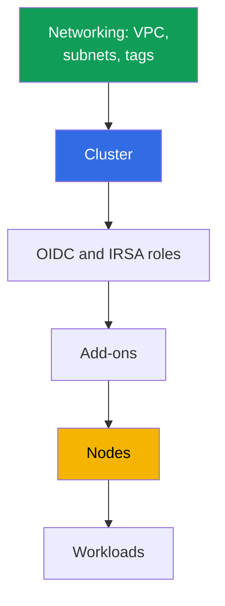

[Русская версия](ru.md) · [Versión en español](es.md) · [Version française](fr.md) · [Deutsche Version](de.md) · [ქართული ვერსია](ge.md) · [繁體中文版](tw.md) · [日本語版](jp.md)
# Chapter 4. Creating a cluster: eksctl, Terraform and Terragrunt, CloudFormation

> **What is next.** A cluster is created once, but the team lives with it for years, so choosing a tool is a decision about who owns the infrastructure state and whether production can be reproduced in another account. This chapter covers what makes up a cluster (20-30 resources, not one API call), compares eksctl, CloudFormation, Terraform, and Terragrunt, and explains the creation order and parameters that cannot be changed later. Access is in Chapter 5, networking in Chapters 6 and 7, nodes in Chapters 9-12, and add-ons in Chapter 37.

## 4.1. A cluster you cannot reproduce

The cluster was assembled manually in the console, it works, and applications run. The problem does not begin with an outage, but with an ordinary request: “create the same one in a new account for a second region.”

- **It cannot be reproduced.** Nobody remembers the wizard checkboxes: authentication mode, public endpoint CIDR, log set, custom service CIDR. The second cluster will be different.
- **It cannot be handed over.** A subnet has the `kubernetes.io/role/internal-elb` tag, and there is no answer to “why”: it was set because a load balancer would not create.
- **The owner left.** The cluster was created with an engineer's personal role, and that role received administrator permissions inside the cluster at creation time (Chapter 5). The engineer is no longer with the company.
- **Production and dev diverged.** In dev, the public endpoint is open to the world, while in production it is closed; audit logs are enabled only in production. Nobody can list the differences, and a dev check proves nothing.
- **It cannot be deleted.** Terraform code exists, but it is unclear what it created and what was adjusted by hand. `destroy` will delete half of it and leave orphans: ENIs, a security group, roles, and a load balancer with DNS.

The common denominator: the cluster exists, but **the cluster description does not**.

## 4.2. “Create a cluster” means 20-30 resources

One `CreateCluster` call creates a control plane. A working cluster needs substantially more, and almost all of it exists outside the cluster object.



**Networking.** A VPC, at least two subnets in different Availability Zones, routes, and NAT. Also tags without which some features silently do not work: `kubernetes.io/role/elb` on public subnets, `kubernetes.io/role/internal-elb` on private ones, and `karpenter.sh/discovery` with the cluster name as its value for Karpenter (Chapters 6, 12). **IAM.** The cluster role, node role, and IAM OIDC provider bound to the issuer: without it there is no IRSA and controllers with API access do not work.

**Created automatically:** cross-account ENIs in the specified subnets (usually 2-4) and a cluster security group of the form `eks-cluster-sg-<cluster>-<id>` (Chapter 2). They are not in your code, but they are in the account and survive a careless `destroy`. **Set at creation:** `authenticationMode` (`API`, `API_AND_CONFIG_MAP`, or `CONFIG_MAP`), access entries and creator permissions (Chapter 5), Kubernetes version and `supportType` (`STANDARD` or `EXTENDED`, Chapter 3), the endpoint and `publicAccessCidrs`, control-plane logs, add-ons, nodes, and the default StorageClass.

The same minimum in Terraform terms, when writing raw resources without a module. This is exactly what the control plane needs to either be created or run even one pod.

| What | Terraform resource | Why it is required |
|---|---|---|
| Control plane | `aws_eks_cluster` | the cluster itself: version, role, `vpc_config`, `kubernetes_network_config`, endpoint access, logs |
| Cluster role | `aws_iam_role` + `aws_iam_role_policy_attachment` (`AmazonEKSClusterPolicy`) | without it, EKS cannot manage resources in the account |
| Node role | `aws_iam_role` + `aws_iam_role_policy_attachment` (`AmazonEKSWorkerNodePolicy`, `AmazonEKS_CNI_Policy`, `AmazonEC2ContainerRegistryReadOnly`) | a node cannot register or pull images |
| OIDC for IRSA | `aws_iam_openid_connect_provider` (+ `data.tls_certificate`) | without it, there is no IRSA or controllers with API access |
| Networking | `aws_vpc`, `aws_subnet` (or `data` sources), `kubernetes.io/role/*` tags, `aws_security_group` | subnets in two zones and an SG are needed |
| Compute | `aws_eks_node_group` or `aws_eks_fargate_profile` | otherwise there is nowhere to run pods; labs use Fargate for system workloads plus Karpenter |
| Add-ons | `aws_eks_addon` (`vpc-cni`, `coredns`, `kube-proxy`, `eks-pod-identity-agent`) | pod networking, DNS, kube-proxy, pod identity |
| Access | `aws_eks_access_entry`, `aws_eks_access_policy_association` (or legacy `aws-auth`) | otherwise nobody but the creator can enter the cluster (Chapter 5) |

You can write this by hand, but it is expensive and fragile: it is easy to forget a subnet tag, a node-role policy, or an OIDC-to-role binding, and a missing binding will surface not at `apply` but later when a pod is denied. A special case: without nodes there is nowhere to run pods, and without `AmazonEKS_CNI_Policy` on the node role, a node will not obtain an IP or become `Ready` (Chapter 45). Therefore, these resources are rarely written one at a time: use a ready-made module (Section 4.7).

## 4.3. How clusters are created: an honest comparison

| Tool | Reproducibility | Review | Drift | Startup speed | Who owns the state |
|---|---|---|---|---|---|
| AWS console | no | nothing to review | not tracked | minutes | nobody |
| eksctl | partial, through yaml configuration | configuration in git | its CloudFormation stacks outside your IaC | highest | CloudFormation created by eksctl |
| CloudFormation | yes | template in git | stack drift detection | medium | the CloudFormation service |
| Terraform | yes | `plan` in a pull request | visible in `plan` | medium | your state in S3 |
| Terragrunt | yes, plus DRY across environments | the same, `run-all plan` | the same, by stack | medium | the same state, split across stacks |
| CDK, Pulumi | yes | programming-language code | through CloudFormation or their own state | medium | CloudFormation (CDK) or the Pulumi backend |
| Crossplane, ACK | yes, declaratively in the cluster | manifests in git | a controller reconciles continuously | low initially | the Kubernetes management cluster |

**The console** remains the best reading tool, but it is unsuitable for creating production: the result is not described. **CDK and Pulumi** are infrastructure in TypeScript, Python, or Go: their advantage is normal abstractions and types, their drawback is that it is easy to create imperative logic where a predictable diff is needed. **Crossplane and ACK** describe AWS resources as Kubernetes objects and continuously bring them to the declared state, which resolves drift but adds the “a cluster manages a cluster” dependency and the question of who creates the management cluster (usually Terraform).

## 4.4. eksctl: excellent reconnaissance, a poor production owner

eksctl creates a cluster with one command, and that is its real value.

```bash
# Cluster without nodes: control plane, VPC, roles, kubeconfig in one call
eksctl create cluster --name demo --region eu-central-1 --version 1.34 --without-nodegroup
eksctl get cluster --region eu-central-1      # what exists in the region at all
eksctl utils describe-stacks --cluster demo   # CloudFormation stacks it owns
```

**Its own state.** eksctl stores state in CloudFormation stacks that it creates itself (their names begin with `eksctl-`). Infrastructure has two owners: your Terraform state and foreign stacks Terraform knows nothing about. **Imperative operation.** Some eksctl operations are actions rather than a desired-state description: the answer to “what will change” comes from running it, not from a plan. **Boundaries.** eksctl is good exactly at the cluster boundary, while everything else lives in your IaC, and the interface between the two tools lies in networking and IAM. It is indispensable for exploring a new feature, reproducing a bug, and a temporary one-day cluster: such a cluster is created and deleted as a whole.

## 4.5. Terraform in detail: state, stacks, chicken and egg

**State and locking.** State is the map between code and real resources. It is stored in S3, versioned, and writes are locked so two simultaneous `apply` operations do not overwrite each other. A DynamoDB table locks the `s3` backend (the `dynamodb_table` argument); in Terraform 1.10 and later, a native lockfile in the bucket (`use_lockfile`) serves the same purpose. State also contains sensitive attributes, so the bucket is encrypted, access is restricted to the CI role, and versioning is enabled before the first `apply`.

**Splitting into stacks.** If everything is described in one stack, changing a subnet tag requires a `plan` for the whole infrastructure, while a failed workload `apply` blocks the network. The boundary follows the rate of change and ownership.

| Stack | What it contains | How often it changes |
|---|---|---|
| Networking | VPC, subnets, NAT, routes, tags | rarely, changes are painful |
| Cluster | control plane, roles, endpoint, logs, version | rarely, some parameters are immutable |
| Platform | OIDC and IRSA roles, add-ons, controllers, StorageClass | moderately, during updates |
| Nodes | node groups, launch templates, Karpenter NodePool | frequently |
| Workloads | applications, their secrets, and ingress | continuously, usually no longer Terraform |

**Chicken and egg with providers.** The `kubernetes` and `helm` providers are configured against a particular cluster's endpoint and CA. If the cluster is in the same stack, those values do not exist on the first `plan`: Terraform either fails or, worse, successfully plans with empty values. Hence the rule: **the cluster and workloads are not described in one stack**. Providers are configured in the next stack against an existing cluster, and manifests go to GitOps (Chapter 44). The second reason: Terraform poorly owns Kubernetes objects, and destroying the workload stack stops the service.

## 4.6. Terragrunt: DRY and dependencies between stacks

Terragrunt does not replace Terraform; it addresses two of its weaknesses: repeating backend and variable configuration in every stack, and the lack of relationships between stacks. An environment directory contains `env.hcl` and one subdirectory per stack: `vpc`, `ssh-keys`, `eks_control_plane`, `eks_fargate_system`, `eks_addons`, `eks_karpenter`, `worker`. In each subdirectory, `terragrunt.hcl` points `source` to a Terraform module, reads `env.hcl` through `read_terragrunt_config(find_in_parent_folders("env.hcl"))`, and declares dependencies with the `dependency` block: `eks_control_plane` depends on `vpc` and obtains `vpc_id` and subnet lists, while `eks_addons` depends on `eks_control_plane` and obtains the cluster name.

The `env.hcl` for lab 02 contains precisely the parameters that make up a cluster: `region`, `vpc_default_cidr`, `stack_name`, environment identifiers from `TF_VAR_USER_ID` and `TF_VAR_ENV_ID` (which form `env_name` so student environments do not conflict), a `subnets` map with subnets, their CIDRs, zones, NAT mode, and tags (`kubernetes.io/cluster/<env_name>` with value `owned`, `kubernetes.io/role/elb`, `kubernetes.io/role/internal-elb`, `karpenter.sh/discovery`), the `k8_version`, the `node_type` with values `ondemand` or `spot`, instance types, and owner tags.

```bash
terragrunt run-all apply --terragrunt-parallelism=4  # destroy runs in reverse order
terragrunt run-all output                            # outputs of every stack
terragrunt init && terragrunt plan && terragrunt apply   # a separate stack
```

The price of convenience is another abstraction layer and dependency graphs that, with careless design, turn a single parameter change into recalculating half the environment.

## 4.7. The terraform-aws-eks module: what it takes on, benefits, drawbacks, risks

The minimum from Section 4.2 is almost never written as raw resources. The community's standard answer is the `terraform-aws-eks` module (the course labs pin version 21.10.1). From a set of input variables, it assembles the control plane, IAM roles, OIDC provider, security groups, node groups and Fargate profiles, and add-ons: those same 20-30 resources and their relationships.

| Benefits | Drawbacks and risks |
|---|---|
| covers 20-30 resources and their relationships at once | major versions introduce breaking changes and resource renames |
| sensible defaults, less chance of forgetting a role, tag, or policy | renames require state migration: `moved` blocks or `state mv` |
| supports access entries, node groups, Fargate, and add-ons | the abstraction hides details: it is harder to understand what was actually created |
| one module for all clusters plus a parameter file | a module upgrade can plan replacement of a cluster or nodes |
| actively maintained by the community | part of the work remains yours: VPC, access, and some add-ons |

The main risk is an upgrade. When changing a major version, the module changes internal resource names, and `plan` shows replacement where data must remain: the cluster itself or a node group. Therefore, pin the version strictly (`version = "21.10.1"`, not a range), read the CHANGELOG and upgrade guide before a bump, and inspect `plan` manually specifically for replacement lines, not only the final result.

More hygiene rules. Do not mix module and manual management of the same add-on: an add-on must have one owner (Section 4.10). Watch the `enable_cluster_creator_admin_permissions` input: it grants the creator permissions inside the cluster (Section 4.9 and Chapter 5). Remember the boundary: the module creates infrastructure, but it is not GitOps, and Kubernetes and add-on version upgrades remain a separate operation with their own order (Chapters 38 and 39). Also distinguish versions: the `terraform-aws-eks` module version is not the Kubernetes version. A module bump does not upgrade the cluster; the Kubernetes version is a separate input, and changes to defaults between module versions appear in `plan` as drift or replacement on their own (Section 4.10).

## 4.8. Creation order and what cannot be changed later

The order is dictated by dependencies: every next step requires outputs from the previous one.



There are two stumbling points. Add-ons such as `vpc-cni` and `coredns` are installed before nodes: `coredns` will stay in `Pending` without nodes, but the CNI must be ready when a node requests an IP. Controllers with AWS API access need the OIDC provider before them, otherwise the pod enters `CrashLoopBackOff`.

Next is irreversibility: the cost of a mistake in this list is recreating the cluster.

| Parameter | Can it change on a live cluster? |
|---|---|
| `ipFamily` (`ipv4` or `ipv6`) | no, set only at creation |
| `serviceIpv4Cidr` (service CIDR) | no, a custom block is set only at creation |
| Cluster VPC | no, subnets must remain in the same VPC |
| Cluster name, cluster IAM role | no, `update-cluster-config` has no such fields |
| KMS key encryption of secrets | can be enabled on an existing cluster, cannot be disabled |
| Subnets and security groups | yes, at least two subnets in different zones, with the same VPC |
| Public and private endpoint, `publicAccessCidrs` | yes |
| Control-plane logs, `deletionProtection` | yes |
| `authenticationMode` | yes, toward API (Chapter 5) |
| Kubernetes version and `supportType` | yes, version only forward one minor at a time (Chapter 3) |

Before the first `apply` in a new account, check the first five rows of the table. By default, `serviceIpv4Cidr` is selected from `10.100.0.0/16` or `172.20.0.0/16`; if either block is occupied in connected networks, this becomes apparent later, when a ClusterIP cannot be reached through a VPN (Chapters 6 and 7).

```bash
# Create a cluster directly through the API: the same fields any IaC sets
aws eks create-cluster --name demo --kubernetes-version 1.34 \
  --role-arn arn:aws:iam::111122223333:role/eksClusterRole \
  --resources-vpc-config subnetIds=subnet-aaa,subnet-bbb,endpointPublicAccess=false

aws eks describe-cluster --name demo --query 'cluster.{v:version,acc:accessConfig}'
```

## 4.9. Who creates the cluster: permissions and protection

**The cluster is created by a CI role, not a person.** The reason is not discipline: the IAM principal that created the cluster receives administrator permissions inside it, controlled by the `bootstrapClusterCreatorAdminPermissions` field, which defaults to `true`. If a cluster is created with an engineer's personal role, administrator-level access remains with it forever, and it cannot be removed through IAM: the entry lives in the cluster's access configuration. Set the flag to `false` (for `aws eks create-cluster`, this is `--access-config bootstrapClusterCreatorAdminPermissions=false`; for eksctl, `--bootstrap-cluster-creator-admin-permissions false` or the same field in `accessConfig`; for the `terraform-aws-eks` module, the Boolean input `enable_cluster_creator_admin_permissions = false`, which the module maps to `bootstrapClusterCreatorAdminPermissions` in `accessConfig`), and create access explicitly through access entries (the module uses the `access_entries` input). Then permissions are described by code, not creation history.
The creator role is needed exactly once for `create-cluster`; later administration uses separate roles defined by access entries, so permissions are not inherited from history. The option is available on EKS 1.23 and later clusters together with `API` mode (Chapter 5).

**Permissions of the CI role itself.** Creating a cluster requires broad permissions: EKS, IAM (roles and the OIDC provider), EC2, and often KMS and CloudWatch Logs. Do not grant such a role to people: it is assumed by the pipeline, restricted by trust to the repository and branch, and visible in CloudTrail (Chapters 0.2 and 21).

**Secrets and deletion protection.** The state bucket is encrypted and versioned, only the CI role has access, state is never in git, and `terraform output` with secrets is not printed in pipeline logs. The `deletionProtection` flag prevents cluster deletion; on the Terraform side, `prevent_destroy` in `lifecycle` plays the same role, while on the process side there are separate pipelines and plan review.

## 4.10. Drift: why `plan` shows things you did not do

After creation, the cluster changes without your involvement: AWS adds service tags, EKS adjusts cluster SG rules, and controllers create load balancers, target groups, and DNS records.

| Change source | How it looks in `plan` | What to do |
|---|---|---|
| Service tags from AWS and EKS | an attempt to delete “extra” tags | exclude them in `ignore_changes` |
| Cluster security group rules | changed rules you did not write | do not describe this SG in code; reference its ID |
| Load balancers from AWS Load Balancer Controller | resources are absent from state but exist in the account | the controller owns them, not Terraform (Chapter 26) |
| Route 53 records from external-dns | the zone is in your code but the record is not | Terraform owns the zone, external-dns owns records (Chapter 29) |
| Manual console changes, including add-on versions | a rollback to values from code | restore through code; keep add-on versions in code (Chapter 37) |

The discipline reduces to one rule: every resource has one owner. If a controller creates the resource, Terraform does not know about it; if Terraform does, do not manage it in the console. A scheduled `plan` turns drift into an ordinary task rather than a surprise.

## 4.11. A cluster fleet: one module, different parameters

When there are more than three clusters, the cost of divergence grows faster than their number: validation stops carrying from one cluster to another. One approach works: **one module for all clusters plus one parameter file per environment**. The module holds the logic (resource composition, tags, dependencies); the environment file holds differences: region, CIDR, Kubernetes version, `supportType`, node sizes, add-ons, and endpoint flags. A ready reference for a module's internals is the community `terraform-aws-eks`: it is split into submodules (cluster, node groups, IRSA roles, access entries) and does not solve state storage for you, so an S3 remote backend with locking remains your responsibility. Make a change once and roll it out in dev, stage, production order; environment differences read as a diff of two files; moving to extended support is visible in the PR, not on the bill (Chapter 3).

## 4.12. How this is used in production

- **A pipeline creates the cluster.** A CI role, trust for a specific repository, `plan` in a pull request, and `apply` after review. Personal roles create temporary reconnaissance clusters only.
- **Stacks are separated** into networking, cluster, platform, and nodes; workloads live in GitOps, while `kubernetes` and `helm` providers are configured for an existing cluster.
- **`bootstrapClusterCreatorAdminPermissions` is deliberately disabled**, and administrator access is described in code through access entries (Chapter 5).
- **State is in S3** with versioning, encryption, and locking, accessible only to CI; `deletionProtection` and `prevent_destroy` are used in production; eksctl remains for reconnaissance; a non-empty `plan` without an open pull request is a process incident, not a triviality.

## 4.13. Mini glossary

- **State**: a mapping file between Terraform code and real resources, stored in S3 with versioning and write locking. **Drift**: a difference between code and the actual infrastructure state.
- **Stack**: an independently applicable unit of infrastructure with its own state, while a **dependency between stacks** passes its outputs into another stack's inputs (the `dependency` block in Terragrunt).
- **`bootstrapClusterCreatorAdminPermissions`**: an access-configuration field at creation; when `true` (the default), the cluster creator receives administrator permissions in it (Chapter 5).
- **`authenticationMode`**: an authentication mode: `API`, `API_AND_CONFIG_MAP`, `CONFIG_MAP`. **`deletionProtection`**: a flag preventing cluster deletion. An **immutable parameter** is `ipFamily`, a custom `serviceIpv4Cidr`, the VPC, or the cluster's IAM name and role.

## 4.14. Chapter summary

- “Create a cluster” means describing 20-30 resources: networking with tags, IAM roles, an OIDC provider, access configuration, add-ons, nodes, and StorageClass. One API call provides only the control plane, while the cluster SG and cross-account ENIs appear automatically.
- Tools differ not in syntax, but in their answer to who owns the state: nobody for the console, eksctl's own CloudFormation stacks for eksctl, your state for Terraform and Terragrunt, and a controller in the management cluster for Crossplane and ACK. eksctl is good for reconnaissance and a poor production owner: it is imperative, has its own state, and interfaces with your IaC through networking and IAM.
- The cluster and workloads are not described in one stack: `kubernetes` and `helm` providers cannot be configured for a cluster that does not exist yet. The split is networking, cluster, platform, nodes; Terragrunt removes configuration repetition and derives application order from the graph.
- The order is networking, cluster, OIDC and roles, add-ons, nodes, workloads. `ipFamily`, a custom `serviceIpv4Cidr`, the VPC, the cluster name, and its role are chosen forever; KMS secret encryption can be enabled on a live cluster but not disabled.
- A CI role, not a person, creates the cluster: its creator receives administrator permissions in the cluster. Drift is unavoidable because Terraform is not the legitimate owner of some resources; resolve it with one owner per resource and regular scheduled `plan`.

## 4.15. How this helps in real work

The question “how long will it take to create the same cluster in a new account” becomes verifiable: either you have a module and parameter file, and the answer is measured in hours, or there is no answer. The difference between dev and production becomes the diff of two files, and incident investigation becomes reading pull-request history. Properly separated stacks make safe what would otherwise be frightening: touching a cluster's network or updating an add-on without affecting the control plane.

## 4.16. Self-check questions

1. List the resources a cluster needs besides the cluster object itself.
2. Which subnet tags are required, and what stops working without each of them?
3. Why does an eksctl-created cluster have two state owners, and when is eksctl still appropriate?
4. Why cannot the `kubernetes` and `helm` providers be configured in the same stack as the cluster?
5. How would you split infrastructure into stacks, and by which criterion?
6. What does Terragrunt add on top of Terraform, and what price do you pay for it?
7. Which cluster parameters cannot be changed after creation, and can KMS encryption be disabled?
8. What does `bootstrapClusterCreatorAdminPermissions` do, and why does it matter at creation?
9. `plan` shows changes you did not make. How do you determine who made them?
10. The fleet has ten clusters, all different. Where do you start bringing them to one module?

## Practice

The course lab for this topic is [lab 101 - cluster as code](../../labs/101/README.MD). It deploys a cluster through Terragrunt (VPC, control plane, add-ons, Karpenter, worker machine), explains the division between the control plane and your area of responsibility, and is checked with the `check_result` command. Run it with `TASK=101 make run_eks_task`.

For a one-off reconnaissance cluster (Section 4.4), AWS provides official materials: a step-by-step eksctl scenario for creating, inspecting, and deleting a cluster; a complete eksctl guide with a configuration file and add-ons; and an AWS workshop with labs on a ready cluster.

```bash
# Get started with Amazon EKS - eksctl: cluster and nodes in one run, then deletion
# https://docs.aws.amazon.com/eks/latest/userguide/getting-started-eksctl.html

# Eksctl User Guide: installation, cluster from yaml configuration, add-ons, Auto Mode
# https://docs.aws.amazon.com/eks/latest/eksctl/tutorial.html

# EKS Workshop (aws-samples/eks-workshop-v2 repository): labs on a ready cluster
# https://www.eksworkshop.com/
```

Such a cluster is created and deleted as a whole, while production still lives in your IaC: two state owners are why eksctl remains a reconnaissance tool rather than a production owner.

In addition to the lab, the chapter's contents can be checked on any cluster. Take `aws eks describe-cluster --name <cluster>` and list everything related to creation: `version`, `roleArn`, `resourcesVpcConfig` (subnets, security groups, endpoint flags), as well as `kubernetesNetworkConfig`, `accessConfig`, `logging`, `encryptionConfig`, and `upgradePolicy`. Find each value in your IaC: anything in the output but absent from the code is technical debt. It is useful to compare subnet tags from `aws ec2 describe-subnets` with code and find a cluster security group of the form `eks-cluster-sg-<cluster>-<id>` in the account.

The repository lab environments are assembled with Terragrunt and can be read as an example of splitting into stacks. In lab 02, the `vpc`, `ssh-keys`, `eks_control_plane`, `eks_fargate_system`, `eks_addons`, `eks_karpenter`, and `worker` directories are side by side: each has its own `terragrunt.hcl` with a module reference and `dependency` blocks (`eks_control_plane` depends on `vpc`, while `eks_addons` depends on `eks_control_plane` and `eks_fargate_system`). Environment parameters are collected in one `env.hcl`.

---
[Table of contents](../README.md) · [Chapter 3](../03/en.md) · [Chapter 5](../05/en.md)
