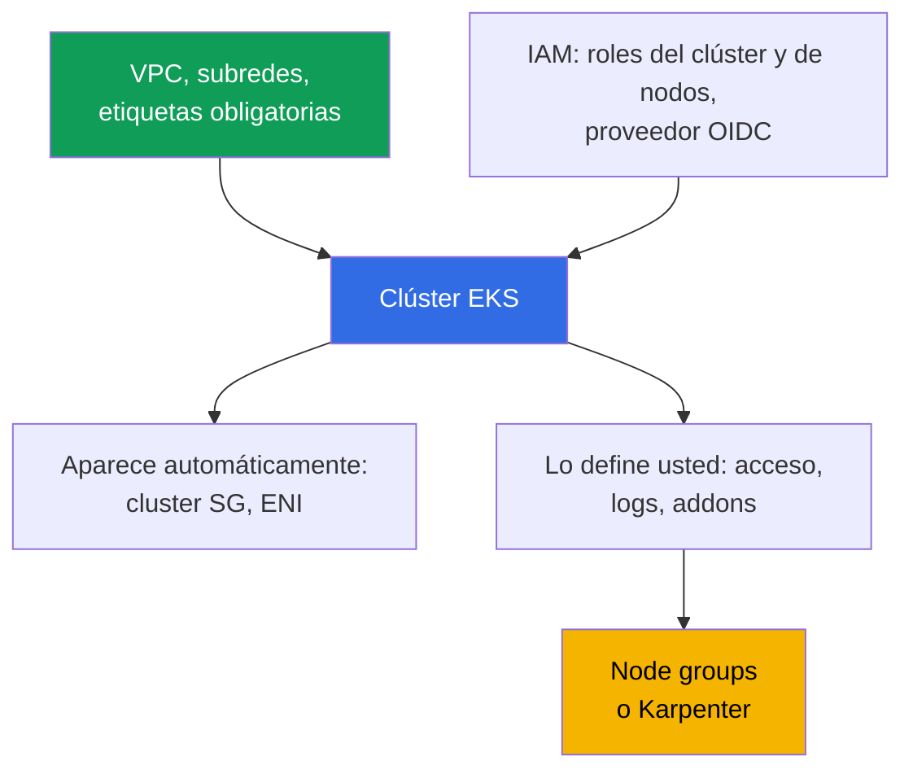
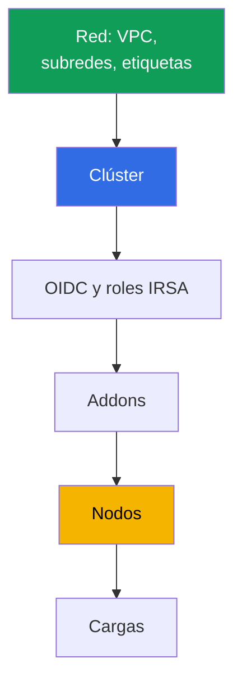

[Русская версия](ru.md) · [Eng version](en.md) · [Version française](fr.md) · [Deutsche Version](de.md) · [ქართული ვერსია](ge.md) · [繁體中文版](tw.md) · [日本語版](jp.md)
# Capítulo 4. Creación de un clúster: eksctl, Terraform y Terragrunt, CloudFormation

> **Qué sigue.** El clúster se crea una vez, pero el equipo debe vivir con él durante años, por lo
> que la elección de la herramienta decide quién posee el estado de la infraestructura y si se puede
> reproducir producción en otra cuenta. Este capítulo trata sobre la composición del clúster (son
> 20-30 recursos, no una sola llamada a la API), la comparación de eksctl, CloudFormation,
> Terraform y Terragrunt, el orden de creación y los parámetros que no se podrán cambiar después.
> El acceso se trata en el capítulo 5, la red en los capítulos 6 y 7, los nodos en los capítulos
> 9-12 y los addons en el capítulo 37.

## 4.1. El clúster que no se puede reproducir

El clúster se montó manualmente en la consola, funciona y las aplicaciones se despliegan. El
problema no empieza con una incidencia, sino con una petición normal: «levanten uno igual en una
cuenta nueva para una segunda región».

- **No se puede reproducir.** Nadie recuerda las casillas del asistente: el modo de autenticación,
  el CIDR del endpoint público, el conjunto de logs, el CIDR personalizado de servicios. El segundo
  clúster será diferente.
- **No se puede transferir.** Las subredes tienen la etiqueta `kubernetes.io/role/internal-elb`, y
  a la pregunta «por qué» no hay respuesta: se añadió porque el balanceador no se creaba.
- **El propietario se fue.** El clúster se creó con el rol personal de un ingeniero, y ese rol recibió
  permisos de administrador dentro del clúster al crearlo (capítulo 5). El ingeniero ya no está en
  la empresa.
- **Producción y dev divergen.** En dev el endpoint público está abierto al mundo, en producción
  está cerrado; los audit logs solo están habilitados en producción. Nadie puede enumerar la
  diferencia, y una comprobación en dev no demuestra nada.
- **No se puede eliminar.** Hay código Terraform, pero no está claro qué creó y qué se retocó a
  mano. `destroy` eliminará una mitad y dejará huérfanos: ENI, security group, roles, balanceador
  con DNS.

El denominador común: el clúster existe, pero **la descripción del clúster no existe**.

## 4.2. «Crear un clúster» son 20-30 recursos

Una llamada a `CreateCluster` crea el control plane. Un clúster operativo requiere bastante más,
y casi todo ello existe fuera del objeto cluster.



**Red.** VPC, al menos dos subredes en distintas zonas de disponibilidad, rutas, NAT. Además,
etiquetas sin las cuales algunas funciones no operan silenciosamente: `kubernetes.io/role/elb` en
las subredes públicas, `kubernetes.io/role/internal-elb` en las privadas,
`karpenter.sh/discovery` con el nombre del clúster para Karpenter (capítulos 6, 12). **IAM.** El
rol del clúster, el rol de nodos y el proveedor IAM OIDC asociado al issuer: sin él no hay IRSA y
los controladores con acceso a la API no funcionan.

**Aparece automáticamente:** ENI cross-account en las subredes especificadas (normalmente 2-4) y
un cluster security group con el formato `eks-cluster-sg-<cluster>-<id>` (capítulo 2). No están en
su código, pero están en la cuenta y sobrevivirán un `destroy` descuidado. **Se define al crear:**
`authenticationMode` (`API`, `API_AND_CONFIG_MAP` o `CONFIG_MAP`), access entries y permisos del
creador (capítulo 5), la versión de Kubernetes y `supportType` (`STANDARD` o `EXTENDED`, capítulo
3), el endpoint y `publicAccessCidrs`, los logs del control plane, addons, nodos y la StorageClass
predeterminada.

El mismo mínimo en términos de Terraform, si se escriben recursos sin procesar, sin módulo. Es
exactamente lo que se necesita para que el control plane se cree y pueda ejecutar al menos un pod.

| Qué | Terraform resource | Por qué es obligatorio |
|---|---|---|
| Control plane | `aws_eks_cluster` | el propio clúster: versión, rol, `vpc_config`, `kubernetes_network_config`, endpoint access, logs |
| Rol del clúster | `aws_iam_role` + `aws_iam_role_policy_attachment` (`AmazonEKSClusterPolicy`) | sin él EKS no administra recursos en la cuenta |
| Rol de nodos | `aws_iam_role` + `aws_iam_role_policy_attachment` (`AmazonEKSWorkerNodePolicy`, `AmazonEKS_CNI_Policy`, `AmazonEC2ContainerRegistryReadOnly`) | el nodo no se registrará ni descargará imágenes |
| OIDC para IRSA | `aws_iam_openid_connect_provider` (+ `data.tls_certificate`) | sin él no hay IRSA ni controladores con acceso a la API |
| Red | `aws_vpc`, `aws_subnet` (o fuentes `data`), etiquetas `kubernetes.io/role/*`, `aws_security_group` | se necesitan subredes en dos zonas y un SG |
| Cómputo | `aws_eks_node_group` o `aws_eks_fargate_profile` | de otro modo no hay dónde ejecutar pods; en los laboratorios, sistema en Fargate más Karpenter |
| Addons | `aws_eks_addon` (`vpc-cni`, `coredns`, `kube-proxy`, `eks-pod-identity-agent`) | red de pods, DNS, kube-proxy, pod identity |
| Acceso | `aws_eks_access_entry`, `aws_eks_access_policy_association` (o el obsoleto `aws-auth`) | de otro modo nadie podrá entrar al clúster salvo el creador (capítulo 5) |

Es posible escribirlo a mano, pero es caro y frágil: es fácil olvidar una etiqueta de subred, una
política del rol de nodos o la asociación OIDC con el rol, y una asociación ausente no aparece en
`apply`, sino después, cuando falla un pod. Un caso particular: sin nodos no hay dónde ejecutar
pods, y sin `AmazonEKS_CNI_Policy` en el rol de nodos, el nodo no obtendrá IP y no quedará `Ready`
(capítulo 45). Por ello, estos recursos rara vez se escriben uno a uno: se usa un módulo preparado
(sección 4.7).

## 4.3. Con qué se crea un clúster: comparación honesta

| Herramienta | Reproducibilidad | Review | Drift | Velocidad de inicio | Quién posee el estado |
|---|---|---|---|---|---|
| Consola AWS | no | nada que revisar | no se rastrea | minutos | nadie |
| eksctl | parcial, mediante configuración yaml | configuración en git | sus stacks CloudFormation fuera de su IaC | la más alta | CloudFormation creado por eksctl |
| CloudFormation | sí | plantilla en git | drift detection por stack | media | servicio CloudFormation |
| Terraform | sí | `plan` en pull request | visible en `plan` | media | su state en S3 |
| Terragrunt | sí, además DRY entre entornos | lo mismo, `run-all plan` | lo mismo, por stacks | media | el mismo state, distribuido por stacks |
| CDK, Pulumi | sí | código en lenguaje de programación | mediante CloudFormation o su propio state | media | CloudFormation (CDK) o backend de Pulumi |
| Crossplane, ACK | sí, declarativo en el clúster | manifiestos en git | el controlador reconcilia continuamente | baja al inicio | clúster Kubernetes de management |

**La consola** sigue siendo la mejor herramienta de lectura, pero no sirve para crear producción:
el resultado no está descrito. **CDK y Pulumi** son infraestructura en TypeScript, Python o Go: la
ventaja son las abstracciones y tipos habituales, la desventaja es que es fácil obtener lógica
imperativa donde se necesita un diff predecible. **Crossplane y ACK** describen recursos AWS como
objetos Kubernetes y los llevan continuamente al estado descrito, lo que resuelve el drift, pero
introduce la dependencia «un clúster administra un clúster» y la pregunta de quién crea el clúster
de management (normalmente Terraform).

## 4.4. eksctl: excelente exploración, mal propietario de producción

eksctl crea un clúster con un comando, y ese es su verdadero valor.

```bash
# Clúster sin nodos: control plane, VPC, roles, kubeconfig, en una llamada
eksctl create cluster --name demo --region eu-central-1 --version 1.34 --without-nodegroup
eksctl get cluster --region eu-central-1      # qué existe en la región
eksctl utils describe-stacks --cluster demo   # stacks CloudFormation que posee
```

**Su propio estado.** eksctl guarda el estado en los stacks CloudFormation que crea por sí mismo
(los nombres comienzan con `eksctl-`). La infraestructura tiene dos propietarios: su state de
Terraform y stacks ajenos de los que Terraform no sabe nada. **Imperatividad.** Parte de las
operaciones de eksctl son acciones, no una descripción del estado deseado: la respuesta a «qué
cambiará» se obtiene ejecutándolo, no con un plan. **Límites.** eksctl es bueno justo dentro de los
límites del clúster, y el resto vive en su IaC, con la unión entre las dos herramientas en red e
IAM. Es irremplazable para explorar una función nueva, reproducir un bug y un clúster temporal de
un día: ese clúster se crea y elimina en su totalidad.

## 4.5. Terraform en detalle: state, stacks, gallina y huevo

**State y bloqueo.** El state es el mapa de correspondencia entre el código y los recursos reales.
Se guarda en S3, tiene versiones, y la escritura se bloquea para que dos `apply` simultáneos no se
sobrescriban entre sí. El bloqueo del backend `s3` lo mantiene la tabla DynamoDB (argumento
`dynamodb_table`); en Terraform 1.10 y posteriores, el mismo papel lo cumple un lockfile nativo en
el bucket (`use_lockfile`). El state contiene atributos sensibles, por lo que el bucket se cifra,
el acceso se limita al rol de CI y el versionado se habilita antes del primer `apply`.

**Separación en stacks.** Si todo se describe en un único stack, cambiar una etiqueta de subred
requiere un `plan` de toda la infraestructura, y un `apply` fallido en las cargas bloquea la red. El
límite se establece por velocidad de cambio y por propietario.

| Stack | Qué contiene | Con qué frecuencia cambia |
|---|---|---|
| Red | VPC, subredes, NAT, rutas, etiquetas | rara vez, los cambios son dolorosos |
| Clúster | control plane, roles, endpoint, logs, versión | rara vez, algunos parámetros son immutable |
| Plataforma | OIDC y roles IRSA, addons, controladores, StorageClass | frecuencia media, durante actualizaciones |
| Nodos | node groups, launch templates, Karpenter NodePool | con frecuencia |
| Cargas | aplicaciones, sus secretos e ingress | continuamente, normalmente ya no con Terraform |

**Gallina y huevo con los proveedores.** Los proveedores `kubernetes` y `helm` se configuran con
el endpoint y la CA de un clúster específico. Si el clúster se describe en el mismo stack, esos
valores aún no existen en el primer `plan`: Terraform falla o, peor, planifica correctamente con
valores vacíos. De ahí la regla: **el clúster y las cargas no se describen en un mismo stack**. Los
proveedores se configuran en el siguiente stack sobre un clúster ya existente, y los manifiestos se
entregan mediante GitOps (capítulo 44). El segundo argumento: Terraform no posee bien los objetos
Kubernetes, y el `destroy` del stack de cargas detiene el servicio.

## 4.6. Terragrunt: DRY y dependencias entre stacks

Terragrunt no sustituye a Terraform, sino que resuelve dos de sus debilidades: la repetición de
configuración de backend y variables en cada stack, y la ausencia de relaciones entre stacks. El
catálogo del entorno contiene `env.hcl` y un subdirectorio por stack: `vpc`, `ssh-keys`,
`eks_control_plane`, `eks_fargate_system`, `eks_addons`, `eks_karpenter`, `worker`. En cada
subdirectorio, `terragrunt.hcl` indica `source` al módulo Terraform, lee `env.hcl` mediante
`read_terragrunt_config(find_in_parent_folders("env.hcl"))` y declara dependencias mediante el
bloque `dependency`: `eks_control_plane` depende de `vpc` y toma `vpc_id` y las listas de
subredes; `eks_addons` depende de `eks_control_plane` y toma el nombre del clúster.

En el `env.hcl` del laboratorio 02 se concentran precisamente los parámetros que forman el
clúster: `region`, `vpc_default_cidr`, `stack_name`, identificadores del entorno de
`TF_VAR_USER_ID` y `TF_VAR_ENV_ID` (a partir de ellos se forma `env_name` para que los entornos de
los estudiantes no entren en conflicto), el mapa `subnets` con subredes, sus CIDR, zonas, modo NAT
y etiquetas (`kubernetes.io/cluster/<env_name>` con valor `owned`, `kubernetes.io/role/elb`,
`kubernetes.io/role/internal-elb`, `karpenter.sh/discovery`), versión `k8_version`, tipo de nodos
`node_type` con valores `ondemand` o `spot`, tipos de instancias y etiquetas del propietario.

```bash
terragrunt run-all apply --terragrunt-parallelism=4  # destroy se ejecuta en orden inverso
terragrunt run-all output                            # salidas de todos los stacks
terragrunt init && terragrunt plan && terragrunt apply   # stack individual
```

El precio de la comodidad es otra capa de abstracción y grafos de dependencias que, con un diseño
descuidado, convierten el cambio de un parámetro en el recálculo de la mitad del entorno.

## 4.7. Módulo terraform-aws-eks: qué asume, ventajas, desventajas y riesgos

El mínimo de la sección 4.2 casi nunca se escribe con recursos sin procesar. La respuesta estándar
de la comunidad es el módulo `terraform-aws-eks` (en los laboratorios del curso está fijada la
versión 21.10.1). A partir de un conjunto de variables de entrada, compone el control plane, roles
IAM, proveedor OIDC, security groups, node groups y Fargate profiles, addons, es decir, esos
mismos 20-30 recursos y sus relaciones.

| Ventajas | Desventajas y riesgos |
|---|---|
| cubre de una vez 20-30 recursos y sus relaciones | las versiones mayores introducen breaking changes y cambios de nombre de recursos |
| defaults sensatos, menos probabilidad de olvidar un rol, etiqueta o política | los cambios de nombre requieren migración del state: bloques `moved` o `state mv` |
| soporte para access entries, node groups, Fargate y addons | la abstracción oculta detalles: es más difícil entender qué se creó realmente |
| un módulo para todos los clústeres más un archivo de parámetros | actualizar el módulo puede planificar el replace del clúster o nodos |
| mantenido activamente por la comunidad | parte del trabajo sigue siendo suyo: VPC, acceso, algunos addons |

El riesgo principal es la actualización. Al cambiar la versión mayor, el módulo modifica los
nombres internos de recursos y `plan` muestra replace donde los datos deben sobrevivir: el propio
clúster o un node group. Por ello, la versión se fija estrictamente (`version = "21.10.1"`, no un
rango), antes de aumentarla se leen el CHANGELOG y la guía de actualización, y se revisan
visualmente las líneas replace de `plan`, no solo el resultado final.

Más reglas de higiene. No mezcle la administración de un addon mediante el módulo y manualmente:
un addon debe tener un único propietario (sección 4.10). Vigile la entrada
`enable_cluster_creator_admin_permissions`: establece los permisos del creador dentro del clúster
(sección 4.9 y capítulo 5). Y recuerde el límite: el módulo crea infraestructura, pero no es
GitOps; la actualización de versiones de Kubernetes y addons sigue siendo una operación separada
con su propio orden (capítulos 38 y 39). Diferencie también las versiones: la versión del módulo
`terraform-aws-eks` no es la versión de Kubernetes. Aumentar el módulo no eleva el clúster; la
versión de Kubernetes se establece mediante otra entrada y el cambio de defaults entre versiones
del módulo se ve por sí mismo en `plan` como drift o recreación (sección 4.10).

## 4.8. Orden de creación y lo que no se puede cambiar después

El orden lo dictan las dependencias: cada paso siguiente requiere las salidas del anterior.



Hay dos puntos donde se suele tropezar. Los addons como `vpc-cni` y `coredns` se instalan antes de
los nodos: `coredns` permanecerá en `Pending` sin nodos, pero el CNI debe estar listo cuando el
nodo solicite una IP. Y los controladores con acceso a la API de AWS necesitan el proveedor OIDC
antes que ellos; de otro modo, el pod entrará en `CrashLoopBackOff`.

A continuación, la irreversibilidad: el coste de un error en esta lista es recrear el clúster.

| Parámetro | ¿Cambia en un clúster activo? |
|---|---|
| `ipFamily` (`ipv4` o `ipv6`) | no, se establece solo al crear |
| `serviceIpv4Cidr` (CIDR de servicios) | no, el bloque personalizado se establece solo al crear |
| VPC del clúster | no, las subredes deben permanecer en la misma VPC |
| Nombre del clúster, rol IAM del clúster | no, `update-cluster-config` no tiene esos campos |
| Cifrado de secretos con clave KMS | puede habilitarse en un clúster existente, no puede deshabilitarse |
| Subredes y security groups | sí, al menos dos subredes en zonas distintas, la VPC debe ser la misma |
| Endpoint público y privado, `publicAccessCidrs` | sí |
| Logs del control plane, `deletionProtection` | sí |
| `authenticationMode` | sí, hacia API (capítulo 5) |
| Versión de Kubernetes y `supportType` | sí, la versión solo avanza una minor cada vez (capítulo 3) |

Antes del primer `apply` en una cuenta nueva, se revisan las primeras cinco filas de la tabla.
`serviceIpv4Cidr` toma por defecto `10.100.0.0/16` o `172.20.0.0/16`, y si uno de esos bloques
está ocupado en una red conectada, se descubre más tarde, cuando ClusterIP no abre a través de la
VPN (capítulos 6 y 7).

```bash
# Creación directa del clúster mediante API: los mismos campos que define cualquier IaC
aws eks create-cluster --name demo --kubernetes-version 1.34 \
  --role-arn arn:aws:iam::111122223333:role/eksClusterRole \
  --resources-vpc-config subnetIds=subnet-aaa,subnet-bbb,endpointPublicAccess=false

aws eks describe-cluster --name demo --query 'cluster.{v:version,acc:accessConfig}'
```

## 4.9. Quién crea el clúster: permisos y protección

**El clúster lo crea un rol de CI, no una persona.** La razón no es disciplina: el principal IAM
que crea el clúster recibe permisos de administrador dentro del clúster; de ello se ocupa el campo
`bootstrapClusterCreatorAdminPermissions` con el valor predeterminado `true`. Si el clúster se crea
con el rol personal de un ingeniero, su acceso de administrador queda para siempre, y no se puede
eliminar mediante IAM: la entrada vive en la configuración de acceso del clúster. El flag se
establece en `false` (en `aws eks create-cluster` es
`--access-config bootstrapClusterCreatorAdminPermissions=false`, en eksctl es el flag
`--bootstrap-cluster-creator-admin-permissions false` o el mismo campo en `accessConfig`, en el
módulo `terraform-aws-eks` es la entrada booleana
`enable_cluster_creator_admin_permissions = false`, que el módulo mapea a
`bootstrapClusterCreatorAdminPermissions` en `accessConfig`), y el acceso se crea mediante access
entries explícitamente (en el módulo, la entrada `access_entries`); así los permisos quedan
descritos por código y no por la historia de creación. El rol creador se necesita exactamente una
vez para `create-cluster`; la administración posterior se realiza con roles independientes
descritos por access entries para que los permisos no se hereden de la historia. La opción está
disponible en clústeres EKS 1.23 y posteriores junto con el modo `API` (capítulo 5).

**Permisos del propio rol de CI.** Crear un clúster requiere permisos amplios: EKS, IAM (roles y
proveedor OIDC), EC2, a menudo KMS y CloudWatch Logs. Este rol no se concede a personas: lo asume
el pipeline, está limitado por la confianza en el repositorio y la rama, y es visible en CloudTrail
(capítulos 0.2 y 21).

**Secretos y protección contra eliminación.** El bucket con el state se cifra y versiona, solo el
rol de CI tiene acceso, el state nunca está en git y `terraform output` con secretos no se imprime
en los logs del pipeline. El flag `deletionProtection` impide eliminar el clúster; desde Terraform,
la misma función la desempeña `prevent_destroy` en `lifecycle`, y desde el proceso, pipelines
separados y la lectura del plan.

## 4.10. Drift: por qué `plan` muestra lo que no hizo

Después de crearlo, el clúster cambia sin su intervención: AWS agrega etiquetas de servicio, EKS
modifica reglas del cluster SG, los controladores crean balanceadores, target groups y registros DNS.

| Origen del cambio | Cómo aparece en `plan` | Qué hacer |
|---|---|---|
| Etiquetas de servicio de AWS y EKS | intento de eliminar etiquetas «sobrantes» | excluir en `ignore_changes` |
| Reglas del cluster security group | modificación de reglas que no escribió | no describir este SG en código, referirse a su id |
| Balanceadores de AWS Load Balancer Controller | los recursos no están en el state, pero sí en la cuenta | el propietario es el controlador, no Terraform (capítulo 26) |
| Registros Route 53 de external-dns | la zona está en su código, el registro no | zona en Terraform, registros en external-dns (capítulo 29) |
| Cambios manuales en consola, incluidas versiones de addons | retorno a valores del código | devolver mediante código, versiones de addons en el código (capítulo 37) |

La disciplina se reduce a una regla: cada recurso tiene un propietario. Si lo crea un controlador,
Terraform no sabe de él; si lo crea Terraform, no se gestiona en la consola. Y un `plan` regular
programado convierte el drift en una tarea normal en lugar de una sorpresa.

## 4.11. Parque de clústeres: un módulo, parámetros diferentes

Cuando hay más de tres clústeres, el coste de las divergencias crece más rápido que su número: una
comprobación deja de ser transferible de un clúster a otro. Solo hay un esquema que funciona: **un
módulo para todos los clústeres más un archivo de parámetros por entorno**. El módulo contiene la
lógica (composición de recursos, etiquetas, dependencias) y el archivo de entorno contiene las
diferencias: región, CIDR, versión de Kubernetes, `supportType`, tamaños de nodos, addons, flags
del endpoint. Una referencia preparada para las entrañas de ese módulo es el público
`terraform-aws-eks` de la comunidad: está dividido en submódulos (clúster, node groups, roles
IRSA, access entries) y no resuelve por usted el almacenamiento del state, por lo que el backend
remoto en S3 con bloqueo sigue siendo su responsabilidad. El cambio se introduce una vez y se
despliega en orden dev, stage, producción; la diferencia entre entornos se lee como el diff de dos
archivos; el paso a extended support se ve en el PR, no en la factura (capítulo 3).

## 4.12. Cómo se aplica en producción

- **El clúster lo crea un pipeline.** Rol de CI, confianza en un repositorio concreto, `plan` en el
  pull request, `apply` tras el review. Los roles personales solo crean clústeres temporales para
  exploración.
- **Los stacks están separados** en red, clúster, plataforma y nodos; las cargas viven en GitOps y
  los proveedores `kubernetes` y `helm` se configuran con un clúster existente.
- **`bootstrapClusterCreatorAdminPermissions` se deshabilita conscientemente**, el acceso de
  administrador se describe mediante access entries en código (capítulo 5).
- **State en S3** con versionado, cifrado y bloqueo; solo CI tiene acceso;
  `deletionProtection` y `prevent_destroy` en producción; eksctl queda para exploración; un
  `plan` no vacío sin pull request abierto es un incidente de proceso, no una minucia.

## 4.13. Mini glosario

- **State**: archivo de correspondencia entre código Terraform y recursos reales; se guarda en S3
  con versionado y bloqueo de escritura. **Drift**: diferencia entre el código y el estado real de
  la infraestructura.
- **Stack**: unidad de infraestructura aplicable de forma independiente con su propio state, y una
  **dependencia entre stacks** es transferir sus salidas a las entradas de otro (en Terragrunt, el
  bloque `dependency`).
- **`bootstrapClusterCreatorAdminPermissions`**: campo de configuración de acceso al crear; con
  `true` (predeterminado), el creador del clúster recibe permisos de administrador en él (capítulo
  5).
- **`authenticationMode`**: modo de autenticación: `API`, `API_AND_CONFIG_MAP`, `CONFIG_MAP`.
  **`deletionProtection`**: flag que prohíbe eliminar el clúster. **Parámetro immutable**:
  `ipFamily`, `serviceIpv4Cidr` personalizado, VPC, nombre y rol IAM del clúster.

## 4.14. Resumen del capítulo

- «Crear un clúster» es describir 20-30 recursos: red con etiquetas, roles IAM, proveedor OIDC,
  configuración de acceso, addons, nodos, StorageClass. Una llamada a la API solo proporciona el
  control plane; el cluster SG y las ENI cross-account aparecen automáticamente.
- Las herramientas no se diferencian por sintaxis, sino por la respuesta a quién posee el estado:
  la consola, nadie; eksctl, sus propios stacks CloudFormation; Terraform y Terragrunt, su state;
  Crossplane y ACK, un controlador en el clúster de management. eksctl es bueno para exploración y
  mal propietario de producción: imperatividad, estado propio, unión con su IaC por red e IAM.
- El clúster y las cargas no se describen en un mismo stack: los proveedores `kubernetes` y `helm`
  no se pueden configurar para un clúster que aún no existe. La separación es red, clúster,
  plataforma, nodos; Terragrunt elimina la repetición de configuración y obtiene el orden de
  aplicación del grafo.
- Orden: red, clúster, OIDC y roles, addons, nodos, cargas. `ipFamily`, el
  `serviceIpv4Cidr` personalizado, VPC, nombre y rol del clúster se eligen para siempre; el cifrado
  KMS de secretos se habilita en un clúster activo, pero no se deshabilita.
- El clúster lo crea un rol de CI, no una persona: el creador recibe permisos de administrador en el
  clúster. El drift es inevitable porque el propietario legítimo de algunos recursos no es
  Terraform: se resuelve con un propietario por recurso y un `plan` regular programado.

## 4.15. Cómo servirá en el trabajo real

La pregunta «cuánto tiempo llevará levantar un clúster igual en una cuenta nueva» se vuelve
comprobable: o tiene un módulo y un archivo de parámetros, y la respuesta se mide en horas, o no
hay respuesta. La diferencia entre dev y producción se convierte en el diff de dos archivos, y el
análisis de una incidencia se convierte en la lectura del historial de pull requests. Además, los
stacks correctamente distribuidos hacen seguro lo que de otro modo asusta: tocar la red bajo el
clúster o actualizar un addon sin afectar al control plane.

## 4.16. Preguntas para autoevaluación

1. Enumere los recursos que necesita un clúster aparte del propio objeto cluster.
2. ¿Qué etiquetas en las subredes son obligatorias y qué deja de funcionar sin cada una?
3. ¿Por qué un clúster creado por eksctl tiene dos propietarios de estado y cuándo sigue siendo
   adecuado eksctl?
4. ¿Por qué los proveedores `kubernetes` y `helm` no se pueden configurar en el mismo stack que el
   clúster?
5. ¿Cómo dividiría la infraestructura en stacks y según qué criterio?
6. ¿Qué aporta Terragrunt sobre Terraform y qué precio paga por ello?
7. ¿Qué parámetros del clúster no se pueden cambiar tras crearlo y se puede deshabilitar el cifrado
   KMS?
8. ¿Qué hace `bootstrapClusterCreatorAdminPermissions` y por qué importa al crear?
9. `plan` muestra cambios que no hizo. ¿Cómo determina quién los hizo?
10. Hay diez clústeres en el parque, todos diferentes. ¿Por dónde empezaría a llevarlos a un solo
    módulo?

## Práctica

El laboratorio del curso sobre este tema: [laboratorio 101, clúster como código](../../labs/101/README_ES.MD).
Despliega un clúster mediante Terragrunt (vpc, control plane, addons, Karpenter, máquina de
trabajo), explica la separación entre el control plane y su zona de responsabilidad, y se comprueba
con el comando `check_result`. Ejecución: `TASK=101 make run_eks_task`.

Para un clúster de exploración puntual (sección 4.4) hay materiales oficiales de AWS: un escenario
paso a paso de eksctl para crear, inspeccionar y eliminar un clúster, la guía completa de eksctl
con archivo de configuración y addons, y un workshop de AWS con laboratorios sobre un clúster ya
preparado.

```bash
# Get started with Amazon EKS - eksctl: clúster y nodos en una pasada, luego eliminación
# https://docs.aws.amazon.com/eks/latest/userguide/getting-started-eksctl.html

# Eksctl User Guide: instalación, clúster desde configuración yaml, addons, Auto Mode
# https://docs.aws.amazon.com/eks/latest/eksctl/tutorial.html

# EKS Workshop (repositorio aws-samples/eks-workshop-v2): laboratorios sobre un clúster preparado
# https://www.eksworkshop.com/
```

Ese clúster se crea y elimina por completo, mientras que producción sigue viviendo en su IaC: dos
propietarios de estado es la razón por la que eksctl sigue siendo una herramienta de exploración y
no de producción.

Además del laboratorio, el contenido del capítulo se comprueba en cualquier clúster. Tome
`aws eks describe-cluster --name <cluster>` y anote todo lo relativo a la creación: `version`,
`roleArn`, `resourcesVpcConfig` (subredes, security groups, flags del endpoint), así como
`kubernetesNetworkConfig`, `accessConfig`, `logging`, `encryptionConfig` y `upgradePolicy`.
Busque cada valor en su IaC: lo que está en la salida y no en el código es deuda técnica. Es útil
comparar las etiquetas de subred de `aws ec2 describe-subnets` con el código y encontrar en la
cuenta el cluster security group con formato `eks-cluster-sg-<cluster>-<id>`.

Los entornos de laboratorio del repositorio se construyen con Terragrunt y se pueden leer como un
ejemplo de separación en stacks. En el laboratorio 02 están los directorios `vpc`, `ssh-keys`,
`eks_control_plane`, `eks_fargate_system`, `eks_addons`, `eks_karpenter` y `worker`: cada uno tiene
su propio `terragrunt.hcl` con una referencia al módulo y bloques `dependency`
(`eks_control_plane` depende de `vpc`, y `eks_addons` de `eks_control_plane` y
`eks_fargate_system`). Los parámetros del entorno se reúnen en un único `env.hcl`.

---
[Índice](../README_ES.md) · [Capítulo 3](../03/es.md) · [Capítulo 5](../05/es.md)
