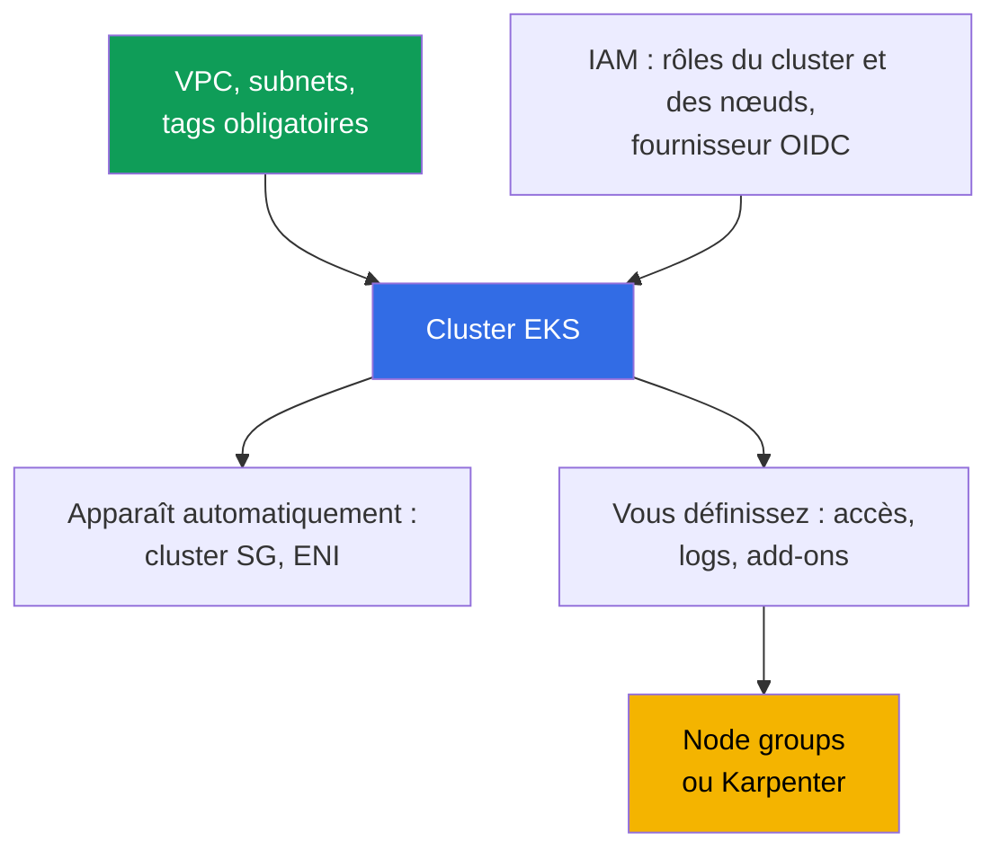
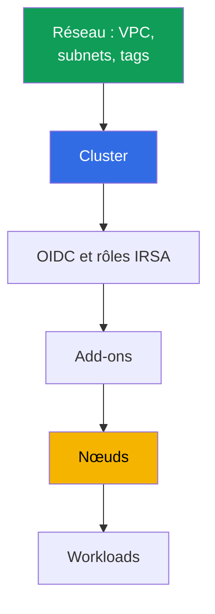

[Русская версия](ru.md) · [Eng version](en.md) · [Versión en español](es.md) · [Deutsche Version](de.md) · [ქართული ვერსია](ge.md) · [繁體中文版](tw.md) · [日本語版](jp.md)
# Chapitre 4. Création d'un cluster : eksctl, Terraform et Terragrunt, CloudFormation

> **La suite.** Le cluster est créé une fois, mais l'équipe vit avec pendant des années : le choix de l'outil détermine qui possède l'état de l'infrastructure et si la production peut être reproduite dans un autre compte. Ce chapitre couvre la composition du cluster (20 à 30 ressources, non un seul appel API), la comparaison d'eksctl, CloudFormation, Terraform et Terragrunt, l'ordre de création et les paramètres impossibles à modifier ensuite. L'accès est au chapitre 5, le réseau aux chapitres 6 et 7, les nœuds aux chapitres 9 à 12, les add-ons au chapitre 37.

## 4.1. Un cluster impossible à reproduire

Le cluster a été assemblé à la main dans la console, il fonctionne et les applications tournent. Le problème ne commence pas avec une panne, mais avec une demande ordinaire : « créez le même dans un nouveau compte pour une seconde région ».

- **Impossible à reproduire.** Personne ne se souvient des options de l'assistant : mode d'authentification, CIDR de l'endpoint public, ensemble des logs, CIDR personnalisé des services. Le second cluster sera différent.
- **Impossible à transmettre.** Un tag `kubernetes.io/role/internal-elb` est posé sur les subnets et personne ne sait pourquoi : il a été ajouté parce que le load balancer ne se créait pas.
- **Le propriétaire a quitté l'entreprise.** Le cluster a été créé par le rôle personnel d'un ingénieur, qui a obtenu les droits d'administrateur dans le cluster à la création (chapitre 5). L'ingénieur n'est plus dans l'entreprise.
- **Production et dev ont divergé.** En dev, l'endpoint public est ouvert au monde ; en production il est fermé. Les audit logs ne sont activés qu'en production. Personne ne peut énumérer les différences, et vérifier dev ne prouve rien.
- **Impossible à supprimer.** Le code Terraform existe, mais on ignore ce qu'il a créé et ce qui a été modifié à la main. `destroy` supprimera une moitié et laissera des orphelins : ENI, security group, rôles et load balancer avec DNS.

Le dénominateur commun : le cluster existe, mais sa **description n'existe pas**.

## 4.2. « Créer un cluster », ce sont 20 à 30 ressources

Un appel `CreateCluster` crée le control plane. Un cluster opérationnel demande beaucoup plus, et presque tout existe hors de l'objet cluster.



**Réseau.** VPC, au moins deux subnets dans des zones de disponibilité différentes, routes et NAT. Il faut aussi des tags, sans lesquels certaines fonctions échouent silencieusement : `kubernetes.io/role/elb` sur les subnets publics, `kubernetes.io/role/internal-elb` sur les privés, `karpenter.sh/discovery` avec le nom du cluster comme valeur pour Karpenter (chapitres 6, 12). **IAM.** Le rôle du cluster, le rôle des nœuds et le fournisseur IAM OIDC lié à l'issuer : sans lui, pas d'IRSA ni de contrôleurs accédant à l'API.

**Apparaît automatiquement :** ENI cross-account dans les subnets spécifiés (généralement 2 à 4) et cluster security group du type `eks-cluster-sg-<cluster>-<id>` (chapitre 2). Ils ne figurent pas dans votre code, mais sont dans le compte et survivront à un `destroy` imprudent. **Défini à la création :** `authenticationMode` (`API`, `API_AND_CONFIG_MAP` ou `CONFIG_MAP`), access entries et droits du créateur (chapitre 5), version Kubernetes et `supportType` (`STANDARD` ou `EXTENDED`, chapitre 3), endpoint et `publicAccessCidrs`, logs du control plane, add-ons, nœuds, StorageClass par défaut.

Le même minimum en termes de Terraform si vous écrivez les ressources brutes, sans module. C'est exactement ce qui est nécessaire pour que le control plane se crée et puisse lancer au moins un pod.

| Éléments | Terraform resource | Pourquoi c'est obligatoire |
|---|---|---|
| Control plane | `aws_eks_cluster` | le cluster : version, rôle, `vpc_config`, `kubernetes_network_config`, endpoint access, logs |
| Rôle du cluster | `aws_iam_role` + `aws_iam_role_policy_attachment` (`AmazonEKSClusterPolicy`) | sans lui EKS ne gère pas les ressources du compte |
| Rôle des nœuds | `aws_iam_role` + `aws_iam_role_policy_attachment` (`AmazonEKSWorkerNodePolicy`, `AmazonEKS_CNI_Policy`, `AmazonEC2ContainerRegistryReadOnly`) | le nœud ne s'enregistre pas et ne tire pas les images |
| OIDC pour IRSA | `aws_iam_openid_connect_provider` (+ `data.tls_certificate`) | sans lui, pas d'IRSA ni de contrôleurs accédant à l'API |
| Réseau | `aws_vpc`, `aws_subnet` (ou sources `data`), tags `kubernetes.io/role/*`, `aws_security_group` | subnets dans deux zones et SG nécessaires |
| Calcul | `aws_eks_node_group` ou `aws_eks_fargate_profile` | sinon aucun emplacement où lancer les pods ; dans les labs, système sur Fargate plus Karpenter |
| Add-ons | `aws_eks_addon` (`vpc-cni`, `coredns`, `kube-proxy`, `eks-pod-identity-agent`) | réseau des pods, DNS, kube-proxy, pod identity |
| Accès | `aws_eks_access_entry`, `aws_eks_access_policy_association` (ou ancien `aws-auth`) | sinon personne ne peut entrer dans le cluster sauf le créateur (chapitre 5) |

On peut écrire cela à la main, mais c'est coûteux et fragile : il est facile d'oublier un tag de subnet, une policy de rôle de nœud ou le lien OIDC avec le rôle ; le lien manquant ne se révélera pas au `apply`, mais plus tard par l'échec d'un pod. Cas particulier : sans nœuds, aucun pod ne peut être lancé, et sans `AmazonEKS_CNI_Policy` sur le rôle des nœuds, le nœud n'obtient pas d'IP et ne devient pas `Ready` (chapitre 45). Ces ressources sont donc rarement écrites une à une : on utilise un module prêt à l'emploi (section 4.7).

## 4.3. Comment créer un cluster : comparaison honnête

| Outil | Reproductibilité | Review | Dérive | Vitesse de démarrage | Propriétaire de l'état |
|---|---|---|---|---|---|
| Console AWS | non | rien à examiner | non suivie | minutes | personne |
| eksctl | partielle, via la config yaml | config dans git | ses stacks CloudFormation hors de votre IaC | la plus élevée | CloudFormation créé par eksctl |
| CloudFormation | oui | template dans git | drift detection par stack | moyenne | service CloudFormation |
| Terraform | oui | `plan` dans une pull request | visible dans `plan` | moyenne | votre state dans S3 |
| Terragrunt | oui, plus DRY pour les environnements | idem, `run-all plan` | idem, par stacks | moyenne | le même state, réparti en stacks |
| CDK, Pulumi | oui | code dans un langage de programmation | via CloudFormation ou leur state | moyenne | CloudFormation (CDK) ou backend Pulumi |
| Crossplane, ACK | oui, déclaratif dans le cluster | manifestes dans git | le contrôleur réconcilie en continu | faible au démarrage | management-cluster Kubernetes |

La **console** reste le meilleur outil de lecture, mais ne convient pas à la création de production : le résultat n'est pas décrit. **CDK et Pulumi** sont de l'infrastructure en TypeScript, Python ou Go : les abstractions et les types sont un avantage, mais il est facile d'obtenir une logique impérative là où il faut un diff prévisible. **Crossplane et ACK** décrivent les ressources AWS comme objets Kubernetes et les ramènent continuellement à l'état décrit, ce qui résout la dérive, mais ajoute la dépendance « un cluster gère un cluster » et la question de savoir qui crée le management-cluster (habituellement Terraform).

## 4.4. eksctl : excellente reconnaissance, mauvais propriétaire de production

eksctl crée un cluster avec une commande, et c'est sa vraie valeur.

```bash
# Cluster sans nœuds : control plane, VPC, rôles, kubeconfig en un seul appel
eksctl create cluster --name demo --region eu-central-1 --version 1.34 --without-nodegroup
eksctl get cluster --region eu-central-1      # ce qui existe dans la région
eksctl utils describe-stacks --cluster demo   # stacks CloudFormation dont il est propriétaire
```

**Son propre état.** eksctl conserve l'état dans des stacks CloudFormation qu'il crée lui-même (les noms commencent par `eksctl-`). L'infrastructure a deux propriétaires : votre Terraform state et des stacks externes que Terraform ignore. **Impératif.** Certaines opérations eksctl sont des actions plutôt qu'une description d'état souhaité : la réponse à « que va changer ceci ? » s'obtient en l'exécutant, non par un plan. **Frontières.** eksctl est bon juste dans les frontières du cluster, le reste vit dans votre IaC et la jonction des deux outils se fait sur le réseau et IAM. Il est irremplaçable pour explorer une fonction nouvelle, reproduire un bug et créer un cluster temporaire pour une journée : ce cluster est créé puis supprimé entièrement.

## 4.5. Terraform concrètement : state, stacks, poule et œuf

**State et verrouillage.** Le state est la carte de correspondance entre le code et les ressources réelles. Il réside dans S3, est versionné, et son écriture est verrouillée afin que deux `apply` simultanés ne s'écrasent pas. Le verrouillage du backend `s3` est assuré par une table DynamoDB (argument `dynamodb_table`) ; dans Terraform 1.10 et plus récent, le lockfile natif du bucket (`use_lockfile`) remplit le même rôle. Le state contient aussi des attributs sensibles : le bucket est donc chiffré, l'accès limité au rôle CI et le versioning activé avant le premier `apply`.

**Séparation en stacks.** Si tout est décrit dans un seul stack, modifier un tag de subnet exige un `plan` de toute l'infrastructure, et un `apply` raté dans les workloads bloque le réseau. La frontière est déterminée par la fréquence de changement et le propriétaire.

| Stack | Contenu | Fréquence de changement |
|---|---|---|
| Réseau | VPC, subnets, NAT, routes, tags | rare, changements douloureux |
| Cluster | control plane, rôles, endpoint, logs, version | rare, certains paramètres immuables |
| Plateforme | OIDC et rôles IRSA, add-ons, contrôleurs, StorageClass | moyenne, lors des mises à jour |
| Nœuds | node groups, launch templates, Karpenter NodePool | fréquente |
| Workloads | applications, leurs secrets et ingress | continue, généralement plus Terraform |

**La poule et l'œuf des providers.** Les providers `kubernetes` et `helm` se configurent avec l'endpoint et le CA d'un cluster spécifique. Si le cluster est décrit dans le même stack, ces valeurs n'existent pas encore au premier `plan` : Terraform échoue, ou pire planifie avec des valeurs vides. La règle est donc : **le cluster et les workloads ne sont pas décrits dans le même stack**. Les providers sont configurés dans le stack suivant pour un cluster existant, et les manifestes sont livrés par GitOps (chapitre 44). Second argument : Terraform possède mal les objets Kubernetes, et le `destroy` du stack de workloads arrête le service.

## 4.6. Terragrunt : DRY et dépendances entre stacks

Terragrunt ne remplace pas Terraform : il résout deux de ses faiblesses, la répétition de la configuration du backend et des variables dans chaque stack, et l'absence de liens entre stacks. Le répertoire d'un environnement contient `env.hcl` et un sous-répertoire par stack : `vpc`, `ssh-keys`, `eks_control_plane`, `eks_fargate_system`, `eks_addons`, `eks_karpenter`, `worker`. Dans chaque sous-répertoire, `terragrunt.hcl` indique `source` vers le module Terraform, lit `env.hcl` avec `read_terragrunt_config(find_in_parent_folders("env.hcl"))` et déclare les dépendances avec `dependency` : `eks_control_plane` dépend de `vpc` et prend `vpc_id` et les listes de subnets, `eks_addons` dépend de `eks_control_plane` et prend le nom du cluster.

Dans le `env.hcl` du lab 02 se trouvent les paramètres qui composent exactement le cluster : `region`, `vpc_default_cidr`, `stack_name`, les identifiants de l'environnement issus de `TF_VAR_USER_ID` et `TF_VAR_ENV_ID` (qui composent `env_name` pour éviter les conflits entre environnements d'étudiants), la carte `subnets` avec les subnets, leurs CIDR, zones, mode NAT et tags (`kubernetes.io/cluster/<env_name>` avec la valeur `owned`, `kubernetes.io/role/elb`, `kubernetes.io/role/internal-elb`, `karpenter.sh/discovery`), la version `k8_version`, le type de nœuds `node_type` aux valeurs `ondemand` ou `spot`, les types d'instances et les tags du propriétaire.

```bash
terragrunt run-all apply --terragrunt-parallelism=4  # destroy procède dans l'ordre inverse
terragrunt run-all output                            # sorties de tous les stacks
terragrunt init && terragrunt plan && terragrunt apply   # stack distinct
```

Le prix de cette commodité : une couche d'abstraction et des graphes de dépendances qui, mal conçus, transforment la modification d'un paramètre en recalcul de la moitié de l'environnement.

## 4.7. Module terraform-aws-eks : prise en charge, avantages, inconvénients, risques

Le minimum de la section 4.2 n'est presque jamais écrit avec des ressources brutes. La réponse standard de la communauté est le module `terraform-aws-eks` (la version 21.10.1 est figée dans les labs du cours). À partir de ses variables d'entrée, il assemble le control plane, les rôles IAM, le fournisseur OIDC, les security groups, node groups et Fargate profiles, les add-ons, soit ces 20 à 30 ressources et leurs liens.

| Avantages | Inconvénients et risques |
|---|---|
| couvre d'un coup 20 à 30 ressources et leurs liens | les versions majeures introduisent breaking changes et renommages de ressources |
| defaults raisonnables, moins de risque d'oublier un rôle, tag ou policy | les renommages exigent une migration du state : blocs `moved` ou `state mv` |
| prend en charge access entries, node groups, Fargate et add-ons | l'abstraction cache des détails : plus difficile de savoir ce qui est réellement créé |
| un module pour tous les clusters, plus un fichier de paramètres | la mise à niveau du module peut planifier le replace du cluster ou des nœuds |
| maintenance active par la communauté | une partie reste à votre charge : VPC, accès, certains add-ons |

Le risque principal est la mise à niveau. Lors d'un changement majeur, le module modifie des noms internes de ressources et le `plan` affiche un replace là où les données doivent survivre : le cluster lui-même ou le node group. La version est donc verrouillée strictement (`version = "21.10.1"`, non une plage) ; avant un bump, lisez le CHANGELOG et le guide d'upgrade, puis examinez les lignes de replace dans le `plan`, et non seulement le total.

Autres règles d'hygiène. Ne mélangez pas la gestion d'un add-on par le module et manuellement : un add-on doit avoir un seul propriétaire (section 4.10). Surveillez l'entrée `enable_cluster_creator_admin_permissions` : elle détermine les droits du créateur dans le cluster (section 4.9 et chapitre 5). Souvenez-vous de la frontière : le module crée l'infrastructure, mais ce n'est pas GitOps ; les upgrades de Kubernetes et des add-ons restent une opération distincte avec leur ordre (chapitres 38 et 39). Distinguez aussi les versions : la version du module `terraform-aws-eks` n'est pas la version Kubernetes. Un bump de module ne met pas le cluster à niveau ; la version Kubernetes est une entrée distincte, et les changements de defaults entre versions du module apparaissent dans le `plan` comme dérive ou recréation (section 4.10).

## 4.8. Ordre de création et ce qui ne changera plus

L'ordre est imposé par les dépendances : chaque étape requiert les sorties de la précédente.



Deux points font trébucher. Les add-ons tels que `vpc-cni` et `coredns` sont installés avant les nœuds : `coredns` reste `Pending` sans nœud, mais le CNI doit être prêt quand un nœud demande une IP. Les contrôleurs accédant à l'AWS API ont besoin du fournisseur OIDC avant eux, sinon leur pod passe en `CrashLoopBackOff`.

Voici l'irréversibilité : le coût d'une erreur dans cette liste est la recréation du cluster.

| Paramètre | Peut-il changer sur un cluster vivant ? |
|---|---|
| `ipFamily` (`ipv4` ou `ipv6`) | non, défini uniquement à la création |
| `serviceIpv4Cidr` (CIDR des services) | non, un bloc personnalisé est défini uniquement à la création |
| VPC du cluster | non, les subnets doivent rester dans le même VPC |
| Nom du cluster, rôle IAM du cluster | non, `update-cluster-config` ne contient pas ces champs |
| Chiffrement des secrets avec une clé KMS | peut être activé sur un cluster existant, jamais désactivé |
| Subnets et security groups | oui, au moins deux subnets dans des zones distinctes, même VPC |
| Endpoint public et privé, `publicAccessCidrs` | oui |
| Logs du control plane, `deletionProtection` | oui |
| `authenticationMode` | oui, vers API (chapitre 5) |
| Version Kubernetes et `supportType` | oui, version vers l'avant, un mineur à la fois (chapitre 3) |

Avant le premier `apply` dans un compte nouveau, vérifiez les cinq premières lignes. Par défaut, `serviceIpv4Cidr` est pris dans `10.100.0.0/16` ou `172.20.0.0/16`, et si l'un de ces blocs est occupé dans un réseau lié, le problème apparaîtra plus tard, lorsqu'un ClusterIP ne répondra pas via VPN (chapitres 6 et 7).

```bash
# Création directe du cluster via API : mêmes champs que tout IaC définit
aws eks create-cluster --name demo --kubernetes-version 1.34 \
  --role-arn arn:aws:iam::111122223333:role/eksClusterRole \
  --resources-vpc-config subnetIds=subnet-aaa,subnet-bbb,endpointPublicAccess=false

aws eks describe-cluster --name demo --query 'cluster.{v:version,acc:accessConfig}'
```

## 4.9. Qui crée le cluster : droits et protection

**Le cluster est créé par un rôle CI, non par une personne.** Ce n'est pas une question de discipline : le principal IAM qui crée le cluster reçoit les droits d'administrateur dans celui-ci, car `bootstrapClusterCreatorAdminPermissions` vaut `true` par défaut. Si le cluster est créé par le rôle personnel d'un ingénieur, son accès administrateur demeure pour toujours et ne peut être retiré via IAM : l'enregistrement vit dans la configuration d'accès du cluster. Définissez le flag à `false` (dans `aws eks create-cluster`, `--access-config bootstrapClusterCreatorAdminPermissions=false` ; dans eksctl, `--bootstrap-cluster-creator-admin-permissions false` ou le même champ dans `accessConfig` ; dans `terraform-aws-eks`, l'entrée booléenne `enable_cluster_creator_admin_permissions = false`, que le module mappe vers `bootstrapClusterCreatorAdminPermissions` de `accessConfig`) et créez explicitement les accès via access entries (dans le module, entrée `access_entries`) : les droits sont alors décrits par le code, non par l'historique de création. Le rôle créateur est nécessaire une seule fois pour `create-cluster`; l'administration ultérieure utilise des rôles distincts définis dans les access entries, afin que les droits ne soient pas hérités de l'historique. L'option est disponible sur les clusters EKS 1.23 et plus récents avec le mode `API` (chapitre 5).

**Droits du rôle CI lui-même.** Créer le cluster requiert de larges droits : EKS, IAM (rôles et fournisseur OIDC), EC2, souvent KMS et CloudWatch Logs. Ce rôle n'est pas accordé aux personnes : il est assumé par le pipeline, limité par la confiance envers le dépôt et la branche, et visible dans CloudTrail (chapitres 0.2 et 21).

**Secrets et protection contre la suppression.** Le bucket de state est chiffré et versionné, seul le rôle CI y accède, le state n'est jamais dans git, `terraform output` contenant des secrets n'est pas imprimé dans les logs du pipeline. `deletionProtection` empêche la suppression du cluster ; côté Terraform, `prevent_destroy` dans `lifecycle` joue le même rôle, et côté processus, des pipelines distincts et la lecture du plan.

## 4.10. Dérive : pourquoi `plan` montre ce que vous n'avez pas fait

Après sa création, le cluster change sans vous : AWS ajoute des tags de service, EKS modifie les règles du cluster SG, les contrôleurs créent load balancers, target groups et enregistrements DNS.

| Source de modification | Aspect dans `plan` | Que faire |
|---|---|---|
| Tags de service AWS et EKS | tentative de supprimer les tags « superflus » | les exclure avec `ignore_changes` |
| Règles du cluster security group | modification de règles que vous n'avez pas écrites | ne pas décrire ce SG dans le code, référencer son id |
| Load balancers de AWS Load Balancer Controller | pas de ressources dans le state, mais présentes dans le compte | propriétaire : contrôleur, pas Terraform (chapitre 26) |
| Enregistrements Route 53 de external-dns | zone dans votre code, pas l'enregistrement | zone dans Terraform, enregistrements dans external-dns (chapitre 29) |
| Modifications manuelles dans la console, y compris les versions d'add-ons | retour aux valeurs du code | restaurer par le code, versions d'add-ons dans le code (chapitre 37) |

La discipline se résume à une règle : chaque ressource a un seul propriétaire. Si un contrôleur crée une ressource, Terraform l'ignore ; si Terraform la crée, on ne la modifie pas dans la console. Un `plan` régulier planifié transforme la dérive en tâche ordinaire au lieu d'une surprise.

## 4.11. Parc de clusters : un module, paramètres différents

Au-delà de trois clusters, le coût des divergences croît plus vite que leur nombre : une vérification ne se transfère plus d'un cluster à l'autre. Un schéma fonctionne : **un module pour tous les clusters plus un fichier de paramètres par environnement**. Le module porte la logique (ensemble de ressources, tags, dépendances), le fichier d'environnement les différences : région, CIDR, version Kubernetes, `supportType`, tailles de nœuds, add-ons, flags d'endpoint. Un bon repère pour l'intérieur d'un tel module est le `terraform-aws-eks` public de la communauté : il est découpé en sous-modules (cluster, node groups, rôles IRSA, access entries) et ne résout pas pour vous le stockage du state, donc le backend distant S3 avec verrouillage reste à votre charge. Une modification est apportée une fois puis déployée dans l'ordre dev, stage, production ; la différence entre environnements se lit comme le diff de deux fichiers ; le passage à extended support est visible dans la PR, non dans la facture (chapitre 3).

## 4.12. Application en production

- **Le cluster est créé par un pipeline.** Rôle CI, confiance dans un dépôt précis, `plan` dans la pull request, `apply` après review. Les rôles personnels créent uniquement des clusters temporaires de reconnaissance.
- **Les stacks sont séparés** en réseau, cluster, plateforme et nœuds ; les workloads vivent en GitOps, et les providers `kubernetes` et `helm` se configurent sur un cluster existant.
- **`bootstrapClusterCreatorAdminPermissions` est consciemment désactivé**, l'accès administrateur est décrit par des access entries dans le code (chapitre 5).
- **State dans S3** avec versioning, chiffrement et verrouillage, accessible seulement au CI ; `deletionProtection` et `prevent_destroy` en production ; eksctl réservé à la reconnaissance ; un `plan` non vide sans pull request ouverte est un incident de processus, non un détail.

## 4.13. Mini-glossaire

- **State** : fichier de correspondance entre le code Terraform et les ressources réelles ; conservé dans S3 avec versioning et verrouillage d'écriture. **Dérive** : écart entre le code et l'état réel de l'infrastructure.
- **Stack** : unité d'infrastructure appliquée indépendamment avec son propre state ; une **dépendance entre stacks** transmet ses sorties aux entrées d'un autre stack (bloc `dependency` dans Terragrunt).
- **`bootstrapClusterCreatorAdminPermissions`** : champ de configuration d'accès à la création ; quand il vaut `true` (par défaut), le créateur du cluster reçoit les droits administrateur dans celui-ci (chapitre 5).
- **`authenticationMode`** : mode d'authentification : `API`, `API_AND_CONFIG_MAP`, `CONFIG_MAP`. **`deletionProtection`** : flag interdisant la suppression du cluster. **Paramètre immutable** : `ipFamily`, `serviceIpv4Cidr` personnalisé, VPC, nom et rôle IAM du cluster.

## 4.14. Résumé du chapitre

- « Créer un cluster » consiste à décrire 20 à 30 ressources : réseau avec tags, rôles IAM, fournisseur OIDC, configuration d'accès, add-ons, nœuds, StorageClass. Un appel API ne fournit que le control plane ; le cluster SG et les ENI cross-account apparaissent seuls.
- Les outils ne diffèrent pas par leur syntaxe mais par la réponse à « qui possède l'état ? » : personne pour la console, les propres stacks CloudFormation d'eksctl, votre state pour Terraform et Terragrunt, le contrôleur du management-cluster pour Crossplane et ACK. eksctl est bon pour la reconnaissance et mauvais propriétaire de production : impératif, son propre état, jonction avec votre IaC sur le réseau et IAM.
- Le cluster et les workloads ne sont pas décrits dans le même stack : les providers `kubernetes` et `helm` ne peuvent pas être configurés sur un cluster qui n'existe pas encore. La séparation est réseau, cluster, plateforme, nœuds ; Terragrunt élimine la répétition de configuration et déduit l'ordre d'application du graphe.
- Ordre : réseau, cluster, OIDC et rôles, add-ons, nœuds, workloads. `ipFamily`, `serviceIpv4Cidr` personnalisé, VPC, nom et rôle du cluster sont choisis définitivement ; le chiffrement KMS des secrets peut être activé sur un cluster vivant, jamais désactivé.
- Un rôle CI crée le cluster, pas une personne : le créateur obtient des droits administrateur dans le cluster. La dérive est inévitable parce que certaines ressources ont légitimement un propriétaire autre que Terraform : elle se traite par un seul propriétaire par ressource et un `plan` planifié régulièrement.

## 4.15. Utilité dans le travail réel

La question « combien de temps faut-il pour créer le même cluster dans un nouveau compte ? » devient vérifiable : soit vous avez un module et un fichier de paramètres, et la réponse se mesure en heures, soit vous n'avez pas de réponse. La différence entre dev et production devient le diff de deux fichiers, et l'analyse d'un incident consiste à lire l'historique de la pull request. Des stacks bien séparés rendent sûr ce qui serait autrement inquiétant : modifier le réseau sous le cluster ou mettre à jour un add-on sans toucher au control plane.

## 4.16. Questions d'auto-évaluation

1. Énumérez les ressources nécessaires à un cluster en plus de l'objet cluster lui-même.
2. Quels tags sur les subnets sont obligatoires et qu'est-ce qui cesse de fonctionner sans chacun d'eux ?
3. Pourquoi un cluster créé par eksctl a-t-il deux propriétaires de state, et quand eksctl reste-t-il approprié ?
4. Pourquoi les providers `kubernetes` et `helm` ne peuvent-ils pas être configurés dans le même stack que le cluster ?
5. Comment répartiriez-vous l'infrastructure en stacks et selon quel critère ?
6. Que fournit Terragrunt au-dessus de Terraform, et quel prix payez-vous pour cela ?
7. Quels paramètres du cluster ne sont pas modifiables après création, et peut-on désactiver le chiffrement KMS ?
8. Que fait `bootstrapClusterCreatorAdminPermissions` et pourquoi est-ce important lors de la création ?
9. `plan` montre des modifications que vous n'avez pas faites. Comment déterminer qui les a faites ?
10. Le parc comprend dix clusters, tous différents. Par quoi commenceriez-vous pour les ramener à un module commun ?

## Pratique

Le lab associé à ce thème : [lab 101 - cluster as code](../../labs/101/README_FR.MD). Il déploie un cluster avec Terragrunt (vpc, control plane, add-ons, Karpenter, machine de travail), explique la séparation entre le control plane et votre zone de responsabilité, et se vérifie avec `check_result`. Exécution : `TASK=101 make run_eks_task`.

Pour un cluster de reconnaissance ponctuel (section 4.4), les ressources AWS officielles proposent : un scénario eksctl pas à pas pour créer, examiner et supprimer un cluster, le guide eksctl complet avec fichier de configuration et add-ons, et un workshop AWS avec des labs sur un cluster prêt.

```bash
# Get started with Amazon EKS - eksctl: cluster et nœuds en un passage, puis suppression
# https://docs.aws.amazon.com/eks/latest/userguide/getting-started-eksctl.html

# Eksctl User Guide: installation, cluster depuis la config yaml, add-ons, Auto Mode
# https://docs.aws.amazon.com/eks/latest/eksctl/tutorial.html

# EKS Workshop (dépôt aws-samples/eks-workshop-v2): labs sur un cluster prêt
# https://www.eksworkshop.com/
```

Ce cluster est créé puis supprimé entièrement, tandis que la production reste dans votre IaC : deux propriétaires de state expliquent pourquoi eksctl reste un outil de reconnaissance, et non de production.

Outre le lab, le contenu du chapitre se vérifie sur n'importe quel cluster. Prenez `aws eks describe-cluster --name <cluster>` et relevez tout ce qui relève de la création : `version`, `roleArn`, `resourcesVpcConfig` (subnets, security groups, flags d'endpoint), ainsi que `kubernetesNetworkConfig`, `accessConfig`, `logging`, `encryptionConfig` et `upgradePolicy`. Recherchez chaque valeur dans votre IaC : ce qui est dans la sortie mais non dans le code est de la dette technique. Comparez utilement les tags des subnets fournis par `aws ec2 describe-subnets` avec le code et trouvez dans le compte le cluster security group de forme `eks-cluster-sg-<cluster>-<id>`.

Les environnements de lab du dépôt sont assemblés avec Terragrunt et se lisent comme exemple de séparation en stacks. Dans le lab 02 se trouvent les répertoires `vpc`, `ssh-keys`, `eks_control_plane`, `eks_fargate_system`, `eks_addons`, `eks_karpenter` et `worker` : chacun possède son `terragrunt.hcl` référant un module et des blocs `dependency` (`eks_control_plane` dépend de `vpc`, et `eks_addons` de `eks_control_plane` et `eks_fargate_system`). Les paramètres d'environnement sont réunis dans un seul `env.hcl`.

---
[Sommaire](../README_FR.md) · [Chapitre 3](../03/fr.md) · [Chapitre 5](../05/fr.md)
