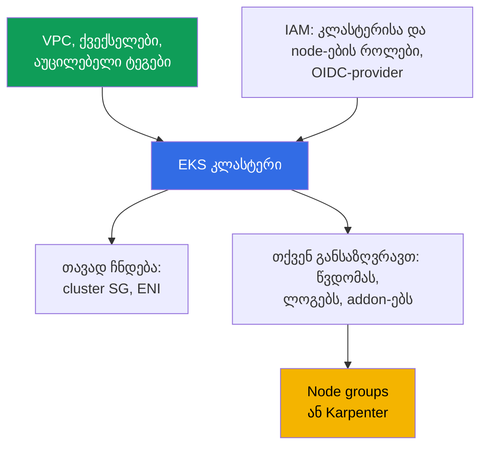
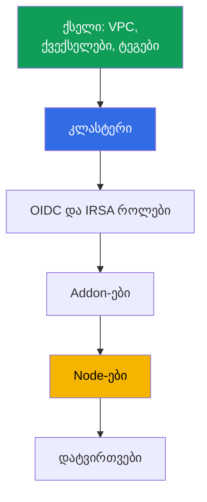

[Русская версия](ru.md) · [Eng version](en.md) · [Versión en español](es.md) · [Version française](fr.md) · [Deutsche Version](de.md) · [繁體中文版](tw.md) · [日本語版](jp.md)
# თავი 4. კლასტერის შექმნა: eksctl, Terraform და Terragrunt, CloudFormation

> **რა გველოდება შემდეგ.** კლასტერი ერთხელ იქმნება, მაგრამ გუნდს მასთან წლები უწევს ცხოვრება, ამიტომ ინსტრუმენტის არჩევა ნიშნავს გადაწყვეტილებას, ვინ ფლობს ინფრასტრუქტურის მდგომარეობას და შესაძლებელია თუ არა production-ის გამეორება სხვა ანგარიშში. თავი ეხება კლასტერის შემადგენლობას (ეს 20-30 რესურსია და არა ერთი API გამოძახება), eksctl-ის, CloudFormation-ის, Terraform-ისა და Terragrunt-ის შედარებას, შექმნის რიგს და პარამეტრებს, რომელთა შეცვლაც მოგვიანებით შეუძლებელია. წვდომა - თავი 5, ქსელი - თავები 6 და 7, node-ები - თავები 9-12, addon-ები - თავი 37.

## 4.1. კლასტერი, რომლის გამეორებაც შეუძლებელია

კლასტერი კონსოლში ხელით ააწყვეს, მუშაობს და აპლიკაციებიც მუშაობენ. პრობლემა არა ავარიით, არამედ ჩვეულებრივი თხოვნით იწყება: „იმავე ტიპის კლასტერი ახალ ანგარიშში, მეორე რეგიონისთვის ააწყვეთ“.

- **გამეორება შეუძლებელია.** არავის ახსოვს wizard-ში მონიშნული პარამეტრები: ავთენტიკაციის რეჟიმი, საჯარო endpoint-ის CIDR, ლოგების ნაკრები, სერვისების მორგებული CIDR. მეორე კლასტერი განსხვავებული გამოვა.
- **გადაცემა შეუძლებელია.** ქვექსელებზე ტეგი `kubernetes.io/role/internal-elb` კიდია და კითხვაზე „რატომ“ პასუხი არ არსებობს: დააყენეს, რადგან load balancer არ იქმნებოდა.
- **მფლობელი წავიდა.** კლასტერი ინჟინრის პერსონალური როლით შეიქმნა და ამ როლმა შექმნისას კლასტერში ადმინისტრატორის უფლებები მიიღო (თავი 5). ინჟინერი კომპანიაში აღარ მუშაობს.
- **Production და dev განსხვავდება.** dev-ში საჯარო endpoint ღიაა მთელი სამყაროსთვის, production-ში დახურულია; audit log-ები მხოლოდ production-შია ჩართული. განსხვავებებს ვერავინ ჩამოთვლის, ამიტომ dev-ზე შემოწმება არაფერს ამტკიცებს.
- **წაშლა შეუძლებელია.** Terraform-ის კოდი არსებობს, მაგრამ გაუგებარია, რა შეიქმნა მისით და რა შეიცვალა ხელით. `destroy` ნახევარს წაშლის და orphan-ებს დატოვებს: ENI, security group, როლებს, DNS-იანი load balancer-ს.

საერთო მნიშვნელი: კლასტერი არსებობს, მაგრამ **კლასტერის აღწერა არ არსებობს**.

## 4.2. „კლასტერის შექმნა“ 20-30 რესურსია

ერთი `CreateCluster` გამოძახება ქმნის control plane-ს. სამუშაო კლასტერისთვის მნიშვნელოვნად მეტია საჭირო და თითქმის ყველაფერი cluster ობიექტის გარეთ არსებობს.



**ქსელი.** VPC, მინიმუმ ორი ქვექსელი ხელმისაწვდომობის სხვადასხვა ზონაში, მარშრუტები, NAT. ასევე ტეგები, რომელთა გარეშეც ზოგი ფუნქცია ჩუმად არ მუშაობს: `kubernetes.io/role/elb` საჯარო ქვექსელებზე, `kubernetes.io/role/internal-elb` კერძო ქვექსელებზე, `karpenter.sh/discovery` კლასტერის სახელის მნიშვნელობით Karpenter-ისთვის (თავები 6, 12). **IAM.** კლასტერის როლი, node-ების როლი და issuer-თან მიბმული IAM OIDC-provider: მის გარეშე არ არის IRSA და API-ზე წვდომის მქონე controller-ები არ მუშაობს.

**თავად ჩნდება:** მითითებულ ქვექსელებში cross-account ENI (ჩვეულებრივ 2-4) და `eks-cluster-sg-<cluster>-<id>` სახის cluster security group (თავი 2). ისინი თქვენს კოდში არ არის, მაგრამ ანგარიშში არსებობს და დაუდევარ `destroy`-ს გადაურჩება. **შექმნისას განისაზღვრება:** `authenticationMode` (`API`, `API_AND_CONFIG_MAP` ან `CONFIG_MAP`), access entry-ები და შემქმნელის უფლებები (თავი 5), Kubernetes-ის ვერსია და `supportType` (`STANDARD` ან `EXTENDED`, თავი 3), endpoint და `publicAccessCidrs`, control plane-ის ლოგები, addon-ები, node-ები, ნაგულისხმევი StorageClass.

იგივე მინიმუმი Terraform-ის ტერმინებით, თუ მოდულის გარეშე ნედლ რესურსებს წერთ. ეს ზუსტად ისაა, რის გარეშეც control plane ან ვერ შეიქმნება, ან ერთ pod-საც ვერ გაუშვებს.

| რა | Terraform resource | რატომ არის სავალდებულო |
|---|---|---|
| Control plane | `aws_eks_cluster` | თავად კლასტერი: ვერსია, როლი, `vpc_config`, `kubernetes_network_config`, endpoint access, ლოგები |
| კლასტერის როლი | `aws_iam_role` + `aws_iam_role_policy_attachment` (`AmazonEKSClusterPolicy`) | მის გარეშე EKS ანგარიშში რესურსებს ვერ მართავს |
| Node-ების როლი | `aws_iam_role` + `aws_iam_role_policy_attachment` (`AmazonEKSWorkerNodePolicy`, `AmazonEKS_CNI_Policy`, `AmazonEC2ContainerRegistryReadOnly`) | node ვერ დარეგისტრირდება და image-ებს ვერ ჩამოტვირთავს |
| OIDC IRSA-სთვის | `aws_iam_openid_connect_provider` (+ `data.tls_certificate`) | მის გარეშე არ არის IRSA და API-ზე წვდომის controller-ები |
| ქსელი | `aws_vpc`, `aws_subnet` (ან `data`-წყაროები), ტეგები `kubernetes.io/role/*`, `aws_security_group` | საჭიროა ქვექსელები ორ ზონაში და SG |
| გამოთვლითი რესურსები | `aws_eks_node_group` ან `aws_eks_fargate_profile` | სხვაგვარად pod-ების გასაშვები ადგილი არ არის; ლაბებში სისტემური კომპონენტები Fargate-ზეა, დამატებით Karpenter |
| Addon-ები | `aws_eks_addon` (`vpc-cni`, `coredns`, `kube-proxy`, `eks-pod-identity-agent`) | pod-ების ქსელი, DNS, kube-proxy, pod identity |
| წვდომა | `aws_eks_access_entry`, `aws_eks_access_policy_association` (ან მოძველებული `aws-auth`) | სხვაგვარად კლასტერში შემქმნელის გარდა ვერავინ შევა (თავი 5) |

ამის ხელით დაწერა შეიძლება, მაგრამ ძვირი და მყიფეა: ადვილად დაგავიწყდებათ ქვექსელის ტეგი, node-ის როლის პოლიტიკა ან OIDC-ის როლთან კავშირი, ხოლო გამოტოვებული კავშირი `apply`-ზე კი არა, მოგვიანებით pod-ის უარით გამოჩნდება. კერძო შემთხვევა: node-ების გარეშე pod-ების გასაშვები ადგილი არ არის, ხოლო node-ის როლში `AmazonEKS_CNI_Policy`-ის გარეშე node IP-ს ვერ მიიღებს და `Ready` არ გახდება (თავი 45). ამიტომ ამ რესურსებს იშვიათად წერენ თითო-თითოდ, ჩვეულებრივ მზა მოდულს იყენებენ (ნაწილი 4.7).

## 4.3. რით ქმნიან კლასტერს: გულწრფელი შედარება

| ინსტრუმენტი | განმეორებადობა | Review | დრიფტი | დაწყების სიჩქარე | ვინ ფლობს მდგომარეობას |
|---|---|---|---|---|---|
| AWS Console | არა | სანახავი არაფერია | არ კონტროლდება | წუთები | არავინ |
| eksctl | ნაწილობრივი, yaml-კონფიგის მეშვეობით | კონფიგი git-ში | საკუთარი CloudFormation stack-ები თქვენი IaC-ის გარეთ | ყველაზე მაღალი | eksctl-ის მიერ შექმნილი CloudFormation |
| CloudFormation | დიახ | template git-ში | stack-ის drift detection | საშუალო | CloudFormation სერვისი |
| Terraform | დიახ | `plan` pull request-ში | ჩანს `plan`-ში | საშუალო | თქვენი state S3-ში |
| Terragrunt | დიახ, დამატებით გარემოებისთვის DRY | იგივე, `run-all plan` | იგივე, stack-ების მიხედვით | საშუალო | იგივე state, stack-ებად დაყოფილი |
| CDK, Pulumi | დიახ | პროგრამირების ენის კოდი | CloudFormation-ით ან საკუთარი state-ით | საშუალო | CloudFormation (CDK) ან Pulumi backend |
| Crossplane, ACK | დიახ, კლასტერის დეკლარაციულად | manifest-ები git-ში | controller უწყვეტად არეკონსილიებს | დასაწყისში დაბალი | management-კლასტერი Kubernetes |

**კონსოლი** საუკეთესო ინსტრუმენტად რჩება წასაკითხად, თუმცა production-ის შესაქმნელად გამოუსადეგარია: შედეგი აღწერილი არაა. **CDK და Pulumi** ინფრასტრუქტურაა TypeScript-ზე, Python-ზე ან Go-ზე: უპირატესობაა ჩვეულებრივი აბსტრაქციები და ტიპები, ნაკლი კი ის, რომ ადვილად მიიღებთ იმპერატიულ ლოგიკას იქ, სადაც პროგნოზირებადი diff გჭირდებათ. **Crossplane და ACK** AWS რესურსებს Kubernetes ობიექტებად აღწერს და უწყვეტად მოჰყავს ისინი აღწერილ მდგომარეობაში, რაც დრიფტს აგვარებს, მაგრამ ამატებს დამოკიდებულებას „კლასტერი კლასტერს მართავს“ და კითხვას, ვინ ქმნის management-კლასტერს (ჩვეულებრივ Terraform).

## 4.4. eksctl: შესანიშნავი დაზვერვა, ცუდი production-ის მფლობელი

ექსკლ ერთი ბრძანებით ქმნის კლასტერს, და ესაა მისი ნამდვილი ღირებულება.

```bash
# კლასტერი node-ების გარეშე: control plane, VPC, როლები, kubeconfig - ერთი გამოძახებით
eksctl create cluster --name demo --region eu-central-1 --version 1.34 --without-nodegroup
eksctl get cluster --region eu-central-1      # ზოგადად რა არის რეგიონში
eksctl utils describe-stacks --cluster demo   # CloudFormation stack-ები, რომლებსაც ის ფლობს
```

**საკუთარი მდგომარეობა.** eksctl მდგომარეობას თავად შექმნილ CloudFormation stack-ებში ინახავს (სახელები იწყება `eksctl-`-ით). ინფრასტრუქტურას ორი მფლობელი ჰყავს: თქვენი Terraform state და სხვა stack-ები, რომელთა შესახებ Terraform-მა არაფერი იცის. **იმპერატიულობა.** eksctl-ის ოპერაციების ნაწილი მოქმედებაა და არა სასურველი მდგომარეობის აღწერა: კითხვაზე „რა შეიცვლება“ პასუხი გაშვებით მიიღება და არა plan-ით. **საზღვრები.** eksctl ზუსტად კლასტერის საზღვრებშია კარგი, დანარჩენი კი თქვენს IaC-ში ცხოვრობს; ორი ინსტრუმენტის გადაკვეთა ქსელსა და IAM-ზეა. ის შეუცვლელია ახალი ფუნქციის დაზვერვისთვის, ბაგის გამეორებისთვის და ერთდღიანი დროებითი კლასტერისთვის: ასეთ კლასტერს მთლიანად ქმნიან და შლიან.

## 4.5. Terraform არსებითად: state, stack-ები, ქათამი და კვერცხი

**State და ბლოკირება.** State არის შესაბამისობის რუკა კოდსა და რეალურ რესურსებს შორის. ის S3-ში ინახება, ვერსიონირდება, ხოლო ჩაწერა ბლოკირდება, რათა ორმა ერთდროულმა `apply`-მ ერთმანეთი არ გადაწეროს. `s3` backend-ში ბლოკირებას DynamoDB ცხრილი უზრუნველყოფს (`dynamodb_table` არგუმენტი); Terraform 1.10-სა და უფრო ახალ ვერსიებში იმავე როლს bucket-ში არსებული native lockfile ასრულებს (`use_lockfile`). State მგრძნობიარე ატრიბუტებსაც შეიცავს, ამიტომ bucket იშიფრება, წვდომა CI-ის როლამდე იზღუდება, ხოლო ვერსიონირება პირველ `apply`-მდე ირთვება.

**Stack-ებად დაყოფა.** თუ ყველაფერს ერთ stack-ში აღწერთ, ქვექსელის ტეგის ცვლილება მთელ ინფრასტრუქტურაზე `plan`-ს მოითხოვს, ხოლო დატვირთვებზე წარუმატებელი `apply` ქსელს ბლოკავს. საზღვარი ცვლილების სიჩქარესა და მფლობელზე გადის.

| Stack | რა შედის | რამდენად ხშირად იცვლება |
|---|---|---|
| ქსელი | VPC, ქვექსელები, NAT, მარშრუტები, ტეგები | იშვიათად, ცვლილებები მტკივნეულია |
| კლასტერი | control plane, როლები, endpoint, ლოგები, ვერსია | იშვიათად, პარამეტრების ნაწილი immutable-ია |
| პლატფორმა | OIDC და IRSA როლები, addon-ები, controller-ები, StorageClass | საშუალოდ, განახლებებისას |
| Node-ები | node group-ები, launch template-ები, Karpenter NodePool | ხშირად |
| დატვირთვები | აპლიკაციები, მათი secret-ები და ingress | მუდმივად, როგორც წესი უკვე არა Terraform |

**ქათამი და კვერცხი provider-ებთან.** `kubernetes` და `helm` provider-ები კონკრეტული კლასტერის endpoint-სა და CA-ზე კონფიგურდება. თუ კლასტერი იმავე stack-შია აღწერილი, პირველ `plan`-ზე ეს მნიშვნელობები ჯერ არ არსებობს: Terraform ან ვარდება, ან, უარესი, ცარიელი მნიშვნელობებით წარმატებით გეგმავს. აქედან წესი: **კლასტერი და დატვირთვები ერთ stack-ში არ აღწეროთ**. Provider-ები შემდეგ stack-ში უკვე არსებულ კლასტერზე კონფიგურდება, ხოლო manifest-ები GitOps-ში მიდის (თავი 44). მეორე არგუმენტია: Terraform Kubernetes ობიექტებს ცუდად ფლობს, ხოლო დატვირთვების stack-ის `destroy` სერვისს აჩერებს.

## 4.6. Terragrunt: DRY და დამოკიდებულებები stack-ებს შორის

Terragrunt Terraform-ს არ ანაცვლებს, არამედ მის ორ სისუსტეს აგვარებს: backend-ის კონფიგურაციისა და ცვლადების გამეორებას ყველა stack-ში და stack-ებს შორის კავშირების არქონას. გარემოს კატალოგი შეიცავს `env.hcl`-ს და თითო stack-ის ქვეკატალოგს: `vpc`, `ssh-keys`, `eks_control_plane`, `eks_fargate_system`, `eks_addons`, `eks_karpenter`, `worker`. თითო ქვეკატალოგში `terragrunt.hcl` მიუთითებს Terraform მოდულის `source`-ზე, კითხულობს `env.hcl`-ს `read_terragrunt_config(find_in_parent_folders("env.hcl"))`-ით და `dependency` ბლოკით აცხადებს დამოკიდებულებებს: `eks_control_plane` დამოკიდებულია `vpc`-ზე და იღებს `vpc_id`-სა და ქვექსელების სიებს, `eks_addons` კი `eks_control_plane`-ზეა დამოკიდებული და კლასტერის სახელს იღებს.

02 ლაბის `env.hcl`-ში თავმოყრილია ზუსტად ის პარამეტრები, რომელთაგანაც კლასტერი შედგება: `region`, `vpc_default_cidr`, `stack_name`, გარემოს იდენტიფიკატორები `TF_VAR_USER_ID`-დან და `TF_VAR_ENV_ID`-დან (მათგან იგება `env_name`, რათა სტუდენტების გარემოები ერთმანეთს არ შეეჯახოს), რუკა `subnets` ქვექსელებით, მათი CIDR-ებით, ზონებით, NAT რეჟიმითა და ტეგებით (`kubernetes.io/cluster/<env_name>` მნიშვნელობით `owned`, `kubernetes.io/role/elb`, `kubernetes.io/role/internal-elb`, `karpenter.sh/discovery`), ვერსია `k8_version`, node-ის ტიპი `node_type` მნიშვნელობებით `ondemand` ან `spot`, instance-ის ტიპები და მფლობელის ტეგები.

```bash
terragrunt run-all apply --terragrunt-parallelism=4  # destroy საპირისპირო რიგით მიდის
terragrunt run-all output                            # ყველა stack-ის output-ები
terragrunt init && terragrunt plan && terragrunt apply   # ცალკე stack
```

მოხერხებულობის ფასი არის კიდევ ერთი აბსტრაქციის ფენა და დამოკიდებულებების გრაფები, რომლებიც დაუდევარი დაპროექტებისას ერთი პარამეტრის ცვლილებას გარემოს ნახევრის ხელახალ გამოთვლად აქცევს.

## 4.7. terraform-aws-eks მოდული: რას იღებს თავის თავზე, უპირატესობები, ნაკლოვანებები, რისკები

ნაწილი 4.2-ის მინიმუმს თითქმის არასოდეს წერენ ნედლი რესურსებით. საზოგადოების სტანდარტული პასუხია `terraform-aws-eks` მოდული (კურსის ლაბებში დაფიქსირებულია ვერსია 21.10.1). შეყვანის ცვლადების ნაკრებიდან ის აწყობს control plane-ს, IAM როლებს, OIDC-provider-ს, security group-ებს, node group-ებსა და Fargate profile-ებს, addon-ებს, ანუ იმავე 20-30 რესურსსა და მათ კავშირებს.

| უპირატესობები | ნაკლოვანებები და რისკები |
|---|---|
| ერთბაშად ფარავს 20-30 რესურსსა და მათ კავშირებს | major ვერსიები მოაქვს breaking change-ები და რესურსების გადარქმევა |
| გონივრული ნაგულისხმევები, ნაკლები შანსი დაივიწყოთ როლი, ტეგი ან პოლიტიკა | გადარქმევა state-ის მიგრაციას მოითხოვს: `moved` ბლოკებს ან `state mv` |
| access entry-ების, node group-ების, Fargate-ის, addon-ების მხარდაჭერა | აბსტრაქცია დეტალებს ფარავს: რთულია გაიგოთ, რეალურად რა შეიქმნა |
| ერთი მოდული ყველა კლასტერისთვის პლუს პარამეტრების ფაილი | მოდულის upgrade-მა შეიძლება კლასტერის ან node-ების replace დაგეგმოს |
| საზოგადოება აქტიურად უჭერს მხარს | სამუშაოს ნაწილი მაინც თქვენზეა: VPC, წვდომა, addon-ების ნაწილი |

მთავარი რისკი upgrade-ია. major ვერსიის შეცვლისას მოდული რესურსების შიდა სახელებს ცვლის, ხოლო `plan` replace-ს აჩვენებს იქ, სადაც მონაცემები უნდა დარჩეს: თავად კლასტერზე ან node group-ზე. ამიტომ ვერსიას მკაცრად აფიქსირებენ (`version = "21.10.1"`, და არა დიაპაზონი), bump-მდე კითხულობენ CHANGELOG-სა და upgrade guide-ს, ხოლო `plan`-ში თვალით აკვირდებიან სწორედ replace-ის სტრიქონებს და არა მხოლოდ შეჯამებას.

ჰიგიენის კიდევ რამდენიმე წესი. არ აურიოთ ერთი addon-ის მართვა მოდულით და ხელით: addon-ს ერთი მფლობელი უნდა ჰყავდეს (ნაწილი 4.10). ადევნეთ თვალი `enable_cluster_creator_admin_permissions` input-ს: ის კლასტერის შემქმნელის უფლებებს განსაზღვრავს (ნაწილი 4.9 და თავი 5). გახსოვდეთ ზღვარიც: მოდული ინფრასტრუქტურას ქმნის, მაგრამ ეს GitOps არ არის, Kubernetes-ისა და addon-ების ვერსიების upgrade ცალკე ოპერაციად რჩება თავისი რიგითობით (თავები 38 და 39). და განასხვავეთ ვერსიები: `terraform-aws-eks` მოდულის ვერსია Kubernetes-ის ვერსია არ არის. მოდულის bump კლასტერს არ აახლებს, Kubernetes-ის ვერსია ცალკე input-ით განისაზღვრება, ხოლო მოდულის ვერსიებს შორის ნაგულისხმევების ცვლილება თავისთავად `plan`-ში დრიფტად ან ხელახლა შექმნად ჩანს (ნაწილი 4.10).

## 4.8. შექმნის რიგი და რა აღარ შეიცვლება

რიგს დამოკიდებულებები კარნახობს: ყოველი შემდეგი ნაბიჯი წინას output-ებს მოითხოვს.



ორი ადგილი, სადაც ხშირად ებმებიან. `vpc-cni` და `coredns`-ის მსგავს addon-ებს node-ებამდე აყენებენ: `coredns` node-ების გარეშე `Pending` დარჩება, მაგრამ CNI მზად უნდა იყოს, როცა node IP-ს მოითხოვს. ხოლო AWS API-ზე წვდომის მქონე controller-ებისთვის OIDC-provider მათზე ადრეა საჭირო, თორემ pod `CrashLoopBackOff`-ში გადავა.

შემდეგ, შეუქცევადობაზე: ამ სიაში შეცდომის ფასი კლასტერის ხელახლა შექმნაა.

| პარამეტრი | იცვლება მოქმედ კლასტერიზე? |
|---|---|
| `ipFamily` (`ipv4` ან `ipv6`) | არა, მხოლოდ შექმნისას განისაზღვრება |
| `serviceIpv4Cidr` (სერვისების CIDR) | არა, მორგებული ბლოკი მხოლოდ შექმნისას განისაზღვრება |
| კლასტერის VPC | არა, ქვექსელები იმავე VPC-ში უნდა დარჩეს |
| კლასტერის სახელი, IAM კლასტერის როლი | არა, `update-cluster-config`-ში ასეთი ველები არ არსებობს |
| secret-ების შიფვრა KMS გასაღებით | მოქმედ კლასტერზე ჩართვა შეიძლება, გამორთვა - არა |
| ქვექსელები და security group-ები | დიახ, მინიმუმ ორი ქვექსელი სხვადასხვა ზონაში, VPC იგივეა |
| Endpoint public და private, `publicAccessCidrs` | დიახ |
| Control plane-ის ლოგები, `deletionProtection` | დიახ |
| `authenticationMode` | დიახ, API-ის მიმართულებით (თავი 5) |
| Kubernetes-ის ვერსია და `supportType` | დიახ, ვერსია მხოლოდ წინ, თითო minor-ით (თავი 3) |

ახალ ანგარიშში პირველ `apply`-მდე ცხრილის პირველი ხუთი სტრიქონი მოწმდება. `serviceIpv4Cidr` ნაგულისხმევად `10.100.0.0/16` ან `172.20.0.0/16`-დან აიღება, და თუ ერთ-ერთი ეს ბლოკი დაკავშირებულ ქსელში დაკავებულია, ამას მოგვიანებით, როცა VPN-ით ClusterIP არ იხსნება, აღმოაჩენთ (თავები 6 და 7).

```bash
# კლასტერის შექმნა პირდაპირ API-ით: იგივე ველები, რომლებსაც ნებისმიერი IaC განსაზღვრავს
aws eks create-cluster --name demo --kubernetes-version 1.34 \
  --role-arn arn:aws:iam::111122223333:role/eksClusterRole \
  --resources-vpc-config subnetIds=subnet-aaa,subnet-bbb,endpointPublicAccess=false

aws eks describe-cluster --name demo --query 'cluster.{v:version,acc:accessConfig}'
```

## 4.9. ვინ ქმნის კლასტერს: უფლებები და დაცვა

**კლასტერს CI როლი ქმნის და არა ადამიანი.** მიზეზი მხოლოდ დისციპლინა არ არის: IAM principal, რომელმაც კლასტერი შექმნა, მის შიგნით ადმინისტრატორის უფლებებს იღებს; ამას პასუხობს ნაგულისხმევად `true` მნიშვნელობის ველი `bootstrapClusterCreatorAdminPermissions`. თუ კლასტერი ინჟინრის პირადი როლით შეიქმნა, ადმინისტრატორის დონის წვდომა სამუდამოდ მას რჩება და IAM-ით ვერ წაართმევთ: ჩანაწერი კლასტერის წვდომის კონფიგურაციაში ცხოვრობს. Flag-ს `false` მნიშვნელობაზე აყენებენ (`aws eks create-cluster`-ში ესაა `--access-config bootstrapClusterCreatorAdminPermissions=false`, eksctl-ში - `--bootstrap-cluster-creator-admin-permissions false` flag ან იგივე ველი `accessConfig`-ში, `terraform-aws-eks` მოდულში - boolean input `enable_cluster_creator_admin_permissions = false`, რომელსაც მოდული `accessConfig`-ში `bootstrapClusterCreatorAdminPermissions`-ზე map-ავს), ხოლო წვდომას access entry-ებით პირდაპირ აღწერენ (მოდულში - input `access_entries`), ამიტომ უფლებები კოდითაა აღწერილი და არა შექმნის ისტორიით.
შემქმნელი როლი მხოლოდ ერთხელ, `create-cluster`-ისას არის საჭირო; შემდგომ ადმინისტრირებას ცალკე როლები ახორციელებს, რომლებიც access entry-ებითაა აღწერილი, რათა უფლებები ისტორიისგან არ მემკვიდრეობდეს. ოფცია EKS 1.23 და უფრო ახალ კლასტერებზეა ხელმისაწვდომი `API` რეჟიმთან ერთად (თავი 5).

**თავად CI როლის უფლებები.** კლასტერის შექმნა ფართო უფლებებს მოითხოვს: EKS, IAM (როლები და OIDC-provider), EC2, ხშირად KMS და CloudWatch Logs. ასეთ როლს ადამიანებს არ აძლევენ: მას pipeline იღებს, ნდობა კონკრეტული repository-ითა და branch-ითაა შეზღუდული და CloudTrail-ში ჩანს (თავები 0.2 და 21).

**Secret-ები და წაშლისგან დაცვა.** State-ის bucket იშიფრება და ვერსიონირდება, მასზე წვდომა მხოლოდ CI როლს აქვს, state არასოდეს ხვდება git-ში, secret-ებიანი `terraform output` pipeline-ის ლოგებში არ იბეჭდება. `deletionProtection` flag კლასტერს წაშლისგან იცავს; Terraform-ის მხარეს იმავე როლს `lifecycle`-ში `prevent_destroy` ასრულებს, პროცესის მხარეს კი განცალკევებული pipeline-ები და plan-ის წაკითხვა.

## 4.10. დრიფტი: რატომ აჩვენებს `plan` იმას, რაც თქვენ არ გაგიკეთებიათ

შექმნის შემდეგ კლასტერი თქვენ გარეშე იცვლება: AWS სისტემურ ტეგებს ამატებს, EKS cluster SG-ის წესებს ცვლის, controller-ები ქმნიან load balancer-ებს, target group-ებს, DNS ჩანაწერებს.

| ცვლილების წყარო | როგორ გამოიყურება `plan`-ში | რა უნდა გააკეთოთ |
|---|---|---|
| AWS-ისა და EKS-ის სისტემური ტეგები | „ზედმეტი“ ტეგების წაშლის მცდელობა | გამორიცხეთ `ignore_changes`-ში |
| Cluster security group-ის წესები | იმ წესების ცვლილება, რომლებიც არ დაგიწერიათ | ეს SG კოდით არ აღწეროთ, მის id-ზე მიუთითეთ |
| AWS Load Balancer Controller-ის load balancer-ები | რესურსები state-ში არაა, მაგრამ ანგარიშშია | მფლობელი controller-ია და არა Terraform (თავი 26) |
| external-dns-ის Route 53 ჩანაწერები | ზონა თქვენს კოდშია, ჩანაწერი - არა | ზონა Terraform-ში, ჩანაწერები external-dns-ში (თავი 29) |
| კონსოლში ხელით ცვლილებები, addon-ების ვერსიების ჩათვლით | კოდიდან მნიშვნელობებზე დაბრუნება | დააბრუნეთ კოდით, addon-ების ვერსიები კოდშია (თავი 37) |

დისციპლინა ერთ წესამდე დადის: თითოეულ რესურსს ერთი მფლობელი ჰყავს. თუ რესურსს controller ქმნის, Terraform მას არ იცნობს; თუ Terraform ქმნის, მისთვის კონსოლში არ შედიან. რეგულარული დაგეგმილი `plan` კი დრიფტს მოულოდნელობის ნაცვლად ჩვეულებრივ ამოცანად აქცევს.

## 4.11. კლასტერების პარკი: ერთი მოდული, განსხვავებული პარამეტრები

როცა კლასტერები სამზე მეტია, განსხვავებების ფასი მათ რაოდენობაზე სწრაფად იზრდება: შემოწმების ერთი კლასტერიდან მეორეზე გადატანა ვეღარ ხერხდება. სამუშაო სქემა ერთია: **ერთი მოდული ყველა კლასტერისთვის პლუს გარემოზე მორგებული პარამეტრების ფაილი**. მოდულშია ლოგიკა (რესურსების შემადგენლობა, ტეგები, დამოკიდებულებები), გარემოს ფაილში - სხვაობები: რეგიონი, CIDR, Kubernetes-ის ვერსია, `supportType`, node-ების ზომები, addon-ები, endpoint-ის flag-ები. ასეთი მოდულის შიდა მოწყობის კარგი ორიენტირია საზოგადოების საჯარო `terraform-aws-eks`: ის ქვემოდულებადაა დაყოფილი (კლასტერი, node group-ები, IRSA როლები, access entry-ები) და state-ის შენახვას თქვენს ნაცვლად არ აგვარებს, ამიტომ S3-ში ბლოკირებიანი remote backend თქვენს პასუხისმგებლობად რჩება. ცვლილება ერთხელ შედის და ვრცელდება dev, stage, production რიგით; გარემოებს შორის სხვაობა ორი ფაილის diff-ად იკითხება; extended support-ზე გადასვლა PR-ში ჩანს და არა ანგარიშში (თავი 3).

## 4.12. როგორ გამოიყენება ეს production-ში

- **კლასტერს pipeline ქმნის.** CI როლი, ნდობა კონკრეტული repository-ისადმი, `plan` pull request-ში, `apply` review-ის შემდეგ. პერსონალური როლები მხოლოდ დროებით, დაზვერვისთვის საჭირო კლასტერებს ქმნის.
- **Stack-ები დაყოფილია** ქსელად, კლასტერად, პლატფორმად და node-ებად; დატვირთვები GitOps-ში ცხოვრობს, ხოლო `kubernetes` და `helm` provider-ები არსებულ კლასტერზე კონფიგურდება.
- **`bootstrapClusterCreatorAdminPermissions` გააზრებულად გამორთულია**, ადმინისტრატორის წვდომა კოდში access entry-ებითაა აღწერილი (თავი 5).
- **State S3-შია** ვერსიონირებით, შიფვრითა და ბლოკირებით, წვდომა მხოლოდ CI-ს აქვს; production-ზე `deletionProtection` და `prevent_destroy`; eksctl დაზვერვისთვისაა დატოვებული; ღია pull request-ის გარეშე არაცარიელი `plan` პროცესის ინციდენტია და არა წვრილმანი.

## 4.13. მინი-გლოსარიუმი

- **State** არის Terraform კოდსა და რეალურ რესურსებს შორის შესაბამისობის ფაილი; ინახება S3-ში ვერსიონირებითა და ჩაწერის ბლოკირებით. **დრიფტი** არის კოდსა და ინფრასტრუქტურის ფაქტობრივ მდგომარეობას შორის განსხვავება.
- **Stack** არის ინფრასტრუქტურის დამოუკიდებლად გამოსაყენებელი ერთეული საკუთარი state-ით, ხოლო **stack-ებს შორის დამოკიდებულება** არის მისი output-ების გადაცემა მეორის input-ებში (Terragrunt-ში `dependency` ბლოკი).
- **`bootstrapClusterCreatorAdminPermissions`** არის შექმნისას წვდომის კონფიგურაციის ველი; `true`-ისას (ნაგულისხმევად) კლასტერის შემქმნელი მასში ადმინისტრატორის უფლებებს იღებს (თავი 5).
- **`authenticationMode`** არის ავთენტიკაციის რეჟიმი: `API`, `API_AND_CONFIG_MAP`, `CONFIG_MAP`. **`deletionProtection`** არის flag, რომელიც კლასტერის წაშლას კრძალავს. **Immutable-პარამეტრია** `ipFamily`, მორგებული `serviceIpv4Cidr`, VPC, კლასტერის სახელი და IAM როლი.

## 4.14. თავის შეჯამება

- „კლასტერის შექმნა“ 20-30 რესურსის აღწერაა: ტეგებიანი ქსელი, IAM როლები, OIDC-provider, წვდომის კონფიგურაცია, addon-ები, node-ები, StorageClass. ერთი API გამოძახება მხოლოდ control plane-ს იძლევა, ხოლო cluster SG და cross-account ENI თავად ჩნდება.
- ინსტრუმენტები სინტაქსით კი არა, კითხვაზე პასუხით განსხვავდება, ვინ ფლობს მდგომარეობას: კონსოლს - არავინ, eksctl-ს - მისი საკუთარი CloudFormation stack-ები, Terraform-სა და Terragrunt-ს - თქვენი state, Crossplane-სა და ACK-ს - management-კლასტერში არსებული controller. eksctl კარგია დაზვერვისთვის და ცუდია production-ის მფლობელად: იმპერატიულობა, საკუთარი მდგომარეობა, თქვენს IaC-თან ქსელისა და IAM-ის მიჯნა.
- კლასტერი და დატვირთვები ერთ stack-ში არ აღწეროთ: `kubernetes` და `helm` provider-ების კონფიგურაცია ჯერ არარსებულ კლასტერზე შეუძლებელია. დაყოფაა: ქსელი, კლასტერი, პლატფორმა, node-ები; Terragrunt კონფიგურაციის გამეორებას ხსნის და გამოყენების რიგს გრაფიდან იღებს.
- რიგი: ქსელი, კლასტერი, OIDC და როლები, addon-ები, node-ები, დატვირთვები. `ipFamily`, მორგებული `serviceIpv4Cidr`, VPC, კლასტერის სახელი და როლი სამუდამოდ ირჩევა; KMS secret-ების შიფვრა მოქმედ კლასტერზე ირთვება, მაგრამ არ ითიშება.
- კლასტერს CI როლი ქმნის და არა ადამიანი: შემქმნელი კლასტერში ადმინისტრატორის უფლებებს იღებს. დრიფტი გარდაუვალია, რადგან რესურსების ნაწილის კანონიერი მფლობელი Terraform არ არის; გამოსავალია თითო რესურსზე ერთი მფლობელი და რეგულარული დაგეგმილი `plan`.

## 4.15. როგორ გამოგადგებათ ეს რეალურ სამუშაოში

კითხვა „რამდენი დრო დასჭირდება იმავე კლასტერის ახალ ანგარიშში ამოწევას“ შემოწმებადი ხდება: ან გაქვთ მოდული და პარამეტრების ფაილი, და პასუხი საათებით იზომება, ან პასუხი არ არსებობს. dev-სა და production-ს შორის განსხვავება ორი ფაილის diff-ად იქცევა, ხოლო ინციდენტის განხილვა pull request-ის ისტორიის კითხვად. და სწორად დაყოფილი stack-ები უსაფრთხოს ხდის იმას, რაც სხვა შემთხვევაში საშიშია: კლასტრის ქვემოთ ქსელს შეეხოთ ან addon განაახლოთ control plane-ის შეხების გარეშე.

## 4.16. თვითშემოწმების კითხვები

1. ჩამოთვალეთ რა რესურსებია საჭირო კლასტერისთვის უშუალოდ cluster ობიექტის გარდა.
2. რომელი ტეგებია სავალდებულო ქვექსელებზე და თითოეულის გარეშე რა შეწყვეტს მუშაობას?
3. რატომ ჰყავს eksctl-ით შექმნილ კლასტერს მდგომარეობის ორი მფლობელი და როდის არის eksctl მაინც შესაფერისი?
4. რატომ არ შეიძლება `kubernetes` და `helm` provider-ების იმავე stack-ში კონფიგურაცია, რომელშიც კლასტერი იქმნება?
5. როგორ დაყოფთ ინფრასტრუქტურას stack-ებად და რა ნიშნით?
6. რას გაძლევთ Terragrunt Terraform-ის დამატებით და რა ფასს იხდით ამისთვის?
7. კლასტერის რომელი პარამეტრები აღარ შეიცვლება შექმნის შემდეგ და შესაძლებელია თუ არა KMS-შიფვრის გამორთვა?
8. რას აკეთებს `bootstrapClusterCreatorAdminPermissions` და რატომ არის ეს მნიშვნელოვანი შექმნისას?
9. `plan` აჩვენებს ცვლილებებს, რომლებიც თქვენ არ გაგიკეთებიათ. როგორ გაიგებთ, ვინ გააკეთა ისინი?
10. პარკში ათი კლასტერია და ყველა განსხვავებულია. საიდან დაიწყებთ ერთ მოდულზე მოყვანას?

## პრაქტიკა

ამ თემაზე კურსის ლაბორატორიული დავალებაა: [ლაბა 101 - კლასტერი, როგორც კოდი](../../labs/101/README_GE.MD). ის Terragrunt-ით შლის კლასტერს (vpc, control plane, addon-ები, Karpenter, სამუშაო მანქანა), განიხილავს control plane-სა და თქვენი პასუხისმგებლობის ზონის გამიჯვნას და მოწმდება `check_result` ბრძანებით. გაშვება - `TASK=101 make run_eks_task`.

ერთჯერადი დაზვერვის კლასტერისთვის (ნაწილი 4.4) AWS-ის ოფიციალური მასალებია: ეტაპობრივი სცენარი eksctl-ით კლასტერის შექმნის, დათვალიერებისა და წაშლისთვის; სრული eksctl სახელმძღვანელო კონფიგ-ფაილითა და addon-ებით; და AWS workshop მზა კლასტერის თავზე არსებული ლაბებით.

```bash
# Get started with Amazon EKS - eksctl: კლასტერი და node-ები ერთი გავლით, შემდეგ წაშლა
# https://docs.aws.amazon.com/eks/latest/userguide/getting-started-eksctl.html

# Eksctl User Guide: ინსტალაცია, კლასტერი yaml-კონფიგიდან, addon-ები, Auto Mode
# https://docs.aws.amazon.com/eks/latest/eksctl/tutorial.html

# EKS Workshop (aws-samples/eks-workshop-v2 repository): ლაბები მზა კლასტერის თავზე
# https://www.eksworkshop.com/
```

ასეთ კლასტერს მთლიანად ქმნიან და შლიან, production კი კვლავ თქვენს IaC-ში ცხოვრობს: მდგომარეობის ორი მფლობელი სწორედ ისაა, რის გამოც eksctl დაზვერვის ინსტრუმენტად რჩება და არა production-ის.

ლაბის გარდა, თავის შინაარსი ნებისმიერ კლასტერზე მოწმდება. აიღეთ `aws eks describe-cluster --name <cluster>` და ჩამოწერეთ ყველაფერი, რაც შექმნას ეხება: `version`, `roleArn`, `resourcesVpcConfig` (ქვექსელები, security group-ები, endpoint-ის flag-ები), ასევე `kubernetesNetworkConfig`, `accessConfig`, `logging`, `encryptionConfig` და `upgradePolicy`. მოძებნეთ ყოველი მნიშვნელობა საკუთარ IaC-ში: რაც output-შია და კოდში არა, ტექნიკური ვალია. სასარგებლოა `aws ec2 describe-subnets`-ის ქვექსელების ტეგების კოდთან შედარება და ანგარიშში `eks-cluster-sg-<cluster>-<id>` სახის cluster security group-ის პოვნა.

რეპოზიტორიის ლაბების გარემოები Terragrunt-ზეა აწყობილი და stack-ებად დაყოფის მაგალითივით იკითხება. 02 ლაბში გვერდიგვერდაა კატალოგები `vpc`, `ssh-keys`, `eks_control_plane`, `eks_fargate_system`, `eks_addons`, `eks_karpenter` და `worker`: თითოეულშია საკუთარი `terragrunt.hcl` მოდულზე მითითებითა და `dependency` ბლოკებით (`eks_control_plane` დამოკიდებულია `vpc`-ზე, ხოლო `eks_addons` - `eks_control_plane`-სა და `eks_fargate_system`-ზე). გარემოს პარამეტრები ერთ `env.hcl`-შია თავმოყრილი.

---
[სარჩევი](../README_GE.md) · [თავი 3](../03/ge.md) · [თავი 5](../05/ge.md)
