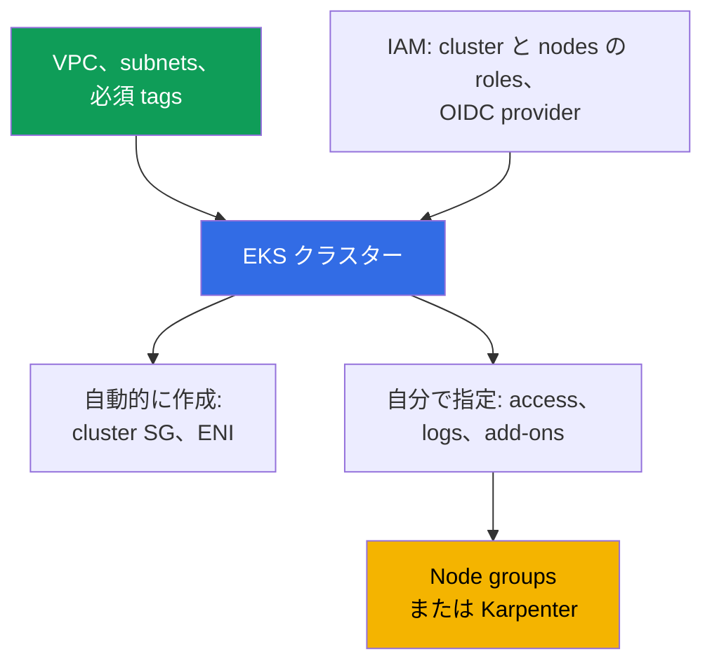
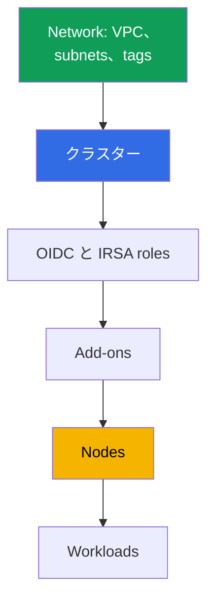

[Русская версия](ru.md) · [Eng version](en.md) · [Versión en español](es.md) · [Version française](fr.md) · [Deutsche Version](de.md) · [ქართული ვერსია](ge.md) · [繁體中文版](tw.md)
# 第 4 章. クラスターの作成: eksctl、Terraform と Terragrunt、CloudFormation

> **次に何をするか。** クラスターは一度作成しますが、チームは何年もそれと付き合います。そのため、ツールの選択は、誰が infrastructure state を所有するか、そして別の account で production を再現できるかを決める選択です。本章では、クラスターの構成（API 呼び出し一つではなく 20-30 resources）、eksctl、CloudFormation、Terraform、Terragrunt の比較、作成順序、後から変更できない parameters を扱います。アクセスは第 5 章、network は第 6・7 章、nodes は第 9-12 章、add-ons は第 37 章です。

## 4.1. 再現できないクラスター

クラスターを console で手作業で組み立て、稼働しており、applications も動いています。問題は障害ではなく、普通の依頼から始まります。「第 2 region 用に新しい account に同じものを立ててください」。

- **再現できない。** Wizard で選んだ項目を誰も覚えていません。authentication mode、public endpoint の CIDR、logs のセット、custom services CIDR。二つ目の cluster は異なるものになります。
- **引き継げない。** Subnets には `kubernetes.io/role/internal-elb` tag があり、「なぜ」と聞かれても答えはありません。load balancer が作成されなかったため付けたのです。
- **Owner が退職した。** クラスターは engineer 個人の role で作成され、その role には作成時に cluster 内の administrator 権限が与えられました（第 5 章）。その engineer はもう会社にいません。
- **Production と dev が乖離した。** dev の public endpoint は全世界に公開され、production では閉じられています。audit logs は production でのみ有効です。差異を誰も列挙できず、dev での確認は何の証明にもなりません。
- **削除できない。** Terraform code はありますが、何がそれで作成され、何が手作業で追加されたか不明です。`destroy` は半分を削除し、ENI、security group、roles、DNS 付き load balancer という orphan を残します。

共通する問題は、クラスターは存在するのに、**クラスターの記述が存在しない**ことです。

## 4.2. 「クラスターを作る」は 20-30 resources

一つの `CreateCluster` 呼び出しは control plane を作成します。稼働するクラスターにははるかに多くのものが必要で、そのほとんどは cluster object の外に存在します。



**Network。** VPC、少なくとも二つの availability zones にある二つの subnets、routes、NAT。さらに、ないと一部の機能が黙って動作しなくなる tags が必要です。public subnets の `kubernetes.io/role/elb`、private subnets の `kubernetes.io/role/internal-elb`、Karpenter 用に cluster 名を値とする `karpenter.sh/discovery` です（第 6、12 章）。**IAM。** Cluster role、node role、issuer に関連付く IAM OIDC provider。これがなければ IRSA はなく、API にアクセスする controllers も動作しません。

**自動的に作成されるもの:** 指定した subnets 内の cross-account ENI（通常 2-4 個）と、`eks-cluster-sg-<cluster>-<id>` 形式の cluster security group（第 2 章）。これらは自分の code にはありませんが account に存在し、不注意な `destroy` の後も残ります。**作成時に指定するもの:** `authenticationMode`（`API`、`API_AND_CONFIG_MAP`、`CONFIG_MAP`）、access entries と creator permissions（第 5 章）、Kubernetes version と `supportType`（`STANDARD` または `EXTENDED`、第 3 章）、endpoint と `publicAccessCidrs`、control plane logs、add-ons、nodes、default StorageClass。

これは module を使わず raw resources で書く場合の Terraform における同じ最低限です。Control plane が作成される、かつ一つでも pod が起動するために必要な、まさにその内容です。

| 内容 | Terraform resource | 必須である理由 |
|---|---|---|
| Control plane | `aws_eks_cluster` | cluster 自体: version、role、`vpc_config`、`kubernetes_network_config`、endpoint access、logs |
| Cluster role | `aws_iam_role` + `aws_iam_role_policy_attachment` (`AmazonEKSClusterPolicy`) | これがなければ EKS は account 内の resources を管理できない |
| Node role | `aws_iam_role` + `aws_iam_role_policy_attachment` (`AmazonEKSWorkerNodePolicy`, `AmazonEKS_CNI_Policy`, `AmazonEC2ContainerRegistryReadOnly`) | node は register できず、images も pull できない |
| IRSA 用 OIDC | `aws_iam_openid_connect_provider` (+ `data.tls_certificate`) | これがなければ IRSA と API access を持つ controllers がない |
| Network | `aws_vpc`, `aws_subnet` (または `data` sources)、tags `kubernetes.io/role/*`、`aws_security_group` | 二つの zones に subnets と SG が必要 |
| Compute | `aws_eks_node_group` または `aws_eks_fargate_profile` | さもなければ pods を起動する場所がない。labs では system を Fargate、追加分を Karpenter で実行する |
| Add-ons | `aws_eks_addon` (`vpc-cni`, `coredns`, `kube-proxy`, `eks-pod-identity-agent`) | pod networking、DNS、kube-proxy、pod identity |
| Access | `aws_eks_access_entry`, `aws_eks_access_policy_association` (または obsolete な `aws-auth`) | さもなければ creator 以外は誰も cluster に入れない（第 5 章） |

これを手作業で書くことはできますが、高コストで壊れやすいものです。subnet tag、node role policy、OIDC と role の関連付けを忘れやすく、欠けた関連付けは `apply` ではなく、後の pod failure として現れます。特別な例として、nodes がなければ pods を起動する場所がなく、node role に `AmazonEKS_CNI_Policy` がなければ node は IP を取得できず `Ready` になりません（第 45 章）。したがって、これらの resources を一つずつ書くことはほとんどありません。ready-made module を使います（4.7 節）。

## 4.3. クラスターを作るツール: 正直な比較

| ツール | 再現性 | Review | Drift | 開始速度 | state の owner |
|---|---|---|---|---|---|
| AWS console | なし | 確認するものがない | 追跡されない | 数分 | 誰でもない |
| eksctl | yaml config により部分的 | git 内の config | 自分の IaC 外にある eksctl 独自の CloudFormation stacks | 最も高い | eksctl が作成した CloudFormation |
| CloudFormation | あり | git 内の template | stack の drift detection | 中程度 | CloudFormation service |
| Terraform | あり | pull request の `plan` | `plan` で可視化される | 中程度 | S3 内の自分の state |
| Terragrunt | あり、加えて environments に DRY | 同じ、`run-all plan` | 同じ、stacks ごと | 中程度 | stacks ごとに分割された同じ state |
| CDK、Pulumi | あり | programming language の code | CloudFormation または独自 state を通じて | 中程度 | CloudFormation (CDK) または Pulumi backend |
| Crossplane、ACK | あり、cluster 内で declarative | git 内の manifests | controller が継続的に reconcile | 開始時は低い | management Kubernetes cluster |

**Console** は読むためには最適なツールであり続けますが、production の作成には不適です。結果が記述されないからです。**CDK と Pulumi** は TypeScript、Python、Go による infrastructure です。通常の abstractions と types という利点がある一方、predictable な diff が必要な場所で imperative logic を作りやすい欠点があります。**Crossplane と ACK** は AWS resources を Kubernetes objects として記述し、記述した state へ継続的に戻します。これにより drift は解決しますが、「cluster が cluster を管理する」という dependency と、management cluster を誰が作るのかという問題が加わります（通常は Terraform）。

## 4.4. eksctl: 優れた調査手段、production の不適切な owner

eksctl は一つの command で cluster を作成します。それこそが本当の価値です。

```bash
# Nodes のない cluster: control plane、VPC、roles、kubeconfig を一回の呼び出しで作成
eksctl create cluster --name demo --region eu-central-1 --version 1.34 --without-nodegroup
eksctl get cluster --region eu-central-1      # region 内に何があるか
eksctl utils describe-stacks --cluster demo   # eksctl が所有する CloudFormation stacks
```

**独自の state。** eksctl は自身が作成する CloudFormation stacks に state を格納します（名前は `eksctl-` で始まります）。Infrastructure には二つの owners がいます。自分の Terraform state と、Terraform が何も知らない他の stacks です。**Imperative であること。** eksctl の操作の一部は desired state の記述ではなく actions です。「何が変わるか」への答えは plan ではなく実行から得られます。**境界。** eksctl が得意なのは cluster の境界までで、残りは自分の IaC に存在します。二つのツールの接点は network と IAM です。新機能の調査、bug の再現、一日だけの temporary cluster には不可欠です。このような cluster は全体を作成し、全体を削除します。

## 4.5. Terraform を具体的に: state、stacks、鶏と卵

**State と lock。** State は code と実在 resources の対応表です。S3 に置かれ versioning され、二つの同時 `apply` が互いを上書きしないよう書き込みが lock されます。`s3` backend では DynamoDB table（`dynamodb_table` argument）が lock を担います。Terraform 1.10 以降では bucket 内の native lockfile（`use_lockfile`）も同じ役割を担います。State には sensitive attributes も含まれるため、bucket は暗号化し、access は CI role に限定し、versioning は最初の `apply` より前に有効にします。

**Stacks への分割。** すべてを一つの stack に記述すると、subnet tag の変更に infrastructure 全体の `plan` が必要になり、workloads の `apply` failure が network を block します。境界は変更速度と owner によって決まります。

| Stack | 内容 | 変更頻度 |
|---|---|---|
| Network | VPC、subnets、NAT、routes、tags | 低い。変更は痛みを伴う |
| Cluster | control plane、roles、endpoint、logs、version | 低い。一部の parameters は immutable |
| Platform | OIDC と IRSA roles、add-ons、controllers、StorageClass | 中程度。updates 時 |
| Nodes | node groups、launch templates、Karpenter NodePool | 高い |
| Workloads | applications、secrets、ingress | 常時。通常は Terraform ではない |

**Providers の鶏と卵。** `kubernetes` と `helm` providers は、特定の cluster の endpoint と CA に接続します。cluster を同じ stack に記述した場合、最初の `plan` 時点ではこれらの values はまだありません。Terraform は failure するか、さらに悪いことに空の values で正常に plan します。ここから規則が導かれます。**cluster と workloads を同じ stack に記述しない**。Providers は次の stack で既存 cluster に設定し、manifests は GitOps に渡します（第 44 章）。もう一つの理由は、Terraform は Kubernetes objects の owner として不向きであり、workload stack の `destroy` は service を止めるからです。

## 4.6. Terragrunt: DRY と stacks 間の dependencies

Terragrunt は Terraform を置き換えるものではありません。各 stack における backend と variables configuration の繰り返し、および stacks 間の関連付けがないという二つの弱点を解決します。Environment directory には `env.hcl` と、stack ごとの subdirectories があります。`vpc`、`ssh-keys`、`eks_control_plane`、`eks_fargate_system`、`eks_addons`、`eks_karpenter`、`worker` です。各 subdirectory の `terragrunt.hcl` は Terraform module への `source` を指定し、`read_terragrunt_config(find_in_parent_folders("env.hcl"))` により `env.hcl` を読み、`dependency` block で dependencies を宣言します。`eks_control_plane` は `vpc` に依存し `vpc_id` と subnet lists を取得します。`eks_addons` は `eks_control_plane` に依存し cluster name を取得します。

Lab 02 の `env.hcl` には、cluster を構成する parameters がまさにまとめられています。`region`、`vpc_default_cidr`、`stack_name`、`TF_VAR_USER_ID` と `TF_VAR_ENV_ID` から得る environment identifiers（学生の environments が競合しないよう、これらから `env_name` を構成します）、subnets、CIDR、zones、NAT mode、tags（値が `owned` の `kubernetes.io/cluster/<env_name>`、`kubernetes.io/role/elb`、`kubernetes.io/role/internal-elb`、`karpenter.sh/discovery`）を含む `subnets` map、version `k8_version`、`ondemand` または `spot` を値に持つ node type `node_type`、instance types、owner tags です。

```bash
terragrunt run-all apply --terragrunt-parallelism=4  # destroy は逆順に実行される
terragrunt run-all output                            # すべての stacks の outputs
terragrunt init && terragrunt plan && terragrunt apply   # 個別 stack
```

利便性の代償は、さらに一層の abstraction と dependency graphs です。不注意に設計すると、一つの parameter の変更が environment の半分の再計算に変わります。

## 4.7. terraform-aws-eks module: 引き受けること、利点、欠点、risks

4.2 節の最低限を raw resources で書くことはほとんどありません。Community の標準的な答えは `terraform-aws-eks` module です（course labs では version 21.10.1 に固定されています）。Input variables のセットから、control plane、IAM roles、OIDC provider、security groups、node groups と Fargate profiles、add-ons、つまり 20-30 resources とその関連付けを構成します。

| 利点 | 欠点と risks |
|---|---|
| 20-30 resources とその関連付け全体を扱う | major versions は breaking changes と resource renames を導入する |
| 妥当な defaults により role、tag、policy の漏れが減る | renames には state migration が必要: `moved` blocks または `state mv` |
| access entries、node groups、Fargate、add-ons をサポート | abstraction が details を隠し、実際に何が作られたか理解しにくい |
| すべての clusters に一つの module と parameters file | module upgrade が cluster または nodes の replace を plan する可能性がある |
| community により活発に保守される | 一部は依然として自分の担当: VPC、access、一部の add-ons |

最大の risk は upgrade です。major version を変更すると module は内部 resource names を変更し、データが存続すべき場所である cluster 自体や node group に対して `plan` が replace を表示する場合があります。そのため version は厳密に固定します（範囲ではなく `version = "21.10.1"`）。bump 前には CHANGELOG と upgrade guide を読み、summary だけでなく replace の行を実際に確認します。

さらに hygiene rules があります。一つの add-on の管理を module と手作業で混在させないことです。add-on には一つの owner が必要です（4.10 節）。`enable_cluster_creator_admin_permissions` input に注意してください。これは cluster 内における creator の rights を指定します（4.9 節と第 5 章）。そして境界を覚えておきます。module は infrastructure を作成しますが GitOps ではなく、Kubernetes と add-ons の versions の upgrade は独自の順序を持つ別の operation のままです（第 38、39 章）。また versions を区別してください。`terraform-aws-eks` module の version は Kubernetes version ではありません。module の bump は cluster を上げず、Kubernetes version は別の input で指定します。module versions 間の defaults の変更自体も、`plan` では drift または recreation として見えます（4.10 節）。

## 4.8. 作成順序と後から変更できないもの

順序は dependencies によって決まります。各次の step は前の outputs を必要とします。



つまずきやすい場所が二つあります。`vpc-cni` や `coredns` のような add-ons は nodes より前に導入します。nodes がなければ `coredns` は `Pending` のままですが、node が IP を要求するときには CNI が ready でなければなりません。また AWS API に access する controllers には、その前に OIDC provider が必要です。なければ pod は `CrashLoopBackOff` になります。

次は不可逆性についてです。この list での error の代償は cluster の再作成です。

| Parameter | 稼働中の cluster で変更できるか |
|---|---|
| `ipFamily` (`ipv4` または `ipv6`) | いいえ。作成時にのみ指定する |
| `serviceIpv4Cidr` (services CIDR) | いいえ。custom block は作成時にのみ指定する |
| Cluster の VPC | いいえ。subnets は同じ VPC に残る必要がある |
| Cluster name、cluster IAM role | いいえ。`update-cluster-config` にこの fields はない |
| KMS key による secrets encryption | 既存 cluster で有効化できるが、無効化できない |
| Subnets と security groups | はい。同じ VPC の異なる zones に最低二つの subnets が必要 |
| Endpoint public と private、`publicAccessCidrs` | はい |
| Control plane logs、`deletionProtection` | はい |
| `authenticationMode` | はい。API 方向へ（第 5 章） |
| Kubernetes version と `supportType` | はい。version は一度に一つの minor だけ前進（第 3 章） |

新しい account で最初の `apply` の前に、table の最初の五行を確認します。デフォルトの `serviceIpv4Cidr` は `10.100.0.0/16` または `172.20.0.0/16` から取られます。これらの blocks の一つが connected network で使用中の場合、VPN 経由で ClusterIP が開かないときに初めて問題が判明します（第 6、7 章）。

```bash
# API 経由で cluster を直接作成: 任意の IaC が指定するのと同じ fields
aws eks create-cluster --name demo --kubernetes-version 1.34 \
  --role-arn arn:aws:iam::111122223333:role/eksClusterRole \
  --resources-vpc-config subnetIds=subnet-aaa,subnet-bbb,endpointPublicAccess=false

aws eks describe-cluster --name demo --query 'cluster.{v:version,acc:accessConfig}'
```

## 4.9. クラスターを作成する者: permissions と protection

**クラスターは人ではなく CI role が作成します。** これは規律のためだけではありません。cluster を作成した IAM principal は cluster 内の administrator rights を得ます。これはデフォルト値が `true` の `bootstrapClusterCreatorAdminPermissions` field が担います。cluster を engineer 個人の role が作成した場合、その administrator-level access は永続し、IAM では削除できません。entry は cluster access configuration に存在し続けます。Flag を `false` に設定します（`aws eks create-cluster` では `--access-config bootstrapClusterCreatorAdminPermissions=false`、eksctl では `--bootstrap-cluster-creator-admin-permissions false` flag または `accessConfig` の同じ field、`terraform-aws-eks` module では `accessConfig` の `bootstrapClusterCreatorAdminPermissions` に map される boolean input `enable_cluster_creator_admin_permissions = false`）。そして access は明示的に access entries（module では `access_entries` input）で構成します。これにより rights は作成履歴ではなく code に記述されます。
Creator role が必要なのは `create-cluster` 時の一度だけです。以降の administration は access entries で記述した別 roles によって行い、rights を履歴から継承させないようにします。この option は `API` mode とともに EKS 1.23 以降の clusters で利用可能です（第 5 章）。

**CI role 自体の permissions。** Cluster の作成には広範な permissions が必要です。EKS、IAM（roles と OIDC provider）、EC2、そしてしばしば KMS と CloudWatch Logs です。この role は人に与えず、pipeline が assume し、repository と branch への trust に制限し、CloudTrail で可視化します（第 0.2、21 章）。

**Secrets と deletion protection。** State bucket は暗号化および versioning を行い、access は CI role だけに限定します。state は決して git に置かず、secrets を含む `terraform output` は pipeline logs に出力しません。`deletionProtection` flag は cluster の削除を防ぎます。Terraform では `lifecycle` の `prevent_destroy` が同じ役割を果たし、process 側では separate pipelines と plan の読み取りが対応します。

## 4.10. Drift: `plan` が自分で行っていない変更を表示する理由

作成後、cluster は自分の関与なしに変化します。AWS が service tags を追加し、EKS が cluster SG rules を変更し、controllers が load balancers、target groups、DNS records を作成します。

| 変更の source | `plan` での見え方 | 対応 |
|---|---|---|
| AWS と EKS の service tags | 「余分な」tags を削除しようとする | `ignore_changes` で除外する |
| Cluster security group rules | 自分が書いていない rules の変更 | この SG を code で記述せず、その id を参照する |
| AWS Load Balancer Controller による load balancers | state にはない resources が account に存在する | owner は Terraform ではなく controller（第 26 章） |
| external-dns による Route 53 records | zone は code にあるが、record はない | zone は Terraform、records は external-dns（第 29 章） |
| Add-on versions を含む console の手作業変更 | code の values へ戻そうとする | code で戻す。add-on versions は code に置く（第 37 章） |

規律は一つの rule に要約されます。各 resource には一つの owner を置くことです。controller が resource を作るなら Terraform はそれを知りません。Terraform が作るならその resource を console で操作しません。定期的に scheduled `plan` を実行すれば、drift は surprise ではなく通常の task になります。

## 4.11. Cluster fleet: 一つの module、異なる parameters

Clusters が三つを超えると、差異のコストは数より速く増加します。ある cluster から別の cluster への checks を転用できなくなるためです。機能する仕組みは一つです。**すべての clusters に一つの module と、environment ごとの parameters file**です。module には logic（resources の構成、tags、dependencies）、environment file には差異、すなわち region、CIDR、Kubernetes version、`supportType`、node sizes、add-ons、endpoint flags を置きます。このような module の内部構造の ready-made な指針は、community の public な `terraform-aws-eks` です。submodules（cluster、node groups、IRSA roles、access entries）に分かれていますが、state storage は解決しないため、lock 付き S3 remote backend は自分の担当のままです。変更は一度だけ行い、dev、stage、production の順に rollout します。environments 間の差異は二つの files の diff として読み取れ、extended support への移行は bill ではなく PR で見えます（第 3 章）。

## 4.12. Production での適用方法

- **クラスターは pipeline が作成する。** CI role、特定 repository への trust、pull request の `plan`、review 後の `apply`。個人 roles が作成するのは調査用の temporary clusters のみです。
- **Stacks を分割する。** network、cluster、platform、nodes に分割します。workloads は GitOps に置き、`kubernetes` と `helm` providers は既存 cluster に設定します。
- **`bootstrapClusterCreatorAdminPermissions` を意図的に無効にする。** Administrator access は code の access entries で記述します（第 5 章）。
- **State は S3 に置く。** versioning、encryption、lock を使い、access は CI のみにします。production では `deletionProtection` と `prevent_destroy` を有効にします。eksctl は調査用に残します。open な pull request がない non-empty `plan` は些細なことではなく process incident です。

## 4.13. ミニ用語集

- **State** は Terraform code と実在 resources の対応を示す file で、S3 に versioning と write lock を伴って格納されます。**Drift** は code と infrastructure の実際の state の差異です。
- **Stack** は独自の state を持つ independently applicable な infrastructure unit であり、**stacks 間の dependency** は、ある stack の outputs を別の stack の inputs に渡すことです（Terragrunt では `dependency` block）。
- **`bootstrapClusterCreatorAdminPermissions`** は作成時の access configuration field です。`true`（デフォルト）では cluster creator がその cluster の administrator rights を得ます（第 5 章）。
- **`authenticationMode`** は authentication mode で、`API`、`API_AND_CONFIG_MAP`、`CONFIG_MAP` があります。**`deletionProtection`** は cluster の削除を禁止する flag です。**Immutable parameter** は `ipFamily`、custom `serviceIpv4Cidr`、VPC、cluster IAM role と name です。

## 4.14. 本章のまとめ

- 「クラスターを作る」とは 20-30 resources を記述することです。tags 付き network、IAM roles、OIDC provider、access configuration、add-ons、nodes、StorageClass。API 呼び出し一つで得られるのは control plane だけであり、cluster SG と cross-account ENI は自動的に現れます。
- ツールの違いは syntax ではなく、誰が state を所有するかへの回答です。console は誰も所有せず、eksctl は独自の CloudFormation stacks、Terraform と Terragrunt は自分の state、Crossplane と ACK は management cluster の controller が所有します。eksctl は調査には適し production owner には不適です。imperative で独自 state を持ち、自分の IaC との接点が network と IAM になるためです。
- Cluster と workloads を同じ stack に記述しません。`kubernetes` と `helm` providers は、まだ存在しない cluster に設定できないためです。network、cluster、platform、nodes に分けます。Terragrunt は configuration の繰り返しをなくし、graph から適用順序を導きます。
- 順序は network、cluster、OIDC と roles、add-ons、nodes、workloads です。`ipFamily`、custom `serviceIpv4Cidr`、VPC、cluster name と role は永続的な選択です。KMS secrets encryption は稼働中の cluster で有効にできますが、無効にできません。
- Cluster は人ではなく CI role が作成します。creator は cluster 内の administrator rights を得るためです。resources の一部には Terraform 以外の正当な owner がいるため drift は避けられません。一つの resource に一人の owner を置き、scheduled `plan` を行うことで対処します。

## 4.15. 実務での役立ち方

「新しい account で同じ cluster を作成するのにどれくらいかかるか」という問いを検証可能にできます。module と parameters file があれば答えは時間単位で測れ、なければ答えはありません。dev と production の差異は二つの files の diff になり、incident analysis は pull request history を読むことになります。そして適切に分けた stacks により、そうでなければ恐ろしい作業、つまり cluster 下の network への変更や control plane に影響を及ぼさない add-on の更新を安全に行えます。

## 4.16. 自己確認の質問

1. Cluster object 自体以外に cluster が必要とする resources を列挙してください。
2. Subnets にはどの tags が必要で、それぞれがなければ何が動かなくなりますか。
3. eksctl で作成した cluster に state owners が二人いるのはなぜで、どのようなときに eksctl は適切ですか。
4. なぜ `kubernetes` と `helm` providers を cluster と同じ stack に設定できないのですか。
5. Infrastructure をどのように stacks に分け、どの指標で境界を決めますか。
6. Terragrunt は Terraform に何を追加し、そのためにどの代償を払いますか。
7. 作成後に変更できない cluster parameters は何で、KMS encryption を無効にできますか。
8. `bootstrapClusterCreatorAdminPermissions` は何を行い、作成時に重要なのはなぜですか。
9. `plan` に自分で行っていない変更が表示されます。誰がそれを行ったかをどのように判断しますか。
10. Fleet に clusters が十あり、すべて異なります。一つの module へ統一するには何から始めますか。

## 実践

このテーマの course lab は [lab 101 - code としての cluster](../../labs/101/README_JP.MD) です。Terragrunt を通じて cluster（vpc、control plane、add-ons、Karpenter、worker machine）を展開し、control plane と自分の責任範囲の分離を説明し、`check_result` command で検証します。実行は `TASK=101 make run_eks_task` です。

一度限りの調査 cluster（4.4 節）については、AWS の official materials があります。eksctl を使った cluster の作成、確認、削除の step-by-step scenario、config file と add-ons を扱う eksctl の完全 guide、そして ready-made cluster 上の labs を提供する AWS workshop です。

```bash
# Get started with Amazon EKS - eksctl: 一回で cluster と nodes を作成し、その後削除
# https://docs.aws.amazon.com/eks/latest/userguide/getting-started-eksctl.html

# Eksctl User Guide: installation、yaml config による cluster、add-ons、Auto Mode
# https://docs.aws.amazon.com/eks/latest/eksctl/tutorial.html

# EKS Workshop (aws-samples/eks-workshop-v2 repository): ready-made cluster 上の labs
# https://www.eksworkshop.com/
```

このような cluster は全体を作成し全体を削除しますが、production は引き続き自分の IaC に存在します。二つの state owners がいることこそ、eksctl が production ではなく調査のツールに留まる理由です。

Lab 以外にも、本章の内容は任意の cluster で確認できます。`aws eks describe-cluster --name <cluster>` を実行し、作成に関わるすべて、すなわち `version`、`roleArn`、`resourcesVpcConfig`（subnets、security groups、endpoint flags）、さらに `kubernetesNetworkConfig`、`accessConfig`、`logging`、`encryptionConfig`、`upgradePolicy` を書き出します。各 value を自分の IaC で探してください。output にあり code にないものが technical debt です。`aws ec2 describe-subnets` の subnet tags を code と比較し、account 内で `eks-cluster-sg-<cluster>-<id>` 形式の cluster security group を探すのも有用です。

Repository の lab environments は Terragrunt で構成され、stacks への分割例として読めます。Lab 02 には `vpc`、`ssh-keys`、`eks_control_plane`、`eks_fargate_system`、`eks_addons`、`eks_karpenter`、`worker` directories が並びます。それぞれに module への link と `dependency` blocks を含む `terragrunt.hcl` があります（`eks_control_plane` は `vpc` に、`eks_addons` は `eks_control_plane` と `eks_fargate_system` に依存します）。Environment parameters は一つの `env.hcl` にまとめられています。

---
[目次](../README_JP.md) · [第 3 章](../03/jp.md) · [第 5 章](../05/jp.md)
