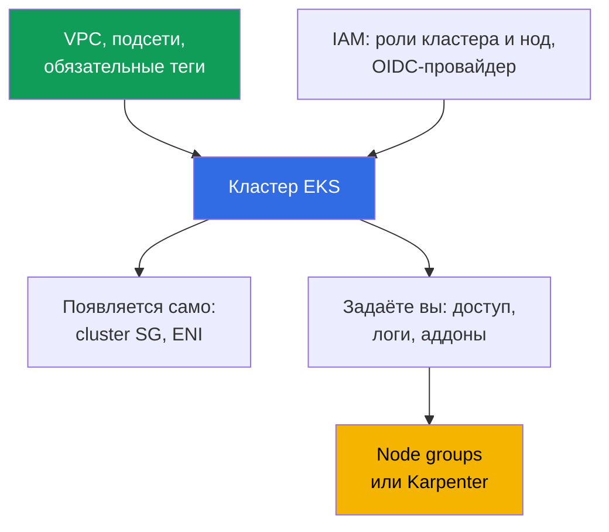
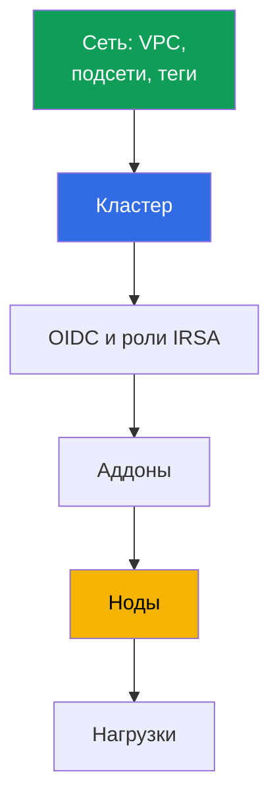

[Eng version](en.md) · [Versión en español](es.md) · [Version française](fr.md) · [Deutsche Version](de.md) · [ქართული ვერსია](ge.md) · [繁體中文版](tw.md) · [日本語版](jp.md)
# Глава 4. Создание кластера: eksctl, Terraform и Terragrunt, CloudFormation

> **Что дальше.** Кластер создаётся один раз, а жить с ним команде годами, поэтому выбор
> инструмента - решение о том, кто владеет состоянием инфраструктуры и можно ли повторить прод
> в другом аккаунте. Глава про состав кластера (это 20-30 ресурсов, а не один вызов API),
> сравнение eksctl, CloudFormation, Terraform и Terragrunt, порядок создания и параметры,
> которые потом не поменять. Доступ - глава 5, сеть - главы 6 и 7, ноды - главы 9-12, аддоны -
> глава 37.

## 4.1. Кластер, который нельзя повторить

Кластер собрали руками в консоли, он работает, приложения ездят. Проблема начинается не с
аварии, а с обычной просьбы: «поднимите такой же в новом аккаунте для второго региона».

- **Повторить нельзя.** Никто не помнит галочек в визарде: режим аутентификации, CIDR
  публичного endpoint, набор логов, кастомный CIDR сервисов. Второй кластер выйдет другим.
- **Передать нельзя.** На подсети висит тег `kubernetes.io/role/internal-elb`, и на вопрос
  «зачем» ответа нет: его поставили, потому что балансировщик не создавался.
- **Владелец уволился.** Кластер создан личной ролью инженера, и эта роль получила права
  администратора внутри кластера при создании (глава 5). Инженера в компании больше нет.
- **Прод и dev разошлись.** В dev публичный endpoint открыт в мир, в проде закрыт; аудит-логи
  включены только в проде. Разницу никто не перечислит, и проверка на dev ничего не доказывает.
- **Удалить нельзя.** Terraform-код есть, но неясно, что создано им, а что доработано руками.
  `destroy` удалит половину и оставит сирот: ENI, security group, роли, балансировщик с DNS.

Общий знаменатель: кластер существует, а **описания кластера не существует**.

## 4.2. «Создать кластер» - это 20-30 ресурсов

Один вызов `CreateCluster` создаёт control plane. Рабочий кластер требует значительно большего,
и почти всё это существует вне объекта cluster.



**Сеть.** VPC, минимум две подсети в разных зонах доступности, маршруты, NAT. Плюс теги, без
которых часть функций молча не работает: `kubernetes.io/role/elb` на публичных подсетях,
`kubernetes.io/role/internal-elb` на приватных, `karpenter.sh/discovery` со значением имени
кластера для Karpenter (главы 6, 12). **IAM.** Роль кластера, роль для нод и OIDC-провайдер
IAM, привязанный к issuer: без него нет IRSA и не работают контроллеры с доступом к API.

**Появляется само:** cross-account ENI в указанных подсетях (обычно 2-4) и cluster security
group вида `eks-cluster-sg-<cluster>-<id>` (глава 2). Их нет в вашем коде, но они есть в
аккаунте и переживут неаккуратный `destroy`. **Задаётся при создании:** `authenticationMode`
(`API`, `API_AND_CONFIG_MAP` или `CONFIG_MAP`), access entries и права создателя (глава 5),
версия Kubernetes и `supportType` (`STANDARD` или `EXTENDED`, глава 3), endpoint и
`publicAccessCidrs`, логи control plane, аддоны, ноды, StorageClass по умолчанию.

Тот же минимум в терминах Terraform, если писать сырыми ресурсами, без модуля. Это ровно то,
без чего control plane либо не создастся, либо не запустит ни одного пода.

| Что | Terraform resource | Зачем обязателен |
|---|---|---|
| Control plane | `aws_eks_cluster` | сам кластер: версия, роль, `vpc_config`, `kubernetes_network_config`, endpoint access, логи |
| Роль кластера | `aws_iam_role` + `aws_iam_role_policy_attachment` (`AmazonEKSClusterPolicy`) | без неё EKS не управляет ресурсами в аккаунте |
| Роль нод | `aws_iam_role` + `aws_iam_role_policy_attachment` (`AmazonEKSWorkerNodePolicy`, `AmazonEKS_CNI_Policy`, `AmazonEC2ContainerRegistryReadOnly`) | нода не зарегистрируется и не потянет образы |
| OIDC для IRSA | `aws_iam_openid_connect_provider` (+ `data.tls_certificate`) | без него нет IRSA и контроллеров с доступом к API |
| Сеть | `aws_vpc`, `aws_subnet` (или `data`-источники), теги `kubernetes.io/role/*`, `aws_security_group` | нужны подсети в двух зонах и SG |
| Вычисления | `aws_eks_node_group` или `aws_eks_fargate_profile` | иначе поды негде запускать; в лабах системное на Fargate плюс Karpenter |
| Аддоны | `aws_eks_addon` (`vpc-cni`, `coredns`, `kube-proxy`, `eks-pod-identity-agent`) | сеть подов, DNS, kube-proxy, pod identity |
| Доступ | `aws_eks_access_entry`, `aws_eks_access_policy_association` (или устаревший `aws-auth`) | иначе в кластер не войти никому, кроме создателя (глава 5) |

Написать это руками можно, но дорого и хрупко: легко забыть тег подсети, политику роли нод
или связку OIDC с ролью, а пропущенная связка всплывёт не на `apply`, а позже отказом пода.
Частный случай: без нод поды негде запускать, а без `AmazonEKS_CNI_Policy` у роли нод нода
не получит IP и не станет `Ready` (глава 45). Поэтому эти ресурсы редко пишут по одному -
берут готовый модуль (раздел 4.7).

## 4.3. Чем создают кластер: честное сравнение

| Инструмент | Воспроизводимость | Review | Дрейф | Скорость старта | Кто владеет состоянием |
|---|---|---|---|---|---|
| Консоль AWS | нет | нечего смотреть | не отслеживается | минуты | никто |
| eksctl | частичная, через yaml-конфиг | конфиг в git | свои стеки CloudFormation вне вашего IaC | самая высокая | CloudFormation, созданный eksctl |
| CloudFormation | да | шаблон в git | drift detection по стеку | средняя | сервис CloudFormation |
| Terraform | да | `plan` в pull request | видно в `plan` | средняя | ваш state в S3 |
| Terragrunt | да, плюс DRY на окружения | то же, `run-all plan` | то же, по стекам | средняя | тот же state, разложенный по стекам |
| CDK, Pulumi | да | код на языке программирования | через CloudFormation или свой state | средняя | CloudFormation (CDK) или бэкенд Pulumi |
| Crossplane, ACK | да, декларативно в кластере | манифесты в git | контроллер реконсилирует непрерывно | низкая на старте | management-кластер Kubernetes |

**Консоль** остаётся лучшим инструментом чтения, но создавать прод не годится: результат не
описан. **CDK и Pulumi** это инфраструктура на TypeScript, Python или Go: плюс - обычные
абстракции и типы, минус - легко получить императивную логику там, где нужен предсказуемый
diff. **Crossplane и ACK** описывают ресурсы AWS как объекты Kubernetes и непрерывно приводят
их к описанному состоянию, что решает дрейф, но добавляет зависимость «кластер управляет
кластером» и вопрос, кто создаёт management-кластер (обычно Terraform).

## 4.4. eksctl: отличная разведка, плохой владелец прода

eksctl создаёт кластер одной командой, и это его настоящая ценность.

```bash
# Кластер без нод: control plane, VPC, роли, kubeconfig - за один вызов
eksctl create cluster --name demo --region eu-central-1 --version 1.34 --without-nodegroup
eksctl get cluster --region eu-central-1      # что вообще есть в регионе
eksctl utils describe-stacks --cluster demo   # стеки CloudFormation, которыми он владеет
```

**Своё состояние.** eksctl хранит состояние в стеках CloudFormation, которые создаёт сам (имена
начинаются с `eksctl-`). У инфраструктуры два владельца: ваш Terraform state и чужие стеки, про
которые Terraform ничего не знает. **Императивность.** Часть операций у eksctl - действия, а не
описание желаемого состояния: ответ на «что изменится» получается запуском, а не планом.
**Границы.** eksctl хорош ровно в границах кластера, а остальное живёт в вашем IaC, и стык двух
инструментов проходит по сети и IAM. Незаменим он для разведки новой функции, воспроизведения
бага и временного кластера на день: такой кластер создаётся и удаляется целиком.

## 4.5. Terraform предметно: state, стеки, курица и яйцо

**State и блокировка.** State - карта соответствия между кодом и реальными ресурсами. Он лежит
в S3, версионируется, и запись блокируется, чтобы два одновременных `apply` не переписали друг
друга. Блокировку в бэкенде `s3` держит таблица DynamoDB (аргумент `dynamodb_table`); в
Terraform 1.10 и новее ту же роль берёт нативный lockfile в бакете (`use_lockfile`). State
содержит и чувствительные атрибуты, поэтому бакет шифруется, доступ сужается до роли CI, а
версионирование включается до первого `apply`.

**Разделение на стеки.** Если описать всё одним стеком, правка тега на подсети требует `plan`
по всей инфраструктуре, а неудачный `apply` в нагрузках блокирует сеть. Граница проходит по
скорости изменений и по владельцу.

| Стек | Что внутри | Как часто меняется |
|---|---|---|
| Сеть | VPC, подсети, NAT, маршруты, теги | редко, изменения болезненные |
| Кластер | control plane, роли, endpoint, логи, версия | редко, часть параметров immutable |
| Платформа | OIDC и роли IRSA, аддоны, контроллеры, StorageClass | средне, при обновлениях |
| Ноды | node groups, launch templates, Karpenter NodePool | часто |
| Нагрузки | приложения, их секреты и ingress | постоянно, обычно уже не Terraform |

**Курица и яйцо с провайдерами.** Провайдеры `kubernetes` и `helm` настраиваются на endpoint и
CA конкретного кластера. Если кластер описан в том же стеке, на первом `plan` этих значений ещё
нет: Terraform либо падает, либо (что хуже) успешно планирует с пустыми значениями. Отсюда
правило: **кластер и нагрузки не описывают одним стеком**. Провайдеры настраиваются в следующем
стеке на уже существующий кластер, а манифесты уходят в GitOps (глава 44). Второй аргумент:
Terraform плохо владеет объектами Kubernetes, а `destroy` стека нагрузок останавливает сервис.

## 4.6. Terragrunt: DRY и зависимости между стеками

Terragrunt не заменяет Terraform, а решает две его слабости: повторение конфигурации
бэкенда и переменных в каждом стеке и отсутствие связей между стеками. Каталог стенда
содержит `env.hcl` и по подкаталогу на стек: `vpc`, `ssh-keys`, `eks_control_plane`,
`eks_fargate_system`, `eks_addons`, `eks_karpenter`, `worker`. В каждом подкаталоге
`terragrunt.hcl` указывает `source` на модуль Terraform, читает `env.hcl` через
`read_terragrunt_config(find_in_parent_folders("env.hcl"))` и объявляет зависимости блоком
`dependency`: `eks_control_plane` зависит от `vpc` и берёт `vpc_id` и списки подсетей,
`eks_addons` зависит от `eks_control_plane` и берёт имя кластера.

В `env.hcl` лабы 02 сложены именно те параметры, из которых состоит кластер: `region`,
`vpc_default_cidr`, `stack_name`, идентификаторы стенда из `TF_VAR_USER_ID` и
`TF_VAR_ENV_ID` (из них собирается `env_name`, чтобы стенды студентов не конфликтовали),
карта `subnets` с подсетями, их CIDR, зонами, режимом NAT и тегами
(`kubernetes.io/cluster/<env_name>` со значением `owned`, `kubernetes.io/role/elb`,
`kubernetes.io/role/internal-elb`, `karpenter.sh/discovery`), версия `k8_version`, тип нод
`node_type` со значениями `ondemand` или `spot`, типы инстансов и теги владельца.

```bash
terragrunt run-all apply --terragrunt-parallelism=4  # destroy идёт в обратном порядке
terragrunt run-all output                            # выходы всех стеков
terragrunt init && terragrunt plan && terragrunt apply   # отдельный стек
```

Цена за удобство: ещё один слой абстракции и графы зависимостей, которые при неаккуратном
проектировании превращают правку одного параметра в пересчёт половины стенда.

## 4.7. Модуль terraform-aws-eks: что он берёт на себя, плюсы, минусы, риски

Минимум из раздела 4.2 почти никогда не пишут сырыми ресурсами. Стандартный ответ сообщества -
модуль `terraform-aws-eks` (в лабах курса зафиксирована версия 21.10.1). Из набора входных
переменных он собирает control plane, IAM-роли, OIDC-провайдер, security groups, node groups и
Fargate profiles, аддоны, то есть те самые 20-30 ресурсов и связи между ними.

| Плюсы | Минусы и риски |
|---|---|
| закрывает 20-30 ресурсов и их связи разом | мажорные версии вносят breaking changes и переименования ресурсов |
| разумные дефолты, меньше шанс забыть роль, тег или политику | переименования требуют миграции state: `moved`-блоки или `state mv` |
| поддержка access entries, node groups, Fargate, аддонов | абстракция прячет детали: труднее понять, что реально создано |
| один модуль на все кластеры плюс файл параметров | апгрейд модуля может планировать replace кластера или нод |
| активно поддерживается сообществом | часть работы всё равно на вас: VPC, доступ, часть аддонов |

Главный риск - апгрейд. При смене мажорной версии модуль меняет внутренние имена ресурсов, и
`plan` показывает replace там, где данные должны жить: сам кластер или node group. Поэтому
version фиксируют жёстко (`version = "21.10.1"`, не диапазон), перед бампом читают CHANGELOG и
upgrade guide, а `plan` смотрят глазами именно на строки replace, а не только на итог.

Ещё правила гигиены. Не смешивать управление одним аддоном модулем и вручную: у аддона должен
быть один владелец (раздел 4.10). Следить за входом `enable_cluster_creator_admin_permissions`:
он задаёт права создателя внутри кластера (раздел 4.9 и глава 5). И помнить границу: модуль
создаёт инфраструктуру, но это не GitOps, апгрейд версий Kubernetes и аддонов остаётся
отдельной операцией со своим порядком (главы 38 и 39). И различать версии: версия модуля
`terraform-aws-eks` - не версия Kubernetes. Бамп модуля не поднимает кластер, версию
Kubernetes задают отдельным входом, а смена дефолтов между версиями модуля сама по себе
видна в `plan` как дрейф или пересоздание (раздел 4.10).

## 4.8. Порядок создания и что потом не изменить

Порядок диктуется зависимостями: каждый следующий шаг требует выходов предыдущего.



Два места, где спотыкаются. Аддоны вроде `vpc-cni` и `coredns` ставят до нод: `coredns` без нод
останется в `Pending`, но CNI должен быть готов, когда нода попросит IP. А контроллерам с
доступом к AWS API OIDC-провайдер нужен раньше них, иначе под уйдёт в `CrashLoopBackOff`.

Дальше про необратимость: цена ошибки в этом списке - пересоздание кластера.

| Параметр | Меняется на живом кластере? |
|---|---|
| `ipFamily` (`ipv4` или `ipv6`) | нет, задаётся только при создании |
| `serviceIpv4Cidr` (CIDR сервисов) | нет, кастомный блок задаётся только при создании |
| VPC кластера | нет, подсети должны остаться в той же VPC |
| Имя кластера, роль IAM кластера | нет, в `update-cluster-config` таких полей нет |
| Шифрование секретов ключом KMS | включить на существующем кластере можно, отключить нельзя |
| Подсети и security groups | да, минимум две подсети в разных зонах, VPC та же |
| Endpoint public и private, `publicAccessCidrs` | да |
| Логи control plane, `deletionProtection` | да |
| `authenticationMode` | да, в сторону API (глава 5) |
| Версия Kubernetes и `supportType` | да, версия только вперёд по одному минору (глава 3) |

Перед первым `apply` в новом аккаунте проверяются первые пять строк таблицы. `serviceIpv4Cidr`
по умолчанию берётся из `10.100.0.0/16` или `172.20.0.0/16`, и если один из этих блоков занят в
связанной сети, это выясняется позже, когда через VPN не открывается ClusterIP (главы 6 и 7).

```bash
# Создание кластера напрямую через API: те же поля, что задаёт любой IaC
aws eks create-cluster --name demo --kubernetes-version 1.34 \
  --role-arn arn:aws:iam::111122223333:role/eksClusterRole \
  --resources-vpc-config subnetIds=subnet-aaa,subnet-bbb,endpointPublicAccess=false

aws eks describe-cluster --name demo --query 'cluster.{v:version,acc:accessConfig}'
```

## 4.9. Кто создаёт кластер: права и защита

**Кластер создаёт роль CI, а не человек.** Причина не в дисциплине: IAM-принципал, создавший
кластер, получает права администратора внутри кластера, за это отвечает поле
`bootstrapClusterCreatorAdminPermissions` со значением по умолчанию `true`. Если кластер создан
личной ролью инженера, доступ уровня администратора остаётся у неё навсегда, и убрать его через
IAM нельзя: запись живёт в конфигурации доступа кластера. Флаг выставляют в `false` (в `aws eks
create-cluster` это `--access-config bootstrapClusterCreatorAdminPermissions=false`, у eksctl -
флаг `--bootstrap-cluster-creator-admin-permissions false` или то же поле в `accessConfig`, в
модуле `terraform-aws-eks` - булев вход `enable_cluster_creator_admin_permissions = false`,
который модуль мапит на `bootstrapClusterCreatorAdminPermissions` в `accessConfig`), а доступ
заводят через access entries явно (в модуле - вход `access_entries`), тогда права описаны
кодом, а не историей создания.
Роль-создатель нужна ровно один раз при `create-cluster`; дальнейшее администрирование ведут
отдельные роли, описанные access entries, чтобы права не наследовались из истории. Опция
доступна на кластерах EKS 1.23 и новее вместе с режимом `API` (глава 5).

**Права самой роли CI.** Создание кластера требует широких прав: EKS, IAM (роли и
OIDC-провайдер), EC2, часто KMS и CloudWatch Logs. Такую роль не выдают людям: она принимается
пайплайном, ограничена доверием к репозиторию и ветке, видна в CloudTrail (главы 0.2 и 21).

**Секреты и защита от удаления.** Бакет со state шифруется и версионируется, доступ только у
роли CI, state никогда не в git, `terraform output` с секретами не печатается в логи пайплайна.
Флаг `deletionProtection` не даёт удалить кластер; со стороны Terraform ту же роль играет
`prevent_destroy` в `lifecycle`, а со стороны процесса - раздельные пайплайны и чтение плана.

## 4.10. Дрейф: почему `plan` показывает то, чего вы не делали

После создания кластер меняется без вашего участия: AWS добавляет служебные теги, EKS правит
правила cluster SG, контроллеры создают балансировщики, target groups, записи DNS.

| Источник изменения | Как выглядит в `plan` | Что делать |
|---|---|---|
| Служебные теги от AWS и EKS | попытка удалить «лишние» теги | исключить в `ignore_changes` |
| Правила cluster security group | изменение правил, которых вы не писали | не описывать эту SG кодом, ссылаться на её id |
| Балансировщики от AWS Load Balancer Controller | ресурсов нет в state, но они есть в аккаунте | владелец - контроллер, а не Terraform (глава 26) |
| Записи Route 53 от external-dns | зона в вашем коде, записи нет | зона в Terraform, записи в external-dns (глава 29) |
| Ручные правки в консоли, включая версии аддонов | откат к значениям из кода | вернуть через код, версии аддонов в коде (глава 37) |

Дисциплина сводится к правилу: у каждого ресурса один владелец. Если ресурс создаёт контроллер,
Terraform о нём не знает; если Terraform, в консоль за ним не ходят. А регулярный `plan` по
расписанию превращает дрейф в обычную задачу вместо сюрприза.

## 4.11. Парк кластеров: один модуль, разные параметры

Когда кластеров больше трёх, стоимость расхождений растёт быстрее их числа: проверка перестаёт
переноситься с одного кластера на другой. Работающая схема одна: **один модуль на все кластеры
плюс файл параметров на окружение**. В модуле логика (состав ресурсов, теги, зависимости), в
файле окружения отличия: регион, CIDR, версия Kubernetes, `supportType`, размеры нод, аддоны,
флаги endpoint. Готовый ориентир для внутренностей такого модуля - публичный
`terraform-aws-eks` от сообщества: он разложен на подмодули (кластер, node groups, роли IRSA,
access entries) и хранение state за вас не решает, так что удалённый бэкенд в S3 с блокировкой
остаётся вашей зоной. Изменение вносится один раз и раскатывается в порядке dev, stage,
прод; разница
между окружениями читается как diff двух файлов; переход в extended support виден в PR, а не в
счёте (глава 3).

## 4.12. Как это применяют в продакшене

- **Кластер создаёт пайплайн.** Роль CI, доверие к конкретному репозиторию, `plan` в pull
  request, `apply` после ревью. Личные роли создают только временные кластеры для разведки.
- **Стеки разделены** на сеть, кластер, платформу и ноды; нагрузки живут в GitOps, а провайдеры
  `kubernetes` и `helm` настраиваются на существующий кластер.
- **`bootstrapClusterCreatorAdminPermissions` выключен осознанно**, доступ администратора
  описан access entries в коде (глава 5).
- **State в S3** с версионированием, шифрованием и блокировкой, доступ только у CI;
  `deletionProtection` и `prevent_destroy` на проде; eksctl оставлен для разведки; непустой
  `plan` без открытого pull request - инцидент процесса, а не мелочь.

## 4.13. Мини-глоссарий

- **State** - файл соответствия между кодом Terraform и реальными ресурсами; хранится в S3 с
  версионированием и блокировкой записи. **Дрейф** - расхождение между кодом и фактическим
  состоянием инфраструктуры.
- **Стек** - независимо применяемая единица инфраструктуры со своим state, а **зависимость
  между стеками** - передача его выходов во входы другого (в Terragrunt блок `dependency`).
- **`bootstrapClusterCreatorAdminPermissions`** - поле конфигурации доступа при создании; при
  `true` (по умолчанию) создатель кластера получает права администратора в нём (глава 5).
- **`authenticationMode`** - режим аутентификации: `API`, `API_AND_CONFIG_MAP`, `CONFIG_MAP`.
  **`deletionProtection`** - флаг, запрещающий удаление кластера. **Immutable-параметр** -
  `ipFamily`, кастомный `serviceIpv4Cidr`, VPC, имя и роль IAM кластера.

## 4.14. Итоги главы

- «Создать кластер» - это описать 20-30 ресурсов: сеть с тегами, роли IAM, OIDC-провайдер,
  конфигурацию доступа, аддоны, ноды, StorageClass. Один вызов API даёт только control plane, а
  cluster SG и cross-account ENI появляются сами.
- Инструменты различаются не синтаксисом, а ответом на вопрос, кто владеет состоянием: консоль
  никто, eksctl его собственные стеки CloudFormation, Terraform и Terragrunt ваш state,
  Crossplane и ACK контроллер в management-кластере. eksctl хорош для разведки и плох
  владельцем прода: императивность, своё состояние, стык с вашим IaC по сети и IAM.
- Кластер и нагрузки не описывают одним стеком: провайдеры `kubernetes` и `helm` нельзя
  настроить на кластер, которого ещё нет. Разделение - сеть, кластер, платформа, ноды;
  Terragrunt снимает повторение конфигурации и выводит порядок применения из графа.
- Порядок: сеть, кластер, OIDC и роли, аддоны, ноды, нагрузки. `ipFamily`, кастомный
  `serviceIpv4Cidr`, VPC, имя и роль кластера выбираются навсегда; шифрование секретов KMS
  включается на живом кластере, но не отключается.
- Кластер создаёт роль CI, а не человек: создатель получает права администратора в кластере.
  Дрейф неизбежен, потому что у части ресурсов законный владелец не Terraform: лечится одним
  владельцем на ресурс и регулярным `plan` по расписанию.

## 4.15. Как это пригодится в реальной работе

Вопрос «сколько времени займёт поднять такой же кластер в новом аккаунте» становится
проверяемым: либо у вас есть модуль и файл параметров, и ответ измеряется в часах, либо ответа
нет. Разница между dev и продом превращается в diff двух файлов, а разбор инцидента - в чтение
истории pull request. И правильно разложенные стеки делают безопасным то, что иначе страшно:
тронуть сеть под кластером или обновить аддон, не задев control plane.

## 4.16. Вопросы для самопроверки

1. Перечислите ресурсы, которые нужны кластеру помимо самого объекта cluster.
2. Какие теги на подсетях обязательны и что перестанет работать без каждого из них?
3. Почему у кластера, созданного eksctl, два владельца состояния и когда eksctl всё же уместен?
4. Почему провайдеры `kubernetes` и `helm` нельзя настраивать в том же стеке, что и кластер?
5. Как вы разделите инфраструктуру на стеки и по какому признаку?
6. Что даёт Terragrunt поверх Terraform и какую цену вы за это платите?
7. Какие параметры кластера нельзя изменить после создания и можно ли отключить KMS-шифрование?
8. Что делает `bootstrapClusterCreatorAdminPermissions` и почему это важно при создании?
9. `plan` показывает изменения, которых вы не делали. Как понять, кто их сделал?
10. Кластеров в парке десять, все разные. С чего начнёте приведение к одному модулю?

## Практика

Лаба курса к этой теме: [лаба 101 - кластер как код](../../labs/101/README_RU.MD). Она
разворачивает кластер через Terragrunt (vpc, control plane, аддоны, Karpenter, рабочая
машина), разбирает разделение control plane и вашей зоны ответственности и проверяется
командой `check_result`. Запуск - `TASK=101 make run_eks_task`.

Для разового кластера на разведку (раздел 4.4) есть официальные материалы AWS: пошаговый
сценарий на eksctl с созданием, осмотром и удалением кластера, полное руководство по eksctl с
конфиг-файлом и аддонами, и воркшоп AWS с лабами поверх готового кластера.

```bash
# Get started with Amazon EKS - eksctl: кластер и ноды за один проход, затем удаление
# https://docs.aws.amazon.com/eks/latest/userguide/getting-started-eksctl.html

# Eksctl User Guide: установка, кластер из yaml-конфига, аддоны, Auto Mode
# https://docs.aws.amazon.com/eks/latest/eksctl/tutorial.html

# EKS Workshop (репозиторий aws-samples/eks-workshop-v2): лабы поверх готового кластера
# https://www.eksworkshop.com/
```

Такой кластер создают и удаляют целиком, а прод по-прежнему живёт в вашем IaC: два владельца
состояния - это то, из-за чего eksctl остаётся инструментом разведки, а не прода.

Помимо лабы, содержание главы проверяется на любом кластере. Возьмите `aws eks
describe-cluster --name <cluster>` и выпишите всё, что относится к созданию: `version`,
`roleArn`, `resourcesVpcConfig` (подсети, security groups, флаги endpoint), а также
`kubernetesNetworkConfig`, `accessConfig`, `logging`, `encryptionConfig` и `upgradePolicy`.
Ищите каждое значение в своём IaC: что есть в выводе и нет в коде, то и есть технический долг.
Полезно сравнить теги подсетей из `aws ec2 describe-subnets` с кодом и найти в аккаунте cluster
security group вида `eks-cluster-sg-<cluster>-<id>`.

Стенды лаб репозитория собраны на Terragrunt и читаются как пример разделения на стеки. В лабе
02 рядом лежат каталоги `vpc`, `ssh-keys`, `eks_control_plane`, `eks_fargate_system`,
`eks_addons`, `eks_karpenter` и `worker`: в каждом свой `terragrunt.hcl` со ссылкой на модуль и
блоками `dependency` (`eks_control_plane` зависит от `vpc`, а `eks_addons` от
`eks_control_plane` и `eks_fargate_system`). Параметры окружения собраны в одном `env.hcl`.

---
[Оглавление](../README_RU.md) · [Глава 3](../03/ru.md) · [Глава 5](../05/ru.md)
