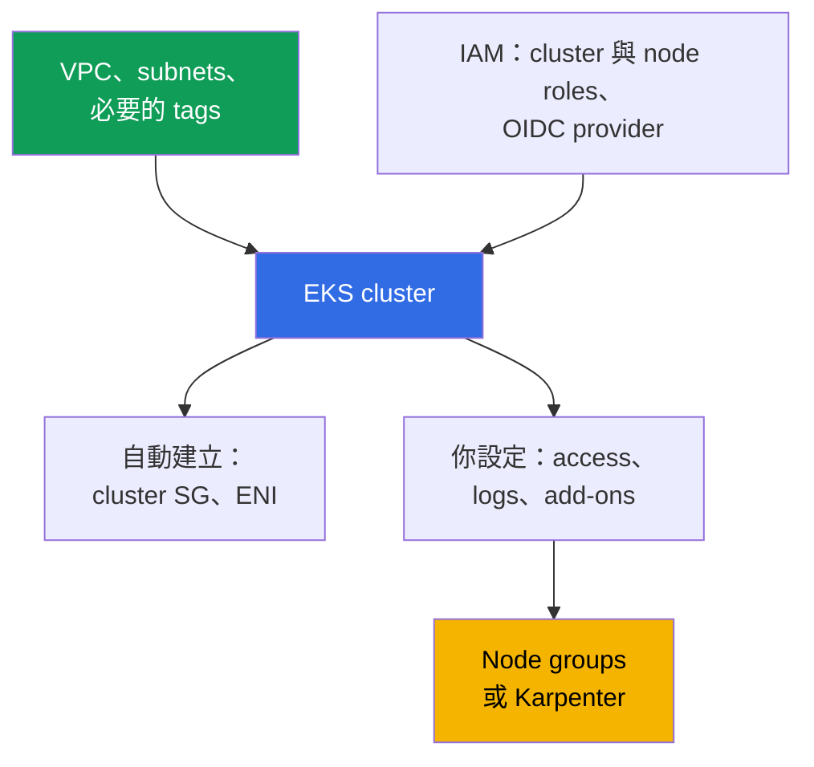
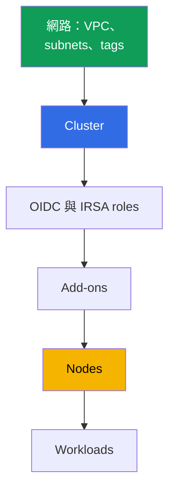

[Русская версия](ru.md) · [Eng version](en.md) · [Versión en español](es.md) · [Version française](fr.md) · [Deutsche Version](de.md) · [ქართული ვერსია](ge.md) · [日本語版](jp.md)
# 第 4 章. 建立叢集：eksctl、Terraform、Terragrunt 與 CloudFormation

> **接下來。** 叢集只建立一次，但團隊會與它共處多年，因此選擇工具就是決定誰擁有基礎設施 state，以及能否在另一個 account 重現 production。本章說明叢集的組成部分（20-30 個 resources，而非一次 API 呼叫）、比較 eksctl、CloudFormation、Terraform 與 Terragrunt，並討論建立順序及之後無法變更的參數。存取見第 5 章，網路見第 6 與第 7 章，nodes 見第 9-12 章，add-ons 見第 37 章。

## 4.1. 無法重現的叢集

叢集在 console 中手動組裝完成，正常運作，applications 也在跑。問題不是從 outage 開始，而是從一個平常的要求開始：「請在新 account 中為第二個 region 建立完全一樣的叢集。」

- **無法重現。** 沒有人記得 wizard 中勾選了哪些項目：authentication mode、public endpoint CIDR、logs 組合、custom service CIDR。第二個叢集必定不同。
- **無法移交。** 某個 subnet 有 `kubernetes.io/role/internal-elb` tag，但沒人能回答「為什麼」：當初是因為 load balancer 建不出來才加上它。
- **擁有者離職。** 叢集以工程師的個人 role 建立，而該 role 在建立時取得叢集內 administrator permissions（第 5 章）。該工程師已不在公司。
- **Production 與 dev 分岔。** dev 的 public endpoint 對全世界開放，production 則關閉；audit logs 僅在 production 啟用。沒有人能列出差異，因此在 dev 的檢查無法證明任何事。
- **無法刪除。** 有 Terraform code，卻不清楚哪些是它建立、哪些是手動調整。`destroy` 會刪掉一半並留下孤兒資源：ENI、security group、roles 與帶有 DNS 的 load balancer。

共同點是：叢集存在，但**叢集描述不存在**。

## 4.2. 「建立叢集」代表 20-30 個 resources

一次 `CreateCluster` 呼叫只會建立 control plane。一個可運作的叢集還需要更多東西，而且幾乎都存在於 cluster object 之外。



**網路。** VPC、位於不同 Availability Zones 的至少兩個 subnets、routes 與 NAT。還有缺少後部分功能會悄悄失效的 tags：public subnets 上的 `kubernetes.io/role/elb`、private subnets 上的 `kubernetes.io/role/internal-elb`，以及值為 cluster name、供 Karpenter 使用的 `karpenter.sh/discovery`（第 6、12 章）。**IAM。** Cluster role、node role，以及繫結至 issuer 的 IAM OIDC provider：沒有它就沒有 IRSA，也無法執行具有 API access 的 controllers。

**自動建立：** 指定 subnets 中的 cross-account ENIs（通常 2-4 個）與形如 `eks-cluster-sg-<cluster>-<id>` 的 cluster security group（第 2 章）。它們不在你的 code 中，但存在於 account 裡，並會在草率的 `destroy` 後殘留。**建立時設定：** `authenticationMode`（`API`、`API_AND_CONFIG_MAP` 或 `CONFIG_MAP`）、access entries 與 creator permissions（第 5 章）、Kubernetes version 與 `supportType`（`STANDARD` 或 `EXTENDED`，第 3 章）、endpoint 與 `publicAccessCidrs`、control plane logs、add-ons、nodes，以及預設 StorageClass。

以下是不使用 module、以 raw resources 撰寫時 Terraform 所需的相同最低組成。這些正是 control plane 能建立並執行至少一個 pod 所不可或缺的內容。

| 項目 | Terraform resource | 必要原因 |
|---|---|---|
| Control plane | `aws_eks_cluster` | cluster 本身：version、role、`vpc_config`、`kubernetes_network_config`、endpoint access、logs |
| Cluster role | `aws_iam_role` + `aws_iam_role_policy_attachment` (`AmazonEKSClusterPolicy`) | 沒有它，EKS 無法管理 account 中的 resources |
| Node role | `aws_iam_role` + `aws_iam_role_policy_attachment` (`AmazonEKSWorkerNodePolicy`, `AmazonEKS_CNI_Policy`, `AmazonEC2ContainerRegistryReadOnly`) | node 無法註冊或 pull images |
| IRSA 的 OIDC | `aws_iam_openid_connect_provider` (+ `data.tls_certificate`) | 沒有它就沒有 IRSA 或具有 API access 的 controllers |
| 網路 | `aws_vpc`, `aws_subnet`（或 `data` sources）、`kubernetes.io/role/*` tags、`aws_security_group` | 需要兩個 zones 中的 subnets 與 SG |
| 運算 | `aws_eks_node_group` 或 `aws_eks_fargate_profile` | 否則 pods 無處執行；labs 以 Fargate 執行 system workloads 並搭配 Karpenter |
| Add-ons | `aws_eks_addon` (`vpc-cni`, `coredns`, `kube-proxy`, `eks-pod-identity-agent`) | pod networking、DNS、kube-proxy、pod identity |
| 存取 | `aws_eks_access_entry`, `aws_eks_access_policy_association`（或 legacy `aws-auth`） | 否則除 creator 外無人可進入 cluster（第 5 章） |

可以手寫這些內容，但代價高且脆弱：很容易漏掉 subnet tag、node-role policy 或 OIDC-to-role binding，而遺漏的 binding 不會在 `apply` 時暴露，而會在 pod 被拒絕時才出現。特殊情況是：沒有 nodes 就無處執行 pods；node role 沒有 `AmazonEKS_CNI_Policy` 時，node 無法取得 IP 也不會成為 `Ready`（第 45 章）。因此這些 resources 很少逐一手寫，而是採用現成 module（第 4.7 節）。

## 4.3. 如何建立叢集：誠實的比較

| 工具 | 可重現性 | 審查 | 漂移 | 啟動速度 | 誰擁有狀態 |
|---|---|---|---|---|---|
| AWS 主控台 | 否 | 無內容可審查 | 不追蹤 | 分鐘 | 無人 |
| eksctl | 部分，透過 YAML 設定 | Git 中的設定 | 位於你的 IaC 之外、由它建立的 CloudFormation 堆疊 | 最高 | eksctl 建立的 CloudFormation |
| CloudFormation | 是 | Git 中的範本 | 堆疊漂移偵測 | 中等 | CloudFormation 服務 |
| Terraform | 是 | 提取請求中的 `plan` | 在 `plan` 可見 | 中等 | S3 中的你的狀態 |
| Terragrunt | 是，另加跨環境的 DRY | 相同，`run-all plan` | 相同，按堆疊 | 中等 | 相同狀態，拆分到堆疊 |
| CDK, Pulumi | 是 | programming-language code | 經由 CloudFormation 或自身 state | 中等 | CloudFormation (CDK) 或 Pulumi backend |
| Crossplane, ACK | 是，在 cluster 中 declaratively | git 中的 manifests | controller 持續 reconcile | 初期低 | Kubernetes management cluster |

**Console** 仍是最佳閱讀工具，卻不適合建立 production：結果沒有被描述。**CDK 與 Pulumi** 是以 TypeScript、Python 或 Go 撰寫的 infrastructure：優點是一般的 abstractions 與 types，缺點是很容易在需要可預測 diff 的地方寫出 imperative logic。**Crossplane 與 ACK** 將 AWS resources 描述為 Kubernetes objects，並持續把它們帶回宣告狀態，這能解決 drift，但也加入「叢集管理叢集」的 dependency，以及誰建立 management cluster 的問題（通常是 Terraform）。

## 4.4. eksctl：優秀的探索工具，不是好的 production 擁有者

eksctl 用一個 command 建立叢集，這正是它真正的價值。

```bash
# 無 nodes 的 cluster：一次呼叫建立 control plane、VPC、roles、kubeconfig
eksctl create cluster --name demo --region eu-central-1 --version 1.34 --without-nodegroup
eksctl get cluster --region eu-central-1      # region 中實際存在什麼
eksctl utils describe-stacks --cluster demo   # 它擁有的 CloudFormation stacks
```

**它自己的 state。** eksctl 將 state 存於自己建立的 CloudFormation stacks（名稱以 `eksctl-` 開頭）。Infrastructure 有兩位擁有者：你的 Terraform state 與 Terraform 一無所知的外來 stacks。**Imperative 操作。** 部分 eksctl operations 是 actions，而不是 desired-state description：對「將變更什麼」的回答來自執行，而不是 plan。**邊界。** eksctl 恰好適合 cluster 邊界內的工作，其他一切都在你的 IaC 中，兩個工具的介面位於 networking 與 IAM。它非常適合探索新功能、重現 bug 及一天用的 temporary cluster：這種叢集整體建立、整體刪除。

## 4.5. Terraform 細節：state、stacks、雞與蛋

- **狀態與鎖定。** 狀態是程式碼與實際資源的對應表。它存於 S3、具有版本控制，且寫入會被鎖定，以免兩個同時進行的 `apply` 互相覆寫。DynamoDB 資料表為 `s3` backend 上鎖（`dynamodb_table` argument）；在 Terraform 1.10 及更新版本中，bucket 的原生 lockfile（`use_lockfile`）承擔相同角色。狀態還含有敏感屬性，因此 bucket 必須加密、存取限縮至 CI 角色，且在第一次 `apply` 前啟用版本控制。

**拆分 stacks。** 若在一個 stack 描述所有內容，修改 subnet tag 需要對整個 infrastructure 執行 `plan`，而 workload `apply` 的失敗會阻塞 network。邊界應依變更速度與 owner 劃分。

| Stack | 內容 | 變更頻率 |
|---|---|---|
| 網路 | VPC、subnets、NAT、routes、tags | 很少，變更痛苦 |
| Cluster | control plane、roles、endpoint、logs、version | 很少，部分參數 immutable |
| Platform | OIDC 與 IRSA roles、add-ons、controllers、StorageClass | 中等，於更新時 |
| Nodes | node groups、launch templates、Karpenter NodePool | 經常 |
| Workloads | applications、其 secrets 與 ingress | 持續，通常不再由 Terraform 管理 |

**Providers 的雞與蛋問題。** `kubernetes` 與 `helm` providers 是針對特定 cluster 的 endpoint 與 CA 設定。若 cluster 位於同一 stack，第一次 `plan` 時這些值尚不存在：Terraform 不是失敗，就是更糟地以空值成功規劃。因此規則是：**cluster 與 workloads 不應在同一個 stack 中描述**。Providers 在下一個 stack 中針對既有 cluster 設定，而 manifests 交給 GitOps（第 44 章）。第二個原因是 Terraform 並不擅長擁有 Kubernetes objects，而 destroy workload stack 會停止 service。
## 4.6. Terragrunt：DRY 與 stacks 之間的 dependencies

Terragrunt 不會取代 Terraform；它處理 Terraform 的兩個弱點：每個 stack 重複 backend 與 variables configuration，以及 stacks 之間缺乏關聯。Environment directory 內含 `env.hcl`，並為每個 stack 提供一個 subdirectory：`vpc`、`ssh-keys`、`eks_control_plane`、`eks_fargate_system`、`eks_addons`、`eks_karpenter`、`worker`。每個 subdirectory 中的 `terragrunt.hcl` 將 `source` 指向 Terraform module，透過 `read_terragrunt_config(find_in_parent_folders("env.hcl"))` 讀取 `env.hcl`，並以 `dependency` block 宣告 dependencies：`eks_control_plane` 依賴 `vpc` 並取得 `vpc_id` 與 subnet lists，而 `eks_addons` 依賴 `eks_control_plane` 並取得 cluster name。

Lab 02 的 `env.hcl` 正好包含組成 cluster 的參數：`region`、`vpc_default_cidr`、`stack_name`、來自 `TF_VAR_USER_ID` 與 `TF_VAR_ENV_ID` 的 environment identifiers（它們組成 `env_name`，讓學生的 environments 不會衝突）、包含 subnets、其 CIDRs、zones、NAT mode 與 tags 的 `subnets` map（`kubernetes.io/cluster/<env_name>` 值為 `owned`、`kubernetes.io/role/elb`、`kubernetes.io/role/internal-elb`、`karpenter.sh/discovery`）、`k8_version`、值為 `ondemand` 或 `spot` 的 `node_type`、instance types 與 owner tags。

```bash
terragrunt run-all apply --terragrunt-parallelism=4  # destroy 以相反順序執行
terragrunt run-all output                            # 每個 stack 的 outputs
terragrunt init && terragrunt plan && terragrunt apply   # 獨立 stack
```

便利的代價是多一層 abstraction 與 dependency graphs；若設計草率，它們會將單一 parameter 的變更變成重算半個 environment。

## 4.7. terraform-aws-eks module：它承擔什麼、優點、缺點與風險

第 4.2 節的最低組成幾乎不會寫成 raw resources。Community 的標準答案是 `terraform-aws-eks` module（課程 labs 固定使用 version 21.10.1）。它從一組 input variables 組裝 control plane、IAM roles、OIDC provider、security groups、node groups 與 Fargate profiles、add-ons，也就是那 20-30 個 resources 及其 relationships。

| 優點 | 缺點與風險 |
|---|---|
| 一次涵蓋 20-30 個 resources 及其 relationships | major versions 會帶來 breaking changes 與 resource renames |
| 合理的 defaults，較不易遺漏 role、tag 或 policy | renames 需要 state migration：`moved` blocks 或 `state mv` |
| 支援 access entries、node groups、Fargate 與 add-ons | abstraction 隱藏細節：較難了解實際建立了什麼 |
| 一個 module 適用所有 clusters，另有 parameter file | module upgrade 可能規劃替換 cluster 或 nodes |
| 由 community 積極維護 | 部分工作仍由你負責：VPC、access 與部分 add-ons |

主要風險是 upgrade。變更 major version 時，module 會改變內部 resource names，`plan` 會在必須保留資料的地方顯示 replacement：cluster 本身或 node group。因此 version 要嚴格固定（`version = "21.10.1"`，不是 range），在 bump 前閱讀 CHANGELOG 與 upgrade guide，並手動檢視 `plan` 中的 replacement lines，而不是只看最終結果。

還有更多 hygiene rules。不要混用 module 與手動方式管理同一個 add-on：一個 add-on 必須只有一位 owner（第 4.10 節）。留意 `enable_cluster_creator_admin_permissions` input：它賦予 creator cluster 內的 permissions（第 4.9 節及第 5 章）。記住邊界：module 建立 infrastructure，但它不是 GitOps，Kubernetes 與 add-on version upgrades 仍是有其自身順序的獨立 operation（第 38、39 章）。也要區分 versions：`terraform-aws-eks` module version 不是 Kubernetes version。Module bump 不會升級 cluster；Kubernetes version 是獨立 input，而 module versions 間 defaults 的變化本身會在 `plan` 中顯示為 drift 或 replacement（第 4.10 節）。

## 4.8. 建立順序與之後無法變更的項目

順序由 dependencies 決定：每一步都需要前一步的 outputs。



有兩個常見的絆腳處。`vpc-cni` 與 `coredns` 等 add-ons 在 nodes 之前安裝：沒有 nodes 時 `coredns` 會停在 `Pending`，但 node 請求 IP 時 CNI 必須已就緒。需要 AWS API access 的 controllers 必須先有 OIDC provider，否則 pod 會進入 `CrashLoopBackOff`。

接著是不可逆性：在這份清單中出錯的代價是重建 cluster。

| 參數 | 可在 live cluster 上變更嗎？ |
|---|---|
| `ipFamily`（`ipv4` 或 `ipv6`） | 否，僅能在建立時設定 |
| `serviceIpv4Cidr`（service CIDR） | 否，custom block 僅能在建立時設定 |
| Cluster VPC | 否，subnets 必須留在同一 VPC |
| Cluster name、cluster IAM role | 否，`update-cluster-config` 沒有這些 fields |
| 以 KMS key 加密 secrets | 可在既有 cluster 啟用，不能停用 |
| Subnets 與 security groups | 可以，至少兩個位於不同 zones 的 subnets，VPC 必須相同 |
| Public 與 private endpoint、`publicAccessCidrs` | 可以 |
| Control-plane logs、`deletionProtection` | 可以 |
| `authenticationMode` | 可以，朝 API 方向（第 5 章） |
| Kubernetes version 與 `supportType` | 可以，version 只能一次向前一個 minor（第 3 章） |

在新 account 第一次 `apply` 前，檢查表格前五列。預設會從 `10.100.0.0/16` 或 `172.20.0.0/16` 選取 `serviceIpv4Cidr`；若其中一個 block 已在 connected networks 中使用，稍後透過 VPN 無法連到 ClusterIP 時才會顯現（第 6、7 章）。

```bash
# 直接透過 API 建立 cluster：任何 IaC 都會設定相同欄位
aws eks create-cluster --name demo --kubernetes-version 1.34 \
  --role-arn arn:aws:iam::111122223333:role/eksClusterRole \
  --resources-vpc-config subnetIds=subnet-aaa,subnet-bbb,endpointPublicAccess=false

aws eks describe-cluster --name demo --query 'cluster.{v:version,acc:accessConfig}'
```
## 4.9. 誰建立 cluster：permissions 與 protection

**Cluster 由 CI role 建立，而不是由人建立。** 原因不是紀律：建立 cluster 的 IAM principal 會取得其中的 administrator permissions，這由預設值為 `true` 的 `bootstrapClusterCreatorAdminPermissions` field 控制。若 cluster 由工程師的個人 role 建立，administrator-level access 會永久留在該 role，且無法透過 IAM 移除：這筆 entry 存在於 cluster 的 access configuration。將 flag 設為 `false`（對 `aws eks create-cluster` 而言是 `--access-config bootstrapClusterCreatorAdminPermissions=false`；對 eksctl 而言是 `--bootstrap-cluster-creator-admin-permissions false` 或 `accessConfig` 中相同 field；對 `terraform-aws-eks` module 而言是 Boolean input `enable_cluster_creator_admin_permissions = false`，module 將它映射為 `accessConfig` 中的 `bootstrapClusterCreatorAdminPermissions`），並透過 access entries 明確建立 access（module 使用 `access_entries` input）。如此 permissions 由 code 描述，而非建立歷史。
Creator role 僅在 `create-cluster` 時需要一次；後續 administration 使用由 access entries 定義的獨立 roles，避免 permissions 從歷史繼承。此 option 可在 EKS 1.23 及更新的 clusters 與 `API` mode 一起使用（第 5 章）。

**CI role 本身的 permissions。** 建立 cluster 需要廣泛 permissions：EKS、IAM（roles 與 OIDC provider）、EC2，通常還有 KMS 與 CloudWatch Logs。不要把這種 role 給人使用：它由 pipeline assume、以對 repository 與 branch 的 trust 加以限制，並可在 CloudTrail 中看見（第 0.2、21 章）。

**Secrets 與 deletion protection。** State bucket 已加密並具 versioning，僅 CI role 可 access，state 絕不放入 git，含 secrets 的 `terraform output` 不會輸出至 pipeline logs。`deletionProtection` flag 會阻止刪除 cluster；Terraform 端的 `lifecycle` 中 `prevent_destroy` 扮演相同角色，而流程端則是分離的 pipelines 與 plan review。

## 4.10. 漂移：為什麼 `plan` 顯示你未進行的項目

建立後，cluster 會在你未參與時改變：AWS 新增 service tags，EKS 調整 cluster SG rules，controllers 建立 load balancers、target groups 與 DNS records。

| 變更來源 | 在 `plan` 中的樣貌 | 該做什麼 |
|---|---|---|
| AWS 與 EKS 的 service tags | 嘗試刪除「多餘」tags | 在 `ignore_changes` 中排除 |
| Cluster security group rules | 變更了你未寫入的 rules | 不要在 code 中描述該 SG；引用其 ID |
| AWS Load Balancer Controller 建立的 load balancers | resources 不在 state 中，卻存在於 account | owner 是 controller，而非 Terraform（第 26 章） |
| external-dns 建立的 Route 53 records | zone 在你的 code 中，record 卻不在 | Terraform 擁有 zone，external-dns 擁有 records（第 29 章） |
| Console 的手動變更，包括 add-on versions | 回復為 code 中的 values | 透過 code 復原；將 add-on versions 留在 code 中（第 37 章） |

紀律可歸結為一條規則：每個 resource 只有一位 owner。若 controller 建立 resource，Terraform 就不應知道它；若 Terraform 擁有它，就不要在 console 管理它。排程執行的 `plan` 讓 drift 成為一般工作，而非意外。

## 4.11. Cluster fleet：一個 module，不同 parameters

當 clusters 超過三個，divergence 的成本增加速度快於其數量：validation 不再能從一個 cluster 移植到另一個。有效做法只有一種：**所有 clusters 使用一個 module，加上每個 environment 一個 parameter file**。Module 存放 logic（resource composition、tags、dependencies）；environment file 存放差異：region、CIDR、Kubernetes version、`supportType`、node sizes、add-ons 與 endpoint flags。Community `terraform-aws-eks` 是 module 內部結構的現成參考：它拆分為 submodules（cluster、node groups、IRSA roles、access entries），卻不會替你解決 state storage，所以有 locking 的 S3 remote backend 仍是你的責任。變更一次寫入，再按 dev、stage、production 順序 rollout；environment 差異讀起來就是兩個 files 的 diff；進入 extended support 會在 PR 中可見，而非出現在帳單上（第 3 章）。

## 4.12. 如何在 production 中套用

- **由 pipeline 建立 cluster。** 使用 CI role、對特定 repository 的 trust、在 pull request 中執行 `plan`，並於 review 後 `apply`。個人 roles 只建立 temporary reconnaissance clusters。
- **Stacks 已拆分**為 networking、cluster、platform 與 nodes；workloads 位於 GitOps，`kubernetes` 與 `helm` providers 則針對既有 cluster 設定。
- **有意識地停用 `bootstrapClusterCreatorAdminPermissions`**，並透過 access entries 在 code 中描述 administrator access（第 5 章）。
- **State 位於 S3**，具 versioning、encryption 與 locking，僅 CI 可 access；production 使用 `deletionProtection` 與 `prevent_destroy`；eksctl 保留用於 reconnaissance；沒有開放 pull request 的非空 `plan` 是流程 incident，而非小事。

## 4.13. 迷你詞彙表

- **State**：Terraform code 與 real resources 的對應檔案，存於具有 versioning 與 write locking 的 S3。**Drift**：code 與實際 infrastructure state 的差異。
- **Stack**：具有自己 state、可獨立套用的 infrastructure 單位；而 **stacks 之間的 dependency** 則將其 outputs 傳給另一個 stack 的 inputs（Terragrunt 中的 `dependency` block）。
- **`bootstrapClusterCreatorAdminPermissions`**：建立時的 access-configuration field；在 `true`（預設）時，cluster creator 會取得其中的 administrator permissions（第 5 章）。
- **`authenticationMode`**：authentication mode：`API`、`API_AND_CONFIG_MAP`、`CONFIG_MAP`。**`deletionProtection`**：阻止刪除 cluster 的 flag。**Immutable parameter** 包括 `ipFamily`、custom `serviceIpv4Cidr`、VPC，以及 cluster 的 IAM name 與 role。

## 4.14. 本章小結

- 「建立 cluster」代表描述 20-30 個 resources：帶有 tags 的 networking、IAM roles、OIDC provider、access configuration、add-ons、nodes 與 StorageClass。一次 API 呼叫只提供 control plane，而 cluster SG 與 cross-account ENIs 會自動出現。
- 工具的差異不在 syntax，而是對 state owner 的回答：console 是無人擁有，eksctl 是它自己的 CloudFormation stacks，Terraform 與 Terragrunt 是你的 state，Crossplane 與 ACK 則是 management cluster 中的 controller。eksctl 適合 reconnaissance，卻是糟糕的 production owner：它是 imperative、有自己的 state，並透過 networking 與 IAM 與你的 IaC 交會。
- Cluster 與 workloads 不在同一 stack 描述：`kubernetes` 與 `helm` providers 無法設定給尚不存在的 cluster。拆分方式是 networking、cluster、platform、nodes；Terragrunt 消除 configuration 重複，並由 graph 推導套用順序。
- 順序是 networking、cluster、OIDC 與 roles、add-ons、nodes、workloads。`ipFamily`、custom `serviceIpv4Cidr`、VPC、cluster name 與其 role 都是一旦選定即固定；可在 live cluster 啟用 KMS secret encryption，卻不能停用。
- 由 CI role 而非人建立 cluster：其 creator 會取得 cluster 中的 administrator permissions。Drift 不可避免，因為 Terraform 並非部分 resources 的合法 owner；透過每個 resource 一位 owner 與定期排程的 `plan` 解決它。

## 4.15. 這如何幫助實際工作

「在新 account 建立同一個 cluster 需要多久」這個問題變得可驗證：要麼你有 module 與 parameter file，答案以小時計；要麼沒有答案。Dev 與 production 的差異成為兩個 files 的 diff，incident investigation 成為閱讀 pull-request history。妥善拆分的 stacks 讓原本可怕的操作變得安全：觸碰 cluster 的 network 或更新 add-on，而不影響 control plane。

## 4.16. 自我檢查問題

1. 除 cluster object 本身外，列出 cluster 所需的 resources。
2. 哪些 subnet tags 是必要的，缺少每一個時什麼會停止運作？
3. 為何 eksctl 建立的 cluster 有兩位 state owners，eksctl 在何時仍適用？
4. 為何 `kubernetes` 與 `helm` providers 無法在與 cluster 相同的 stack 設定？
5. 你會如何將 infrastructure 拆分為 stacks，依據什麼準則？
6. Terragrunt 在 Terraform 之上提供什麼，又付出什麼代價？
7. 哪些 cluster parameters 建立後無法變更，KMS encryption 能否停用？
8. `bootstrapClusterCreatorAdminPermissions` 做什麼，為何它在建立時很重要？
9. `plan` 顯示你未進行的 changes。你如何判斷是誰造成的？
10. Fleet 有十個 clusters，全部不同。你從何處開始將它們統一到一個 module？

## 實作

本主題的課程 lab 是[lab 101 - 以程式碼建立 cluster](../../labs/101/README_TW.MD)。它透過 Terragrunt 部署 cluster（VPC、control plane、add-ons、Karpenter、worker machine），說明 control plane 與你責任範圍的劃分，並以 `check_result` command 驗證。使用 `TASK=101 make run_eks_task` 執行它。

對於一次性的 reconnaissance cluster（第 4.4 節），AWS 提供官方 materials：以 eksctl 建立、檢視與刪除 cluster 的逐步情境；包含 configuration file 與 add-ons 的完整 eksctl guide；以及在既有 cluster 上進行 labs 的 AWS workshop。

```bash
# Get started with Amazon EKS - eksctl：一次完成 cluster 與 nodes，之後刪除
# https://docs.aws.amazon.com/eks/latest/userguide/getting-started-eksctl.html

# Eksctl User Guide：安裝、從 yaml configuration 建立 cluster、add-ons、Auto Mode
# https://docs.aws.amazon.com/eks/latest/eksctl/tutorial.html

# EKS Workshop（aws-samples/eks-workshop-v2 repository）：在既有 cluster 上的 labs
# https://www.eksworkshop.com/
```

這類 cluster 整體建立、整體刪除，production 仍位於你的 IaC：兩位 state owners 正是 eksctl 保持為 reconnaissance tool 而非 production owner 的原因。

除了 lab，也能在任意 cluster 檢查本章內容。取得 `aws eks describe-cluster --name <cluster>`，列出與建立相關的一切：`version`、`roleArn`、`resourcesVpcConfig`（subnets、security groups、endpoint flags），以及 `kubernetesNetworkConfig`、`accessConfig`、`logging`、`encryptionConfig` 與 `upgradePolicy`。在你的 IaC 中尋找每個值：output 中有而 code 沒有的，便是 technical debt。建議將 `aws ec2 describe-subnets` 取得的 subnet tags 與 code 比較，並在 account 中找出形如 `eks-cluster-sg-<cluster>-<id>` 的 cluster security group。

Repository 的 lab environments 以 Terragrunt 組裝，可作為 stacks 拆分的範例閱讀。在 lab 02 中，`vpc`、`ssh-keys`、`eks_control_plane`、`eks_fargate_system`、`eks_addons`、`eks_karpenter` 與 `worker` directories 並列：每個都有自己的 `terragrunt.hcl`，內含 module reference 與 `dependency` blocks（`eks_control_plane` 依賴 `vpc`，而 `eks_addons` 依賴 `eks_control_plane` 與 `eks_fargate_system`）。Environment parameters 集中在一個 `env.hcl` 中。

---
[目錄](../README_TW.md) · [第 3 章](../03/tw.md) · [第 5 章](../05/tw.md)
