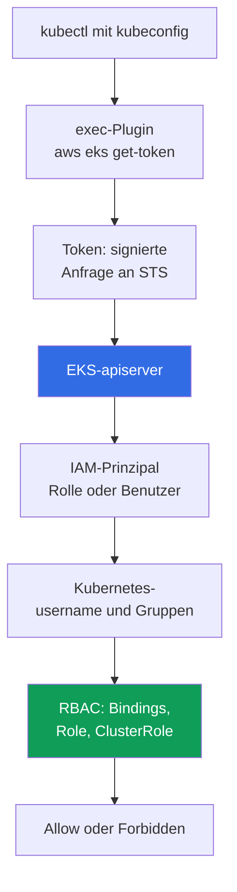
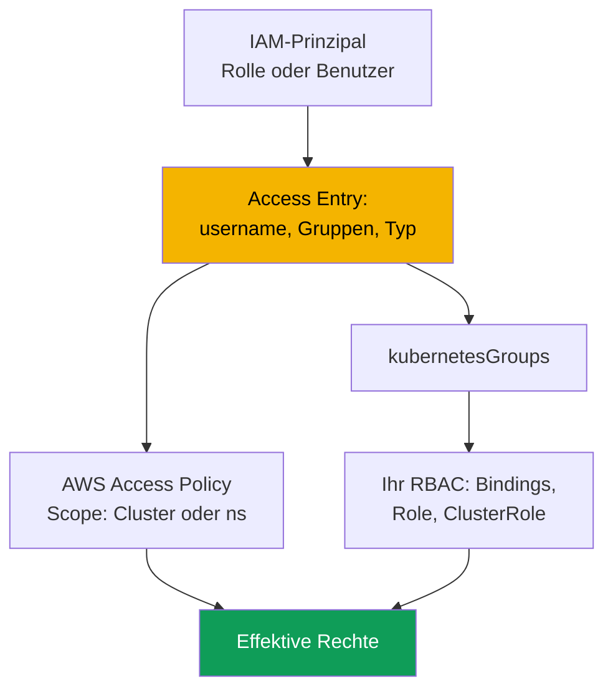

[Русская версия](ru.md) · [Eng version](en.md) · [Versión en español](es.md) · [Version française](fr.md) · [ქართული ვერსია](ge.md) · [繁體中文版](tw.md) · [日本語版](jp.md)
# Kapitel 5. Clusterzugriff: IAM und RBAC, Access Entries, Migration von aws-auth

> **Was kommt als Nächstes.** Der Cluster ist erstellt (Kapitel 4), und die nächste Frage lautet, wer ihn betreten darf und mit welchen Rechten. RBAC kennen Sie aus CKA, doch EKS schaltet davor eine zweite Ebene: die Authentifizierung über IAM. Dieses Kapitel behandelt die Schnittstelle dieser Ebenen, die drei Modi von `authenticationMode`, den Legacy-Mechanismus `aws-auth` ConfigMap und die ihn ersetzenden API Access Entries, Access Policies sowie die Migration ohne Zugriffsverlust. Der Zugriff von Pods auf AWS-APIs ist eine andere Aufgabe: IRSA (Kapitel 16) und Pod Identity (Kapitel 17).

## 5.1. „kubeconfig ist richtig, aber kubectl antwortet Unauthorized“

In kubeadm wurde Zugriff mit einem Client-Zertifikat erteilt: Sie signierten einen CSR mit Ihrer CA, gaben dem Engineer eine kubeconfig, und die Gruppen stammten aus dem Feld `O`. Der Mechanismus ist verständlich, mit einem bekannten Schmerzpunkt: Ein Zertifikat zu widerrufen ist praktisch unmöglich, der apiserver prüft keine Sperrlisten, und der einzig ehrliche Weg ist, die CA neu auszustellen, also den Zugriff für alle zu ändern. Das Ausscheiden eines Mitarbeiters wurde zum Mini-Projekt statt zum Löschen einer Zeile. EKS hat ein anderes Modell, dem man in zwei Szenarien begegnet.

**Erstens.** Ein Engineer führt `aws eks update-kubeconfig` aus, der Befehl endet fehlerfrei, der Kontext wechselt, aber `kubectl get pods` antwortet mit `error: You must be logged in to the server (Unauthorized)`. Die kubeconfig ist richtig: Endpoint, CA und Plugin sind vorhanden. Etwas anderes passt nicht: Der IAM-Prinzipal, unter dem der Engineer arbeitet, ist dem Cluster unbekannt, und keine IAM-Policy wird das beheben.

**Zweitens, und teurer.** Jemand bearbeitet die ConfigMap `aws-auth` und fügt eine Rolle für ein neues Team hinzu. Ein yaml-Einzug verrutscht, `mapRoles` kann nicht mehr geparst werden, und **alle** verlieren den Zugriff, einschließlich des Autors der Änderung. Von innen lässt sich nichts mehr tun: Um die ConfigMap zu reparieren, ist Zugriff nötig, aber es gibt keinen Zugriff.

Beide Fälle haben dieselbe Ursache: **In EKS ist die Authentifizierung extern, die Autorisierung intern**. Es sind zwei unabhängige Ebenen, und sie zu verwechseln kostet mehr als alles andere in diesem Kapitel.

## 5.2. IAM antwortet „Wer bist du?“, RBAC antwortet „Was darfst du tun?“

Die Authentifizierung lebt in AWS: Der apiserver prüft eine signierte STS-Anfrage und erhält den IAM-Prinzipal. Die Autorisierung lebt im Cluster: Gewöhnliches RBAC entscheidet, was dem Subjekt erlaubt ist. Zwischen den Ebenen steht eine **Abbildung**: Ein ARN wird zu einem Kubernetes-`username` und Gruppen.



`kubectl` sieht in der kubeconfig den Block `exec`, ruft `aws eks get-token` auf und erhält weder ein Passwort noch ein Zertifikat, sondern eine **signierte Anfrage** an STS: Über das Netzwerk geht eine Signatur, kein Geheimnis. Die Credentials bezieht das Plugin aus der normalen AWS-Providerkette: `AWS_PROFILE`, Umgebungsvariablen, dem SSO-Cache und der Instanzrolle (Kapitel 0.5). Der apiserver prüft die Signatur und erhält den ARN des Prinzipals; danach wird der ARN auf `username` und `kubernetesGroups` abgebildet, und RBAC trifft die Entscheidung.

Die Regel, die man wörtlich behalten sollte: Eine IAM-Policy mit `AdministratorAccess` **erteilt für sich allein keine Rechte im Cluster**. Sie erlaubt Aufrufe der EKS-API (den Cluster beschreiben, die Konfiguration ändern, ihn vollständig löschen), doch `kubectl get pods` liefert `Unauthorized`, bis der Prinzipal im Cluster abgebildet ist. Die einzige Ausnahme kam mit Access Entries: Über die EKS-API kann eine verwaltete Access Policy zugeordnet werden, und dann erteilt AWS Rechte unter Umgehung Ihrer `Role` und `ClusterRole` (Abschnitt 5.6). Da der Token an die aktuelle AWS-Sitzung gebunden ist, bedeutet „morgens ging es, nachmittags Unauthorized“ meist, dass die SSO-Sitzung abgelaufen ist; die Serverseite ist in Logs vom Typ `authenticator` sichtbar (Kapitel 2).

## 5.3. Die drei Modi von authenticationMode

Der Modus bestimmt, woher der Cluster die Abbildung von Prinzipalen bezieht. Er wird bei der Erstellung gesetzt (Kapitel 4) und kann auch bei einem laufenden Cluster geändert werden.

| Modus | Quelle der Abbildung | Wann passend |
|---|---|---|
| `CONFIG_MAP` | nur die ConfigMap `aws-auth` | Legacy: alte Cluster vor der Migration |
| `API_AND_CONFIG_MAP` | sowohl Access Entries als auch `aws-auth` | Übergangsmodus während der Migration |
| `API` | nur Access Entries | Zielmodus für neue Cluster |

Neue Cluster werden direkt im Modus `API` erstellt, alte wechseln zu `API_AND_CONFIG_MAP` und danach zu `API`. Wenn ein Prinzipal im Übergangsmodus sowohl in einem Access Entry als auch in `aws-auth` definiert ist, gewinnt der **Access Entry**: Sie können den Eintrag vorab erstellen und prüfen, ohne die ConfigMap-Zeile zu löschen. Die zentrale Einschränkung lautet: Bewegung **nur in Richtung API**, sie ist nicht umkehrbar.

```bash
aws eks describe-cluster --name demo --query 'cluster.accessConfig'
aws eks update-cluster-config --name demo --access-config authenticationMode=API_AND_CONFIG_MAP
aws eks update-cluster-config --name demo --access-config authenticationMode=API
```

## 5.4. aws-auth ConfigMap: warum sie abgelöst wird

Historisch lebte die Abbildung in einem Kubernetes-Objekt: der ConfigMap `aws-auth` in `kube-system`. Das Feld `mapRoles` bildet IAM-Rollen ab, `mapUsers` IAM-Benutzer.

```bash
kubectl -n kube-system get configmap aws-auth -o yaml
```

```yaml
data:
  mapRoles: |
    - rolearn: arn:aws:iam::111122223333:role/platform-admins
      username: platform-admin
      groups: [system:masters]
  mapUsers: |
    - userarn: arn:aws:iam::111122223333:user/ci-legacy
      username: ci-legacy
```

Der Mechanismus funktioniert, aber seine Probleme erklären genau, weshalb AWS einen Ersatz geschaffen hat.

- **Ein yaml-Fehler bedeutet Zugriffsverlust für alle.** `mapRoles` ist eine Zeichenkette für den authenticator, es gibt keine Schema-Validierung, und um die ConfigMap zu reparieren, ist genau der Zugriff nötig, den diese ConfigMap erteilt.
- **Das Objekt lebt im Cluster, nicht in der Clusterkonfiguration.** Es erscheint nicht in `describe-cluster`, lässt sich nicht über die EKS-API verwalten, driftet von Ihrem IaC ab und hat keine Historie: Wer wann eine Rolle mit `system:masters` hinzugefügt hat, lässt sich nicht herausfinden. EKS-API-Aufrufe erscheinen in CloudTrail (Kapitel 21).
- **Rechte lassen sich nicht im Voraus vergeben, und es gibt keine verwalteten Policies.** Ein Tippfehler in einem ARN fällt erst auf, wenn sich jemand nicht anmelden kann, und es ist grundsätzlich unmöglich, eine Access Policy mit einem ConfigMap-Eintrag zu verknüpfen.

## 5.5. Access Entries: Abbildung als Objekt der EKS-API

Ein Access Entry lebt in der Zugriffskonfiguration des Clusters, nicht im Cluster selbst, und verknüpft **einen** IAM-Prinzipal, eine Rolle oder einen Benutzer, mit `username` und einer Liste von `kubernetesGroups`; ein Prinzipal kann nicht in mehr als einem Eintrag stehen, und er kann bei einem bestehenden Eintrag nicht geändert werden.



Ein Eintrag hat einen **Typ**, der nicht durch Rechte, sondern durch die Art des Prinzipals bestimmt wird: `STANDARD` ist der Standard für Menschen, CI und Controller; `EC2_LINUX` und `EC2_WINDOWS` sind für selbstverwaltete Nodes; `FARGATE_LINUX` ist für Fargate; `HYBRID_LINUX` ist für Hybrid-Nodes; und `EC2` ist für eine Node Class im Auto Mode. Betriebsrelevant ist vor allem: **Für Managed Node Groups und Fargate-Profile müssen Sie keine Einträge erstellen**, EKS erstellt sie selbst. Eine selbstverwaltete Node braucht einen Eintrag, sonst kann sie dem Cluster nicht beitreten (Kapitel 45). Für `STANDARD` sollte `username` besser nicht gesetzt werden; der Service trägt ihn ein.

```bash
aws eks create-access-entry --cluster-name demo \
  --principal-arn arn:aws:iam::111122223333:role/platform-admins \
  --kubernetes-groups platform-admins --type STANDARD

aws eks list-access-entries --cluster-name demo
aws eks describe-access-entry --cluster-name demo \
  --principal-arn arn:aws:iam::111122223333:role/platform-admins
```

Danach ist `platform-admins` eine gewöhnliche Kubernetes-Gruppe: Erstellen Sie dafür ein `ClusterRoleBinding`, und alles, was Sie aus CKA kennen, funktioniert. Ein Access Entry ersetzt RBAC nicht, sondern stellt ein RBAC-Subjekt bereit.

**Der Eintrag des Clustererstellers.** `bootstrapClusterCreatorAdminPermissions` hat standardmäßig den Wert `true`: Der Prinzipal, der den Cluster erstellt hat, erhält darin Administratorrechte. Das ist zugleich Rettungsausgang und Falle (Kapitel 4): Der Eintrag ist im normalen Betrieb unsichtbar, nicht im Code beschrieben, lässt sich nicht mit IAM-Policies entfernen, und wenn der Cluster mit der persönlichen Rolle eines Engineers erstellt wurde, behält diese Rolle die Rechte auch nach dessen Ausscheiden. Praxis: Eine CI-Rolle erstellt den Cluster, das Flag steht auf `false`, und Administratorrechte werden im Code als explizite Access Entries beschrieben.

## 5.6. Access Policies: Rechte im Cluster über die EKS-API

Der zweite Weg, Rechte zu erteilen, ist die Zuordnung einer verwalteten **Access Policy** zu einem Access Entry. Dies sind Policies auf Kubernetes-Ebene, keine IAM-Policies: Sie enthalten intern Verben und Ressourcen, erteilen nur Rechte und können von Ihnen weder geändert noch erstellt werden. Sie ergänzen RBAC: Die effektiven Rechte eines Prinzipals sind die Summe der Rechte aus Access Policies und aus Bindings an seine Gruppen und seinen `username`.

| Access Policy | Was sie erteilt | Typischer Access Scope |
|---|---|---|
| `AmazonEKSClusterAdminPolicy` | vollständiger Administrator, entsprechend `cluster-admin` | `cluster` |
| `AmazonEKSAdminPolicy` | fast alle Aktionen mit Ressourcen | `namespace` |
| `AmazonEKSEditPolicy` | Workloads ändern, ohne RBAC zu bearbeiten | `namespace` |
| `AmazonEKSViewPolicy` | Ressourcen lesen, ohne Secrets | `namespace` oder `cluster` |
| `AmazonEKSAdminViewPolicy` | alle Ressourcen lesen, einschließlich Secrets | `cluster` |

Ein Access Scope hat zwei Formen: `cluster` für den ganzen Cluster oder `namespace` mit einer Liste, die Muster wie `dev-*` erlaubt. Der Scope kann geändert werden, doch EKS prüft nicht, ob ein Namespace existiert: Ein Tippfehler ergibt stillschweigend leere Rechte.

```bash
aws eks associate-access-policy --cluster-name demo \
  --principal-arn arn:aws:iam::111122223333:role/team-payments \
  --policy-arn arn:aws:eks::aws:cluster-access-policy/AmazonEKSEditPolicy \
  --access-scope type=namespace,namespaces=payments,payments-stage

aws eks list-associated-access-policies --cluster-name demo \
  --principal-arn arn:aws:iam::111122223333:role/team-payments
```

**Fertige Policies** verwenden Sie für Standardrollen: ansehen, im eigenen Namespace arbeiten oder einmalig Administratorrechte erhalten. Eigene `Role` und `ClusterRole` schreiben Sie, wenn weniger oder spezifische Rechte nötig sind: Zugriff auf eigene CRDs, nur `logs` und `exec`, keine Secrets. Dann setzt der Access Entry `kubernetesGroups`, und Ihr RBAC beschreibt die Rechte. Eine Mischform ist normal: `AmazonEKSViewPolicy` für den Cluster plus eine eigene Gruppe mit punktgenauen Rechten im Namespace. Eine Falle beim Debugging: `kubectl auth can-i --list` **zeigt keine** Rechte aus Access Policies, weil sie nicht als RBAC-Objekte ausgedrückt sind; prüfen Sie stattdessen `list-associated-access-policies`.

## 5.7. Migration von aws-auth zu Access Entries

| Eigenschaft | ConfigMap `aws-auth` | Access Entries |
|---|---|---|
| Wo sie lebt | Objekt in `kube-system` | Clusterkonfiguration in der EKS-API |
| Validierung | keine, yaml-Zeichenkette in einem Feld | auf Seite der EKS-API |
| Ein Fehler unterbricht | Zugriff für alle, einschließlich Sie selbst | einen Eintrag |
| Änderungshistorie | keine | CloudTrail (Kapitel 21) |
| Verwaltete AWS-Policies | nein | ja, Access Policies |
| Verwaltung aus IaC | über den Kubernetes-Provider | über den AWS-Provider |

1. **Inventarisierung.** Speichern Sie `aws-auth` in einer Datei: Sie ist sowohl Migrationsplan als auch Rollback.
2. **Modus `API_AND_CONFIG_MAP`.** Access Entries werden aktiviert, die ConfigMap funktioniert weiter, kein bestehender Zugriff geht verloren.
3. **Einträge für Menschen und Services.** Erstellen Sie für jede von **Ihnen** hinzugefügte Zeile in `mapRoles` und `mapUsers` einen Access Entry mit demselben `username` und denselben Gruppen: Dahinter stehen die RBAC-Bindings.
4. **Nodes nicht anfassen.** Zeilen, die EKS für Managed Node Groups und Fargate-Profile erstellt hat, bleiben Aufgabe des Services; sie ohne gleichwertige Einträge zu löschen, beschädigt den Cluster. Für selbstverwaltete Nodes erstellen Sie einen Eintrag vom Typ `EC2_LINUX` mit demselben `username` und denselben Gruppen.
5. **Vor dem Löschen prüfen.** Öffnen Sie eine **zweite** Sitzung unter der Migrationsrolle und stellen Sie sicher, dass sie funktioniert, ohne die erste zu schließen. Entfernen Sie anschließend ConfigMap-Zeilen nacheinander.
6. **Modus `API`** gilt, wenn keine eigenen Einträge mehr in der ConfigMap verbleiben. Dieser Schritt ist unumkehrbar.

```bash
aws eks update-kubeconfig --name demo --region eu-central-1 --alias demo-migrated
kubectl auth whoami
kubectl auth can-i get pods -n payments
kubectl auth can-i list secrets -n kube-system --as-group platform-admins
```

## 5.8. Typische Ablehnungen: Unauthorized versus Forbidden

| Merkmal | `Unauthorized` (401) | `Forbidden` (403) |
|---|---|---|
| Beschädigte Ebene | Authentifizierung, AWS | Autorisierung, RBAC |
| Bedeutung | Der Cluster hat nicht verstanden, wer Sie sind | Er hat verstanden, wer Sie sind, aber die Aktion nicht erlaubt |
| Typische Ursachen | falsches Profil, abgelaufenes SSO, Rolle nicht registriert | keine Gruppenbindung, enger Policy-Scope |
| Wo nachsehen | `get-caller-identity`, `list-access-entries`, Logs von `authenticator` | `auth can-i`, RBAC-Bindings, Policy-Zuordnungen |
| Was es behebt | ein Access Entry oder `aws-auth` | ein Binding, `ClusterRole` oder eine Access Policy |

```bash
aws sts get-caller-identity            # wer AWS mich genau jetzt sieht
echo "$AWS_PROFILE"                    # ist dies das erwartete Profil
aws eks list-access-entries --cluster-name demo   # kennt der Cluster diesen ARN
kubectl auth whoami                    # wie der apiserver mich sieht: username und Gruppen
```

`kubectl auth whoami` ist die schnellste Prüfung der Schnittstelle: Antwortet der Befehl, war die Authentifizierung erfolgreich und das Problem sind die Rechte; liefert er `Unauthorized`, wurde RBAC nie erreicht. Ein weiterer Stolperstein ist, dass `get-caller-identity` die Rolle anzeigt, die Sie **angenommen** haben, während der Access Entry den ARN der Rolle selbst verwenden muss, nicht den ARN der assumed-role-Sitzung. Logs vom Typ `authenticator` (Kapitel 2) zeigen die Serverseite, wenn Client-Prüfungen nicht übereinstimmen; komplexe Fälle behandelt Kapitel 47.

## 5.9. Zugriff für Menschen und CI organisieren

- **Menschen erhalten keine dauerhaften Rechte.** Sie melden sich über IAM Identity Center an: Ein Permission Set entspricht einer IAM-Rolle, die Rolle einem Access Entry im Cluster. Die Sitzung ist temporär; ein Entzug bedeutet, eine Zuweisung zu entfernen, nicht eine CA neu auszustellen.
- **Kubernetes-Gruppen statt persönlicher Einträge.** Der Access Entry wird für eine Teamrolle erstellt, nicht für eine Person: Dreißig Engineers bedeuten dreißig Gelegenheiten, beim Offboarding einen Eintrag zu vergessen.
- **Vergessene Einträge prüfen.** Vergleichen Sie `aws eks list-access-entries` regelmäßig mit den aktuellen Rollen: Ein Eintrag, dessen `principal-arn` auf eine gelöschte oder lange nicht mehr angenommene Rolle zeigt, ist vergessener Löschzugriff; Rollenannahmen erscheinen in CloudTrail (Kapitel 21).
- **Break-Glass getrennt halten.** Eine Rolle mit `AmazonEKSClusterAdminPolicy` im Scope `cluster`, die im normalen Betrieb niemand annimmt: strenge Trust Policy, MFA und ein Alarm bei der Annahme in CloudTrail (Kapitel 21). Sie ist Ihr Ausweg aus der Situation in Abschnitt 5.1.
- **CI mit eigener Rolle.** Das Vertrauen beschränkt sich auf ein konkretes Repository und einen Branch (Kapitel 0.2), die Rechte entsprechen `AmazonEKSEditPolicy` in den eigenen Namespaces, und sie darf die Zugriffskonfiguration des Clusters nicht ändern, sonst erteilt die Pipeline sich selbst Rechte. Access Entries und Policy-Zuordnungen sind selbst gewöhnliche IaC-Ressourcen neben dem Cluster (Kapitel 4). Teamisolation behandelt Kapitel 22.

## 5.10. Einsatz in Produktion

- **Neue Cluster starten direkt im Modus `API`**, `bootstrapClusterCreatorAdminPermissions` steht auf `false`, und Administratorzugriff wird als explizite Access Entries im Code beschrieben.
- **Menschen melden sich über IAM Identity Center an**: Permission Set zu Rolle, Rolle zu Access Entry, Rechte zu einer Kubernetes-Gruppe; es gibt keine persönlichen Einträge, und eine Break-Glass-Rolle steht unter Alarmierung.
- **CI hat eine eigene Rolle** mit Rechten auf Namespace-Ebene und ohne Berechtigung, die Zugriffskonfiguration zu ändern. Logs vom Typ `authenticator` sind aktiviert, und `aws-auth` existiert auf neuen Clustern grundsätzlich nicht.

## 5.11. Mini-Glossar

- **Access Entry**: ein Eintrag in der Zugriffskonfiguration des Clusters, der einen IAM-Prinzipal mit `username` und `kubernetesGroups` verknüpft; `STANDARD` ist für Menschen und Services, `EC2_LINUX`, `EC2_WINDOWS`, `FARGATE_LINUX`, `HYBRID_LINUX` und `EC2` sind für Nodes.
- **Access Policy**: eine von AWS verwaltete Policy für Rechte auf Kubernetes-Ebene, die einem Access Entry zugeordnet wird; sie enthält Verben und Ressourcen statt IAM-Rechte und kann nicht bearbeitet werden. **Access Scope** ist ihr Geltungsbereich: `cluster` oder `namespace` mit einer Liste.
- **`authenticationMode`**: der Authentifizierungsmodus: `CONFIG_MAP`, `API_AND_CONFIG_MAP` oder `API`; die Bewegung erfolgt nur in Richtung `API`. Die ConfigMap **`aws-auth`** ist der Legacy-Mechanismus zur Abbildung über ein Objekt in `kube-system` mit den Feldern `mapRoles` und `mapUsers`.
- **`bootstrapClusterCreatorAdminPermissions`**: ein Feld bei der Clustererstellung; bei `true` (Standard) erhält der Ersteller Administratorrechte im Cluster.

## 5.12. Zusammenfassung des Kapitels

- Die Authentifizierung ist extern (IAM und STS), die Autorisierung intern (RBAC), und `AdministratorAccess` in IAM erteilt für sich allein keine Rechte im Cluster. Die Kette lautet: `kubectl`, das Plugin `aws eks get-token`, eine signierte STS-Anfrage, Signaturprüfung, ARN-Abbildung auf `username` und Gruppen, dann RBAC.
- Es gibt drei Modi: `CONFIG_MAP`, `API_AND_CONFIG_MAP` und `API`. Das Ziel ist `API`, der Übergang dorthin ist unumkehrbar, und im Übergangsmodus hat ein Access Entry Vorrang vor `aws-auth`, das strukturell unsicher ist: Es gibt keine Validierung oder Historie, ein yaml-Fehler schaltet den Zugriff für alle einschließlich des Autors der Änderung ab, und das Objekt lässt sich anschließend nicht mehr von innen reparieren.
- Access Entries leben in der EKS-API, werden validiert, sind in CloudTrail sichtbar und werden im Code beschrieben. Rechte werden über `kubernetesGroups` plus Ihr RBAC, über Access Policies mit dem Scope `cluster` oder `namespace` oder über beides erteilt. Die Migration lautet: `API_AND_CONFIG_MAP`, Einträge für eigene Zeilen, Node-Einträge in Ruhe lassen, aus einer zweiten Sitzung prüfen, Zeilen entfernen, dann den Modus `API` verwenden.
- `Unauthorized` bedeutet Authentifizierung, `Forbidden` bedeutet Autorisierung, und die Diagnose beginnt mit `aws sts get-caller-identity` und `kubectl auth whoami`, nicht mit dem Lesen von RBAC-Manifesten.

## 5.13. Wie dies in der täglichen Arbeit hilft

Die Aufgabe „Zugriff eines ausgeschiedenen Engineers widerrufen“ dauert Minuten, wenn der Zugriff auf temporären Rollen und Gruppen basiert, und eine unbekannte Zeit, wenn die Person einen persönlichen Eintrag hatte und außerdem den Cluster erstellt hat. Die Frage „Wer kann einen Namespace in Produktion löschen?“ wird entweder durch Auflisten der Einträge und Bindings beantwortet oder gar nicht. Das Szenario aus dem ersten Abschnitt ist keine Katastrophe mehr, wenn es eine Break-Glass-Rolle und den Modus `API` gibt.

## 5.14. Fragen zur Selbstkontrolle

1. Warum erteilt `AdministratorAccess` in IAM nicht das Recht, im Cluster `kubectl get pods` auszuführen?
2. Was genau wird als Token an den apiserver gesendet, und warum ist es kein Passwort?
3. Wie unterscheiden sich `Unauthorized` und `Forbidden`, und wo beginnen Sie die Diagnose für jeden Fall?
4. Welche drei Werte kann `authenticationMode` annehmen, und welche Übergänge sind möglich?
5. Derselbe ARN steht sowohl in `aws-auth` als auch in einem Access Entry. Was gewinnt, und in welchem Modus?
6. Was bestimmt den Typ eines Access Entry, und für welche Nodes werden Einträge automatisch erstellt?
7. Wann würden Sie `AmazonEKSEditPolicy` verwenden, und wann eine eigene `ClusterRole` schreiben?
8. Warum kann `kubectl auth can-i --list` Rechte, die tatsächlich existieren, möglicherweise nicht anzeigen?
9. Beschreiben Sie eine Migrationsreihenfolge von `aws-auth`, die an jedem Punkt einen Wiederherstellungsweg behält.

## Praxis

Die Kurs-Labs zu diesem Thema sind [Lab 102 - Clusterzugriff: IAM und RBAC, Access Entries und Access Policies](../../labs/102/README_DE.MD) und [Lab 122 - AWS Backup für EKS: Composite Recovery Point, Wiederherstellung eines Namespace](../../labs/122/README_DE.MD). Darüber hinaus kann der Inhalt auf jedem Cluster geprüft werden. Beginnen Sie mit der Inventarisierung: `aws eks describe-cluster --name <cluster> --query 'cluster.accessConfig'` zeigt Modus und Ersteller-Flag; `aws eks list-access-entries --cluster-name <cluster>` und `aws eks describe-access-entry` mit `--principal-arn` zeigen Typ, `username` und Gruppen eines Eintrags. Führen Sie für Einträge vom Typ `STANDARD` `aws eks list-associated-access-policies` aus und prüfen Sie den Scope.

Vergleichen Sie danach die beiden Ebenen: Sammeln Sie Gruppen aus Access Entries und suchen Sie sie in `kubectl get clusterrolebindings,rolebindings -A -o wide`. Gruppen ohne Bindings und ohne Access Policies erteilen nichts, während Bindings für Gruppen, die in keinem Eintrag vorkommen, totes RBAC sind. Suchen Sie außerdem nach vergessenen Einträgen: Gehen Sie `list-access-entries` durch und führen Sie für jeden `principal-arn` `aws iam get-role` aus; ein Eintrag für eine nicht existierende Rolle ist toter Löschzugriff. Prüfen Sie sich mit `kubectl auth whoami` und `kubectl auth can-i --list` und bedenken Sie, dass Rechte aus Access Policies in dieser Ausgabe nicht erscheinen. Befindet sich der Cluster noch im Modus `CONFIG_MAP` oder `API_AND_CONFIG_MAP`, speichern Sie `kubectl -n kube-system get configmap aws-auth -o yaml` in einer Datei. Üben Sie separat eine Ablehnung: Erstellen Sie eine Rolle ohne Access Entry, versuchen Sie sich anzumelden, und finden Sie sie in Logs vom Typ `authenticator` (Kapitel 2).

---
[Inhaltsverzeichnis](../README_DE.md) · [Kapitel 4](../04/de.md) · [Kapitel 6](../06/de.md)
