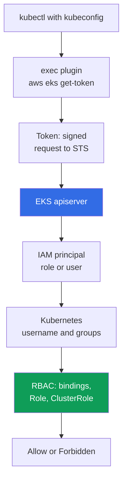
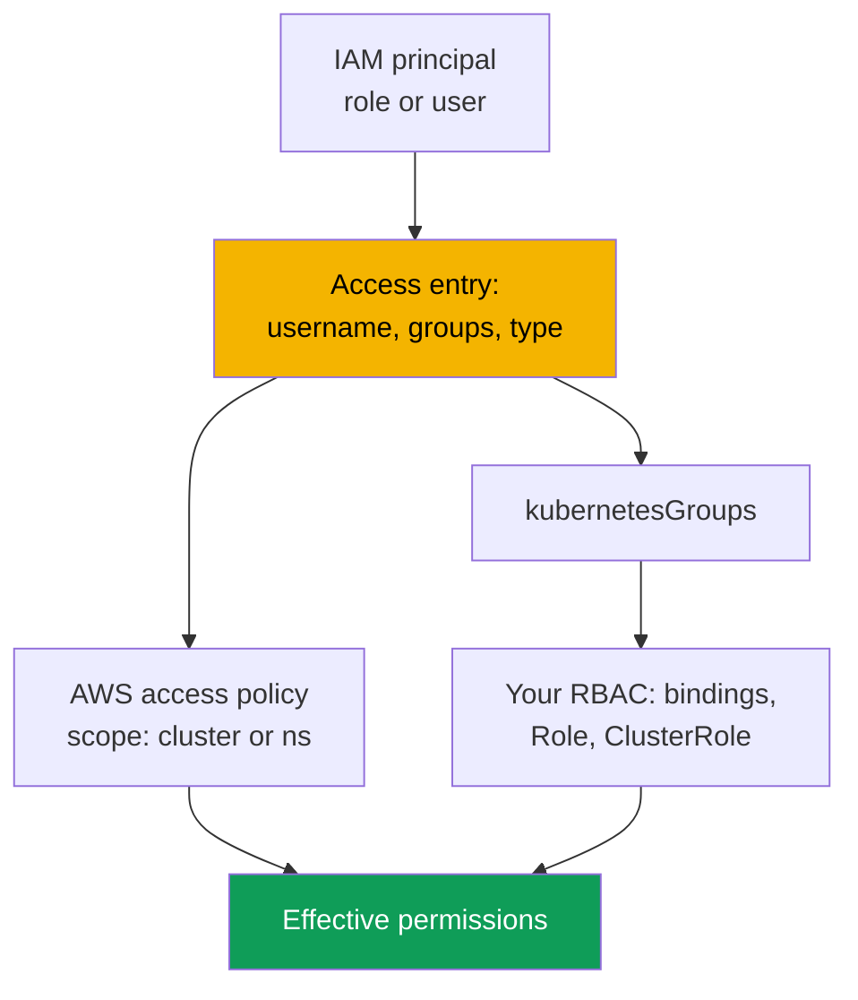

[Русская версия](ru.md) · [Versión en español](es.md) · [Version française](fr.md) · [Deutsche Version](de.md) · [ქართული ვერსია](ge.md) · [繁體中文版](tw.md) · [日本語版](jp.md)
# Chapter 5. Cluster access: IAM and RBAC, access entries, migration from aws-auth

> **What is next.** The cluster is created (Chapter 4), and the next question is who can enter it and with which permissions. You know RBAC from CKA, but EKS adds a second layer before it: IAM authentication. This chapter covers where the two layers meet, the three `authenticationMode` modes, the legacy `aws-auth` ConfigMap mechanism and the API access entries that replace it, access policies, and migration without losing access. Pod access to AWS APIs is a different task: IRSA (Chapter 16) and Pod Identity (Chapter 17).

## 5.1. “The kubeconfig is correct, but kubectl returns Unauthorized”

In kubeadm, access was granted with a client certificate: you signed a CSR with your CA, gave the engineer a kubeconfig, and took groups from the `O` field. The mechanism is clear, with one well-known pain point: revoking a certificate is practically impossible, apiserver does not check revocation lists, and the only honest solution is to reissue the CA, which means access changes for everyone. An employee departure became a mini-project rather than removing one line. EKS has a different model, and you encounter it in two scenarios.

**First.** An engineer runs `aws eks update-kubeconfig`; the command completes without errors, the context switches, but `kubectl get pods` returns `error: You must be logged in to the server (Unauthorized)`. The kubeconfig is correct: endpoint, CA, and plugin are in place. Something else does not match: the IAM principal under which the engineer works is unknown to the cluster, and no IAM policy will fix that.

**Second, and more expensive.** Someone edits the `aws-auth` ConfigMap, adding a role for a new team. An indentation in yaml shifts, `mapRoles` can no longer be parsed, and **everyone** loses access, including the author of the change. Nothing can be done from inside: access is needed to fix the ConfigMap, but there is no access.

Both cases have the same cause: **in EKS, authentication is external and authorization is internal**. They are two independent layers, and confusing them costs more than anything else in this chapter.

## 5.2. IAM answers “who are you”, RBAC answers “what may you do”

Authentication lives in AWS: apiserver verifies a signed STS request and obtains the IAM principal. Authorization lives in the cluster: ordinary RBAC decides what the subject is allowed to do. Between the layers is a **mapping**: an ARN becomes a Kubernetes `username` and groups.



`kubectl` sees the `exec` block in kubeconfig, invokes `aws eks get-token`, and receives neither a password nor a certificate, but a **signed request** to STS: a signature travels over the network, not a secret. The plugin obtains credentials from the normal AWS provider chain: `AWS_PROFILE`, environment variables, the SSO cache, and the instance role (Chapter 0.5). apiserver verifies the signature and obtains the principal ARN; the ARN is then mapped to `username` and `kubernetesGroups`, and RBAC makes the decision.

The rule worth memorizing verbatim is this: an IAM policy with `AdministratorAccess` **does not grant any rights inside the cluster by itself**. It permits EKS API calls (describe the cluster, change configuration, delete it entirely), but `kubectl get pods` returns `Unauthorized` until the principal is mapped into the cluster. The only exception appeared with access entries: the EKS API can associate a managed access policy, and then AWS grants permissions, bypassing your `Role` and `ClusterRole` (Section 5.6). Because the token is tied to the current AWS session, “it worked this morning, Unauthorized after lunch” usually means that the SSO session expired; the server side is visible in `authenticator`-type logs (Chapter 2).

## 5.3. The three authenticationMode modes

The mode determines where the cluster obtains principal mappings. It is set at creation (Chapter 4) and can also be changed for a live cluster.

| Mode | Mapping source | When it fits |
|---|---|---|
| `CONFIG_MAP` | only the `aws-auth` ConfigMap | legacy: old clusters before migration |
| `API_AND_CONFIG_MAP` | both access entries and `aws-auth` | transition mode during migration |
| `API` | only access entries | target mode for new clusters |

New clusters are created directly in `API`; old ones move to `API_AND_CONFIG_MAP`, then to `API`. In transition mode, if a principal is defined in both an access entry and `aws-auth`, the **access entry** wins: you can create and test the entry in advance without deleting the ConfigMap line. The key restriction is movement **only toward API**; it cannot be reversed.

```bash
aws eks describe-cluster --name demo --query 'cluster.accessConfig'
aws eks update-cluster-config --name demo --access-config authenticationMode=API_AND_CONFIG_MAP
aws eks update-cluster-config --name demo --access-config authenticationMode=API
```

## 5.4. aws-auth ConfigMap: why it is being retired

Historically, the mapping lived in a Kubernetes object: the `aws-auth` ConfigMap in `kube-system`. The `mapRoles` field maps IAM roles and `mapUsers` maps IAM users.

```bash
kubectl -n kube-system get configmap aws-auth -o yaml
```

```yaml
data:
  mapRoles: |
    - rolearn: arn:aws:iam::111122223333:role/platform-admins
      username: platform-admin
      groups: [system:masters]
  mapUsers: |
    - userarn: arn:aws:iam::111122223333:user/ci-legacy
      username: ci-legacy
```

The mechanism works, but its problems precisely explain why AWS created a replacement.

- **One yaml error means access loss for everyone.** `mapRoles` is a string for the authenticator, there is no schema validation, and fixing the ConfigMap requires the access granted by that same ConfigMap.
- **The object lives in the cluster, not in cluster configuration.** It is absent from `describe-cluster`, cannot be managed through the EKS API, drifts from your IaC, and has no history: you cannot find out who added a role with `system:masters` or when. EKS API calls appear in CloudTrail (Chapter 21).
- **You cannot grant access in advance, and there are no managed policies.** A typo in an ARN is discovered only when someone cannot log in, and it is impossible to associate an access policy with a ConfigMap entry.

## 5.5. Access entries: mapping as an EKS API object

An access entry lives in the cluster access configuration, not inside the cluster. It associates **one** IAM principal, either a role or a user, with a `username` and a list of `kubernetesGroups`; a principal cannot be in more than one entry, and it cannot be changed on an existing entry.



An entry has a **type**, determined not by permissions but by what the principal is: `STANDARD` is the default for people, CI, and controllers; `EC2_LINUX` and `EC2_WINDOWS` are for self-managed nodes; `FARGATE_LINUX` is for Fargate; `HYBRID_LINUX` is for hybrid nodes; and `EC2` is for a node class in Auto Mode. Operationally, the key point is that **you do not need to create entries for managed node groups and Fargate profiles**: EKS creates them itself. A self-managed node needs an entry or it cannot join the cluster (Chapter 45). It is best not to set `username` for `STANDARD`; the service supplies it.

```bash
aws eks create-access-entry --cluster-name demo \
  --principal-arn arn:aws:iam::111122223333:role/platform-admins \
  --kubernetes-groups platform-admins --type STANDARD

aws eks list-access-entries --cluster-name demo
aws eks describe-access-entry --cluster-name demo \
  --principal-arn arn:aws:iam::111122223333:role/platform-admins
```

After that, `platform-admins` is an ordinary Kubernetes group: create a `ClusterRoleBinding` for it and everything you know from CKA works. An access entry does not replace RBAC; it provides an RBAC subject.

**The cluster creator entry.** `bootstrapClusterCreatorAdminPermissions` defaults to `true`: the principal that created the cluster gets administrator permissions inside it. This is an escape hatch and a trap at the same time (Chapter 4): the entry is invisible in ordinary work, not described in code, cannot be removed with IAM policies, and if the cluster was created with an engineer's personal role, that role retains permissions even after the engineer leaves. Practice: a CI role creates the cluster, the flag is `false`, and administrator permissions are described as explicit access entries in code.

## 5.6. Access policies: cluster rights through the EKS API

The second way to grant permissions is to associate a managed **access policy** with an access entry. These are Kubernetes-level policies, not IAM policies: internally they contain verbs and resources, grant permissions only, and cannot be modified or created by you. They supplement RBAC: a principal's effective rights are the sum of rights from access policies and from bindings to its groups and `username`.

| Access policy | What it grants | Typical access scope |
|---|---|---|
| `AmazonEKSClusterAdminPolicy` | full administrator, equivalent to `cluster-admin` | `cluster` |
| `AmazonEKSAdminPolicy` | nearly all resource actions | `namespace` |
| `AmazonEKSEditPolicy` | modify workloads, without editing RBAC | `namespace` |
| `AmazonEKSViewPolicy` | read resources, without secrets | `namespace` or `cluster` |
| `AmazonEKSAdminViewPolicy` | read all resources, including secrets | `cluster` |

An access scope has two forms: `cluster` for the whole cluster, or `namespace` with a list that supports patterns such as `dev-*`. You can change the scope, but EKS does not verify that a namespace exists: a typo silently yields empty permissions.

```bash
aws eks associate-access-policy --cluster-name demo \
  --principal-arn arn:aws:iam::111122223333:role/team-payments \
  --policy-arn arn:aws:eks::aws:cluster-access-policy/AmazonEKSEditPolicy \
  --access-scope type=namespace,namespaces=payments,payments-stage

aws eks list-associated-access-policies --cluster-name demo \
  --principal-arn arn:aws:iam::111122223333:role/team-payments
```

Use **ready-made policies** for standard roles: viewing, working in your namespace, or obtaining administrator access once. Write your own `Role` and `ClusterRole` when fewer or specific rights are needed: access to your CRDs, only `logs` and `exec`, or no secrets. Then the access entry sets `kubernetesGroups` and your RBAC describes the rights. Hybrid use is normal: `AmazonEKSViewPolicy` for the cluster plus a custom group with precise namespace rights. A debugging trap is that `kubectl auth can-i --list` **does not show** access-policy rights because they are not expressed as RBAC objects; check `list-associated-access-policies` instead.

## 5.7. Migrating from aws-auth to access entries

| Property | `aws-auth` ConfigMap | Access entries |
|---|---|---|
| Where it lives | object in `kube-system` | cluster configuration in the EKS API |
| Validation | none, yaml string inside a field | on the EKS API side |
| An error breaks | access for everyone, including yourself | one entry |
| Change history | none | CloudTrail (Chapter 21) |
| AWS managed policies | no | yes, access policies |
| IaC management | through the Kubernetes provider | through the AWS provider |

1. **Inventory.** Save `aws-auth` to a file: it is both the migration plan and the rollback.
2. **`API_AND_CONFIG_MAP` mode.** Access entries are enabled, while the ConfigMap continues to work; no existing access breaks.
3. **Entries for people and services.** For every `mapRoles` and `mapUsers` line that **you** added, create an access entry with the same `username` and groups: RBAC bindings stand behind them.
4. **Do not touch nodes.** Lines that EKS created for managed node groups and Fargate profiles remain the service's responsibility; deleting them without equivalent entries breaks the cluster. For self-managed nodes, create an `EC2_LINUX` entry with the same `username` and groups.
5. **Verify before deletion.** Open a **second** session using the migration role and verify it works without closing the first one. Then remove ConfigMap lines one at a time.
6. **`API` mode** applies when no entries of your own remain in the ConfigMap. This step is irreversible.

```bash
aws eks update-kubeconfig --name demo --region eu-central-1 --alias demo-migrated
kubectl auth whoami
kubectl auth can-i get pods -n payments
kubectl auth can-i list secrets -n kube-system --as-group platform-admins
```

## 5.8. Common denials: Unauthorized versus Forbidden

| Sign | `Unauthorized` (401) | `Forbidden` (403) |
|---|---|---|
| Broken layer | authentication, AWS | authorization, RBAC |
| Meaning | the cluster did not understand who you are | it understood who you are but did not allow the action |
| Typical causes | wrong profile, expired SSO, role not registered | no group binding, narrow policy scope |
| Where to look | `get-caller-identity`, `list-access-entries`, `authenticator` logs | `auth can-i`, RBAC bindings, policy associations |
| What fixes it | an access entry or `aws-auth` | a binding, `ClusterRole`, or access policy |

```bash
aws sts get-caller-identity            # who AWS sees me as right now
echo "$AWS_PROFILE"                    # is this the profile you expect
aws eks list-access-entries --cluster-name demo   # does the cluster know this ARN
kubectl auth whoami                    # how apiserver sees me: username and groups
```

`kubectl auth whoami` is the quickest check of the boundary: if the command responds, authentication passed and the problem is permissions; if it returns `Unauthorized`, RBAC was never reached. A separate pitfall is that `get-caller-identity` shows the role you **assumed**, while the access entry must use the ARN of the role itself, not the ARN of the assumed-role session. `authenticator`-type logs (Chapter 2) show the server side when client checks do not agree; complex cases are in Chapter 47.

## 5.9. Organizing access for people and CI

- **People do not receive permanent permissions.** They enter through IAM Identity Center: a permission set maps to an IAM role and the role maps to an access entry in the cluster. The session is temporary; revocation is removing an assignment, not reissuing a CA.
- **Kubernetes groups, not personal entries.** Create an access entry for a team role, not a person: thirty engineers mean thirty opportunities to forget an entry during an offboarding.
- **Audit forgotten entries.** Regularly compare `aws eks list-access-entries` with current roles: an entry whose `principal-arn` points to a deleted or long-unassumed role is forgotten deletion access, while role assumptions appear in CloudTrail (Chapter 21).
- **Separate break-glass.** One role with `AmazonEKSClusterAdminPolicy` at `cluster` scope that nobody assumes in ordinary work: strict trust policy, MFA, and an alert on assuming it in CloudTrail (Chapter 21). It is your exit from the situation in Section 5.1.
- **A separate role for CI.** Trust is restricted to a specific repository and branch (Chapter 0.2), permissions are `AmazonEKSEditPolicy` level in its namespaces, and it cannot change cluster access configuration, otherwise the pipeline grants itself permissions. Access entries and policy associations themselves are ordinary IaC resources next to the cluster (Chapter 4). Team isolation is Chapter 22.

## 5.10. How it is used in production

- **New clusters start in `API` mode**, with `bootstrapClusterCreatorAdminPermissions` set to `false` and administrator access described by explicit access entries in code.
- **People enter through IAM Identity Center**: permission set to role, role to access entry, rights to a Kubernetes group; there are no personal entries, and there is one break-glass role under alerting.
- **CI has its own role** with namespace-level rights and no permission to change access configuration. `authenticator`-type logs are enabled, and `aws-auth` does not exist on new clusters at all.

## 5.11. Mini glossary

- **Access entry**: a record in cluster access configuration that associates one IAM principal with `username` and `kubernetesGroups`; `STANDARD` is for people and services, while `EC2_LINUX`, `EC2_WINDOWS`, `FARGATE_LINUX`, `HYBRID_LINUX`, and `EC2` are for nodes.
- **Access policy**: an AWS-managed Kubernetes-level permissions policy associated with an access entry; it contains verbs and resources, not IAM permissions, and cannot be edited. **Access scope** is its range: `cluster` or `namespace` with a list.
- **`authenticationMode`**: the authentication mode: `CONFIG_MAP`, `API_AND_CONFIG_MAP`, or `API`; movement is only toward `API`. **`aws-auth` ConfigMap** is the legacy mapping mechanism through an object in `kube-system` with `mapRoles` and `mapUsers` fields.
- **`bootstrapClusterCreatorAdminPermissions`**: a cluster-creation field; when `true` (the default), the creator receives administrator permissions inside the cluster.

## 5.12. Chapter summary

- Authentication is external (IAM and STS), authorization is internal (RBAC), and `AdministratorAccess` in IAM does not itself grant rights in the cluster. The chain is `kubectl`, the `aws eks get-token` plugin, a signed STS request, signature verification, ARN mapping to `username` and groups, then RBAC.
- There are three modes: `CONFIG_MAP`, `API_AND_CONFIG_MAP`, and `API`. The target is `API`, the transition toward it is irreversible, and in transition mode an access entry has priority over `aws-auth`, which is structurally unsafe: there is no validation or history, a yaml error disables access for everyone including the change author, and the object cannot then be fixed from inside.
- Access entries live in the EKS API, are validated, visible in CloudTrail, and described in code. Permissions are granted through `kubernetesGroups` plus your RBAC, through access policies with `cluster` or `namespace` scope, or both. Migration is `API_AND_CONFIG_MAP`, entries for your own lines, leave node entries alone, verify from a second session, remove lines, then use `API` mode.
- `Unauthorized` means authentication, `Forbidden` means authorization, and diagnosis starts with `aws sts get-caller-identity` and `kubectl auth whoami`, not by reading RBAC manifests.

## 5.13. How this helps in real work

The task “revoke access for a departed engineer” takes minutes when access is built on temporary roles and groups, and an unknown amount of time when the person has a personal entry and also created the cluster. The question “who can delete a namespace in production” is either answered by listing entries and bindings or cannot be answered at all. The scenario from the first section stops being a catastrophe when a break-glass role and `API` mode exist.

## 5.14. Self-check questions

1. Why does `AdministratorAccess` in IAM not grant the right to run `kubectl get pods` in the cluster?
2. What exactly is sent to apiserver as a token, and why is it not a password?
3. How do `Unauthorized` and `Forbidden` differ, and where do you begin diagnosis for each?
4. Which three values can `authenticationMode` take, and which transitions are possible?
5. The same ARN is in both `aws-auth` and an access entry. Which wins, and in which mode?
6. What determines an access entry type, and for which nodes are entries created automatically?
7. When would you use `AmazonEKSEditPolicy`, and when would you write your own `ClusterRole`?
8. Why might `kubectl auth can-i --list` not show permissions that actually exist?
9. Describe a migration order from `aws-auth` that keeps a recovery path at every point.

## Practice

The labs for this topic are [lab 102 - cluster access: IAM and RBAC, access entries and access policies](../../labs/102/README.MD) and [lab 122 - AWS Backup for EKS: composite recovery point, namespace recovery](../../labs/122/README.MD). Beyond them, the content can be checked on any cluster. Start with inventory: `aws eks describe-cluster --name <cluster> --query 'cluster.accessConfig'` shows the mode and creator flag; `aws eks list-access-entries --cluster-name <cluster>` and `aws eks describe-access-entry` with `--principal-arn` show an entry's type, `username`, and groups. For `STANDARD` entries, run `aws eks list-associated-access-policies` and check the scope.

Then compare the two layers: collect groups from access entries and look for them in `kubectl get clusterrolebindings,rolebindings -A -o wide`. Groups without bindings and without access policies grant nothing, while bindings for groups absent from every entry are dead RBAC. Also find forgotten entries: walk through `list-access-entries` and run `aws iam get-role` for every `principal-arn`; an entry for a nonexistent role is dead deletion access. Check yourself with `kubectl auth whoami` and `kubectl auth can-i --list`, remembering that access-policy rights do not appear in that output. If the cluster is still in `CONFIG_MAP` or `API_AND_CONFIG_MAP` mode, save `kubectl -n kube-system get configmap aws-auth -o yaml` to a file. Separately, practice a denial: create a role without an access entry, try to log in, and find it in `authenticator`-type logs (Chapter 2).

---
[Table of contents](../README.md) · [Chapter 4](../04/en.md) · [Chapter 6](../06/en.md)
