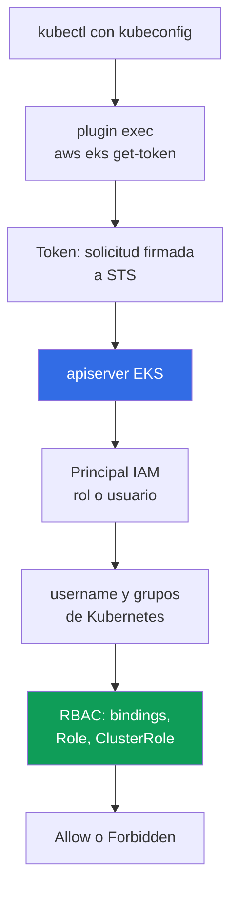
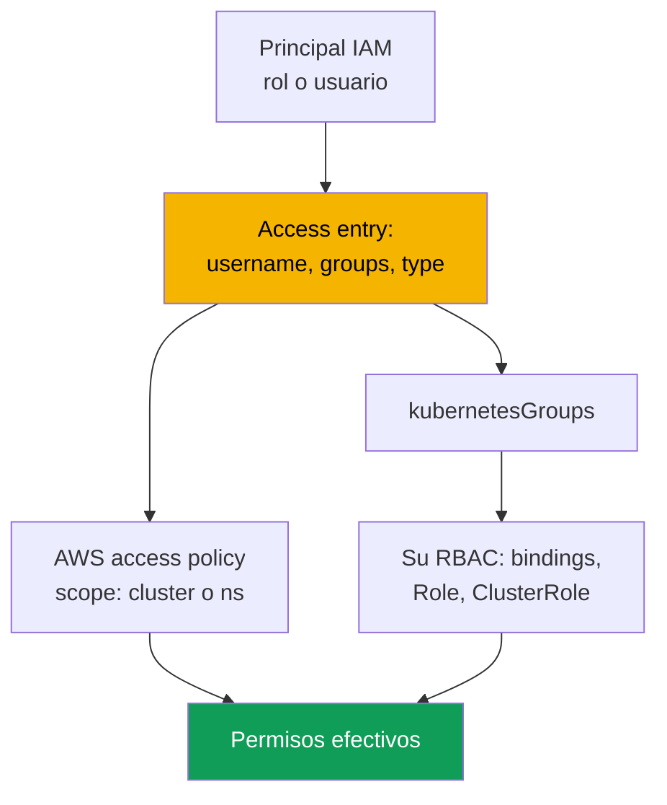

[Русская версия](ru.md) · [Eng version](en.md) · [Version française](fr.md) · [Deutsche Version](de.md) · [ქართული ვერსია](ge.md) · [繁體中文版](tw.md) · [日本語版](jp.md)
# Capítulo 5. Acceso al clúster: IAM y RBAC, access entries, migración desde aws-auth

> **Qué sigue.** El clúster ya está creado (capítulo 4), y la siguiente pregunta es quién entrará en él y con qué permisos. Conoce RBAC de CKA, pero en EKS existe una segunda capa antes de él: la autenticación mediante IAM. Este capítulo explica la unión de esas capas, los tres modos de `authenticationMode`, el mecanismo heredado `aws-auth` ConfigMap y las API access entries que lo sustituyen, las access policies y la migración sin perder acceso. El acceso de pods a las API de AWS es otra tarea: IRSA (capítulo 16) y Pod Identity (capítulo 17).

## 5.1. «El kubeconfig es correcto, pero kubectl devuelve Unauthorized»

En kubeadm, el acceso se otorgaba con un certificado de cliente: firmaba una CSR con su CA, entregaba al ingeniero un kubeconfig y tomaba los grupos del campo `O`. El mecanismo es claro, con un problema conocido: revocar un certificado es prácticamente imposible, apiserver no comprueba las listas de revocación y la única solución honesta es volver a emitir la CA, lo que afecta el acceso de todos. La salida de un empleado se convertía en un miniproyecto, no en eliminar una línea. EKS tiene otro modelo, y se conoce mediante dos escenarios.

**Primero.** Un ingeniero ejecuta `aws eks update-kubeconfig`; el comando termina sin errores, el contexto cambia, pero `kubectl get pods` devuelve `error: You must be logged in to the server (Unauthorized)`. El kubeconfig es correcto: endpoint, CA y plugin están en su sitio. Lo que no encaja es otra cosa: el principal IAM con el que trabaja el ingeniero es desconocido para el clúster, y ninguna política IAM lo arreglará.

**Segundo, más caro.** Alguien modifica el ConfigMap `aws-auth` y añade un rol para un equipo nuevo. Un sangrado en yaml se desplaza, `mapRoles` deja de analizarse y **todos** pierden acceso, incluido el autor del cambio. Desde dentro ya no se puede hacer nada: para reparar el ConfigMap hace falta acceso, y no hay acceso.

Ambos casos tratan de lo mismo: **en EKS la autenticación es externa y la autorización es interna**. Son dos capas independientes, y confundirlas cuesta más que todo lo demás de este capítulo.

## 5.2. IAM responde «quién eres», RBAC responde «qué puedes hacer»

La autenticación vive en AWS: apiserver verifica una solicitud STS firmada y obtiene el principal IAM. La autorización vive en el clúster: el RBAC habitual decide qué puede hacer el sujeto. Entre las capas hay un **mapeo**: un ARN se convierte en un `username` y grupos de Kubernetes.



`kubectl` ve el bloque `exec` del kubeconfig, invoca `aws eks get-token` y no recibe una contraseña ni un certificado, sino una **solicitud firmada** a STS: por la red viaja una firma, no un secreto. El plugin obtiene credenciales de la cadena habitual de proveedores AWS: `AWS_PROFILE`, variables de entorno, caché SSO y rol de instancia (capítulo 0.5). apiserver verifica la firma y obtiene el ARN del principal; después el ARN se mapea a `username` y `kubernetesGroups`, y RBAC toma la decisión.

La regla que conviene memorizar literalmente es esta: una política IAM con `AdministratorAccess` **no otorga por sí sola ningún permiso dentro del clúster**. Permite llamar a la API de EKS (describir el clúster, cambiar la configuración, eliminarlo entero), pero `kubectl get pods` devuelve `Unauthorized` hasta que el principal se mapea al clúster. La única excepción apareció con las access entries: mediante la API de EKS se puede asociar una access policy administrada, y entonces AWS concede los permisos sin pasar por su `Role` y `ClusterRole` (sección 5.6). Como el token está vinculado a la sesión AWS actual, «por la mañana funcionaba, después de comer Unauthorized» suele significar que caducó la sesión SSO; el lado servidor aparece en logs de tipo `authenticator` (capítulo 2).

## 5.3. Los tres modos de authenticationMode

El modo determina de dónde obtiene el clúster el mapeo de principales. Se establece al crear el clúster (capítulo 4) y también puede cambiarse en un clúster activo.

| Modo | Origen del mapeo | Cuándo encaja |
|---|---|---|
| `CONFIG_MAP` | solo el ConfigMap `aws-auth` | legado: clústeres antiguos antes de la migración |
| `API_AND_CONFIG_MAP` | access entries y `aws-auth` | modo de transición durante la migración |
| `API` | solo access entries | modo objetivo para clústeres nuevos |

Los clústeres nuevos se crean directamente en `API`; los antiguos pasan a `API_AND_CONFIG_MAP` y después a `API`. En el modo de transición, si un principal está definido en una access entry y en `aws-auth`, gana la **access entry**: se puede crear y comprobar la entrada de antemano sin eliminar la línea del ConfigMap. La limitación clave es el movimiento **solo hacia API**; no puede revertirse.

```bash
aws eks describe-cluster --name demo --query 'cluster.accessConfig'
aws eks update-cluster-config --name demo --access-config authenticationMode=API_AND_CONFIG_MAP
aws eks update-cluster-config --name demo --access-config authenticationMode=API
```

## 5.4. aws-auth ConfigMap: por qué se abandona

Históricamente, el mapeo vivía en un objeto Kubernetes: el ConfigMap `aws-auth` de `kube-system`. El campo `mapRoles` mapea roles IAM y `mapUsers` mapea usuarios IAM.

```bash
kubectl -n kube-system get configmap aws-auth -o yaml
```

```yaml
data:
  mapRoles: |
    - rolearn: arn:aws:iam::111122223333:role/platform-admins
      username: platform-admin
      groups: [system:masters]
  mapUsers: |
    - userarn: arn:aws:iam::111122223333:user/ci-legacy
      username: ci-legacy
```

El mecanismo funciona, pero sus problemas explican exactamente por qué AWS hizo un reemplazo.

- **Un error en yaml implica perder acceso para todos.** `mapRoles` es una cadena para el authenticator, no hay validación de esquema y para reparar el ConfigMap hace falta el acceso que concede ese mismo ConfigMap.
- **El objeto vive en el clúster, no en su configuración.** No aparece en `describe-cluster`, no se administra mediante la API de EKS, diverge de su IaC y no tiene historial: no se sabe quién añadió un rol con `system:masters` ni cuándo. Las llamadas a la API de EKS aparecen en CloudTrail (capítulo 21).
- **No se pueden conceder permisos de antemano ni hay políticas administradas.** Un error tipográfico en un ARN se descubre cuando la persona no puede entrar, y no se puede asociar una access policy a una entrada de ConfigMap.

## 5.5. Access entries: el mapeo como objeto de la API de EKS

Una access entry vive en la configuración de acceso del clúster, no dentro del clúster. Asocia **un** principal IAM, un rol o usuario, con un `username` y una lista de `kubernetesGroups`; un principal no puede estar en más de una entrada y no puede cambiarse en una entrada existente.



Una entrada tiene un **tipo**, que no viene determinado por permisos sino por qué es el principal: `STANDARD` es el predeterminado para personas, CI y controladores; `EC2_LINUX` y `EC2_WINDOWS` son para nodos autogestionados; `FARGATE_LINUX` para Fargate; `HYBRID_LINUX` para nodos híbridos; y `EC2` para una node class de Auto Mode. Para la operación, el punto clave es que **no hay que crear entradas para managed node groups y perfiles Fargate**: EKS las crea. Un nodo autogestionado necesita una entrada o no podrá unirse al clúster (capítulo 45). Para `STANDARD` es mejor no establecer `username`; el servicio lo asigna.

```bash
aws eks create-access-entry --cluster-name demo \
  --principal-arn arn:aws:iam::111122223333:role/platform-admins \
  --kubernetes-groups platform-admins --type STANDARD

aws eks list-access-entries --cluster-name demo
aws eks describe-access-entry --cluster-name demo \
  --principal-arn arn:aws:iam::111122223333:role/platform-admins
```

Después, `platform-admins` es un grupo Kubernetes normal: cree un `ClusterRoleBinding` para él y funciona todo lo que conoce de CKA. Una access entry no sustituye RBAC; aporta un sujeto para RBAC.

**La entrada del creador del clúster.** `bootstrapClusterCreatorAdminPermissions` es `true` de forma predeterminada: el principal que creó el clúster recibe permisos de administrador dentro de él. Es una salida de emergencia y una trampa a la vez (capítulo 4): la entrada es invisible en el trabajo habitual, no está descrita en código, no se puede quitar con políticas IAM y, si el clúster fue creado con el rol personal de un ingeniero, ese rol conserva permisos incluso después de su salida. Práctica: el clúster lo crea un rol de CI, el flag se establece en `false` y los permisos de administrador se describen con access entries explícitas en código.

## 5.6. Access policies: permisos en el clúster mediante la API de EKS

La segunda forma de conceder permisos es asociar una **access policy** administrada a una access entry. Son políticas de nivel Kubernetes, no políticas IAM: internamente contienen verbs y resources, solo conceden permisos y no se pueden modificar ni crear. Complementan RBAC: los derechos efectivos de un principal son la suma de los derechos de access policies y de las asociaciones con sus grupos y `username`.

| Access policy | Qué concede | Access scope típico |
|---|---|---|
| `AmazonEKSClusterAdminPolicy` | administrador completo, equivalente a `cluster-admin` | `cluster` |
| `AmazonEKSAdminPolicy` | casi todas las acciones de recursos | `namespace` |
| `AmazonEKSEditPolicy` | modificar cargas, sin editar RBAC | `namespace` |
| `AmazonEKSViewPolicy` | leer recursos, sin secretos | `namespace` o `cluster` |
| `AmazonEKSAdminViewPolicy` | leer todos los recursos, incluidos secretos | `cluster` |

Un access scope tiene dos formas: `cluster` para todo el clúster o `namespace` con una lista que admite patrones como `dev-*`. Se puede cambiar el scope, pero EKS no comprueba que exista el namespace: un error tipográfico da permisos vacíos de forma silenciosa.

```bash
aws eks associate-access-policy --cluster-name demo \
  --principal-arn arn:aws:iam::111122223333:role/team-payments \
  --policy-arn arn:aws:eks::aws:cluster-access-policy/AmazonEKSEditPolicy \
  --access-scope type=namespace,namespaces=payments,payments-stage

aws eks list-associated-access-policies --cluster-name demo \
  --principal-arn arn:aws:iam::111122223333:role/team-payments
```

Use **políticas preparadas** cuando necesite roles estándar: mirar, trabajar en su namespace u obtener una vez permisos de administrador. Escriba su propio `Role` y `ClusterRole` cuando necesite menos permisos o permisos específicos: acceso a sus CRD, solo `logs` y `exec`, o prohibir secretos. Entonces la access entry establece `kubernetesGroups` y su RBAC describe los derechos. El uso híbrido es normal: `AmazonEKSViewPolicy` para el clúster más un grupo propio con permisos precisos en un namespace. Una trampa al depurar es que `kubectl auth can-i --list` **no muestra** los derechos de access policies porque no están expresados como objetos RBAC; compruebe `list-associated-access-policies`.

## 5.7. Migración de aws-auth a access entries

| Propiedad | ConfigMap `aws-auth` | Access entries |
|---|---|---|
| Dónde vive | objeto en `kube-system` | configuración del clúster en la API de EKS |
| Validación | ninguna, una cadena yaml dentro del campo | en el lado de la API de EKS |
| Un error rompe | el acceso de todos, incluido usted | una entrada |
| Historial de cambios | ninguno | CloudTrail (capítulo 21) |
| Políticas AWS administradas | no | sí, access policies |
| Gestión desde IaC | mediante el proveedor Kubernetes | mediante el proveedor AWS |

1. **Inventario.** Guarde `aws-auth` en un archivo: es tanto el plan de migración como el rollback.
2. **Modo `API_AND_CONFIG_MAP`.** Se habilitan las access entries y el ConfigMap sigue funcionando; no se rompe ningún acceso existente.
3. **Entradas para personas y servicios.** Para cada línea de `mapRoles` y `mapUsers` que añadió **usted**, cree una access entry con el mismo `username` y grupos: detrás están las asociaciones RBAC.
4. **No toque los nodos.** Las líneas que EKS creó para managed node groups y perfiles Fargate siguen siendo responsabilidad del servicio; eliminarlas sin entradas equivalentes rompe el clúster. Para nodos autogestionados, cree una entrada `EC2_LINUX` con el mismo `username` y grupos.
5. **Compruebe antes de eliminar.** Abra una **segunda** sesión con el rol de migración y confirme que funciona sin cerrar la primera. Después elimine las líneas del ConfigMap de una en una.
6. **Modo `API`** cuando no queden sus propias entradas en el ConfigMap. Este paso es irreversible.

```bash
aws eks update-kubeconfig --name demo --region eu-central-1 --alias demo-migrated
kubectl auth whoami
kubectl auth can-i get pods -n payments
kubectl auth can-i list secrets -n kube-system --as-group platform-admins
```

## 5.8. Denegaciones habituales: Unauthorized frente a Forbidden

| Señal | `Unauthorized` (401) | `Forbidden` (403) |
|---|---|---|
| Capa rota | autenticación, AWS | autorización, RBAC |
| Qué significa | el clúster no entendió quién es | entendió quién es, pero no permitió la acción |
| Causas típicas | perfil incorrecto, SSO caducado, rol no registrado | no hay asociación de grupo, scope de política estrecho |
| Dónde mirar | `get-caller-identity`, `list-access-entries`, logs `authenticator` | `auth can-i`, asociaciones RBAC, asociaciones de políticas |
| Qué lo corrige | una access entry o `aws-auth` | un binding, `ClusterRole` o access policy |

```bash
aws sts get-caller-identity            # quién soy para AWS ahora mismo
echo "$AWS_PROFILE"                    # es este el perfil que espera
aws eks list-access-entries --cluster-name demo   # conoce el clúster este ARN
kubectl auth whoami                    # cómo me ve apiserver: username y grupos
```

`kubectl auth whoami` es la comprobación más rápida de la unión: si el comando responde, la autenticación pasó y el problema son los permisos; si responde `Unauthorized`, RBAC no llegó a intervenir. Otra trampa es que `get-caller-identity` muestra el rol que **asumió**, mientras que la access entry debe usar el ARN del rol propiamente dicho, no el ARN de la sesión assumed-role. Los logs de tipo `authenticator` (capítulo 2) muestran el lado del servidor cuando las comprobaciones del cliente no coinciden; los casos complejos están en el capítulo 47.

## 5.9. Organización del acceso para personas y CI

- **Las personas no reciben permisos permanentes.** Entran mediante IAM Identity Center: un permission set corresponde a un rol IAM y el rol a una access entry en el clúster. La sesión es temporal; revocar es retirar una asignación, no volver a emitir una CA.
- **Grupos Kubernetes, no entradas personales.** Cree la access entry para el rol de un equipo, no para una persona: treinta ingenieros dan treinta oportunidades de olvidar una entrada al salir alguien.
- **Auditoría de entradas olvidadas.** Compare regularmente `aws eks list-access-entries` con los roles actuales: una entrada cuyo `principal-arn` apunta a un rol eliminado o que hace mucho no se asume es acceso olvidado para eliminar; las asunciones de rol aparecen en CloudTrail (capítulo 21).
- **Break-glass por separado.** Un rol con `AmazonEKSClusterAdminPolicy` de scope `cluster` que nadie asume en el trabajo normal: trust policy estricta, MFA y alerta al asumirlo en CloudTrail (capítulo 21). Es su salida de la situación de la sección 5.1.
- **Un rol separado para CI.** La confianza se limita a un repositorio y rama concretos (capítulo 0.2), los permisos son de nivel `AmazonEKSEditPolicy` en sus namespaces y no puede cambiar la configuración de acceso al clúster, pues de otro modo el pipeline se concederá permisos a sí mismo. Las access entries y asociaciones de políticas son recursos IaC normales junto al clúster (capítulo 4). La aislación de equipos está en el capítulo 22.

## 5.10. Cómo se aplica en producción

- **Los clústeres nuevos empiezan en modo `API`**, con `bootstrapClusterCreatorAdminPermissions` en `false` y el acceso de administrador descrito por access entries explícitas en código.
- **Las personas entran mediante IAM Identity Center**: permission set a rol, rol a access entry, permisos a grupo Kubernetes; no hay entradas personales y existe un único rol break-glass bajo alerta.
- **CI tiene su propio rol** con derechos de nivel namespace y sin permiso para cambiar la configuración de acceso. Los logs de tipo `authenticator` están habilitados y `aws-auth` no existe en absoluto en clústeres nuevos.

## 5.11. Mini glosario

- **Access entry**: registro de la configuración de acceso al clúster que asocia un principal IAM con `username` y `kubernetesGroups`; `STANDARD` es para personas y servicios, y `EC2_LINUX`, `EC2_WINDOWS`, `FARGATE_LINUX`, `HYBRID_LINUX` y `EC2` son para nodos.
- **Access policy**: política AWS administrada de permisos de nivel Kubernetes asociada a una access entry; contiene verbs y resources, no permisos IAM, y no se edita. **Access scope** es su ámbito: `cluster` o `namespace` con una lista.
- **`authenticationMode`**: el modo de autenticación: `CONFIG_MAP`, `API_AND_CONFIG_MAP` o `API`; el movimiento es solo hacia `API`. El **ConfigMap `aws-auth`** es el mecanismo heredado de mapeo mediante un objeto en `kube-system` con campos `mapRoles` y `mapUsers`.
- **`bootstrapClusterCreatorAdminPermissions`**: campo de creación del clúster; cuando es `true` (predeterminado), el creador recibe permisos de administrador dentro del clúster.

## 5.12. Resumen del capítulo

- La autenticación es externa (IAM y STS), la autorización es interna (RBAC), y `AdministratorAccess` en IAM no da por sí solo permisos en el clúster. La cadena es `kubectl`, el plugin `aws eks get-token`, una solicitud STS firmada, verificación de la firma, mapeo de ARN a `username` y grupos, y RBAC.
- Hay tres modos: `CONFIG_MAP`, `API_AND_CONFIG_MAP` y `API`. El objetivo es `API`, la transición hacia él es irreversible y, en modo de transición, una access entry tiene prioridad sobre `aws-auth`, que es estructuralmente inseguro: no hay validación ni historial, un error yaml deshabilita el acceso de todos incluido el autor del cambio, y el objeto ya no se puede reparar desde dentro.
- Las access entries viven en la API de EKS, se validan, son visibles en CloudTrail y se describen con código. Los permisos se conceden mediante `kubernetesGroups` más su RBAC, mediante access policies de scope `cluster` o `namespace`, o ambos. La migración es `API_AND_CONFIG_MAP`, entradas para sus propias líneas, no tocar las entradas de nodos, comprobar desde una segunda sesión, eliminar líneas y usar el modo `API`.
- `Unauthorized` significa autenticación, `Forbidden` significa autorización, y el diagnóstico empieza con `aws sts get-caller-identity` y `kubectl auth whoami`, no leyendo manifiestos RBAC.

## 5.13. Cómo ayuda en el trabajo real

La tarea «revocar acceso a un ingeniero que se fue» toma minutos si el acceso se basa en roles temporales y grupos, y un tiempo indeterminado si la persona tenía una entrada personal y además creó el clúster. La pregunta «quién puede eliminar un namespace en producción» se responde enumerando entradas y asociaciones, o no se responde en absoluto. El escenario de la primera sección deja de ser una catástrofe cuando existen un rol break-glass y el modo `API`.

## 5.14. Preguntas para autoevaluación

1. ¿Por qué `AdministratorAccess` en IAM no da permiso para ejecutar `kubectl get pods` en el clúster?
2. ¿Qué se envía exactamente a apiserver como token y por qué no es una contraseña?
3. ¿En qué se diferencian `Unauthorized` y `Forbidden`, y dónde empieza el diagnóstico de cada uno?
4. ¿Qué tres valores puede tomar `authenticationMode` y qué transiciones son posibles?
5. El mismo ARN está en `aws-auth` y en una access entry. ¿Cuál gana y en qué modo?
6. ¿Qué determina el tipo de una access entry y para qué nodos se crean entradas automáticamente?
7. ¿Cuándo usaría `AmazonEKSEditPolicy` y cuándo escribiría su propio `ClusterRole`?
8. ¿Por qué `kubectl auth can-i --list` podría no mostrar permisos que realmente existen?
9. Describa el orden de una migración desde `aws-auth` que conserve una vía de recuperación en cada momento.

## Práctica

Los laboratorios de este tema son [laboratorio 102 - acceso al clúster: IAM y RBAC, access entries y access policies](../../labs/102/README_ES.MD) y [laboratorio 122 - AWS Backup para EKS: composite recovery point, recuperación de namespace](../../labs/122/README_ES.MD). Además, el contenido puede comprobarse en cualquier clúster. Empiece por el inventario: `aws eks describe-cluster --name <cluster> --query 'cluster.accessConfig'` muestra el modo y el flag del creador; `aws eks list-access-entries --cluster-name <cluster>` y `aws eks describe-access-entry` con `--principal-arn` muestran el tipo, `username` y grupos de una entrada. Para entradas `STANDARD`, ejecute `aws eks list-associated-access-policies` y compruebe el scope.

Después compare las dos capas: reúna los grupos de las access entries y búsquelos en `kubectl get clusterrolebindings,rolebindings -A -o wide`. Los grupos sin bindings y sin access policies no conceden nada, mientras que los bindings para grupos que no están en ninguna entrada son RBAC muerto. Busque también entradas olvidadas: recorra `list-access-entries` y ejecute `aws iam get-role` para cada `principal-arn`; una entrada para un rol inexistente es acceso muerto para eliminar. Compruébese mediante `kubectl auth whoami` y `kubectl auth can-i --list`, recordando que los derechos de access policies no aparecen en esa salida. Si el clúster sigue en modo `CONFIG_MAP` o `API_AND_CONFIG_MAP`, guarde `kubectl -n kube-system get configmap aws-auth -o yaml` en un archivo. Por separado, practique una denegación: cree un rol sin access entry, intente entrar y encuéntrelo en los logs de tipo `authenticator` (capítulo 2).

---
[Índice](../README_ES.md) · [Capítulo 4](../04/es.md) · [Capítulo 6](../06/es.md)
