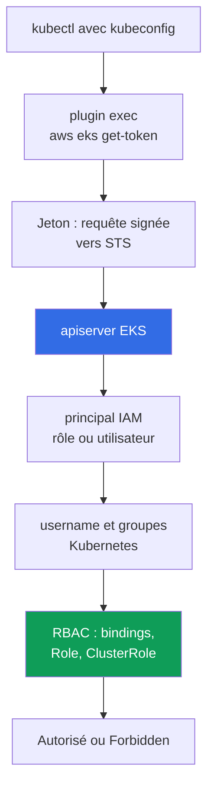
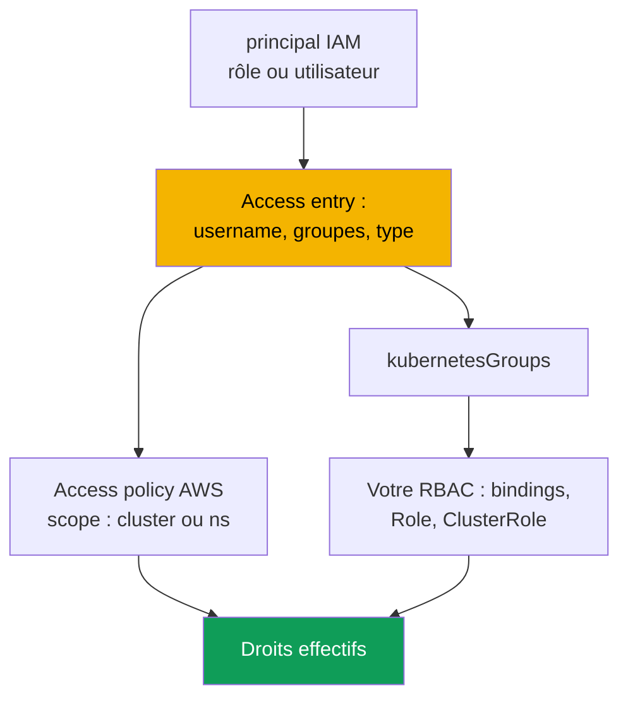

[Русская версия](ru.md) · [Eng version](en.md) · [Versión en español](es.md) · [Deutsche Version](de.md) · [ქართული ვერსია](ge.md) · [繁體中文版](tw.md) · [日本語版](jp.md)
# Chapitre 5. Accès au cluster : IAM et RBAC, access entries, migration depuis aws-auth

> **La suite.** Le cluster est créé (chapitre 4), et la question suivante est de savoir qui peut y entrer et avec quels droits. Vous connaissez RBAC avec CKA, mais EKS ajoute une deuxième couche avant lui : l'authentification via IAM. Ce chapitre traite de la jonction de ces couches, des trois modes `authenticationMode`, du mécanisme historique ConfigMap `aws-auth` et des API access entries qui le remplacent, des access policies et de la migration sans perte d'accès. L'accès des pods aux API AWS est un autre sujet : IRSA (chapitre 16) et Pod Identity (chapitre 17).

## 5.1. « kubeconfig est correct, mais kubectl répond Unauthorized »

Avec kubeadm, l'accès était accordé par un certificat client : vous signiez une CSR avec votre CA, donniez un kubeconfig à l'ingénieur, et les groupes provenaient du champ `O`. Le mécanisme est clair, avec un problème connu : révoquer un certificat est pratiquement impossible, apiserver ne vérifie pas les listes de révocation, et la seule solution honnête est de réémettre la CA, donc de modifier l'accès de tous. Le départ d'un employé devenait un mini-projet plutôt que la suppression d'une ligne. EKS a un modèle différent, rencontré dans deux scénarios.

**Premier.** Un ingénieur lance `aws eks update-kubeconfig`, la commande se termine sans erreur, le contexte bascule, mais `kubectl get pods` répond `error: You must be logged in to the server (Unauthorized)`. Le kubeconfig est correct : endpoint, CA et plugin sont présents. C'est autre chose qui ne concorde pas : le principal IAM sous lequel travaille l'ingénieur est inconnu du cluster, et aucune policy IAM ne résoudra cela.

**Deuxième, plus coûteux.** Quelqu'un modifie le ConfigMap `aws-auth` pour ajouter un rôle à une nouvelle équipe. Une indentation yaml se décale, `mapRoles` ne peut plus être analysé, et **tout le monde** perd l'accès, y compris l'auteur de la modification. Il n'y a plus rien à faire de l'intérieur : l'accès est nécessaire pour corriger le ConfigMap, mais l'accès n'existe plus.

Les deux cas ont la même origine : **dans EKS, l'authentification est externe et l'autorisation est interne**. Ce sont deux couches indépendantes, et les confondre coûte plus que tout le reste du chapitre.

## 5.2. IAM répond « qui êtes-vous », RBAC répond « que pouvez-vous faire »

L'authentification vit dans AWS : apiserver vérifie une requête STS signée et obtient le principal IAM. L'autorisation vit dans le cluster : le RBAC ordinaire décide ce que le sujet peut faire. Entre les couches se trouve un **mappage** : un ARN devient un `username` Kubernetes et des groupes.



`kubectl` voit le bloc `exec` dans kubeconfig, appelle `aws eks get-token` et ne reçoit ni mot de passe ni certificat, mais une **requête signée** vers STS : c'est une signature qui transite sur le réseau, non un secret. Le plugin obtient les credentials depuis la chaîne de fournisseurs AWS habituelle : `AWS_PROFILE`, variables d'environnement, cache SSO, rôle d'instance (chapitre 0.5). apiserver vérifie la signature et obtient l'ARN du principal, puis l'ARN est mappé vers `username` et `kubernetesGroups`, et RBAC prend la décision.

La règle à retenir mot pour mot est la suivante : une policy IAM avec `AdministratorAccess` **n'accorde aucun droit dans le cluster par elle-même**. Elle permet d'appeler l'API EKS (décrire le cluster, modifier la configuration, le supprimer entièrement), mais `kubectl get pods` renvoie `Unauthorized` tant que le principal n'est pas mappé dans le cluster. La seule exception est apparue avec les access entries : l'API EKS peut associer une access policy gérée, et AWS accorde alors des droits en contournant vos `Role` et `ClusterRole` (section 5.6). Le jeton étant lié à la session AWS actuelle, « cela fonctionnait ce matin, Unauthorized après déjeuner » signifie généralement que la session SSO a expiré ; le côté serveur est visible dans les logs de type `authenticator` (chapitre 2).

## 5.3. Les trois modes authenticationMode

Le mode détermine d'où le cluster obtient les mappages de principaux. Il est défini à la création (chapitre 4) et peut aussi être modifié sur un cluster actif.

| Mode | Source de mappage | Quand il convient |
|---|---|---|
| `CONFIG_MAP` | uniquement le ConfigMap `aws-auth` | historique : anciens clusters avant migration |
| `API_AND_CONFIG_MAP` | access entries et `aws-auth` | mode transitoire pendant la migration |
| `API` | uniquement les access entries | mode cible pour les nouveaux clusters |

Les nouveaux clusters sont créés directement en `API`, les anciens passent à `API_AND_CONFIG_MAP`, puis à `API`. En mode transitoire, si un principal est défini à la fois dans une access entry et dans `aws-auth`, l'**access entry** l'emporte : vous pouvez créer et tester l'entrée à l'avance sans supprimer la ligne du ConfigMap. La restriction principale est un mouvement **uniquement vers API**, sans retour possible.

```bash
aws eks describe-cluster --name demo --query 'cluster.accessConfig'
aws eks update-cluster-config --name demo --access-config authenticationMode=API_AND_CONFIG_MAP
aws eks update-cluster-config --name demo --access-config authenticationMode=API
```

## 5.4. ConfigMap aws-auth : pourquoi il est abandonné

Historiquement, le mappage vivait dans un objet Kubernetes : le ConfigMap `aws-auth` dans `kube-system`. Le champ `mapRoles` mappe les rôles IAM et `mapUsers` les utilisateurs IAM.

```bash
kubectl -n kube-system get configmap aws-auth -o yaml
```

```yaml
data:
  mapRoles: |
    - rolearn: arn:aws:iam::111122223333:role/platform-admins
      username: platform-admin
      groups: [system:masters]
  mapUsers: |
    - userarn: arn:aws:iam::111122223333:user/ci-legacy
      username: ci-legacy
```

Le mécanisme fonctionne, mais ses problèmes expliquent exactement pourquoi AWS a créé un remplacement.

- **Une erreur yaml fait perdre l'accès à tous.** `mapRoles` est une chaîne destinée à l'authenticator, il n'y a aucune validation de schéma, et corriger le ConfigMap exige l'accès accordé par ce même ConfigMap.
- **L'objet vit dans le cluster, non dans la configuration du cluster.** Il est absent de `describe-cluster`, ne se gère pas par l'API EKS, dérive de votre IaC, et n'a pas d'historique : impossible de savoir qui a ajouté un rôle avec `system:masters` ni quand. Les appels à l'API EKS apparaissent dans CloudTrail (chapitre 21).
- **On ne peut pas accorder l'accès à l'avance et il n'y a pas de policies gérées.** Une faute de frappe dans un ARN n'est découverte que lorsqu'une personne ne peut pas se connecter, et il est impossible d'associer une access policy à une entrée ConfigMap.

## 5.5. Access entries : le mappage comme objet d'API EKS

Une access entry vit dans la configuration d'accès du cluster, non dans le cluster lui-même, et associe **un** principal IAM (rôle ou utilisateur) à un `username` et à une liste de `kubernetesGroups` ; un principal ne peut pas figurer dans plusieurs entrées et ne peut pas être changé dans une entrée existante.



Une entrée a un **type**, défini non par les droits mais par la nature du principal : `STANDARD` est le défaut pour les personnes, CI et contrôleurs ; `EC2_LINUX` et `EC2_WINDOWS` sont destinés aux nœuds self-managed ; `FARGATE_LINUX` à Fargate ; `HYBRID_LINUX` aux nœuds hybrides ; et `EC2` à une node class en Auto Mode. Le point essentiel pour l'exploitation est que **vous n'avez pas besoin de créer des entrées pour les managed node groups et les Fargate profiles**, EKS les crée lui-même ; un nœud self-managed a besoin d'une entrée, sinon il ne peut pas rejoindre le cluster (chapitre 45). Il est préférable de ne pas définir `username` pour `STANDARD` : le service le fournit.

```bash
aws eks create-access-entry --cluster-name demo \
  --principal-arn arn:aws:iam::111122223333:role/platform-admins \
  --kubernetes-groups platform-admins --type STANDARD

aws eks list-access-entries --cluster-name demo
aws eks describe-access-entry --cluster-name demo \
  --principal-arn arn:aws:iam::111122223333:role/platform-admins
```

Ensuite, `platform-admins` est un groupe Kubernetes ordinaire : créez un `ClusterRoleBinding` pour lui et tout ce que vous connaissez avec CKA fonctionne. Une access entry ne remplace pas RBAC ; elle fournit un sujet RBAC.

**L'entrée du créateur du cluster.** `bootstrapClusterCreatorAdminPermissions` vaut `true` par défaut : le principal qui a créé le cluster reçoit des droits d'administrateur à l'intérieur. C'est à la fois une issue de secours et un piège (chapitre 4) : l'entrée est invisible dans le travail courant, non décrite dans le code, impossible à supprimer par des policies IAM, et si le cluster est créé avec le rôle personnel d'un ingénieur, ce rôle conserve ses droits après son départ. Bonne pratique : un rôle CI crée le cluster, le flag est à `false`, et les droits administrateur sont décrits comme des access entries explicites dans le code.

## 5.6. Access policies : les droits dans le cluster par l'API EKS

La deuxième façon d'accorder des droits est d'associer une **access policy** gérée à une access entry. Ce sont des policies de niveau Kubernetes, non des policies IAM : elles contiennent en interne des verbs et des resources, accordent uniquement des permissions, et vous ne pouvez ni les modifier ni en créer. Elles complètent RBAC : les droits effectifs d'un principal sont la somme des droits des access policies et des bindings vers ses groupes et son `username`.

| Access policy | Ce qu'elle accorde | Access scope typique |
|---|---|---|
| `AmazonEKSClusterAdminPolicy` | administrateur complet, équivalent à `cluster-admin` | `cluster` |
| `AmazonEKSAdminPolicy` | presque toutes les actions sur les resources | `namespace` |
| `AmazonEKSEditPolicy` | modifier les workloads, sans modifier RBAC | `namespace` |
| `AmazonEKSViewPolicy` | lire les resources, sans les secrets | `namespace` ou `cluster` |
| `AmazonEKSAdminViewPolicy` | lire toutes les resources, y compris les secrets | `cluster` |

Un access scope a deux formes : `cluster` pour le cluster entier, ou `namespace` avec une liste qui accepte des motifs tels que `dev-*`. Vous pouvez modifier le scope, mais EKS ne vérifie pas l'existence d'un namespace : une faute de frappe produit silencieusement des droits vides.

```bash
aws eks associate-access-policy --cluster-name demo \
  --principal-arn arn:aws:iam::111122223333:role/team-payments \
  --policy-arn arn:aws:eks::aws:cluster-access-policy/AmazonEKSEditPolicy \
  --access-scope type=namespace,namespaces=payments,payments-stage

aws eks list-associated-access-policies --cluster-name demo \
  --principal-arn arn:aws:iam::111122223333:role/team-payments
```

Utilisez les **policies prêtes à l'emploi** pour les rôles standard : consultation, travail dans votre namespace, ou obtention ponctuelle de droits administrateur. Écrivez vos propres `Role` et `ClusterRole` lorsque les droits doivent être moins étendus ou spécifiques : accès à vos CRD, seulement `logs` et `exec`, absence d'accès aux secrets. L'access entry définit alors `kubernetesGroups` et votre RBAC décrit les droits. L'usage hybride est normal : `AmazonEKSViewPolicy` pour le cluster, plus un groupe personnalisé doté de droits précis dans un namespace. Un piège au débogage : `kubectl auth can-i --list` **n'affiche pas** les droits issus des access policies, car ils ne sont pas exprimés sous forme d'objets RBAC ; vérifiez plutôt `list-associated-access-policies`.

## 5.7. Migration de aws-auth vers les access entries

| Propriété | ConfigMap `aws-auth` | Access entries |
|---|---|---|
| Où il vit | objet dans `kube-system` | configuration du cluster dans l'API EKS |
| Validation | aucune, chaîne yaml dans un champ | côté API EKS |
| Une erreur casse | l'accès de tous, y compris le vôtre | une entrée |
| Historique des changements | aucun | CloudTrail (chapitre 21) |
| Policies AWS gérées | non | oui, access policies |
| Gestion depuis IaC | via le provider Kubernetes | via le provider AWS |

1. **Inventaire.** Enregistrez `aws-auth` dans un fichier : c'est à la fois le plan de migration et le retour arrière.
2. **Mode `API_AND_CONFIG_MAP`.** Les access entries sont activées, le ConfigMap continue de fonctionner, et aucun accès existant ne casse.
3. **Entrées pour les personnes et services.** Pour chaque ligne `mapRoles` et `mapUsers` que **vous** avez ajoutée, créez une access entry avec le même `username` et les mêmes groupes : les bindings RBAC sont derrière eux.
4. **Ne touchez pas aux nœuds.** Les lignes créées par EKS pour les managed node groups et les Fargate profiles restent sous la responsabilité du service ; les supprimer sans entrées équivalentes casse le cluster. Pour les nœuds self-managed, créez une entrée `EC2_LINUX` avec le même `username` et les mêmes groupes.
5. **Vérifiez avant de supprimer.** Ouvrez une **deuxième** session avec le rôle de migration et vérifiez qu'elle fonctionne sans fermer la première. Retirez ensuite les lignes du ConfigMap une par une.
6. **Mode `API`** lorsque plus aucune de vos entrées ne reste dans le ConfigMap. Cette étape est irréversible.

```bash
aws eks update-kubeconfig --name demo --region eu-central-1 --alias demo-migrated
kubectl auth whoami
kubectl auth can-i get pods -n payments
kubectl auth can-i list secrets -n kube-system --as-group platform-admins
```

## 5.8. Refus courants : Unauthorized contre Forbidden

| Signe | `Unauthorized` (401) | `Forbidden` (403) |
|---|---|---|
| Couche en panne | authentification, AWS | autorisation, RBAC |
| Signification | le cluster n'a pas compris qui vous êtes | il a compris qui vous êtes, mais n'autorise pas l'action |
| Causes typiques | mauvais profil, SSO expiré, rôle non enregistré | aucun binding au groupe, scope de policy trop étroit |
| Où regarder | `get-caller-identity`, `list-access-entries`, logs `authenticator` | `auth can-i`, bindings RBAC, associations de policies |
| Ce qui le corrige | une access entry ou `aws-auth` | un binding, `ClusterRole` ou une access policy |

```bash
aws sts get-caller-identity            # qui AWS me voit être en ce moment
echo "$AWS_PROFILE"                    # est-ce le profil attendu
aws eks list-access-entries --cluster-name demo   # le cluster connaît-il cet ARN
kubectl auth whoami                    # comment apiserver me voit : username et groupes
```

`kubectl auth whoami` est la vérification la plus rapide de la jonction : si la commande répond, l'authentification a réussi et le problème concerne les droits ; si elle renvoie `Unauthorized`, RBAC n'a jamais été atteint. Un piège distinct est que `get-caller-identity` affiche le rôle que vous avez **assumé**, tandis que l'access entry doit employer l'ARN du rôle lui-même, et non l'ARN de la session assumed-role. Les logs de type `authenticator` (chapitre 2) montrent le côté serveur lorsque les vérifications client ne concordent pas ; les cas complexes sont au chapitre 47.

## 5.9. Organisation de l'accès pour les personnes et CI

- **Les personnes ne reçoivent pas de droits permanents.** Elles entrent par IAM Identity Center : un permission set correspond à un rôle IAM, le rôle à une access entry dans le cluster. La session est temporaire ; la révocation consiste à retirer une affectation, non à réémettre une CA.
- **Des groupes Kubernetes, pas des entrées personnelles.** Créez une access entry pour un rôle d'équipe, non pour une personne : trente ingénieurs offrent trente occasions d'oublier une entrée lors d'un départ.
- **Auditez les entrées oubliées.** Comparez régulièrement `aws eks list-access-entries` aux rôles actuels : une entrée dont le `principal-arn` pointe vers un rôle supprimé ou non assumé depuis longtemps constitue un accès d'administration oublié, tandis que les prises de rôle apparaissent dans CloudTrail (chapitre 21).
- **Break-glass séparé.** Un rôle avec `AmazonEKSClusterAdminPolicy` au scope `cluster`, que personne n'assume dans le travail normal : trust policy stricte, MFA et alerte lors de sa prise dans CloudTrail (chapitre 21). C'est votre issue à la situation de la section 5.1.
- **Un rôle séparé pour CI.** La confiance est limitée à un dépôt et une branche précis (chapitre 0.2), les droits sont de niveau `AmazonEKSEditPolicy` dans ses namespaces et il ne peut pas modifier la configuration d'accès du cluster, sinon le pipeline s'accorde lui-même des droits. Les access entries et associations de policies sont elles-mêmes des ressources IaC ordinaires à côté du cluster (chapitre 4). L'isolation des équipes est au chapitre 22.

## 5.10. Application en production

- **Les nouveaux clusters démarrent en mode `API`**, avec `bootstrapClusterCreatorAdminPermissions` à `false` et l'accès administrateur décrit par des access entries explicites dans le code.
- **Les personnes entrent par IAM Identity Center** : permission set vers rôle, rôle vers access entry, droits vers un groupe Kubernetes ; il n'existe pas d'entrées personnelles, et un seul rôle break-glass est sous alerte.
- **CI possède son propre rôle** avec des droits au niveau namespace et aucun droit de modifier la configuration d'accès. Les logs de type `authenticator` sont activés, et `aws-auth` n'existe pas du tout sur les nouveaux clusters.

## 5.11. Mini-glossaire

- **Access entry** : enregistrement dans la configuration d'accès du cluster qui associe un principal IAM à `username` et `kubernetesGroups` ; `STANDARD` est pour les personnes et services, `EC2_LINUX`, `EC2_WINDOWS`, `FARGATE_LINUX`, `HYBRID_LINUX` et `EC2` pour les nœuds.
- **Access policy** : policy AWS gérée de droits au niveau Kubernetes, associée à une access entry ; elle contient des verbs et resources, non des droits IAM, et ne peut pas être modifiée. **Access scope** : son étendue, `cluster` ou `namespace` avec une liste.
- **`authenticationMode`** : mode d'authentification : `CONFIG_MAP`, `API_AND_CONFIG_MAP`, `API` ; le mouvement se fait uniquement vers `API`. **ConfigMap `aws-auth`** : mécanisme historique de mappage par un objet dans `kube-system` avec les champs `mapRoles` et `mapUsers`.
- **`bootstrapClusterCreatorAdminPermissions`** : champ de création du cluster ; à `true` (par défaut), le créateur reçoit des droits administrateur dans le cluster.

## 5.12. Résumé du chapitre

- L'authentification est externe (IAM et STS), l'autorisation interne (RBAC), et `AdministratorAccess` dans IAM n'accorde pas à lui seul de droits dans le cluster. La chaîne est : `kubectl`, le plugin `aws eks get-token`, une requête STS signée, la vérification de signature, le mappage de l'ARN vers `username` et groupes, puis RBAC.
- Il existe trois modes : `CONFIG_MAP`, `API_AND_CONFIG_MAP`, `API`. La cible est `API`, la transition vers lui est irréversible, et en mode transitoire une access entry a priorité sur `aws-auth`, structurellement dangereux : aucune validation ni historique, une erreur yaml désactive l'accès pour tous y compris l'auteur du changement, puis l'objet ne peut plus être corrigé de l'intérieur.
- Les access entries vivent dans l'API EKS, sont validées, visibles dans CloudTrail et décrites dans le code. Les droits sont accordés par `kubernetesGroups` plus votre RBAC, par les access policies avec scope `cluster` ou `namespace`, ou les deux. La migration suit : `API_AND_CONFIG_MAP`, entrées pour vos lignes, ne pas toucher aux entrées de nœuds, vérification depuis une deuxième session, suppression des lignes, puis mode `API`.
- `Unauthorized` signifie authentification, `Forbidden` signifie autorisation, et le diagnostic commence avec `aws sts get-caller-identity` et `kubectl auth whoami`, non par la lecture de manifestes RBAC.

## 5.13. Utilité dans le travail réel

La tâche « révoquer l'accès d'un ingénieur parti » prend quelques minutes lorsque l'accès repose sur des rôles et groupes temporaires, et une durée inconnue lorsque cette personne possède une entrée personnelle et a aussi créé le cluster. La question « qui peut supprimer un namespace en production » reçoit soit une réponse par l'énumération des entrées et bindings, soit aucune réponse. Le scénario de la première section cesse d'être une catastrophe lorsqu'un rôle break-glass et le mode `API` existent.

## 5.14. Questions d'auto-évaluation

1. Pourquoi `AdministratorAccess` dans IAM n'accorde-t-il pas le droit d'exécuter `kubectl get pods` dans le cluster ?
2. Qu'est-ce qui est exactement envoyé à apiserver comme jeton, et pourquoi ce n'est pas un mot de passe ?
3. Quelle est la différence entre `Unauthorized` et `Forbidden`, et où commencez-vous le diagnostic de chacun ?
4. Quelles sont les trois valeurs possibles de `authenticationMode` et quelles transitions sont possibles ?
5. Le même ARN est dans `aws-auth` et dans une access entry. Lequel l'emporte, et dans quel mode ?
6. Qu'est-ce qui détermine le type d'une access entry, et pour quels nœuds les entrées sont-elles créées automatiquement ?
7. Quand utiliseriez-vous `AmazonEKSEditPolicy`, et quand écririez-vous votre propre `ClusterRole` ?
8. Pourquoi `kubectl auth can-i --list` pourrait-il ne pas afficher des droits qui existent réellement ?
9. Décrivez un ordre de migration depuis `aws-auth` qui conserve un chemin de récupération à chaque étape.

## Pratique

Les labs du cours sur ce thème sont [lab 102 - Accès au cluster : IAM et RBAC, access entries et access policies](../../labs/102/README_FR.MD) et [lab 122 - AWS Backup pour EKS : composite recovery point, récupération de namespace](../../labs/122/README_FR.MD). Au-delà, le contenu peut être vérifié sur tout cluster. Commencez par l'inventaire : `aws eks describe-cluster --name <cluster> --query 'cluster.accessConfig'` montre le mode et le flag du créateur ; `aws eks list-access-entries --cluster-name <cluster>` et `aws eks describe-access-entry` avec `--principal-arn` affichent le type, `username` et les groupes d'une entrée. Pour les entrées `STANDARD`, lancez `aws eks list-associated-access-policies` et vérifiez le scope.

Comparez ensuite les deux couches : rassemblez les groupes issus des access entries et cherchez-les dans `kubectl get clusterrolebindings,rolebindings -A -o wide`. Les groupes sans bindings ni access policies n'accordent rien, tandis que les bindings vers des groupes absents de toute entrée sont du RBAC mort. Recherchez aussi les entrées oubliées : parcourez `list-access-entries` et exécutez `aws iam get-role` pour chaque `principal-arn` ; une entrée pour un rôle inexistant est un accès d'administration mort. Vérifiez-vous avec `kubectl auth whoami` et `kubectl auth can-i --list`, en gardant à l'esprit que les droits des access policies n'apparaissent pas dans cette sortie. Si le cluster est encore en mode `CONFIG_MAP` ou `API_AND_CONFIG_MAP`, enregistrez `kubectl -n kube-system get configmap aws-auth -o yaml` dans un fichier. Entraînez-vous séparément à un refus : créez un rôle sans access entry, essayez de vous connecter et retrouvez-le dans les logs de type `authenticator` (chapitre 2).

---
[Table des matières](../README_FR.md) · [Chapitre 4](../04/fr.md) · [Chapitre 6](../06/fr.md)
