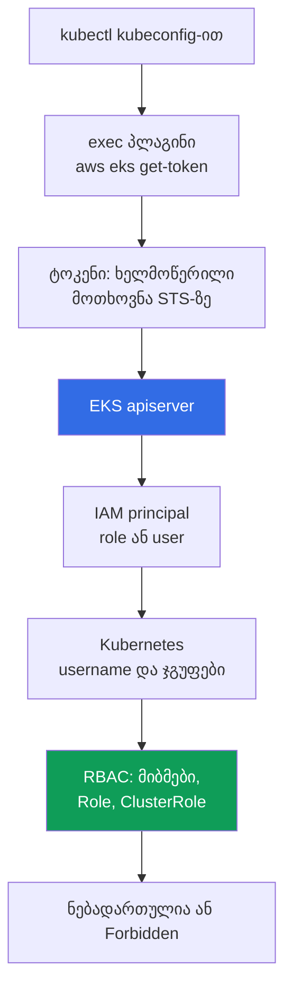
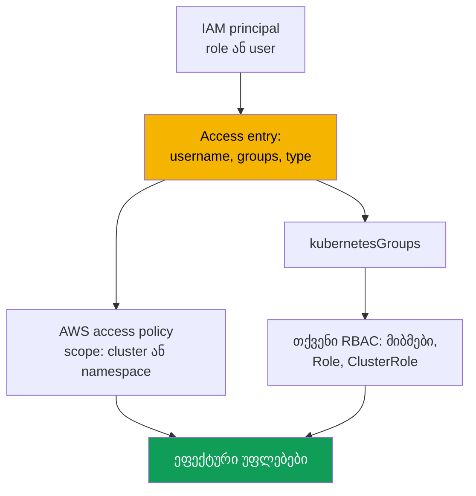

[Русская версия](ru.md) · [Eng version](en.md) · [Versión en español](es.md) · [Version française](fr.md) · [Deutsche Version](de.md) · [繁體中文版](tw.md) · [日本語版](jp.md)
# თავი 5. კლასტერის წვდომა: IAM და RBAC, access entry-ები, aws-auth-იდან მიგრაცია

> **რა გველოდება შემდეგ.** კლასტერი შექმნილია (თავი 4) და შემდეგი კითხვა ისაა, ვინ შევა მასში და რა უფლებებით. RBAC CKA-დან იცით, მაგრამ EKS-ში მის წინ მეორე ფენაა - IAM-ით ავთენტიკაცია. ეს თავი ამ ფენების გადაკვეთას, სამ `authenticationMode` რეჟიმს, მოძველებულ `aws-auth` ConfigMap მექანიზმსა და მის ჩამნაცვლებელ API access entry-ებს, access policy-ებს და წვდომის დაკარგვის გარეშე მიგრაციას ეხება. Pod-ების AWS API-თან წვდომა სხვა ამოცანაა: IRSA (თავი 16) და Pod Identity (თავი 17).

## 5.1. „kubeconfig სწორია, მაგრამ kubectl Unauthorized-ს აბრუნებს“

kubeadm-ში წვდომა client certificate-ით გაიცემოდა: CSR-ს თქვენი CA-ით აწერდით ხელს, ინჟინერს kubeconfig-ს აძლევდით და ჯგუფები `O` ველიდან მოდიოდა. მექანიზმი გასაგებია, ერთი ცნობილი პრობლემით: certificate-ის გაუქმება პრაქტიკულად შეუძლებელია, apiserver გაუქმების სიებს არ ამოწმებს და ერთადერთი რეალური გამოსავალი CA-ის ხელახლა გამოცემაა, ანუ ყველასთვის წვდომის შეცვლა. თანამშრომლის წასვლა ერთი სტრიქონის წაშლის ნაცვლად მინი-პროექტი ხდებოდა. EKS-ს სხვა მოდელი აქვს და მას ორ სცენარში ხვდებით.

**პირველი.** ინჟინერი უშვებს `aws eks update-kubeconfig`-ს; ბრძანება შეცდომის გარეშე სრულდება, context იცვლება, მაგრამ `kubectl get pods` აბრუნებს `error: You must be logged in to the server (Unauthorized)`. kubeconfig სწორია: endpoint, CA და plugin ადგილზეა. სხვა რამ არ ემთხვევა - IAM principal, რომლის სახელითაც ინჟინერი მუშაობს, კლასტერისთვის უცნობია და ამას ვერც ერთი IAM policy ვერ გამოასწორებს.

**მეორე, და უფრო ძვირი.** ვიღაც `aws-auth` ConfigMap-ს არედაქტირებს და ახალი გუნდის role-ს ამატებს. yaml-ში indent იცვლება, `mapRoles` ვეღარ იკითხება და წვდომას **ყველა** კარგავს, ცვლილების ავტორის ჩათვლით. შიგნიდან ვეღარაფერს გააკეთებთ: ConfigMap-ის გამოსასწორებლად წვდომაა საჭირო, მაგრამ წვდომა აღარ არის.

ორივე შემთხვევის მიზეზი ერთია: **EKS-ში ავთენტიკაცია გარეა, ავტორიზაცია კი შიდა**. ეს ორი დამოუკიდებელი ფენაა და მათი არევა ამ თავში ყველაფერზე ძვირი ჯდება.

## 5.2. IAM პასუხობს „ვინ ხარ“, RBAC - „რისი უფლება გაქვს“

ავთენტიკაცია AWS-შია: apiserver ამოწმებს ხელმოწერილ STS მოთხოვნას და იღებს IAM principal-ს. ავტორიზაცია კლასტერშია: ჩვეულებრივი RBAC წყვეტს, რა შეუძლია subject-ს. ფენებს შორის **mapping** დგას: ARN Kubernetes `username`-ად და ჯგუფებად გარდაიქმნება.



`kubectl` kubeconfig-ში `exec` block-ს ხედავს, იძახებს `aws eks get-token`-ს და იღებს არა password-ს ან certificate-ს, არამედ STS-ის **ხელმოწერილ მოთხოვნას**: ქსელში signature მიდის და არა secret. Plugin credentials-ს AWS provider chain-იდან იღებს: `AWS_PROFILE`, environment variables, SSO cache და instance role (თავი 0.5). apiserver signature-ს ამოწმებს და principal ARN-ს იღებს; შემდეგ ARN `username`-ად და `kubernetesGroups`-ად map-დება, ხოლო გადაწყვეტილებას RBAC იღებს.

დასამახსოვრებელი წესი ასეთია: `AdministratorAccess`-იანი IAM policy **თავისთავად კლასტერის შიგნით არანაირ უფლებას არ გაძლევთ**. ის EKS API გამოძახების საშუალებას იძლევა (კლასტერის აღწერა, configuration-ის შეცვლა, მთლიანად წაშლა), მაგრამ `kubectl get pods` `Unauthorized`-ს დააბრუნებს, სანამ principal კლასტერში არ იქნება map-ებული. ერთადერთი გამონაკლისი access entry-ებთან გაჩნდა: EKS API-ით შესაძლებელია managed access policy-ის ასოცირება და მაშინ AWS უფლებებს თქვენს `Role`-სა და `ClusterRole`-ს გვერდის ავლით გასცემს (ნაწილი 5.6). Token მიმდინარე AWS session-ზეა მიბმული, ამიტომ „დილით მუშაობდა, ლანჩის შემდეგ Unauthorized“ ჩვეულებრივ SSO session-ის ვადის გასვლას ნიშნავს; server-ის მხარე `authenticator` ტიპის ლოგები-ში ჩანს (თავი 2).

## 5.3. სამი authenticationMode რეჟიმი

რეჟიმი განსაზღვრავს, საიდან იღებს კლასტერი principal mapping-ებს. ის შექმნისას (თავი 4) ირჩევა და მოქმედ კლასტერზეც შეიძლება შეიცვალოს.

| რეჟიმი | ასახვის წყარო | როდის შეეფერება |
|---|---|---|
| `CONFIG_MAP` | მხოლოდ `aws-auth` ConfigMap | legacy: ძველი კლასტერები მიგრაციამდე |
| `API_AND_CONFIG_MAP` | access entry-ებიც და `aws-auth`-ც | მიგრაციის გარდამავალი რეჟიმი |
| `API` | მხოლოდ access entry-ები | ახალი კლასტერების სამიზნე რეჟიმი |

ახალი კლასტერები პირდაპირ `API` რეჟიმში იქმნება; ძველები `API_AND_CONFIG_MAP`-ში გადადიან, შემდეგ კი `API`-ში. გარდამავალ რეჟიმში, თუ principal აღწერილია როგორც access entry-ში, ისე `aws-auth`-ში, **access entry** იმარჯვებს: შეგიძლიათ ჩანაწერი წინასწარ შექმნათ და შეამოწმოთ ConfigMap-ის ხაზის წაშლის გარეშე. მთავარი შეზღუდვაა გადაადგილება **მხოლოდ API-ისკენ** - უკან დაბრუნება შეუძლებელია.

```bash
aws eks describe-cluster --name demo --query 'cluster.accessConfig'
aws eks update-cluster-config --name demo --access-config authenticationMode=API_AND_CONFIG_MAP
aws eks update-cluster-config --name demo --access-config authenticationMode=API
```

## 5.4. aws-auth ConfigMap: რატომ იცვლება იგი

ისტორიულად mapping Kubernetes object-ში ცხოვრობდა: `kube-system`-ის `aws-auth` ConfigMap-ში. `mapRoles` ველი IAM role-ებს map-ავს, `mapUsers` კი IAM user-ებს.

```bash
kubectl -n kube-system get configmap aws-auth -o yaml
```

```yaml
data:
  mapRoles: |
    - rolearn: arn:aws:iam::111122223333:role/platform-admins
      username: platform-admin
      groups: [system:masters]
  mapUsers: |
    - userarn: arn:aws:iam::111122223333:user/ci-legacy
      username: ci-legacy
```

მექანიზმი მუშაობს, მაგრამ მისი პრობლემები ზუსტად ხსნის, რატომ შექმნა AWS-მ ჩანაცვლება.

- **yaml-ის ერთი შეცდომა ყველასთვის წვდომის დაკარგვას ნიშნავს.** `mapRoles` authenticator-ისთვის string-ია, სქემის ვალიდაცია არ არსებობს და ConfigMap-ის გამოსწორებას სწორედ იმ ConfigMap-ით მინიჭებული წვდომა სჭირდება.
- **ობიექტი კლასტერშია და არა კლასტერის კონფიგურაციაში.** ის `describe-cluster`-ში არ ჩანს, EKS API-ით ვერ იმართება, თქვენს IaC-ს სცილდება და ცვლილებების ისტორია არ აქვს: ვერ გაიგებთ ვინ დაამატა `system:masters`-იანი role ან როდის. EKS API-ის გამოძახებები CloudTrail-ში ჩანს (თავი 21).
- **წვდომას წინასწარ ვერ გასცემთ და მართვადი პოლიტიკები არ არსებობს.** ARN-ში typo მხოლოდ მაშინ იპოვება, როცა ვინმე ვერ შევა, ხოლო ConfigMap entry-ს access policy საერთოდ ვერ ასოცირდება.

## 5.5. Access entry-ები: mapping როგორც EKS API object

Access entry cluster access configuration-ში ცხოვრობს და არა კლასტერში. ის **ერთ** IAM principal-ს, role-ს ან user-ს, `username`-სა და `kubernetesGroups`-ის სიასთან აკავშირებს; principal ერთზე მეტ entry-ში ვერ იქნება და არსებულ entry-ში მისი შეცვლა შეუძლებელია.



Entry-ს აქვს **type**, რომელიც უფლებებით კი არა, principal-ის სახით განისაზღვრება: `STANDARD` ნაგულისხმევია ადამიანებისთვის, CI-სა და controllers-ისთვის; `EC2_LINUX` და `EC2_WINDOWS` self-managed nodes-ისთვის; `FARGATE_LINUX` Fargate-ისთვის; `HYBRID_LINUX` hybrid nodes-ისთვის; `EC2` კი Auto Mode-ში node class-ისთვის. ოპერაციულად მნიშვნელოვანი ისაა, რომ **managed node groups-სა და Fargate profiles-ისთვის entry-ების შექმნა არ გჭირდებათ**: EKS მათ თავად ქმნის. Self-managed node-ს entry სჭირდება, თორემ კლასტერს ვერ შეუერთდება (თავი 45). `STANDARD`-ისთვის `username` არ დააყენოთ - სერვისი თავად ჩასვამს.

```bash
aws eks create-access-entry --cluster-name demo \
  --principal-arn arn:aws:iam::111122223333:role/platform-admins \
  --kubernetes-groups platform-admins --type STANDARD

aws eks list-access-entries --cluster-name demo
aws eks describe-access-entry --cluster-name demo \
  --principal-arn arn:aws:iam::111122223333:role/platform-admins
```

ამის შემდეგ `platform-admins` ჩვეულებრივი Kubernetes group-ია: მისთვის `ClusterRoleBinding` შექმენით და CKA-დან ცნობილი ყველაფერი მუშაობს. Access entry RBAC-ს არ ცვლის; ის RBAC subject-ს გაძლევთ.

**კლასტერის შემქმნელის ჩანაწერი.** `bootstrapClusterCreatorAdminPermissions` ნაგულისხმევად `true`-ია: cluster-ის შემქმნელი principal მის შიგნით administrator permissions-ს იღებს. ეს ერთდროულად escape hatch-იცაა და ხაფანგიც (თავი 4): entry ჩვეულებრივ მუშაობაში უხილავია, code-ში არ არის აღწერილი, IAM policies-ით ვერ წაიშლება და თუ cluster ინჟინრის პირადი role-ით შეიქმნა, role ინჟინრის წასვლის შემდეგაც ინარჩუნებს უფლებებს. პრაქტიკა: cluster-ს CI role ქმნის, flag `false`-ია და administrator permissions code-ში explicit access entry-ებითაა აღწერილი.

## 5.6. Access policy-ები: cluster უფლებები EKS API-ით

უფლებების მინიჭების მეორე გზა access entry-სთან managed **access policy**-ის ასოცირებაა. ეს Kubernetes-level policies-ია და არა IAM policies: შიგნით verbs და resources აქვს, მხოლოდ უფლებებს იძლევა და მათი შეცნა ან შექმნა თქვენ არ შეგიძლიათ. ისინი RBAC-ს ავსებს: principal-ის effective rights არის access policy-ებიდან მიღებული და მისი groups-სა და `username`-თან მიბმებით მიღებული უფლებების ჯამი.

| Access policy | რას იძლევა | ტიპური access scope |
|---|---|---|
| `AmazonEKSClusterAdminPolicy` | სრული administrator, `cluster-admin`-ის ეკვივალენტი | `cluster` |
| `AmazonEKSAdminPolicy` | თითქმის ყველა resource action | `namespace` |
| `AmazonEKSEditPolicy` | workloads-ის შეცვლა RBAC-ის რედაქტირების გარეშე | `namespace` |
| `AmazonEKSViewPolicy` | resources-ის კითხვა secrets-ის გარეშე | `namespace` ან `cluster` |
| `AmazonEKSAdminViewPolicy` | ყველა resource-ის კითხვა, secrets-ის ჩათვლით | `cluster` |

Access scope-ს ორი ფორმა აქვს: მთელი კლასტერისთვის `cluster` ან namespace-ების სიით `namespace`, რომელიც `dev-*`-ის მსგავს patterns-ს უჭერს მხარს. Scope-ის შეცვლა შეგიძლიათ, მაგრამ EKS namespace-ის არსებობას არ ამოწმებს: typo ჩუმად ცარიელ უფლებებს გაძლევთ.

```bash
aws eks associate-access-policy --cluster-name demo \
  --principal-arn arn:aws:iam::111122223333:role/team-payments \
  --policy-arn arn:aws:eks::aws:cluster-access-policy/AmazonEKSEditPolicy \
  --access-scope type=namespace,namespaces=payments,payments-stage

aws eks list-associated-access-policies --cluster-name demo \
  --principal-arn arn:aws:iam::111122223333:role/team-payments
```

**მზა policy-ები** სტანდარტული როლებისთვის გამოიყენეთ: ნახვა, საკუთარ namespace-ში მუშაობა ან ერთხელ administrator access-ის მიღება. **საკუთარი `Role` და `ClusterRole`** დაწერეთ, როცა ნაკლები ან სპეციფიკური უფლებებია საჭირო: საკუთარ CRD-ებზე წვდომა, მხოლოდ `logs` და `exec`, ან secrets-ზე აკრძალვა. მაშინ access entry `kubernetesGroups`-ს ადგენს, უფლებებს კი თქვენი RBAC აღწერს. Hybrid გამოყენება ნორმალურია: `AmazonEKSViewPolicy` cluster-ზე და ზუსტი namespace უფლებების მქონე საკუთარი group. Debugging-ის ხაფანგია, რომ `kubectl auth can-i --list` access policy-ის უფლებებს **არ აჩვენებს**, რადგან ისინი RBAC objects-ად არ არის გამოხატული; ამის ნაცვლად `list-associated-access-policies` შეამოწმეთ.

## 5.7. aws-auth-იდან access entry-ებზე მიგრაცია

| თვისება | `aws-auth` ConfigMap | Access entry-ები |
|---|---|---|
| სად ცხოვრობს | ობიექტი `kube-system`-ში | კლასტერის კონფიგურაცია EKS API-ში |
| ვალიდაცია | არა, yaml-ის სტრიქონულ ველში | EKS API-ის მხარეს |
| შეცდომა რას აზიანებს | ყველას წვდომას, თქვენს ჩათვლით | ერთ entry-ს |
| ცვლილებების ისტორია | არა | CloudTrail (თავი 21) |
| AWS-ის მართვადი პოლიტიკები | არა | კი, access policy-ები |
| მართვა IaC-იდან | Kubernetes provider-ით | AWS provider-ით |

1. **ინვენტარიზაცია.** `aws-auth` ფაილში შეინახეთ: ეს მიგრაციის გეგმაცაა და rollback-იც.
2. **`API_AND_CONFIG_MAP` რეჟიმი.** Access entry-ები აქტიურდება, ConfigMap მუშაობას აგრძელებს და არსებული წვდომა არ წყდება.
3. **Entry-ები ადამიანებისა და სერვისებისთვის.** ყველა `mapRoles` და `mapUsers` ხაზისთვის, რომელიც **თქვენ** დაამატეთ, იგივე `username`-ითა და groups-ით access entry შექმენით: მათ უკან RBAC-ის მიბმები დგას.
4. **Nodes არ შეეხოთ.** EKS-ის მიერ managed node groups-სა და Fargate profiles-ისთვის შექმნილი ხაზები სერვისის პასუხისმგებლობად რჩება; მათი წაშლა ექვივალენტური entry-ების გარეშე cluster-ს აზიანებს. Self-managed nodes-ისთვის იგივე `username`-ითა და groups-ით `EC2_LINUX` entry შექმენით.
5. **წაშლამდე შეამოწმეთ.** მიგრაციის role-ით **მეორე** session გახსენით და დარწმუნდით, რომ მუშაობს, პირველის დახურვის გარეშე. შემდეგ ConfigMap-ის ხაზები სათითაოდ წაშალეთ.
6. **`API` რეჟიმი** გამოიყენება მაშინ, როცა ConfigMap-ში თქვენ მიერ დამატებული entry აღარ დარჩება. ეს ნაბიჯი შეუქცევადია.

```bash
aws eks update-kubeconfig --name demo --region eu-central-1 --alias demo-migrated
kubectl auth whoami
kubectl auth can-i get pods -n payments
kubectl auth can-i list secrets -n kube-system --as-group platform-admins
```
## 5.8. გავრცელებული უარები: Unauthorized და Forbidden

| ნიშანი | `Unauthorized` (401) | `Forbidden` (403) |
|---|---|---|
| დაზიანებული ფენა | ავთენტიკაცია, AWS | ავტორიზაცია, RBAC |
| მნიშვნელობა | კლასტერმა ვერ გაიგო ვინ ხართ | გაიგო ვინ ხართ, მაგრამ მოქმედება არ დაუშვა |
| ტიპური მიზეზები | არასწორი profile, ვადაგასული SSO, role არ არის რეგისტრირებული | ჯგუფთან მიბმა არ არსებობს, policy scope ვიწროა |
| სად შევხედოთ | `get-caller-identity`, `list-access-entries`, `authenticator`-ის ლოგები | `auth can-i`, RBAC-ის მიბმები, პოლიტიკების ასოციაციები |
| რა აგვარებს | access entry ან `aws-auth` | მიბმა, `ClusterRole` ან access policy |

```bash
aws sts get-caller-identity            # ვინ მხედავს AWS ამ მომენტში
echo "$AWS_PROFILE"                    # ეს ის profile-ია, რომელსაც ელით
aws eks list-access-entries --cluster-name demo   # იცნობს cluster ამ ARN-ს
kubectl auth whoami                    # როგორ მხედავს apiserver: username და ჯგუფები
```

`kubectl auth whoami` საზღვრის ყველაზე სწრაფი შემოწმებაა: თუ ბრძანება პასუხობს, ავთენტიკაცია გავლილია და პრობლემა უფლებებშია; თუ `Unauthorized`-ს აბრუნებს, RBAC-მდე საქმე ვერ მივიდა. ცალკე ხაფანგია, რომ `get-caller-identity` გიჩვენებთ role-ს, რომელიც **მიიღეთ**, ხოლო access entry-ში უნდა იყოს თვით role-ის ARN და არა assumed-role session-ის ARN. `authenticator` ტიპის ლოგები (თავი 2) server-ის მხარეს აჩვენებს, როცა client checks არ ემთხვევა; რთული შემთხვევები თავ 47-შია.

## 5.9. ადამიანებისა და CI-ის წვდომის ორგანიზება

- **ადამიანები მუდმივ უფლებებს არ იღებენ.** ისინი IAM Identity Center-ით შედიან: permission set IAM role-ს შეესაბამება, role კი cluster access entry-ს. Session დროებითია; გაუქმება assignment-ის წაშლაა და არა CA-ის ხელახლა გამოცემა.
- **Kubernetes ჯგუფები და არა პერსონალური entry-ები.** Access entry team role-სთვის შექმენით და არა ადამიანისთვის: ოცდაათი ინჟინერი ნიშნავს ოცდაათ შესაძლებლობას, რომ offboarding-ისას ერთი entry დაგავიწყდეთ.
- **დავიწყებული entry-ების audit.** `aws eks list-access-entries` რეგულარულად შეადარეთ მიმდინარე roles-ს: entry, რომლის `principal-arn` წაშლილ ან დიდი ხანია მიუღებელ role-ზე მიუთითებს, დავიწყებული deletion access-ია, ხოლო role assumptions CloudTrail-ში ჩანს (თავი 21).
- **Break-glass ცალკე.** ერთი role `AmazonEKSClusterAdminPolicy`-ით `cluster` scope-ზე, რომელსაც ჩვეულებრივ მუშაობაში არავინ იღებს: მკაცრი trust policy, MFA და CloudTrail-ში მისი მიღების alert (თავი 21). ეს გამოსავალია ნაწილის 5.1 სიტუაციიდან.
- **CI-ისთვის ცალკე role.** Trust კონკრეტული repository-ითა და branch-ით იზღუდება (თავი 0.2), უფლებები მის namespaces-ში `AmazonEKSEditPolicy` დონეზეა და cluster access configuration-ის შეცნა არ შეუძლია, თორემ pipeline საკუთარ თავს უფლებებს მიანიჭებს. თავად access entry-ები და პოლიტიკების ასოციაციები cluster-ის გვერდით ჩვეულებრივი IaC resources-ია (თავი 4). გუნდის იზოლაცია თავი 22-ია.

## 5.10. როგორ გამოიყენება production-ში

- **ახალი clusters პირდაპირ `API` რეჟიმით იწყება**, `bootstrapClusterCreatorAdminPermissions` `false`-ზეა და administrator access explicit access entry-ებითაა აღწერილი code-ში.
- **ადამიანები IAM Identity Center-ით შედიან**: permission set role-ზე, role access entry-ზე, უფლებები Kubernetes group-ზე; personal entry-ები არ არის, ხოლო ერთი break-glass role alert-ის ქვეშაა.
- **CI-ს საკუთარი role აქვს** namespace-level უფლებებით და access configuration-ის შეცვლის უფლების გარეშე. `authenticator` ტიპის ლოგები ჩართულია, ხოლო ახალ clusters-ზე `aws-auth` საერთოდ არ არსებობს.

## 5.11. მინი-გლოსარიუმი

- **Access entry**: cluster access configuration-ის ჩანაწერი, რომელიც ერთ IAM principal-ს `username`-სა და `kubernetesGroups`-თან აკავშირებს; `STANDARD` ადამიანებისა და სერვისებისთვისაა, ხოლო `EC2_LINUX`, `EC2_WINDOWS`, `FARGATE_LINUX`, `HYBRID_LINUX` და `EC2` nodes-ისთვის.
- **Access policy**: AWS-managed Kubernetes-level permissions policy, რომელიც access entry-ს უკავშირდება; იგი verbs-სა და resources-ს შეიცავს, არა IAM permissions-ს, და არ რედაქტირდება. **Access scope** მისი არეა: `cluster` ან `namespace` სიით.
- **`authenticationMode`**: authentication mode: `CONFIG_MAP`, `API_AND_CONFIG_MAP` ან `API`; მოძრაობა მხოლოდ `API`-ისკენაა. **`aws-auth` ConfigMap** მოძველებული mapping mechanism-ია `kube-system`-ის object-ითა და `mapRoles`, `mapUsers` ველებით.
- **`bootstrapClusterCreatorAdminPermissions`**: cluster creation field; `true`-ზე (ნაგულისხმევი) creator cluster-ის შიგნით administrator permissions-ს იღებს.

## 5.12. თავის შეჯამება

- ავთენტიკაცია გარეა (IAM და STS), ავტორიზაცია შიდაა (RBAC), ხოლო IAM-ში `AdministratorAccess` თავისთავად cluster უფლებებს არ იძლევა. ჯაჭვია `kubectl`, `aws eks get-token` plugin, ხელმოწერილი STS request, signature verification, ARN-ის `username`-სა და groups-ში mapping, შემდეგ RBAC.
- არსებობს სამი რეჟიმი: `CONFIG_MAP`, `API_AND_CONFIG_MAP` და `API`. მიზანი `API`-ა, მისკენ გადასვლა შეუქცევადია და გარდამავალ რეჟიმში access entry-ს პრიორიტეტი აქვს `aws-auth`-ზე. ეს უკანასკნელი სტრუქტურულად სახიფათოა: ვალიდაცია და history არ აქვს, yaml შეცდომა ყველასთვის წვდომას თიშავს, ცვლილების ავტორის ჩათვლით, და object შიგნიდან ვეღარ სწორდება.
- Access entry-ები EKS API-ში ცხოვრობს, ვალიდდება, CloudTrail-ში ჩანს და code-ში აღიწერება. უფლებები `kubernetesGroups`-ითა და თქვენი RBAC-ით, `cluster` ან `namespace` scope-ის access policies-ით, ან ორივეთი გაიცემა. მიგრაციაა `API_AND_CONFIG_MAP`, საკუთარი ხაზებისთვის entry-ები, node entry-ებს არ შეეხოთ, მეორე session-ით შეამოწმეთ, ხაზები წაშალეთ, შემდეგ `API` რეჟიმი გამოიყენეთ.
- `Unauthorized` ავთენტიკაციას ნიშნავს, `Forbidden` ავტორიზაციას, და დიაგნოსტიკა `aws sts get-caller-identity`-ითა და `kubectl auth whoami`-თი იწყება, არა RBAC manifests-ის კითხვით.

## 5.13. როგორ გეხმარებათ ეს რეალურ სამუშაოში

ამოცანა „წასული ინჟინრისთვის წვდომის გაუქმება“ წუთებს მოითხოვს, როცა წვდომა დროებით roles-სა და groups-ზეა აგებული, და გაურკვეველ დროს, როცა ადამიანს personal entry ჰქონდა და cluster-იც თავად შექმნა. კითხვას „ვის შეუძლია production-ში namespace-ის წაშლა“ ან entry-ებისა და მიბმების ჩამონათვალით პასუხობთ, ან საერთოდ ვერ პასუხობთ. პირველი ნაწილის სცენარი კატასტროფა აღარ არის, როცა break-glass role და `API` რეჟიმი არსებობს.

## 5.14. თვითშემოწმების კითხვები

1. რატომ არ იძლევა IAM-ში `AdministratorAccess` cluster-ში `kubectl get pods` გაშვების უფლებას?
2. რა იგზავნება ზუსტად apiserver-ში token-ის სახით და რატომ არ არის ეს password?
3. რით განსხვავდება `Unauthorized` და `Forbidden` და საიდან იწყებთ თითოეულის დიაგნოსტიკას?
4. რა სამ მნიშვნელობას იღებს `authenticationMode` და რომელი გადასვლებია შესაძლებელი?
5. ერთი და იგივე ARN არის როგორც `aws-auth`-ში, ისე access entry-ში. რომელი იმარჯვებს და რომელ რეჟიმში?
6. რა განსაზღვრავს access entry type-ს და რომელი nodes-ისთვის იქმნება entry-ები ავტომატურად?
7. როდის გამოიყენებთ `AmazonEKSEditPolicy`-ს და როდის დაწერთ საკუთარ `ClusterRole`-ს?
8. რატომ შეიძლება `kubectl auth can-i --list`-მა რეალურად არსებული უფლებები არ აჩვენოს?
9. აღწერეთ `aws-auth`-იდან მიგრაციის რიგი, რომელიც ყოველ ეტაპზე აღდგენის გზას ინარჩუნებს.

## პრაქტიკა

ამ თემის labs არის [lab 102 - cluster access: IAM და RBAC, access entry-ები და access policy-ები](../../labs/102/README_GE.MD) და [lab 122 - AWS Backup EKS-ისთვის: composite recovery point, namespace recovery](../../labs/122/README_GE.MD). მათ გარდა, შინაარსი ნებისმიერ cluster-ზე შეიძლება შემოწმდეს. დაიწყეთ ინვენტარიზაციით: `aws eks describe-cluster --name <cluster> --query 'cluster.accessConfig'` რეჟიმსა და creator flag-ს აჩვენებს; `aws eks list-access-entries --cluster-name <cluster>` და `aws eks describe-access-entry` `--principal-arn`-ით entry-ის type-ს, `username`-სა და groups-ს აჩვენებს. `STANDARD` entry-ებისთვის გაუშვით `aws eks list-associated-access-policies` და scope შეამოწმეთ.

შემდეგ ორი ფენა შეადარეთ: access entry-ებიდან groups შეაგროვეთ და `kubectl get clusterrolebindings,rolebindings -A -o wide`-ში მოძებნეთ. მიბმებისა და access policy-ების გარეშე groups არაფერს იძლევა, ხოლო ყველა entry-ში არმყოფ ჯგუფებზე მიბმები მკვდარი RBAC-ია. ასევე მოძებნეთ დავიწყებული entry-ები: `list-access-entries` გაიარეთ და ყოველ `principal-arn`-ზე `aws iam get-role` გაუშვით; არარსებული role-ის entry მკვდარი deletion access-ია. საკუთარი თავი `kubectl auth whoami`-ითა და `kubectl auth can-i --list`-ით შეამოწმეთ და გახსოვდეთ, რომ access policy უფლებები ამ output-ში არ ჩანს. თუ cluster ჯერ კიდევ `CONFIG_MAP` ან `API_AND_CONFIG_MAP` რეჟიმშია, `kubectl -n kube-system get configmap aws-auth -o yaml` ფაილში შეინახეთ. ცალკე ივარჯიშეთ უარზე: access entry-ის გარეშე role შექმენით, შესვლა სცადეთ და ის `authenticator` ტიპის ლოგები-ში იპოვეთ (თავი 2).

---
[სარჩევი](../README_GE.md) · [თავი 4](../04/ge.md) · [თავი 6](../06/ge.md)