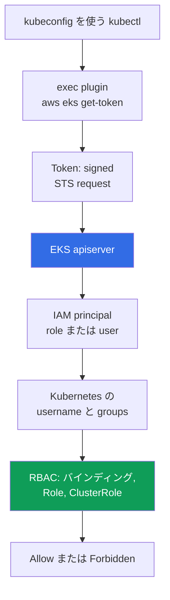
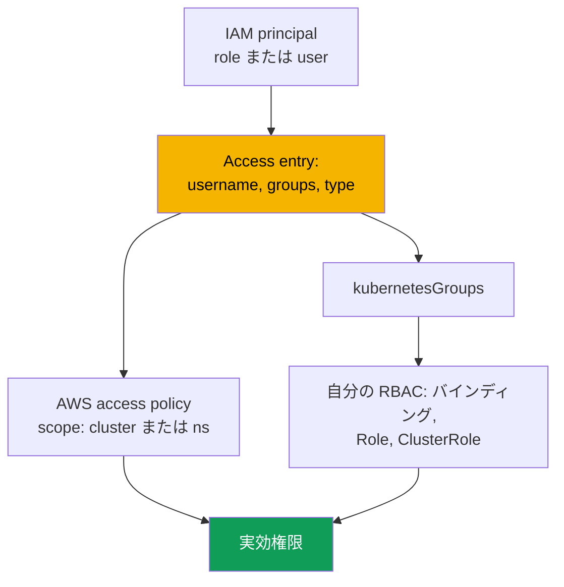

[ロシア語版](ru.md) · [英語版](en.md) · [スペイン語版](es.md) · [フランス語版](fr.md) · [ドイツ語版](de.md) · [ジョージア語版](ge.md) · [繁体字中国語版](tw.md)
# 第 5 章. クラスターへのアクセス: IAM と RBAC、access entries、aws-auth からの移行

> **次に何をするか。** クラスターは作成済みです（第 4 章）。次の問いは、誰がどの権限で入れるかです。CKA で RBAC は学びましたが、EKS ではその前に IAM authentication という第二の層があります。本章では、二つの層の接点、三つの `authenticationMode`、legacy の `aws-auth` ConfigMap とそれを置き換える API access entries、access policies、アクセスを失わない移行を扱います。Pod から AWS API へアクセスするのは別の課題です: IRSA（第 16 章）と Pod Identity（第 17 章）を参照してください。

## 5.1. 「kubeconfig は正しいのに kubectl が Unauthorized を返す」

kubeadm では client certificate でアクセスを付与します。自分の CA で CSR に署名し、engineer に kubeconfig を渡し、groups は `O` field から取得します。仕組みは明確ですが、よく知られた問題が一つあります。certificate の revoke は実質不可能で、apiserver は revocation list を確認せず、正直な解決策は CA を再発行すること、つまり全員のアクセスを変更することです。employee の退職は一行を削除するのでなく mini-project になります。EKS は異なる model で、二つの scenario でこれに遭遇します。

**一つ目。** Engineer が `aws eks update-kubeconfig` を実行します。command は error なく完了し、context は切り替わりますが、`kubectl get pods` は `error: You must be logged in to the server (Unauthorized)` を返します。kubeconfig は正しいです: endpoint、CA、plugin は揃っています。合わないのは別の点です。engineer が使う IAM principal を cluster が知らず、どの IAM policy でもそれを直せません。

**二つ目、より高価なもの。** 誰かが新しい team の role を追加するため `aws-auth` ConfigMap を編集します。yaml の indentation がずれ、`mapRoles` を parse できなくなり、変更者を含む**全員**がアクセスを失います。内側からは何もできません。ConfigMap を直すには access が必要ですが、access がありません。

どちらのケースも原因は同じです。**EKS では authentication は外部、authorization は内部**です。これは独立した二つの層であり、混同すると本章の他の何よりも高くつきます。

## 5.2. IAM は「誰か」、RBAC は「何をしてよいか」に答える

認証 は AWS にあります。apiserver は signed STS request を検証し、IAM principal を取得します。Authorization は cluster にあります。通常の RBAC が subject に許可される操作を決定します。層の間には**mapping**があります。ARN が Kubernetes の `username` と groups になります。



`kubectl` は kubeconfig の `exec` block を見て `aws eks get-token` を呼び出し、password や certificate ではなく、STS への**signed request**を受け取ります。network を通るのは secret ではなく signature です。plugin は通常の AWS provider chain から credentials を取得します: `AWS_PROFILE`、environment variables、SSO cache、instance role（第 0.5 章）。apiserver は signature を検証して principal ARN を取得し、ARN は `username` と `kubernetesGroups` に mapping され、RBAC が決定します。

覚えるべき規則は次のとおりです。`AdministratorAccess` を持つ IAM policy は、**それだけでは cluster 内の権限を一切付与しません**。EKS API の呼び出し（cluster の describe、configuration の変更、完全な削除）は許可しますが、principal が cluster に mapping されるまで `kubectl get pods` は `Unauthorized` を返します。唯一の例外は access entries とともに現れました。EKS API は managed access policy を associate でき、その場合 AWS が権限を付与し、自分の `Role` と `ClusterRole` を経由しません（5.6 節）。Token は現在の AWS session に結び付くため、「朝は動いたのに昼過ぎは Unauthorized」は通常 SSO session の期限切れです。server 側は `authenticator` 種類のログ で確認できます（第 2 章）。

## 5.3. 三つの authenticationMode

モードは cluster が principal mappings をどこから取得するかを決めます。作成時に設定し（第 4 章）、稼働中の cluster でも変更できます。

| モード | マッピング元 | 適する場面 |
|---|---|---|
| `CONFIG_MAP` | `aws-auth` ConfigMap のみ | legacy: 移行前の古い clusters |
| `API_AND_CONFIG_MAP` | access entries と `aws-auth` の両方 | 移行中の transition mode |
| `API` | access entries のみ | 新しい clusters の target mode |

新しい clusters は直接 `API` で作成します。古いものは `API_AND_CONFIG_MAP` に移し、その後 `API` に移します。transition mode で principal が access entry と `aws-auth` の両方に定義されている場合、**access entry** が優先されます。ConfigMap の行を削除せずに entry を事前作成して確認できます。重要な制約は**API 方向へのみ**進めることです。元には戻せません。

```bash
aws eks describe-cluster --name demo --query 'cluster.accessConfig'
aws eks update-cluster-config --name demo --access-config authenticationMode=API_AND_CONFIG_MAP
aws eks update-cluster-config --name demo --access-config authenticationMode=API
```

## 5.4. aws-auth ConfigMap: 廃止へ向かう理由

歴史的には mapping は Kubernetes object、すなわち `kube-system` の `aws-auth` ConfigMap にありました。`mapRoles` field は IAM roles を、`mapUsers` は IAM users を mapping します。

```bash
kubectl -n kube-system get configmap aws-auth -o yaml
```

```yaml
data:
  mapRoles: |
    - rolearn: arn:aws:iam::111122223333:role/platform-admins
      username: platform-admin
      groups: [system:masters]
  mapUsers: |
    - userarn: arn:aws:iam::111122223333:user/ci-legacy
      username: ci-legacy
```

仕組みは動作しますが、その問題は AWS が置き換えを作った理由を正確に説明します。

- **yaml の一つの error で全員がアクセスを失う。** `mapRoles` は authenticator 向けの string で、schema validation がありません。ConfigMap を直すには、その同じ ConfigMap が付与する access が必要です。
- **Object は cluster configuration ではなく cluster 内にある。** `describe-cluster` には現れず、EKS API で管理できず、IaC と drift し、history もありません。`system:masters` を持つ role を誰がいつ追加したかは分かりません。EKS API calls は CloudTrail に表示されます（第 21 章）。
- **事前に access を付与できず、managed policies もない。** ARN の typo は誰かが login できなくなって初めて見つかり、ConfigMap entry に access policy を associate することは不可能です。

## 5.5. Access entries: EKS API object としての mapping

Access entry は cluster 内ではなく cluster access configuration に存在します。**一つの** IAM principal、role または user を `username` と `kubernetesGroups` の list に関連付けます。principal は複数の entry に入れず、既存 entry の principal を変更することもできません。



Entry には**type**があり、permissions ではなく principal の種類で決まります。`STANDARD` は人、CI、controllers の default、`EC2_LINUX` と `EC2_WINDOWS` は self-managed nodes 用、`FARGATE_LINUX` は Fargate 用、`HYBRID_LINUX` は hybrid nodes 用、`EC2` は Auto Mode の node class 用です。運用上の要点は、**managed node groups と Fargate profiles 用の entries は作成不要**ということです。EKS が自身で作成します。self-managed node は entry がなければ cluster に join できません（第 45 章）。`STANDARD` の `username` は設定しない方がよく、service が自動設定します。

```bash
aws eks create-access-entry --cluster-name demo \
  --principal-arn arn:aws:iam::111122223333:role/platform-admins \
  --kubernetes-groups platform-admins --type STANDARD

aws eks list-access-entries --cluster-name demo
aws eks describe-access-entry --cluster-name demo \
  --principal-arn arn:aws:iam::111122223333:role/platform-admins
```

これ以降、`platform-admins` は通常の Kubernetes group です。これに `ClusterRoleBinding` を作れば、CKA で知っているすべてが動作します。Access entry は RBAC を置き換えず、RBAC subject を提供します。

**Cluster creator entry。** `bootstrapClusterCreatorAdminPermissions` の default は `true` です。cluster を作成した principal は cluster 内の administrator permissions を得ます。これは escape hatch であると同時に trap です（第 4 章）。Entry は通常の作業では見えず、code に記述されず、IAM policies で削除できません。cluster が engineer 個人の role で作成された場合、その role は engineer の退職後も permissions を保持します。実践では、CI role が cluster を作成し、flag を `false` にし、administrator permissions は code 内の explicit access entries として記述します。

## 5.6. Access policies: EKS API による cluster の権限

Permissions を付与する二つ目の方法は、managed **access policy** を access entry に associate することです。これは IAM policies ではなく Kubernetes level の policies です。内部に verbs と resources を持ち、permissions の付与のみを行い、自分で変更または作成できません。RBAC を補完します。Principal の実効権限は、access policies の権限と groups および `username` への バインディング の権限の和です。

| Access policy | 付与するもの | 典型的な access scope |
|---|---|---|
| `AmazonEKSClusterAdminPolicy` | `cluster-admin` 相当の完全な administrator | `cluster` |
| `AmazonEKSAdminPolicy` | ほぼすべての resource actions | `namespace` |
| `AmazonEKSEditPolicy` | RBAC を編集せず workloads を変更 | `namespace` |
| `AmazonEKSViewPolicy` | secrets を除く resources の read | `namespace` または `cluster` |
| `AmazonEKSAdminViewPolicy` | secrets を含むすべての resources の read | `cluster` |

Access scope には二種類あります。cluster 全体の `cluster`、または `dev-*` のような patterns を使用できる list を持つ `namespace` です。Scope は変更できますが、EKS は namespace の存在を確認しません。typo は黙って空の permissions を生みます。

```bash
aws eks associate-access-policy --cluster-name demo \
  --principal-arn arn:aws:iam::111122223333:role/team-payments \
  --policy-arn arn:aws:eks::aws:cluster-access-policy/AmazonEKSEditPolicy \
  --access-scope type=namespace,namespaces=payments,payments-stage

aws eks list-associated-access-policies --cluster-name demo \
  --principal-arn arn:aws:iam::111122223333:role/team-payments
```

標準的な roles、つまり閲覧、自分の namespace での作業、一時的な administrator access には**ready-made policies**を使用します。より少ない、または固有の rights、例えば自分の CRDs への access、`logs` と `exec` のみ、secrets の禁止が必要なら、自分の `Role` と `ClusterRole` を書きます。その場合 access entry は `kubernetesGroups` を設定し、自分の RBAC が rights を記述します。Hybrid な使い方は普通です。Cluster に `AmazonEKSViewPolicy` を付与し、namespace に精密な rights を持つ custom group を加えます。Debug 時の trap は、`kubectl auth can-i --list` が access-policy の rights を**表示しない**ことです。これは RBAC objects として表現されないためです。代わりに `list-associated-access-policies` を確認してください。

## 5.7. aws-auth から access entries への移行

| 項目 | `aws-auth` ConfigMap | Access entries |
|---|---|---|
| 存在場所 | `kube-system` の object | EKS API の cluster configuration |
| 検証 | なし、field 内の yaml string | EKS API 側 |
| Error が壊すもの | 自分を含む全員の access | 一つの entry |
| 変更履歴 | なし | CloudTrail（第 21 章） |
| AWS managed policies | なし | あり、access policies |
| IaC による管理 | Kubernetes provider 経由 | AWS provider 経由 |

1. **Inventory。** `aws-auth` を file に保存します。これは migration plan であり rollback でもあります。
2. **`API_AND_CONFIG_MAP` mode。** Access entries を有効にしつつ ConfigMap は動作し続け、既存 access は一つも壊れません。
3. **People と services 用の entries。** 自分が追加した各 `mapRoles` と `mapUsers` の行に対して、同じ `username` と groups を持つ access entry を作成します。その背後には RBAC バインディング があります。
4. **Nodes に触れない。** Managed node groups と Fargate profiles のために EKS が作成した行は service の責任のままです。同等の entries なしで削除すると cluster が壊れます。Self-managed nodes には同じ `username` と groups を持つ `EC2_LINUX` entry を作成します。
5. **削除前に verify。** Migration role で**二つ目の**session を開き、一つ目を閉じずに動作を確認します。その後 ConfigMap の行を一つずつ削除します。
6. **`API` mode** は自分の entries が ConfigMap に残っていないときに適用します。この step は不可逆です。

```bash
aws eks update-kubeconfig --name demo --region eu-central-1 --alias demo-migrated
kubectl auth whoami
kubectl auth can-i get pods -n payments
kubectl auth can-i list secrets -n kube-system --as-group platform-admins
```

## 5.8. よくある拒否: Unauthorized と Forbidden

| 兆候 | `Unauthorized` (401) | `Forbidden` (403) |
|---|---|---|
| 壊れた layer | authentication、AWS | authorization、RBAC |
| 意味 | cluster があなたを認識しなかった | 認識したが action を許可しなかった |
| 典型的な原因 | 間違った profile、期限切れ SSO、未登録の role | group binding がない、policy scope が狭い |
| 確認場所 | `get-caller-identity`、`list-access-entries`、`authenticator` logs | `auth can-i`、RBAC バインディング、policy associations |
| 修正方法 | access entry または `aws-auth` | binding、`ClusterRole`、access policy |

```bash
aws sts get-caller-identity            # AWS が今の自分を誰として見るか
echo "$AWS_PROFILE"                    # 想定している profile か
aws eks list-access-entries --cluster-name demo   # cluster はこの ARN を知っているか
kubectl auth whoami                    # apiserver から見た自分: username と groups
```

`kubectl auth whoami` は境界の最速の確認です。Command が応答すれば authentication は通過しており、問題は permissions です。`Unauthorized` を返すなら RBAC には到達していません。別の pitfall は、`get-caller-identity` が**assume した**role を示す一方で、access entry には assumed-role session の ARN ではなく role 自体の ARN が必要なことです。`authenticator` 種類のログ（第 2 章）は client checks が一致しないときに server 側を示します。複雑な cases は第 47 章を参照してください。

## 5.9. People と CI のアクセスを組織する

- **People には permanent permissions を与えない。** IAM Identity Center 経由で入ります。Permission set は IAM role に、role は cluster 内の access entry に対応します。Session は temporary です。Revoke は CA の再発行ではなく assignment の削除です。
- **Personal entries ではなく Kubernetes groups。** Access entry は個人ではなく team role に作成します。30 人の engineers は退職処理で entry を一つ忘れる機会を 30 回作ります。
- **忘れられた entries を audit する。** `aws eks list-access-entries` を current roles と定期的に比較します。`principal-arn` が削除済みまたは長く assume されていない role を指す entry は、削除すべき忘れられた access です。Role assumptions は CloudTrail に表示されます（第 21 章）。
- **Break-glass を分離する。** 通常作業では誰も assume しない、`cluster` scope で `AmazonEKSClusterAdminPolicy` を持つ role を一つ設けます。厳格な trust policy、MFA、CloudTrail 内の assume に対する alert を設定します（第 21 章）。これは 5.1 節の状況から抜け出す手段です。
- **CI 用の別 role。** Trust は特定の repository と branch に制限し（第 0.2 章）、permissions はその namespaces 内の `AmazonEKSEditPolicy` level にし、cluster access configuration の変更を許可しません。そうしないと pipeline が自分自身に permissions を付与できます。Access entries と ポリシー関連付け 自体は cluster に隣接する通常の IaC resources です（第 4 章）。Team isolation は第 22 章です。

## 5.10. Production での適用方法

- **新しい clusters は直ちに `API` mode にする。** `bootstrapClusterCreatorAdminPermissions` を `false` にし、administrator access は code 内の explicit access entries で記述します。
- **People は IAM Identity Center 経由で入る。** Permission set から role、role から access entry、rights から Kubernetes group へつなげます。Personal entries はなく、alert の下に break-glass role が一つだけあります。
- **CI は専用 role を持つ。** Namespace level の rights を持ち、access configuration を変更する権限はありません。`authenticator` 種類のログ を有効にし、新しい clusters に `aws-auth` は一切存在させません。

## 5.11. ミニ用語集

- **Access entry**: cluster access configuration 内の record で、一つの IAM principal を `username` と `kubernetesGroups` に関連付けます。`STANDARD` は people と services 用で、`EC2_LINUX`、`EC2_WINDOWS`、`FARGATE_LINUX`、`HYBRID_LINUX`、`EC2` は nodes 用です。
- **Access policy**: access entry に associate する AWS-managed Kubernetes level permissions policy です。IAM permissions ではなく verbs と resources を含み、編集できません。**Access scope** はその範囲で、`cluster` または list を持つ `namespace` です。
- **`authenticationMode`**: authentication mode です。`CONFIG_MAP`、`API_AND_CONFIG_MAP`、`API` があり、`API` 方向にのみ移動します。**`aws-auth` ConfigMap** は `kube-system` の object と `mapRoles`、`mapUsers` fields による legacy mapping mechanism です。
- **`bootstrapClusterCreatorAdminPermissions`**: cluster 作成時の field です。`true`（default）の場合、creator は cluster 内の administrator permissions を得ます。

## 5.12. 本章のまとめ

- 認証 は外部（IAM と STS）、authorization は内部（RBAC）であり、IAM の `AdministratorAccess` 自体は cluster 内の rights を付与しません。Chain は `kubectl`、`aws eks get-token` plugin、signed STS request、signature verification、ARN から `username` と groups への mapping、RBAC です。
- Modes は `CONFIG_MAP`、`API_AND_CONFIG_MAP`、`API` の三つです。Target は `API` で、その方向への transition は不可逆です。Transition mode では access entry が `aws-auth` より優先されます。`aws-auth` は構造的に危険です。validation も history もなく、yaml error が変更者を含む全員の access を無効にし、その object は内側から直せなくなります。
- Access entries は EKS API に存在し、validation され、CloudTrail で見え、code で記述されます。Permissions は `kubernetesGroups` と自分の RBAC、`cluster` または `namespace` scope の access policies、または両方で付与されます。Migration は `API_AND_CONFIG_MAP`、自分の行の entries、node entries は残す、二つ目の session で verify、行を削除、最後に `API` mode という順です。
- `Unauthorized` は authentication、`Forbidden` は authorization を意味します。Diagnosis は RBAC manifests を読むのではなく、`aws sts get-caller-identity` と `kubectl auth whoami` から始めます。

## 5.13. 実務での役立ち方

「退職した engineer のアクセスを revoke する」という task は、access が temporary roles と groups で構築されていれば数分で終わります。個人 entry を持ち、かつ cluster を自ら作成した場合は、どれだけ時間がかかるか分かりません。「production の namespace を誰が削除できるか」という問いには entries と バインディング を列挙すれば答えられます。できなければまったく答えられません。Break-glass role と `API` mode があれば、最初の section の scenario は catastrophe ではなくなります。

## 5.14. 自己確認の質問

1. IAM の `AdministratorAccess` が cluster 内で `kubectl get pods` を実行する rights を付与しないのはなぜですか。
2. Token として apiserver に実際に送信されるものは何で、なぜ password ではないのですか。
3. `Unauthorized` と `Forbidden` はどう異なり、それぞれの diagnosis はどこから始めますか。
4. `authenticationMode` が取り得る三つの values と、可能な transitions は何ですか。
5. 同じ ARN が `aws-auth` と access entry の両方にあります。どちらが優先され、どの mode ですか。
6. Access entry の type は何で決まり、どの nodes の entries は自動作成されますか。
7. どのような場合に `AmazonEKSEditPolicy` を使用し、どのような場合に独自の `ClusterRole` を書きますか。
8. `kubectl auth can-i --list` が実在する permissions を表示しないことがあるのはなぜですか。
9. 常に recovery path を残す `aws-auth` からの migration order を説明してください。

## 実践

この topic の labs は [lab 102 - クラスターへのアクセス: IAM と RBAC、access entries と access policies](../../labs/102/README_JP.MD) と [lab 122 - EKS の AWS Backup: composite recovery point、namespace recovery](../../labs/122/README_JP.MD) です。これ以外にも、内容は任意の cluster で確認できます。まず inventory から始めます。`aws eks describe-cluster --name <cluster> --query 'cluster.accessConfig'` は mode と creator flag を示します。`aws eks list-access-entries --cluster-name <cluster>` と `--principal-arn` を指定した `aws eks describe-access-entry` は entry の type、`username`、groups を示します。`STANDARD` entries には `aws eks list-associated-access-policies` を実行し、scope を確認してください。

次に二つの層を比較します。Access entries から groups を集め、`kubectl get clusterrolebindings,rolebindings -A -o wide` で探します。Bindings も access policies もない groups は何も付与せず、どの entry にも存在しない groups への バインディング は dead RBAC です。忘れられた entries も探してください。`list-access-entries` を順に調べ、各 `principal-arn` に対して `aws iam get-role` を実行します。存在しない role の entry は削除すべき dead access です。`kubectl auth whoami` と `kubectl auth can-i --list` で自分を確認します。ただし access-policy の rights はこの output に現れないことを忘れないでください。Cluster がまだ `CONFIG_MAP` または `API_AND_CONFIG_MAP` mode なら、`kubectl -n kube-system get configmap aws-auth -o yaml` を file に保存します。別途、access entry を持たない role を作り、login を試し、`authenticator` 種類のログ で確認して denial を練習します。

---
[目次](../README_JP.md) · [第 4 章](../04/jp.md) · [第 6 章](../06/jp.md)
