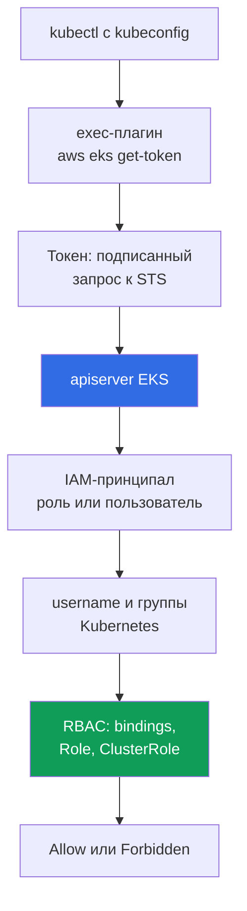
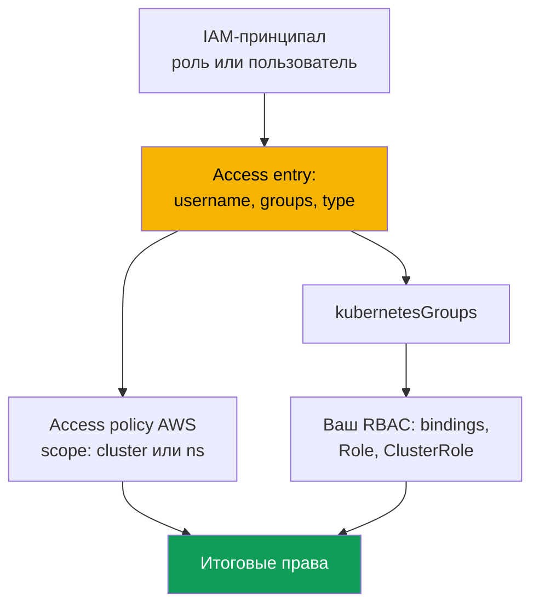

# Глава 5. Доступ к кластеру: IAM и RBAC, access entries, миграция с aws-auth

> **Что дальше.** Кластер создан (глава 4), и следующий вопрос - кто в него войдёт и с
> какими правами. RBAC вы знаете с CKA, но в EKS перед ним стоит второй слой:
> аутентификация через IAM. Глава про стык этих слоёв, про три режима
> `authenticationMode`, про legacy-механизм `aws-auth` ConfigMap и заменивший его API
> access entries, про access policies и про миграцию без потери доступа. Доступ подов к
> AWS API - другая задача: IRSA (глава 16) и Pod Identity (глава 17).

## 5.1. «kubeconfig верный, а kubectl отвечает Unauthorized»

В kubeadm доступ выдавался клиентским сертификатом: вы подписывали CSR своим CA, отдавали
инженеру kubeconfig, группы брались из поля `O`. Механизм понятный, с одной известной болью:
отзыв сертификата практически невозможен, списки отзыва apiserver не проверяет, и честный
способ один - перевыпустить CA, то есть доступ всем. Увольнение сотрудника было мини-проектом,
а не удалением строки. В EKS модель другая, и знакомство с ней идёт по двум сценариям.

**Первый.** Инженер запускает `aws eks update-kubeconfig`, команда отрабатывает без ошибок,
контекст переключается, а `kubectl get pods` отвечает `error: You must be logged in to the
server (Unauthorized)`. kubeconfig верный: endpoint, CA и плагин на месте. Не сходится
другое - IAM-принципал, под которым инженер работает, кластеру неизвестен, и ни одна политика
IAM этого не исправит.

**Второй, дороже.** Кто-то правит `aws-auth` ConfigMap, добавляя роль новой команде. В yaml
уезжает отступ, `mapRoles` перестаёт разбираться, и доступ теряют **все**, включая автора
правки. Изнутри уже ничего не сделать: чтобы починить ConfigMap, нужен доступ, а доступа нет.

Оба случая об одном: **в EKS аутентификация внешняя, авторизация внутренняя**. Это два
независимых слоя, и путаница между ними стоит дороже всего остального в главе.

## 5.2. IAM отвечает «кто ты», RBAC - «что тебе можно»

Аутентификация живёт в AWS: apiserver проверяет подписанный запрос STS и получает
IAM-принципала. Авторизация живёт в кластере: обычный RBAC решает, что субъекту позволено.
Между слоями стоит **отображение**: ARN превращается в `username` и группы Kubernetes.



`kubectl` видит в kubeconfig блок `exec`, вызывает `aws eks get-token` и получает не пароль,
не сертификат, а **подписанный запрос** к STS: по сети уходит подпись, а не секрет. Credentials
плагин берёт из обычной цепочки провайдеров AWS: `AWS_PROFILE`, переменные окружения, кэш SSO,
роль инстанса (глава 0.5). apiserver проверяет подпись и получает ARN принципала, затем ARN
отображается в `username` и `kubernetesGroups`, и решение принимает RBAC.

Отсюда правило, которое стоит запомнить дословно: **политика IAM с `AdministratorAccess` не
даёт никаких прав внутри кластера сама по себе**. Она позволяет вызывать API EKS (описать
кластер, поменять конфигурацию, удалить его целиком), но `kubectl get pods` отдаст
`Unauthorized`, пока принципал не отображён в кластер. Единственное исключение появилось
вместе с access entries: через API EKS можно ассоциировать управляемую access policy, и тогда
права выдаются средствами AWS, минуя ваши `Role` и `ClusterRole` (раздел 5.6). А поскольку
токен привязан к текущей сессии AWS, «утром работало, после обеда Unauthorized» обычно
означает истёкшую сессию SSO; серверную сторону видно в логах типа `authenticator` (глава 2).

## 5.3. Три режима authenticationMode

Режим определяет, откуда кластер берёт отображение принципалов. Задаётся при создании
(глава 4), меняется и у живого кластера.

| Режим | Источник отображения | Когда уместен |
|---|---|---|
| `CONFIG_MAP` | только `aws-auth` ConfigMap | legacy: старые кластеры до миграции |
| `API_AND_CONFIG_MAP` | и access entries, и `aws-auth` | переходный режим на время миграции |
| `API` | только access entries | целевой режим для новых кластеров |

Новые кластеры создаются сразу в `API`, старые переводятся в `API_AND_CONFIG_MAP`, а после
миграции в `API`. В переходном режиме, если принципал описан и в access entry, и в
`aws-auth`, побеждает **access entry**: запись можно завести заранее и проверить, не удаляя
строку из ConfigMap. Главное ограничение: **движение только в сторону API**, обратно нельзя.

```bash
aws eks describe-cluster --name demo --query 'cluster.accessConfig'
aws eks update-cluster-config --name demo --access-config authenticationMode=API_AND_CONFIG_MAP
aws eks update-cluster-config --name demo --access-config authenticationMode=API
```

## 5.4. aws-auth ConfigMap: почему от него уходят

Исторически отображение жило в объекте Kubernetes: ConfigMap `aws-auth` в `kube-system`. Поле
`mapRoles` отображает IAM-роли, `mapUsers` - IAM-пользователей.

```bash
kubectl -n kube-system get configmap aws-auth -o yaml
```

```yaml
data:
  mapRoles: |
    - rolearn: arn:aws:iam::111122223333:role/platform-admins
      username: platform-admin
      groups: [system:masters]
  mapUsers: |
    - userarn: arn:aws:iam::111122223333:user/ci-legacy
      username: ci-legacy
```

Механизм работает, но его проблемы ровно объясняют, зачем AWS сделал замену.

- **Одна ошибка в yaml - потеря доступа для всех.** `mapRoles` это строка для authenticator,
  валидации схемы нет, а чинить ConfigMap надо доступом, который выдаётся этим же ConfigMap.
- **Объект живёт в кластере, а не в конфигурации кластера.** Его нет в `describe-cluster`, он
  не управляется через API EKS, расходится с вашим IaC, а истории у него нет: кто добавил роль
  с `system:masters` и когда, не узнать. Вызовы API EKS видны в CloudTrail (глава 21).
- **Нельзя выдать права заранее и нет управляемых политик.** Опечатка в ARN обнаружится, когда
  человек не сможет войти, а ассоциировать access policy с записью в ConfigMap нельзя вообще.

## 5.5. Access entries: отображение как объект API EKS

Access entry живёт в конфигурации доступа кластера, а не внутри кластера, и связывает **один**
IAM-принципал (роль или пользователя) с `username` и списком `kubernetesGroups`; более чем в
одной записи принципал быть не может, и сменить его у записи нельзя.



У записи есть **тип**, и он определяется не правами, а тем, чем является принципал: `STANDARD`
по умолчанию для людей, CI и контроллеров, `EC2_LINUX` и `EC2_WINDOWS` для self-managed нод,
`FARGATE_LINUX` для Fargate, `HYBRID_LINUX` для гибридных нод, `EC2` для node class в Auto
Mode. Ключевое для эксплуатации: **для managed node groups и Fargate-профилей записи заводить
не нужно**, EKS создаёт их сам; для self-managed нод запись нужна, иначе нода не присоединится
(глава 45). `username` для `STANDARD` лучше не задавать: сервис подставит его сам.

```bash
aws eks create-access-entry --cluster-name demo \
  --principal-arn arn:aws:iam::111122223333:role/platform-admins \
  --kubernetes-groups platform-admins --type STANDARD

aws eks list-access-entries --cluster-name demo
aws eks describe-access-entry --cluster-name demo \
  --principal-arn arn:aws:iam::111122223333:role/platform-admins
```

Дальше `platform-admins` это обычная группа Kubernetes: заводите на неё `ClusterRoleBinding`, и
работает всё, что вы знаете с CKA. Access entry не заменяет RBAC, она даёт RBAC субъект.

**Запись создателя кластера.** Поле `bootstrapClusterCreatorAdminPermissions` по умолчанию
`true`: принципал, создавший кластер, получает права администратора внутри него. Это
спасательный люк и одновременно ловушка (глава 4): запись невидима в обычной работе, не описана
в коде, убрать её политиками IAM нельзя, а если кластер создан личной ролью инженера, права
остаются у роли и после его увольнения. Практика: кластер создаёт роль CI, флаг в `false`,
права администратора описаны явными access entries в коде.

## 5.6. Access policies: права в кластере через API EKS

Второй способ выдать права - ассоциировать с access entry управляемую **access policy**. Это
политики уровня Kubernetes, а не IAM: внутри verbs и resources, только разрешения, изменить или
создать свою нельзя. Работают в дополнение к RBAC: итоговые права принципала - сумма прав из
access policies и прав из привязок к его группам и `username`.

| Access policy | Что даёт | Типичный access scope |
|---|---|---|
| `AmazonEKSClusterAdminPolicy` | полный админ, аналог `cluster-admin` | `cluster` |
| `AmazonEKSAdminPolicy` | почти все действия с ресурсами | `namespace` |
| `AmazonEKSEditPolicy` | изменять нагрузки, без правки RBAC | `namespace` |
| `AmazonEKSViewPolicy` | чтение ресурсов, без секретов | `namespace` или `cluster` |
| `AmazonEKSAdminViewPolicy` | чтение всех ресурсов, включая секреты | `cluster` |

Access scope бывает двух типов: `cluster` (весь кластер) или `namespace` с перечислением, где
допускаются шаблоны вида `dev-*`. Менять scope можно, но существование namespace EKS не
проверяет: опечатка даёт молча пустые права.

```bash
aws eks associate-access-policy --cluster-name demo \
  --principal-arn arn:aws:iam::111122223333:role/team-payments \
  --policy-arn arn:aws:eks::aws:cluster-access-policy/AmazonEKSEditPolicy \
  --access-scope type=namespace,namespaces=payments,payments-stage

aws eks list-associated-access-policies --cluster-name demo \
  --principal-arn arn:aws:iam::111122223333:role/team-payments
```

**Готовые политики** берут, когда нужны стандартные роли: посмотреть, поработать в своём
namespace, разово получить админа. **Свои `Role` и `ClusterRole`** пишут, когда прав нужно
меньше или они специфичны: доступ к своим CRD, только `logs` и `exec`, запрет на секреты, -
тогда access entry задаёт `kubernetesGroups`, а права описывает ваш RBAC. Гибрид нормален:
`AmazonEKSViewPolicy` на кластер плюс своя группа с точечными правами в namespace. Ловушка при
отладке: `kubectl auth can-i --list` **не показывает** права из access policies, потому что они
не выражены объектами RBAC, - проверяйте `list-associated-access-policies`.

## 5.7. Миграция с aws-auth на access entries

| Свойство | `aws-auth` ConfigMap | Access entries |
|---|---|---|
| Где живёт | объект в `kube-system` | конфигурация кластера в API EKS |
| Валидация | нет, строка yaml внутри поля | на стороне API EKS |
| Ошибка ломает | доступ всех, включая себя | одну запись |
| История изменений | нет | CloudTrail (глава 21) |
| Управляемые политики AWS | нет | да, access policies |
| Управление из IaC | через провайдер Kubernetes | через провайдер AWS |

1. **Инвентаризация.** Снять `aws-auth` в файл: это и план миграции, и откат.
2. **Режим `API_AND_CONFIG_MAP`.** Access entries включаются, ConfigMap продолжает работать,
   ни один существующий доступ не ломается.
3. **Записи для людей и сервисов.** На каждую строку `mapRoles` и `mapUsers`, которую добавляли
   **вы**, создать access entry с тем же `username` и группами: за ними стоят привязки RBAC.
4. **Ноды не трогать.** Строки, созданные EKS для managed node groups и Fargate-профилей,
   остаются на совести сервиса, их удаление без эквивалентных записей ломает кластер. Для
   self-managed нод создаётся запись типа `EC2_LINUX` с тем же `username` и группами.
5. **Проверка до удаления.** Открыть **вторую** сессию под миграционной ролью и убедиться, что
   она работает, не закрывая первую. Затем удалять строки из ConfigMap по одной.
6. **Режим `API`** - когда своих записей в ConfigMap не осталось. Шаг необратимый.

```bash
aws eks update-kubeconfig --name demo --region eu-central-1 --alias demo-migrated
kubectl auth whoami
kubectl auth can-i get pods -n payments
kubectl auth can-i list secrets -n kube-system --as-group platform-admins
```

## 5.8. Типовые отказы: Unauthorized против Forbidden

| Признак | `Unauthorized` (401) | `Forbidden` (403) |
|---|---|---|
| Какой слой сломан | аутентификация, AWS | авторизация, RBAC |
| Что означает | кластер не понял, кто вы | понял, кто вы, но не разрешил |
| Типичные причины | не тот профиль, истёкший SSO, роль не зарегистрирована | нет привязки к группе, узкий scope политики |
| Где смотреть | `get-caller-identity`, `list-access-entries`, логи `authenticator` | `auth can-i`, привязки RBAC, ассоциации политик |
| Что правит | access entry или `aws-auth` | binding, `ClusterRole` или access policy |

```bash
aws sts get-caller-identity            # кто я с точки зрения AWS прямо сейчас
echo "$AWS_PROFILE"                    # тот ли профиль, который вы думаете
aws eks list-access-entries --cluster-name demo   # знает ли кластер этот ARN
kubectl auth whoami                    # кем меня видит apiserver: username и группы
```

`kubectl auth whoami` - самая быстрая проверка стыка: если команда отвечает, аутентификация
прошла и проблема в правах; если отвечает `Unauthorized`, до RBAC дело не дошло. Отдельные
грабли: `get-caller-identity` показывает роль, которую вы **приняли**, а в access entry должен
быть ARN самой роли, а не ARN assumed-role-сессии. Логи типа `authenticator` (глава 2) дают
серверную сторону, когда клиентские проверки не сходятся; сложные случаи - в главе 47.

## 5.9. Организация доступа для людей и для CI

- **Люди не получают постоянных прав.** Вход через IAM Identity Center: permission set
  соответствует IAM-роли, роль - access entry в кластере. Сессия временная, отзыв это снятие
  назначения, а не перевыпуск CA.
- **Группы Kubernetes, а не персональные записи.** Access entry заводится на роль команды, а не
  на человека: тридцать инженеров дают тридцать поводов забыть одну запись при увольнении.
- **Аудит забытых записей.** Список `aws eks list-access-entries` регулярно сверяют с
  актуальными ролями: запись, чей `principal-arn` ведёт на удалённую или давно не принимаемую
  роль, - это забытый доступ на удаление, а принятия ролей видны в CloudTrail (глава 21).
- **Break-glass отдельно.** Одна роль с `AmazonEKSClusterAdminPolicy` на scope `cluster`,
  которую в обычной работе никто не принимает: жёсткая trust policy, MFA, алерт на принятие
  в CloudTrail (глава 21). Это ваш выход из ситуации раздела 5.1.
- **CI отдельной ролью.** Доверие к конкретному репозиторию и ветке (глава 0.2), права уровня
  `AmazonEKSEditPolicy` в своих namespace и без права менять конфигурацию доступа кластера,
  иначе пайплайн выдаст права сам себе. Сами access entries и ассоциации политик - обычные
  ресурсы IaC рядом с кластером (глава 4). Изоляция команд друг от друга - глава 22.

## 5.10. Как это применяют в продакшене

- **Новые кластеры сразу в режиме `API`**, `bootstrapClusterCreatorAdminPermissions` в `false`,
  доступ администратора описан явными access entries в коде.
- **Люди входят через IAM Identity Center**: permission set к роли, роль к access entry, права
  к группе Kubernetes; персональных записей нет, break-glass роль одна и под алертом.
- **CI своей ролью** с правами уровня namespace и без права менять конфигурацию доступа, логи
  типа `authenticator` включены, а `aws-auth` на новых кластерах не существует в принципе.

## 5.11. Мини-глоссарий

- **Access entry** - запись в конфигурации доступа кластера, связывающая один IAM-принципал с
  `username` и `kubernetesGroups`; тип `STANDARD` для людей и сервисов, `EC2_LINUX`,
  `EC2_WINDOWS`, `FARGATE_LINUX`, `HYBRID_LINUX`, `EC2` для нод.
- **Access policy** - управляемая AWS политика прав уровня Kubernetes, ассоциируемая с access
  entry; содержит verbs и resources, а не IAM-права, и не редактируется. **Access scope** - её
  область действия: `cluster` или `namespace` со списком.
- **`authenticationMode`** - режим аутентификации: `CONFIG_MAP`, `API_AND_CONFIG_MAP`, `API`;
  движение только в сторону `API`. **`aws-auth` ConfigMap** - legacy-механизм отображения через
  объект в `kube-system` с полями `mapRoles` и `mapUsers`.
- **`bootstrapClusterCreatorAdminPermissions`** - поле при создании кластера: при `true` (по
  умолчанию) создатель получает права администратора внутри кластера.

## 5.12. Итоги главы

- Аутентификация внешняя (IAM и STS), авторизация внутренняя (RBAC), и `AdministratorAccess` в
  IAM не даёт прав в кластере сам по себе. Цепочка: `kubectl`, плагин `aws eks get-token`,
  подписанный запрос STS, проверка подписи, отображение ARN в `username` и группы, RBAC.
- Режимов три: `CONFIG_MAP`, `API_AND_CONFIG_MAP`, `API`. Целевой - `API`, переход в его
  сторону необратим, а в переходном режиме access entry имеет приоритет над `aws-auth`,
  который опасен структурно: нет валидации и истории, ошибка в yaml отключает доступ всем,
  включая автора правки, и починить объект изнутри уже нельзя.
- Access entries живут в API EKS, валидируются, видны в CloudTrail и описываются кодом. Права
  выдаются через `kubernetesGroups` плюс ваш RBAC, через access policies со scope `cluster` или
  `namespace`, либо и так и так. Миграция: `API_AND_CONFIG_MAP`, записи для своих строк, записи
  нод не трогать, проверка из второй сессии, удаление строк, режим `API`.
- `Unauthorized` это аутентификация, `Forbidden` это авторизация, и диагностика начинается с
  `aws sts get-caller-identity` и `kubectl auth whoami`, а не с чтения манифестов RBAC.

## 5.13. Как это пригодится в реальной работе

Задача «отозвать доступ уволенного инженера» занимает минуты, если доступ построен на временных
ролях и группах, и неопределённое время, если у человека была персональная запись, а кластер он
же и создавал. Вопрос «кто может удалить namespace в проде» либо отвечается перечислением
записей и привязок, либо не отвечается вообще. А сценарий из первого раздела перестаёт быть
катастрофой тогда, когда есть break-glass роль и режим `API`.

## 5.14. Вопросы для самопроверки

1. Почему `AdministratorAccess` в IAM не даёт права запускать `kubectl get pods` в кластере?
2. Что именно передаётся apiserver в качестве токена и почему это не пароль?
3. Чем отличаются `Unauthorized` и `Forbidden` и с чего вы начнёте диагностику каждого?
4. Какие три значения принимает `authenticationMode` и какие переходы возможны?
5. Один и тот же ARN есть и в `aws-auth`, и в access entry. Что победит и в каком режиме?
6. Что задаёт тип access entry и для каких нод записи создаются автоматически?
7. Когда вы возьмёте `AmazonEKSEditPolicy`, а когда напишете свой `ClusterRole`?
8. Почему `kubectl auth can-i --list` может не показать реально имеющиеся права?
9. Опишите порядок миграции с `aws-auth` так, чтобы в любой момент был путь назад.

## Практика

Лабы у главы пока нет, но содержание проверяется на любом кластере. Начните с инвентаризации:
`aws eks describe-cluster --name <cluster> --query 'cluster.accessConfig'` покажет режим и флаг
прав создателя, `aws eks list-access-entries --cluster-name <cluster>` и
`aws eks describe-access-entry` с `--principal-arn` - тип, `username` и группы записи. Для
записей типа `STANDARD` запустите `aws eks list-associated-access-policies` и сверьте scope.

Дальше сверьте два слоя: соберите группы из access entries и поищите их в
`kubectl get clusterrolebindings,rolebindings -A -o wide`. Группы без привязок и без access
policies ничего не дают, а привязки на группы, которых нет ни в одной записи, - мёртвый RBAC.
Отдельно ищите забытые записи: пройдите `list-access-entries` и для каждого `principal-arn`
проверьте `aws iam get-role`, - запись на несуществующую роль это мёртвый доступ на удаление.
Проверьте себя через `kubectl auth whoami` и `kubectl auth can-i --list`, помня, что права из
access policies в этом выводе не появятся. Если кластер ещё в режиме `CONFIG_MAP` или
`API_AND_CONFIG_MAP`, снимите `kubectl -n kube-system get configmap aws-auth -o yaml` в файл.
Отдельно потренируйте отказ: заведите роль без access entry, попробуйте войти и найдите её в
логах типа `authenticator` (глава 2).

---
[Оглавление](../README_RU.md) · [Глава 4](../04/ru.md) · [Глава 6](../06/ru.md)
