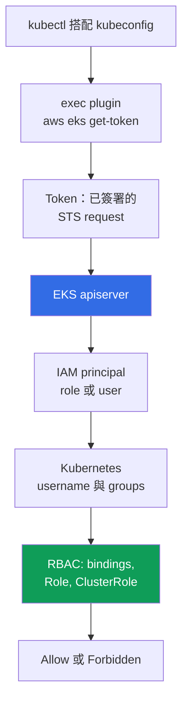
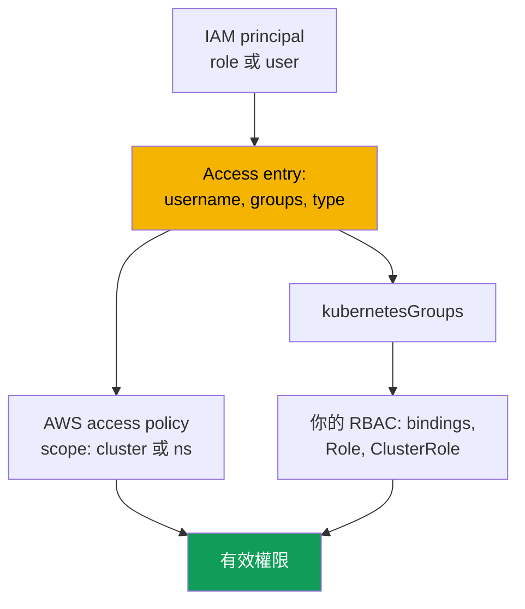

[Русская версия](ru.md) · [Eng version](en.md) · [Versión en español](es.md) · [Version française](fr.md) · [Deutsche Version](de.md) · [ქართული ვერსია](ge.md) · [日本語版](jp.md)
# 第 5 章. 叢集存取：IAM 與 RBAC、access entries、從 aws-auth 遷移

> **接下來。** 叢集已建立（第 4 章），下一個問題是誰能進入，以及具有哪些權限。你從 CKA 已熟悉 RBAC，但在 EKS 中它前面還有另一層：IAM authentication。本章說明兩層的交會處、三種 `authenticationMode` 模式、legacy `aws-auth` ConfigMap 機制及取代它的 API access entries、access policies，以及不失去存取權的遷移。Pod 對 AWS API 的存取是另一項工作：IRSA（第 16 章）與 Pod Identity（第 17 章）。

## 5.1. 「kubeconfig 正確，但 kubectl 回傳 Unauthorized」

在 kubeadm 中，存取是用 client certificate 授與：你用自己的 CA 簽署 CSR，交給工程師 kubeconfig，群組取自 `O` field。這個機制很清楚，卻有一個眾所周知的痛點：幾乎無法撤銷 certificate，apiserver 不會檢查 revocation lists，唯一誠實的做法是重新簽發 CA，也就是變更所有人的存取。員工離職成了小型專案，而不是刪除一行設定。EKS 採用不同模型，你會在兩種情境遇到它。

**第一種。** 工程師執行 `aws eks update-kubeconfig`，command 沒有錯誤地完成，context 切換了，但 `kubectl get pods` 回傳 `error: You must be logged in to the server (Unauthorized)`。kubeconfig 是正確的：endpoint、CA 與 plugin 都到位。問題在於別處：工程師目前使用的 IAM principal 對叢集是未知的，沒有任何 IAM policy 能修正這一點。

**第二種，而且代價更高。** 有人編輯 `aws-auth` ConfigMap，為新團隊加入一個 role。yaml 的 indentation 偏移，`mapRoles` 無法再被解析，**所有人**都失去存取權，包括修改者自己。無法從內部修好：修復 ConfigMap 需要存取權，但存取權已不存在。

兩種情況原因相同：**在 EKS 中，authentication 是外部的，而 authorization 是內部的**。它們是兩個獨立層，混淆它們會付出比本章其他問題更高的代價。

## 5.2. IAM 回答「你是誰」，RBAC 回答「你能做什麼」

Authentication 位於 AWS：apiserver 驗證已簽署的 STS request 並取得 IAM principal。Authorization 位於叢集：一般的 RBAC 決定 subject 被允許做什麼。兩層中間存在 **mapping**：ARN 轉換為 Kubernetes `username` 與 groups。



`kubectl` 看見 kubeconfig 中的 `exec` block，呼叫 `aws eks get-token`，取得的不是 password 或 certificate，而是一個對 STS 的**已簽署 request**：經由網路傳送的是 signature，而不是 secret。Plugin 從正常 AWS provider chain 取得 credentials：`AWS_PROFILE`、environment variables、SSO cache 與 instance role（第 0.5 章）。apiserver 驗證 signature 並取得 principal ARN；ARN 接著被 map 為 `username` 與 `kubernetesGroups`，由 RBAC 作出決定。

有一條必須逐字記住的規則：帶有 `AdministratorAccess` 的 IAM policy **本身不授與叢集內任何權限**。它允許呼叫 EKS API（描述叢集、變更 configuration、將它完整刪除），但在 principal 被 map 到叢集前，`kubectl get pods` 會回傳 `Unauthorized`。唯一例外隨 access entries 出現：EKS API 可以關聯 managed access policy，之後 AWS 會授與權限，略過你的 `Role` 與 `ClusterRole`（第 5.6 節）。Token 綁定目前的 AWS session，因此「早上能用，午餐後 Unauthorized」通常表示 SSO session 已過期；server 端可在 `authenticator` type logs 中查看（第 2 章）。

## 5.3. 三種 authenticationMode 模式

此模式決定叢集從哪裡取得 principal mappings。它在建立時設定（第 4 章），也可以在 live cluster 上變更。

| 模式 | Mapping 來源 | 適用時機 |
|---|---|---|
| `CONFIG_MAP` | 僅 `aws-auth` ConfigMap | legacy：遷移前的舊叢集 |
| `API_AND_CONFIG_MAP` | access entries 與 `aws-auth` 兩者 | 遷移期間的過渡模式 |
| `API` | 僅 access entries | 新叢集的目標模式 |

新叢集直接以 `API` 建立；舊叢集先移至 `API_AND_CONFIG_MAP`，再移至 `API`。在過渡模式中，若 principal 同時定義於 access entry 與 `aws-auth`，由 **access entry** 優先：你可以預先建立並測試 entry，而不用刪除 ConfigMap 行。關鍵限制是只能**朝 API 方向**移動，無法反轉。

```bash
aws eks describe-cluster --name demo --query 'cluster.accessConfig'
aws eks update-cluster-config --name demo --access-config authenticationMode=API_AND_CONFIG_MAP
aws eks update-cluster-config --name demo --access-config authenticationMode=API
```

## 5.4. aws-auth ConfigMap：它為何正被淘汰

歷史上，mapping 位於 Kubernetes object：`kube-system` 中的 `aws-auth` ConfigMap。`mapRoles` field 映射 IAM roles，`mapUsers` 映射 IAM users。

```bash
kubectl -n kube-system get configmap aws-auth -o yaml
```

```yaml
data:
  mapRoles: |
    - rolearn: arn:aws:iam::111122223333:role/platform-admins
      username: platform-admin
      groups: [system:masters]
  mapUsers: |
    - userarn: arn:aws:iam::111122223333:user/ci-legacy
      username: ci-legacy
```

這個機制可用，但它的問題恰好說明了 AWS 為何建立替代方案。

- **一個 yaml 錯誤會讓所有人失去存取權。** `mapRoles` 對 authenticator 而言是一個 string，沒有 schema validation，而修復 ConfigMap 需要的正是由同一 ConfigMap 授與的存取權。
- **Object 位於叢集內，而非 cluster configuration。** 它不在 `describe-cluster` 中，無法透過 EKS API 管理，會和你的 IaC 漂移，且沒有 history：你無法知道誰何時加入具有 `system:masters` 的 role。EKS API calls 會出現在 CloudTrail（第 21 章）。
- **無法預先授權，也沒有 managed policies。** ARN 的 typo 只會在某人無法登入時才被發現，也完全無法將 access policy 關聯至 ConfigMap entry。

## 5.5. Access entries：作為 EKS API object 的 mapping

Access entry 位於 cluster access configuration，而不在叢集裡。它將**一個** IAM principal（role 或 user）與 `username` 及 `kubernetesGroups` 清單關聯；principal 不能存在於超過一個 entry，也不能在既有 entry 上更換。



Entry 具有 **type**，它不是由 permissions 而是由 principal 的身分決定：`STANDARD` 預設用於人員、CI 與 controllers；`EC2_LINUX` 與 `EC2_WINDOWS` 用於 self-managed nodes；`FARGATE_LINUX` 用於 Fargate；`HYBRID_LINUX` 用於 hybrid nodes；`EC2` 用於 Auto Mode 中的 node class。從操作角度看，關鍵是**不需要為 managed node groups 與 Fargate profiles 建立 entries**：EKS 會自行建立。Self-managed node 需要 entry，否則無法加入叢集（第 45 章）。最好不要為 `STANDARD` 設定 `username`，service 會提供它。

```bash
aws eks create-access-entry --cluster-name demo \
  --principal-arn arn:aws:iam::111122223333:role/platform-admins \
  --kubernetes-groups platform-admins --type STANDARD

aws eks list-access-entries --cluster-name demo
aws eks describe-access-entry --cluster-name demo \
  --principal-arn arn:aws:iam::111122223333:role/platform-admins
```

之後，`platform-admins` 是普通的 Kubernetes group：為它建立 `ClusterRoleBinding`，你從 CKA 所知道的一切都會運作。Access entry 不會取代 RBAC；它提供一個 RBAC subject。

**Cluster creator entry。** `bootstrapClusterCreatorAdminPermissions` 預設為 `true`：建立 cluster 的 principal 在其中取得 administrator permissions。它既是 escape hatch，也是陷阱（第 4 章）：entry 在一般工作中不可見、未在 code 中描述、不能用 IAM policies 移除；若 cluster 是用工程師的個人 role 建立，即使工程師離職，該 role 仍保留權限。實務作法：CI role 建立 cluster，flag 為 `false`，administrator permissions 以 code 中的 explicit access entries 描述。

## 5.6. Access policies：透過 EKS API 的 cluster 權限

第二種授與權限的方法，是將 managed **access policy** 關聯至 access entry。這些是 Kubernetes-level policies，而不是 IAM policies：內部包含 verbs 與 resources，只授與 permissions，無法由你修改或建立。它們補充 RBAC：principal 的 effective rights 是 access policies 權限，加上其 groups 與 `username` bindings 權限的總和。

| Access policy | 授與內容 | 典型 access scope |
|---|---|---|
| `AmazonEKSClusterAdminPolicy` | 完整 administrator，等同 `cluster-admin` | `cluster` |
| `AmazonEKSAdminPolicy` | 幾乎所有 resource actions | `namespace` |
| `AmazonEKSEditPolicy` | 修改 workloads，不編輯 RBAC | `namespace` |
| `AmazonEKSViewPolicy` | 讀取 resources，不含 secrets | `namespace` 或 `cluster` |
| `AmazonEKSAdminViewPolicy` | 讀取所有 resources，包含 secrets | `cluster` |

Access scope 有兩種形式：整個叢集的 `cluster`，或具清單的 `namespace`，後者支援 `dev-*` 這類 patterns。你可變更 scope，但 EKS 不會驗證 namespace 是否存在：typo 會無聲地得到空權限。

```bash
aws eks associate-access-policy --cluster-name demo \
  --principal-arn arn:aws:iam::111122223333:role/team-payments \
  --policy-arn arn:aws:eks::aws:cluster-access-policy/AmazonEKSEditPolicy \
  --access-scope type=namespace,namespaces=payments,payments-stage

aws eks list-associated-access-policies --cluster-name demo \
  --principal-arn arn:aws:iam::111122223333:role/team-payments
```

對標準角色使用**現成 policies**：檢視、在自己的 namespace 工作，或一次取得 administrator access。當需要較少或特定權限時，撰寫自己的 `Role` 與 `ClusterRole`：例如存取自己的 CRDs、僅有 `logs` 與 `exec`，或不含 secrets。此時 access entry 設定 `kubernetesGroups`，由你的 RBAC 描述權限。Hybrid 使用很正常：叢集使用 `AmazonEKSViewPolicy`，另用自訂 group 提供精準 namespace 權限。Debugging 的陷阱是 `kubectl auth can-i --list` **不會顯示** access-policy 權限，因為它們不以 RBAC objects 表示；請改查 `list-associated-access-policies`。

## 5.7. 從 aws-auth 遷移到 access entries

| 屬性 | `aws-auth` ConfigMap | Access entries |
|---|---|---|
| 位於何處 | `kube-system` 中的 object | EKS API 中的 cluster configuration |
| Validation | 無，field 內的 yaml string | 由 EKS API 執行 |
| 錯誤會破壞 | 所有人的存取權，包含自己 | 一個 entry |
| Change history | 無 | CloudTrail（第 21 章） |
| AWS managed policies | 無 | 有，access policies |
| IaC management | 透過 Kubernetes provider | 透過 AWS provider |

1. **Inventory。** 將 `aws-auth` 儲存為檔案：它同時是 migration plan 與 rollback。
2. **`API_AND_CONFIG_MAP` 模式。** Access entries 會啟用，同時 ConfigMap 繼續運作；既有存取不會中斷。
3. **人員與 services 的 entries。** 對每一行由**你**新增的 `mapRoles` 與 `mapUsers`，以相同 `username` 與 groups 建立 access entry：它們背後有 RBAC bindings。
4. **不要碰 nodes。** EKS 為 managed node groups 與 Fargate profiles 建立的行仍由 service 負責；未建立等效 entries 就刪除它們會破壞 cluster。對 self-managed nodes，建立具有相同 `username` 與 groups 的 `EC2_LINUX` entry。
5. **刪除前驗證。** 使用 migration role 開啟**第二個** session，確認其正常運作且不要關閉第一個。然後每次刪除一行 ConfigMap。
6. **`API` 模式**用於 ConfigMap 中不再有你自己的 entries 時。這一步不可逆。

```bash
aws eks update-kubeconfig --name demo --region eu-central-1 --alias demo-migrated
kubectl auth whoami
kubectl auth can-i get pods -n payments
kubectl auth can-i list secrets -n kube-system --as-group platform-admins
```
## 5.8. 常見拒絕：Unauthorized 與 Forbidden

| 徵兆 | `Unauthorized` (401) | `Forbidden` (403) |
|---|---|---|
| 失敗的層 | authentication、AWS | authorization、RBAC |
| 意義 | cluster 不知道你是誰 | 它知道你是誰，但不允許動作 |
| 典型原因 | 錯誤 profile、過期 SSO、未註冊 role | 沒有 group binding、policy scope 太窄 |
| 查看位置 | `get-caller-identity`、`list-access-entries`、`authenticator` logs | `auth can-i`、RBAC bindings、policy associations |
| 修復方式 | access entry 或 `aws-auth` | binding、`ClusterRole` 或 access policy |

```bash
aws sts get-caller-identity            # AWS 此刻將我視為誰
echo "$AWS_PROFILE"                    # 這是你預期的 profile 嗎
aws eks list-access-entries --cluster-name demo   # cluster 知道此 ARN 嗎
kubectl auth whoami                    # apiserver 如何看我：username 與 groups
```

`kubectl auth whoami` 是檢查邊界最快的方法：若 command 有回應，authentication 已通過而問題在 permissions；若回傳 `Unauthorized`，根本尚未到 RBAC。另一個陷阱是 `get-caller-identity` 顯示你**assume**的 role，而 access entry 必須使用 role 本身的 ARN，不是 assumed-role session 的 ARN。當 client checks 彼此不符時，`authenticator` type logs（第 2 章）提供 server 端資訊；複雜案例見第 47 章。

## 5.9. 為人員與 CI 組織存取權

- **人員不會取得永久權限。** 他們經由 IAM Identity Center 進入：permission set 對應至 IAM role，role 對應至 cluster access entry。Session 是暫時的；撤銷是移除 assignment，而不是重新簽發 CA。
- **使用 Kubernetes groups，不用個人 entries。** 為 team role 建立 access entry，而非個人：三十位工程師意味著 offboarding 時有三十次機會忘記一個 entry。
- **Audit 遺忘的 entries。** 定期將 `aws eks list-access-entries` 與目前 roles 比對：其 `principal-arn` 指向已刪除或長期未被 assume role 的 entry，是被遺忘的 deletion access；role assumptions 則出現在 CloudTrail（第 21 章）。
- **Break-glass 分開處理。** 一個在 `cluster` scope 具有 `AmazonEKSClusterAdminPolicy` 的 role，正常工作中無人 assume：嚴格的 trust policy、MFA，並在 CloudTrail 中對 assume 設定 alert（第 21 章）。它是你離開第 5.1 節情況的出口。
- **CI 使用獨立 role。** Trust 限於特定 repository 與 branch（第 0.2 章），其 namespaces 中的 permissions 為 `AmazonEKSEditPolicy` 等級，而且不能變更 cluster access configuration，否則 pipeline 會自行授權。Access entries 與 policy associations 本身是 cluster 旁的普通 IaC resources（第 4 章）。團隊隔離見第 22 章。

## 5.10. 如何用於 production

- **新 clusters 直接以 `API` 模式開始**，`bootstrapClusterCreatorAdminPermissions` 設為 `false`，administrator access 以 code 中的 explicit access entries 描述。
- **人員經由 IAM Identity Center 進入**：permission set 到 role，role 到 access entry，權限到 Kubernetes group；沒有 personal entries，並有一個受 alert 監控的 break-glass role。
- **CI 有專用 role**，具有 namespace-level permissions，沒有變更 access configuration 的權限。`authenticator` type logs 已啟用，而新 clusters 根本沒有 `aws-auth`。

## 5.11. 迷你詞彙表

- **Access entry**：cluster access configuration 中的一筆記錄，將一個 IAM principal 與 `username` 及 `kubernetesGroups` 關聯；`STANDARD` 用於人員與 services，而 `EC2_LINUX`、`EC2_WINDOWS`、`FARGATE_LINUX`、`HYBRID_LINUX` 與 `EC2` 用於 nodes。
- **Access policy**：關聯至 access entry 的 AWS-managed Kubernetes-level permissions policy；它包含 verbs 與 resources，而非 IAM permissions，且不能編輯。**Access scope** 是它的範圍：`cluster` 或具有清單的 `namespace`。
- **`authenticationMode`**：authentication mode：`CONFIG_MAP`、`API_AND_CONFIG_MAP` 或 `API`；只能朝 `API` 移動。**`aws-auth` ConfigMap** 是 legacy mapping mechanism，透過 `kube-system` 中具 `mapRoles` 與 `mapUsers` fields 的 object 運作。
- **`bootstrapClusterCreatorAdminPermissions`**：cluster creation field；值為 `true`（預設）時，creator 在 cluster 內取得 administrator permissions。

## 5.12. 本章小結

- Authentication 是外部的（IAM 與 STS），authorization 是內部的（RBAC），IAM 的 `AdministratorAccess` 本身不會授與 cluster 權限。鏈路是 `kubectl`、`aws eks get-token` plugin、已簽署 STS request、signature verification、ARN 映射為 `username` 與 groups，最後是 RBAC。
- 有三種模式：`CONFIG_MAP`、`API_AND_CONFIG_MAP` 與 `API`。目標是 `API`，往它的過渡不可逆；在過渡模式中 access entry 優先於 `aws-auth`。後者在結構上不安全：沒有 validation 或 history，一個 yaml error 會停用所有人的 access，包含變更作者，且 object 之後無法從內部修正。
- Access entries 位於 EKS API 中，會被驗證、可在 CloudTrail 看見，並在 code 中描述。Permissions 透過 `kubernetesGroups` 加上你的 RBAC、具有 `cluster` 或 `namespace` scope 的 access policies，或兩者一起授與。遷移順序是 `API_AND_CONFIG_MAP`、為自己的行建立 entries、不碰 node entries、從第二個 session 驗證、移除行，然後採用 `API` 模式。
- `Unauthorized` 意味著 authentication，`Forbidden` 意味著 authorization；診斷從 `aws sts get-caller-identity` 與 `kubectl auth whoami` 開始，而不是閱讀 RBAC manifests。

## 5.13. 這如何協助實際工作

在以 temporary roles 與 groups 建構 access 時，「撤銷離職工程師的 access」只需幾分鐘；若此人有 personal entry 且曾建立 cluster，則需要不確定的時間。「誰能在 production 刪除 namespace」這個問題，要麼能透過列出 entries 與 bindings 回答，要麼根本無法回答。當存在 break-glass role 與 `API` 模式時，第一節的情境不再是災難。

## 5.14. 自我檢查問題

1. 為何 IAM 中的 `AdministratorAccess` 不會授與在 cluster 中執行 `kubectl get pods` 的權限？
2. 究竟以 token 身分傳送給 apiserver 的是什麼，為何它不是 password？
3. `Unauthorized` 與 `Forbidden` 有何不同，分別要從哪裡開始診斷？
4. `authenticationMode` 可取哪三個值，哪些 transitions 可行？
5. 同一 ARN 同時位於 `aws-auth` 與 access entry。何者優先，在哪種模式？
6. 什麼決定 access entry type，哪些 nodes 的 entries 會自動建立？
7. 何時使用 `AmazonEKSEditPolicy`，何時撰寫自己的 `ClusterRole`？
8. 為何 `kubectl auth can-i --list` 可能不顯示實際存在的 permissions？
9. 說明從 `aws-auth` 遷移的順序，讓每一點都保有復原路徑。

## 實作

本主題的 labs 是[lab 102 - cluster access: IAM 與 RBAC、access entries 及 access policies](../../labs/102/README_TW.MD)與[lab 122 - AWS Backup for EKS：composite recovery point、namespace recovery](../../labs/122/README_TW.MD)。此外，可在任意 cluster 上檢查內容。先進行 inventory：`aws eks describe-cluster --name <cluster> --query 'cluster.accessConfig'` 顯示模式與 creator flag；`aws eks list-access-entries --cluster-name <cluster>` 及搭配 `--principal-arn` 的 `aws eks describe-access-entry` 顯示 entry 的 type、`username` 與 groups。對 `STANDARD` entries，執行 `aws eks list-associated-access-policies` 並檢查 scope。

然後比較兩層：從 access entries 收集 groups，並在 `kubectl get clusterrolebindings,rolebindings -A -o wide` 尋找它們。沒有 bindings 與 access policies 的 groups 不授與任何內容，而任何 entry 都不存在的 groups 的 bindings 是死 RBAC。還要尋找遺忘的 entries：逐一查看 `list-access-entries`，對每個 `principal-arn` 執行 `aws iam get-role`；不存在 role 的 entry 是死 deletion access。使用 `kubectl auth whoami` 與 `kubectl auth can-i --list` 檢查自己，並記住 access-policy 權限不會出現在該 output。若 cluster 仍在 `CONFIG_MAP` 或 `API_AND_CONFIG_MAP` 模式，將 `kubectl -n kube-system get configmap aws-auth -o yaml` 儲存至檔案。另行練習拒絕：建立沒有 access entry 的 role，嘗試登入並在 `authenticator` type logs 找到它（第 2 章）。

---
[目錄](../README_TW.md) · [第 4 章](../04/tw.md) · [第 6 章](../06/tw.md)