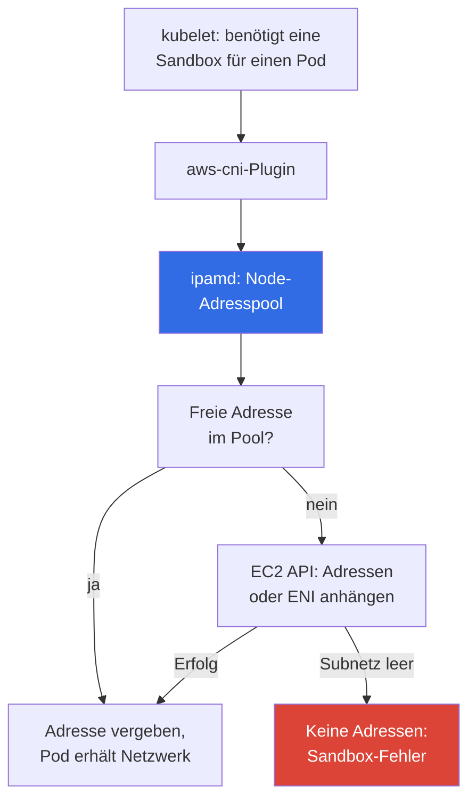
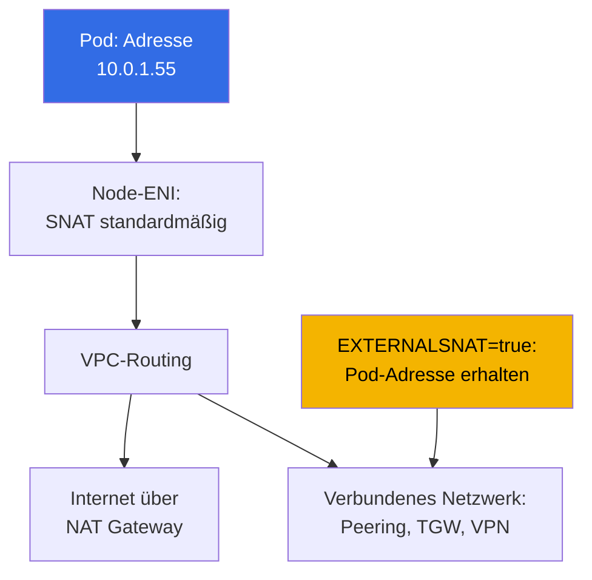

[Русская версия](ru.md) · [Eng version](en.md) · [Versión en español](es.md) · [Version française](fr.md) · [ქართული ვერსია](ge.md) · [繁體中文版](tw.md) · [日本語版](jp.md)
# Kapitel 6. Clusternetzwerk: VPC CNI, ENI und IP-Adressen, CIDR-Planung

> **Was kommt als Nächstes.** Der Cluster ist erstellt (Kapitel 4), der Zugriff konfiguriert (Kapitel 5), und Pods starten.
> Dann wird klar, dass das Networking in EKS nicht wie bei kubeadm mit einem Overlay-Plugin funktioniert: Pod-Adressen
> sind real, stammen aus einem VPC-Subnetz und sind endlich. Dieses Kapitel erklärt, wie VPC CNI diese
> Adressen vergibt, woher das Pod-Limit pro Node kommt, wie der Warm-Adresspool das Subnetz verbraucht
> und wie CIDR berechnet wird, bevor Pods in `ContainerCreating` hängen bleiben. Lösungen für
> Adresserschöpfung finden sich in Kapitel 7, alternative CNIs in Kapitel 8.

## 6.1. „Ein Pod startet nicht, obwohl auf dem Node CPU und Speicher frei sind“

Der Cluster läuft seit einem halben Jahr, die Nodes liegen bei 30 Prozent CPU-Auslastung. Ein Release wird ausgerollt, und einige Pods
bleiben in `ContainerCreating`. In den Events stehen weder `ImagePullBackOff` noch `FailedScheduling`, sondern die
Unmöglichkeit, eine Adresse zuzuweisen:

```
Warning  FailedCreatePodSandBox  kubelet  Failed to create pod sandbox:
  plugin type="aws-cni" failed (add): add cmd: failed to assign an IP address to container
```

Auf dem Node ist Kapazität vorhanden, und der Scheduler liegt richtig. Im Subnetz sind keine freien IP-Adressen verfügbar: Die Prüfung zeigt
`0` in der Spalte `AvailableIpAddressCount`. Das Subnetz wurde als `/24` zugewiesen, mit 251 verfügbaren Adressen,
„dreißig Nodes und hundert Pods, mit Reserve für Jahre“. Dann kam Karpenter dazu, Sidecar-Container und CI-Jobs
wurden ergänzt. Das Subnetz lässt sich nicht erweitern: **Ein Subnetz-CIDR ändert sich nach dem Erstellen nicht**. Sie können
neue Subnetze hinzufügen oder der VPC ein Secondary CIDR geben (Kapitel 7), doch das vorhandene `/24` bleibt `/24`.

Dieses Problem gab es in kubeadm nicht: `--pod-network-cidr 10.244.0.0/16` war lediglich eine Zahl in der
Konfiguration, Pod-Adressen waren virtuell und belegten im realen Netzwerk nichts. In EKS verbraucht jeder Pod eine
**reale private VPC-Adresse**, dieselbe Ressource, aus der Instanzen, Load Balancer, RDS und VPC Endpoints Adressen beziehen.
Die Adressplanung ist keine interne Clusterangelegenheit mehr.

## 6.2. Kernaussage: Ein Pod ist ein vollwertiger VPC-Teilnehmer

Amazon VPC CNI weist einem Pod eine **sekundäre private IPv4-Adresse** aus demselben Subnetz zu, in dem
sein Node läuft. Es ist weder eine Adresse aus einem erfundenen Bereich noch eine Adresse hinter einem Tunnel: Aus Sicht der
VPC sieht ein Pod wie ein weiteres Netzwerkinterface aus. Daraus folgt eine Schlussfolgerung, die es auszusprechen gilt:
**Zwischen Pods gibt es weder Kapselung noch NAT**, und der Traffic bewegt sich innerhalb der VPC ohne VXLAN
und ohne reduziertes MTU.

| Eigenschaft | Overlay (flannel VXLAN, Calico IPIP) | VPC CNI |
|---|---|---|
| Pod-Adresse | aus einem virtuellen Cluster-CIDR | reale Adresse eines VPC-Subnetzes |
| Pod-Adressen außerhalb des Clusters | nicht routbar | in der gesamten VPC routbar |
| Kapselung | ja, mit Overhead und MTU-Auswirkung | nein |
| Anzahl verfügbarer Adressen | praktisch beliebig viele | so viele, wie im Subnetz vorhanden sind |
| Security Groups für Pod-Traffic | nicht anwendbar | anwendbar |
| VPC Flow Logs für Pod-Traffic | sehen nur Node-Adressen | sehen Pod-Adressen |
| Adressplanung | Angelegenheit des Clusters | Teil des Netzwerkplans der Organisation |

**Ein Pod ist aus der VPC und verbundenen Netzwerken direkt erreichbar**: Eine Instanz außerhalb des Clusters, eine Ressource in einer peered VPC
oder ein Rechner hinter Direct Connect kann direkt eine Verbindung zur Pod-Adresse öffnen. Deshalb ist „der Pod ist
im Cluster verborgen“ kein Sicherheitsargument mehr. **Security Groups und NACLs gelten für Pod-Traffic**,
doch die Granularität ist grob: Eine Regel gilt für den gesamten Node statt für einen Pod (die genaue Zuordnung behandelt Kapitel
19, NetworkPolicy Kapitel 30). **Die Kehrseite steht in Abschnitt 6.1**: Die Anzahl der Adressen ist endlich.

## 6.3. So funktioniert es: aws-node, ipamd und sekundäre Adressen

VPC CNI läuft als DaemonSet `aws-node` in `kube-system`. Es enthält zwei Schlüsselkomponenten:
**ipamd**, den Daemon zur Verwaltung des Node-Adresspools, der mit der EC2 API kommuniziert, und das **CNI-Plugin**, das
kubelet aufruft.



Das entscheidende Detail ist, dass **ipamd beim Erstellen eines Pods nicht die EC2 API aufruft**. Es gibt eine Adresse aus einem
vorab angelegten Pool aus, da das Anhängen einer Adresse und besonders das Erstellen eines ENI Sekunden dauert und dies
im kritischen Startpfad jeden Workload verzögern würde. Deshalb hält ipamd gemäß den Tuning-Variablen (Abschnitt 6.5)
eine Reserve freier Adressen vor und hängt, wenn die Reserve knapp wird, weitere an und erstellt bei Bedarf ein
**neues ENI** im selben Subnetz und derselben AZ.

Daraus ergeben sich zwei nicht offensichtliche Fakten. Belegte Subnetz-Adressen **entsprechen nicht der Anzahl laufender Pods**,
denn die Differenz gehört zum Warm-Pool. Außerdem befinden sich alle Node-ENIs in derselben **AZ**, sodass Engpässe für eine
Availability Zone lokal sind: `eu-central-1a` kann erschöpft sein, obwohl in
`eu-central-1b` Tausende freie Adressen verfügbar sind.

## 6.4. ENI, Instanzlimits und max-pods

Die Anzahl der Adressen auf einem Node ist nicht unbegrenzt: EC2 begrenzt, wie viele ENIs an eine
Instanz angehängt werden können und wie viele IPv4-Adressen auf einem ENI liegen dürfen (Kapitel 0.4). Beide Werte hängen vom
Instanztyp ab, daraus ergibt sich die Formel für das Pod-Limit. Eine Adresse jedes ENI gehört dem Interface selbst, daher
`- 1`, und `+ 2` steht für `aws-node` und `kube-proxy` im Host-Netzwerk.

```
max-pods = ENI * (IP-Adressen pro ENI - 1) + 2
```

| Instanztyp | ENI | IP-Adressen pro ENI | max-pods nach Formel | vCPU |
|---|---|---|---|---|
| `t3.small` | 3 | 4 | 11 | 2 |
| `t3.medium` | 3 | 6 | 17 | 2 |
| `m5.xlarge` | 4 | 15 | 58 | 4 |
| `m5.4xlarge` | 8 | 30 | 234 (Obergrenze 110) | 16 |

Diese Werte müssen Sie nicht auswendig lernen. Sie müssen sie ermitteln und mit dem tatsächlichen Node vergleichen:

```bash
aws ec2 describe-instance-types --instance-types m5.xlarge \
  --query 'InstanceTypes[].NetworkInfo.[MaximumNetworkInterfaces,Ipv4AddressesPerInterface]'
kubectl describe node <node-name> | grep -A 8 'Allocatable'
kubectl get node <node-name> -o jsonpath='{.status.allocatable.pods}{"\n"}'
```

Zur Obergrenze in Klammern: Bei Managed Node Groups ohne Custom AMI trägt EKS `max-pods` selbst in die User
Data ein und begrenzt es auf 110 für Instanzen mit weniger als 30 vCPUs und auf 250 für größere. Somit ergibt
`m5.4xlarge` nach der Formel 234, erhält in der Praxis jedoch 110. Sizing und das Umgehen der Obergrenze behandeln Kapitel 14.

Die wichtigste Schlussfolgerung für Personen aus dem Bare-Metal-Kubernetes-Umfeld lautet: **Bei kleinen Instanzen wird die Pod-Obergrenze
von ENI begrenzt, nicht von CPU oder Speicher**. `t3.medium` akzeptiert höchstens 17 Pods, und bei Pods mit 100m CPU zahlen Sie
für eine Instanz, die niemals vollständig ausgelastet wird. DaemonSets belegen unabhängig von der Instanzgröße ebenfalls drei oder vier Plätze.

## 6.5. Warm-Adresspool: drei Variablen und ein Kompromiss

Die Node-Adressreserve wird mit Umgebungsvariablen des DaemonSets `aws-node` konfiguriert.

| Variable | Standard | Funktion |
|---|---|---|
| `WARM_ENI_TARGET` | `1` | hält einen vollständig freien ENI mit Adressen als Reserve vor |
| `WARM_IP_TARGET` | nicht gesetzt | hält die angegebene Anzahl freier Adressen statt eines ENI vor |
| `MINIMUM_IP_TARGET` | nicht gesetzt | Untergrenze der unmittelbar beim Start zugewiesenen Adressen |

Der ipamd-Algorithmus ist einfach. Ohne Variablen gilt `WARM_ENI_TARGET=1`: Der Daemon hält zusätzlich zu den
belegten Adressen ein vollständig freies Reserve-ENI vor. Wenn `WARM_IP_TARGET` gesetzt ist, wird die ENI-Logik deaktiviert und der
Daemon hält genau diese Anzahl freier Adressen vor, hängt sie einzeln an und gibt sie einzeln aus.
`MINIMUM_IP_TARGET` setzt eine Untergrenze für angehängte Adressen und weist sie beim Start in einem Batch zu;
zusammen mit `WARM_IP_TARGET` verhindert es das Hin und Her einzelner Adressen: Angefügte Adressen fallen nie unter
das Minimum, freie Adressen nie unter warm.

Der Standard verdient besondere Aufmerksamkeit, weil er Nutzer kleiner Subnetze genau damit überrascht.
`WARM_ENI_TARGET=1` bedeutet nicht „eine freie Adresse“, sondern **ein vollständig freies ENI**. Bei
`m5.xlarge` (15 Adressen pro ENI) hält ein Node mit einem Pod ungefähr zwei Dutzend Adressen als Reserve:
seine belegten Adressen plus ein vollständig reserviertes Interface. Zwanzig solche Nodes verbrauchen mehr als die Hälfte eines `/24`
bei nur wenigen Dutzend tatsächlichen Pods. So läuft ein Subnetz „in einem leeren Cluster“ aus. Die Begründung
ist klar: AWS optimiert die **Startgeschwindigkeit von Pods**. Der Preis sind Adressen.

```bash
kubectl set env daemonset aws-node -n kube-system WARM_IP_TARGET=5
kubectl set env daemonset aws-node -n kube-system MINIMUM_IP_TARGET=10
kubectl get ds aws-node -n kube-system \
  -o jsonpath='{.spec.template.spec.containers[0].env}' | tr ',' '\n'
```

`WARM_IP_TARGET=5` hält fünf freie Adressen statt eines ganzen ENI vor, während `MINIMUM_IP_TARGET=10`
verhindert, dass der Node-Start zu „eine Adresse nach der anderen zuweisen“ wird. Der Kompromiss in einem Satz:
**Die Einsparung von Adressen wird mit Verzögerungen beim Pod-Start und mehr EC2-API-Aufrufen bezahlt**, und diese Aufrufe sind kontingentiert
und werden in großen Flotten gedrosselt. Behalten Sie den Standard bei großzügigen Subnetzen (`/20` und breiter); aktivieren Sie die beiden
Variablen, wenn Adressen knapp sind. Wenn VPC CNI als Managed Addon verwaltet wird, konfigurieren Sie Variablen über dessen
Konfiguration, andernfalls überschreibt ein Addon-Update die Änderung (Kapitel 37).


## 6.6. CIDR-Planung für Nodes und Pods

Berechnen Sie nicht „wie viele Pods jetzt existieren“, sondern den Spitzenverbrauch an Adressen:

- **Node-Adressen** (eine primäre Adresse pro Instanz) und **Pod-Adressen** auf allen Nodes, einschließlich
  DaemonSets, plus den **Warm-Pool**, der beim Standard eine merkliche Erhöhung bewirkt (Abschnitt 6.5);
- **Reserve für Rolling Updates**: Während eines Deployment-Updates existieren alte und neue Pods gleichzeitig, beim Austausch
  von Nodes alte und neue ENIs. Hinzu kommt eine **Reserve für Skalierung**: Spitzen, Jobs, Entwicklung;
- **5 Adressen, die AWS in jedem Subnetz reserviert** (Kapitel 0.3): Netzwerkadresse, Gateway-Adresse, VPC-DNS-
  Adresse, reservierte Adresse und Broadcast. Somit hat ein `/24` 251 verfügbare Adressen.

| Subnetz-Präfix | Adressen insgesamt | Verfügbar | Orientierung für die Last |
|---|---|---|---|
| `/24` | 256 | 251 | Entwicklungscluster, etwa zehn Nodes, bis zu hundert Pods |
| `/22` | 1024 | 1019 | kleiner Produktionscluster, bis zu mehreren hundert Pods |
| `/20` | 4096 | 4091 | typischer Produktionscluster mit Autoscaling |
| `/18` | 16384 | 16379 | großer Cluster oder mehrere in einer VPC |

- **Planen Sie Node-Subnetze von Anfang an mit Reserve**, gleich groß und in mindestens drei AZs,
  denn ein Engpass ist zonenlokal. `/20` statt `/24` beim Erstellen der VPC ist eine einzeilige
  Terraform-Änderung, ein Jahr später ist es eine Clustermigration.
- **Trennen Sie Subnetze für Nodes und Load Balancer**: ALB und NLB verbrauchen ebenfalls Adressen in jeder AZ, in der sie
  bereitgestellt werden. Eine wachsende Zahl von Ingresses nimmt Pods Adressen weg. Öffentliche `/24`-Subnetze für Load
  Balancer und private `/20`-Subnetze für Nodes sind ein typisches Layout (Kapitel 26).
- **Der VPC-CIDR darf sich nicht überschneiden** mit Adressen verbundener Netzwerke: Peering, Transit Gateway,
  VPN und Rechenzentrum (Kapitel 0.3). Eine Überschneidung entdecken Sie an dem Tag, an dem Konnektivität benötigt wird.

## 6.7. Service CIDR: Er liegt überhaupt nicht in der VPC

`serviceIpv4Cidr` **stammt nicht aus der VPC**: Es ist ein virtueller Bereich innerhalb des Clusters, für den
kube-proxy Regeln auf den Nodes installiert. Service-Adressen sind an kein ENI gebunden und verringern
`AvailableIpAddressCount` nicht. Er wird **nur beim Erstellen des Clusters** gesetzt (Kapitel 4); wird das Feld ausgelassen,
wählt EKS selbst einen Bereich aus `10.100.0.0/16` oder `172.20.0.0/16`, je nachdem, welcher nicht
mit dem CIDR Ihrer VPC kollidiert.

```bash
aws eks describe-cluster --name demo --query 'cluster.kubernetesNetworkConfig'
kubectl -n kube-system get svc kube-dns -o jsonpath='{.spec.clusterIP}{"\n"}'
```

Es gibt ein typisches Problem, doch es ist kostspielig: Die Automatisierung prüft einen Konflikt mit **Ihrer VPC**, nicht mit
dem gesamten verbundenen Netzwerk. Wenn das Unternehmensrechenzentrum `172.20.0.0/16` verwendet und der Cluster denselben
Bereich für Services erhält, können Pods einen Teil der internen Systeme nicht erreichen: Ein Paket gelangt zu den Service-Regeln statt
zur Route ins Rechenzentrum. Die einzige Lösung ist, den Cluster mit einem expliziten `serviceIpv4Cidr` neu zu erstellen. Deshalb
wird der Bereich ebenso wie der VPC-CIDR im Voraus abgestimmt.

## 6.8. Pod-Egress und SNAT

Ein Pod kontaktiert eine externe Adresse, etwa das Internet, S3 ohne VPC Endpoint oder einen Service in einer anderen VPC. Standardmäßig
führt VPC CNI **SNAT** aus: Es ersetzt die Quelladresse durch die primäre Node-Adresse, anschließend folgt das Paket der
normalen Route über ein NAT Gateway oder Internet Gateway (Kapitel 0.3).



Das Verhalten ändert die Variable `AWS_VPC_K8S_CNI_EXTERNALSNAT` auf `aws-node`: Bei `true` ersetzt CNI
die Quelladresse nicht mehr, und der Traffic verlässt den Cluster mit der **realen Pod-Adresse**.

```bash
kubectl set env daemonset aws-node -n kube-system AWS_VPC_K8S_CNI_EXTERNALSNAT=true
```

Ändern Sie sie, wenn die Pod-Adresse auf der anderen Seite sichtbar sein muss: Der Traffic geht durch
Peering, Transit Gateway, VPN oder Direct Connect zu einem verbundenen Netzwerk, und dort besitzt eine Firewall
adressbasierte Regeln oder eine Anwendung benötigt die echte Quelle in den Logs. Voraussetzung ist, dass auf der anderen Seite
eine Rückroute zu Pod-Adressen besteht. Innerhalb der VPC wird SNAT überhaupt nicht angewendet.

## 6.9. Anzeichen für Adresserschöpfung und Diagnose

```bash
kubectl get pods -A -o wide | grep -v Running
kubectl describe pod <pod> -n <ns> | tail -20
aws ec2 describe-subnets --filters Name=vpc-id,Values=vpc-0123456789abcdef0 \
  --query 'Subnets[].[SubnetId,AvailabilityZone,CidrBlock,AvailableIpAddressCount]' \
  --output table
```

Beginnen Sie mit der Fehlerquelle. `FailedScheduling` mit `Insufficient pods` bedeutet, dass `max-pods`
auf den Nodes erschöpft ist. Das Subnetz hat damit nichts zu tun (Abschnitt 6.4). `FailedCreatePodSandBox` von
`aws-cni` weist auf das Subnetz: null bei `AvailableIpAddressCount` in seiner AZ ist die Diagnose. Prüfen Sie dann
die Serverseite:

```bash
kubectl get ds aws-node -n kube-system
kubectl logs -n kube-system -l k8s-app=aws-node -c aws-node --tail=200 | grep -i \
  -e 'insufficient' -e 'InsufficientFreeAddressesInSubnet' -e 'assign'
aws ec2 describe-network-interfaces \
  --filters Name=attachment.instance-id,Values=i-0123456789abcdef0 \
  --query 'NetworkInterfaces[].[NetworkInterfaceId,Status,length(PrivateIpAddresses)]' \
  --output table
```

`InsufficientFreeAddressesInSubnet` von der EC2 API in den ipamd-Logs ist die direkte Bestätigung. Es lohnt sich auch,
die Anzahl der Interfaces zu prüfen: Wenn der Node bereits so viele ENIs hat, wie sein Instanztyp zulässt, erscheinen keine neuen
Adressen, selbst in einem nicht leeren Subnetz. Eine schnelle Notfallmaßnahme besteht darin, den Warm-Pool zu verkleinern.
Die vollständige Fehlerbehebung für Netzwerkausfälle behandelt Kapitel 46.

Reaktive Diagnose reicht für eine Flotte nicht aus: Überwachen Sie ENI- und Adressverbrauch mit Metriken. ipamd
veröffentlicht Prometheus-Metriken auf Port `61678`, Pfad `/metrics` (der Endpoint ist standardmäßig aktiviert und wird mit
der Variable `DISABLE_METRICS` deaktiviert). Die wichtigsten Messwerte pro Node sind:
`awscni_assigned_ip_addresses` (an Pods ausgegebene Adressen), `awscni_total_ip_addresses` (insgesamt angehängte
sekundäre Adressen), `awscni_ip_max` (Adressobergrenze für den Instanztyp),
`awscni_eni_allocated` und `awscni_eni_max` (angehängte und maximale ENIs). Das Verhältnis von zugewiesenen zu
maximalen Adressen ist der Auslastungsprozentsatz des Nodes, während ein Anstieg von `awscni_ec2api_error_count` EC2-API-Drosselung erkennen lässt.

```bash
kubectl -n kube-system port-forward ds/aws-node 61678:61678 &
curl -s localhost:61678/metrics \
  | grep -E 'awscni_(assigned_ip_addresses|total_ip_addresses|ip_max|eni_)'
```

`cni-metrics-helper` liefert die clusterweite Sicht: Es scrapt diese Endpoints von allen `aws-node`-Pods,
aggregiert sie nach Cluster und veröffentlicht Metriken in CloudWatch (`totalIPAddresses`,
`assignIPAddresses`, `eniAllocated`, `maxIPAddresses`). Befestigen Sie einen Auslastungsalarm an diesen Metriken,
statt `AvailableIpAddressCount` manuell zu prüfen.

## 6.10. Wege aus der Adresserschöpfung

Systematische Lösungen stehen in Kapitel 7. Dies ist eine Übersicht dessen, wonach Sie suchen:

- **Prefix Delegation**: Ein ENI erhält `/28`-Präfixe statt einzelner Adressen. Das erhöht `max-pods` deutlich
  und reduziert EC2-API-Aufrufe, verbraucht Adressen aber blockweise.
- **Ein Secondary CIDR für die VPC**: Fügen Sie einen Bereich hinzu, üblicherweise aus `100.64.0.0/10` (RFC 6598), und erstellen Sie darin
  Pod-Subnetze.
- **Custom Networking**: Pods erhalten Adressen nicht aus ihrem Node-Subnetz, sondern aus separaten Subnetzen
  über `ENIConfig`, üblicherweise zusammen mit einem Secondary CIDR. **Separate Pod-Subnetze** beseitigen zugleich
  die Adresskonkurrenz mit Nodes und Load Balancern.
- **Wechsel zu einem Overlay CNI** als radikale Option: Virtuelle Pod-Adressen kehren zurück, doch alles aus der
  Tabelle in Abschnitt 6.2 geht mit ihnen verloren (Kapitel 8).


## 6.11. Einsatz in Produktion

- **Stimmen Sie den Adressplan vor dem Erstellen der VPC ab**: Private Node-Subnetze sind in
  jeder AZ `/20` oder breiter, es gibt kleine separate Subnetze für Load Balancer, `serviceIpv4Cidr` ist explizit festgelegt und auf
  Konflikte mit dem gesamten verbundenen Netzwerk geprüft, nicht nur mit der VPC.
- **Aktivieren Sie Prefix Delegation sofort auf neuen Clustern** (Kapitel 7): Das ist der Standardansatz,
  keine Notfallreaktion.
- **Überwachen Sie freie Adressen**: `cni-metrics-helper` liefert Aggregate in CloudWatch, und ein Alarm bei
  20 Prozent verbleibendem `AvailableIpAddressCount` verschafft Wochen für die Reaktion (Abschnitt 6.9).
- **Wählen Sie Instanztypen unter Berücksichtigung des ENI-Limits**, nicht nur von CPU und Speicher: `t3.medium` mit 17
  Pods ist fast immer kostenseitig ineffizient (Kapitel 14).

## 6.12. Mini-Glossar

- **VPC CNI**: Ein AWS-Netzwerk-Plugin, das Pods reale private Adressen aus VPC-Subnetzen zuweist; das
  DaemonSet `aws-node` in `kube-system`. **ipamd** ist der Daemon in `aws-node`, der den
  Node-Adresspool verwaltet: Er hängt sekundäre Adressen an und erstellt ENIs über die EC2 API.
- **ENI**: Elastic Network Interface. Die Anzahl von ENIs pro Instanz und IPv4-Adressen pro ENI hängt vom
  Instanztyp ab. Eine **sekundäre private Adresse** ist eine zusätzliche IPv4-Adresse auf einem ENI für einen Pod,
  und der **Warm-Pool** ist eine Reserve solcher Adressen für Startgeschwindigkeit. **`cni-metrics-helper`** ist eine
  Komponente, die `awscni_*` von `aws-node`-Pods scrapt und Aggregate an CloudWatch sendet.
- **`max-pods`**: Das Pod-Limit auf einem Node: `ENI * (IP-Adressen pro ENI - 1) + 2`, in Managed Node Groups
  begrenzt (110 oder 250). **`serviceIpv4Cidr`** ist der virtuelle, nicht mit der VPC verbundene Service-Adressbereich.
  **SNAT** ersetzt die Quelladresse für Pod-Egress durch die Node-Adresse und wird durch die Variable
  `AWS_VPC_K8S_CNI_EXTERNALSNAT` deaktiviert.

## 6.13. Zusammenfassung des Kapitels

- Ein Pod erhält eine reale private Adresse aus einem VPC-Subnetz. Das ermöglicht Routbarkeit von Pods aus der VPC und
  verbundenen Netzwerken, keine Kapselung oder NAT zwischen Pods, anwendbare Security Groups und NACLs sowie die
  Sichtbarkeit von Pod-Traffic in VPC Flow Logs. Es hat auch einen Preis: Adressen sind endlich.
- `aws-node` und sein ipamd-Prozess vergeben Adressen: ipamd verwaltet einen Warm-Pool, hängt sekundäre
  Adressen an Node-ENIs an und erstellt neue ENIs im selben Subnetz und derselben AZ. Er gibt dem Pod eine Adresse aus
  dem Pool, ohne die EC2 API aufzurufen. Die Pod-Obergrenze folgt aus `ENI * (IP-Adressen pro ENI - 1) + 2`.
- Standardmäßig reserviert `WARM_ENI_TARGET=1` auf jedem Node ein ganzes ENI mit Adressen, was in
  schmalen Subnetzen Platz verschwendet. `WARM_IP_TARGET` und `MINIMUM_IP_TARGET` sparen Adressen um den Preis von
  Pod-Startlatenz und zusätzlichen EC2-API-Aufrufen.
- Die Planung erfordert Node-Subnetze mit Kapazität (`/20` und breiter), gleich große Subnetze in jeder AZ, separate
  Load-Balancer-Subnetze, abzüglich 5 durch AWS reservierter Adressen und die Erkenntnis, dass ein Subnetz-CIDR nach
  dem Erstellen nicht erweitert werden kann. `serviceIpv4Cidr` liegt nicht in der VPC und wird nur beim Erstellen des Clusters gesetzt.
  Diagnostizieren Sie Engpässe mit Pod-Events, `AvailableIpAddressCount` in der betreffenden AZ, ipamd-Logs und der
  Anzahl der ENIs auf der Instanz. Systematische Lösungen stehen in Kapitel 7.

## 6.14. Wie dies in der täglichen Arbeit hilft

Die Frage „Wie viele Pods kann unser Cluster tragen?“ hat in EKS eine rechnerische Antwort, die Sie ermitteln können,
bevor ein Release stehen bleibt. Das Gespräch mit dem Netzwerkteam über eine neue VPC verläuft anders, wenn Sie nicht
„gebt uns ein Subnetz“, sondern eine Berechnung mit Anzahl von Nodes, Pods, Warm-Pool-Kapazität und Update-Reserve mitbringen.
Der Fall aus dem ersten Abschnitt ist keine Notlage mehr: Verbleibende Adressen stehen unter Alarmierung, der Warm-Pool kann vor Ort
verkleinert werden, und eine systematische Lösung lässt sich in Ruhe auswählen.

## 6.15. Fragen zur Selbstkontrolle

1. Wie unterscheidet sich eine Pod-Adresse in EKS von einer Pod-Adresse in kubeadm mit flannel, und was folgt daraus?
2. Wie unterscheiden Sie einen Adressmangel in einem Subnetz von erschöpften `max-pods` auf Nodes?
3. Was tut ipamd beim Erstellen eines Pods, was im Voraus und warum funktioniert es so?
4. Berechnen Sie `max-pods` für eine Instanz mit 4 ENIs und 15 Adressen pro ENI. Woher kommen `- 1` und `+ 2`?
5. Was reserviert `WARM_ENI_TARGET=1` genau, und warum ist es in einem `/24`-Subnetz gefährlich?
6. Wie viele Adressen sind in `/22` verfügbar und warum lautet die Antwort nicht 1024?
7. Sie benötigen einen Cluster für 500 Pods in drei AZs. Welche Subnetzgrößen würden Sie anfordern und warum?
8. Gehört `serviceIpv4Cidr` zum VPC-Adressraum und wann kann es geändert werden?
9. Wann würden Sie `AWS_VPC_K8S_CNI_EXTERNALSNAT=true` aktivieren und was wird auf der anderen Seite benötigt?
10. Welche ipamd-Metriken zeigen die Adressauslastung eines Nodes und wie erfassen Sie sie clusterweit?

## Praxis

Das Kurs-Lab zu diesem Thema ist [Lab 101 - Cluster als Code](../../labs/101/README_DE.MD). Darin
prüfen Sie, dass VPC CNI Pods Adressen aus Ihrem VPC-CIDR zuweist, und untersuchen den Cluster-Adressplan; prüfen Sie dies
mit dem Befehl `check_result`. Starten Sie es mit `TASK=101 make run_eks_task`.
Zu diesem Thema gehört auch [Lab 103 - Adressplanung: ENI-Limits, Prefix Delegation, Secondary
CIDR](../../labs/103/README_DE.MD), das die Skalierung des Adressplans ausführlicher untersucht.

Über die Labs hinaus kann der Inhalt des Kapitels auf einem Live-Cluster geprüft werden. Beginnen Sie mit dem Adress-
plan: `aws eks describe-cluster --name <cluster> --query 'cluster.resourcesVpcConfig'` gibt eine
Liste der Subnetze zurück, während `aws ec2 describe-subnets` mit `--query
'Subnets[].[SubnetId,AvailabilityZone,CidrBlock,AvailableIpAddressCount]'` die verbleibende Kapazität nach
Zonen anzeigt. Vergleichen Sie sie mit der Anzahl Pods aus `kubectl get pods -A -o wide | wc -l`: Die Differenz sind die
Kosten des Warm-Pools.

Berechnen Sie anschließend die Pod-Obergrenze: Ermitteln Sie ENIs und Adressen pro ENI über `aws ec2
describe-instance-types`, wenden Sie die Formel an und vergleichen Sie sie mit dem tatsächlichen Wert aus `kubectl get nodes -o
custom-columns='NODE:.metadata.name,PODS:.status.allocatable.pods'`. Wenn die Zahlen abweichen, suchen Sie nach einer
Obergrenze einer Managed Node Group oder nach aktivierter Prefix Delegation. Untersuchen Sie dann `kubectl get
ds aws-node -n kube-system -o yaml`: Suchen Sie `WARM_ENI_TARGET`, `AWS_VPC_K8S_CNI_EXTERNALSNAT`
und prüfen Sie, ob `WARM_IP_TARGET` gesetzt ist. Vergleichen Sie abschließend die Adressen auf dem ENI eines Nodes aus `aws ec2
describe-network-interfaces` mit dem Filter `Name=attachment.instance-id` mit seinen Pods aus `kubectl
get pods -A -o wide --field-selector spec.nodeName=<node>`.

---
[Inhaltsverzeichnis](../README_DE.md) · [Kapitel 5](../05/de.md) · [Kapitel 7](../07/de.md)
