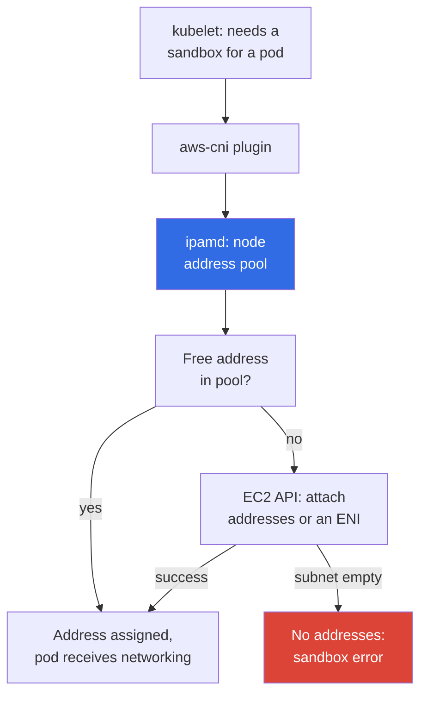
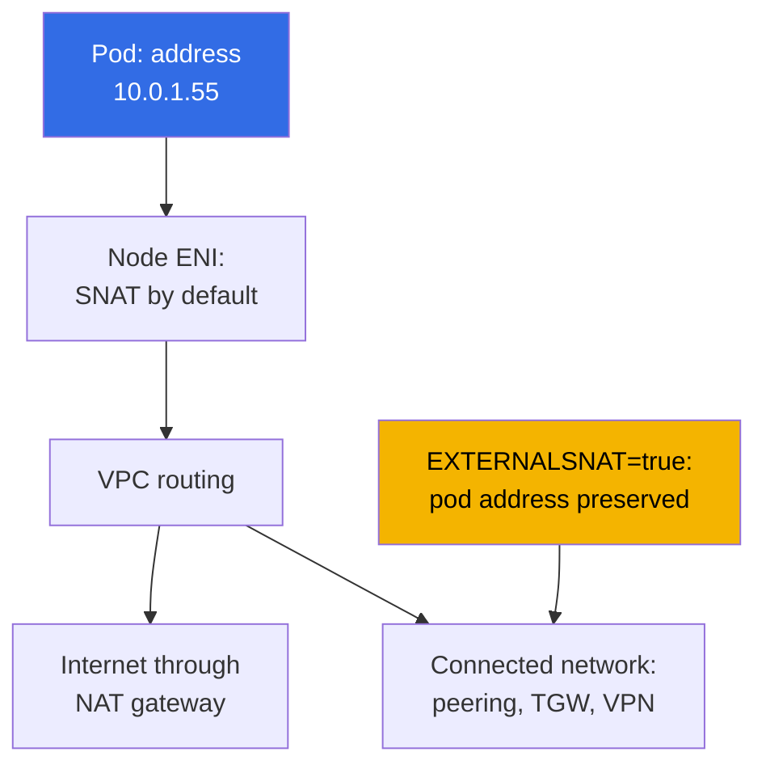

[Русская версия](ru.md) · [Versión en español](es.md) · [Version française](fr.md) · [Deutsche Version](de.md) · [ქართული ვერსია](ge.md) · [繁體中文版](tw.md) · [日本語版](jp.md)
# Chapter 6. Cluster networking: VPC CNI, ENI and IP addresses, CIDR planning

> **What is next.** The cluster is created (Chapter 4), access is configured (Chapter 5), and pods are starting.
> Then it becomes clear that networking in EKS is not like kubeadm with an overlay plugin: pod addresses
> are real, come from a VPC subnet, and are finite. This chapter explains how VPC CNI assigns these
> addresses, where the per-node pod limit comes from, how the warm-address pool consumes the subnet,
> and how to calculate CIDR before pods start hanging in `ContainerCreating`. Solutions to address
> exhaustion are in Chapter 7, and alternative CNIs are in Chapter 8.

## 6.1. “A pod will not start even though the node has free CPU and memory”

The cluster has been running for six months, and nodes are at 30 percent CPU utilization. A release is deployed, and some pods
remain in `ContainerCreating`. Events show neither `ImagePullBackOff` nor `FailedScheduling`, but an
inability to assign an address:

```
Warning  FailedCreatePodSandBox  kubelet  Failed to create pod sandbox:
  plugin type="aws-cni" failed (add): add cmd: failed to assign an IP address to container
```

There is capacity on the node, and the scheduler is correct. There are no free IP addresses in the subnet: a check shows
`0` in the `AvailableIpAddressCount` column. The subnet was allocated as `/24`, with 251 available addresses,
“thirty nodes and a hundred pods, with capacity for years”. Then Karpenter arrived, sidecar containers and CI jobs
were added. The subnet cannot be expanded: **a subnet CIDR does not change after creation**. You can add
new subnets or give the VPC a secondary CIDR (Chapter 7), but the existing `/24` remains `/24`.

This problem did not exist in kubeadm: `--pod-network-cidr 10.244.0.0/16` was merely a number in
the configuration, pod addresses were virtual, and occupied nothing in the real network. In EKS every pod consumes a
**real private VPC address**, the same resource that instances, load balancers, RDS, and VPC endpoints draw from.
Address planning stops being an internal cluster concern.

## 6.2. Main point: a pod is a full VPC participant

Amazon VPC CNI assigns a pod a **secondary private IPv4 address** from the same subnet where
the node runs. It is not an address from an imaginary range and not an address behind a tunnel: from the
VPC perspective, a pod looks like another network interface. This leads to a conclusion worth saying aloud:
**there is neither encapsulation nor NAT between pods**, and traffic moves inside the VPC without VXLAN
and without a reduced MTU.

| Property | Overlay (flannel VXLAN, Calico IPIP) | VPC CNI |
|---|---|---|
| Pod address | from a virtual cluster CIDR | real VPC subnet address |
| Pod addresses outside the cluster | not routable | routable throughout the VPC |
| Encapsulation | yes, with overhead and MTU impact | no |
| Number of available addresses | virtually as many as you choose | as many as exist in the subnet |
| Security groups on pod traffic | not applicable | applicable |
| VPC Flow Logs for pod traffic | see only node addresses | see pod addresses |
| Address planning | a cluster concern | part of the organization network plan |

**A pod is directly reachable from the VPC and connected networks**: an instance outside the cluster, a resource in a peered VPC,
or a machine behind Direct Connect can open a connection directly to the pod address, so “the pod is hidden
inside the cluster” is no longer a security argument. **Security groups and NACLs apply to pod traffic**,
but the granularity is coarse: a rule covers the whole node rather than a pod (precise association is in Chapter
19, NetworkPolicy in Chapter 30). **The reverse side is in Section 6.1**: the address count is finite.

## 6.3. How it works: aws-node, ipamd, and secondary addresses

VPC CNI runs as the `aws-node` DaemonSet in `kube-system`. It has two key components:
**ipamd**, the node address-pool management daemon that talks to the EC2 API, and the **CNI plugin**, which
kubelet invokes.



The key detail is that **ipamd does not call the EC2 API when a pod is created**. It gives out an address from a
pre-collected pool because attaching an address, and especially creating an ENI, takes seconds, and doing that
in the startup critical path would delay every workload. Therefore ipamd keeps a reserve of free addresses according
to tuning variables (Section 6.5), and when the reserve runs low, attaches more and, when necessary, creates a
**new ENI** in the same subnet and AZ.

This yields two non-obvious facts. Occupied subnet addresses **do not equal the number of running pods**,
because the difference belongs to the warm pool. And all node ENIs are in the **same AZ**, so shortages are local
to an Availability Zone: `eu-central-1a` can be exhausted with thousands of free addresses in
`eu-central-1b`.

## 6.4. ENI, instance limits, and max-pods

The number of addresses on a node is not unlimited: EC2 limits how many ENIs can be attached to an
instance and how many IPv4 addresses can be placed on one ENI (Chapter 0.4). Both values depend on the
instance type, which gives the pod-limit formula. One address on each ENI belongs to the interface itself, hence
`- 1`, and `+ 2` accounts for `aws-node` and `kube-proxy` in the host network.

```
max-pods = ENI * (IPs per ENI - 1) + 2
```

| Instance type | ENI | IPs per ENI | max-pods by formula | vCPU |
|---|---|---|---|---|
| `t3.small` | 3 | 4 | 11 | 2 |
| `t3.medium` | 3 | 6 | 17 | 2 |
| `m5.xlarge` | 4 | 15 | 58 | 4 |
| `m5.4xlarge` | 8 | 30 | 234 (cap 110) | 16 |

You do not need to memorize these values. You need to obtain them and compare them with the actual node:

```bash
aws ec2 describe-instance-types --instance-types m5.xlarge \
  --query 'InstanceTypes[].NetworkInfo.[MaximumNetworkInterfaces,Ipv4AddressesPerInterface]'
kubectl describe node <node-name> | grep -A 8 'Allocatable'
kubectl get node <node-name> -o jsonpath='{.status.allocatable.pods}{"\n"}'
```

About the cap in parentheses: for managed node groups without a custom AMI, EKS writes `max-pods` into user
data itself and limits it to 110 for instances with fewer than 30 vCPUs and 250 for larger ones. Thus
`m5.4xlarge` gives 234 by the formula but receives 110 in practice. Sizing and bypassing the cap are in
Chapter 14.

The main conclusion for people coming from bare-metal Kubernetes is that **on small instances the pod ceiling is
limited by ENI, not CPU or memory**. `t3.medium` accepts at most 17 pods, and with 100m CPU pods you pay
for an instance that will never be fully used. DaemonSets also take three or four slots regardless of instance size.

## 6.5. Warm address pool: three variables and one trade-off

The node address reserve is configured with environment variables of the `aws-node` DaemonSet.

| Variable | Default | What it does |
|---|---|---|
| `WARM_ENI_TARGET` | `1` | keeps one completely free ENI worth of addresses in reserve |
| `WARM_IP_TARGET` | unset | keeps the specified number of free addresses instead of an ENI |
| `MINIMUM_IP_TARGET` | unset | lower bound of addresses allocated immediately at startup |

The ipamd algorithm is simple. Without variables, `WARM_ENI_TARGET=1` applies: the daemon keeps one
fully free spare ENI beyond occupied addresses. If `WARM_IP_TARGET` is set, ENI logic is disabled and the
daemon keeps exactly that many free addresses, attaching and handing them out one at a time.
`MINIMUM_IP_TARGET` sets a lower bound for attached addresses and allocates them in one batch at startup;
paired with `WARM_IP_TARGET`, it avoids one-address-at-a-time churn: attached addresses never fall below
the minimum, and free addresses never fall below warm.

The default deserves close attention because it is exactly what surprises users of small subnets.
`WARM_ENI_TARGET=1` means not “one free address” but **one completely free ENI**. On
`m5.xlarge` (15 addresses per ENI), a node with one pod keeps roughly two dozen addresses in reserve:
its occupied addresses plus a fully reserved interface. Twenty such nodes consume more than half of a `/24`
with only a few dozen actual pods, which is exactly how a subnet runs out “in an empty cluster”. The reasoning
is clear: AWS optimizes **pod startup speed**. The price is addresses.

```bash
kubectl set env daemonset aws-node -n kube-system WARM_IP_TARGET=5
kubectl set env daemonset aws-node -n kube-system MINIMUM_IP_TARGET=10
kubectl get ds aws-node -n kube-system \
  -o jsonpath='{.spec.template.spec.containers[0].env}' | tr ',' '\n'
```

`WARM_IP_TARGET=5` keeps five free addresses instead of a whole ENI, while `MINIMUM_IP_TARGET=10` prevents
node startup from degrading to “assign one address at a time”. The trade-off in one sentence:
**address savings are bought with pod-startup delay and more EC2 API calls**, and those calls are quota-limited
and throttled in large fleets. Leave the default with generous subnets (`/20` and wider); enable the two variables
when addresses are scarce. If VPC CNI is managed as a managed addon, configure variables through its
configuration, otherwise an addon update overwrites the change (Chapter 37).

## 6.6. CIDR planning for nodes and pods

Calculate not “how many pods exist now”, but peak address consumption:

- **node addresses** (one primary address per instance) and **pod addresses** on all nodes, including
  DaemonSets, plus the **warm pool**, which adds a noticeable increment with the default (Section 6.5);
- **rolling-update reserve**: during a Deployment update, old and new pods coexist; during node replacement,
  old and new ENIs coexist. Add **scaling reserve**: peaks, jobs, development;
- **5 addresses AWS reserves in every subnet** (Chapter 0.3): network address, gateway address, VPC DNS
  address, reserved address, and broadcast. Thus, `/24` has 251 available addresses.

| Subnet prefix | Total addresses | Available | Workload guidance |
|---|---|---|---|
| `/24` | 256 | 251 | development cluster, about ten nodes, up to one hundred pods |
| `/22` | 1024 | 1019 | small production cluster, up to several hundred pods |
| `/20` | 4096 | 4091 | typical production cluster with autoscaling |
| `/18` | 16384 | 16379 | large cluster or several in one VPC |

- **Allocate node subnets with capacity from the beginning**, equal in size and in at least three AZs,
  because a shortage is local to a zone. `/20` instead of `/24` when creating the VPC is a one-line
  Terraform change, but a year later it is a cluster migration.
- **Separate node and load-balancer subnets**: ALB and NLB also consume addresses in every AZ where they
  are deployed, and a growing number of Ingresses takes addresses from pods. Public `/24` subnets for load
  balancers and private `/20` subnets for nodes are a typical layout (Chapter 26).
- **The VPC CIDR must not overlap** addresses in connected networks: peering, Transit Gateway,
  VPN, and the data center (Chapter 0.3). You will discover an overlap the day connectivity is needed.

## 6.7. Service CIDR: it is not in the VPC at all

`serviceIpv4Cidr` **does not come from the VPC**: it is a virtual range inside the cluster over which
kube-proxy installs rules on nodes. Service addresses are attached to no ENI and do not reduce
`AvailableIpAddressCount`. It is set **only when creating the cluster** (Chapter 4); if omitted,
EKS chooses one itself from `10.100.0.0/16` or `172.20.0.0/16`, depending on which does not
conflict with your VPC CIDR.

```bash
aws eks describe-cluster --name demo --query 'cluster.kubernetesNetworkConfig'
kubectl -n kube-system get svc kube-dns -o jsonpath='{.spec.clusterIP}{"\n"}'
```

There is one typical problem, but it is costly: the automation checks for conflict with **your VPC**, not with
the entire connected network. If the corporate data center uses `172.20.0.0/16` and the cluster receives the
same range for Services, pods cannot contact part of the internal systems: a packet goes to Service rules instead
of the route to the data center. The only remedy is recreating the cluster with an explicit `serviceIpv4Cidr`,
which is why the range is agreed in advance, just like the VPC CIDR.


## 6.8. Pod egress and SNAT

A pod contacts an external address (the internet, S3 without a VPC endpoint, or a service in another VPC). By
default VPC CNI performs **SNAT**: it replaces the source address with the node primary address, and the packet
then follows the normal route through a NAT gateway or internet gateway (Chapter 0.3).



The behavior is changed by the `AWS_VPC_K8S_CNI_EXTERNALSNAT` variable on `aws-node`: when it is `true`, CNI
stops replacing the source address and traffic leaves with the **real pod address**.

```bash
kubectl set env daemonset aws-node -n kube-system AWS_VPC_K8S_CNI_EXTERNALSNAT=true
```

Change it when the pod address must be visible on the other side: traffic goes to a connected network through
peering, Transit Gateway, VPN, or Direct Connect, and a firewall there has address-based rules or an application
needs the real source in logs. The condition is that a return route to pod addresses must exist on the other side.
SNAT is not applied inside the VPC at all.

## 6.9. Signs of address exhaustion and diagnosis

```bash
kubectl get pods -A -o wide | grep -v Running
kubectl describe pod <pod> -n <ns> | tail -20
aws ec2 describe-subnets --filters Name=vpc-id,Values=vpc-0123456789abcdef0 \
  --query 'Subnets[].[SubnetId,AvailabilityZone,CidrBlock,AvailableIpAddressCount]' \
  --output table
```

Start with the error source. `FailedScheduling` with `Insufficient pods` means `max-pods` is exhausted
on nodes, and the subnet has nothing to do with it (Section 6.4). `FailedCreatePodSandBox` from
`aws-cni` points to the subnet: zero `AvailableIpAddressCount` in its AZ is the diagnosis. Then check
the server side:

```bash
kubectl get ds aws-node -n kube-system
kubectl logs -n kube-system -l k8s-app=aws-node -c aws-node --tail=200 | grep -i \
  -e 'insufficient' -e 'InsufficientFreeAddressesInSubnet' -e 'assign'
aws ec2 describe-network-interfaces \
  --filters Name=attachment.instance-id,Values=i-0123456789abcdef0 \
  --query 'NetworkInterfaces[].[NetworkInterfaceId,Status,length(PrivateIpAddresses)]' \
  --output table
```

`InsufficientFreeAddressesInSubnet` from the EC2 API in ipamd logs is direct confirmation. It is also worth
checking the number of interfaces: if the node already has as many ENIs as its instance type allows, new
addresses do not appear even in a non-empty subnet. A quick emergency measure is to reduce the warm pool.
Complete troubleshooting of network failures is in Chapter 46.

Reactive diagnosis is insufficient for a fleet: monitor ENI and address consumption with metrics. ipamd
publishes Prometheus metrics on port `61678`, path `/metrics` (the endpoint is enabled by default and
disabled with the `DISABLE_METRICS` variable). Key per-node gauges are:
`awscni_assigned_ip_addresses` (addresses handed to pods), `awscni_total_ip_addresses` (total attached
secondary addresses), `awscni_ip_max` (address ceiling for the instance type),
`awscni_eni_allocated` and `awscni_eni_max` (attached and maximum ENIs). The ratio of assigned to
max is the node utilization percentage, while growth of `awscni_ec2api_error_count` reveals EC2 API throttling.

```bash
kubectl -n kube-system port-forward ds/aws-node 61678:61678 &
curl -s localhost:61678/metrics \
  | grep -E 'awscni_(assigned_ip_addresses|total_ip_addresses|ip_max|eni_)'
```

`cni-metrics-helper` provides the cluster-wide view: it scrapes these endpoints from all `aws-node` pods,
aggregates them by cluster, and publishes metrics to CloudWatch (`totalIPAddresses`,
`assignIPAddresses`, `eniAllocated`, `maxIPAddresses`). Attach a utilization alert to those metrics,
rather than manually checking `AvailableIpAddressCount`.

## 6.10. Where to go from address exhaustion

Systematic solutions are in Chapter 7; this is a map of what to look for:

- **Prefix delegation**: an ENI receives `/28` prefixes instead of individual addresses. It sharply
  raises `max-pods` and reduces EC2 API calls, but consumes addresses in blocks.
- **A VPC secondary CIDR**: add a range, usually from `100.64.0.0/10` (RFC 6598), and create pod
  subnets in it.
- **Custom networking**: pods receive addresses not from their node subnet but from separate subnets
  through `ENIConfig`, usually together with a secondary CIDR. **Separate pod subnets** also remove
  address competition with nodes and load balancers.
- **Switch to an overlay CNI** as a radical option: virtual pod addresses return, but everything from the
  table in Section 6.2 goes away with them (Chapter 8).

## 6.11. How this is used in production

- **Agree on the address plan before creating the VPC**: private node subnets are `/20` or wider in
each AZ, small separate load-balancer subnets exist, `serviceIpv4Cidr` is explicitly set and checked for
conflicts with the whole connected network, not only the VPC.
- **Enable prefix delegation immediately on new clusters** (Chapter 7): it is the default approach,
  not an emergency response.
- **Monitor free addresses**: `cni-metrics-helper` provides aggregates in CloudWatch, and an alert at
  20 percent remaining `AvailableIpAddressCount` gives weeks to react (Section 6.9).
- **Select instance types with the ENI limit in mind**, not only CPU and memory: `t3.medium` with 17
  pods is almost always cost-inefficient (Chapter 14).

## 6.12. Mini glossary

- **VPC CNI**: an AWS network plugin that assigns pods real private addresses from VPC subnets; the
  `aws-node` DaemonSet in `kube-system`. **ipamd** is the daemon inside `aws-node` that manages
  the node address pool: it attaches secondary addresses and creates ENIs through the EC2 API.
- **ENI**: elastic network interface. The number of ENIs per instance and IPv4 addresses per ENI depends
  on the instance type. A **secondary private address** is an additional IPv4 address on an ENI for a pod,
  and the **warm pool** is a reserve of such addresses for startup speed. **`cni-metrics-helper`** is a
  component that scrapes `awscni_*` from `aws-node` pods and sends aggregates to CloudWatch.
- **`max-pods`**: the pod limit on a node: `ENI * (IPs per ENI - 1) + 2`, capped in managed node groups
  (110 or 250). **`serviceIpv4Cidr`** is the Service address range, virtual and unrelated to the VPC.
  **SNAT** replaces the source address with the node address for pod egress and is disabled by the
  `AWS_VPC_K8S_CNI_EXTERNALSNAT` variable.

## 6.13. Chapter summary

- A pod receives a real private address from a VPC subnet. This brings pod routability from the VPC and
  connected networks, no encapsulation or NAT between pods, applicable security groups and NACLs, and
  pod traffic visibility in VPC Flow Logs. It also has a cost: addresses are finite.
- `aws-node` and its ipamd process assign addresses: ipamd maintains a warm pool, attaches secondary
  addresses to node ENIs, and creates new ENIs in the same subnet and AZ. It gives the pod an address from
  the pool without requesting the EC2 API. The pod ceiling comes from `ENI * (IPs per ENI - 1) + 2`.
- By default, `WARM_ENI_TARGET=1` reserves a whole ENI of addresses on every node, which wastes space in
  narrow subnets. `WARM_IP_TARGET` and `MINIMUM_IP_TARGET` save addresses at the cost of pod-startup
  latency and more EC2 API calls.
- Planning requires node subnets with capacity (`/20` and wider), equal subnets in each AZ, separate
  load-balancer subnets, minus 5 AWS-reserved addresses, and recognition that a subnet CIDR cannot be
  expanded after creation. `serviceIpv4Cidr` is not in the VPC and is set only when the cluster is created.
  Diagnose shortage with pod events, `AvailableIpAddressCount` in the relevant AZ, ipamd logs, and the
  number of ENIs on the instance. Systematic solutions are in Chapter 7.

## 6.14. How this helps in real work

The question “how many pods can our cluster support” has an arithmetic answer in EKS, and you can calculate it
before a release stalls. The discussion with the network team about a new VPC changes when you bring not “give
us a subnet”, but a calculation with the number of nodes, pods, warm-pool capacity, and update reserve. The case
from the first section stops being an emergency: remaining addresses are under alerting, the warm pool can be
reduced in place, and a systematic solution can be chosen calmly.

## 6.15. Self-check questions

1. How does a pod address in EKS differ from a pod address in kubeadm with flannel, and what follows from that?
2. How do you distinguish an address shortage in a subnet from exhausted `max-pods` on nodes?
3. What does ipamd do when a pod is created, what does it do in advance, and why does it work that way?
4. Calculate `max-pods` for an instance with 4 ENIs and 15 addresses per ENI. Where do `- 1` and `+ 2` come from?
5. What exactly does `WARM_ENI_TARGET=1` reserve, and why is it dangerous in a `/24` subnet?
6. How many addresses are available in `/22`, and why is the answer not 1024?
7. You need a cluster for 500 pods in three AZs. What subnet sizes would you request, and why?
8. Is `serviceIpv4Cidr` part of the VPC address space, and when can it be changed?
9. When would you enable `AWS_VPC_K8S_CNI_EXTERNALSNAT=true`, and what is required on the other side?
10. Which ipamd metrics show address utilization on a node, and how do you collect them cluster-wide?

## Practice

The course lab for this topic is [lab 101 - cluster as code](../../labs/101/README.MD). In it, you
verify that VPC CNI assigns pods addresses from your VPC CIDR and inspect the cluster address plan; verify
with the `check_result` command. Run it with `TASK=101 make run_eks_task`.
This topic also includes [lab 103 - Address planning: ENI limits, prefix delegation, secondary
CIDR](../../labs/103/README.MD), which examines address-plan scaling in more detail.

Beyond the labs, the chapter content can be checked on a live cluster. Start with the address
plan: `aws eks describe-cluster --name <cluster> --query 'cluster.resourcesVpcConfig'` returns a
list of subnets, while `aws ec2 describe-subnets` with `--query
'Subnets[].[SubnetId,AvailabilityZone,CidrBlock,AvailableIpAddressCount]'` shows remaining capacity by
zone. Compare it with the number of pods from `kubectl get pods -A -o wide | wc -l`: the difference is the
cost of the warm pool.

Then calculate the pod ceiling: get ENIs and addresses per ENI through `aws ec2
describe-instance-types`, apply the formula, and compare it with the actual value from `kubectl get nodes -o
custom-columns='NODE:.metadata.name,PODS:.status.allocatable.pods'`. If the numbers differ, look for a
managed node group cap or enabled prefix delegation. Then inspect `kubectl get
ds aws-node -n kube-system -o yaml`: locate `WARM_ENI_TARGET`, `AWS_VPC_K8S_CNI_EXTERNALSNAT`,
and check whether `WARM_IP_TARGET` is set. Finally, compare the addresses on one node ENI from `aws ec2
describe-network-interfaces` using the `Name=attachment.instance-id` filter with its pods from `kubectl
get pods -A -o wide --field-selector spec.nodeName=<node>`.

---
[Table of contents](../README.md) · [Chapter 5](../05/en.md) · [Chapter 7](../07/en.md)
