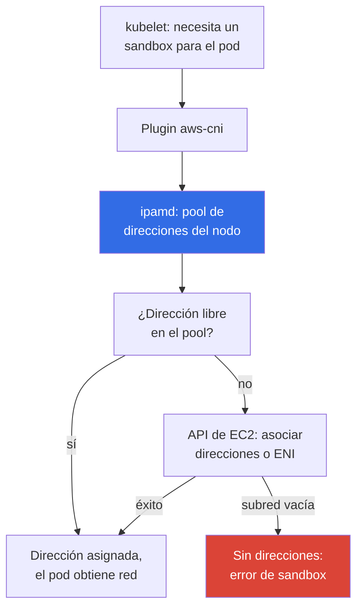
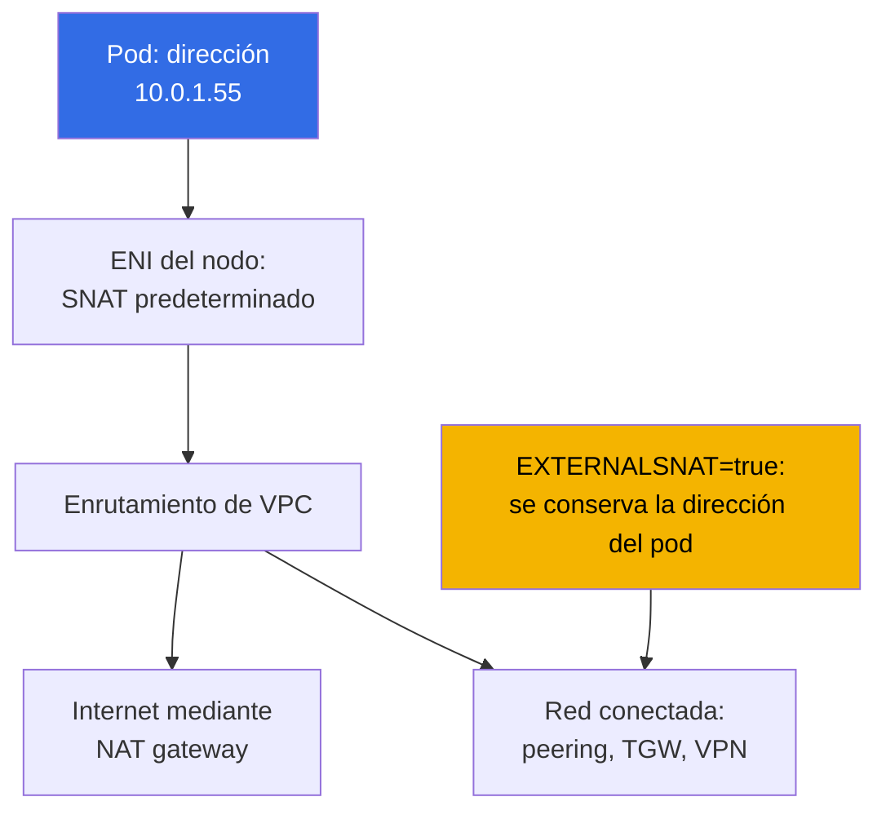

[Русская версия](ru.md) · [Eng version](en.md) · [Version française](fr.md) · [Deutsche Version](de.md) · [ქართული ვერსია](ge.md) · [繁體中文版](tw.md) · [日本語版](jp.md)
# Capítulo 6. Red del clúster: VPC CNI, ENI y direcciones IP, planificación de CIDR

> **Qué sigue.** El clúster está creado (capítulo 4), el acceso está configurado (capítulo 5) y los pods se ejecutan.
> Después se descubre que la red de EKS no funciona como kubeadm con un plugin overlay: las direcciones
> de los pods son reales, pertenecen a una subred de VPC y son limitadas. Este capítulo explica cómo VPC CNI asigna esas
> direcciones, de dónde sale el límite de pods por nodo, cómo el pool de direcciones warm consume la subred y cómo
> calcular el CIDR antes de que los pods queden bloqueados en `ContainerCreating`. Las soluciones a la escasez
> de direcciones están en el capítulo 7, y los CNI alternativos en el capítulo 8.

## 6.1. «El pod no inicia aunque haya CPU y memoria libres en el nodo»

El clúster lleva medio año en funcionamiento y los nodos están al 30 por ciento de CPU. Se despliega una versión,
y parte de los pods permanece en `ContainerCreating`. En los eventos no aparece `ImagePullBackOff` ni `FailedScheduling`,
sino la imposibilidad de asignar una dirección:

```
Warning  FailedCreatePodSandBox  kubelet  Failed to create pod sandbox:
  plugin type="aws-cni" failed (add): add cmd: failed to assign an IP address to container
```

Hay espacio en el nodo y el planificador tiene razón. No hay direcciones IP libres en la subred: la comprobación muestra
`0` en la columna `AvailableIpAddressCount`. La subred se asignó como `/24`, 251 direcciones disponibles,
«treinta nodos y cien pods, con margen para años». Después llegó Karpenter, se añadieron contenedores sidecar
y jobs de CI. Y la subred no puede ampliarse: **el CIDR de una subred no cambia después de crearla**.
Puede añadir nuevas subredes o dar a la VPC un CIDR secundario (capítulo 7), pero la `/24` existente seguirá siendo `/24`.

En kubeadm no existía este problema: `--pod-network-cidr 10.244.0.0/16` era solo un número en la
configuración, las direcciones de los pods eran virtuales y no consumían nada en la red real. En EKS, cada pod
consume una **dirección privada real de VPC**, el mismo recurso del que toman direcciones las instancias,
los balanceadores, RDS y los endpoints de VPC. El plan de direccionamiento deja de ser un asunto interno del clúster.

## 6.2. Tesis principal: el pod es un participante de pleno derecho en la VPC

Amazon VPC CNI asigna al pod una **dirección IPv4 privada secundaria** de la misma subred donde
se ejecuta el nodo. No es una dirección de un rango inventado ni una dirección detrás de un túnel: desde el punto
 de vista de la VPC, el pod parece otra interfaz de red. De aquí se sigue una conclusión que merece decirse en voz alta:
**entre pods no hay encapsulación ni NAT**, el tráfico circula dentro de la VPC sin VXLAN y sin
una MTU reducida.

| Propiedad | Overlay (flannel VXLAN, Calico IPIP) | VPC CNI |
|---|---|---|
| Dirección del pod | de un CIDR virtual del clúster | dirección real de una subred de VPC |
| Direcciones de pods fuera del clúster | no se enrutan | se enrutan por toda la VPC |
| Encapsulación | sí, con sobrecarga y MTU | no |
| Cantidad de direcciones disponibles | prácticamente tantas como imagine | tantas como haya en la subred |
| Security groups para tráfico de pods | no aplicables | aplicables |
| VPC Flow Logs sobre tráfico de pods | solo ven direcciones de nodos | ven direcciones de pods |
| Planificación de direcciones | asunto del clúster | parte del plan de red de la organización |

**El pod es accesible directamente desde la VPC y las redes conectadas**: una instancia fuera del clúster, un recurso
en una VPC con peering o una máquina detrás de Direct Connect abren una conexión directamente a la dirección del pod,
por lo que «el pod está oculto dentro del clúster» deja de ser un argumento de seguridad. **Los security groups y NACL
se aplican al tráfico de pods**, pero la granularidad es tosca: una regla para todo el nodo, no para un pod (la
asignación precisa se trata en el capítulo 19 y NetworkPolicy en el 30). **La otra cara está en la sección 6.1**:
las direcciones son finitas.

## 6.3. Cómo funciona: aws-node, ipamd y direcciones secundarias

VPC CNI funciona como el DaemonSet `aws-node` en `kube-system`. Dentro hay dos componentes clave:
**ipamd**, el demonio que administra el pool de direcciones del nodo y habla con la API de EC2, y el **plugin CNI**,
que invoca kubelet.



El detalle clave: **ipamd no consulta la API de EC2 al crear un pod**, entrega una dirección de un pool
preparado de antemano, porque asociar una dirección, y todavía más crear un ENI, son operaciones de varios segundos;
en la ruta crítica de inicio causarían retraso al arrancar cada carga. Por eso ipamd mantiene una reserva de direcciones
libres según las variables de ajuste (sección 6.5), y cuando la reserva disminuye, asocia nuevas direcciones y, si hace falta,
crea un **ENI nuevo** en la misma subred y AZ.

De aquí salen dos hechos poco evidentes. Las direcciones ocupadas en la subred **no equivalen al número de pods en ejecución**,
la diferencia va al pool warm. Y todos los ENI de un nodo están en la **misma AZ**, por lo que la escasez es local
para la zona: `eu-central-1a` puede agotarse por completo con miles de direcciones libres en
`eu-central-1b`.

## 6.4. ENI, límites de instancia y max-pods

La cantidad de direcciones por nodo no es infinita: EC2 limita cuántos ENI puede asociar a una instancia
y cuántas direcciones IPv4 pueden colgar de cada ENI (capítulo 0.4). Ambos números dependen del tipo de
instancia, de ahí la fórmula del límite de pods. Una dirección de cada ENI se usa para la propia interfaz, de ahí
`- 1`, y `+ 2` corresponde a `aws-node` y `kube-proxy` en la red del host.

```
max-pods = ENI * (IP por ENI - 1) + 2
```

| Tipo de instancia | ENI | IP por ENI | max-pods según la fórmula | vCPU |
|---|---|---|---|---|
| `t3.small` | 3 | 4 | 11 | 2 |
| `t3.medium` | 3 | 6 | 17 | 2 |
| `m5.xlarge` | 4 | 15 | 58 | 4 |
| `m5.4xlarge` | 8 | 30 | 234 (límite 110) | 16 |

No hace falta memorizar los valores, hay que poder obtenerlos y compararlos con el hecho en el nodo:

```bash
aws ec2 describe-instance-types --instance-types m5.xlarge \
  --query 'InstanceTypes[].NetworkInfo.[MaximumNetworkInterfaces,Ipv4AddressesPerInterface]'
kubectl describe node <node-name> | grep -A 8 'Allocatable'
kubectl get node <node-name> -o jsonpath='{.status.allocatable.pods}{"\n"}'
```

Sobre el límite entre paréntesis: en managed node groups sin una AMI personalizada, EKS escribe por sí mismo `max-pods` en los user
data y aplica un máximo de 110 para instancias de menos de 30 vCPU y 250 para las grandes. Es decir,
la fórmula da 234 para `m5.4xlarge`, pero en la práctica recibirá 110. El dimensionamiento y cómo superar el límite
se tratan en el capítulo 14.

La principal conclusión para quien viene de Kubernetes bare-metal: **en instancias pequeñas el techo de
pods no es CPU ni memoria, sino ENI**. `t3.medium` acepta como máximo 17 pods, y con pods de 100m de CPU
paga por una instancia que nunca llegará a cargarse. Además, los DaemonSet toman tres o cuatro plazas, sin importar el
tamaño de la instancia.

## 6.5. Pool de direcciones warm: tres variables y una concesión

El tamaño de la reserva de direcciones por nodo se establece mediante variables de entorno del DaemonSet `aws-node`.

| Variable | Valor predeterminado | Qué hace |
|---|---|---|
| `WARM_ENI_TARGET` | `1` | mantiene como reserva un ENI completo de direcciones libres |
| `WARM_IP_TARGET` | no establecida | mantiene el número indicado de direcciones libres en lugar de un ENI |
| `MINIMUM_IP_TARGET` | no establecida | límite inferior de direcciones, se asignan de inmediato al inicio |

El algoritmo de ipamd es sencillo. Sin variables actúa `WARM_ENI_TARGET=1`: el demonio mantiene un ENI de
reserva, completamente libre, por encima de las direcciones ocupadas. Si se establece `WARM_IP_TARGET`,
se desactiva la lógica de ENI y el demonio mantiene exactamente ese número de direcciones libres, asociándolas y
entregándolas una a una. `MINIMUM_IP_TARGET` fija el límite inferior de direcciones asociadas y
se asigna en un solo lote al inicio; junto a `WARM_IP_TARGET` elimina la oscilación de asignar una por una:
las asociadas no bajan del mínimo y las libres no bajan de warm.

Conviene revisar el predeterminado en detalle, porque es precisamente lo que sorprende en subredes pequeñas.
`WARM_ENI_TARGET=1` no significa «una dirección libre», sino **un ENI libre completo**. En
`m5.xlarge` (15 direcciones por ENI), un nodo con un pod mantiene en reserva alrededor de dos decenas de
direcciones: las propias ocupadas más una interfaz de reserva completa. Veinte nodos así ocupan más de
la mitad de una `/24` con solo un par de decenas de pods reales, y así es como la subred se agota «en un
clúster vacío». La lógica es comprensible: AWS optimiza la **velocidad de inicio de los pods**. El precio son
las direcciones.

```bash
kubectl set env daemonset aws-node -n kube-system WARM_IP_TARGET=5
kubectl set env daemonset aws-node -n kube-system MINIMUM_IP_TARGET=10
kubectl get ds aws-node -n kube-system \
  -o jsonpath='{.spec.template.spec.containers[0].env}' | tr ',' '\n'
```

`WARM_IP_TARGET=5` mantiene cinco direcciones libres en lugar de un ENI completo, `MINIMUM_IP_TARGET=10` evita
caer en «asignamos una dirección cada vez» al inicio del nodo. La concesión en una frase:
**el ahorro de direcciones se compra con retraso en el inicio de pods y con más llamadas a la API de EC2**, y
las llamadas tienen cuotas y se limitan con throttling en una flota grande. Se deja el valor predeterminado con subredes generosas (`/20`
y mayores); se activa el par de variables cuando faltan direcciones. Si VPC CNI se administra como un addon administrado, las variables
se establecen mediante su configuración, de lo contrario una actualización del addon sobrescribirá el cambio
(capítulo 37).

## 6.6. Planificación de CIDR para nodos y pods

No se debe calcular «cuántos pods hay ahora», sino el consumo máximo de direcciones:

- **direcciones de nodos** (una primary por instancia) y **direcciones de pods** en todos los nodos, incluidos
  los DaemonSet, más el **pool warm**, que con el valor predeterminado añade un incremento apreciable (sección 6.5);
- **margen para rolling update**: durante la actualización de un Deployment viven pods antiguos y nuevos; al sustituir
  nodos viven ENI antiguos y nuevos. Además, **margen para el escalado**: picos, jobs y desarrollo;
- **5 direcciones que AWS reserva en cada subred** (capítulo 0.3): dirección de red, dirección del
  gateway, dirección de VPC DNS, dirección reservada y broadcast. Por ello una `/24` dispone de 251.

| Prefijo de subred | Total de direcciones | Disponibles | Referencia de carga |
|---|---|---|---|
| `/24` | 256 | 251 | clúster de desarrollo, una decena de nodos, hasta cien pods |
| `/22` | 1024 | 1019 | producción pequeña, hasta varios cientos de pods |
| `/20` | 4096 | 4091 | clúster de producción típico con autoescalado |
| `/18` | 16384 | 16379 | clúster grande o varios en una VPC |

- **Las subredes para nodos se toman con margen desde el principio**, del mismo tamaño y al menos en tres AZ,
  porque la escasez es local a la zona. Un `/20` en vez de un `/24` al crear la VPC es una línea de
  Terraform, pero un año después ya es una migración de clúster.
- **Se separan las subredes para nodos y para balanceadores**: ALB y NLB también ocupan direcciones en cada
  AZ de su despliegue, y el crecimiento del número de Ingress quita direcciones a los pods. Las `/24` públicas para
  balanceadores y las `/20` privadas para nodos son una distribución habitual (capítulo 26).
- **El CIDR de VPC no debe solaparse** con las direcciones de redes conectadas: peering, Transit Gateway,
  VPN y centro de datos (capítulo 0.3). El solapamiento se descubrirá el día que se necesite conectividad.

## 6.7. CIDR de servicios: no proviene de la VPC

`serviceIpv4Cidr` **no se toma de la VPC**: es un rango virtual dentro del clúster sobre el que
kube-proxy despliega reglas en los nodos. Las direcciones de Service no están asociadas a ningún ENI y no
reducen `AvailableIpAddressCount`. Se establece **solo al crear el clúster** (capítulo
4); si se omite el campo, EKS elegirá entre `10.100.0.0/16` o `172.20.0.0/16`, según cuál no
entre en conflicto con el CIDR de su VPC.

```bash
aws eks describe-cluster --name demo --query 'cluster.kubernetesNetworkConfig'
kubectl -n kube-system get svc kube-dns -o jsonpath='{.spec.clusterIP}{"\n"}'
```

Solo hay un problema típico, pero es costoso: la automatización comprueba el conflicto con **su VPC**, no con
toda la red conectada. Si el centro de datos corporativo usa `172.20.0.0/16` y el clúster recibe ese mismo
rango para Service, los pods no podrán acceder a parte de los sistemas internos: el paquete irá a las reglas de
Service en lugar de seguir la ruta al centro de datos. Solo hay una solución: recrear el clúster con un
`serviceIpv4Cidr` explícito, por eso el rango se acuerda de antemano, igual que el CIDR de VPC.

## 6.8. Egress de pods y SNAT

Un pod accede a una dirección externa (Internet, S3 sin endpoint de VPC, un servicio en otra VPC). De forma
predeterminada VPC CNI hace **SNAT**: sustituye la dirección de origen por la dirección primary del nodo; después
el paquete sigue la ruta habitual por el NAT gateway o el internet gateway (capítulo 0.3).



El comportamiento se cambia con la variable `AWS_VPC_K8S_CNI_EXTERNALSNAT` de `aws-node`: con `true`, CNI
deja de sustituir la dirección de origen y el tráfico sale con la **dirección real del pod**.

```bash
kubectl set env daemonset aws-node -n kube-system AWS_VPC_K8S_CNI_EXTERNALSNAT=true
```

Se cambia cuando la dirección del pod debe ser visible en el otro lado: el tráfico va a una red conectada mediante
peering, Transit Gateway, VPN o Direct Connect, y allí hay un firewall con reglas por dirección, o la aplicación
necesita la fuente real en los logs. Condición: debe existir una ruta de retorno a las direcciones de los pods en
ese lado. Dentro de la VPC, SNAT no se aplica en absoluto.

## 6.9. Señales de agotamiento de direcciones y diagnóstico

```bash
kubectl get pods -A -o wide | grep -v Running
kubectl describe pod <pod> -n <ns> | tail -20
aws ec2 describe-subnets --filters Name=vpc-id,Values=vpc-0123456789abcdef0 \
  --query 'Subnets[].[SubnetId,AvailabilityZone,CidrBlock,AvailableIpAddressCount]' \
  --output table
```

Primero, el origen del error. `FailedScheduling` con `Insufficient pods` significa que se agotó
`max-pods` en los nodos, y las direcciones de la subred no intervienen (sección 6.4). `FailedCreatePodSandBox` de
`aws-cni` apunta a la subred: cero en `AvailableIpAddressCount` de su propia AZ es el diagnóstico.
Después, el lado servidor:

```bash
kubectl get ds aws-node -n kube-system
kubectl logs -n kube-system -l k8s-app=aws-node -c aws-node --tail=200 | grep -i \
  -e 'insufficient' -e 'InsufficientFreeAddressesInSubnet' -e 'assign'
aws ec2 describe-network-interfaces \
  --filters Name=attachment.instance-id,Values=i-0123456789abcdef0 \
  --query 'NetworkInterfaces[].[NetworkInterfaceId,Status,length(PrivateIpAddresses)]' \
  --output table
```

`InsufficientFreeAddressesInSubnet` de la API de EC2 en los logs de ipamd es una confirmación directa. También
conviene comprobar el número de interfaces: si ya hay tantos ENI como permite el tipo de instancia, no aparecerán
nuevas direcciones incluso en una subred no vacía. Una medida rápida en una emergencia es reducir el pool warm. El
análisis completo de fallos de red está en el capítulo 46.

La diagnóstico reactivo no basta para una flota: el consumo de ENI y direcciones se mantiene bajo métricas. ipamd
publica métricas de Prometheus en el puerto `61678`, ruta `/metrics` (el endpoint está habilitado de forma
predeterminada y se desactiva con la variable `DISABLE_METRICS`). Los contadores clave por nodo son:
`awscni_assigned_ip_addresses` (direcciones entregadas a pods), `awscni_total_ip_addresses` (total de
direcciones secundarias asociadas), `awscni_ip_max` (techo de direcciones según el tipo de instancia),
`awscni_eni_allocated` y `awscni_eni_max` (ENI asociados y máximo). La relación assigned/max es el porcentaje
de utilización del nodo, y el aumento de `awscni_ec2api_error_count` revela throttling de la API de EC2.

```bash
kubectl -n kube-system port-forward ds/aws-node 61678:61678 &
curl -s localhost:61678/metrics \
  | grep -E 'awscni_(assigned_ip_addresses|total_ip_addresses|ip_max|eni_)'
```

`cni-metrics-helper` recopila la imagen del clúster: hace scraping de estos endpoints en todos los pods
`aws-node`, agrega por clúster y publica métricas en CloudWatch (`totalIPAddresses`,
`assignIPAddresses`, `eniAllocated`, `maxIPAddresses`). Sobre estas se configura una alerta de utilización,
no sobre la comprobación manual de `AvailableIpAddressCount`.

## 6.10. Cómo salir de la escasez de direcciones

Las soluciones sistémicas viven en el capítulo 7; aquí está el mapa para saber qué buscar:

- **Prefix delegation**: ENI recibe prefijos `/28` en lugar de direcciones individuales, eleva drásticamente
  `max-pods` y reduce llamadas a la API de EC2, pero consume direcciones en bloques.
- **CIDR secundario en la VPC**: se añade un rango, normalmente de `100.64.0.0/10` (RFC 6598), y se
  crean en él subredes para pods.
- **Custom networking**: los pods reciben direcciones no de la subred de su nodo, sino de subredes separadas mediante
  `ENIConfig`, normalmente junto a un CIDR secundario. **Las subredes separadas para pods** también eliminan
  la competencia por direcciones con nodos y balanceadores.
- **Cambiar el CNI por un overlay** como opción radical: regresarán las direcciones virtuales de pods, pero
  con ellas desaparecerá todo lo indicado en la tabla de la sección 6.2 (capítulo 8).

## 6.11. Cómo se aplica en producción

- **El plan de direcciones se acuerda antes de crear la VPC**: subredes privadas `/20` y mayores para nodos en
  cada AZ, subredes pequeñas separadas para balanceadores, `serviceIpv4Cidr` definido explícitamente y comprobado
  contra toda la red conectada, no solo contra la VPC.
- **Prefix delegation se activa de inmediato en clústeres nuevos** (capítulo 7): es el predeterminado, no
  una emergencia.
- **Las direcciones libres están monitorizadas**: `cni-metrics-helper` proporciona agregados en CloudWatch, y
  una alerta al 20 por ciento restante de `AvailableIpAddressCount` deja semanas para reaccionar (sección 6.9).
- **El tipo de instancia se elige teniendo en cuenta el límite de ENI**, no solo CPU y memoria: `t3.medium`
  con 17 pods casi siempre es ineficiente en coste (capítulo 14).

## 6.12. Mini glosario

- **VPC CNI**: plugin de red de AWS que asigna a los pods direcciones privadas reales de las subredes de
  VPC; DaemonSet `aws-node` en `kube-system`. **ipamd**: demonio dentro de `aws-node` que administra el
  pool de direcciones del nodo: asocia direcciones secundarias y crea ENI mediante la API de EC2.
- **ENI**: elastic network interface; el número de ENI por instancia y de direcciones IPv4 por ENI depende del
  tipo de instancia. **Dirección privada secundaria**: dirección IPv4 adicional en un ENI para un pod, y
  **pool warm**: reserva de dichas direcciones para acelerar el inicio. **`cni-metrics-helper`**:
  componente que hace scraping de `awscni_*` desde los pods `aws-node` y envía agregados a CloudWatch.
- **`max-pods`**: límite de pods por nodo: `ENI * (IP por ENI - 1) + 2`, en managed node groups
  tiene un máximo (110 o 250). **`serviceIpv4Cidr`**: rango de direcciones Service, virtual y no
  relacionado con la VPC. **SNAT**: sustitución de la dirección origen por la dirección del nodo para el tráfico
  saliente de pods; se desactiva con la variable `AWS_VPC_K8S_CNI_EXTERNALSNAT`.

## 6.13. Resumen del capítulo

- Un pod recibe una dirección privada real de una subred de VPC: de ahí la capacidad de enrutar pods desde la VPC
  y las redes conectadas, la ausencia de encapsulación y NAT entre pods, la aplicación de security groups
  y NACL, y la visibilidad del tráfico de pods en VPC Flow Logs. De ahí también viene el coste: las direcciones son finitas.
- `aws-node` con el proceso ipamd asigna las direcciones: mantiene un pool warm, asocia direcciones secundarias
  al ENI del nodo y crea nuevos ENI en la misma subred y AZ, mientras entrega al pod una dirección del pool sin
  consultar la API de EC2. El techo de pods se obtiene con la fórmula `ENI * (IP por ENI - 1) + 2`.
- De forma predeterminada, `WARM_ENI_TARGET=1` reserva un ENI completo de direcciones en cada nodo, algo costoso
  en subredes estrechas; `WARM_IP_TARGET` y `MINIMUM_IP_TARGET` ahorran direcciones a cambio de retrasar el inicio
  de pods e incrementar el número de llamadas a la API de EC2.
- Planificación: subredes para nodos con margen (`/20` y mayores), iguales por AZ, subredes independientes
  para balanceadores, menos 5 direcciones reservadas por AWS, y el CIDR de una subred no se amplía después de crearla.
  `serviceIpv4Cidr` no proviene de la VPC y solo se establece al crear el clúster.
  Diagnóstico de escasez: eventos del pod, `AvailableIpAddressCount` en su propia AZ, logs de ipamd y número de
  ENI por instancia. Las soluciones sistémicas están en el capítulo 7.

## 6.14. Cómo sirve en el trabajo real

La pregunta «cuántos pods soportará nuestro clúster» tiene una respuesta aritmética en EKS, y puede calcularse antes
de que se bloquee un despliegue. La conversación con el equipo de red sobre una VPC nueva cambia cuando no lleva
«dennos una subred», sino un cálculo con cantidad de nodos, pods, pool warm y margen para actualizaciones. Y el caso
de la primera sección deja de ser una emergencia: el remanente de direcciones tiene alerta, el pool warm se ajusta
localmente y la solución sistémica se elige con calma.

## 6.15. Preguntas para autoevaluación

1. ¿En qué se diferencia una dirección de pod en EKS de una dirección de pod en kubeadm con flannel y qué se deduce de ello?
2. ¿Cómo distinguir la falta de direcciones en una subred del agotamiento de `max-pods` en los nodos?
3. ¿Qué hace ipamd al crear un pod, qué hace de antemano y por qué exactamente así?
4. Calcule `max-pods` para una instancia con 4 ENI y 15 direcciones por ENI. ¿De dónde salen `- 1` y `+ 2`?
5. ¿Qué reserva exactamente `WARM_ENI_TARGET=1` y por qué es peligroso en una subred `/24`?
6. ¿Cuántas direcciones hay disponibles en una `/22` y por qué no 1024?
7. Se necesita un clúster para 500 pods en tres AZ. ¿Qué tamaño de subredes pediría y por qué?
8. ¿`serviceIpv4Cidr` pertenece al espacio de direcciones de VPC y cuándo puede modificarse?
9. ¿Cuándo activaría `AWS_VPC_K8S_CNI_EXTERNALSNAT=true` y qué se necesita en el otro lado?
10. ¿Qué métricas de ipamd muestran la utilización de direcciones en un nodo y cómo recopilarlas para todo el clúster?

## Práctica

El laboratorio del curso para este tema es [laboratorio 101 - clúster como código](../../labs/101/README_ES.MD). En él
comprueba que VPC CNI asigna a los pods direcciones del CIDR de su VPC y examina el plan de direccionamiento
del clúster; la comprobación se realiza con el comando `check_result`. Se inicia con `TASK=101 make run_eks_task`.
También pertenece a este tema el [laboratorio 103 - plan de direccionamiento: límites de ENI, prefix delegation, CIDR
secundario](../../labs/103/README_ES.MD), que analiza con más detalle el escalado del plan de direccionamiento.

Además de los laboratorios, el contenido del capítulo se comprueba en un clúster activo. Empiece con el plan de
direccionamiento: `aws eks describe-cluster --name <cluster> --query 'cluster.resourcesVpcConfig'` entrega la
lista de subredes, y `aws ec2 describe-subnets` con `--query
'Subnets[].[SubnetId,AvailabilityZone,CidrBlock,AvailableIpAddressCount]'` mostrará el remanente por
zonas. Compárelo con el número de pods de `kubectl get pods -A -o wide | wc -l`: la diferencia es el coste
del pool warm.

Después calcule el techo de pods: obtenga ENI y direcciones por ENI con `aws ec2
describe-instance-types`, aplique la fórmula y compárela con el valor real de `kubectl get nodes -o
custom-columns='NODE:.metadata.name,PODS:.status.allocatable.pods'`. Si los números difieren,
busque el límite de managed node group o prefix delegation activado. A continuación consulte `kubectl get
ds aws-node -n kube-system -o yaml`: encuentre `WARM_ENI_TARGET`, `AWS_VPC_K8S_CNI_EXTERNALSNAT`
y compruebe si está definido `WARM_IP_TARGET`. Finalmente, compare las direcciones en el ENI de un nodo mediante `aws ec2
describe-network-interfaces` con el filtro `Name=attachment.instance-id` y sus pods mediante `kubectl
get pods -A -o wide --field-selector spec.nodeName=<node>`.

---
[Índice](../README_ES.md) · [Capítulo 5](../05/es.md) · [Capítulo 7](../07/es.md)
